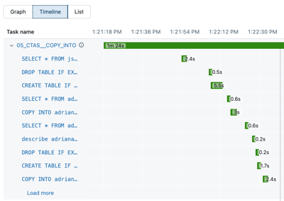
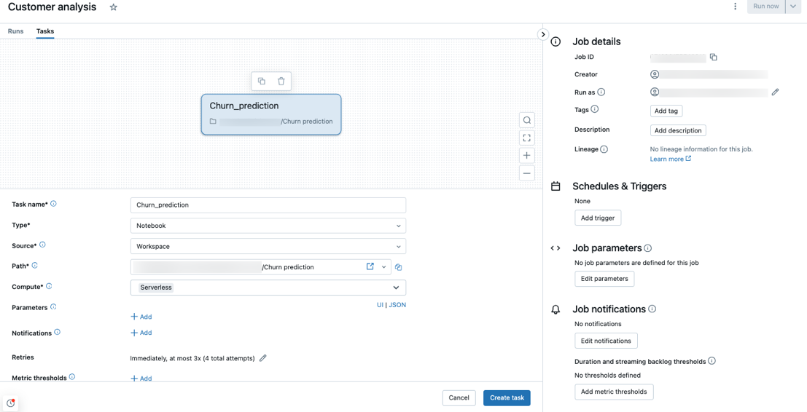
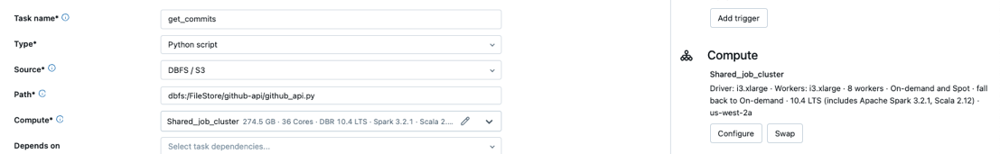

# Serverless Compute für Jobs

Serverless Compute übernimmt die Infrastrukturkonfiguration vollständig. Autoscaling und Photon sind automatisch für das Compute aktiviert, das den Job ausführt; Databricks optimiert Instanztypen und Speicher fortlaufend anhand der Workload.

## Voraussetzungen

- Unity-Catalog-aktivierter Workspace.
- Workloads kompatibel mit Standard Access Mode.

## Unterstützte Task-Typen

Notebook, Python-Skript, dbt, Python-Wheel, JAR. Beim Anlegen eines Jobs mit einem dieser Task-Typen ist Serverless Compute standardmäßig ausgewählt.

## Performance-Modi

| Modus | Eigenschaft |
|---|---|
| **Standard Performance** | geringerer Compute-Einsatz, niedrigere Kosten, für Workloads mit tolerierbarer Startlatenz von 4–6 Minuten |
| **Performance Optimized** | schnellerer Start und schnellere Ausführung für zeitkritische Workloads |

Beide nutzen dieselbe SKU mit unterschiedlichem DBU-Verbrauch.

## Konfigurationsoptionen

- Spark-Konfigurationsparameter nur auf Session-Ebene setzbar.
- High Memory für Notebook-Tasks konfigurierbar (Public Preview).
- Steuerung des Auto-Optimierungs-Retry-Verhaltens für nicht-idempotente Jobs.
- Kostenüberwachung über Billable-Usage-System-Tabellen.

## Quelle

- https://docs.databricks.com/aws/en/jobs/run-serverless-jobs
