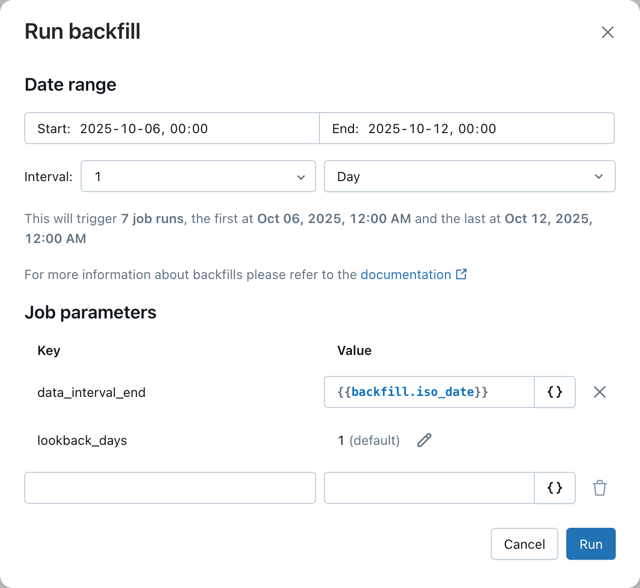

# Backfill-Jobs

Ein Backfill lässt einen bestehenden, zeitgesteuerten Job **mit derselben Automatisierung** für einen zurückliegenden Datumsbereich erneut laufen — z. B. weil ein Systemfehler Daten für einen Zeitraum ausgelassen hat, oder um historische Daten von vor Systemstart nachzuladen.

## Funktionsweise

Ein Backfill führt den Job mehrfach mit unterschiedlichen Parametern aus, um frühere Job-Läufe nachzubilden. Dazu werden Datumsbereich und Zeitintervall gewählt, die den Bereich in einzelne Läufe aufteilen. Bestehende Parameter lassen sich überschreiben oder neue hinzufügen.

**Hinweis:** Der Job muss die übergebenen Parameter korrekt verarbeiten können — ggf. sind Anpassungen am Job nötig (siehe `Wiederkehrenden Job erstellen.md`).

## Wie Datumsbereiche zu Läufen werden

Ein Backfill nutzt in der Regel dasselbe Zeitintervall wie der reguläre Job, damit bestehende Performance-Optimierungen erhalten bleiben. Die Aufteilung in mehrere Läufe erlaubt zudem parallele Ausführung. Beispiel: Fehler in der stündlichen Verarbeitung am 9. und 10. August → Backfill für diese zwei Tage mit 1-Stunden-Intervall löst bis zu 48 Läufe aus, je einer pro Stunde.

## Parallele Ausführung

Jobs haben ein Concurrency-Limit (Standard: 1). Einstellbar unter **Advanced settings** in der Job-Übersicht — Werte über 1 erlauben parallele Läufe. **Jobs mit Pipeline-Tasks können nicht parallel laufen** (Warnung wird angezeigt).

## Voraussetzung

Der Job muss einen Datums-/Zeit-Parameter unterstützen, der die korrekten Daten für den Backfill-Zeitraum auswählt.

## Backfill erstellen

1. **Jobs & Pipelines** → gewünschten Job öffnen.
2. Pfeil neben **Run now** → **Run backfill**.

3. **Date and time range** wählen.
4. Zeitintervall anpassen (Standard wird aus Trigger/Zeitplan abgeleitet), z. B. `1` `Hour`. Die Anzahl generierter Läufe wird angezeigt.

   Ergibt der Bereich über 100 Läufe, erscheint eine Warnung, und der Start ist blockiert — Bereich in mehrere Backfills aufteilen oder Intervall vergrößern.

5. Unter **Job parameters** bestehende Parameter überschreiben (z. B. `{{backfill.iso_datetime}}`) oder neue hinzufügen (z. B. `backfill` = `true`).
6. **Run** klicken.

Backfill-Läufe erscheinen in der Run-Liste mit dem Zusatz „Backfill" im Namen.

## Einschränkungen

- Backfills laufen immer vollständig — keine Teilmenge von Tasks/Tabellen möglich.
- Bei Lakeflow-Pipeline-Tasks: Pipeline-Tasks werden nicht parametrisiert (Pipeline läuft wie definiert) und nicht parallel ausgeführt — Jobs mit Pipeline-Tasks laufen sequenziell. Empfehlung: Pipelines stattdessen über die Append-Once-Funktionalität der Pipeline selbst befüllen.

## Quelle

- https://docs.databricks.com/aws/en/jobs/backfill-jobs
