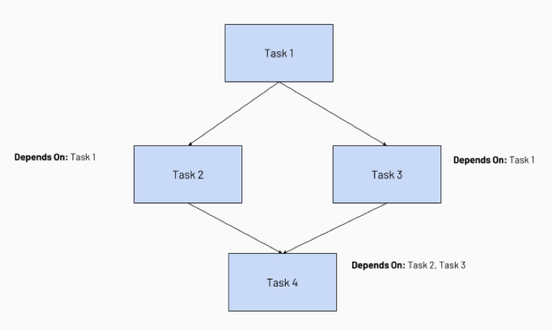
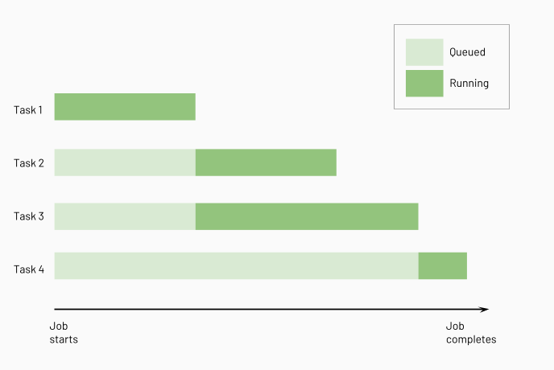

# Task-Abhängigkeiten konfigurieren (Run If)

Das Feld **Run if dependencies** steuert Kontrollfluss-Logik anhand des Ergebnisses vorgelagerter Tasks (Erfolg, Fehlschlag, Abschluss). Abhängigkeiten erscheinen als Linien im Job-DAG; Databricks führt vorgelagerte Tasks vor nachgelagerten aus und parallelisiert, wo möglich. Das Feld **Depends on** erscheint nur bei Jobs mit mehreren Tasks.





## Verwandte Kontrollfluss-Features

- **If/else-Condition-Task:** führt Job-Abschnitte anhand eines Boolean-Ausdrucks aus.
- **For-each-Task:** fügt Schleifenlogik über Eingabe-Arrays hinzu.
- **Run-Job-Task:** löst andere Workspace-Jobs aus.

## Run-if-Bedingung hinzufügen

1. Task auswählen.
2. Im Feld **Depends on** Tasks per X entfernen oder neue aus dem Dropdown wählen.
3. Bedingung unter **Run if dependencies** wählen.
4. **Save task**.

## Bedingungsoptionen

| Bedingung | Verhalten |
|---|---|
| **All succeeded** (Standard) | Alle Abhängigkeiten liefen und waren erfolgreich; sonst „Upstream failed" |
| **At least one succeeded** | Mindestens eine Abhängigkeit erfolgreich; sonst „Upstream failed" |
| **None failed** | Keine fehlgeschlagene Abhängigkeit, mindestens eine lief; sonst „Upstream failed" |
| **All done** | Läuft, sobald alle Abhängigkeiten abgeschlossen sind — unabhängig vom Status |
| **At least one failed** | Mindestens eine Abhängigkeit fehlgeschlagen; sonst „Excluded" |
| **All failed** | Alle Abhängigkeiten fehlgeschlagen; sonst „Excluded" |

## Wichtige Hinweise

- „Excluded" markierte vorgelagerte Tasks zählen in Auswertungen als erfolgreich.
- „Upstream failed" oder „Upstream canceled" zählen als fehlgeschlagen.
- Tasks mit nicht erfüllter Bedingung werden als „Excluded" markiert und übersprungen.
- Ausschluss kaskadiert entlang linearer Abhängigkeitsketten.
- Task-Abbruch propagiert nachgelagert an Fehlerbehandlungs-Tasks.
- Deaktivierte vorgelagerte Tasks lösen die Auswertung der Run-if-Bedingungen nachgelagerter Tasks entsprechend aus.

## Beispiel aus Kursmaterial: mehrere Abhängigkeiten (Fan-in)

Aus einer privaten Kursnotiz übernommen, nicht dokuverifiziert — der Code nutzt `DAJobConfig`, eine kurseigene SDK-Hilfsklasse der Databricks-Academy-Trainingsumgebung, **keine öffentliche Databricks-API**. Er illustriert aber ein reales Muster: ein Task (`customers_sales_summary`), der erst startet, wenn **beide** vorgelagerten Tasks (`ingesting_customers` und `ingesting_sales`) abgeschlossen sind — ein Fan-in über das `depends_on`-Feld mit mehreren Einträgen:

```python
job_tasks = [
        {
            'task_name': 'ingesting_orders',
            'file_path': '/Task Files/Lesson 04 Files/4.1 - Creating orders table',
            'depends_on': None
        },
        {
            'task_name': 'ingesting_sales',
            'file_path': '/Task Files/Lesson 04 Files/4.2 - Creating sales table',
            'depends_on': None
        },
        {
            'task_name': 'ingesting_customers',
            'file_path': '/Task Files/Lesson 07 Files/7.1 - Creating customers table',
            'depends_on': None
        }
        ,{
            'task_name': 'customers_sales_summary',
            'file_path': '/Task Files/Lesson 09 Files/9.1 - Joining Customers and Sales Table',
            'depends_on': [
                        {'task_key':'ingesting_customers'},
                        {'task_key': 'ingesting_sales'}
                        ]
        }
        ,{
            'task_name' : 'customers_orders_report',
            'file_path': '/Task Files/Lesson 09 Files/9.2 - Joining Customers and Orders Table',
            'depends_on': None
        }
    ]

myjob = DAJobConfig(job_name=f"Demo_09_Retail_Job_{DA.schema_name}",
                    job_tasks=job_tasks,
                    job_parameters=[
                        {'name':'catalog', 'default':'dbacademy'},
                        {'name':'schema', 'default':f'{DA.schema_name}'}
                    ])
```

In der realen Jobs-UI/-API entspricht das genau dem Feld **Depends on** mit mehreren gewählten Tasks (siehe oben) — Standardbedingung `All succeeded` bedeutet hier: `customers_sales_summary` läuft erst, wenn sowohl `ingesting_customers` als auch `ingesting_sales` erfolgreich abgeschlossen sind.

## Quelle

- https://docs.databricks.com/aws/en/jobs/run-if
