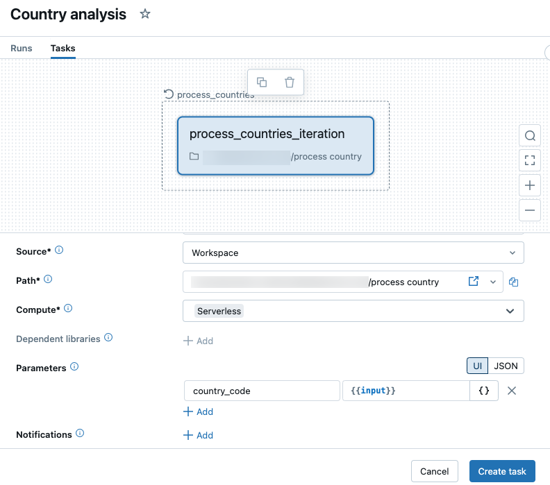
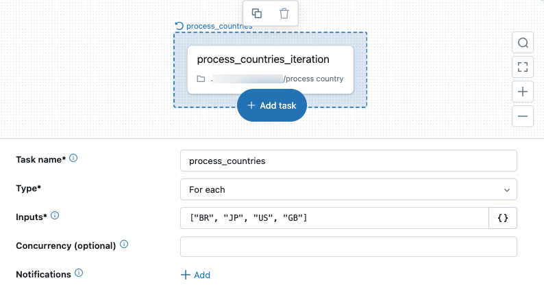
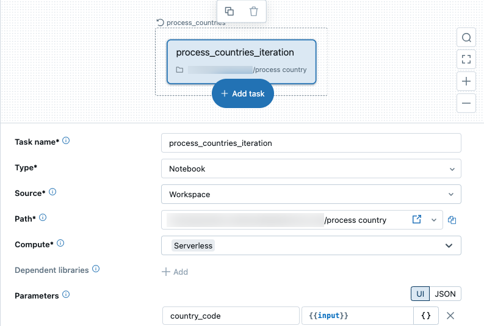

# For-Each-Task: Task in einer Schleife ausführen

Der **For-each**-Task führt einen verschachtelten Task wiederholt in einer Schleife aus, mit unterschiedlichen Parametern je Durchlauf — nützlich, um gleiche Transformationen auf mehrere Datasets anzuwenden.

## Struktur

Zwei Komponenten: der **For-each**-Task selbst und ein **verschachtelter Task** (muss ein normaler Lakeflow-Task-Typ sein, kein weiterer For-each-Task).

## Einrichtung

1. **Add task** → Typ **For each**.
2. Iterationswerte im **Inputs**-Feld als JSON-Array definieren.
3. Optional Concurrency-Limit setzen (Standard: 1).
4. Verschachtelten Task konfigurieren, der pro Iteration läuft.
5. Übergebene Parameter mit `{{input}}` bzw. `{{input.<key>}}` referenzieren.

## Parameterquellen für Inputs

| Quelle | Grenze |
|---|---|
| Direktes JSON-Array | max. 5.000 Zeichen |
| Task-Value-Referenz `{{tasks.<task_name>.values.<value_name>}}` | max. 48 KB |
| Job-Parameter `{{job.parameters.<name>}}` | max. 10.000 Zeichen |

## Einschränkung

Bei größeren Datenmengen als den Zeichengrenzen: Lookup-Tabellen verwenden statt der Werte direkt (siehe `For-Each Lookup Beispiel.md`).

## Quelle

- https://docs.databricks.com/aws/en/jobs/tasks/for-each
