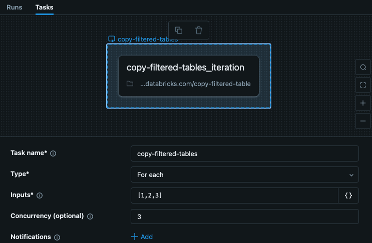
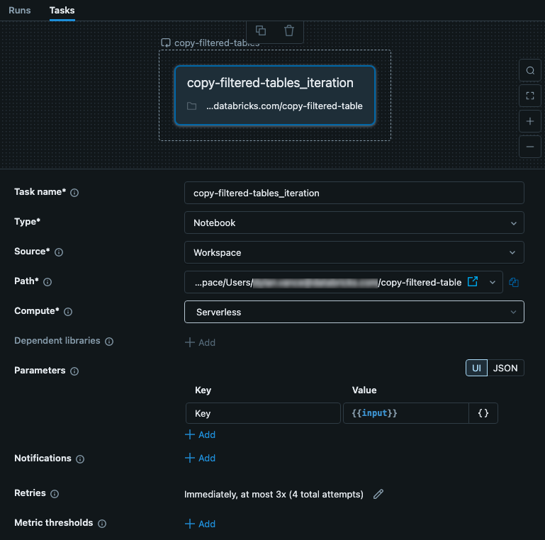

# Lookup-Tabellen für große Parameter-Arrays bei For-Each-Tasks

Da Parameter-Arrays auf 5.000 Zeichen (bzw. 48 KB bei Task-Value-Referenzen) begrenzt sind, lassen sich umfangreiche Daten nicht direkt übergeben. Empfohlener Ansatz: Task-Daten als JSON speichern und nur einen **Lookup-Key** als Task-Input übergeben.





## Beispiel-Workflow

Eine JSON-Konfigurationsdatei enthält Schritte mit zugehörigen Parametern, organisiert nach Keys. Der For-each-Task iteriert über diese Keys und übergibt sie an verschachtelte Tasks, die daraus die passenden Konfigurationsdetails abrufen.

**Konfigurationsdatei** (`/Workspace/Users/<user>/copy-filtered-table-config.json`):

```json
{
  "steps": [
    {
      "key": "table_1",
      "args": {
        "catalog": "my-catalog",
        "schema": "my-schema",
        "source_table": "raw_data_table_1",
        "destination_table": "filtered_table_1",
        "filter_column": "col_a",
        "filter_value": "value_1"
      }
    },
    {
      "key": "table_2",
      "args": {
        "catalog": "my-catalog",
        "schema": "my-schema",
        "source_table": "raw_data_table_2",
        "destination_table": "filtered_table_2",
        "filter_column": "col_b",
        "filter_value": "value_2"
      }
    },
    {
      "key": "table_3",
      "args": {
        "catalog": "my-catalog",
        "schema": "my-schema",
        "source_table": "raw_data_table_3",
        "destination_table": "filtered_table_3",
        "filter_column": "col_c",
        "filter_value": "value_3"
      }
    }
  ]
}
```

Der For-each-Task erhält als Input nur die Keys: `["table_1","table_2","table_3"]` — weit unter dem 5.000-Zeichen-Limit. Da die Schritte keine Abhängigkeiten haben, lässt sich die Concurrency über 1 setzen.

Der verschachtelte Task erhält den Key als Parameter `key` = `{{input}}` und lädt darüber die passende Konfiguration:

```python
# copy-filtered-table (iteratable task code to read a table, filter by a value, and write as a new table)
from pyspark.sql.functions import expr
from types import SimpleNamespace
import json

dbutils.widgets.text("key", "table_1", "key")

config_path = "/Workspace/Users/<user>/copy-filtered-table-config.json"
with open(config_path, "r") as file:
    config = json.loads(file.read())

key = dbutils.widgets.get("key")
current_step = next((step for step in config['steps'] if step['key'] == key), None)
if current_step is None:
    raise ValueError(f"Could not find step '{key}' in the configuration")
args = SimpleNamespace(**current_step["args"])

df = spark.read.table(f"{args.catalog}.{args.schema}.{args.source_table}") \
          .filter(expr(f"{args.filter_column} like '%{args.filter_value}%'"))

df.write.mode("overwrite").saveAsTable(f"{args.catalog}.{args.schema}.{args.destination_table}")
```

## Quelle

- https://docs.databricks.com/aws/en/jobs/tasks/for-each-lookup-example
