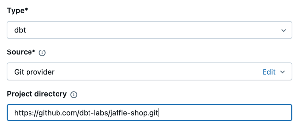
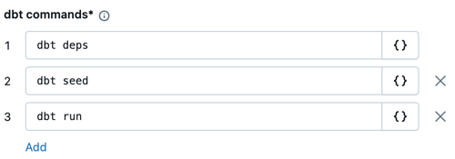
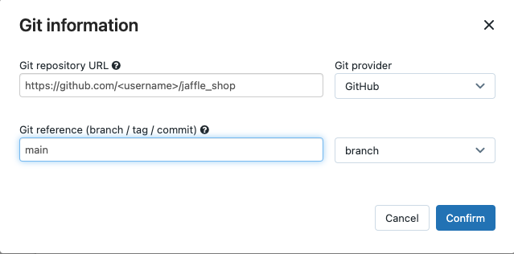

# dbt-Transformationen in Lakeflow Jobs nutzen

dbt-Core-Projekte lassen sich als Task in Jobs ausführen — mit Zeitplanung, Monitoring, Benachrichtigungen, Artefakt-Archivierung (Logs, Ergebnisse, Manifeste, Konfigurationen) und Kombination mit anderen Task-Typen (Auto Loader, Notebooks).

## Entwicklungs- vs. Produktions-Workflow

Für die Entwicklung empfiehlt Databricks, gegen SQL-Warehouses zu arbeiten (generiertes SQL testen, Query History zum Debuggen). In Produktion: dbt-Tasks in Jobs — der dbt-Python-Prozess läuft standardmäßig auf Databricks-Compute, generiertes SQL läuft gegen das gewählte SQL-Warehouse. Unterstützt: Serverless-SQL-Warehouses, Pro-SQL-Warehouses, Databricks-Compute oder jedes von dbt unterstützte Warehouse.

**Hinweis:** Entwicklung gegen SQL-Warehouses bei Produktion auf Databricks-Compute kann zu Performance- und SQL-Sprachunterschieden führen — passende Databricks-Runtime-Versionen zwischen Compute und Warehouse empfohlen.

## Voraussetzungen

- Kenntnis von dbt Core und dem `dbt-databricks`-Paket (bevorzugt gegenüber `dbt-spark`).
- dbt-Projekte in Databricks-Git-Ordnern (nicht DBFS).
- Serverless- oder Pro-SQL-Warehouses aktiviert.
- Databricks-SQL-Entitlement.

## Ersten dbt-Job erstellen (Beispiel: jaffle_shop)

1. **Jobs & Pipelines** → **Create** → **Job**.
2. Kachel **dbt** wählen.
3. Job- und Task-Namen vergeben.
4. **Source** = **Git provider**, Projektverzeichnis `https://github.com/dbt-labs/jaffle_shop.git`.

   

5. dbt-Kommandos in Reihenfolge angeben (`deps`, `seed`, `run`).

   

6. SQL-Warehouse wählen (nur Serverless/Pro).
7. Optional Catalog/Schema angeben.
8. Optional dbt-CLI-Compute anpassen.
9. **Environment and Libraries** auf `dbt-default` belassen.
10. **Save task** → **Run Now**.

## Ergebnisse prüfen

```sql
SHOW tables IN <schema>;
```

```sql
SELECT * from <schema>.customers LIMIT 10;
```

## API-Beispiel

```json
{
  "name": "jaffle_shop dbt job",
  "max_concurrent_runs": 1,
  "git_source": {
    "git_url": "https://github.com/dbt-labs/jaffle_shop",
    "git_provider": "gitHub",
    "git_branch": "main",
    "sparse_checkout": {
      "patterns": ["models", "seeds"]
    }
  },
  "job_clusters": [
    {
      "job_cluster_key": "dbt_CLI",
      "new_cluster": {
        "spark_version": "10.4.x-photon-scala2.12",
        "node_type_id": "i3.xlarge",
        "num_workers": 0,
        "spark_conf": {
          "spark.master": "local[*, 4]",
          "spark.databricks.cluster.profile": "singleNode"
        },
        "custom_tags": {
          "ResourceClass": "SingleNode"
        }
      }
    }
  ],
  "tasks": [
    {
      "task_key": "transform",
      "job_cluster_key": "dbt_CLI",
      "dbt_task": {
        "commands": ["dbt deps", "dbt seed", "dbt run"],
        "warehouse_id": "1a234b567c8de912"
      },
      "libraries": [
        {
          "pypi": {
            "package": "dbt-databricks>=1.0.0,<2.0.0"
          }
        }
      ]
    }
  ]
}
```

## dbt-Task-Ausgabe und Artefakte abrufen

Über Databricks CLI oder Jobs API — bei Multi-Task-Jobs die Task-Run-ID nutzen, nicht die übergeordnete Job-Run-ID.

| Feld | Beschreibung |
|---|---|
| `dbt_output.artifacts_link` | Download-URL für gepackte dbt-Artefakte (z. B. `dbt-output.tar.gz`) |
| `logs` | Inline-dbt-Logs des Task-Laufs |
| `logs_truncated` | ob Logs wegen Antwortgröße gekürzt wurden |
| `metadata` | Task-Run-Metadaten (Status, Timing, IDs, Konfiguration) |

```bash
databricks jobs get-run-output <task_run_id> --output JSON
```

```
GET /api/2.0/jobs/runs/get-output?run_id=<task_run_id>
```

## Fortgeschritten: Eigenes Profil nutzen

Für ein individuelles `profiles.yml` gegen SQL-Warehouse oder All-Purpose-Compute:

1. `jaffle_shop`-Repository forken, lokal klonen:

```bash
git clone https://github.com/<username>/jaffle_shop.git
```

2. `profiles.yml` anlegen:

```yaml
jaffle_shop:
  target: databricks_job
  outputs:
    databricks_job:
      type: databricks
      method: http
      schema: '<schema>'
      host: '<http-host>'
      http_path: '<http-path>'
      token: "{{ env_var('DBT_ACCESS_TOKEN') }}"
```

`<schema>`, `<http-host>` (Server Hostname des Warehouse/Compute), `<http-path>` entsprechend ersetzen. Credentials werden nicht in Dateien gespeichert — dbt-Templating fügt sie zur Laufzeit ein; generierte Credentials sind maximal 30 Tage gültig und widerrufen sich nach Abschluss automatisch.

3. Committen und pushen:

```bash
git add profiles.yml
git commit -m "adding profiles.yml for my Databricks job"
git push
```

4. Im Job: **Edit** in **Source**, Fork-Repository-Details eingeben, SQL-Warehouse auf **None (Manual)** setzen, relativen Pfad zum `profiles.yml`-Verzeichnis in **Profiles Directory** eingeben (leer = Repository-Root).

   

**Wichtig:** Catalog-/Schema-Einstellungen vor dem Wechsel zu „None (Manual)" leeren — diese sind nur mit gewähltem Warehouse setzbar.

## Fortgeschritten: dbt-Python-Modelle (Beta, dbt 1.3+)

Python-Modelle lassen sich für Databricks-Transformationen nutzen. **Einschränkung:** nicht über SQL-Warehouse ausführbar — benötigt All-Purpose- oder Job-Compute.

## Fehlerbehebung

**„Profile file does not exist":** `profiles.yml` wurde am erwarteten Pfad nicht gefunden — sicherstellen, dass es im Repository-Root liegt.

## Quelle

- https://docs.databricks.com/aws/en/jobs/how-to/use-dbt-in-workflows
