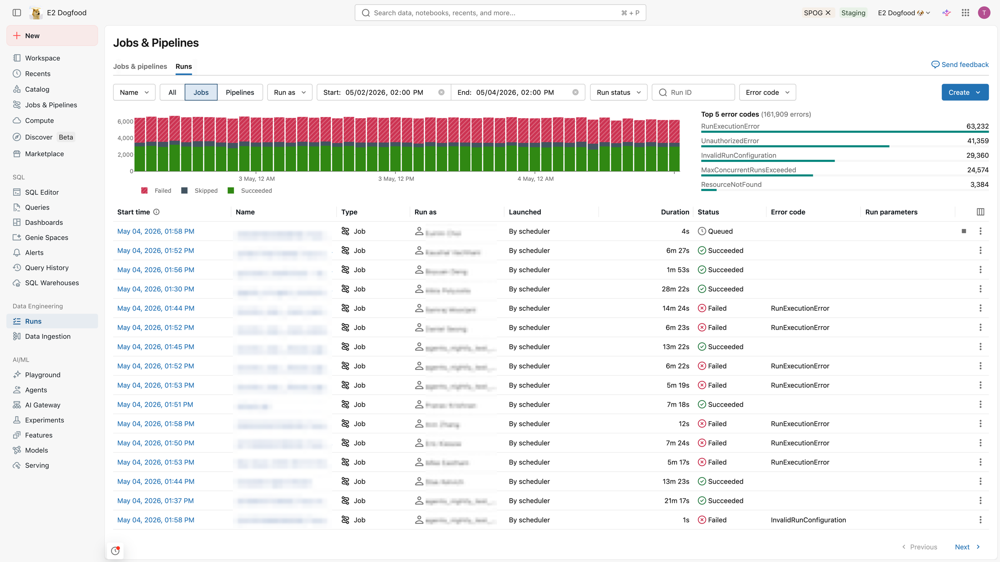
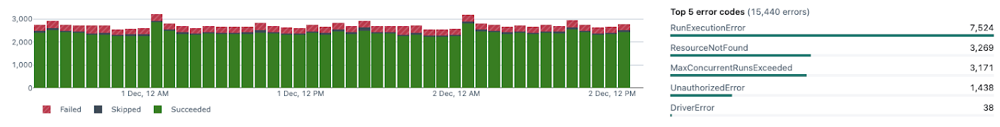
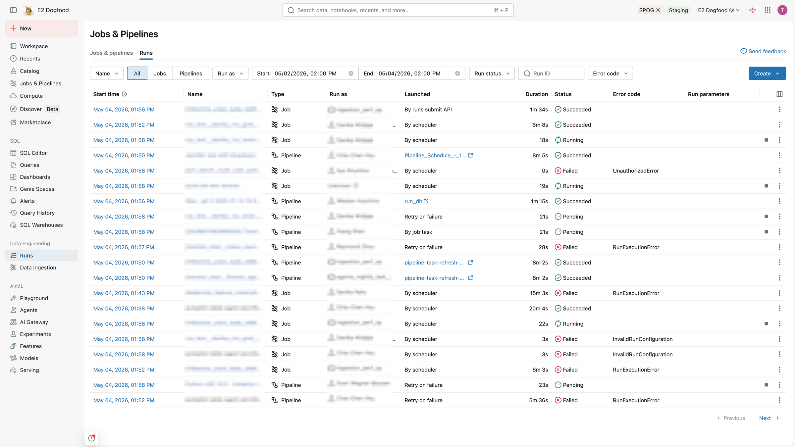
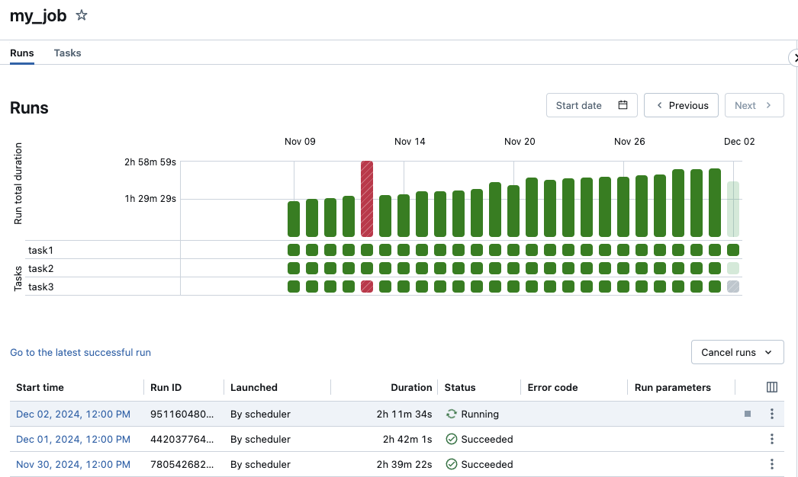
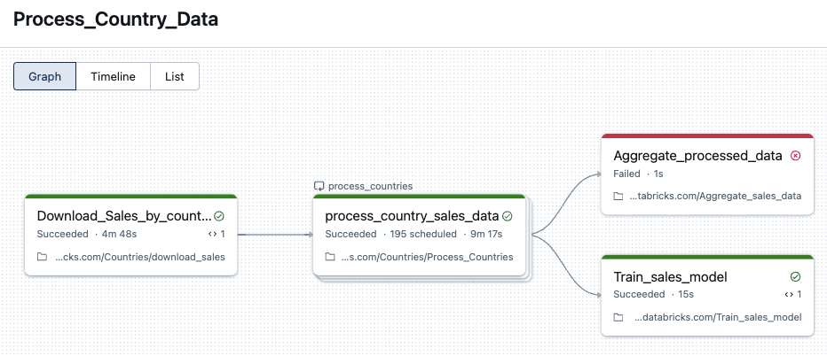
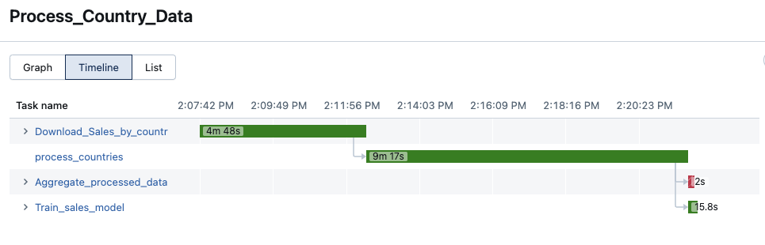
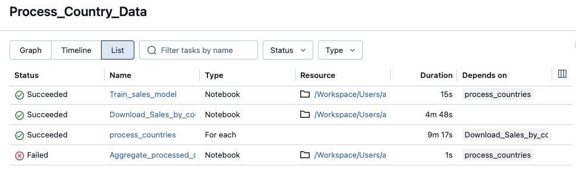
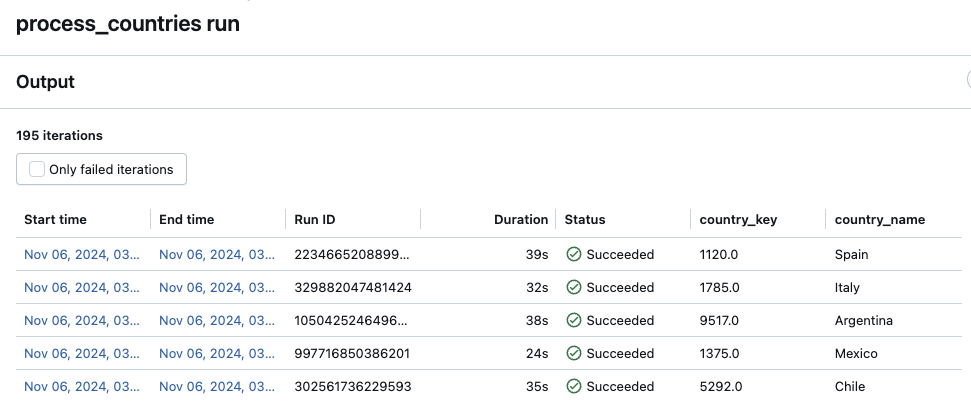

# Lakeflow Jobs überwachen

Die Databricks-UI zeigt zugängliche Jobs, Lauf-Historien und Details einzelner Läufe. CLI: `databricks jobs list -h`, `databricks jobs get -h`, `databricks jobs run-now -h`. Über das `system.lakeflow`-Schema lassen sich Job-Läufe und Task-Datensätze account-übergreifend abfragen, inkl. Integration mit Billing-Tabellen für Kosten-/Performance-Monitoring (zu System Tables allgemein siehe `Governance/Data Governance/11 Auditing und System Tables/`).

### Tabellen im `system.lakeflow`-Schema

| Tabelle | Inhalt |
|---|---|
| `jobs` | erfasst alle im Account erstellten Jobs |
| `job_tasks` | erfasst alle im Account laufenden Job-Tasks |
| `job_run_timeline` | Job-Läufe und zugehörige Metadaten |
| `job_task_run_timeline` | Task-Läufe und zugehörige Metadaten |
| `pipelines` (Public Preview) | erfasst alle im Account erstellten Lakeflow-Pipelines |
| `pipeline_update_timeline` (Public Preview) | Pipeline-Updates und zugehörige Metadaten |

Alle Tabellen unterstützen Streaming-Lesezugriff und behalten Daten kostenlos für 365 Tage; `jobs`, `job_tasks` und `pipelines` sind SCD2-Tabellen, die den jeweils aktuellsten Datensatz pro Entität unbegrenzt aufbewahren.

### Beispiel aus Kursmaterial: `system.lakeflow` abfragen

Aus einer privaten Kursnotiz übernommen, nicht dokuverifiziert — zeigt das Grundmuster, Job- und Task-Lauf-Historie direkt per SQL aus dem `system.lakeflow`-Schema abzufragen, statt über die UI zu navigieren:

```sql
-- Verfügbare Tabellen im system.lakeflow-Schema anzeigen
SHOW SCHEMAS IN system;
SHOW TABLES IN system.lakeflow;

-- Job- und Task-Lauf-Historie für einen bestimmten Job per Namensmuster verbinden
SELECT jobs.workspace_id,
        jobs.name as job_name,
        jobs.job_id,
        timeline.run_id,
        timeline.period_start_time,
        timeline.period_end_time,
        timeline.task_key,
        timeline.result_state
FROM system.lakeflow.jobs as jobs
INNER JOIN
system.lakeflow.job_task_run_timeline as timeline
ON jobs.job_id = timeline.job_id
WHERE lower(jobs.name) LIKE 'demo_12_retail_job_%'
ORDER BY timeline.period_start_time
```

`system.lakeflow.jobs` liefert die Job-Stammdaten (Name, ID, Workspace), `system.lakeflow.job_task_run_timeline` die einzelnen Task-Läufe mit Zeitfenster und Ergebnisstatus (`result_state`) — der Join darüber ergibt eine vollständige, abfragbare Lauf-Historie je Task, geeignet für eigene Dashboards oder Alerting außerhalb der Jobs-UI.

## Jobs und Pipelines ansehen

Workflows-Icon in der Sidebar → Tab **Jobs & pipelines**: listet alle zugänglichen Jobs/Pipelines mit Ersteller, Triggern und Ergebnissen der letzten fünf Läufe.


Filter: Textsuche (Name/Job-ID), Tags, Typ (Jobs/Pipelines/alle), Eigentümer, Favoriten, Run-as-Nutzer (bis zu zwei Werte).

## Aktuelle Läufe über alle Jobs/Pipelines

Tab **Runs** zeigt laufende und kürzlich abgeschlossene Läufe aller zugänglichen Jobs/Pipelines, inkl. extern ausgelöster (z. B. über Apache Airflow, Azure Data Factory).



Filter: Job-/Pipeline-Name, Typ, Pipeline-Typ (ETL, Ingestion, MV/ST, Database Table Sync), Run-as-Nutzer, Run-ID, Startzeit (letzte 48 h), Status, Fehlercode.

### Diagramm abgeschlossener Läufe

Zeigt Läufe der letzten 48 Stunden (Standard: failed, skipped, successful). Zeitraum über Filter oder Ziehen im Diagramm wählbar; „Top 5 error types"-Tabelle zeigt häufigste Fehlerursachen.



**Hinweis:** Erscheint nur bei Filterung auf Jobs oder Pipelines, nicht bei „All". Admins sehen alle Läufe; Nicht-Admins müssen „Run as" und „me" wählen.

### Runs-Liste

Zeigt Läufe der letzten 60 Tage (Standard: failed, skipped, successful) mit Startzeit, Name, Typ, Nutzername, Trigger-Quelle, Laufzeit, Status, Fehlercodes, Lauf-Parametern.



**Hinweis:** Über `runs/submit` eingereichte Läufe haben keinen zugeordneten Job-Namen — Suche über Run-ID, Run-as oder Startzeit; unterstützen keine Retries.

## Läufe eines einzelnen Jobs

**Jobs & Pipelines** → Job öffnen → Tab **Runs** mit Matrix- und Listenansicht.

**Matrixansicht:** Farbcodierung — grün: Erfolg, rot: Fehlschlag, pink: übersprungen, gelb: wartet auf Retry, grau: ausstehend/abgebrochen/timeout. Balkenhöhe zeigt Laufdauer.



**Listenansicht:** Startzeit, Lauf-ID, Trigger-Methode, Laufzeit, Status, Fehlercodes, Parameter. Aktive Läufe zeigen einen Stop-Button; Dropdown erlaubt Abbruch aktiver oder aller wartenden Läufe.

Databricks bewahrt 60 Tage Lauf-Historie — Export vor Ablauf empfohlen.

## Lauf-Details ansehen

Zeigt Output- und Log-Links, Erfolgs-/Fehlschlag-Informationen je Task. Bei Multi-Task-Jobs: Graph-, Timeline- und Listenansicht.

**Graph-Ansicht:** Klick auf Task-Knoten zeigt Metadaten (Run as, Startmethode, Zeiten, Dauer, Status), Quellcode, Cluster-Informationen mit Query-History/Log-Links, Task-Metriken.



**Timeline-Ansicht:** identifiziert lange laufende Tasks, zeigt Abhängigkeiten/Überlappungen zum Debugging. Bei Serverless-Jobs integriert sich Query-Profiling direkt in die Timeline.



**Listenansicht (Standard):** Status, Name, Typ, Ressource, Dauer, Abhängigkeiten — Spalten anpassbar, durchsuchbar, filterbar, sortierbar.



## Lauf-Status-Bestimmung

Basierend auf den Ergebnissen der Leaf-Tasks (ohne nachgelagerte Abhängigkeiten):

| Status | Bedeutung |
|---|---|
| Succeeded | alle Tasks erfolgreich |
| Succeeded with failures | einige Tasks fehlgeschlagen, aber alle Leaf-Tasks erfolgreich |
| Failed | mindestens ein Leaf-Task fehlgeschlagen |
| Skipped | Lauf wurde übersprungen |
| Timed Out | maximale Laufzeit überschritten |
| Canceled | vom Nutzer abgebrochen |

Einzelne Tasks können zudem „Disabled" zeigen (explizit oder wegen deaktivierter vorgelagerter Tasks).

## Performance-Metriken

Streaming-Task-Metriken und Serverless-Query-Performance-Metriken über Performance-Diagnose-Tools (siehe `Performance diagnostizieren.md`).

## Task-Lauf-Historie

Task auf der Job-Run-Details-Seite anklicken, Historie im Dropdown wählen.

## For-Each-Task-Lauf-Historie

Läuft als Iterationstabelle. „Only failed iterations" filtert; Start-/End-Zeiten anklicken zeigt Iterations-Output.



## Lineage-Informationen

Bei aktiviertem Unity Catalog erscheinen Upstream-/Downstream-Tabellenzahlen in Job-Details-, Job-Run-Details- oder Task-Run-Details-Panels; Links führen zu Tabellenlisten und Catalog Explorer.

## Über Declarative Automation Bundles erstellte Jobs

Standardmäßig read-only in der UI. **Disconnect from source** erlaubt Bearbeitung — Änderungen fließen nicht in die Bundle-Konfiguration zurück (manuell nachpflegen); erneutes Deployment verbindet den Job wieder.

## Lauf-Ergebnisse exportieren

**Notebook-Ergebnisse:** bei Ein-Task-Jobs **View Details** → **Export to HTML**; bei Multi-Task-Jobs zuerst den Notebook-Task anklicken.

**Lauf-Logs:** automatische Log-Zustellung nach DBFS/S3 über die Compute-Konfiguration des Jobs oder das `new_cluster.cluster_log_conf`-Objekt der Jobs-API.

## Quelle

- https://docs.databricks.com/aws/en/jobs/monitor
