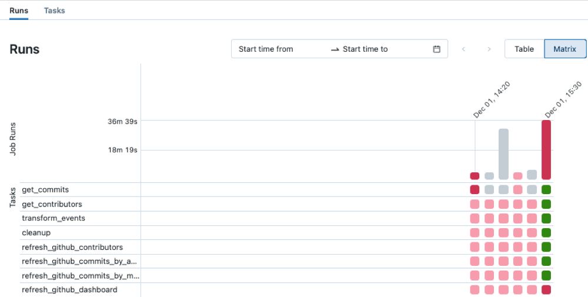
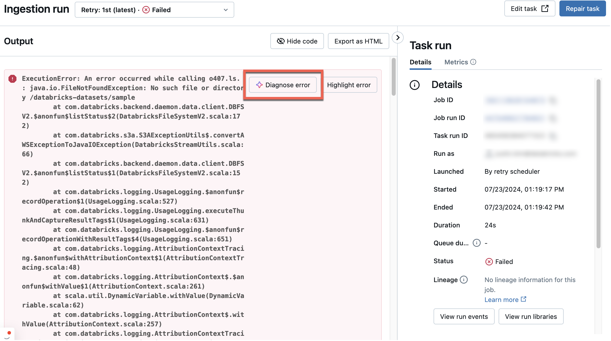

# Job-Fehlschläge diagnostizieren und reparieren

## Ursache identifizieren

1. Workflows-Icon (**Jobs & Pipelines**) in der Sidebar.
2. Job-Namen anklicken → Tab **Runs** zeigt aktive und abgeschlossene Läufe.

3. Über einen fehlgeschlagenen Task hovern: Start-/Endzeit, Status, Dauer, Cluster-Details, Fehlermeldung.
4. Fehlgeschlagenen Task anklicken → **Task run details** mit Output, Fehlermeldung, Metadaten.

## Ursache beheben

Häufige Ursachen und Abhilfen:

- **Task-Konfigurationsprobleme:** **Edit task** → Konfiguration anpassen → **Save task**.
- **Cluster-Ressourcenprobleme:** ggf. auf einen geteilten All-Purpose-Cluster wechseln; Cluster-Konfiguration über **Edit task** → **Configure** ändern (Worker-Anzahl, Instanztypen); über **Swap** auf einen anderen verfügbaren Cluster wechseln; ggf. Admin um höhere Ressourcen-Quotas bitten.
- **Maximum Concurrent Runs überschritten:** auf Abschluss anderer Läufe warten, oder über **Edit task** → **Edit concurrent runs** den Wert erhöhen.

Liegt die Ursache upstream (z. B. externe Datenquelle nicht verfügbar), lässt sich nach Behebung trotzdem die Repair-Funktion nutzen.

## Fehlgeschlagene/übersprungene Tasks erneut ausführen (Repair)

Repariert einen fehlgeschlagenen/abgebrochenen Multi-Task-Job, indem nur die nicht erfolgreichen Tasks und deren Abhängigkeiten erneut laufen — spart Zeit/Ressourcen gegenüber einem vollständigen Neustart.

Job-/Task-Einstellungen lassen sich vor dem Reparieren ändern — nicht erfolgreiche Tasks laufen dann mit den aktuellen Einstellungen.

**Wichtig:** Ein Repair führt jeden nicht erfolgreichen Task **von vorn** erneut aus. Lakeflow Jobs macht Tasks nicht automatisch idempotent — hat ein Task vor dem Fehlschlag bereits einen Teil seiner Ausgabe geschrieben, kann ein erneuter Lauf diese Daten duplizieren. Vor dem Reparieren prüfen, was jeder Task schreibt, und wo nötig idempotente Operationen (Overwrite/Merge statt Append) nutzen.

**Hinweise:**

- Teilen sich mehrere Tasks einen Job-Cluster, erstellt ein Repair-Lauf einen neuen Cluster (z. B. `my_job_cluster_v1` bei ursprünglich `my_job_cluster`) mit denselben aktuellen Einstellungen.
- Repair ist nur für Jobs mit zwei oder mehr Tasks verfügbar — bei Ein-Task-Jobs stattdessen **Run now** erneut auslösen.
- Die angezeigte **Duration** umfasst die Zeit vom Start des ersten Laufs bis zum Ende des letzten Repair-Laufs.
- Repairs nutzen den Lauf-Status jedes Tasks, nicht dessen Deaktivierungsstatus — ein deaktivierter Task lässt sich über `rerun_tasks` in der Repair-Anfrage erzwingen.

**Ablauf:**

1. Link des fehlgeschlagenen Laufs in Spalte **Start time** oder in der Matrixansicht anklicken.
2. **Repair run** klicken — der **Repair job run**-Dialog listet alle nicht erfolgreichen Tasks und deren Abhängigkeiten.
3. Optional Parameter für die zu reparierenden Tasks anpassen (überschreiben bestehende Werte; bei erneutem Repair Feld leeren, um zum Originalwert zurückzukehren).
4. **Repair run** im Dialog klicken.
5. Nach Abschluss zeigt die Matrixansicht eine neue Spalte für den Repair-Lauf — zuvor rote Tasks sollten nun grün sein.

## Fehlschläge bei Continuous Jobs

Überschreiten aufeinanderfolgende Fehlschläge eines Continuous Jobs einen Schwellenwert, nutzt Lakeflow Jobs Exponential Backoff für Retries. Im Backoff-Zustand zeigt das Job-Details-Panel: Anzahl aufeinanderfolgender Fehlschläge, Zeitraum fehlerfreien Laufs bis „erfolgreich", Zeit bis zum nächsten Retry. **Restart run** bricht den aktiven Lauf ab, setzt die Retry-Periode zurück und startet einen neuen Lauf.

## Mit Genie Code diagnostizieren

1. Fehlgeschlagenen Job in der Jobs-UI öffnen.
2. **Diagnose Error** wählen.

## Quelle

- https://docs.databricks.com/aws/en/jobs/repair-job-failures
