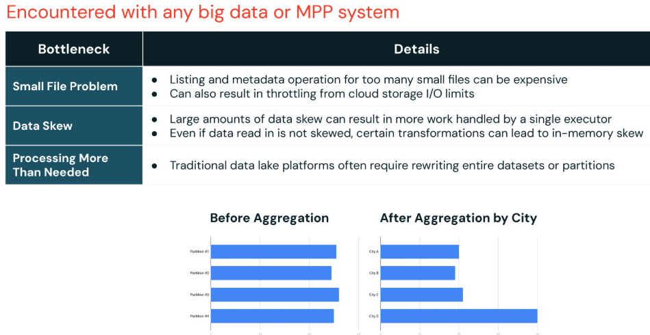
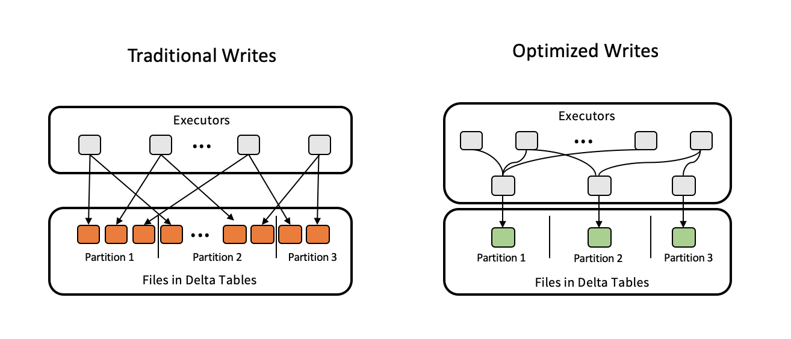
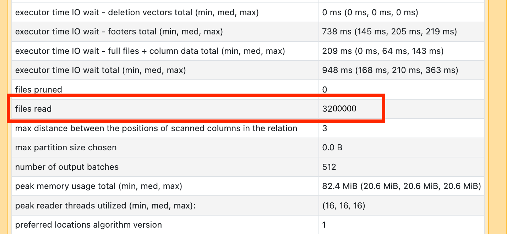
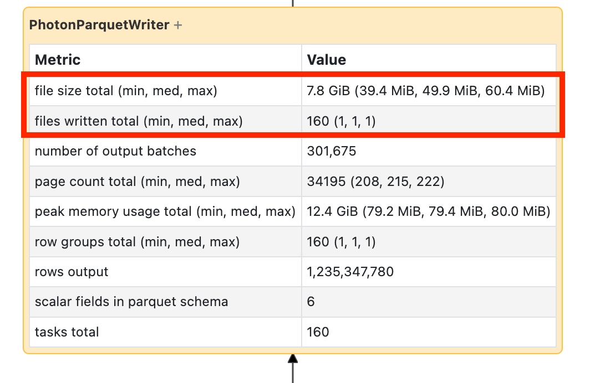

# Grundlagen der Query-Performance und das Small-File-Problem

Bevor man sich mit konkreten Layout-Techniken wie Data Skipping, Z-Ordering, Partitionierung oder Liquid Clustering beschäftigt, lohnt sich ein Blick auf die grundlegenden Faktoren, die bestimmen, warum manche Schemas und Queries schneller sind als andere — und auf das häufigste konkrete Symptom eines schlechten Datenlayouts: das Small-File-Problem. Basierend auf einer privaten Kursnotiz sowie offiziellen Databricks-Doku-Seiten und einem Engineering-Blogpost (jeweils am Ende jedes Abschnitts referenziert).

## Abschnittsübersicht

1. [Vier fundamentale Performance-Faktoren](#vier-faktoren)
2. [Häufige Performance-Engpässe](#engpaesse)
3. [Das Small-File-Problem im Detail](#small-file-problem)
4. [Auto Optimize: Optimized Writes und Auto Compaction](#auto-optimize)
5. [Automatische Dateigröße nach Tabellengröße](#auto-tuning)
6. [Predictive File Sizing (KI-gestützte Optimierung)](#predictive-file-sizing)
7. [Small-File-Problem im Spark UI diagnostizieren](#diagnose)
8. [Automatische Runtime-Optimierungen im Überblick](#automatische-optimierungen)
9. [Archivierung kalter Daten (Archival Support)](#archival)
10. [Ausblick auf die folgenden Themen](#ausblick)
11. [Zusammenfassung](#zusammenfassung)

---

## <a id="vier-faktoren">1. Vier fundamentale Performance-Faktoren</a>

Aus einer privaten Kursnotiz übernommen — warum manche Schemas und Queries schneller sind als andere, lässt sich auf vier Grundfaktoren zurückführen:

### Anzahl gelesener Bytes

Je mehr Daten gelesen werden müssen, um eine Query zu erfüllen, desto länger dauert die Query. Die Daten werden von der Festplatte gezogen, über das Netzwerk übertragen usw. Muss also auf viele Daten zugegriffen werden, um eine Query zu erfüllen, kostet das wahrscheinlich Zeit oder Rechenleistung.

### Query-Komplexität / Berechnung

Je komplexer die Query, die Berechnung, die Aggregation oder die benötigten Joins sind, desto länger dauert die Query.

### Anzahl zugegriffener Dateien

Je mehr Dateien eine Query öffnen muss, desto langsamer die Query. Jeder Dateizugriff bringt einen gewissen Overhead mit sich — muss die Datenbank auf viele Dateien zugreifen, verbringt sie möglicherweise mehr Zeit mit dem Overhead des Öffnens und Schließens von Dateien als mit der eigentlichen Datenverarbeitung. Dieses Prinzip ist spezifisch für Datenbanken, die ihre Daten über mehrere Dateien verteilt speichern (wie Databricks), aber andere Datenbanksysteme haben oft ein Äquivalent (Dateisystem-Blöcke usw.).

### Parallelität

In MPP-Systemen (Massively Parallel Processing) wie Databricks ist die Fähigkeit, Berechnungen parallel auszuführen, entscheidend, um die Taktzeit einer Query zu verringern.

**Offizielle Ergänzung:** Databricks parallelisiert SQL-Queries automatisch über alle Knoten eines Clusters — die Engines Apache Spark und Photon analysieren die Queries, bestimmen den optimalen Weg zur parallelen Ausführung und verwalten die verteilte Ausführung resilient. Lineare Skalierbarkeit — das Verhältnis von Durchsatz zu eingesetzten Ressourcen bleibt proportional — ist dabei nur möglich, wenn die parallelen Tasks voneinander unabhängig sind.

**Zum Verhältnis von Dateigröße und Query-Typ:** Große Dateien sind effizienter für Scan-Queries, kleinere Dateien eignen sich besser für punktuelle Suchen, da weniger Daten gelesen werden müssen, um bestimmte Zeilen zu finden.

### Quellen

- Private Kursnotiz
- https://docs.databricks.com/aws/en/lakehouse-architecture/performance-efficiency/best-practices

---

## <a id="engpaesse">2. Häufige Performance-Engpässe</a>

Aus einer privaten Kursnotiz übernommen — drei wiederkehrende Muster, die die Performance in der Praxis am stärksten beeinträchtigen:

1. **Small-File-Problem:** Sind Daten über viele winzige Dateien verstreut, verlangsamt das Öffnen und Netzwerktransferieren dieser Dateien Queries — und kann sogar I/O-Throttling durch den Cloud-Anbieter auslösen. Die Lösung ist **Auto Optimize** (siehe Abschnitt 4).

2. **Data Skew:** Eine Partition ist deutlich größer als andere, oder Transformationen erzeugen ein Ungleichgewicht. Da die Verarbeitung auf den langsamsten Executor wartet, kann eine einzelne große Partition den gesamten Job verzögern (ausführlich behandelt in [Data Skew.md](../Code%20Optimization/Data%20Skew.md)).

3. **Mehr Daten verarbeiten als nötig:** Anders als klassische Data Lakes, die oft ganze Datensätze neu schreiben, lassen sich mit Databricks nur die benötigten Dateien verarbeiten — Techniken wie **Data Skipping** verbessern die Performance zusätzlich (siehe [Data Skipping und Tabellenstatistiken.md](Data%20Skipping%20und%20Tabellenstatistiken.md)).



### Quelle

- Private Kursnotiz

---

## <a id="small-file-problem">3. Das Small-File-Problem im Detail</a>

- Zu viele kleine Dateien erhöhen den Overhead beim Lesen erheblich.
- Zu wenige, große Dateien reduzieren die Parallelität beim Lesen.
- **Über-Partitionierung** ist ein häufiges Problem, das zu diesem Ungleichgewicht führt (siehe [Partitioning.md](Partitioning.md)).

**Offizielle Schwellenwerte:** Werden zehntausende Dateien oder mehr gelesen bzw. geschrieben, liegt wahrscheinlich ein Small-File-Problem vor — Dateien sollten nicht kleiner als 8 MB sein. Die häufigste Ursache: Partitionierung nach zu vielen Spalten oder einer hochkardinalen Spalte.

### Quellen

- Private Kursnotiz
- https://docs.databricks.com/aws/en/optimizations/spark-ui-guide/slow-spark-stage-low-io

---

## <a id="auto-optimize">4. Auto Optimize: Optimized Writes und Auto Compaction</a>

Databricks tunt die Größe von Delta-Lake-Tabellen automatisch und kompaktiert kleine Dateien beim Schreiben automatisch über **Auto Optimize** — bestehend aus zwei zusammenspielenden Komponenten.

### 4.1 Optimize Write

Diese Komponente arbeitet dynamisch innerhalb desselben Spark-Jobs und passt Apache-Spark-Partitionsgrößen basierend auf den tatsächlichen Daten an. Ziel ist es, für jede Tabellenpartition 128-MB-Dateien zu erzeugen. Dieser Ansatz adressiert nicht nur das „Small-File-Problem", sondern optimiert auch die Datenverteilung innerhalb des Spark-Jobs selbst.

**Offiziell bestätigt:** Optimized Writes verbessern die Dateigröße bereits beim Schreiben und sind am effektivsten für partitionierte Tabellen, da sie die Anzahl kleiner Dateien je Partition reduzieren. Standardmäßig aktiviert für `MERGE`-, `UPDATE`- und `DELETE`-Operationen.

```sql
-- Über Tabelleneigenschaft aktivieren
ALTER TABLE table_name SET TBLPROPERTIES (delta.autoOptimize.optimizeWrite = true);
```

```python
# Über Session-Konfiguration aktivieren
spark.conf.set("spark.databricks.delta.optimizeWrite.enabled", "true")
```

**Hinweis:** Da Daten vor dem Schreiben geshuffelt werden, kann die Schreiblatenz steigen — das Schreiben weniger, großer Dateien ist jedoch effizienter als das Schreiben vieler kleiner Dateien.

**Iceberg-Äquivalent:** `spark.databricks.iceberg.optimizeWrite.enabled` (Session-Ebene). Für beide Formate gilt: Optimized Writes sind standardmäßig aktiviert für `MERGE`, `UPDATE` mit Subqueries, `DELETE` mit Subqueries sowie — auf SQL-Warehouses bzw. für Unity-Catalog-Managed-Tables ab Runtime 13.3 LTS+ — auch für `CTAS`- und (bei partitionierten Tabellen) `INSERT`-Statements.

**Empfehlung:** Bei aktivierten Optimized Writes von manuellem `coalesce(n)` oder `repartition(n)` unmittelbar vor dem Schreiben absehen, um die Dateianzahl zu steuern — das unterläuft die automatische Optimierung.

### 4.2 Auto Compact

Nach Abschluss des Spark-Jobs geht Auto Compact einen Schritt weiter: Es startet einen neuen Job, der prüft, ob zusätzliche Komprimierung angewendet werden kann, mit dem Ziel, eine standardisierte 128-MB-Dateigröße zu erreichen. Dieser Nachbearbeitungsschritt sorgt dafür, dass die Daten effizient organisiert und kompakt bleiben.

**Offiziell bestätigt:** Auto Compaction fasst kleine Dateien innerhalb von Tabellenpartitionen zusammen, läuft synchron auf dem schreibenden Cluster, nach erfolgreichem Abschluss des Schreibvorgangs, und kompaktiert nur Dateien, die noch nicht kompaktiert wurden.

```sql
-- Über Tabelleneigenschaft aktivieren
ALTER TABLE table_name SET TBLPROPERTIES (delta.autoOptimize.autoCompact = true);
```

```python
# Über Session-Konfiguration aktivieren
spark.conf.set("spark.databricks.delta.autoCompact.enabled", "auto")
```

**Weitere Konfigurationsparameter:**

| Parameter | Zweck |
|---|---|
| `spark.databricks.delta.autoCompact.maxFileSize` (Iceberg: `spark.databricks.iceberg.autoCompact.maxFileSize`) | maximale Dateigröße für Auto Compaction |
| `spark.databricks.delta.autoCompact.minNumFiles` (Iceberg: `spark.databricks.iceberg.autoCompact.minNumFiles`) | Mindestanzahl an Dateien, die Auto Compaction auslöst |

**Akzeptierte Werte für beide Features:** `auto` (empfohlen, dynamische Größenwahl), `legacy` (Alias für `true`), `true` (feste 128 MB, kein dynamisches Tuning), `false` (deaktiviert, auf Session-Ebene übersteuerbar).

**Diagnose im Verlauf:** In `DESCRIBE HISTORY` erscheint automatisches Auto Compaction als `OPTIMIZE`-Eintrag mit `operationParameters.auto = true`; ein manuell ausgelöster `OPTIMIZE`-Lauf zeigt dort `auto = false`.

### 4.3 Zusammenfassung des Zusammenspiels

Die Nutzung von Auto Optimize gemeinsam mit durchdachtem Partitions-Management hilft, große, dateibasierte Datenmengen effizient zu handhaben und das Small-File-Problem zu vermeiden — ohne dass manuell eingegriffen werden muss.

### Quellen

- Private Kursnotiz
- https://docs.databricks.com/aws/en/tables/tune-file-size
- https://docs.databricks.com/aws/en/delta/optimize

---

## <a id="auto-tuning">5. Automatische Dateigröße nach Tabellengröße</a>

Über die Ziel-Dateigröße (`delta.targetFileSize`-Tabelleneigenschaft) hinaus tunt Databricks die Dateigröße automatisch anhand der Tabellengröße:

| Tabellengröße | Ziel-Dateigröße |
|---|---|
| unter 2,56 TB | 256 MB |
| 2,56–10 TB | linear steigend von 256 MB auf 1 GB |
| über 10 TB | 1 GB |

```sql
-- Feste Ziel-Dateigröße explizit setzen (überschreibt Auto-Tuning; Iceberg: iceberg.targetFileSize)
ALTER TABLE table_name SET TBLPROPERTIES (delta.targetFileSize = '100mb');
```

**Wichtig beim Wachstum der Zielgröße:** Wächst die automatisch getunte Zielgröße mit der Tabelle (z. B. von 256 MB auf 1 GB), werden bereits existierende, kleinere Dateien dadurch **nicht** automatisch durch `OPTIMIZE` neu zusammengeführt — wer gezielt auch ältere kleinere Dateien vergrößern will, muss `delta.targetFileSize` explizit fest setzen. Bei Tabellen über 1 TB empfiehlt Databricks, `OPTIMIZE` regelmäßig geplant auszuführen, um Dateien weiter zu konsolidieren. Für Unity-Catalog-Managed-Tables greift automatisches Dateigrößen-Tuning ohnehin — manuelle Tuning-Empfehlungen sind dort meist nicht nötig, nur `OPTIMIZE` selbst respektiert ein gesetztes `targetFileSize` weiterhin.

**Zusätzlich:** `spark.sql.files.maxRecordsPerFile` (bzw. die `maxRecordsPerFile`-Option des DataFrameWriter) verhindert, dass bei sehr schmalen Datensätzen die Zeilen-Obergrenze des Parquet-Formats überschritten wird — Werte ≤ 0 bedeuten „kein Limit". Databricks rät von der Nutzung ab, außer wenn nötig (z. B. bei sehr schmalen Unity-Catalog-Managed-Tables).



### Quelle

- https://docs.databricks.com/aws/en/tables/tune-file-size

---

## <a id="predictive-file-sizing">6. Predictive File Sizing (KI-gestützte Optimierung)</a>

Über die regelbasierte Auto-Tuning-Logik aus Abschnitt 5 hinaus nutzt Databricks für Unity-Catalog-Managed-Tables ein KI-gestütztes Verfahren mit drei Komponenten:

1. **Predictive Modeling:** Mithilfe von Daten aus Tausenden Produktions-Deployments wurde ein Modell entwickelt, das die ideale Dateigröße anhand von Faktoren wie Tabellengröße und Lese-/Schreibverhalten bestimmt.
2. **Write-Optimierung:** Das System verbessert das Schreiben von Dateien durch Daten-Shuffling bei partitionierten Tabellen und Task-Coalescing bei unpartitionierten Tabellen — Ergebnis: eine **6-fache Steigerung** der durchschnittlichen Größe eingelesener Dateien.
3. **Background Compaction:** Ein asynchroner Prozess kompaktiert untergroße Dateien während ungenutzter Cluster-Zeit, ohne die Schreib-Performance zu beeinträchtigen, und handhabt gleichzeitige Schreibvorgänge besser als frühere Auto-Compaction-Implementierungen.

**Benchmark (Unity Catalog Managed Tables, Databricks SQL, 1-TB-Datensätze, realistische Data-Warehousing-Workloads mit inkrementeller Ingestion über kleine Dateien):**

- Query-Performance-Verbesserung: **bis zu 2,2x**
- Ermittelte ideale Dateigröße für typische 1-TB-Tabellen: **64–100 MB**

**Voraussetzungen:** Databricks SQL oder Databricks Runtime 11.3+, Unity Catalog Managed Tables (Unterstützung für External Tables war zum Zeitpunkt der Veröffentlichung in Vorbereitung).

### Quelle

- https://www.databricks.com/blog/how-databricks-improved-query-performance

---

## <a id="diagnose">7. Small-File-Problem im Spark UI diagnostizieren</a>

Slow-Running-Stages mit geringem I/O können auf ein Small-File-Problem hindeuten — der SQL-DAG ist das primäre Diagnosewerkzeug.

**Beim Lesen:**

- Scan-Operatoren im SQL-DAG öffnen und die Metrik „number of files read" prüfen.
- Schwellenwert: zehntausende Dateien oder mehr.



**Beim Schreiben:**

- Write-Operatoren öffnen und „number of files" sowie die geschriebene Datenmenge prüfen.
- Dieselben Schwellenwerte und Ursachen wie beim Lesen.



**Empfohlene Abhilfen (Lesen wie Schreiben):**

- `OPTIMIZE` auf Delta-Tabellen ausführen.
- Predictive Optimization aktivieren (siehe [Liquid Clustering.md](Liquid%20Clustering.md), Abschnitt zu Predictive Optimization).
- Datei-Layout-Strategie überdenken.
- Beim Schreiben zusätzlich: Optimized Writes aktivieren (siehe Abschnitt 4.1).

### Quelle

- https://docs.databricks.com/aws/en/optimizations/spark-ui-guide/slow-spark-stage-low-io

---

## <a id="automatische-optimierungen">8. Automatische Runtime-Optimierungen im Überblick</a>

Über das Small-File-Problem hinaus liefert Databricks eine Reihe automatischer Performance-Verbesserungen von Haus aus (Standard ab Databricks Runtime 10.4 LTS+):

| Optimierung | Wirkung |
|---|---|
| **Disk Caching** | beschleunigt wiederholte Lesevorgänge auf Parquet-Dateien durch lokale Kopien auf den am Compute angehängten Storage-Volumes (ausführlich behandelt in [Disk Cache.md](07%20Disk%20Cache.md)) |
| **Dynamic File Pruning** | überspringt Verzeichnisse, die keine zu den Query-Prädikaten passenden Dateien enthalten (siehe [Data Skipping und Tabellenstatistiken.md](Data%20Skipping%20und%20Tabellenstatistiken.md)) |
| **Low Shuffle Merge** | reduziert die Anzahl neu geschriebener Dateien bei `MERGE`-Operationen, wodurch nachfolgende `OPTIMIZE`-Läufe seltener nötig sind |
| **Adaptive Query Execution (AQE)** | Apache-Spark-3.0-Feature mit Performance-Gewinnen für zahlreiche Operationen (ausführlich behandelt in [Data Skew.md](../Code%20Optimization/Data%20Skew.md) und [Shuffles.md](../Code%20Optimization/Shuffles.md)) |

### Disk Caching gezielt deaktivieren (Benchmarking)

Aus einer privaten Kursnotiz: Für Benchmarks, bei denen der Effekt anderer Optimierungen isoliert sichtbar werden soll, lässt sich das Disk Caching gezielt abschalten — dann werden Dateien bei jeder Query erneut aus dem Cloud Storage gelesen statt aus der lokalen Kopie:

```python
spark.conf.set('spark.databricks.io.cache.enabled', False)
```

**Hinweis:** Funktioniert nicht auf Serverless Compute (dort schlägt der Befehl mit einem Fehler fehl) — nur auf Classic Compute nutzbar. Ausführliche Behandlung des Disk Cache (Funktionsweise, Konfiguration, Cache-Konsistenz, Vergleich zu Spark Cache) in [Disk Cache.md](07%20Disk%20Cache.md).

**Weitere empfohlene, nicht standardmäßig aktive Optimierungen:**

| Optimierung | Wirkung |
|---|---|
| **Table Cloning** | Deep- oder Shallow-Copies von Datensätzen ohne vollständiges Duplizieren der Daten |
| **Cost-Based Optimizer (CBO)** | verbessert Query-Pläne bei Multi-Join-Queries anhand von Tabellen-/Spaltenstatistiken — ausführlich in [Data Skipping und Tabellenstatistiken.md](Data%20Skipping%20und%20Tabellenstatistiken.md), Abschnitt 14 |
| **Native JSON-String-Verarbeitung** | ohne vollständiges Parsen der Strings |
| **Higher-Order-Functions statt UDFs** | vermeidet Serialisierungs-Overhead (siehe [Serialization.md](../Code%20Optimization/Serialization.md)) |
| **Range-Join-Tuning** | manuelles Tuning der Bin-Größe für Point-in-Interval-/Interval-Overlap-Joins — ausführlich in [Data Skipping und Tabellenstatistiken.md](Data%20Skipping%20und%20Tabellenstatistiken.md), Abschnitt 12 |
| **Full-Text-Search-Indexes** (Beta) | beschleunigt Substring-/Wort-Suche in Textspalten — ausführlich in [Data Skipping und Tabellenstatistiken.md](Data%20Skipping%20und%20Tabellenstatistiken.md), Abschnitt 13 |

**Optionale, bewusst zu wählende Verhaltensweisen:**

- **Isolation-Level-Anpassung** — `Serializable` statt des Standards `WriteSerializable` erzwingt maximale Lesekonsistenz, kann aber den nebenläufigen Durchsatz reduzieren (ausführlich in [Liquid Clustering.md](Liquid%20Clustering.md), Abschnitt 9.1).
- **Predictive I/O bzw. Liquid Clustering statt der inzwischen veralteten Bloom-Filter-Indizes** (siehe [Data Skipping und Tabellenstatistiken.md](Data%20Skipping%20und%20Tabellenstatistiken.md), Abschnitte 8–9).

### Quelle

- https://docs.databricks.com/aws/en/optimizations

---

## <a id="archival">9. Archivierung kalter Daten (Archival Support)</a>

Ergänzend zu den Layout-Optimierungen für aktiv genutzte Daten adressiert **Archival Support** (Public Preview) das andere Ende des Datenlebenszyklus: Tabellen, deren Dateien über Cloud-Lifecycle-Policies in kostengünstigen, aber langsam abrufbaren Storage-Tiers (z. B. S3 Glacier Deep Archive/Flexible Retrieval) verschoben werden.

**Warum das nötig ist:** Ohne Archival Support würden Operationen auf einer Tabelle mit archivierten Dateien fehlschlagen oder unerwartet lange dauern, sobald Spark versucht, eine bereits ins Archiv verschobene Datei zu lesen. Archival Support führt Optimierungen ein, um das Abfragen archivierter Daten nach Möglichkeit von vornherein zu vermeiden, und ermöglicht **frühes Fehlschlagen mit aussagekräftigen Fehlermeldungen** — Nutzer können sich so schnell anpassen und die Query erneut ausführen, statt stille Fehlschläge oder verschwendete Rechenzeit zu erleben. Databricks gibt **niemals** Ergebnisse für Queries zurück, die archivierte Dateien benötigen, um ein korrektes Ergebnis zu liefern — die Query schlägt stattdessen mit einem Fehler fehl, statt unvollständige Daten zurückzugeben.

**Voraussetzung:** Databricks Runtime 13.3 LTS oder höher; funktioniert nicht mit Runtime 12.2 LTS oder älter.

### Aktivierung

```sql
ALTER TABLE <table_name> SET TBLPROPERTIES(delta.timeUntilArchived = 'X days');
```

Der Parameter `delta.timeUntilArchived` gibt die Aufbewahrungsfrist an, passend zur eigenen Cloud-Lifecycle-Policy (z. B. `'90 days'`).

### Archivierte Dateien einsehen

```sql
SHOW ARCHIVED FILES FOR table_name [ WHERE predicate ];
```

### Dateien wiederherstellen

Databricks stellt archivierte Dateien **nicht selbst** wieder her — dafür müssen die Restore-Object-APIs des jeweiligen Cloud-Anbieters genutzt werden (bei AWS: die S3-Restore-Object-APIs, um Dateien in einen schnell abrufbaren Storage-Tier zurückzuholen). Nach der Wiederherstellung in der Cloud-Storage erkennt Archival Support die wiederhergestellten Dateien automatisch, sobald die Tabelle erneut abgefragt wird.

### Quelle

- https://docs.databricks.com/aws/en/optimizations/archive-delta

---

## <a id="ausblick">10. Ausblick auf die folgenden Themen</a>

Aus einer privaten Kursnotiz — Vorschau auf die Techniken, die in den folgenden Dateien im Detail behandelt werden:

- **Data Skipping** — siehe [Data Skipping und Tabellenstatistiken.md](Data%20Skipping%20und%20Tabellenstatistiken.md)
- **Z-Ordering** — siehe [Z-Ordering.md](Z-Ordering.md)
- **Partitionierungs-Herausforderungen** — siehe [Partitioning.md](Partitioning.md)
- **Liquid Clustering mit Predictive Optimization** — siehe [Liquid Clustering.md](Liquid%20Clustering.md)

### Quelle

- Private Kursnotiz

---

## <a id="zusammenfassung">11. Zusammenfassung</a>

- Vier Grundfaktoren bestimmen Query-Performance: Anzahl gelesener Bytes, Query-Komplexität, Anzahl zugegriffener Dateien, verfügbare Parallelität.
- Die drei häufigsten Performance-Engpässe sind das Small-File-Problem, Data Skew und das Verarbeiten von mehr Daten als nötig.
- **Auto Optimize** besteht aus zwei komplementären Mechanismen: **Optimize Write** (dynamische Partitionsgrößen-Anpassung während des Spark-Jobs) und **Auto Compact** (nachgelagerte Kompaktierung nach Job-Abschluss) — beide zielen standardmäßig auf 128-MB-Dateien, beide mit eigenen Iceberg-Konfigurationsparametern neben den Delta-Äquivalenten; auto-kompaktierte `OPTIMIZE`-Läufe lassen sich in `DESCRIBE HISTORY` über `operationParameters.auto = true` von manuellen unterscheiden.
- Databricks tunt Ziel-Dateigrößen zusätzlich automatisch anhand der Tabellengröße (256 MB bis 1 GB) und nutzt bei Unity-Catalog-Managed-Tables ein KI-gestütztes Predictive-File-Sizing-Verfahren mit bis zu 2,2x Query-Performance-Verbesserung. Bereits existierende kleinere Dateien wachsen dabei nicht automatisch mit — dafür ist ein explizit gesetztes `targetFileSize` bzw. ein manueller `OPTIMIZE`-Lauf nötig.
- Das Small-File-Problem lässt sich im Spark UI über die Metriken „number of files read/written" der Scan-/Write-Operatoren im SQL-DAG diagnostizieren — Schwellenwert: zehntausende Dateien bzw. Dateien unter 8 MB.
- Über das Small-File-Problem hinaus liefert Databricks eine Reihe automatischer Runtime-Optimierungen (Disk Caching, Dynamic File Pruning, Low Shuffle Merge, AQE) sowie empfohlene, nicht standardmäßig aktive Optimierungen (Table Cloning, Cost-Based Optimizer, Higher-Order-Functions, Range-Join-Tuning, Full-Text-Search-Indexes), die größtenteils ohne manuelles Eingreifen wirken.
- **Archival Support** schließt den Datenlebenszyklus ab: Tabellen mit über Cloud-Lifecycle-Policies archivierten Dateien (z. B. S3 Glacier) lassen sich weiterhin sicher abfragen — Queries, die archivierte Dateien benötigen, schlagen früh und aussagekräftig fehl, statt unvollständige Ergebnisse zurückzugeben.
