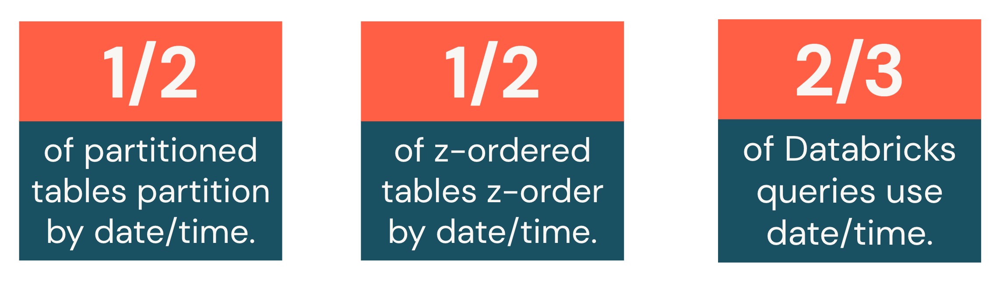
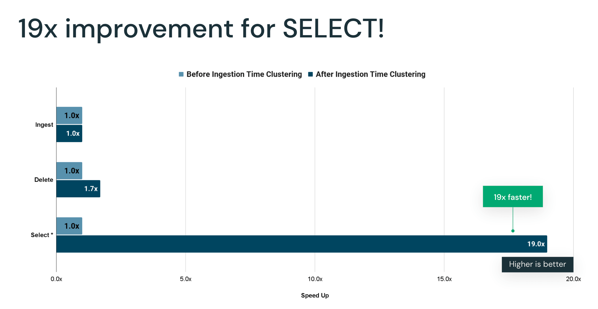

# Partitioning

Partitionierung ist die klassische Technik zur Organisation großer Tabellen — und zugleich eine der am häufigsten falsch eingesetzten. Dieses Dokument behandelt, wann Partitionierung sinnvoll ist, welche Fallstricke sie birgt, und warum Databricks für die meisten neuen Tabellen inzwischen Alternativen empfiehlt. Basierend auf einer privaten Kursnotiz sowie offiziellen Databricks-Doku-Seiten und einem Engineering-Blogpost (jeweils am Ende jedes Abschnitts referenziert).

## Abschnittsübersicht

1. [Was ist Partitionierung?](#was-ist)
2. [Sinnvolle Anwendungsfälle](#anwendungsfaelle)
3. [Best Practices bei der Partitionswahl](#best-practices)
4. [Über-Partitionierung: das Kernproblem](#ueber-partitionierung)
5. [Code-Beispiel: Tabelle partitionieren](#code-beispiel)
6. [Partitionen inspizieren: SHOW PARTITIONS und DESCRIBE HISTORY](#inspizieren)
7. [Ingestion Time Clustering: die automatische Alternative](#ingestion-time-clustering)
8. [Unterstützte Datentypen](#datentypen)
9. [Technische Rahmenbedingungen](#technische-constraints)
10. [Delta-Lake-Best-Practices für partitionierte Tabellen](#delta-best-practices)
11. [Zusammenfassung](#zusammenfassung)

---

## <a id="was-ist">1. Was ist Partitionierung?</a>

Aus einer privaten Kursnotiz übernommen: Partitionierung ist eine klassische Technik zur Organisation von Daten, die es Spark erlaubt, unnötige Dateien zu überspringen, indem Daten nach bestimmten Spalten segmentiert werden. Databricks rät jedoch generell von Partitionierung ab, **da sie oft überstrapaziert oder falsch angewendet wird** — mit Folgen wie:

- einer **Wucherung kleiner Dateien** oder
- **ungleichmäßig verteilten Daten (Data Skew)**.

### Quelle

- Private Kursnotiz

---

## <a id="anwendungsfaelle">2. Sinnvolle Anwendungsfälle</a>

Trotz dieser Nachteile kann Partitionierung in bestimmten Fällen nützlich sein:

- **Isolierung von Daten für getrennte Schemas** (Single-zu-Multiplexing).
- **GDPR/CCPA-Anwendungsfälle**, bei denen üblicherweise der Inhalt einer ganzen Partition gelöscht wird.
- **Anwendungsfälle, die eine physische Grenze zur Datenisolierung benötigen** — etwa SCD Type 2, wo nach „aktuell" oder „nicht aktuell" partitioniert wird, um die Performance zu verbessern.

**Hinweis zum GDPR/CCPA-Anwendungsfall:** Die offizielle GDPR-Compliance-Doku von Databricks empfiehlt primär zeilenweises Löschen über `DELETE`/`MERGE` mit Deletion Vectors, Materialized Views und `skipChangeCommits` bei Streaming-Quellen — nicht primär partitionsbasiertes Löschen. Der im Kursmaterial genannte Anwendungsfall (Löschen einer ganzen Partition) bleibt dennoch ein valider Grund für gezielte Partitionierung, wenn Löschanfragen sich zuverlässig auf eine physische Partitionsgrenze abbilden lassen (z. B. Löschung nach Erstellungsdatum in klar abgegrenzten Zeiträumen).

### Quellen

- Private Kursnotiz
- https://docs.databricks.com/aws/en/security/privacy/gdpr-delta

---

## <a id="best-practices">3. Best Practices bei der Partitionswahl</a>

Wird Partitionierung tatsächlich benötigt, gilt:

- Eine Spalte mit **niedriger Kardinalität** (wenige eindeutige Werte) wählen, um die Erzeugung vieler winziger Dateien zu vermeiden.
- Jede Partition sollte **weniger als 1 TB und mehr als 1 GB** groß sein.
- Besonders hilfreich für Tabellen, die voraussichtlich über ein Terabyte wachsen.
- **Üblicherweise nach einem Datum** partitionieren.
- **Z-Ordering** lässt sich zusätzlich mit Partitionierung kombinieren, um Queries zu optimieren, die häufig genutzte Spalten in WHERE-Klauseln filtern (siehe [Z-Ordering.md](Z-Ordering.md)).

**Offizielle Bestätigung und Präzisierung der Größenschwellen:**

| Tabellengröße | Empfehlung |
|---|---|
| unter 1 TB | **nicht** partitionieren |
| 1 TB bis 100 TB | Liquid Clustering statt Partitionierung nutzen |
| über 100 TB | Partitionierung kann helfen, aber Liquid Clustering wird zuerst empfohlen |

Jede Partition sollte **mindestens 1 GB** an Daten enthalten — Tabellen mit wenigen, großen Partitionen performen tendenziell besser als solche mit vielen kleinen Partitionen.

### Quellen

- Private Kursnotiz
- https://docs.databricks.com/aws/en/tables/partitions

---

## <a id="ueber-partitionierung">4. Über-Partitionierung: das Kernproblem</a>

Viele Data Engineers partitionieren ihre Tabellen auf eine Weise, die massive Performance-Probleme verursachen kann, ohne die zukünftige Query-Performance zu verbessern — das nennt man **„Über-Partitionierung" (Over-Partitioning)**.

Während Partitionierung in manchen Szenarien nützlich sein kann, empfiehlt Databricks aktuell **Liquid Clustering** als flexibleren und effizienteren Ansatz (siehe [Liquid Clustering.md](Liquid%20Clustering.md)). Die Hauptprobleme bei Partitionierung:

- das **Risiko der Erzeugung vieler kleiner Dateien**, was den Metadaten-Overhead erhöht und Lesevorgänge verlangsamt (siehe [Grundlagen der Query-Performance.md](Grundlagen%20der%20Query-Performance.md), Abschnitt 3, zum Small-File-Problem).
- Partitionierung **kann zu Data Skew führen**, wobei manche Partitionen sehr wenig Daten enthalten und andere sehr viel — mit inkonsistenten Dateigrößen als Folge. Dieses Ungleichgewicht macht Query-Performance und -Optimierung weniger effektiv.


### Quelle

- Private Kursnotiz

---

## <a id="code-beispiel">5. Code-Beispiel: Tabelle partitionieren</a>

Aus einer privaten Kursnotiz, das Grundmuster zum Partitionieren einer Tabelle:

```python
(df
 .write
 .mode('overwrite')
 .option("overwriteSchema", "true")
 .partitionBy('id')   # nach id partitionieren
 .saveAsTable("iot_data_partitioned")
)
```

**Verifikation über `DESCRIBE HISTORY`:**

```sql
DESCRIBE HISTORY iot_data_partitioned;
```

Erwartete Ausgabe (Auszug):

- **`operationParameters`:** `{"partitionBy":"[\"id\"]","clusterBy":"[]","description":null,"isManaged":"true","properties":"{\"delta.enableDeletionVectors\":\"true\"}","statsOnLoad":"true"}`
- **`operationMetrics`:** `{"numFiles":"2500","numOutputRows":"2500","numOutputBytes":"3117045"}`

In diesem Beispiel bestätigt `operationParameters`, dass die Tabelle nach `id` partitioniert wurde, und `operationMetrics` zeigt, dass die Tabelle 2.500 Dateien enthält — eine Parquet-Datei pro eindeutiger partitionierter `id`. Dieses 1:1-Verhältnis zwischen eindeutigem Partitionswert und Dateianzahl ist ein Paradebeispiel für Über-Partitionierung bei hochkardinalen Spalten (siehe Abschnitt 4).

### Quelle

- Private Kursnotiz

---

## <a id="inspizieren">6. Partitionen inspizieren: SHOW PARTITIONS und DESCRIBE HISTORY</a>

### 6.1 `SHOW PARTITIONS`

Listet alle Partitionen einer Tabelle auf.

**Vollständige Syntax:**

```sql
SHOW PARTITIONS table_name [ PARTITION clause ]
```

**Code-Beispiele:**

```sql
-- Partitionierte Tabelle anlegen und Zeilen einfügen
USE salesdb;
CREATE TABLE customer(id INT, name STRING) PARTITIONED BY (state STRING, city STRING);
INSERT INTO customer PARTITION (state = 'CA', city = 'Fremont') VALUES (100, 'John');
INSERT INTO customer PARTITION (state = 'CA', city = 'San Jose') VALUES (200, 'Marry');
INSERT INTO customer PARTITION (state = 'AZ', city = 'Peoria') VALUES (300, 'Daniel');

-- Alle Partitionen auflisten
SHOW PARTITIONS customer;

-- Für qualifizierte Tabelle
SHOW PARTITIONS salesdb.customer;

-- Vollständige Partition-Spezifikation angeben
SHOW PARTITIONS customer PARTITION (state = 'CA', city = 'Fremont');

-- Teilweise Partition-Spezifikation angeben
SHOW PARTITIONS customer PARTITION (state = 'CA');
SHOW PARTITIONS customer PARTITION (city = 'San Jose');
```

**Aus dem Kursmaterial, ergänzendes Beispiel** (aufbauend auf der `iot_data_partitioned`-Tabelle aus Abschnitt 5):

```sql
SHOW PARTITIONS iot_data_partitioned;
```


```python
count = spark.sql("SHOW PARTITIONS iot_data_partitioned").count()
print(f"Partition count: {count}")  # Ausgabe: 2500
```

### 6.2 `DESCRIBE HISTORY`

Gibt Provenienz-Informationen zurück — einschließlich Operation, Nutzer usw. — für jeden Schreibvorgang auf eine Tabelle.

```sql
DESCRIBE HISTORY table_name
```

**Wichtig:** Der Tabellenname darf keine temporale oder Options-Spezifikation enthalten. Die Tabellenhistorie wird standardmäßig 30 Tage aufbewahrt.

### Quellen

- https://docs.databricks.com/aws/en/sql/language-manual/sql-ref-syntax-aux-show-partitions
- https://docs.databricks.com/aws/en/sql/language-manual/delta-describe-history
- Private Kursnotiz

---

## <a id="ingestion-time-clustering">7. Ingestion Time Clustering: die automatische Alternative</a>

Standardmäßig nutzt Databricks Delta Lake für alle Tabellen und **clustert Daten in unpartitionierten Tabellen automatisch nach Ingestion-Zeit** — dadurch entsteht partitionsähnliche Performance ganz ohne manuelles Tuning. Ein eigener Partitionierungsansatz sollte nur in Betracht gezogen werden, wenn er diesen Standard nachweislich übertrifft.

### 7.1 Warum das eingeführt wurde

Datenanalyse ergab: **51 % der partitionierten Tabellen sind nach Datum/Zeit partitioniert**, und **über zwei Drittel der Queries in Databricks nutzen Datum-/Zeit-Spalten als Prädikate oder Join-Keys**. Ingestion Time Clustering nutzt genau dieses Muster aus, indem es Daten standardmäßig nach Ingestion-Reihenfolge clustert — alle unpartitionierten Tabellen profitieren automatisch.



### 7.2 Wie es funktioniert

- **Automatisches Clustering ohne Konfiguration:** Die meisten Daten treffen in zeitlich geordneter Reihenfolge ein — das System nutzt das direkt aus.
- **Erhalt des Clusterings über Operationen hinweg:** Anders als klassische Optimierungen, die durch `DELETE`, `UPDATE`, `MERGE` und `OPTIMIZE` degradieren, bewahrt Ingestion Time Clustering das Clustering über diese Operationen hinweg — mithilfe der Low-Shuffle-MERGE-Implementierung (siehe [Shuffles.md](../Code%20Optimization/Shuffles.md), Abschnitt 10) und zusätzlicher Erhaltungslogik.
- **Keine Performance-Einbußen:** Das System fügt der Ingestion-Performance keinen zusätzlichen Overhead hinzu, während es dennoch Query-Beschleunigung liefert.

### 7.3 Benchmark (großer Online-Händler)

- **Ingest-Performance:** keine Verschlechterung trotz zusätzlicher Clustering-Arbeit.
- **DELETE-Operationen:** Clustering blieb erhalten, obwohl solche Operationen es normalerweise zerstören würden.
- **SELECT-Query-Performance:** durchschnittliche Verbesserung von **19x** (Szenario: Verkaufsdatensätze, die in eine Faktentabelle eingelesen werden, mit aggregierten, nach Zeitfenstern gefilterten Queries — ein gängiges analytisches Muster).



### 7.4 Verfügbarkeit und Empfehlung

- Standardmäßig aktiviert ab Databricks Runtime 11.2 und Databricks SQL (Version 2022.35+).
- Gilt automatisch für alle unpartitionierten Tabellen bei neuer Daten-Ingestion.
- **Empfehlung:** Tabellen unter 1 TB Größe nicht nach Datum-/Timestamp-Spalten partitionieren — Ingestion Time Clustering automatisch wirken lassen.

**Ergänzung für hochfrequente Änderungsoperationen:** Um Ingestion Time Clustering bei einer großen Anzahl von `UPDATE`- oder `MERGE`-Statements auf einer Tabelle zu erhalten, empfiehlt Databricks, zusätzlich Liquid Clustering auf einer Spalte einzusetzen, die der Ingestion-Reihenfolge entspricht — etwa einem Event-Timestamp oder Erstellungsdatum (siehe [Liquid Clustering.md](Liquid%20Clustering.md)).

### Quellen

- https://docs.databricks.com/aws/en/tables/partitions
- https://www.databricks.com/blog/2022/11/18/introducing-ingestion-time-clustering-dbr-112.html

---

## <a id="datentypen">8. Unterstützte Datentypen</a>

Partitionsspalten unterstützen: `Date`, `Timestamp`, `TimestampNTZ`, `Interval`, `String`, `Binary`, `Boolean`, Integer-Varianten sowie `Float`/`Double`/`Decimal`. **Nicht unterstützt** sind komplexe Typen (Structs, Maps, Arrays) sowie einzelne Struct-Felder.

### Quelle

- https://docs.databricks.com/aws/en/tables/partitions

---

## <a id="technische-constraints">9. Technische Rahmenbedingungen</a>

- **Transaktionsatomizität ist unabhängig von Partitionsgrenzen** — eine Delta-Lake-Transaktion bleibt atomar, unabhängig davon, wie viele Partitionen sie betrifft.
- **Keine Datenlokalität:** Databricks-Cluster haben keine physische Datenlokalität zum Storage — anders als bei klassischen Hadoop-Clustern bringt eine „passende" Partitionierung daher keinen Lokalitätsvorteil, sondern wirkt ausschließlich über File-/Directory-Pruning.
- **Hive-Style-Partitionierung ist kein Bestandteil des Delta-Lake-Protokolls** — für Partitionsverwaltung sollten stets die offiziellen APIs (z. B. `ALTER TABLE`, DataFrameWriter) genutzt werden, keine manuelle Verzeichnismanipulation (siehe auch Abschnitt 10.2).
- **Column Mapping** fügt Partitions-Verzeichnisnamen zufällige Präfixe hinzu — bei aktiviertem Column Mapping entsprechen physische Verzeichnisnamen also nicht mehr direkt den lesbaren Partitionswerten.

### Quelle

- https://docs.databricks.com/aws/en/tables/partitions

---

## <a id="delta-best-practices">10. Delta-Lake-Best-Practices für partitionierte Tabellen</a>

Ergänzend zu den bisherigen Abschnitten liefert die allgemeine Delta-Lake-Best-Practices-Doku weitere, direkt partitionierungsrelevante Empfehlungen.

### 10.1 Grundsätzliche Empfehlungen

- Unity-Catalog-Managed-Tables für Delta Lake und Apache Iceberg nutzen.
- Predictive Optimization für Unity-Catalog-Managed-Tables aktivieren (siehe [Liquid Clustering.md](Liquid%20Clustering.md), Abschnitt 11).
- Liquid Clustering statt Partitionierung anwenden, wo möglich (siehe [Liquid Clustering.md](Liquid%20Clustering.md)).
- Beim Löschen und Neuanlegen von Tabellen am selben Speicherort `CREATE OR REPLACE TABLE`-Statements verwenden statt `DROP TABLE` gefolgt von `CREATE TABLE`.

**Legacy-Konfigurationen bereinigen:** Beim Upgrade der Runtime empfiehlt Databricks, die meisten expliziten Legacy-Delta-Einstellungen aus Spark-Konfigurationen und Tabelleneigenschaften zu entfernen, da diese neu eingeführte Optimierungen blockieren können.

### 10.2 Automatisch von Delta Lake gehandhabte Operationen — kein manueller Eingriff nötig

- **`REFRESH TABLE`:** Tabellen spiegeln immer die aktuellen Daten wider — kein manuelles Refreshing nötig.
- **Partitionsverwaltung:** automatisches Tracking und Aktualisieren von Partitionen.
- **Einzelne Partitionen lesen:** `WHERE`-Klauseln statt manueller Partitionsangaben verwenden.
- **Dateimodifikationen:** Parquet-Dateien einer partitionierten Tabelle **niemals** manuell verändern — das riskiert Korruption der Tabelle.

### 10.3 MERGE-Performance und Partitionierung

Sechs Techniken verbessern die Geschwindigkeit von `MERGE`-Operationen auf partitionierten Tabellen — besonders relevant ist die erste:

1. **Suchraum einschränken:** Partitionsfilter zu den Match-Bedingungen hinzufügen, damit `MERGE` nicht die gesamte Tabelle scannen muss:

   ```sql
   MERGE INTO events USING updates
   ON events.date = current_date() AND events.country = 'USA'
      AND events.id = updates.id
   WHEN MATCHED THEN UPDATE SET events.data = updates.data
   ```

2. **Datei-Kompaktierung:** kleine Dateien konsolidieren, um den Lesedurchsatz zu verbessern (siehe [Grundlagen der Query-Performance.md](Grundlagen%20der%20Query-Performance.md), Abschnitt 4).
3. **Shuffle-Partitionen steuern:** `spark.sql.shuffle.partitions` anpassen, um Parallelität und Ausgabedateianzahl zu beeinflussen (siehe [Shuffles.md](../Code%20Optimization/Shuffles.md)).
4. **Optimized Writes:** reduziert die Dateivermehrung bei partitionierten Tabellen.
5. **Dateigröße tunen:** Databricks skaliert Dateigrößen automatisch relativ zur Tabellengröße (siehe [Grundlagen der Query-Performance.md](Grundlagen%20der%20Query-Performance.md), Abschnitt 5).
6. **Low Shuffle Merge:** spezialisierte MERGE-Implementierung, die Layout-Optimierungen wie Liquid Clustering erhält (ausführlich in [Shuffles.md](../Code%20Optimization/Shuffles.md), Abschnitt 10).

### 10.4 Spark-Caching-Warnung

Von Spark-Caching wird explizit abgeraten, da es:

- die Data-Skipping-Vorteile zusätzlicher Filter auf gecachten DataFrames zunichtemacht (siehe [Data Skipping und Tabellenstatistiken.md](Data%20Skipping%20und%20Tabellenstatistiken.md)), und
- zu veralteten Daten führen kann, wenn die Tabelle über einen alternativen Identifier aufgerufen wird.

### Quelle

- https://docs.databricks.com/aws/en/delta/best-practices

---

## <a id="zusammenfassung">11. Zusammenfassung</a>

- Partitionierung segmentiert Tabellendaten physisch nach ausgewählten Spalten, damit Spark ganze Verzeichnisse überspringen kann — ist aber die am häufigsten überstrapazierte Optimierungstechnik.
- Sinnvolle Anwendungsfälle sind Schema-Isolierung, GDPR/CCPA-Löschanfragen auf Partitionsebene und physische Trennung für SCD-Type-2-Muster.
- Best Practice: niedrigkardinale Spalte wählen, jede Partition zwischen 1 GB und 1 TB, meist nach Datum.
- **Über-Partitionierung** — oft durch hochkardinale Spalten verursacht — führt zu massenhaft kleinen Dateien und Data Skew, ohne die Query-Performance tatsächlich zu verbessern.
- `SHOW PARTITIONS` und `DESCRIBE HISTORY` erlauben die Inspektion bestehender Partitionierungsstrategien und deren Dateianzahl.
- **Ingestion Time Clustering** liefert seit Databricks Runtime 11.2 standardmäßig partitionsähnliche Performance für alle unpartitionierten Tabellen — ganz ohne manuelle Konfiguration, mit bis zu 19x Query-Speedup im offiziellen Benchmark. Databricks empfiehlt entsprechend, Tabellen unter 1 TB grundsätzlich **nicht** zu partitionieren.
- Bei `MERGE` auf partitionierten Tabellen ist das Einschränken des Suchraums über Partitionsfilter die wirkungsvollste Einzelmaßnahme; Delta Lake übernimmt Partitionsverwaltung und Tabellen-Refresh automatisch — manuelle Eingriffe in Parquet-Dateien oder explizites `REFRESH TABLE` sind nicht nötig und riskant.
- Technisch gilt: Transaktionsatomizität hängt nicht von Partitionsgrenzen ab, Databricks-Cluster haben keine physische Datenlokalität zum Storage, Hive-Style-Partitionierung ist kein Bestandteil des Delta-Lake-Protokolls, und Column Mapping fügt Partitionsverzeichnissen zufällige Namenspräfixe hinzu.

---

## Vertiefung: Weitere SQL-Beispiele aus dem Language Manual

### `PARTITIONED BY`- und `PARTITION`-Klausel (Sprachreferenz)

Die allgemeine Sprachreferenz definiert zwei getrennte Klauseln: `PARTITIONED BY` für die Tabellendefinition und `PARTITION` zur Adressierung konkreter Partitionen in Queries/DML. Eine Partition ist dabei eine Untermenge von Tabellenzeilen, die identische Werte für eine oder mehrere vordefinierte Partitionsspalten teilen.

```sql
-- Tabellendefinition mit mehreren Partitionsspalten
CREATE TABLE student(university STRING, major STRING, name STRING)
PARTITIONED BY (university, major);

-- Gezieltes Einfügen in eine bestimmte Partition
INSERT INTO student PARTITION(university = 'TU Kaiserslautern') (major, name)
SELECT major, name FROM freshmen;
```

Nützlich für den `iot_data_partitioned`-Anwendungsfall aus Abschnitt 5: Die `PARTITION`-Klausel lässt sich ebenso in `ALTER TABLE ... ADD/DROP PARTITION` einsetzen (siehe nächster Abschnitt).

Quelle: https://docs.databricks.com/aws/en/sql/language-manual/sql-ref-partition

### `ALTER TABLE ... ADD/DROP/RENAME PARTITION` (nur Nicht-Delta-Tabellen)

Diese Befehle verwalten Partitionen manuell — **wichtig:** Das Language Manual stellt explizit klar, dass diese Partitionsverwaltung **für Delta-Lake-Tabellen nicht unterstützt wird** (Delta Lake übernimmt sie automatisch, siehe Abschnitt 10.2). Relevant bleibt das für klassische Hive-/CSV-/Parquet-Tabellen.

```sql
-- Beispieltabelle (nicht Delta) mit Datumspartition
CREATE TABLE log(date DATE, id INT, event STRING) USING CSV PARTITIONED BY (date);

-- Partition manuell hinzufügen
ALTER TABLE log ADD PARTITION(date = DATE'2021-09-10');

-- Partition löschen (inkl. Daten am Speicherort)
ALTER TABLE log DROP PARTITION(date = DATE'2021-09-10');

-- Partition umbenennen (Schlüssel ersetzen)
ALTER TABLE log PARTITION(date = DATE'2021-09-10') RENAME TO PARTITION(date = DATE'2021-09-11');

-- Fehlende Partitionen aus dem Dateisystem nachtragen
ALTER TABLE log RECOVER PARTITIONS;
```

Quelle: https://docs.databricks.com/aws/en/sql/language-manual/sql-ref-syntax-ddl-alter-table-manage-partition

### `SHOW PARTITIONS` — Sprachreferenz-Beispiele

Ergänzend zu Abschnitt 6.1: Die offizielle Referenz zeigt dasselbe Grundmuster mit partieller Partitions-Spezifikation, das sich auch auf zusammengesetzte Schlüssel wie im `customer`-Beispiel dieses Dokuments anwenden lässt.

```sql
-- Alle Partitionen einer qualifizierten Tabelle auflisten
SHOW PARTITIONS salesdb.customer;

-- Nur Partitionen mit state = 'CA' (partielle Spezifikation, erste Spalte)
SHOW PARTITIONS customer PARTITION (state = 'CA');
```

Quelle: https://docs.databricks.com/aws/en/sql/language-manual/sql-ref-syntax-aux-show-partitions
