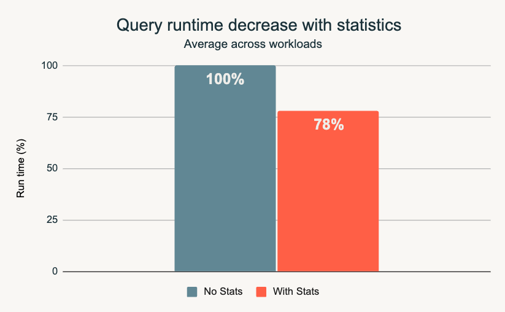
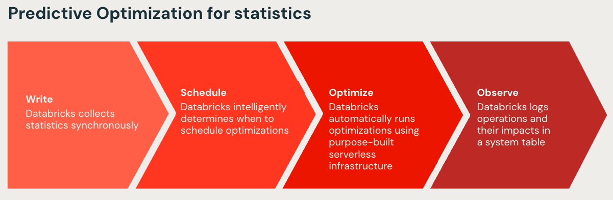
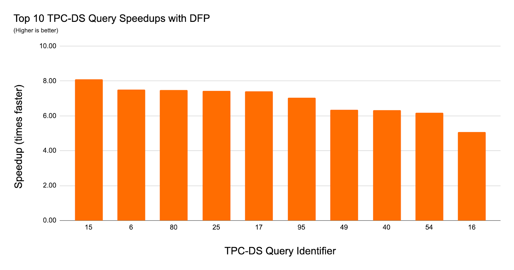
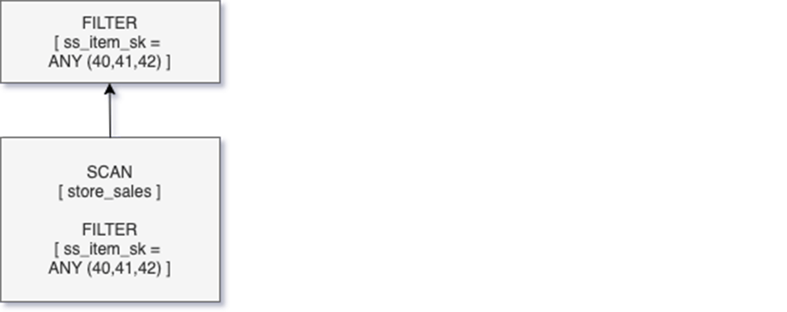
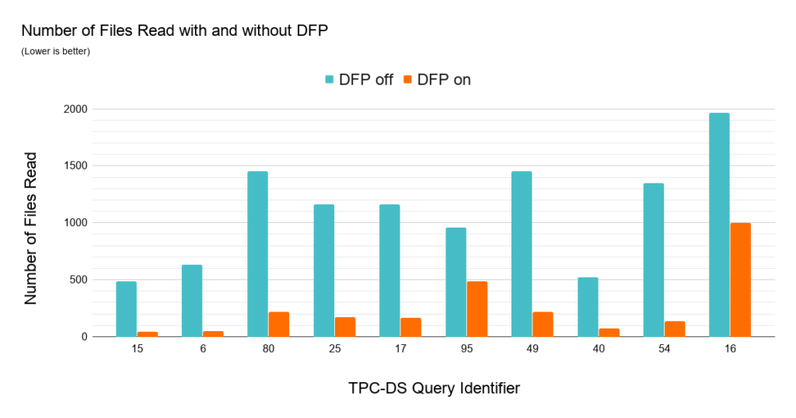

# Data Skipping und Tabellenstatistiken

Data Skipping ist eine der wirkungsvollsten und zugleich unauffälligsten Optimierungen in Delta Lake: Spark liest Dateien, die für eine Query offensichtlich irrelevant sind, gar nicht erst. Diese Fähigkeit hängt vollständig von den Tabellenstatistiken ab, die Databricks beim Schreiben automatisch sammelt — dieses Dokument behandelt beide Themen gemeinsam, da sie zwei Seiten desselben Mechanismus sind. Basierend auf zwei privaten Kursnotizen sowie offiziellen Databricks-Doku-Seiten und Engineering-Blogposts (jeweils am Ende jedes Abschnitts referenziert).

## Abschnittsübersicht

1. [Was ist Data Skipping?](#was-ist)
2. [Wie Data Skipping funktioniert](#funktionsweise)
3. [Tabellenstatistiken im Detail](#statistiken)
4. [Die Spaltenanzahl-Grenze und ihre Konfiguration](#spaltengrenze)
5. [Filterreihenfolge: Partition-, Data- und Pushed Filters](#filterreihenfolge)
6. [Statistiken abfragen und neu berechnen](#abfragen)
7. [Predictive Optimization für Statistiken](#predictive-stats)
8. [Predictive I/O](#predictive-io)
9. [Bloom-Filter-Indizes (veraltet)](#bloom-filter)
10. [Dynamic File Pruning](#dfp)
11. [Zusammenspiel mit Disk Cache](#disk-cache)
12. [Range Join Optimization](#range-join)
13. [Full-Text-Search-Indexes](#full-text-search)
14. [Cost-Based Optimizer (CBO)](#cbo)
15. [Zusammenfassung](#zusammenfassung)

---

## <a id="was-ist">1. Was ist Data Skipping?</a>

Aus einer privaten Kursnotiz übernommen: **Data Skipping** ist eine Optimierung, bei der Spark das Lesen von Dateien (oder Teilen von Dateien) vermeidet, die unmöglich für die Query relevante Daten enthalten können — basierend auf Statistiken, die über jede Datei gesammelt wurden, ohne die Datei selbst jemals zu öffnen.

**Warum es wichtig ist:**

- Weniger I/O bedeutet schnellere Queries, besonders bei großen Tabellen mit vielen Dateien.
- Es funktioniert am besten, wenn Daten natürlich nach den Spalten geclustert sind, nach denen gefiltert wird — z. B. wenn jede Datei nur einen Datumsbereich abdeckt, sodass die Min/Max-Statistiken tatsächlich selektiv sind (siehe [Z-Ordering.md](Z-Ordering.md) und [Liquid Clustering.md](Liquid%20Clustering.md) für Techniken, die genau das erreichen).

### Quelle

- Private Kursnotiz

---

## <a id="funktionsweise">2. Wie Data Skipping funktioniert</a>

Aus einer privaten Kursnotiz, ergänzt um offizielle Details:

1. **Beim Schreiben** (besonders in Delta Lake) sammelt Spark Statistiken pro Datei — typischerweise **Min/Max-Werte**, Null-Counts und Zeilenanzahlen für jede Spalte (standardmäßig die ersten 32 Spalten).
2. Diese Statistiken leben im **Transaktionslog/Metadaten, nicht in den Dateien selbst**.
3. Wird eine Query mit einem Filter ausgeführt (z. B. `WHERE date = '2026-07-01'`), prüft Spark zuerst die Statistiken: Überlappt der Min/Max-Bereich einer Datei für `date` nicht mit `'2026-07-01'`, wird diese Datei **vollständig übersprungen** — nie von der Festplatte gelesen.

```sql
-- Einfache, bekannte I/O-Pruning-Technik:
-- . Dateiweise Statistiken wie Min & Max nachverfolgen
-- . Diese nutzen, um das Scannen irrelevanter Dateien zu vermeiden
SELECT
    input_file_name() AS "file_name",
    min(col) AS "col_min",
    max(col) AS "col_max"
FROM table
GROUP BY input_file_name()
```

**Offizielle Bestätigung:** Data-Skipping-Statistiken werden automatisch gesammelt, wenn Daten in eine Delta-Lake- oder eine verwaltete Apache-Iceberg-Tabelle geschrieben werden. Databricks nutzt Datei-Statistiken (Minimum, Maximum, Null-Counts, Gesamtanzahl Datensätze) zur Query-Zeit, um irrelevante Dateien zu überspringen und Queries zu beschleunigen.

### Quelle

- Private Kursnotiz
- https://docs.databricks.com/aws/en/tables/data-skipping

---

## <a id="statistiken">3. Tabellenstatistiken im Detail</a>

Aus einer privaten Kursnotiz: Für effektives Data Skipping und Z-Ordering in Delta Lake ist es notwendig, Statistiken über die Daten zu sammeln. Standardmäßig sammelt Databricks Delta Lake Statistiken für die ersten 32 Spalten einer Tabelle und erfasst dabei Werte wie Min und Max für jede Spalte in den Datei-Metadaten. Diese Statistiken erlauben es Spark, zu identifizieren, welche Dateien wahrscheinlich relevante Query-Ergebnisse enthalten, und Dateien zu überspringen, die nicht zu den Filterkriterien passen.

**Metadaten-only-Queries:** Fragen wie das Finden des Maximalwerts einer Spalte lassen sich beantworten, ohne überhaupt Datendateien zu lesen — solange Statistiken verfügbar sind:

```sql
-- Fragt nur das Delta-Log ab, muss die Dateien nicht anfassen, wenn col Statistiken hat
SELECT max(col) FROM table
```

**Einschränkung bei Timestamp- und String-Spalten:** Aufgrund möglicher Präzisions- oder Truncation-Probleme führen Statistiken für Timestamp- und String-Spalten nicht immer zu exakten Übereinstimmungen — ein Fallback auf das Dateiscannen ist dann nötig.

**Empfehlung:** Statistiken für Spalten mit langen Strings vermeiden — entweder indem diese Spalten außerhalb der ersten 32 Spalten platziert werden, oder indem Konfigurationseinstellungen angepasst werden, um die Query-Geschwindigkeit und Systemeffizienz zu erhalten.

### Quelle

- Private Kursnotiz

---

## <a id="spaltengrenze">4. Die Spaltenanzahl-Grenze und ihre Konfiguration</a>

### 4.1 Unterschied External vs. Managed Tables

| Tabellentyp | Statistik-Erfassung |
|---|---|
| **Unity-Catalog External Tables** | standardmäßig die ersten 32 Spalten des Tabellenschemas |
| **Unity-Catalog Managed Tables** | Skipping-Statistiken werden intelligent über Predictive Optimization gewählt, **ohne** die 32-Spalten-Grenze (siehe Abschnitt 7) |

### 4.2 Konfigurationsparameter

Zwei Tabelleneigenschaften steuern die Statistik-Erfassung:

| Eigenschaft | Typ | Standard | Verfügbarkeit | Zweck |
|---|---|---|---|---|
| `delta.dataSkippingNumIndexedCols` | Int | `32` | alle Versionen | Anzahl der Spalten, für die Statistiken gesammelt werden — `-1` bedeutet: Statistiken für alle Spalten sammeln |
| `delta.dataSkippingStatsColumns` | String | (keine) | ab Databricks Runtime 13.3 LTS | kommagetrennte Liste konkreter Spaltennamen — **hat Vorrang** vor `dataSkippingNumIndexedCols` |

```sql
-- Anzahl indizierter Spalten begrenzen (Kursbeispiel, aus privater Kursnotiz)
SET spark.databricks.delta.properties.defaults.dataSkippingNumIndexedCols = 3;

-- Spalte hinter die indizierte Grenze verschieben, um Statistiken für sie zu vermeiden
ALTER TABLE table_name CHANGE COLUMN col AFTER col32;

-- Gezielt konkrete Spalten für Statistiken festlegen (Delta Lake)
ALTER TABLE table_name SET TBLPROPERTIES('delta.dataSkippingStatsColumns' = 'col1, col2, col3');

-- Äquivalent für Apache-Iceberg-Tabellen
ALTER TABLE table_name SET TBLPROPERTIES('iceberg.dataSkippingStatsColumns' = 'col1, col2, col3');
```

**Wichtig:** Diese Eigenschaften lassen sich bei Tabellenerstellung oder nachträglich per `ALTER TABLE` setzen — eine Änderung wirkt sich jedoch **nicht rückwirkend** auf Statistiken bereits geschriebener Daten aus. Erst künftige Schreibvorgänge wenden das neue Erfassungsverhalten an.

### Quellen

- Private Kursnotiz
- https://docs.databricks.com/aws/en/tables/data-skipping
- https://docs.databricks.com/aws/en/tables/table-properties

---

## <a id="filterreihenfolge">5. Filterreihenfolge: Partition-, Data- und Pushed Filters</a>

Aus einer privaten Kursnotiz: Filter werden in einer festen Reihenfolge angewendet:

1. **Partition Filters** — zuerst, basierend auf der physischen Partitionierung (siehe [Partitioning.md](Partitioning.md)).
2. **Data Filters** — anschließend, basierend auf den Data-Skipping-Statistiken (Min/Max je Datei).
3. **Pushed Filters** — zuletzt, auf Dateiformat-Ebene (z. B. Parquet-Row-Group-Filterung) angewendet.

### Quelle

- Private Kursnotiz

---

## <a id="abfragen">6. Statistiken abfragen und neu berechnen</a>

### 6.1 `ANALYZE TABLE ... COMPUTE STATISTICS`

**Vollständige Syntax:**

```sql
ANALYZE TABLE table_name [ PARTITION clause ]
    COMPUTE [ DELTA ] STATISTICS [ NOSCAN | FOR COLUMNS col1 [, ...] | FOR ALL COLUMNS ]

ANALYZE TABLES [ { FROM | IN } schema_name ] COMPUTE STATISTICS [ NOSCAN ]
```

| Klausel | Bedeutung |
|---|---|
| `PARTITION`-Klausel | beschränkt die Analyse auf bestimmte Partitionen; **nicht unterstützt** für Delta-Lake-Tabellen |
| `DELTA` | ab Databricks Runtime 14.3 LTS — berechnet die im Delta-Log gespeicherten Statistiken für die konfigurierten Spalten neu |
| `NOSCAN` | sammelt nur die Tabellengröße in Bytes, ohne vollständigen Tabellenscan |
| `FOR COLUMNS col [, ...]` / `FOR ALL COLUMNS` | sammelt zusätzlich Spaltenstatistiken; nicht kombinierbar mit `PARTITION` |
| `{FROM \| IN} schema_name` | analysiert alle Tabellen im angegebenen Schema (aktuelles Schema, falls weggelassen) |

**Code-Beispiele:**

```sql
-- Basis-Statistiken (Zeilenanzahl und Größe)
ANALYZE TABLE students COMPUTE STATISTICS;

-- Nur Größe, ohne vollständigen Scan
ANALYZE TABLE students COMPUTE STATISTICS NOSCAN;

-- Statistiken für alle Spalten (aus privater Kursnotiz, für Liquid Clustering/AQE relevant)
ANALYZE TABLE mytable COMPUTE STATISTICS FOR ALL COLUMNS;

-- Statistiken für eine bestimmte Spalte
ANALYZE TABLE students COMPUTE STATISTICS FOR COLUMNS name;

-- Delta-Statistiken im Delta-Log neu berechnen (Runtime 14.3 LTS+)
ANALYZE TABLE some_delta_table COMPUTE DELTA STATISTICS;

-- Alle Tabellen eines Schemas analysieren
ANALYZE TABLES IN school_schema COMPUTE STATISTICS NOSCAN;
ANALYZE TABLES COMPUTE STATISTICS;
```

### 6.2 `SHOW STATISTICS`

**Vollständige Syntax:**

```sql
SHOW STATISTICS [ { FROM | IN } ] table_name
    [ FOR COLUMNS column_name [, ...] | FOR ALL COLUMNS ]
    AS JSON
```

```sql
-- Nur Tabellen-Statistiken
SHOW STATISTICS FROM customer AS JSON;

-- Spalten-Statistiken für bestimmte Spalten
SHOW STATISTICS FROM customer FOR COLUMNS cust_id, name AS JSON;

-- Alle atomaren Top-Level-Spalten
SHOW STATISTICS FROM customer FOR ALL COLUMNS AS JSON;
```

### 6.3 Woher Spark seine Statistiken bezieht und wie man sie inspiziert

**Drei Statistik-Quellen (offizielle Apache-Spark-Doku):** Sparks Fähigkeit, den besten Ausführungsplan zu wählen, hängt maßgeblich von Zeilenschätzungen für jeden Knoten im Plan ab (Read, Filter, Join usw.). Diese Schätzungen stammen aus einer von drei Quellen:

| Quelle | Herkunft |
|---|---|
| **Data Source** | direkt von Spark aus dem zugrunde liegenden Datenformat gelesen, z. B. Zeilenanzahl und Min/Max-Werte in Parquet-Metadaten — von der Datenquelle selbst gepflegt |
| **Catalog** | aus dem Katalog (z. B. Hive Metastore/Unity Catalog) gelesen, gesammelt bzw. aktualisiert bei jedem `ANALYZE TABLE`-Lauf (siehe Abschnitt 6.1) |
| **Runtime** | von Spark selbst während der Query-Ausführung berechnet — Teil des AQE-Frameworks (siehe [Shuffles.md](../Code%20Optimization/Shuffles.md), Abschnitt 5) |

**Fehlende oder ungenaue Statistiken** behindern Sparks Fähigkeit, einen optimalen Plan zu wählen, und können zu schlechter Query-Performance führen — es lohnt sich daher, die verfügbaren Statistiken und Sparks Schätzungen während Planung und Ausführung zu inspizieren.

**Drei Wege zur Inspektion:**

- **Objekt-Statistiken:** `DESCRIBE EXTENDED table_name` bzw. `DESCRIBE EXTENDED table_name column_name` zeigt die auf einer Tabelle oder Spalte vorhandenen Statistiken.
- **Query-Plan-Schätzungen:** `EXPLAIN COST` (SQL) bzw. `DataFrame.explain(mode="cost")` zeigt Sparks Kostenschätzungen im optimierten Query-Plan.
- **Laufzeit-Statistiken:** Im **SQL-Tab** der Spark-UI, im „Details"-Bereich einer laufenden Query — dort erscheinen sie als `Statistics(..., isRuntime=true)` im Plan (vgl. das `isRuntime`-Flag von `DataFrame.explain()` bei AQE-Re-Optimierung, siehe [Shuffles.md](../Code%20Optimization/Shuffles.md), Abschnitt 5.3.1).

### Quellen

- https://docs.databricks.com/aws/en/sql/language-manual/sql-ref-syntax-aux-analyze-table
- https://docs.databricks.com/aws/en/sql/language-manual/sql-ref-syntax-aux-analyze-compute-statistics
- https://docs.databricks.com/aws/en/sql/language-manual/sql-ref-syntax-aux-show-statistics
- https://spark.apache.org/docs/latest/sql-performance-tuning.html#leveraging-statistics

---

## <a id="predictive-stats">7. Predictive Optimization für Statistiken</a>

Predictive Optimization für Statistiken verwaltet Tabellenstatistiken automatisch in zwei Phasen:

1. **Beim Schreiben:** Statistiken werden über Photon-fähiges Compute direkt beim Schreiben gesammelt — effizienter und kostengünstiger als klassische `ANALYZE`-Läufe nach der Ingestion.
2. **Im Hintergrund:** Das System löst `ANALYZE`-Befehle aus, sobald Statistiken durch `UPDATE`/`DELETE`-Operationen veralten — ohne manuellen Eingriff.

**Intelligente Spaltenwahl:** Statt sich an die traditionelle 32-Spalten-Grenze zu halten, nutzt das System Datenclustering- und Nutzungsmuster, um die relevantesten Spalten für die Delta-Statistik-Berechnung zu identifizieren — das eliminiert manuelles Spalten-Ordering und erweitert die Abdeckung über die klassischen ersten 32 Spalten hinaus. Manuell festgelegte Spaltenangaben (`dataSkippingStatsColumns`) haben weiterhin Vorrang, falls bereits konfiguriert.

**Performance-Wirkung:** durchschnittlich **22 % Performance-Steigerung** über beobachtete Workloads hinweg, wenn Statistiken aktuell gehalten werden.





### Quelle

- https://www.databricks.com/blog/introducing-predictive-optimization-statistics

---

## <a id="predictive-io">8. Predictive I/O</a>

Predictive I/O ist eine Sammlung von Databricks-Optimierungen, die die Performance von Dateninteraktionen verbessern — unterteilt in zwei Kategorien: beschleunigte Lesevorgänge und beschleunigte Updates.

**Beschleunigte Lesevorgänge:** wendet Deep-Learning-Techniken an, um den effizientesten Zugriffspfad zum Lesen der Daten zu bestimmen und nur tatsächlich benötigte Daten zu scannen — inklusive Elimination unnötiger Spalten-/Zeilen-Dekodierung. Das System berechnet die Wahrscheinlichkeiten, dass Suchkriterien selektiver Queries auf eine Zeile zutreffen, und antizipiert damit, wo die nächste passende Zeile auftreten würde, um Cloud-Storage-Lesevorgänge zu minimieren.

**Beschleunigte Updates:** nutzt Deletion Vectors, um vollständige Datei-Neuschreibvorgänge bei Modifikationen zu vermeiden — statt ganze Dateien bei Datensatzänderungen neu zu schreiben, markieren Deletion Vectors entfernte Datensätze in den Zieldateien, während zusätzliche Datendateien Updates abbilden.

**Voraussetzungen:**

| Funktion | Voraussetzung |
|---|---|
| Beschleunigte Lesevorgänge | Photon-Engine, Serverless- oder Pro-SQL-Warehouses, bzw. Photon-beschleunigte Cluster mit Databricks Runtime 11.3 LTS+ |
| Beschleunigte Updates | aktivierte Deletion Vectors, Serverless-/Pro-SQL-Warehouses oder Cluster mit Databricks Runtime 14.0+ (Unterstützung ab 12.2 LTS, 14.0+ empfohlen) |

### Quelle

- https://docs.databricks.com/aws/en/optimizations/predictive-io

---

## <a id="bloom-filter">9. Bloom-Filter-Indizes (veraltet)</a>

Bloom-Filter-Indizes waren ein legacy Data-Skipping-Mechanismus. Sie sind mittlerweile **deprecated**, da sie „Schreib-Overhead hinzufügen, schwer zu tunen sind und durch effektivere Alternativen abgelöst wurden":

- **Predictive I/O** (Abschnitt 8) — verfügbar auf Photon-fähigem Compute mit Databricks Runtime 12.2+, führt automatisches File-Skipping über alle Spalten hinweg aus und „löst Bloom-Filter-Indizes vollständig ab, die nur bei aktiviertem Photon zusätzlichen Schreib-Overhead erzeugen."
- **Liquid Clustering** (siehe [Liquid Clustering.md](Liquid%20Clustering.md)) — verfügbar ab Databricks Runtime 13.3+, verbessert Data Skipping durch Organisation der Daten nach häufig gefilterten Spalten.

**Entfernung bestehender Bloom-Filter-Indizes:**

```sql
DROP BLOOMFILTER INDEX ON TABLE table_name;
-- anschließend VACUUM ausführen, um Index-Dateien im _delta_index-Verzeichnis zu bereinigen
```

### Quelle

- https://docs.databricks.com/aws/en/optimizations/bloom-filters

---

## <a id="dfp">10. Dynamic File Pruning</a>

Dynamic File Pruning (DFP) ist eine Data-Skipping-Optimierung, die SQL-Query-Performance verbessert, indem unnötige Datei-Zugriffe während Join-Operationen auf Delta-Lake-Tabellen eliminiert werden — ursprünglich mit Databricks Runtime 6.1+ eingeführt.

### 10.1 Statisches vs. dynamisches File Pruning

**Statisches File Pruning (Grundlage):** Delta Lake führt Min/Max-Werte je Spalte für jede Datei. Enthält eine Query literale Prädikate, kann der Optimizer Dateien überspringen, deren gefilterte Werte außerhalb dieser Bereiche liegen. Z-Ordering verengt diese Bereiche zusätzlich (siehe [Z-Ordering.md](Z-Ordering.md)).

**Dynamic File Pruning:** erweitert dieses Prinzip, indem dynamische Filter von der Build-Seite eines Joins erzeugt und in die Scan-Operation gepusht werden — „ein dynamischer Filter wird von der Build-Seite des Joins erzeugt und in die SCAN-Operation übergeben." Das ermöglicht Star-Schema-Queries, von dateiweisem Skipping zu profitieren, ohne die Join-Werte bereits zur Kompilierzeit zu kennen.

### 10.2 Voraussetzungen zur Aktivierung

- Die innere Tabelle (Probe-Seite) nutzt Delta-Lake-Format.
- Der Join-Typ ist `INNER` oder `LEFT-SEMI`.
- Die Join-Strategie ist `BROADCAST HASH JOIN`.
- Die Delta-Tabelle überschreitet den Datei-Schwellenwert (Standard: 1.000 Dateien).

### 10.3 Konfigurationsparameter

| Parameter | Standard | Zweck |
|---|---|---|
| `spark.databricks.optimizer.dynamicFilePruning` | `true` | aktiviert/deaktiviert DFP |
| `spark.databricks.optimizer.deltaTableSizeThreshold` | 10 GB (Mindestgröße) | Mindesttabellengröße, ab der DFP greift |
| `spark.databricks.optimizer.deltaTableFilesThreshold` | `10` (aktuelle Doku) bzw. `1.000` (ursprüngliche Einführung) | Mindestanzahl Dateien auf der Probe-Seite, ab der DFP ausgelöst wird — bei weniger Dateien lohnt sich DFP nicht |

**Photon-Anforderungen:**

- `MERGE`, `UPDATE`, `DELETE`: erfordern Photon-fähiges Compute, damit DFP überhaupt greift.
- `SELECT`: Photon liefert umfassenderes und zuverlässigeres Pruning; ohne Photon kann DFP je nach Query-Form und Ausführungsplan dennoch greifen.

**Bezug zum Datenlayout:** Der Performance-Effekt von DFP korreliert stark mit der Qualität des Daten-Clusterings — Liquid Clustering wird empfohlen, um den Nutzen zu maximieren.

### 10.4 Benchmark (ursprüngliche Einführung, TPC-DS 1 TB, Z-geordnete Faktentabellen)

- Maximaler Speedup: **~8x** für einzelne Queries.
- 36 von 103 Queries erreichten **2x+ Speedup**.
- Konkretes Beispiel: eine Query reduzierte gescannte Zeilen von 8,6 Milliarden auf 66 Millionen (>99 % Reduktion), Laufzeit von 10 Sekunden auf unter 1 Sekunde.







### Quellen

- https://docs.databricks.com/aws/en/optimizations/dynamic-file-pruning
- https://www.databricks.com/blog/2020/04/30/faster-sql-queries-on-delta-lake-with-dynamic-file-pruning.html

---

## <a id="disk-cache">11. Zusammenspiel mit Disk Cache</a>

Data Skipping reduziert, welche Dateien überhaupt gelesen werden müssen; der **Disk Cache** beschleunigt zusätzlich wiederholte Lesevorgänge der verbleibenden, tatsächlich benötigten Dateien. Beide Mechanismen ergänzen sich: Data Skipping verringert das Datenvolumen, der Disk Cache verringert die Kosten wiederholter Zugriffe auf das verbleibende Volumen.

### 11.1 Funktionsweise

Der Disk Cache beschleunigt Datenzugriffe, indem Kopien entfernter Parquet-Dateien im lokalen Storage der Knoten in einem schnellen Zwischenformat abgelegt werden. Daten werden automatisch gecacht, sobald eine Datei von einem entfernten Speicherort abgerufen werden muss — nachfolgende Lesevorgänge erfolgen dann lokal, was die Lesegeschwindigkeit deutlich verbessert.

**Was gecacht wird:** beliebige Parquet-Tabellen auf S3, ABFS und anderen Dateisystemen, sowie Delta-Lake-Tabellen — ausschließlich entfernte Dateien, keine In-Memory-DataFrames.

**Namenshistorie:** Der Disk Cache hieß früher „Delta Cache" bzw. „DBIO Cache". Die Umbenennung soll verdeutlichen, dass es sich um eine proprietäre Databricks-Technologie handelt, nicht um einen Bestandteil des Delta-Lake-Protokolls selbst.

**Automatische Invalidierung:** Der Disk Cache erkennt automatisch, wenn Datendateien erstellt, gelöscht, geändert oder überschrieben werden, und aktualisiert seinen Inhalt entsprechend — Tabellendaten lassen sich schreiben, ändern und löschen, ohne den Cache explizit invalidieren zu müssen. Veraltete Einträge werden automatisch invalidiert und aus dem Cache entfernt.

**Hinweis zu `CACHE SELECT`:** Auf SQL-Warehouses und ab Databricks Runtime 14.2 hat der `CACHE SELECT`-Befehl keine Wirkung mehr — an seiner Stelle greift ein verbesserter, automatischer Algorithmus.

### 11.1.1 Disk Cache vs. Apache Spark Cache

| Aspekt | Disk Cache | Apache Spark Cache |
|---|---|---|
| Speicherformat | Dateien im lokalen Storage der Worker-Knoten | In-Memory-Blöcke (Storage Level variiert) |
| Anwendungsbereich | Parquet-Tabellen auf S3, ABFS und anderen Dateisystemen | beliebige DataFrames oder RDDs |
| Aktivierung | automatisch beim ersten Lesen (falls aktiviert) | manuell, erfordert Code-Änderung |
| Auswertung | lazy | lazy |
| Konfigurierbarkeit | über Flags steuerbar, standardmäßig aktiviert auf bestimmten Node-Typen | dauerhaft verfügbar |
| Entfernung | automatisches LRU-Eviction oder bei Dateiänderungen; manueller Cluster-Neustart | automatisches LRU-Eviction oder manuelles `unpersist` |

Von Spark Caching auf Delta-Lake-Tabellen wird explizit abgeraten (siehe [Liquid Clustering.md](Liquid%20Clustering.md), Abschnitt 9.4) — der Disk Cache ist dafür die empfohlene Alternative.

### 11.2 Lokaler SSD-Storage

Empfohlen wird ein Worker-Typ mit SSD-Volumes. Der Disk Cache ist standardmäßig so konfiguriert, dass er höchstens die **Hälfte** des auf den lokalen SSDs der Worker-Knoten verfügbaren Speicherplatzes nutzt — der Disk Cache konkurriert damit implizit mit dem Speicherplatz, der für Spill zur Verfügung steht (siehe [Spill.md](../Code%20Optimization/Spill.md), Abschnitt 12).

### 11.3 Konfigurationsparameter

| Parameter | Zweck |
|---|---|
| `spark.databricks.io.cache.enabled` | aktiviert/deaktiviert den Disk Cache (`true`/`false`) |
| `spark.databricks.io.cache.maxDiskUsage` | reservierter Diskspeicher für gecachte Daten pro Knoten (Bytes) |
| `spark.databricks.io.cache.maxMetaDataCache` | reservierter Diskspeicher für gecachte Metadaten pro Knoten (Bytes) |
| `spark.databricks.io.cache.compression.enabled` | aktiviert komprimiertes Speicherformat für gecachte Daten |

```python
spark.conf.set("spark.databricks.io.cache.enabled", "true")
```

**Wichtig beim Deaktivieren:** Ein Deaktivieren verhindert neue Cache-Einträge und Cache-Lesevorgänge, entfernt aber bereits gecachte Daten **nicht** aus dem lokalen Storage.

### 11.4 Einschränkung bei Autoscaling

Wird Autoscaling genutzt und Worker-Knoten werden abgebaut, geht der auf diesen Knoten gecachte Spark-Data verloren — betroffene Daten müssen dann ggf. erneut aus der Quelle gelesen werden.

### Quelle

- https://docs.databricks.com/aws/en/optimizations/disk-cache

---

## <a id="range-join">12. Range Join Optimization</a>

Range-Join-Optimierung ist eine weitere, join-orientierte Data-Skipping-Technik: Sie beschleunigt Joins mit „Point-in-Interval"- (ein Wert liegt zwischen zwei Werten der anderen Relation, z. B. `points.p BETWEEN ranges.start AND ranges.end`) oder „Interval-Overlap"-Bedingungen (überlappende Intervalle, z. B. `r1.start < r2.end AND r2.start < r1.end`). Databricks SQL erkennt qualifizierende Range Joins automatisch und leitet per Sampling eine passende **Bin-Größe** ab, mit der der Wertebereich in gleich große Intervalle unterteilt wird (bei `DATE`-Werten in Tagen, bei `TIMESTAMP`-Werten in Sekunden) — ganz ohne manuelle Konfiguration.

**Bezug zu Data Skipping:** Bei stark unterschiedlichen Intervalllängen ist die Wahl der Bin-Größe entscheidend, um Filtereffizienz gegen die Gefahr abzuwägen, dass sehr lange Intervalle zu viele Bins überspannen. Empfehlung: die Bin-Größe am 90., 99. oder 99,9. Perzentil der Intervalllängen ausrichten.

### Drei Konfigurationswege

**1. Automatisch** (Standard in Databricks SQL) — Bin-Größe wird per Sampling abgeleitet.

**2. Range-Join-Hint:**

```sql
SELECT /*+ RANGE_JOIN(points, 10) */ *
FROM points JOIN ranges
ON points.p >= ranges.start AND points.p < ranges.end;
```

**3. Session-Konfiguration:**

```sql
SET spark.databricks.optimizer.rangeJoin.binSize = 5
```

Hints überschreiben Session-Konfiguration und automatische Ableitung.

**Automatische Optimierung deaktivieren:**

```sql
SET spark.databricks.optimizer.autoRangeJoin.enabled = false;
```

**Python DataFrame API:**

```python
events.hint("range_join", 60).join(minutes,
  on=[events.event_start < minutes.minute_end,
      minutes.minute_start < events.event_end]).show()
```

**Intervalllängen-Verteilung zur Bin-Größen-Analyse abfragen:**

```sql
SELECT map_from_arrays(
  ARRAY(0.5, 0.9, 0.99, 0.999, 0.9999),
  APPROX_PERCENTILE(end::DOUBLE - start::DOUBLE,
    ARRAY(0.5, 0.9, 0.99, 0.999, 0.9999))
) AS bin_sizes
FROM ranges;
```

### Praxisbeispiel: räumliche (Spatial) Joins

Geodaten sind oft besonders stark geskewt — dichte urbane Regionen gegenüber dünn besiedelten ländlichen Gebieten. Databricks SQL Serverless und Databricks Runtime 17.3 kombinieren automatisch R-Tree-Indizierung, in Photon optimierte räumliche Joins und intelligente Range-Join-Optimierung — in kundennahen Benchmark-Queries (Punkt-in-Polygon, Flächenabdeckung, Straßen-Schnittmengen) ergab das bis zu **17x** schnellere räumliche Joins gegenüber Apache Sedona auf Classic Clusters.

### Quellen

- https://docs.databricks.com/aws/en/optimizations/range-join
- https://www.databricks.com/blog/databricks-spatial-joins-now-17x-faster-out-box

---

## <a id="full-text-search">13. Full-Text-Search-Indexes</a>

Full-Text-Search-Indexes sind ein **Beta-Feature**, das Lookups über Textspalten in verwalteten Delta-Lake- oder Iceberg-Tabellen beschleunigt. Das System unterstützt sowohl Substring- als auch Wort-Matching — Databricks nutzt den Index, um Dateien zu überspringen, die garantiert keine passenden Zeilen enthalten, ganz im Sinne des Data-Skipping-Prinzips aus Abschnitt 1–2, nur angewendet auf unstrukturierten Text statt auf numerische Min/Max-Bereiche.

### Voraussetzungen

**Compute:** Databricks Runtime 18.2 oder höher; das Beta-Feature muss über die Workspace-„Previews"-Einstellungen aktiviert werden.

**Berechtigungen:** `MODIFY`-Berechtigung auf der zu indizierenden Tabelle, `CREATE TABLE`-Berechtigung auf dem übergeordneten Schema.

**Tabellen-Konfiguration:** verwaltete Delta-Lake- oder Iceberg-Tabelle, Row Tracking aktiviert (`delta.enableRowTracking = true`), indizierte Spalten müssen vom Typ `STRING`, `VARIANT`, `STRUCT` oder `ARRAY` sein. Nicht kompatibel mit OpenSharing, Shallow Clones, attributbasierter Zugriffskontrolle, Row-Level Security oder Column Masks.

**Limit:** bis zu vier Indizes pro Tabelle auf unterschiedlichen Spalten.

### Index erstellen

**Grundsyntax:**

```sql
CREATE SEARCH INDEX log_idx ON logs (message, error_detail);
```

**Vollständige Syntax:**

```sql
CREATE SEARCH INDEX [IF NOT EXISTS] index_name
ON table_name (column_name [, column_name ...])
[OPTIONS (option_key = option_value [, ...])]
```

### Tokenizer-Optionen

| Tokenizer | Anwendungsfall | Details |
|---|---|---|
| `ngram` (Standard) | Substring-Matching | erzeugt überlappende N-Gramme, Standardgröße 5 Zeichen |
| `split` | Wort-Matching | erkennt Tokens als Unicode-Buchstaben-/Zeichen-Läufe, getrennt durch andere Zeichen |

```sql
-- N-Gram-Tokenizer
CREATE SEARCH INDEX log_ngram_idx
ON logs (message)
OPTIONS (tokenizer = 'ngram', ngram_size = 4);

-- Split-Tokenizer
CREATE SEARCH INDEX log_word_idx
ON logs (message)
OPTIONS (tokenizer = 'split', min_token_length = 2);
```

### Query-Funktionen

**`search()`** — case-sensitive Pattern-Matching. **`isearch()`** — case-insensitive Pattern-Matching. Beide akzeptieren Zielspalten (Text) und ein Pattern, mit optionaler Modus-Angabe: `substring` (Standard, Pattern als Substring) oder `word` (Pattern wird in Wort-Tokens zerlegt, Treffer bei beliebiger Reihenfolge der Wörter im Ziel).

```sql
-- Case-insensitive Substring-Suche
SELECT * FROM logs
WHERE isearch(message, 'connection refused');

-- Mehrspaltige Substring-Suche
SELECT * FROM logs
WHERE search(message, error_detail, '550e8400-e29b-41d4-a716-446655440000');

-- Wort-Suche (beliebige Reihenfolge)
SELECT * FROM audit_logs
WHERE search(message, 'user admin login', mode => 'word');
```

### Index-Verwaltung

```sql
-- Index beschreiben
DESCRIBE INDEX log_idx;

-- Inkrementell aktualisieren
REFRESH INDEX log_idx;

-- Vollständige Aktualisierung (entfernt gelöschte Zeilen-Einträge)
REFRESH INDEX log_idx FULL;

-- Index löschen
DROP INDEX log_idx;
DROP INDEX IF EXISTS log_idx;
```

**Wichtig:** Indizes aktualisieren sich **nicht automatisch**, wenn sich die Basistabelle ändert — regelmäßige `REFRESH INDEX`-Läufe sind nötig, um die Genauigkeit zu erhalten. Die Query-Korrektheit bleibt dabei unabhängig vom Grad der Index-Aktualität erhalten, da das System indizierten Datenzugriff mit Tabellenscans für nicht indizierte Datensätze kombiniert.

**Performance-Charakteristik:** die größte Beschleunigung ergibt sich bei selektiven Lookups, bei denen das Suchmuster nur in einem kleinen Bruchteil der Tabellendateien vorkommt.

**Einschränkungen:** Umbenennen oder Typänderungen an indizierten Spalten werden nicht unterstützt; Tabellen mit OpenSharing, Shallow Clones, ABAC, Column Masks oder RLS-Policies können keine Search-Indizes nutzen; Indizes aus der Beta-Phase sind möglicherweise nicht mit zukünftigen Releases kompatibel.

### Quelle

- https://docs.databricks.com/aws/en/optimizations/full-text-search-indexes

---

## <a id="cbo">14. Cost-Based Optimizer (CBO)</a>

Der Cost-Based Optimizer ist ein Spark-SQL-Feature, das Query-Pläne verbessert — besonders bei Queries mit mehreren Joins. Er ist auf präzise Tabellen- und Spaltenstatistiken angewiesen, um effektiv zu funktionieren: genau die Statistiken, die in den Abschnitten 3–7 dieses Dokuments behandelt werden.

**Statistik-Erfassung:** CBO benötigt sowohl spalten- als auch tabellenweite Statistiken, die über `ANALYZE TABLE` gesammelt werden können (siehe Abschnitt 6). Databricks empfiehlt, diesen Befehl nach Tabellenänderungen auszuführen, um die Genauigkeit zu erhalten. Predictive Optimization führt `ANALYZE` bei Unity-Catalog-Managed-Tables automatisch aus (siehe Abschnitt 7) — das vereinfacht die Datenwartung zusätzlich.

### Verifikation

**`EXPLAIN`-Befehl:** zeigt den Ausführungsplan und lässt sich nutzen, um zu prüfen, ob Statistiken tatsächlich genutzt werden — die Ausgabe zeigt `rowCount`-Werte für jede Operation.

**Spark-SQL-UI:** zeigt Ausführungsdetails grafisch an. Eine Ausgabe wie `"rows output: 2,451,005 est: 1616404 (1X)"` deutet auf eine gute Schätzgenauigkeit hin, während `"est: N/A"` fehlende Statistiken signalisiert.

### Aktivierung/Deaktivierung

CBO ist standardmäßig aktiviert. Deaktivierung über:

```python
spark.conf.set("spark.sql.cbo.enabled", "false")
```

### Quelle

- https://docs.databricks.com/aws/en/optimizations/cbo

---

## <a id="zusammenfassung">15. Zusammenfassung</a>

- **Data Skipping** vermeidet das Lesen irrelevanter Dateien anhand von Min/Max-, Null-Count- und Zeilenanzahl-Statistiken, die beim Schreiben automatisch im Transaktionslog erfasst werden — die Datei selbst wird dabei nie geöffnet.
- **Tabellenstatistiken** sind die Grundlage von Data Skipping; standardmäßig werden die ersten 32 Spalten indiziert (`dataSkippingNumIndexedCols`), konkrete Spalten lassen sich gezielt über `dataSkippingStatsColumns` festlegen.
- Filter werden in fester Reihenfolge angewendet: **Partition Filters → Data Filters → Pushed Filters.**
- `ANALYZE TABLE ... COMPUTE STATISTICS` und `SHOW STATISTICS` erlauben das manuelle Neuberechnen bzw. Abfragen von Statistiken.
- **Predictive Optimization für Statistiken** eliminiert die 32-Spalten-Grenze bei Managed Tables und hält Statistiken automatisch aktuell — durchschnittlich 22 % Performance-Gewinn.
- **Predictive I/O** und **Liquid Clustering** ersetzen die veralteten **Bloom-Filter-Indizes** vollständig als moderne Data-Skipping-Mechanismen.
- **Dynamic File Pruning** erweitert statisches Data Skipping um dynamische, zur Laufzeit aus der Build-Seite eines Joins erzeugte Filter — besonders wirkungsvoll bei Star-Schema-Queries, mit bis zu 8x Speedup im ursprünglichen Benchmark.
- Der **Disk Cache** ergänzt Data Skipping, indem er wiederholte Lesevorgänge der verbleibenden, tatsächlich benötigten Dateien beschleunigt — standardmäßig auf die Hälfte des lokalen SSD-Speichers begrenzt.
- **Range Join Optimization** wendet dasselbe Data-Skipping-Prinzip auf Point-in-Interval- und Interval-Overlap-Joins an, mit automatisch abgeleiteter Bin-Größe — bis zu 17x schnellere räumliche Joins in Praxisbeispielen.
- **Full-Text-Search-Indexes** (Beta) übertragen das Data-Skipping-Prinzip auf unstrukturierten Text — mit N-Gram- oder Wort-Tokenizern und `search()`/`isearch()`-Funktionen.
- Der **Cost-Based Optimizer (CBO)** nutzt dieselben Tabellenstatistiken, um Query-Pläne bei Multi-Join-Queries zu verbessern — standardmäßig aktiviert, verifizierbar über `EXPLAIN`.

---

## Vertiefung: Weitere SQL-Beispiele aus dem Language Manual

### `ANALYZE TABLE ... COMPUTE STATISTICS` — ergänzendes Beispiel

Ergänzend zu Abschnitt 6.1: Die Sprachreferenz zeigt zusätzlich, wie sich Statistiken gezielt für eine einzelne Spalte statt für die ganze Tabelle sammeln lassen — nützlich, um den Erfassungsaufwand bei sehr breiten Tabellen zu begrenzen (siehe Abschnitt 3 zur Empfehlung, lange String-Spalten von der Statistik-Erfassung auszunehmen).

```sql
-- Statistik nur für eine bestimmte Spalte sammeln
ANALYZE TABLE students COMPUTE STATISTICS FOR COLUMNS name;
```

Quelle: https://docs.databricks.com/aws/en/sql/language-manual/sql-ref-syntax-aux-analyze-compute-statistics

### `ANALYZE TABLE ... COMPUTE STORAGE METRICS`

Ein bislang nicht behandelter, verwandter Befehl: Er berechnet Storage-Metriken (Gesamtgröße, aktive vs. löschbare/vacuumable Bytes, Time-Travel-Bytes) für Unity-Catalog-Tabellen — ergänzt die Data-Skipping-Statistiken aus Abschnitt 3 um eine reine Storage-Perspektive, relevant für die VACUUM-Betrachtung in [Liquid Clustering.md](Liquid%20Clustering.md), Abschnitt 11.4.

```sql
-- Direkter Datei-Scan (Standard)
ANALYZE TABLE main.my_schema.my_table COMPUTE STORAGE METRICS;

-- Für sehr große Tabellen (100.000+ Dateien): über ein vorab erzeugtes
-- Cloud-Storage-Inventory statt vollständigem Datei-Listing
ANALYZE TABLE main.my_schema.my_table COMPUTE STORAGE METRICS
USING INVENTORY LOCATION 's3://your-destination-bucket/your-prefix/'
CONF 'databricks-inventory-list-config';
```

Die Ausgabe liefert u. a. `total_bytes`, `num_active_files`, `vacuumable_bytes` und `num_vacuumable_files`.

Quelle: https://docs.databricks.com/aws/en/sql/language-manual/sql-ref-syntax-aux-analyze-compute-storage-metrics

### `ANALYZE TABLE ... DROP STATISTICS`

Das Gegenstück zum Sammeln von Statistiken: entfernt Optimizer-Statistiken gezielt wieder aus Unity-Catalog-Tabellen. Ohne Qualifier werden standardmäßig nur manuell erstellte Statistiken gelöscht — relevant, wenn manuell gesetzte Statistiken (Abschnitt 6.1) versehentlich Vorrang vor aktuelleren, automatisch von Predictive Optimization gepflegten Statistiken (Abschnitt 7) haben sollen.

```sql
-- Nur manuell erstellte Statistiken entfernen (Standard)
ANALYZE TABLE main.sales.orders DROP STATISTICS;

-- Nur automatisch erzeugte Statistiken entfernen (Predictive Optimization / Auto-Stats)
ANALYZE TABLE main.sales.orders DROP AUTO STATISTICS;

-- Beide Arten entfernen
ANALYZE TABLE main.sales.orders DROP ALL STATISTICS;
```

Quelle: https://docs.databricks.com/aws/en/sql/language-manual/sql-ref-syntax-aux-analyze-drop-statistics

### `SHOW STATISTICS` — vollständiger Setup-Kontext

Ergänzend zu Abschnitt 6.2 zeigt die Sprachreferenz den vollständigen Ablauf inklusive Tabellenerstellung und Statistik-Erfassung vor der Abfrage:

```sql
CREATE TABLE customer(cust_id INT, name STRING, state STRING) USING parquet;
INSERT INTO customer VALUES (100, 'Mike', 'AR'), (200, 'Jane', 'CA');
ANALYZE TABLE customer COMPUTE STATISTICS FOR ALL COLUMNS;

SHOW STATISTICS FROM customer AS JSON;
```

Quelle: https://docs.databricks.com/aws/en/sql/language-manual/sql-ref-syntax-aux-show-statistics
