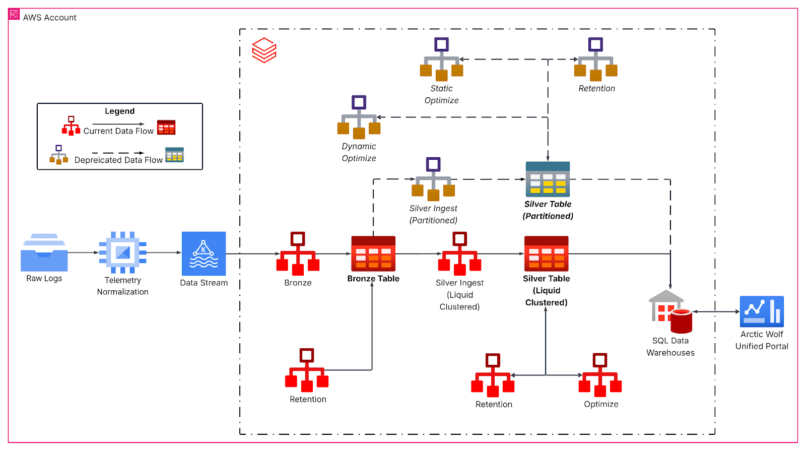
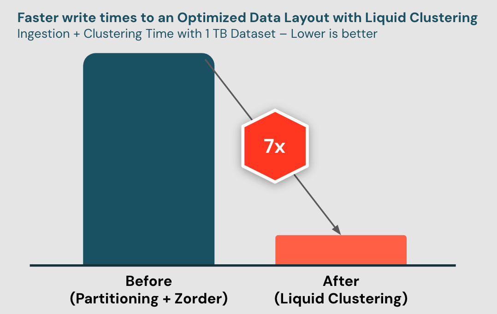
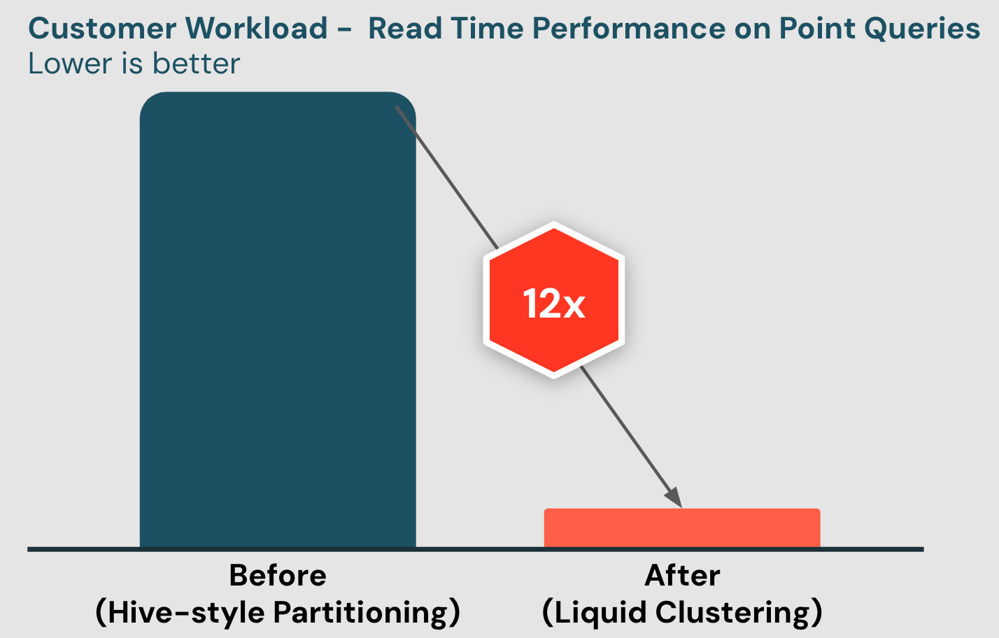

# Liquid Clustering

Liquid Clustering ist Databricks' moderner Ersatz für klassisches Hive-Style-Partitioning und Z-Ordering. Es vereinfacht Datenlayout-Entscheidungen und optimiert Query-Performance, ohne die strukturellen Nachteile der Vorgängertechniken.

## Abschnittsübersicht

1. [Was ist Liquid Clustering?](#was-ist)
2. [Partitioning vs. Clustering im Vergleich](#vergleich)
3. [Vorteile im Überblick](#vorteile)
4. [Clustering-Keys wählen](#keys-waehlen)
5. [Tabellen erstellen und konfigurieren](#tabellen-konfigurieren)
6. [Bestehende Tabellen konvertieren](#konvertieren)
7. [Clustering triggern: OPTIMIZE und OPTIMIZE FULL](#optimize)
8. [Automatic Liquid Clustering (CLUSTER BY AUTO)](#automatic)
9. [Isolation Levels und Row-Level Concurrency](#row-level-concurrency)
10. [Tabellenstatistiken für Query-Optimierung](#tabellenstatistiken)
11. [Predictive Optimization](#predictive-optimization)
12. [Praxisbeispiel: Arctic Wolf im Petabyte-Maßstab](#praxisbeispiel)
13. [Adoption, Benchmarks und Limitierungen](#adoption-benchmarks)
14. [Zusammenfassung](#zusammenfassung)

---

## <a id="was-ist">1. Was ist Liquid Clustering?</a>

**Delta Lake Liquid Clustering** ersetzt Tabellenpartitionierung und ZORDER, um Datenlayout-Entscheidungen zu vereinfachen und Query-Performance zu optimieren. Es ist eine innovative Technik zum Clustern des Datenlayouts, die effizienten Query-Zugriff unterstützt und Overhead bei Datenmanagement und -Tuning reduziert. Sie ist flexibel und passt sich an Änderungen im Datenmuster, an Skalierung und an Data Skew an.

**Das zentrale Prinzip — „Liquid":** Anders als bei starren Partitionsgrenzen ist das Hauptziel, eine bestimmte Dateigröße anzustreben, was deutlich mehr Flexibilität als traditionelle, starre Grenzen erlaubt. Der „Liquid"-Aspekt bedeutet, dass Daten nicht in strikte Partitionen eingesperrt sind — Databricks kann intelligent entscheiden, welche Datenbereiche kombiniert werden, damit Dateigrößen ungefähr gleich bleiben. Das reduziert Data Skew drastisch und führt zu konsistenten Datengrößen über Dateien hinweg. Liquid Clustering speichert zudem Metadaten, die genutzt werden, um neue Daten beim Schreiben in bestehende Cluster einzuordnen — das macht sowohl Schreib- als auch Lesevorgänge schneller und effizienter.


**Offiziell bestätigt:** Liquid Clustering organisiert Datendateien automatisch anhand von Clustering-Keys. Anders als bei herkömmlichen Ansätzen lassen sich Clustering-Keys neu definieren, **ohne bestehende Daten neu zu schreiben** — die Datenarchitektur kann sich so mit sich ändernden analytischen Anforderungen weiterentwickeln. Unterstützt werden sowohl Delta-Lake- als auch Apache-Iceberg-Tabellen, außerdem Streaming Tables und Materialized Views.

---

## <a id="vergleich">2. Partitioning vs. Clustering im Vergleich</a>

Beides sind Techniken, um Daten physisch im Storage zu organisieren und Queries zu beschleunigen. Sie funktionieren aber grundlegend unterschiedlich.

### Partitioning

Partitionierung teilt eine Tabelle anhand des Werts einer oder mehrerer Spalten in separate physische Verzeichnisse auf (z. B. `date`, `region`). Daten werden physisch in Ordner wie `/date=2026-01-01/`, `/date=2026-01-02/` usw. geschrieben. Queries, die nach der Partitionsspalte filtern, können ganze Verzeichnisse überspringen („Partition Pruning") und so das Scannen irrelevanter Dateien vermeiden (ausführlich in [Partitioning.md](Partitioning.md) behandelt).

**Nachteile:** Die falsche Partitionsspalte (oder zu viele unterschiedliche Werte) führt zum „Small-File-Problem" — Tausende winziger Dateien, die die Performance beeinträchtigen. Partitionierung hilft nur, wenn Queries exakt nach dieser Spalte filtern — sie ist starr: einmal gewählt, ist sie im physischen Layout festgeschrieben, und das Repartitionieren einer riesigen Tabelle ist teuer. Funktioniert schlecht mit hochkardinalen Spalten (z. B. Partitionierung nach `user_id`).

### Clustering (Liquid Clustering / Z-Ordering)

Clustering kolokiert zusammengehörige Daten *innerhalb* von Dateien und über Dateien hinweg anhand von Spaltenwerten, ohne separate physische Verzeichnisse zu erzeugen. Zwei Hauptformen in Databricks:

1. **Z-Ordering** (`OPTIMIZE ... ZORDER BY`) — eine mehrdimensionale Clustering-Technik, die zusammengehörige Daten im selben Dateisatz kolokiert und Data Skipping für Queries verbessert, die nach den Z-Order-Spalten filtern. Ein manueller, periodischer Optimierungsbefehl (ausführlich in [Z-Ordering.md](Z-Ordering.md) behandelt).
2. **Liquid Clustering** (`CLUSTER BY`) — Databricks' neuerer, empfohlener Ansatz.

### Direkter Vergleich

| Aspekt | Partitioning | Clustering |
|---|---|---|
| Physisches Layout | separate Verzeichnisse je Wert | Daten innerhalb/über Dateien kolokiert, keine Verzeichnisaufteilung |
| Am besten geeignet für | niedrigkardinale Spalten (Datum, Region) | jede Kardinalität, auch hochkardinale Spalten |
| Flexibilität | starr — schwer nachträglich zu ändern | flexibel — Keys neu definierbar |
| Small-File-Risiko | hoch bei Über-Partitionierung | niedrig, automatisch verwaltet (mit Liquid Clustering) |
| Wartung | manuelles Design im Voraus | Liquid Clustering optimiert automatisch inkrementell |
| Databricks-Empfehlung | Legacy-Ansatz, weiterhin nützlich für sehr große Tabellen mit grobkörnigen Filtern | empfohlener Standard für neue Tabellen |

**Fazit:** Databricks empfiehlt inzwischen generell **Liquid Clustering** gegenüber klassischem Hive-Style-Partitioning für die meisten neuen Tabellen, da es die Pruning-Vorteile ohne die Starrheit und Small-File-Probleme bietet. Partitionierung hat weiterhin ihren Platz bei sehr großen Tabellen mit einer natürlichen, niedrigkardinalen, grobkörnigen Filterspalte (etwa datumsbasierte Aufbewahrung/Archivierung), aber für alles andere ist Clustering effizienter und flexibler.

---

## <a id="vorteile">3. Vorteile im Überblick</a>

- **Beste Performance von Haus aus** — Clustering findet direkt beim Schreiben statt.
- **Konsistenteste Data-Skipping-Ergebnisse** — immun gegen Data Skew.
- **Minimale Write-Amplification bei der Tabellenwartung** — echtes inkrementelles Optimieren, nicht die vollständigen Neuschreibvorgänge, die Z-Ordering periodisch erfordert (siehe [Z-Ordering.md](Z-Ordering.md), Abschnitt 4).
- **Row Level Concurrency** — vereinfacht die Logik nebenläufiger Schreiboperationen (siehe Abschnitt 9.2).
- **Reduzierter kognitiver Overhead** — keine Sorge mehr um Kardinalität der gewählten Spalten.
- **Inkrementell:** optimiert nur neue oder ungeclusterte Daten, vermeidet das Neuschreiben bereits geclusterter Dateien — effizient für Streaming- und schreiblastige Workloads.
- **Flexibel:** Clustering-Keys lassen sich jederzeit ohne vollständigen Tabellen-Rewrite aktualisieren — passt sich an sich entwickelnde Query-Muster an.
- **Selbstoptimierend:** Mit `CLUSTER BY AUTO` wählt Databricks automatisch optimale Keys basierend auf beobachteter Query-Nutzung (siehe Abschnitt 8).

**Offiziell empfohlene Anwendungsfälle:** Queries, die nach hochkardinalen Spalten filtern; Tabellen mit starkem Data Skew; schnell wachsende, wartungsintensive Tabellen; Tabellen mit nebenläufigen Schreibanforderungen; Tabellen mit variierenden oder sich ändernden Zugriffsmustern; Tabellen, bei denen ein typischer Partitionsschlüssel zu viele oder zu wenige Partitionen liefern würde.

---

## <a id="keys-waehlen">4. Clustering-Keys wählen</a>

**Grundregel:** Keys basierend auf den in Query-Filtern am häufigsten genutzten Spalten wählen. Es lassen sich **bis zu vier Clustering-Keys** angeben. Bei Tabellen unter 10 TB können mehr Keys die Performance einzelner Spalten-Filter beeinträchtigen — dieser Effekt verringert sich bei größeren Tabellen. Die Spaltenreihenfolge spielt keine Rolle.

**Weitere offizielle Auswahlkriterien:**

- Spalten, die am häufigsten in Query-Filtern und `JOIN`-Bedingungen verwendet werden, priorisieren.
- Spalten mit hoher Kardinalität sind ausdrücklich geeignet (anders als bei klassischer Partitionierung) — Liquid Clustering profitiert besonders bei Queries, die nach hochkardinalen Spalten filtern.
- **Korrelierte Spalten:** Sind zwei Spalten stark miteinander korreliert, genügt es, nur eine davon als Clustering-Key aufzunehmen — die zweite bringt keinen zusätzlichen Pruning-Nutzen.
- Clustering-Keys müssen Spalten sein, für die Statistiken gesammelt werden (Voraussetzung für Data Skipping, siehe [Data Skipping und Tabellenstatistiken.md](Data%20Skipping%20und%20Tabellenstatistiken.md)).

**Unterstützte Datentypen:** `Date`, `Timestamp`, `TimestampNTZ`, `String`, `Integer`, `Long`, `Short`, `Byte`, `Float`, `Double`, `Decimal`, sowie verschachtelte Struct-Felder über Punktnotation (z. B. `struct_col.field`). **Nicht unterstützt:** komplexe Typen (`StructType`, `MapType`, `ArrayType`) oder deren Elemente.

**Migrationsleitfaden von bestehenden Layout-Strategien:**

| Aktuelle Methode | Clustering-Strategie |
|---|---|
| Hive-Style-Partitionierung | Partitionsspalten als Keys verwenden |
| Z-Order-Indizierung | ZORDER-Spalten als Keys verwenden |
| Beide kombiniert | beide Spaltengruppen kombinieren |
| Generierte Spalten | Original-Spalte verwenden, generierte Spalten überspringen |

---

## <a id="tabellen-konfigurieren">5. Tabellen erstellen und konfigurieren</a>

### 5.1 Neue Tabelle mit Clustering erstellen

```sql
-- Leere Tabelle
CREATE TABLE table1 (col0 INT, col1 STRING) CLUSTER BY (col0);

-- Aus bestehenden Daten
CREATE TABLE table2 CLUSTER BY (col0) AS SELECT * FROM table1;

-- Schema einer bestehenden Tabelle übernehmen (inkl. Clustering-Konfiguration)
CREATE TABLE table3 LIKE table1;
```

```python
# Python: DeltaTable-API
(DeltaTable.create()
  .tableName("table1")
  .addColumn("col0", dataType="INT")
  .addColumn("col1", dataType="STRING")
  .clusterBy("col0")
  .execute())

# Python: DataFrame-Write
df = spark.read.table("table1")
df.write.clusterBy("col0").saveAsTable("table2")

# Python: writeTo-API (DataFrameWriterV2)
df.writeTo("table1").using("delta").clusterBy("col0").create()
```

### 5.2 Clustering auf bestehender Tabelle aktivieren

```sql
ALTER TABLE <table_name> CLUSTER BY (<clustering_columns>);
```

**Managed Apache Iceberg (v2-Spec):** Beim Aktivieren von Liquid Clustering auf einer bestehenden Tabelle müssen Deletion Vectors und Row Tracking explizit deaktiviert werden. Bei der v3-Spec ist das nicht erforderlich (gilt ebenso für die Konvertierung von partitionierten Tabellen, siehe Abschnitt 6).

### 5.3 `CLUSTER BY`-Klausel im Detail

**Vollständige Syntax:**

```sql
CLUSTER BY { ( column_name [, ...] ) | AUTO | NONE }
```

| Option | Bedeutung |
|---|---|
| konkrete Spalten | Clustering nach einer oder mehreren benannten Spalten |
| `AUTO` (ab Databricks Runtime 15.4+) | System bestimmt automatisch die besten Spalten und passt sich über die Zeit an (siehe Abschnitt 8) |
| `NONE` | deaktiviert Clustering — neu geschriebene Daten werden über `OPTIMIZE` nicht mehr organisiert |

**Wichtig:** Aktualisierte Zeilen erfordern manuelles Re-Clustering über `OPTIMIZE`. Das Ändern der Clustering-Spalten über `ALTER TABLE` betrifft nicht bereits geclusterte Zeilen — dafür ist `OPTIMIZE FULL` nötig (siehe Abschnitt 7). Clustering auf Materialized Views oder Streaming Tables lässt sich nicht über `ALTER TABLE` ändern.

**DataFrame-API-Einschränkung:** Beim Setzen von Clustering-Keys über DataFrame-APIs lassen sich Clustering-Spalten **nur** bei der Tabellenerstellung oder im `overwrite`-Modus angeben — im `append`-Modus können sie über die DataFrame-API nicht gesetzt/geändert werden (analog zur `clusterByAuto`-Einschränkung in Abschnitt 8.2, gilt hier aber generell für alle Clustering-Konfigurationen, nicht nur für `AUTO`).

### 5.4 Streaming-Unterstützung (ab Databricks Runtime 16.4 LTS+)

```sql
-- SQL: Streaming Table mit Clustering erstellen
CREATE TABLE table1 (col0 STRING, col1 DATE, col2 BIGINT) CLUSTER BY (col0, col1);
```

```python
(spark.readStream.table("source_table")
  .writeStream
  .clusterBy("column_name")
  .option("checkpointLocation", checkpointPath)
  .toTable("target_table"))
```

**Mit Automatic Clustering:**

```python
(spark.readStream.table("source_table")
  .writeStream
  .option("clusterByAuto", "true")
  .option("checkpointLocation", checkpointPath)
  .toTable("target_table"))
```

### 5.5 Größenschwellenwerte beim Schreiben (Clustering on Write)

Unterstützt: `INSERT INTO`, `CTAS`/`RTAS`, `COPY INTO` aus Parquet, `spark.write.mode("append")`.

| Anzahl Keys | Unity-Catalog-Schwellenwert | Andere Delta-Tabellen |
|---|---|---|
| 1 | 64 MB | 256 MB |
| 2 | 256 MB | 1 GB |
| 3 | 512 MB | 2 GB |
| 4 | 1 GB | 4 GB |

---

## <a id="konvertieren">6. Bestehende Tabellen konvertieren</a>

**Verfügbarkeit:** ab Databricks Runtime 18.1+.

```sql
ALTER TABLE <table_name> REPLACE PARTITIONED BY WITH CLUSTER BY [(columns) | AUTO]
```

**Drei Varianten:**

- **Konkrete Spalten angeben:** Wechsel der Partitionierungsstrategie zu bestimmten Clustering-Keys.
- **`AUTO`:** nutzt die aktuellen Partitionen als initiale Keys und passt sich über die Zeit an.
- **Ohne Parameter:** behält die aktuellen Partitionen als Keys bei.

**Beispiel — Clustering-Spalten ändern:**

```sql
ALTER TABLE t1 REPLACE PARTITIONED BY WITH CLUSTER BY (day, id);
OPTIMIZE t1;
```

**Beispiel — automatisches Clustering:**

```sql
ALTER TABLE t2 REPLACE PARTITIONED BY WITH CLUSTER BY AUTO;
```

**Wichtige Hinweise zur Konvertierung:**

- Konvertiert bestehende Daten standardmäßig **nicht** rückwirkend — für erzwungenes Re-Clustering `OPTIMIZE FULL` nutzen (siehe Abschnitt 7).
- Reduzierte Downtime für Reader und Writer; die Konvertierung selbst unterstützt sowohl External als auch Managed Tables.
- Databricks empfiehlt, neue Clustering-Spalten den ursprünglichen Partitionsspalten ähnlich zu halten — sehr unterschiedliche Spalten lösen beim ersten `OPTIMIZE`-Lauf eine große Reclustering-Operation aus.
- Die **`AUTO`-Option** (siehe oben) ist dagegen nur für Unity-Catalog-Managed-Tables verfügbar — nicht die Konvertierung als Ganzes.
- **Nicht unterstützt:** Streaming Tables und Materialized Views in Lakeflow-Pipelines; Tabellen, die Delta Sharing mit Partition-Filterung nutzen.
- **Managed Apache Iceberg (v2-Spec):** siehe Deletion-Vectors-/Row-Tracking-Hinweis in Abschnitt 5.2 — gilt auch für diese Konvertierung.

### 6.1 Nebenläufige Operationen während der Konvertierung

| Workload-Typ | Lesevorgänge während Konvertierung | Schreibvorgänge während Konvertierung |
|---|---|---|
| Batch | keine Downtime (alle Runtime-Versionen) | keine Downtime ab Runtime 15.4+; auf 15.3 und darunter müssen Workloads pausiert werden |
| Streaming | Neustart erforderlich (Verhalten unterscheidet sich je nach Schema Tracking), aber ohne Datenverlust | Stream-Neustart ohne Verlust bereits committeter Daten |

### 6.2 Konvertierung von nach Timestamp partitionierten Tabellen

Bei der Konvertierung von Tabellen, die nach Timestamp-Spalten partitioniert waren, empfiehlt sich folgende Sequenz, um die Statistik-Generierung während der Konvertierung zu überspringen und sie anschließend gezielt nachzuholen:

```sql
SET spark.databricks.delta.liquidConversion.statsGeneration.enabled = false;
ALTER TABLE t1 REPLACE PARTITIONED BY WITH CLUSTER BY (timestamp_col, id);
ANALYZE TABLE t1 COMPUTE DELTA STATISTICS;
```

### 6.3 Konvertierung rückgängig machen (Rollback)

**Rollback wird nicht unterstützt.** Databricks empfiehlt stattdessen, die Tabelle per CTAS mit der ursprünglichen Partitionierung neu zu erstellen:

```sql
ALTER TABLE my_table UNSET TBLPROPERTIES ('delta.liquid.hierarchicalClusteringColumns');
ALTER TABLE my_table CLUSTER BY NONE;
CREATE OR REPLACE TABLE my_table PARTITIONED BY (<partition_columns>)
  AS SELECT * FROM my_table;
```

`RESTORE TABLE` mag technisch funktionieren, da Delta das Kommando generell unterstützt. Für einen Rollback der Clustering-Konvertierung ist es aber nicht vorgesehen und nicht freigegeben.

---

## <a id="optimize">7. Clustering triggern: OPTIMIZE und OPTIMIZE FULL</a>

Clustering ist **inkrementell** — `OPTIMIZE` schreibt nur die tatsächlich notwendigen Daten neu:

```sql
OPTIMIZE table_name;
```

**Erzwungenes Re-Clustering** (ab Databricks Runtime 16.4 LTS+) — sinnvoll beim erstmaligen Aktivieren von Clustering oder beim Ändern der Keys, kann bei großen Tabellen mehrere Stunden dauern:

```sql
OPTIMIZE table_name FULL;
```

**Partielles Re-Clustering** (ab Databricks Runtime 18.1+):

```sql
OPTIMIZE events FULL WHERE event_date >= '2025-01-01';
```

**Clustering-Konfiguration einsehen:**

```sql
DESCRIBE TABLE table_name;
DESCRIBE DETAIL table_name;
```

**Clustering-Keys ändern:**

```sql
ALTER TABLE table_name CLUSTER BY (new_column1, new_column2);
```

Änderungen gelten für zukünftige Operationen; bestehende Daten bleiben unverändert, bis `OPTIMIZE FULL` läuft.

**Clustering entfernen:**

```sql
ALTER TABLE table_name CLUSTER BY NONE;
```

### 7.1 Diagnose: Ist die aktuelle CLUSTER-BY-Einstellung gut?

**Aktive Keys einsehen:** `DESCRIBE DETAIL` liefert die Tabelleneigenschaft `clusteringColumns` — sie zeigt die aktuell wirksamen Clustering-Keys, egal ob manuell gesetzt oder von `CLUSTER BY AUTO` automatisch gewählt. Ist `CLUSTER BY AUTO` aktiv, steht zusätzlich die Eigenschaft `clusterByAuto` auf `true` (ebenfalls über `SHOW TBLPROPERTIES table_name` einsehbar).

**Historie der Clustering-Operationen prüfen:**

```sql
DESCRIBE HISTORY table_name;
```

Nach einer Umstellung (z. B. von Partitionierung auf Clustering oder einer Key-Änderung mit anschließendem `OPTIMIZE FULL`) erscheint hier typischerweise eine Abfolge aus `REORG`-Operationen, ggf. einer `UPGRADE PROTOCOL`-Operation sowie — bei Migration von `PARTITIONED BY` — einer `REPLACE PARTITIONED BY WITH CLUSTER BY`-Operation.

**Warum `CLUSTER BY AUTO` (scheinbar) nichts geändert hat:** Im **History**-Tab des Catalog Explorers lässt sich die `AUTO LIQUID`-Zeile mit dem Label „Not applied" in der Spalte **Operation** anklicken, um den konkreten Skip-Grund einzusehen (z. B. Tabelle zu klein, bestehendes Layout bereits effektiv, zu wenige Queries beobachtet) — siehe auch Abschnitt 11.2 zu `predictive_optimization_evaluations` für den programmatischen Zugriff auf dieselbe Information via `DESCRIBE TABLE EXTENDED ... AS JSON`.

**Wirksamkeit am Query-Verhalten ablesen:** Clustering wirkt sich erst nach einem `OPTIMIZE`-Lauf auf die Query-Performance aus. Neu geschriebene, noch nicht kompaktierte Daten profitieren noch nicht vom optimierten Layout. Ob das Clustering für eine konkrete Query greift, lässt sich im **Query Profile** von Databricks SQL prüfen: Dort erscheinen bei einzelnen Scan-Metriken Filter-Icons, die den Prozentsatz der beim Scannen weggeprunten Daten anzeigen. Ein gutes Clustering-Setup zeigt bei Queries, die nach den Clustering-Keys filtern, einen hohen gepruneten Anteil (Data Skipping, siehe [Data Skipping und Tabellenstatistiken.md](Data%20Skipping%20und%20Tabellenstatistiken.md)). Ein niedriger Anteil trotz aktivem Clustering deutet darauf hin, dass die gewählten Keys nicht zu den tatsächlichen Query-Filtern passen oder ein `OPTIMIZE`/`OPTIMIZE FULL` noch aussteht.

**Kosten- und Maintenance-Historie:** Für automatisch geclusterte Tabellen liefert die Systemtabelle `system.storage.predictive_optimization_operations_history` (Abschnitt 11.3) den Operationstyp `AUTO_CLUSTERING_COLUMN_SELECTION` sowie `CLUSTERING`-Einträge mit Metriken und geschätzter DBU-Nutzung — nützlich, um nachzuvollziehen, wie oft und mit welchem Aufwand automatisch neu geclustert wurde.

### Quellen

- https://docs.databricks.com/aws/en/tables/clustering
- https://docs.databricks.com/aws/en/sql/user/queries/query-profile

---

## <a id="automatic">8. Automatic Liquid Clustering (CLUSTER BY AUTO)</a>

**Ankündigung:** Databricks kündigte Automatic Liquid Clustering am 5. März 2025 als **Public Preview** an.

**Ausgangsproblem:** Vor Automatic Liquid Clustering mussten Data-Teams manuell herausfinden, welche Tabellen überhaupt von Clustering profitieren, die passenden Clustering-Spalten je Tabelle bestimmen, sich an ändernde Query-Muster anpassen und dabei die Komplexität über viele nachgelagerte Konsumenten sowie sich weiterentwickelnde Schemas hinweg im Griff behalten — Aufwand, der mit wachsender Tabellenzahl kaum noch manuell zu leisten war.

Automatic Liquid Clustering automatisiert die Auswahl und Anwendung von Clustering-Keys über drei kontinuierliche Schritte:

1. **Telemetrie-Analyse:** Das System sammelt Query-Scan-Statistiken, einschließlich Prädikaten und JOIN-Filtern, um zu bestimmen, ob Tabellen von Clustering profitieren würden.
2. **Workload-Modellierung:** Predictive Optimization bewertet Query-Muster und identifiziert optimale Clustering-Keys durch Simulation vergangener Queries — es schätzt die Performance-Gewinne verschiedener Clustering-Schemata, um Data Skipping zu maximieren.
3. **Kosten-Nutzen-Optimierung:** Die Plattform stellt sicher, dass Clustering-Änderungen klare Performance-Vorteile liefern, indem geprüft wird, ob die Gewinne den Overhead übersteigen — nur Änderungen mit signifikant vorhergesagten Einsparungen werden angewendet.

Alle drei Schritte laufen fortlaufend im Hintergrund über Predictive Optimization (Abschnitt 11); Databricks dokumentiert dabei **keine feste Re-Evaluierungs-Frequenz oder einen festen Zeitplan** — ausschlaggebend ist ausschließlich die fortlaufende Kosten-Nutzen-Abwägung: Ändern sich Query-Muster oder Datenverteilung, wählt das System neue Keys, sobald die vorhergesagten Einsparungen durch verbessertes Data Skipping die Kosten der Re-Clustering-Operation übersteigen.

**Aktivierung** (Unity-Catalog-Managed-Tables, ab Databricks Runtime 15.4 LTS+):

```sql
-- Bei Tabellenerstellung
CREATE OR REPLACE TABLE table1 (column01 INT, column02 STRING) CLUSTER BY AUTO;

-- Auf bestehender Tabelle aktivieren
ALTER TABLE table1 CLUSTER BY AUTO;

-- Hints setzen, bevor AUTO aktiviert wird
ALTER TABLE table1 CLUSTER BY (c1, c2);
ALTER TABLE table1 CLUSTER BY AUTO;

-- Deaktivieren
ALTER TABLE table1 CLUSTER BY NONE;
```

**Beispielrechnung:** Eine Tabelle, die nach Datum und Kunden-ID abgefragt wird — ohne Clustering werden 5 von 10 Dateien gescannt (50 % Pruning-Rate); mit Clustering nach Datum und `customer_id` wird nur noch 1 Datei gescannt (90 % Pruning-Rate).

**Kundenergebnisse:**

- **Healthrise** (Li Zou, Principal Data Engineer; Brian Allee, Director, Data Services | Technology & Analytics): „Wir haben Automatic Liquid Clustering auf all unseren Gold-Tabellen ausgerollt. Seitdem liefen unsere Queries bis zu 10x schneller. Alle unsere Workloads sind deutlich effizienter geworden, ohne manuelle Arbeit beim Entwerfen des Datenlayouts oder beim Ausführen von Wartungsaufgaben."
- **CFC Underwriting** (Nikos Balanis, Head of Data Platform): „Wir schätzen Automatic Liquid Clustering, weil es uns die Gewissheit gibt, von Haus aus das optimale Datenlayout zu haben. Es hat uns außerdem viel Zeit gespart, weil kein Engineer mehr das Datenlayout pflegen muss. Dadurch sind unsere Compute-Kosten gesunken, obwohl wir unser Datenvolumen skaliert haben."

### 8.1 Vorteile von CLUSTER BY AUTO

- Eliminiert manuelle Datenlayout-Entscheidungen vollständig — keine Notwendigkeit, Kardinalität oder Query-Muster im Voraus zu analysieren.
- Passt sich automatisch an, wenn sich Query-Muster oder Datenverteilung über die Zeit ändern (siehe Evolution oben) — ohne dass jemand eingreifen muss.
- Kostenbewusst: Ändert Clustering-Keys nur, wenn die vorhergesagten Einsparungen den Umstellungs-Overhead übersteigen — verhindert unnötiges Re-Clustering ohne Nutzen.
- Nutzt die initialen Partitionsspalten als Startpunkt (bei Konvertierung bestehender Tabellen), sodass kein „kalter Start" ohne jegliches Layout entsteht.
- Belegt durch Kundenzahlen: bis zu 10x schnellere Queries (Healthrise) und sinkende Compute-Kosten trotz wachsendem Datenvolumen (CFC Underwriting).
- Der Nutzen beschränkt sich nicht auf Databricks-native Compute: Da Data Skipping auf Ebene der Delta-Lake-Statistiken (Min/Max-Werte, Null-Counts, Datensatzzahl je Datei) wirkt, profitiert jede Engine, die dieselben Delta-Tabellen liest, von den automatisch gewählten Clustering-Keys — nicht nur Databricks-SQL- oder Spark-Workloads (siehe auch [Data Skipping und Tabellenstatistiken.md](Data%20Skipping%20und%20Tabellenstatistiken.md)).

### 8.2 Nachteile und Grenzen von CLUSTER BY AUTO

- Nur für **Unity-Catalog-Managed-Tables** verfügbar — nicht für External Tables. Für Delta Lake ab Databricks Runtime 15.4 LTS, für Apache-Iceberg-Tabellen erst ab Managed Iceberg v3 (Runtime 18.0+); **Managed Iceberg v2 wird nicht unterstützt**.
- Setzt **Predictive Optimization** voraus, das asynchron auf Serverless Compute läuft — verursacht damit eigene, separat abgerechnete Serverless-Kosten (siehe Abschnitt 11.2).
- Wählt möglicherweise **keine** Clustering-Keys, wenn die Tabelle zu klein ist, das bestehende Layout bereits als effektiv eingeschätzt wird oder zu wenige Queries beobachtet wurden, um ein belastbares Muster zu erkennen — sichtbar als „Not applied" im History-Tab (siehe Abschnitt 7.1).
- **Keine dokumentierte feste Re-Evaluierungs-Frequenz** — wann genau eine Umstellung stattfindet, bleibt intransparent und lässt sich nicht direkt terminieren oder erzwingen (nur indirekt über die Kosten-Nutzen-Logik).
- Bei Verwendung der DataFrame-API gilt die `clusterByAuto`-Option nur im `overwrite`-Modus — im `append`-Modus lässt sich der `clusterByAuto`-Status auf diesem Weg nicht ändern; als Workaround dient stattdessen ein separates `ALTER TABLE ... CLUSTER BY AUTO`.
- Ein `CREATE OR REPLACE` **ohne** `CLUSTER BY AUTO` auf einer Tabelle, die zuvor `AUTO` nutzte, schaltet Automatic Liquid Clustering **ab** und verwirft die bisher gewählten Spalten ersatzlos — um `AUTO` samt bisherigem Zustand zu erhalten, muss `CLUSTER BY AUTO` im `CREATE OR REPLACE`-Statement explizit wiederholt werden.

**Ausblick (März 2025):** Databricks kündigte an, `CLUSTER BY AUTO` perspektivisch standardmäßig für **neu erstellte** Unity-Catalog-Managed-Tables zu aktivieren — ein konkreter Rollout-Zeitplan wurde im Blogpost nicht genannt (Stand der Ankündigung: Public Preview, siehe Abschnitt 8 oben).

### 8.3 Wechsel zwischen `CLUSTER BY AUTO` und expliziten Spalten

Der Wechsel ist in beide Richtungen jederzeit über `ALTER TABLE` möglich, ohne die Tabelle neu anzulegen:

```sql
-- Von AUTO zu expliziten Spalten wechseln (schaltet AUTO ab)
ALTER TABLE table1 CLUSTER BY (column01, column02);

-- Von expliziten Spalten (oder ganz ohne Clustering) zu AUTO wechseln
ALTER TABLE table1 CLUSTER BY AUTO;
```

**Was dabei passiert:**

- Der Wechsel selbst ist eine reine Metadaten-Änderung und betrifft zunächst nur künftig geschriebene bzw. künftig optimierte Daten — bereits geclusterte Zeilen werden nicht automatisch nach den neuen Keys umsortiert, dafür ist wie bei jeder Key-Änderung `OPTIMIZE` (inkrementell) bzw. `OPTIMIZE FULL` (erzwungenes vollständiges Re-Clustering) nötig (siehe Abschnitt 7).
- Wechselt man von `AUTO` zu expliziten Spalten, übernimmt Databricks ab diesem Zeitpunkt ausschließlich die manuell benannten Keys — die zuvor von `AUTO` gewählten Spalten werden nicht weiter gepflegt.
- Wechselt man von expliziten Spalten zu `AUTO`, lassen sich die bisherigen Spalten optional als **Hinweis/Startpunkt** vorgeben, indem sie unmittelbar vor der Aktivierung per `ALTER TABLE ... CLUSTER BY (...)` gesetzt werden — Predictive Optimization übernimmt sie als Ausgangspunkt und passt sie danach eigenständig an (siehe Beispiel „Hints setzen" oben).
- Der Sonderfall `CREATE OR REPLACE` verhält sich abweichend von `ALTER TABLE` — siehe Nachteile-Liste (Abschnitt 8.2): Ohne explizites `CLUSTER BY AUTO` im Replace-Statement geht der `AUTO`-Zustand verloren, statt automatisch erhalten zu bleiben.

---

## <a id="row-level-concurrency">9. Isolation Levels und Row-Level Concurrency</a>

### 9.1 Isolation Levels: Serializable vs. WriteSerializable

Bevor Row-Level Concurrency im Detail betrachtet wird, lohnt sich ein Blick auf das grundlegendere Konzept dahinter: **Delta Lake bietet ACID-Transaktionsgarantien zwischen Lese- und Schreibvorgängen.** Mehrere Writer über mehrere Cluster hinweg können gleichzeitig eine Tabellenpartition modifizieren — Writer sehen dabei eine konsistente Snapshot-Ansicht der Tabelle, und Schreibvorgänge erfolgen in serieller Reihenfolge. Reader sehen weiterhin eine konsistente Snapshot-Ansicht der Tabelle, mit der ihr Job gestartet wurde, selbst wenn die Tabelle währenddessen verändert wird.

Delta Lake auf Databricks unterstützt zwei Isolation-Level für konkurrierende Tabellenoperationen:

| Level | Garantie | Verhalten |
|---|---|---|
| **Serializable** (stärkstes Level) | committete Schreiboperationen und **alle** Lesevorgänge sind serialisierbar | Operationen laufen nur, wenn eine serielle Ausführungsreihenfolge existiert, die zur Tabellenhistorie passt; Reader sehen nur historisch valide Tabellenzustände |
| **WriteSerializable** (Standard) | nur Schreiboperationen (nicht Lesevorgänge) sind serialisierbar | „guter Kompromiss aus Datenkonsistenz und Verfügbarkeit für die meisten gängigen Operationen"; Reader können Tabellenzustände sehen, die nie im Delta-Log erschienen sind |

**Konfiguration:**

```sql
ALTER TABLE <table-name> SET TBLPROPERTIES ('delta.isolationLevel' = 'Serializable');
```

**Performance-Kompromiss:** `WriteSerializable` opfert Lesekonsistenz zugunsten besserer Verfügbarkeit und Performance — das Standardverhalten. `Serializable` bietet maximale Konsistenz, aber strengere Konflikterkennung und potenziell mehr fehlschlagende Transaktionen (siehe auch [Serialization.md](../Code%20Optimization/Serialization.md), Abschnitt 17, zur Einordnung im Vergleich zur Datenserialisierung).

**Konflikte durch Metadaten-Änderungen:** Änderungen an Metadaten (Protokoll, Tabelleneigenschaften, Schema) können dazu führen, dass nebenläufige Schreiboperationen fehlschlagen — Streaming-Reads schlagen fehl, wenn sie auf einen Commit stoßen, der Tabellenmetadaten ändert.

### 9.2 Row-Level Concurrency

Row-Level Concurrency reduziert Konflikte zwischen nebenläufigen Schreiboperationen, indem Änderungen auf Zeilenebene erkannt werden — statt auf Dateiebene.

**Wie es funktioniert:**

- **Deletion Vectors (DV):** Statt Dateien bei Modifikationen neu zu schreiben, markiert das System Zeilen als gelöscht, ohne die Originaldatei zu verändern. Löscht Transaktion 1 Zeile 3 aus einer Datei, verfolgt das DV diese Löschung, ohne die Datei zu ändern.
- **Row Tracking:** ergänzt Deletion Vectors, indem nachverfolgt wird, welche Zeilen in jeder Transaktion geändert wurden — ermöglicht der Runtime, nebenläufige Modifikationen zu rekonziliieren.
- **Konflikt-Rekonziliation:** Der Databricks-Runtime kombiniert automatisch Deletion Vectors nebenläufiger Transaktionen, wenn sie unterschiedliche Zeilen betreffen. Löscht Transaktion 1 Zeile 3 und Transaktion 2 Zeile 0 derselben Datei, führt das System beide DVs zusammen, da beide Transaktionen unterschiedliche Zeilen betreffen.

**Voraussetzungen:** automatisch aktiviert, wenn alle Bedingungen erfüllt sind — Databricks Runtime 14.2 LTS oder höher, die Quelltabelle hat keine Partitionen, Deletion Vectors sind auf der Tabelle aktiviert. **Wichtig:** Partitionierte Tabellen unterstützen Row-Level Concurrency **nicht** — sie profitieren aber weiterhin von Deletion-Vector-basierter Konfliktvermeidung zwischen bestimmten Operationen (z. B. zwischen `OPTIMIZE` und Schreiboperationen).

**Bezug zu Liquid Clustering:** In Databricks Runtime 13.3 LTS aktivierten Tabellen mit Liquid Clustering Row-Level Concurrency automatisch — dieses Legacy-Verhalten gilt in aktuellen Versionen nicht mehr unverändert, da die Voraussetzung inzwischen allgemein an unpartitionierte Tabellen mit Deletion Vectors geknüpft ist (siehe oben).

**Impact-Zahlen:** Im vergangenen Jahr half Row-Level Concurrency **6.500+ Kunden**, automatisch **über 110 Milliarden Konflikte** aufzulösen — eine Reduktion der Schreibkonflikte um **über 90 %** (die verbleibenden Konflikte entstehen durch Operationen, die dieselbe Zeile betreffen).

**Einschränkung:** Row-Level-Conflict-Detection kann die Gesamtausführungszeit erhöhen. Bei vielen nebenläufigen Transaktionen priorisiert der Writer Latenz vor Konfliktauflösung, wodurch weiterhin Konflikte auftreten können. Komplexe bedingte Klauseln mit Structs, Arrays, Maps oder Subqueries werden nicht unterstützt.

**Konflikt-Verhaltensmatrix mit aktivierter Row-Level Concurrency** (je nach Isolation-Level aus Abschnitt 9.1):

| Operationspaar | WriteSerializable (Standard) | Serializable |
|---|---|---|
| `INSERT` + `INSERT` | kein Konflikt möglich | kein Konflikt möglich |
| `INSERT` + `UPDATE`/`DELETE`/`MERGE` | kein Konflikt möglich | Konflikt möglich, wenn dieselbe Zeile betroffen ist |
| `INSERT` + `OPTIMIZE` | kein Konflikt möglich | kein Konflikt möglich |
| `UPDATE`/`DELETE`/`MERGE` + `UPDATE`/`DELETE`/`MERGE` | Konflikt möglich, wenn dieselbe Zeile betroffen ist | Konflikt möglich, wenn dieselbe Zeile betroffen ist |
| `UPDATE`/`DELETE`/`MERGE` + `OPTIMIZE` | Konflikt nur bei `ZORDER BY` möglich | Konflikt nur bei `ZORDER BY` möglich |
| `OPTIMIZE` + `OPTIMIZE` | Konflikt nur bei `ZORDER BY` möglich | Konflikt nur bei `ZORDER BY` möglich |

**Ausnahme von der gesamten Matrix:** Nebenläufige Metadaten-Änderungen (z. B. ein `ALTER TABLE`-Befehl oder ein Schreibvorgang, der das Tabellenschema ändert) können dazu führen, dass **alle** nebenläufigen Schreiboperationen fehlschlagen — unabhängig vom Operationspaar.

**Ohne Row-Level Concurrency** (klassisches dateibasiertes Konfliktverhalten) fallen die Konfliktmuster deutlich breiter aus, insbesondere für `UPDATE`/`DELETE`/`MERGE`-Operationen, die bereits bei überlappenden Dateien (nicht erst bei überlappenden Zeilen) kollidieren.

**Konfliktvermeidung ohne Row-Level Concurrency (partitionierte Tabellen):** Operationen nach Partitionsspalten trennen — z. B. separate `UPDATE`/`DELETE`-Aufrufe für unterschiedliche Datumsbereiche partitionieren, oder explizite Partitionsfilter in die `MERGE`-Bedingung aufnehmen (`t.date = '...' AND t.country = '...'`), damit die Partitionstrennung für die Konflikterkennung sichtbar wird.

**Sechs Exception-Typen bei Schreibkonflikten:**

| Exception | Ursache |
|---|---|
| `ConcurrentAppendException` | eine nebenläufige Operation fügt Dateien hinzu, die die eigene Operation liest |
| `ConcurrentDeleteReadException` | eine nebenläufige Operation löscht Dateien, die die eigene Operation gelesen hat |
| `ConcurrentDeleteDeleteException` | zwei nebenläufige Operationen löschen dieselben Dateien |
| `MetadataChangedException` | eine nebenläufige Transaktion ändert die Tabellenmetadaten |
| `ConcurrentTransactionException` | mehrere Streaming-Queries mit identischem Checkpoint-Pfad schreiben gleichzeitig |
| `ProtocolChangedException` | ein Protokoll-Upgrade oder eine gleichzeitige Tabellenerstellung/-ersetzung findet statt |

**Legacy-Verhalten (Databricks Runtime 13.3 LTS):** Row-Level Concurrency wurde dort abweichend implementiert — Deletion Vectors waren Voraussetzung, und das Feature wurde für Tabellen mit Liquid Clustering automatisch aktiviert (siehe „Bezug zu Liquid Clustering" oben).

---

## <a id="tabellenstatistiken">10. Tabellenstatistiken für Query-Optimierung</a>

Tabellenstatistiken werden für jede dieser Optimierungstechniken berechnet und spielen eine entscheidende Rolle bei der Verbesserung der Tabellen-Performance. Durch das Sammeln von Statistiken über Tabellenspalten kann das System optimieren, wie Datendateien gelesen und verarbeitet werden. Diese Statistiken sind besonders hilfreich für **Adaptive Query Execution (AQE)**, die sie nutzt, um den besten Join-Typ zu wählen, die passende Build-Seite bei Hash-Joins auszuwählen und die Join-Reihenfolge bei Multi-Way-Joins zu optimieren (ausführlich behandelt in [Data Skew.md](../Code%20Optimization/Data%20Skew.md) und [Shuffles.md](../Code%20Optimization/Shuffles.md)).

```sql
ANALYZE TABLE mytable COMPUTE STATISTICS FOR ALL COLUMNS;
```

Diese detaillierten Statistiken unterstützen effizientere Query-Planung und -Ausführung. Ausführliche Behandlung der Statistik-Mechanik selbst in [Data Skipping und Tabellenstatistiken.md](Data%20Skipping%20und%20Tabellenstatistiken.md).

---

## <a id="predictive-optimization">11. Predictive Optimization</a>

Predictive Optimization in Databricks nutzt prädiktive Analytik, um die Performance von Systemen, Workflows und Prozessen automatisch zu verbessern. Diese Technik nutzt datengetriebene Erkenntnisse, um proaktiv Optimierungsmöglichkeiten zu identifizieren, bevor Probleme Effizienz oder Kosten beeinträchtigen. Durch die Analyse von Nutzungsmustern kann Databricks die am besten geeigneten Optimierungsstrategien für einen gegebenen Workload bestimmen.

### 11.1 Automatisierte Operationen

| Operation | Zweck |
|---|---|
| **OPTIMIZE** | verbessert Query-Performance durch Optimierung der Dateigrößen und löst inkrementelles Liquid Clustering für aktivierte Tabellen aus — Z-Order-Operationen werden dabei **nicht** ausgeführt |
| **VACUUM** | reduziert Storage-Kosten durch Löschen nicht mehr referenzierter Datendateien, inklusive nicht erreichbarer Iceberg-Metadaten-Dateien bei aktiviertem Iceberg-Read; Retention-Fenster wird über die Tabelleneigenschaft `delta.deletedFileRetentionDuration` bestimmt (Standard: 7 Tage, siehe Abschnitt 11.4) |
| **ANALYZE** | scannt die Tabelle und sammelt Statistiken zur Verbesserung der Query-Performance; gesammelte Statistiken lassen sich über `ANALYZE TABLE ... DROP STATISTICS` wieder entfernen |

**Weitere Fähigkeiten:** identifiziert automatisch wartungsbedürftige Tabellen und reiht Operationen ein; sammelt Statistiken beim Schreiben in Managed Tables; unterstützt sowohl Delta-Lake- als auch Iceberg-Tabellenformate.

### 11.2 Voraussetzungen und Aktivierung

**Voraussetzungen:** Premium-Plan oder höher in unterstützten Regionen; SQL-Warehouses oder Databricks Runtime 12.2 LTS+; nur Unity-Catalog-Managed-Tables. Standardmäßig aktiviert für Konten, die nach dem 11. November 2024 erstellt wurden; schrittweiser Rollout für bestehende Konten, der bis **August 2026** abgeschlossen sein soll.

**Abrechnung:** Operationen laufen auf Serverless Compute für Jobs, abgerechnet über eine Serverless-Jobs-SKU.

**Aktivierung auf Konto-Ebene** (Admin-Zugriff): Accounts-Konsole → Settings → Feature-Enablement → „Predictive optimization".

**Aktivierung auf Catalog-, Schema- oder Tabellen-Ebene** (Vererbungsmodell mit Override-Möglichkeit):

```sql
ALTER CATALOG [catalog_name] { ENABLE | DISABLE | INHERIT } PREDICTIVE OPTIMIZATION;
ALTER { SCHEMA | DATABASE } schema_name { ENABLE | DISABLE | INHERIT } PREDICTIVE OPTIMIZATION;
ALTER TABLE table_name { ENABLE | DISABLE | INHERIT } PREDICTIVE OPTIMIZATION;
```

Die Vererbung wirkt von oben nach unten (Konto → Catalogs → Schemas → Tabellen); eine untergeordnete Ebene überschreibt die Einstellung der übergeordneten. **Wichtig:** Ein explizites `DISABLE` auf einer niedrigeren Ebene bleibt auch dann bestehen, wenn Predictive Optimization später auf Konto-Ebene aktiviert wird — es muss aktiv wieder auf `ENABLE` oder `INHERIT` zurückgesetzt werden.

**Erforderliche Privilegien zur Aktivierung/Deaktivierung:**

| Ebene | Erforderliches Privileg |
|---|---|
| Konto | Account Admin |
| Catalog | Catalog Owner oder `MANAGE`-Privileg |
| Schema | Schema Owner oder `MANAGE`-Privileg |
| Tabelle | Table Owner oder `MANAGE`-Privileg |

**Status prüfen:**

```sql
DESCRIBE (CATALOG | SCHEMA | TABLE) EXTENDED name;
```

**Skip-Gründe überwachen** (ab Databricks Runtime 18 LTS+):

```sql
DESCRIBE TABLE EXTENDED catalog_name.schema_name.table_name AS JSON;
```

Liefert das Feld `predictive_optimization_evaluations` mit Ergebnissen für `COMPACTION`, `CLUSTERING`, `AUTO_CLUSTERING_COLUMN_SELECTION` und `VACUUM` — die Ergebnisse erscheinen innerhalb von 24 Stunden. Alternativ über Catalog Explorer im **History**-Tab einsehbar — „Auto"-Labels zeigen ausgeführte, „Not applied"-Labels übersprungene Operationen.

**Einschränkungen:** läuft nicht auf OpenSharing-Recipient-Tables oder External Tables.

### 11.3 System-Tabelle: `system.storage.predictive_optimization_operations_history`

Die Systemtabelle verfolgt die Operationshistorie von Predictive Optimization mit 15 Spalten, unter anderem `operation_type`, `operation_status`, `operation_metrics` und `usage_quantity` (geschätzte DBU-Nutzung).

**Sieben getrackte Operationstypen:**

| Operationstyp | Zweck |
|---|---|
| `COMPACTION` | Dateigrößen-Optimierung |
| `VACUUM` | Löschung ungenutzter Dateien |
| `ANALYZE` | inkrementelle Statistik-Updates |
| `CLUSTERING` | Anwendung von Liquid Clustering |
| `AUTO_CLUSTERING_COLUMN_SELECTION` | dynamische Weiterentwicklung des Clusterings |
| `DATA_SKIPPING_COLUMN_SELECTION` | Backfilling von Spaltenstatistiken |
| `COMPATIBILITY_MODE_REFRESH` | Updates des Kompatibilitätsmodus |

**Beispielhafte Monitoring-Queries:** Geschätzte DBUs der letzten 30 Tage, Tabellen mit höchsten Kosten, Tabellen mit den meisten Operationen, insgesamt kompaktierte Bytes je Catalog, Tabellen mit den meisten gevacuumten Bytes, Gesamterfolgsrate der Operationen.

**Aktualisierungsfrequenz:** Tabellen-Updates innerhalb von 2 Stunden, Abrechnungsdaten innerhalb von bis zu 24 Stunden.

### 11.4 VACUUM im Detail

```sql
-- Standard-VACUUM
VACUUM table_name;

-- Vorschau der zu löschenden Dateien (Dry Run)
VACUUM table_name DRY RUN;

-- LITE-Modus (ab Databricks Runtime 16.4 LTS+)
VACUUM table_name LITE;

-- FULL-Modus (explizit)
VACUUM table_name FULL;

-- Nur Metadaten-basierte Deletes dauerhaft entfernen
REORG TABLE table_name APPLY (PURGE);
```

Standard-Retention-Zeitraum: **7 Tage**, gesteuert über die Tabelleneigenschaft `delta.deletedFileRetentionDuration` (siehe Abschnitt 11.1) — Databricks empfiehlt dringend, mindestens 7 Tage Retention beizubehalten, um zu vermeiden, dass unbestätigte Dateien lang laufender Jobs versehentlich gelöscht werden.

### 11.5 Predictive Optimization im Maßstab (2025/2026)

**Skalierung:** Exabytes an nicht referenzierten Daten entfernt (zweistellige Millionenbeträge an Storage-Einsparungen), hunderte Petabyte kompaktiert und geclustert, Millionen Tabellen mit Automatic Liquid Clustering.

**Performance- und Kostengewinne:**

- Bis zu **22 % schnellere Queries** durch Automatic Statistics (siehe [Data Skipping und Tabellenstatistiken.md](Data%20Skipping%20und%20Tabellenstatistiken.md), Abschnitt 7).
- **VACUUM bis zu 6x schneller** und **4x niedrigere Compute-Kosten** durch log-basierte Optimierung statt klassischem Directory-Listing.
- Stats-on-Write ist **7–10x performanter** als das Ausführen von `ANALYZE TABLE` im Nachhinein.

**Ausblick (2026):** Auto-TTL für automatisierte Zeilenlöschung nach Time-to-Live-Richtlinien; erweiterte Observability über einen Data Governance Hub mit Kompaktierungs-Metriken, geclusterten Bytes, VACUUM-Impact und geschätzten Storage-Kosteneinsparungen; tabellenweise Storage-Insights zu Dateianzahl und Storage-Wachstum.

---

## <a id="praxisbeispiel">12. Praxisbeispiel: Arctic Wolf im Petabyte-Maßstab</a>

Arctic Wolf, ein Security-Operations-Unternehmen, nutzt Liquid Clustering für eine Medaillon-Architektur, die **über 1 Billion Security-Events pro Tag** verarbeitet und **260+ Milliarden angereicherte Beobachtungen** in einem Petabyte-skalierten Delta Lake vorhält (**3,8+ PB** komprimierter Daten für historische Analysen).



**Architektur:** Kafka-Ingestion in eine Bronze-Schicht mit Rohdaten-Events; stündliche Structured-Streaming-Jobs flachen JSON-Payloads ab und schreiben in Silver-Tabellen mit Liquid Clustering.

**Clustering-Strategie:** ersetzt starre Partitionierung durch workload-bewusste, mehrdimensionale Clustering-Keys, die an Query-Mustern ausgerichtet sind — konkret nach Tenant-Identifier und Datumsgranularität. Das verteilt Daten gleichmäßig und berücksichtigt verspätet eintreffende Daten, die bis zu Wochen nach der ursprünglichen Ingestion erscheinen können.

**Clustering on Write:** Structured Streaming nutzt Clustering beim Schreiben als lokalisierte `OPTIMIZE`-Operation, die Clustering nur auf die neu eingelesenen Daten anwendet. Für Terabyte-Workloads wird empfohlen, `maxBytesPerTrigger` zu nutzen, um optimale Batch-Größen zu erzeugen (siehe [Spill.md](../Code%20Optimization/Spill.md), Abschnitt 13.5, zu Batch-Größen-Steuerung in Structured Streaming).

**Ergebnisse:**

- Dateianzahl von **4 Mio.+ auf 2 Mio.** reduziert — weniger Datei-I/O während Queries.
- **~50 % schnellere** Query-Zeiten über alle Perzentile, bei einer großen Anzahl von Kunden sogar **~90 % schneller**.
- 90-Tage-Queries: von **51 Sekunden auf 6,6 Sekunden** (~8,7x schneller).
- Datenaktualität von Stunden auf Minuten verbessert (~90 % Latenzreduktion) — ermöglicht Near-Real-Time-Bedrohungserkennung.

---

## <a id="adoption-benchmarks">13. Adoption, Benchmarks und Limitierungen</a>

### 13.1 Allgemeine Verfügbarkeit (Mai 2024)

Databricks kündigte die General Availability von Delta Lake Liquid Clustering am 22. Mai 2024 an (verfügbar ab DBR 15.2).

**Adoption während der Public Preview:** über 1.000 aktive Kunden, über 100 PB in Liquid-geclusterte Tabellen geschrieben, nahezu 20 Exabyte daraus gelesen. Zum Zeitpunkt neuerer Blogposts: **3.000+ aktive monatliche Kunden**, die **200+ PB** monatlich in Liquid-geclusterte Tabellen schreiben.

**Performance-Gewinne:**

- **2–12x** Verbesserung der Lese-Performance gegenüber traditionellen Methoden — ein Fertigungsunternehmen erzielte konkret **12x** schnellere Point-Queries bei Zeitreihen-Lookups.
- **7x schnellere Schreibzeiten** gegenüber dem traditionellen Partitionierung-plus-ZORDER-Ansatz (interne Benchmarks).





**Kundenstimmen:**

- Edward Goo (YipitData): „bemerkenswerte Verbesserungen der Query-Performance" und „unsere Datenverarbeitung gestrafft."
- Bryce Bartmann (Shell): „unsere Zeitreihen-Queries um bis zu 10x verbessert."
- Robert Batts (Cisco): lobt „Einfachheit, Flexibilität und Out-of-the-Box-Performance."

### 13.2 Benchmark aus der Delta-Lake-3.0-Einführung

Auf einem 1-TB-Data-Warehouse-Workload:

- Liquid Clustering lieferte **2,5x schnelleres Clustering** relativ zu Z-Order.
- Traditionelles Hive-Style-Partitioning performte eine Größenordnung langsamer, bedingt durch teure Shuffle-Operationen (siehe [Shuffles.md](../Code%20Optimization/Shuffles.md)).
- Inkrementelles Clustering sichert konsistent schnelle Lese-Performance, während die Daten wachsen.

### 13.3 Kompatibilität

| Aspekt | Details |
|---|---|
| Delta-Lake-Tabellen | ab Databricks Runtime 15.4 LTS |
| Apache-Iceberg-Tabellen | Public Preview ab Runtime 16.4 LTS+ |
| Managed Iceberg v3 | unterstützt Automatic Liquid Clustering (ab Runtime 18.0+) |
| Checkpoint V2 | standardmäßig genutzt ab Runtime 14.3 LTS+ |
| Lesbarkeit | ab Runtime 13.3 LTS und höher |

**Protokollversionen:** Delta-Lake-Tabellen mit aktiviertem Liquid Clustering nutzen **Delta Writer Version 7 und Reader Version 3** — Delta-Clients, die diese Protokollversionen nicht unterstützen, können solche Tabellen nicht lesen. **Wichtig:** Ein Downgrade der Tabellen-Protokollversion ist grundsätzlich **nicht möglich**.

**Lese-Client-Anforderungen:** Delta Lake — jeder Client mit Unterstützung für Deletion Vectors; Apache Iceberg — Iceberg-REST-Catalog-API.

### 13.4 Feature-Aktivierung überschreiben

Um Liquid Clustering zu aktivieren, ohne bestimmte standardmäßig mitaktivierte Delta-Features zu übernehmen: zunächst per `ALTER TABLE` das gewünschte Feature deaktivieren, danach Clustering aktivieren.

```sql
-- Beispiel: Deletion Vectors deaktiviert lassen
ALTER TABLE table_name SET TBLPROPERTIES ('delta.enableDeletionVectors' = false);
ALTER TABLE table_name CLUSTER BY (clustering_columns);
```

| Delta-Feature | Runtime-Kompatibilität | Property | Effekt bei Deaktivierung |
|---|---|---|---|
| Deletion Vectors | Lesen/Schreiben: 12.2 LTS+ | `'delta.enableDeletionVectors' = false` | schaltet Row-Level Concurrency ab; langsamere `DELETE`/`MERGE`/`UPDATE`; mehr Transaktionskonflikte |
| Row Tracking | Schreiben: 13.3 LTS+; Lesen: jede Runtime | `'delta.enableRowTracking' = false` | schaltet Row-Level Concurrency ab; mehr Transaktionskonflikte |
| Checkpoint V2 | Lesen/Schreiben: 13.3 LTS+ | `'delta.checkpointPolicy' = 'classic'` | kein Effekt auf das Liquid-Clustering-Verhalten selbst |

### 13.5 Streaming-Eager-Clustering und Nutzung durch externe Engines

**Streaming-Workloads:** Aktivierbar über `spark.databricks.delta.liquid.eagerClustering.streaming.enabled = true`. Clustering wird ausgelöst, sobald mindestens eines der letzten fünf Streaming-Updates die Größenschwellenwerte aus Abschnitt 5.5 überschreitet.

**Apache Iceberg über externe Engines:** Unity Catalog interpretiert bei Tabellen, die über externe Engines (z. B. OSS Spark) erstellt wurden, die angegebenen Partitionsspalten als Clustering-Keys.

```sql
-- OSS Spark: Tabelle mit Iceberg-Partitionierung erstellen — wird als Clustering-Keys interpretiert
CREATE OR REPLACE TABLE main.schema.icebergTable PARTITIONED BY c1;

-- Clustering deaktivieren (Partition-Feld entfernen)
ALTER TABLE main.schema.icebergTable DROP PARTITION FIELD c2;

-- Clustering-Keys über Iceberg-Partition-Evolution ändern
ALTER TABLE main.schema.icebergTable ADD PARTITION FIELD c2;

-- Bucket-Transform: Unity Catalog verwirft den Ausdruck und nutzt nur die Spalte als Key
CREATE OR REPLACE TABLE main.schema.icebergTable PARTITIONED BY (bucket(c1, 10));
```

### 13.6 Wichtige Limitierungen

- Inkompatibel mit klassischer Partitionierung und ZORDER — beide lassen sich nicht mit Liquid Clustering kombinieren.
- Maximal 4 Clustering-Keys.
- Runtime 15.1 und darunter: Clustering beim Schreiben unterstützt keine gefilterten/gejointen/aggregierten Quell-Queries.
- Runtime 15.4 und darunter: Tabellen mit Liquid Clustering lassen sich nicht direkt über Structured-Streaming-Schreibvorgänge neu erstellen (Schreiben auf bereits geclusterte Tabellen funktioniert).
- Apache Iceberg v2: Row-Level Concurrency nicht unterstützt (v3 unterstützt es).
- DataFrame-APIs: Clustering-Konfiguration nur bei Erstellung oder im `overwrite`-Modus möglich.

---

## <a id="zusammenfassung">14. Zusammenfassung</a>

- **Liquid Clustering** ersetzt Hive-Style-Partitionierung und Z-Ordering: Es clustert Daten inkrementell beim Schreiben, ist immun gegen Data Skew und erlaubt das Ändern von Clustering-Keys ohne vollständigen Tabellen-Rewrite.
- Bis zu **4 Clustering-Keys**, gewählt nach den am häufigsten gefilterten Spalten — Aktivierung über `CREATE TABLE ... CLUSTER BY (...)` oder nachträglich über `ALTER TABLE ... CLUSTER BY (...)`, angewendet über `OPTIMIZE` (inkrementell) bzw. `OPTIMIZE FULL` (vollständiges Re-Clustering).
- **`CLUSTER BY AUTO`** automatisiert die Key-Wahl komplett über Predictive Optimization — Kunden wie Healthrise berichten bis zu 10x schnellere Queries ohne manuelle Layout-Arbeit. Kehrseite: nur für Unity-Catalog-Managed-Tables, keine feste Re-Evaluierungs-Frequenz, und `CREATE OR REPLACE` ohne erneutes `CLUSTER BY AUTO` schaltet den Modus ab (Abschnitt 8.2). Der Wechsel zwischen `AUTO` und expliziten Spalten ist in beide Richtungen jederzeit per `ALTER TABLE` möglich (Abschnitt 8.3); ob eine Einstellung tatsächlich wirkt, lässt sich über `clusteringColumns`, `DESCRIBE HISTORY` und die „Files Pruned"-Metrik im Query Profile diagnostizieren (Abschnitt 7.1).
- Delta Lake unterstützt zwei **Isolation Levels** (`Serializable` und das standardmäßige `WriteSerializable`); **Row-Level Concurrency**, automatisch aktiv bei unpartitionierten Tabellen mit Deletion Vectors, hat darauf aufbauend branchenweit über 110 Milliarden Schreibkonflikte automatisch aufgelöst (>90 % Reduktion).
- **Predictive Optimization** automatisiert `OPTIMIZE`, `VACUUM` und `ANALYZE` für Unity-Catalog-Managed-Tables vollständig — inklusive einer eigenen System-Tabelle zur Kosten-/Impact-Beobachtung.
- Reale Benchmarks reichen von 2–12x schnelleren Lesevorgängen (allgemeine GA-Zahlen) bis zu 8,7x schnelleren 90-Tage-Queries bei Arctic Wolf im Petabyte-Maßstab.
- Databricks empfiehlt Liquid Clustering inzwischen als **Standard für die meisten neuen Tabellen** — klassische Partitionierung bleibt nur für sehr große Tabellen mit einer natürlichen, groben, niedrigkardinalen Filterspalte relevant (siehe [Partitioning.md](Partitioning.md)).
- Bei der Konvertierung von `PARTITIONED BY` zu `CLUSTER BY` bleiben Batch-Lese-/Schreibzugriffe weitgehend unterbrechungsfrei (Abschnitt 6.1); ein vollständiger Rollback ist über `CLUSTER BY NONE` + `UNSET TBLPROPERTIES` + `RESTORE TABLE` möglich (Abschnitt 6.3). Delta-Tabellen mit Liquid Clustering nutzen Writer Version 7/Reader Version 3 — ein Protokoll-Downgrade ist nicht möglich (Abschnitt 13.3).

---

## Vertiefung: Weitere SQL-Beispiele aus dem Language Manual

### `CLUSTER BY`-Klausel — Sprachreferenz

Die Sprachreferenz zeigt das kompakte Grundmuster für alle drei Optionen der `CLUSTER BY`-Klausel (konkrete Spalten, `AUTO`, `NONE`) an einem durchgängigen Mini-Beispiel — knapper als die Einzelbeispiele in Abschnitt 5, aber illustrativ für den typischen Lebenszyklus einer Tabelle: erstellen, Clustering-Keys erweitern, re-clustern, Clustering wieder entfernen.

```sql
-- Tabelle mit initialem Clustering-Key erstellen
CREATE TABLE t(a INT, b STRING) CLUSTER BY (a);

-- Zweite Clustering-Dimension nachträglich hinzufügen
ALTER TABLE t CLUSTER BY (a, b);

-- Nach Änderung der Clustering-Spalten neu clustern
OPTIMIZE t;

-- Clustering wieder deaktivieren
ALTER TABLE t CLUSTER BY NONE;
```

Die Klausel lässt sich nicht nur bei `CREATE TABLE`/`ALTER TABLE`, sondern auch bei `CREATE MATERIALIZED VIEW` und `CREATE STREAMING TABLE` einsetzen (siehe Abschnitt 5.4 zur Streaming-Unterstützung).
