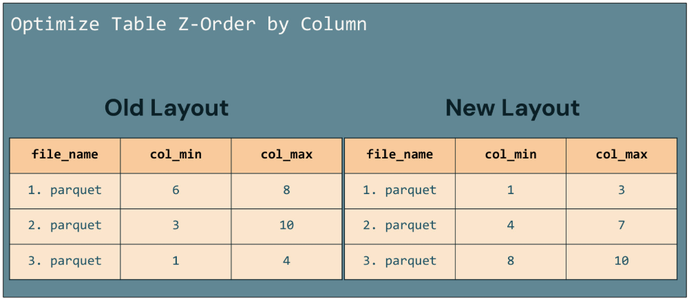
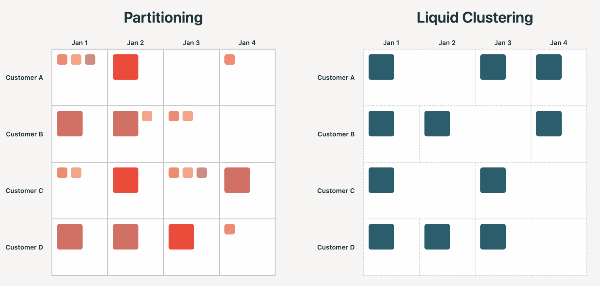

# Z-Ordering

Z-Ordering ist eine Technik zur physischen Organisation von Tabellendaten, die Data Skipping (siehe [Data Skipping und Tabellenstatistiken.md](Data%20Skipping%20und%20Tabellenstatistiken.md)) erheblich effektiver macht. Obwohl Databricks für neue Tabellen inzwischen Liquid Clustering empfiehlt, ist Z-Ordering weiterhin relevant — sowohl für bestehende Tabellen als auch zum Verständnis, welches Problem Liquid Clustering eigentlich löst. Basierend auf einer privaten Kursnotiz sowie offiziellen Databricks-Doku-Seiten und einem Engineering-Blogpost (jeweils am Ende jedes Abschnitts referenziert).

## Abschnittsübersicht

1. [Was ist Z-Ordering?](#was-ist)
2. [Wie Z-Ordering Data Skipping verbessert](#wie-es-wirkt)
3. [Syntax: `OPTIMIZE ... ZORDER BY`](#syntax)
4. [Grenzen von Z-Ordering](#grenzen)
5. [Z-Ordering vs. Liquid Clustering](#vs-liquid-clustering)
6. [Zusammenfassung](#zusammenfassung)

---

## <a id="was-ist">1. Was ist Z-Ordering?</a>

Aus einer privaten Kursnotiz übernommen: Z-Ordering ist eine Methode, Daten innerhalb einer Tabelle **basierend auf einer bestimmten Spalte** so zu organisieren, dass **ähnliche Werte in denselben Dateien gespeichert werden**. Obwohl Databricks aktuell für neue Tabellen Liquid Clustering gegenüber Z-Ordering oder Partitionierung empfiehlt, ist **Z-Ordering weiterhin manchmal nützlich**.

**Offiziell bestätigt:** Z-Ordering kolokiert Spalteninformationen im selben Satz von Dateien — Delta Lakes Data-Skipping-Algorithmen nutzen diese Kolokation, um die Menge zu lesender Daten zu reduzieren.

**Wann Z-Ordering sinnvoll ist:** wenn eine Spalte voraussichtlich häufig in Query-Prädikaten verwendet wird und diese Spalte eine hohe Kardinalität aufweist (also viele unterschiedliche Werte hat).

### Quelle

- Private Kursnotiz
- https://docs.databricks.com/aws/en/sql/language-manual/delta-optimize

---

## <a id="wie-es-wirkt">2. Wie Z-Ordering Data Skipping verbessert</a>

Aus einer privaten Kursnotiz, in zwei Schritten:

1. **Schritt 1:** Die Daten werden physisch nach der gewählten Spalte organisiert.
2. **Schritt 2:** Jede Datendatei zeichnet die **Minimum- und Maximum-Werte** für diese Spalte in ihren Metadaten auf (zum Beispiel im Footer einer Parquet-Datei).

**Data Skipping:** Dieses Setup erlaubt es Spark, bei einer Query, die nach der Z-geordneten Spalte filtert, diese Min/Max-Werte zu prüfen und alle Dateien zu überspringen, die unmöglich die benötigten Daten enthalten können — ohne sie überhaupt zu öffnen. Das reduziert die Anzahl zu lesender Dateien und verbessert die Gesamt-Query-Performance erheblich, besonders bei Queries, die nach Spalten mit vielen unterschiedlichen Werten filtern.



### Konkretes Beispiel

Mit angewendetem Z-Ordering wird der Vorteil deutlich, wenn eine Query nach einem bestimmten Wert sucht (zum Beispiel Zeilen, bei denen eine Spalte gleich sieben ist). Vor dem Z-Ordering muss Spark möglicherweise mehrere Dateien öffnen, um zu prüfen, ob sie den Wert sieben enthalten, da es keine effiziente Möglichkeit gibt zu wissen, welche Dateien relevant sind. Nach dem Z-Ordering sind die Daten so organisiert, dass der Wert sieben — falls vorhanden — in einer bestimmten Datei enthalten ist, wie durch die in den Metadaten jeder Datei gespeicherten Min/Max-Statistiken angezeigt. Spark kann diese Statistiken nutzen, um sofort die eine Datei zu identifizieren und zu öffnen, die den Zielwert enthalten könnte, und alle anderen Dateien zu überspringen, die die sieben nicht enthalten. Dieser gezielte Zugriff vermeidet unnötige Dateilesevorgänge und verbessert die Geschwindigkeit und Effizienz der Query-Ausführung.


### Quelle

- Private Kursnotiz

---

## <a id="syntax">3. Syntax: `OPTIMIZE ... ZORDER BY`</a>

```sql
OPTIMIZE table_name [FULL] [WHERE predicate] [ZORDER BY (col_name1 [, ...])]
```

**Beispiel:**

```sql
OPTIMIZE events
WHERE date >= current_timestamp() - INTERVAL 1 day
ZORDER BY (eventType);
```

**Wichtige Eigenschaften:**

- Mehrere Spalten lassen sich als kommagetrennte Liste angeben, aber **die Effektivität der Kolokation sinkt mit jeder zusätzlichen Spalte**. Databricks empfiehlt, **nie mehr als 4 Spalten** zu verwenden, da zu viele Spalten die Z-Ordering-Effektivität verschlechtern.
- Z-Ordering ist **nicht idempotent**, arbeitet aber **inkrementell** — anders als das reine Bin-Packing-Kompaktieren (siehe [Grundlagen der Query-Performance.md](Grundlagen%20der%20Query-Performance.md), Abschnitt 4), das idempotent ist. Ein zweiter Z-Order-Lauf auf bereits geordneten Daten kann also weiterhin Effekt haben.
- Z-Ordering balanciert Dateien nach **Anzahl der Tupel**, nicht nach Speichergröße.
- Databricks empfiehlt, ZORDER BY nicht auf Spalten anzuwenden, für die keine Statistiken gesammelt werden — das ist wirkungslos und verbraucht unnötige Rechenressourcen (siehe [Data Skipping und Tabellenstatistiken.md](Data%20Skipping%20und%20Tabellenstatistiken.md), Abschnitt 4, zu Statistik-Konfiguration).
- **Inkompatibilität:** Diese Klausel lässt sich **nicht** auf Tabellen anwenden, die Liquid Clustering nutzen.

### Quelle

- https://docs.databricks.com/aws/en/sql/language-manual/delta-optimize

---

## <a id="grenzen">4. Grenzen von Z-Ordering</a>

Aus dem Databricks-Engineering-Blog, im direkten Vergleich zu Liquid Clustering:

**Keine echte durchgängige Ordnung:** „Z-Order erhält keine echte Ordnung über die gesamte Tabelle hinweg. Werte derselben Spalte können sich über viele Dateien verteilen, sodass die Min/Max-Bereiche je Datei breiter sind und Queries weniger Dateien überspringen können, als sie es mit Liquid könnten."

**Unnötige Neuschreibvorgänge:** „Z-Order muss periodisch erneut ausgeführt werden, sobald neue Daten eintreffen, und jeder erneute Lauf schreibt große Mengen alter, möglicherweise bereits geordneter Daten neu, um die Ordnungsqualität wiederherzustellen." Das steht im Gegensatz zu Liquid Clustering, das inkrementell clustert — auch beim Schreiben selbst —, sodass das Layout ohne unnötige Neuschreibvorgänge optimal bleibt.

**Historischer Kontext:** Z-Ordering wurde ursprünglich als Workaround für die Einschränkungen der Partitionierung eingeführt (siehe [Partitioning.md](Partitioning.md)) — der Blogpost argumentiert jedoch, dass dieser Ansatz „die Partitionierung nicht rettet" und eigene Performance-Probleme schafft.

### Quelle

- https://www.databricks.com/blog/debunking-8-data-layout-myths-why-liquid-clustering-outperforms-partitioning

---

## <a id="vs-liquid-clustering">5. Z-Ordering vs. Liquid Clustering</a>

| Aspekt | Z-Ordering | Liquid Clustering |
|---|---|---|
| Ordnungsqualität | approximativ, verschlechtert sich mit mehr Spalten | konsistent, echte Kolokation |
| Ausführung | manueller, periodischer `OPTIMIZE`-Befehl | inkrementell, auch beim Schreiben |
| Neuschreibaufwand | hoch — jeder Lauf kann große Datenmengen neu schreiben | minimal — nur neue/ungeclusterte Daten |
| Änderbarkeit der Keys | erfordert vollständigen Neu-Lauf | Keys jederzeit ohne vollständigen Rewrite änderbar |
| Kombinierbarkeit mit Partitionierung | ja, wird oft kombiniert eingesetzt | nein, ersetzt Partitionierung vollständig |
| Databricks-Empfehlung für neue Tabellen | nicht mehr empfohlen | empfohlen |



Ausführliche Behandlung von Liquid Clustering, seinen Vorteilen und Predictive Optimization in [Liquid Clustering.md](Liquid%20Clustering.md).

### Quelle

- https://www.databricks.com/blog/debunking-8-data-layout-myths-why-liquid-clustering-outperforms-partitioning

---

## <a id="zusammenfassung">6. Zusammenfassung</a>

- Z-Ordering organisiert Tabellendaten physisch nach einer oder mehreren Spalten, sodass ähnliche Werte in denselben Dateien landen — die dadurch entstehenden engen Min/Max-Bereiche je Datei machen Data Skipping deutlich effektiver.
- Syntax: `OPTIMIZE table_name [WHERE predicate] ZORDER BY (col_name [, ...])` — maximal 4 Spalten empfohlen, da die Effektivität mit jeder zusätzlichen Spalte sinkt.
- Z-Ordering ist nicht idempotent und muss periodisch neu ausgeführt werden, was zu unnötigen Neuschreibvorgängen bereits geordneter Daten führen kann — sein zentraler struktureller Nachteil gegenüber Liquid Clustering.
- Z-Ordering lässt sich nicht mit Liquid Clustering kombinieren; Databricks empfiehlt für neue Tabellen inzwischen durchgängig Liquid Clustering, das inkrementell und ohne diese Nachteile clustert.
