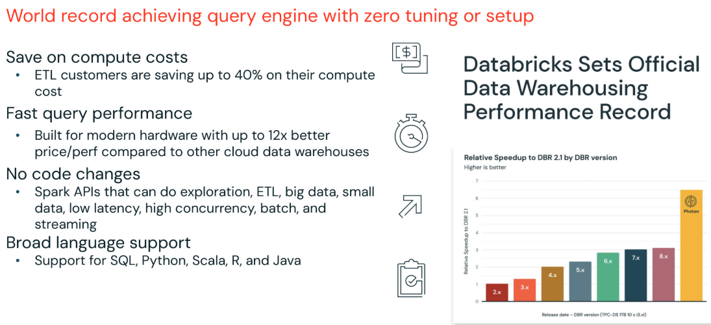
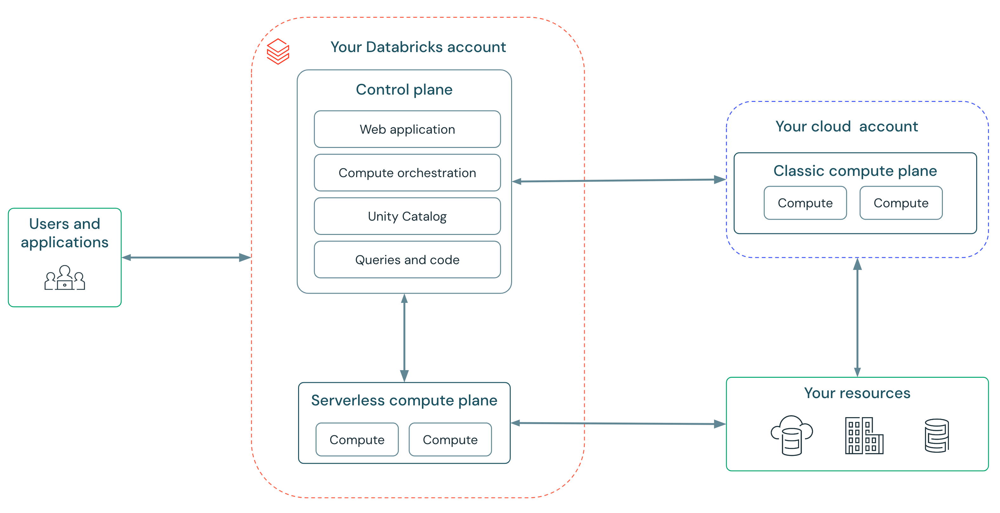

# Cluster-Typen und Serverless Compute

Die Wahl des richtigen Compute-Typs ist eine der wirkungsvollsten Performance- und Kostenentscheidungen in Databricks — noch vor jeder Code-Optimierung. Dieses Dokument behandelt die drei klassischen Compute-Typen, Spot-Instances, Autoscaling, Photon im Cluster-Kontext und den zunehmend zentralen Serverless-Compute-Ansatz. Basierend auf einer privaten Kursnotiz sowie offiziellen Databricks-Doku-Seiten und Engineering-Blogposts (jeweils am Ende jedes Abschnitts referenziert). Ergänzt [Instance-Auswahl und Cluster-Sizing.md](Instance-Auswahl%20und%20Cluster-Sizing.md), das die konkrete VM-Auswahl innerhalb dieser Compute-Typen behandelt.

## Abschnittsübersicht

1. [Drei Compute-Typen im Überblick](#drei-typen)
2. [All-Purpose Compute im Detail](#all-purpose)
3. [Jobs Compute im Detail](#jobs-compute)
4. [SQL Warehouses im Detail](#sql-warehouses)
5. [Spot Instances](#spot-instances)
6. [Autoscaling](#autoscaling)
7. [Photon im Cluster-Kontext](#photon)
8. [Cluster-Optimierungsempfehlungen nach Workload](#empfehlungen)
9. [Serverless Compute](#serverless)
10. [Zusammenfassung](#zusammenfassung)

---

## <a id="drei-typen">1. Drei Compute-Typen im Überblick</a>

Aus einer privaten Kursnotiz: Bevor Code in die Produktion geht, wird er typischerweise auf **interaktiven Clustern** entwickelt — auch als **All Purpose Compute** bezeichnet, gedacht für Entwicklungsarbeit und iteratives Testen. **Jobs Compute** ist speziell für die Ausführung von Workflow-Jobs konzipiert. Beim Erstellen eines Workflow-Jobs sollte Jobs Compute statt All Purpose Compute genutzt werden, da es die für diese Aufgaben passenden Ressourcen bereitstellt. Jobs-Compute-Cluster sind Single-User, gut für Isolation und Debugging geeignet und kommen generell zu geringeren Kosten. Der dritte Typ sind **SQL Warehouses**, die Photon eingebaut haben für Performance und für hohe Nebenläufigkeit, Ad-hoc-SQL-Queries und BI-Serving gedacht sind — spezifisch für SQL-Workloads genutzt.

Jeder dieser Compute-Typen dient einem anderen Zweck: All Purpose Compute für Entwicklung, Jobs Compute für Job-Ausführung, SQL Warehouses für BI und SQL-Analytics.

### Cluster-Typen im Detail (aus Kursmaterial)

**ALL PURPOSE COMPUTE**

- Ausgelegt für interaktive Workloads, einschließlich Streaming-Workloads.
- Auto-Scale aktivieren, um bei Bedarf Kapazität hinzuzufügen und die Antwortzeit zu verkürzen.
- Sicherheitsaspekte müssen berücksichtigt werden, da Autoscaling zusätzliche Risiken einführen kann.

**JOBS COMPUTE**

- Läuft auf ephemeren Clustern, die für den Job erstellt werden und bei Abschluss terminieren.
- Vorab geplant oder über die API übermittelt.
- Single-User.
- Hervorragend für Isolation und Debugging.
- Für Produktion und wiederkehrende Workloads.
- Geringere Kosten.

**SQL WAREHOUSE**

- Gebaut für hohe Nebenläufigkeit, Ad-hoc-SQL-Analytics und BI-Serving.
- Photon inklusive.
- Empfehlung: gemeinsames Warehouse für Ad-hoc-SQL-Analytics, isoliertes Warehouse für spezifische Workloads.
- Serverless verfügbar für sofortigen Start und niedrigere Gesamtbetriebskosten (TCO).

### Offizielle Ergänzung: Empfehlungen je Anwendungsszenario

| Szenario | Empfehlung |
|---|---|
| Interaktive Notebooks | Serverless Compute generell empfohlen — schnellerer Start, automatische Skalierung, niedrigere Kosten; Serverless SQL Warehouse für SQL-basierte Analytics; klassisches All-Purpose nur, wenn RDD-APIs oder R-Sprachunterstützung benötigt werden |
| Automatisierte Jobs | Serverless Compute für die meisten Szenarien bevorzugt (weniger zu verwaltende Einstellungen, schnellerer Start, automatische Skalierung, niedrigere Kosten); SQL Warehouse für SQL-spezifische Aufgaben; klassisches Jobs Compute für Nicht-SQL-Workloads mit individuellen Cluster-Konfigurationsanforderungen; klassisches All-Purpose generell vermeiden |
| Pipelines | Serverless Compute für die meisten automatisierten Workloads empfohlen; klassisches Pipeline-Compute nur bei nicht unterstützten Serverless-Features oder Legacy-Hive-Metastore |

### Quellen

- Private Kursnotiz
- https://docs.databricks.com/aws/en/compute/choose-compute
- https://docs.databricks.com/aws/en/compute/use-compute

---

## <a id="all-purpose">2. All-Purpose Compute im Detail</a>

All-Purpose-Cluster lassen sich über UI, CLI oder REST API erstellen und manuell neu starten. Mehrere Nutzer können solche Cluster gemeinsam für kollaborative, interaktive Analyse nutzen.

**Berechtigungen für bestehende Compute-Ressourcen:**

| Berechtigung | Umfang |
|---|---|
| `CAN ATTACH TO` | anhängen und Metriken einsehen |
| `CAN RESTART` | starten, neu starten, terminieren |
| `CAN MANAGE` | Details, Berechtigungen und Größe bearbeiten |

**Erstellungsrechte:** Workspace-Administratoren können jeden Compute-Typ erstellen; Nicht-Admin-Nutzer mit der Berechtigung „Unrestricted cluster creation" haben Zugriff auf alle Konfigurationsoptionen und können jeden Compute-Typ erstellen; Nicht-Admin-Nutzer ohne diese Berechtigung können Compute nur über zugewiesene Richtlinien (Policies) erstellen.

### Quelle

- https://docs.databricks.com/aws/en/compute/use-compute

---

## <a id="jobs-compute">3. Jobs Compute im Detail</a>

Der Databricks-Job-Scheduler erstellt einen Jobs-Cluster, wenn ein Job auf einem neuen Job-Cluster ausgeführt wird, und terminiert den Cluster nach Abschluss des Jobs. Ein Jobs-Cluster lässt sich **nicht** neu starten — anders als ein All-Purpose-Cluster.

### Quelle

- https://docs.databricks.com/aws/en/compute/use-compute

---

## <a id="sql-warehouses">4. SQL Warehouses im Detail</a>

Es gibt drei Typen von SQL Warehouses: **Classic**, **Pro** und **Serverless**. Databricks empfiehlt, wo verfügbar, Serverless Warehouses zu nutzen.

### Performance-Feature-Matrix

| Feature | Serverless | Pro | Classic |
|---|---|---|---|
| Photon-Engine | ✓ | ✓ | ✓ |
| Predictive I/O | ✓ | ✓ | ✗ |
| Intelligent Workload Management | ✓ | ✗ | ✗ |

### Startzeiten und Skalierungsverhalten

| Typ | Startzeit | Skalierungsverhalten |
|---|---|---|
| **Serverless** | typisch 2–6 Sekunden | schnelles Hochskalieren zur Latenz-Minimierung, schnelles Herunterskalieren zur Kostenminimierung |
| **Pro** | typisch ~4 Minuten | weniger reaktionsschnell als Serverless, geeignet bei nicht verfügbarem Serverless oder individuellem Netzwerk-Setup |
| **Classic** | typisch ~4 Minuten | Einstiegs-Performance, ohne Predictive I/O oder Intelligent Workload Management, dadurch geringere Performance als Serverless oder Pro |

**Compute-Standort:** Bei Serverless verwaltet Databricks die Compute-Schicht vollständig; bei Pro und Classic läuft die Compute-Schicht im eigenen Cloud-Konto.

### Quellen

- https://docs.databricks.com/aws/en/compute/sql-warehouse/warehouse-types
- https://docs.databricks.com/aws/en/compute/choose-compute

---

## <a id="spot-instances">5. Spot Instances</a>

Aus einer privaten Kursnotiz: Kosten lassen sich durch Spot Instances reduzieren, die Cloud-Anbieter zu niedrigeren Preisen anbieten, weil sie aktuell ungenutzt sind. Diese Instanzen erlauben es, verfügbare Compute-Ressourcen zu Preisen unterhalb des Marktpreises zu nutzen — mit dem Verständnis, dass der Anbieter sie zurückfordern kann, wenn die Nachfrage steigt. Dieser Ansatz eignet sich besonders für nicht geschäftskritische Jobs.

**Für zusätzliche Stabilität** lässt sich der Cluster mit einer On-Demand-VM-Instanz für den Driver konfigurieren, um sicherzustellen, dass die Kontrollebene des Jobs stabil bleibt, während Spot Instances für die Worker genutzt werden, um Kosten zu sparen. Muss der Anbieter die Spot Instances zurückfordern, scheitert der Hauptjob nicht vollständig, da der Driver weiterläuft.

**Für wichtige Jobs oder Workflows mit strikten SLAs** lassen sich Spot Instances mit Fallback auf On-Demand-VMs nutzen — das stellt sicher, dass Kosteneinsparungen genutzt werden, wo möglich, während Unterbrechungen vermieden werden, falls Spot-Kapazität entzogen wird.

| SLA | Spot oder On-Demand |
|---|---|
| Nicht geschäftskritische Jobs | Driver On-Demand, Worker Spot |
| Workflows mit strikten SLAs | Spot Instance mit Fallback auf On-Demand |

**Weitere Kernpunkte aus dem Kursmaterial:**

- Spot Instances nutzen, um freie VM-Instanzen unterhalb des Marktpreises zu erhalten.
- Hervorragend geeignet für Ad-hoc-/gemeinsam genutzte Cluster.
- Nicht empfohlen für Jobs mit geschäftskritischen SLAs.
- **Niemals für den Driver verwenden!**
- On-Demand- und Spot-Instances kombinieren (mit angepasstem Spot-Preis), um Cluster für unterschiedliche Anwendungsfälle zuzuschneiden.

### Offizielle Bestätigung und Ergänzung

„Databricks empfiehlt, keine Spot Instances für den Driver-Knoten zu verwenden." Wird ein Spot-Pool für Worker-Knoten genutzt, sollte als Driver-Typ ein On-Demand-Pool gewählt werden. Spot-Instance-Pools eignen sich für Cluster, die interaktive Entwicklung unterstützen, oder für Jobs, bei denen Kosteneinsparungen Priorität vor Zuverlässigkeit haben; On-Demand-Pools eignen sich für Jobs mit kurzer Ausführungszeit und strikten Zeitanforderungen.

**Empfohlenes hybrides Muster:** Der Spark-Driver läuft auf einer garantierten On-Demand-Instanz, Worker-Knoten nutzen eine Mischung aus On-Demand- und Spot-Ressourcen. „Die On-Demand-Worker garantieren, dass Jobs letztlich abgeschlossen werden (Vorhersagbarkeit sichergestellt), während die Spot-Instances die Job-Abschlusszeiten beschleunigen." Reine Spot-Cluster (100 %) eignen sich für explorative Szenarien, in denen eine Terminierung akzeptabel ist — für Produktions-Workloads problematisch, da der gesamte Cluster sofort ausfällt, falls der Master-Knoten terminiert wird (**der Driver darf daher nie Spot sein**, siehe oben).

**Fallback auf On-Demand:** ersetzt automatisch terminierte Spot-Instances durch On-Demand-Knoten, wenn Spot-Preise das eigene Gebot übersteigen — hält die Cluster-Größe konstant und stellt sicher, dass Jobs letztlich abgeschlossen werden, ggf. zu höheren Kosten.

**Spot-Gebotspreis-Konfiguration:** Standardmäßig 100 % des On-Demand-Preises — „berechne mir, was auch immer der aktuelle Spot-Marktpreis ist, aber nie mehr als den On-Demand-Preis für denselben Instanztyp." Konservativere Gebote (z. B. 50 % des On-Demand-Preises) maximieren Einsparungen, riskieren aber häufigere Terminierung; aggressivere Gebote (120–150 %) verbessern die Stabilität bei weiterhin kosteneffektivem Betrieb.

### Quellen

- Private Kursnotiz
- https://docs.databricks.com/aws/en/compute/pool-best-practices
- https://www.databricks.com/blog/2016/10/25/running-apache-spark-clusters-with-spot-instances-in-databricks.html

---

## <a id="autoscaling">6. Autoscaling</a>

Aus einer privaten Kursnotiz: Autoscaling erlaubt es einem Databricks-Cluster, seine Größe automatisch basierend auf der Workload-Nachfrage anzupassen. Werden mehr Ressourcen für Jobs, Queries oder Tasks benötigt, kann Autoscaling die Anzahl der Worker-Knoten erhöhen und so die Performance bei wachsender Workload verbessern. Sinkt die Nachfrage, skaliert Autoscaling den Cluster herunter und reduziert die Betriebskosten im Vergleich zu einem dauerhaft statisch dimensionierten Cluster.

**Nutzung:** Das Feature aktivieren und eine minimale und maximale Anzahl an Workern festlegen. Dieser Bereich erfordert oft etwas Experimentieren, typischerweise während der Entwicklung oder bei Analytics-Workloads, um eine optimale Balance zu finden. Für Entwicklung und Ad-hoc-Analytics kann eine höhere Obergrenze hilfreich sein, um Flexibilität für schwankende Nutzung zu bieten. Reift ein Workflow und werden die Datenvolumina vorhersehbarer, wird Autoscaling weniger notwendig. Für manche Produktions-Batch-Jobs reicht ein fest dimensionierter Cluster aus, aber eine gesetzte Obergrenze kann helfen, gelegentliche Spitzen im Datenvolumen abzufangen. Autoscaling wird auch in Streaming-Umgebungen und mit Spark Declarative Pipelines unterstützt.

**Kernpunkte:**

- Passt die Cluster-Größe dynamisch basierend auf der Workload an.
- Kann schneller laufen als ein statisch dimensionierter, unterprovisionierter Cluster.
- Kann die Gesamtkosten im Vergleich zu einem statisch dimensionierten Cluster reduzieren.
- Das Festlegen des Worker-Bereichs erfordert etwas Experimentieren.

| Anwendungsfall | Autoscaling-Bereich |
|---|---|
| Ad-hoc-Nutzung oder Business Analytics | große Varianz |
| Produktions-Batch-Jobs | nicht nötig oder Puffer an der Obergrenze |
| Streaming | verfügbar in Spark Declarative Pipelines |

### Offizielle Konfigurationsdetails

Ist **Enable autoscaling** aktiviert, lassen sich Minimum und Maximum der Worker-Anzahl über die Felder **Min** und **Max** neben dem Worker-Type-Dropdown festlegen. Ist Autoscaling deaktiviert, muss stattdessen eine feste Anzahl an Workern im Feld **Workers** eingetragen werden.

**Optimized Autoscaling** (Premium-Plan+):

- Skaliert von Min zu Max in höchstens 2 Skalierungsereignissen.
- Kann herunterskalieren, selbst wenn die Compute-Ressource nicht idle ist, indem der Shuffle-File-Zustand berücksichtigt wird (siehe [Shuffles.md](../Code%20Optimization/Shuffles.md), Abschnitt 13.5, zu Optimized Autoscaling und Shuffle-Daten).
- Jobs-Compute skaliert nach 40 Sekunden Unterauslastung herunter, All-Purpose-Compute nach 150 Sekunden.
- `spark.databricks.aggressiveWindowDownS` steuert die Häufigkeit des Herunterskalierens (maximal 600 Sekunden).

**Standard Autoscaling** (Standard-Plan): startet mit dem Hinzufügen von 8 Knoten, skaliert dann exponentiell weiter hoch; skaliert herunter, wenn 90 % der Knoten für 10 Minuten nicht ausgelastet sind und die Compute-Ressource mindestens 30 Sekunden idle war — exponentielles Herunterskalieren beginnend mit 1 Knoten.

### Quellen

- Private Kursnotiz
- https://docs.databricks.com/aws/en/compute/configure

---

## <a id="photon">7. Photon im Cluster-Kontext</a>

Aus einer privaten Kursnotiz: Photon, Databricks' weltrekordbrechende Engine, erfährt ernsthafte Adoption durch Kunden:

- Photon hat den vorherigen TPC-DS-Data-Warehouse-Weltrekord um mehr als das 2-Fache pulverisiert!
- Bei ETL sehen Kunden eine **40%ige Reduktion** ihrer Compute-Ausgaben.
- **6x besseres Preis-Leistungs-Verhältnis** gegenüber anderen Cloud-Data-Warehouses und insgesamt **2–3x Reduktion** ihrer Query-Zeiten gegenüber Open-Source-Spark.
- Im vergangenen Quartal stieg die Nutzung durch Kunden um das **5-Fache**!
- Kunden können Photon leicht adoptieren: keine Code-Änderungen oder Tuning nötig, nutzbar in der Sprache ihrer Wahl — SQL, Python, Scala, R und Java.

Letztlich können Kunden Exploration, ETL, Big Data, Small Data, niedrige Latenz, hohe Nebenläufigkeit, Batch und Streaming — alles auf einer einzigen Engine und einem einzigen API-Set — durchführen.

### Offizieller TPC-DS-100TB-Weltrekord

Databricks SQL stellte einen offiziellen TPC-DS-100TB-Benchmark-Rekord von **32.941.245 QphDS** auf und übertraf damit Alibabas vorherigen Rekord von 14.861.137 QphDS um **2,2x** — bei gleichzeitig **10 % reduzierten Gesamtsystemkosten** gegenüber dem vorherigen Rekordhalter. Unabhängige Validierung durch das Barcelona Supercomputing Center bestätigte diese Ergebnisse und stellte fest, dass Databricks **2,7x schneller und 12x besser im Preis-Leistungs-Verhältnis** war als Snowflake bei abgeleiteten TPC-DS-Tests.

**Zentrale Technologien:**

- **Photon:** „ein vollständiger Neubau einer Engine, von Grund auf in C++ geschrieben, für moderne SIMD-Hardware, mit intensiver paralleler Query-Verarbeitung" — diese MPP-Architektur (Massively Parallel Processing) ermöglichte effiziente Ausführung großskaliger Queries.
- **Delta Lake:** brachte „zusätzliche Indizierung und Statistiken zu Parquet" und ermöglichte Optimierung ohne proprietäre Datenformate — Tests zeigten, dass das Abfragen kalter S3-Daten nur 10 % langsamer war als optimierte, gecachte Formate.
- **Query-Optimierung:** ein vollwertiger kostenbasierter Query-Optimizer, eine native vektorisierte Ausführungs-Engine sowie Fähigkeiten wie Window-Funktionen.

Die Ergebnisse durchliefen ein formelles Audit und eine Prüfung durch den Transaction Processing Performance Council (TPC) — ein offiziell anerkannter Benchmark, kein herstellerbehaupteter Test.

### Quellen

- Private Kursnotiz
- https://www.databricks.com/blog/2021/11/02/databricks-sets-official-data-warehousing-performance-record.html

---

## <a id="empfehlungen">8. Cluster-Optimierungsempfehlungen nach Workload</a>

Aus einer privaten Kursnotiz: Für die Cluster-Optimierung hängt der empfohlene Ansatz vom Workload ab.

1. **DS & DE Development:** All-Purpose Compute, Auto-Scale und Auto-Stop aktiviert, auf einer Teilmenge der Daten entwickeln und testen.
2. **Ingestion & ETL Jobs:** Jobs Compute, entsprechend den SLA-Anforderungen des Jobs dimensioniert.
3. **Ad-hoc SQL Analytics:** (Serverless) SQL Warehouse, Auto-Scale und Auto-Stop aktiviert.
4. **BI Reporting:** isoliertes SQL Warehouse, entsprechend den BI-SLAs dimensioniert.
5. **Best Practices:**
   - Spot Instances auf Worker-Knoten aktivieren.
   - Wo möglich, die neueste LTS-Databricks-Runtime nutzen.
   - Photon für bestes TCO nutzen, wo anwendbar.
   - Neueste VM-Generation nutzen, zunächst mit General Purpose beginnen, dann Memory-/Compute-optimierte Typen testen.

**Ausführliche Fassung der Empfehlung:** Für Data-Science- und Data-Engineering-Entwicklung All-Purpose-Compute-Cluster mit aktiviertem Autoscale nutzen und Auto Stop einrichten, um nicht für ungenutzte Compute-Ressourcen zu zahlen. Es empfiehlt sich außerdem, auf einer Teilmenge der Daten zu entwickeln und zu testen, um die Cluster-Ressourcennutzung während der Entwicklung minimal zu halten. Für Ingestion- oder ETL-Jobs Jobs-Compute-Cluster konfigurieren und entsprechend den SLA-Anforderungen des Jobs dimensionieren. Für Ad-hoc-Analyse und SQL-Analytics SQL Warehouses nutzen, Autoscaling aktivieren und die benötigte Worker-Anzahl festlegen. Auto Stop sollte ebenfalls aktiviert werden — oder noch besser: Serverless Compute nutzen, das erhebliche Kosten- und Effizienzvorteile für eine Reihe von Jobs bietet, einschließlich BI-Reporting. Isolierte SQL Warehouses sollten für BI-Workloads genutzt und entsprechend den Geschäftsanforderungen dimensioniert werden.

Weitere Best Practices umfassen die Aktivierung von Spot Instances für Worker-Knoten und den Betrieb der neuesten LTS-Databricks-Runtime für Performance und Stabilität. Photon für verbesserte Performance und Kostenoptimierung nutzen, wo möglich, und die neueste VM-Generation wählen — dabei zunächst General Purpose testen, bevor Memory- oder Compute-optimierte Typen ausprobiert werden. Cluster-Größe und -Konfiguration stets an die Workload-Anforderungen anpassen und die Dimensionierung beim Übergang von Entwicklung zu Produktion verfeinern.

### Quelle

- Private Kursnotiz

---

## <a id="serverless">9. Serverless Compute</a>

Aus einer privaten Kursnotiz: Klassisches Compute erfordert Zeit für Konfiguration und Tuning — Instanztypen, Autoscaling, Spot Instances und Photon. Serverless Compute stellt eine andere Frage: Was, wenn all das nicht selbst verwaltet werden müsste?

Serverless ist um drei Wertversprechen herum aufgebaut:

- **Erhöhte Produktivität** — sofortiger Kaltstart, Autoscaling in Sekunden und Auto-Tuning bedeuten, dass Engineers Zeit mit Code schreiben verbringen, statt auf Cluster zu warten oder Konfigurationen anzupassen.
- **Zero Management** — Pool-Management, Kapazitätsreservierungen und eingebaute Sicherheit werden automatisch von Databricks gehandhabt. Einmal einrichten, dann läuft es von selbst.
- **Niedrigeres TCO** — es wird nur für tatsächlich genutzte Ressourcen bezahlt. Keine Überprovisionierung, keine Kosten für ungenutzte Cluster.

Serverless ist inzwischen generell verfügbar (GA) über All-Purpose Compute, Jobs Compute und SQL Warehouses hinweg — keine Preview mehr.

### Kritischer Hinweis: Serverless ändert nichts an der Optimierungslogik

„Serverless handhabt die Infrastruktur-Schicht, aber du besitzt weiterhin die Optimierungs-Schicht. Shuffles, Spill, Liquid Clustering, Photon — all das gilt weiterhin. Databricks liefert automatisch die beste Infrastruktur; deine Aufgabe ist es, ihr den besten Code und das beste Datenlayout zu geben."

Konkret bedeutet das: Enthält der Code exzessive Shuffles, wird er auf Serverless langsam sein (siehe [Shuffles.md](../Code%20Optimization/Shuffles.md)). Ist das Datenlayout schlecht — kleine Dateien, kein Liquid Clustering, kein Data Skipping — wird Serverless das nicht magisch beheben (siehe [Data Skipping und Tabellenstatistiken.md](../Foundation%20Design/Data%20Skipping%20und%20Tabellenstatistiken.md) und [Liquid Clustering.md](../Foundation%20Design/Liquid%20Clustering.md)). Photon treibt weiterhin die Query-Engine darunter an. Databricks besitzt die Infrastruktur-Schicht; die Code- und Datenschicht bleibt weiterhin in der eigenen Verantwortung.

**Praktische Kennzahlen aus dem Kursmaterial:** Startzeiten von rund 15 bis 30 Sekunden, verglichen mit den 5 bis 12 Minuten, die für klassisches Compute typisch sind — bezahlt wird nur für die Compute-Zeit, die der Workload tatsächlich verbraucht.

### Offizielle GA-Ankündigung (Notebooks, Jobs, Delta Live Tables)

**Geschwindigkeit & Einfachheit:** Serverless Compute eliminiert die Komplexität der Infrastrukturverwaltung — Compute initialisiert in Sekunden statt Minuten durch vorgewärmte Instance-Pools.

**Kosteneffizienz:** Anders als traditionelle Modelle, die für bereitgestellte Kapazität unabhängig von der Nutzung abrechnen, spiegelt die Serverless-Abrechnung die tatsächlich geleistete Arbeit wider. Der intelligente Autoscaler stellt Kapazität dynamisch bereit und skaliert bei Abschluss der Workload herunter — keine Kosten für Leerlaufzeit.

**Zuverlässigkeit:** Databricks verwaltet eine gemeinsam genutzte Compute-Flotte im Auftrag der Kunden, inklusive automatischem Instanztyp-Failover und Verfügbarkeitspuffern, um Workloads vor Cloud-Provider-Ausfällen zu schützen.

**Kundenbeispiele:**

- **Airbus:** hebt die Ein-Klick-Aktivierung von Serverless hervor, nahtlos in bestehende Workflows integriert.
- **Jet Linx Aviation:** „Verarbeitung von Rohdaten zur Silver-Schicht von ~16 Minuten auf ~7 Minuten reduziert."
- **AnyClip:** betont vereinfachte Dev-zu-Prod-Migration ohne Worker-Type-Auswahl.

**Technische Voraussetzungen:** Unity-Catalog-aktivierter Workspace, Shared-Access-Mode-Kompatibilität, Databricks Runtime 14.3+, PySpark-Workloads (Scala-Unterstützung war zum Zeitpunkt der Ankündigung in Vorbereitung).

### Quellen

- Private Kursnotiz
- https://www.databricks.com/blog/announcing-general-availability-serverless-compute-notebooks-workflows-and-delta-live-tables
- https://docs.databricks.com/aws/en/compute/choose-compute

---

## <a id="zusammenfassung">10. Zusammenfassung</a>

- Databricks bietet drei klassische Compute-Typen: **All-Purpose Compute** (interaktive Entwicklung, neustartbar, mehrbenutzerfähig), **Jobs Compute** (ephemer, single-user, für Produktions-Workflows, günstiger) und **SQL Warehouses** (Photon-beschleunigt, für BI/SQL-Analytics, in Classic/Pro/Serverless-Varianten).
- **Spot Instances** senken Kosten erheblich, dürfen aber **nie für den Driver** verwendet werden — das empfohlene Muster ist On-Demand-Driver plus Spot-Worker, optional mit Fallback auf On-Demand bei kritischen SLAs.
- **Autoscaling** passt die Worker-Anzahl dynamisch zwischen einem konfigurierten Min/Max-Bereich an; Optimized Autoscaling (Premium+) berücksichtigt dabei sogar den Shuffle-Dateizustand beim Herunterskalieren.
- **Photon** liefert dokumentierte Weltrekord-Performance (TPC-DS 100TB, 2,2x schneller als der vorherige Rekordhalter) sowie im Kursmaterial genannte 40 % ETL-Kostenreduktion und 2–3x schnellere Queries gegenüber Open-Source-Spark.
- Die Wahl des Cluster-Typs sollte konsequent an den Workload gekoppelt werden: All-Purpose für Entwicklung, Jobs Compute für ETL, SQL Warehouses für Analytics/BI — jeweils mit Autoscaling und Auto-Stop, wo sinnvoll.
- **Serverless Compute** ist inzwischen GA über alle drei Compute-Typen hinweg und eliminiert manuelle Infrastrukturverwaltung nahezu vollständig — ändert aber **nichts** an der Notwendigkeit, Code und Datenlayout zu optimieren: Shuffles, Spill, Liquid Clustering und Photon bleiben relevant.
