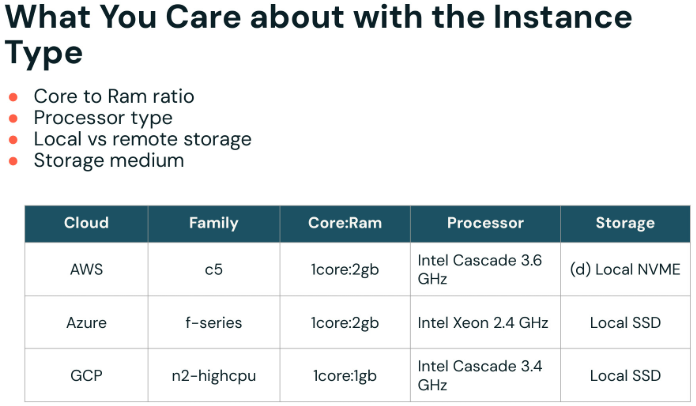
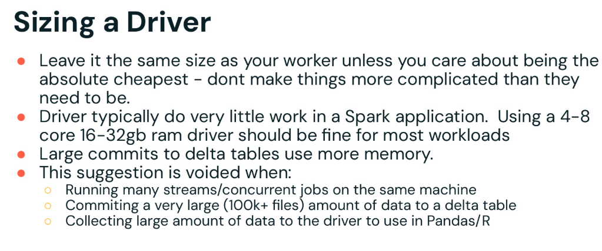
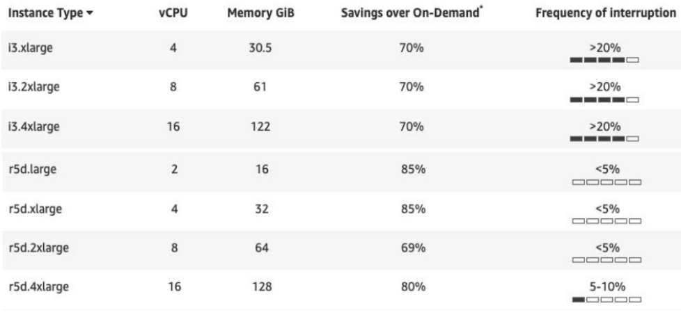
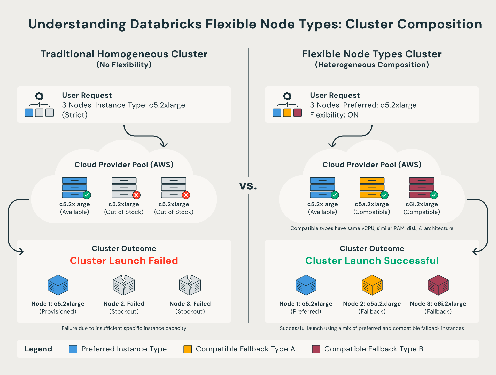
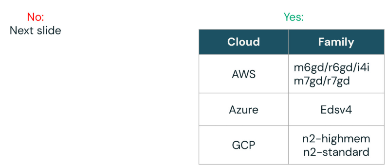
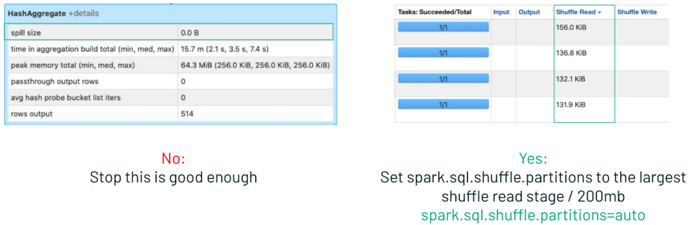
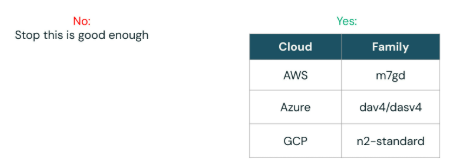
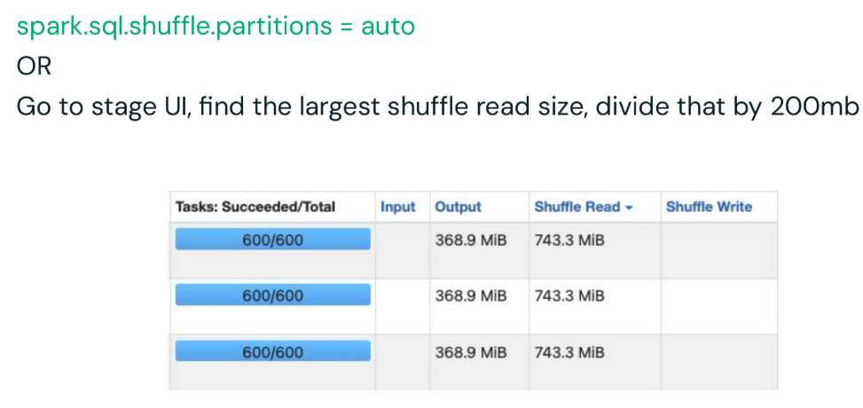
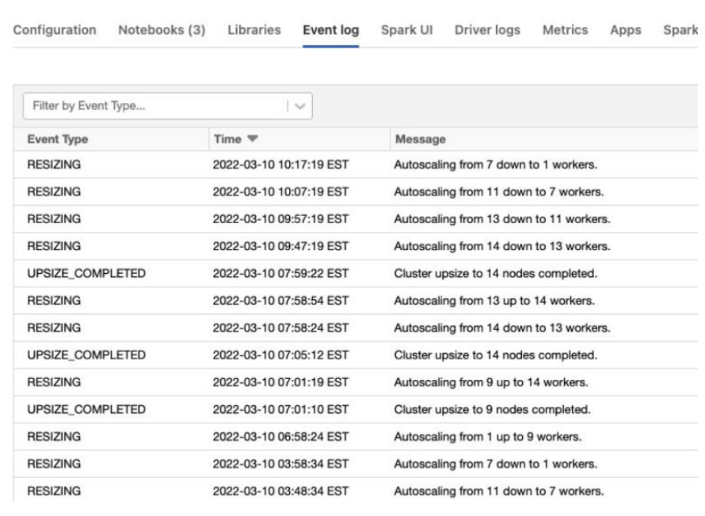

# Instance-Auswahl und Cluster-Sizing

Ist der passende Compute-Typ gewählt (siehe [Cluster-Typen und Serverless Compute.md](Cluster-Typen%20und%20Serverless%20Compute.md)), bleibt die Frage nach der konkreten VM-Auswahl, der Cluster-Dimensionierung und einem systematischen Vorgehen, um Fehlkonfigurationen zu erkennen. Dieses Dokument fasst die entsprechende Kurslektion zusammen — inklusive eines vollständigen „IFTTT"-Entscheidungsflusses (If-This-Then-That) zur Cluster-Konfiguration — ergänzt um offizielle Databricks-Doku-Seiten und Engineering-Blogposts (jeweils am Ende jedes Abschnitts referenziert).

## Abschnittsübersicht

1. [Maschinentypen nach Cloud-Anbieter](#maschinentypen)
2. [Grundregeln zur Cluster-Dimensionierung](#grundregeln)
3. [File System Read Data Size im Spark UI](#filesystem-read)
4. [Kernfaktoren bei der Instance-Auswahl](#kernfaktoren)
5. [Driver-Sizing](#driver-sizing)
6. [Spot-Markt-Überlegungen](#spot-markt)
7. [Flexible Node Types](#flexible-node-types)
8. [AWS-Graviton-Instanzen](#graviton)
9. [Der IFTTT-Entscheidungsfluss zur Cluster-Konfiguration](#ifttt)
10. [Erinnerung: Shuffle-Partitionen](#shuffle-partitionen-reminder)
11. [Erinnerung: Event Log prüfen](#event-log)
12. [Compute Creation Cheat Sheet](#cheat-sheet)
13. [Zusammenfassung](#zusammenfassung)

---

## <a id="maschinentypen">1. Maschinentypen nach Cloud-Anbieter</a>

Aus einer privaten Kursnotiz: Bei der Wahl von Maschinentypen für Cloud-Workloads sollte man sich nicht nur auf vertraute Optionen verlassen.

**AWS:** Neben i3 auch **m7gd** und **r7gd** für bessere Prozessoren und stabilere Spot-Preise ausprobieren. Caching bei Bedarf aktivieren, und **Graviton-Instanzen** für kosteneffiziente Performance in Betracht ziehen (siehe Abschnitt 8).

**Azure:** **Eav4**, **Dav4** oder **F-Series** vor der L-Series nutzen, und die **ACU-Metrik** (Azure Compute Unit) zum Vergleich der VM-Performance prüfen.

**GCP:** Die empfohlenen Standardwerte performen in der Regel gut.

**Netzwerkoptimierte Instanzen** werden selten benötigt, können aber bei Photon oder bandbreitenintensiven Workloads helfen. Immer verschiedene Instanztypen testen und den Spot-Markt sorgfältig nutzen, um Einsparungen und Stabilität auszubalancieren. Flexibilität und Offenheit für Alternativen ist der beste Weg, um die am besten geeigneten Ressourcen für die eigenen Workloads zu finden.


### Quelle

- Private Kursnotiz

---

## <a id="grundregeln">2. Grundregeln zur Cluster-Dimensionierung</a>

Aus einer privaten Kursnotiz: Die Wahl der richtigen Maschine für den eigenen Workload ist unkompliziert, wenn man einer Reihe grundlegender Faustregeln und einfacher „Wenn-dies-dann-das"-Entscheidungen folgt.

**Wichtiger Kostenhinweis:** Nutzt man einen doppelt so großen Cluster und dieser beendet den Job in halber Zeit, sind die Gesamtkosten ungefähr gleich — aber Zeit wird gespart. Das bedeutet: Ein größerer Cluster ist manchmal nicht teurer, wenn er schnellere Ergebnisse liefert, da eingesparte Zeit ebenso wertvoll sein kann wie Kosteneinsparungen.

**Faustregeln für den ersten Durchlauf:**

- `spark.sql.shuffle.partitions` zunächst auf das **Doppelte der Kernanzahl** des Clusters setzen (siehe [Shuffles.md](../Code%20Optimization/Shuffles.md), Abschnitt 8, für die vertiefte Formel basierend auf tatsächlicher Shuffle-Datenmenge).
- Den insgesamt verfügbaren Speicher jeder Maschine unter **128 GB** halten.
- Bei der Kern-Konfiguration ein Verhältnis von **einem Kern pro 128 MB bis 200 GB** an gelesenen Daten anstreben — dies ist eine Richtlinie, einzelne Ausnahmen können je nach Workload auftreten.

**Wichtiger Hinweis zum Vorgehen:** Konfigurationseinstellungen aus anderen Umgebungen oder früheren Projekten am besten nicht einfach übernehmen, sofern kein triftiger Grund dafürspricht. Mit diesen Grundrichtlinien beginnen, das eigene Setup testen und Konfigurationen nur bei Bedarf basierend auf beobachteter Performance anpassen. Dieser sorgfältige, inkrementelle Ansatz stellt sicher, dass die besten Ressourcen gewählt werden und optimale Performance sowie Kosteneffizienz für den jeweiligen Workload erreicht werden.


### Quelle

- Private Kursnotiz

---

## <a id="filesystem-read">3. File System Read Data Size im Spark UI</a>

Aus einer privaten Kursnotiz: Die im Spark UI angezeigte „File System Read Data Size" zeigt an, wie viele Daten während eines Jobs von der Festplatte gelesen werden. Das Prüfen dieses Werts hilft zu entscheiden, ob Größe und Setup des Clusters geeignet sind, und kann nötige Anpassungen für Effizienz oder Performance leiten.

### Quelle

- Private Kursnotiz

---

## <a id="kernfaktoren">4. Kernfaktoren bei der Instance-Auswahl</a>

Aus einer privaten Kursnotiz: Bei der Wahl von Instanztypen sind die Schlüsselfaktoren, auf die man sich konzentrieren sollte:

- **Core-to-RAM-Verhältnis** — wie viel Speicher pro Kern verfügbar ist.
- **Prozessortyp** — Geschwindigkeit und Generation des Prozessors.
- **Lokaler vs. entfernter Storage** — ob Storage schnelles lokales NVMe oder langsamere entfernte Disks ist.
- **Storage-Medium**.

Diese Elemente haben den größten Einfluss auf die Query-Performance. Beispiel: In AWS bieten C5-Familien-Instanzen ein Verhältnis von einem Kern zu zwei GB RAM, mit Intel-Prozessoren und lokalem NVMe-Storage. Ähnliche Details gelten für Azure- und GCP-Instanzwahlen. Diese grundlegenden Hardware-Spezifikationen zu priorisieren stellt eine effiziente und schnelle Query-Ausführung sicher.



### Quelle

- Private Kursnotiz

---

## <a id="driver-sizing">5. Driver-Sizing</a>

Aus einer privaten Kursnotiz: Bei der Dimensionierung des Drivers im Verhältnis zu den Workern eines Spark-Clusters ist es meist am einfachsten, die Größe des Drivers an die der Worker anzupassen. Das vermeidet unnötige Komplexität und funktioniert für nahezu alle Workloads gut, da der Driver in typischen Spark-Anwendungen deutlich weniger Arbeit übernimmt als die Worker. Ein Driver mit **4–8 Kernen und 16–32 GB RAM** reicht für die meisten Szenarien aus.

Um Kosten so weit wie möglich zu minimieren, ließe sich ein etwas kleinerer Driver in Betracht ziehen — generell besteht aber keine Notwendigkeit, die Sache zu verkomplizieren. Wichtig zu beachten: Werden große Datenmengen in Delta-Tabellen committet, benötigt der Driver mehr Speicher. Diese Richtlinien gelten nicht mehr, wenn viele Streams oder nebenläufige Jobs auf derselben Maschine laufen, oder wenn besonders große Commits gehandhabt werden — etwa das Schreiben von 100.000 oder mehr Dateien in eine Delta-Tabelle, oder das Sammeln großer Datenmengen zum Driver für die Nutzung mit pandas oder R. In diesen Ausnahmefällen wird ein größerer, sorgfältiger dimensionierter Driver benötigt, um Speicherprobleme zu vermeiden.



### Offizielle Ergänzung: Driver als geteilte Ressource

Der Driver ist eine geteilte Ressource — mehrere Queries teilen sich dieselbe CPU, denselben Speicher, DAG-Scheduler, Task-Scheduler und die treiberseitige UDF-Ausführung (siehe auch [Shuffles.md](../Code%20Optimization/Shuffles.md), Abschnitt 11.4, zu Multiple Streams auf einem Cluster). Für bestimmte Workloads — insbesondere lang laufende Operationen wie `VACUUM`-Jobs — empfiehlt Databricks Autoscaling mit 1–4 Workern zu je 8 Kernen und einen Driver mit 8–32 Kernen. Lässt sich der Driver bei mehreren nebenläufigen Workloads vertikal nicht weiter skalieren, empfiehlt Databricks dringend, Jobs auf mehrere Cluster aufzuteilen, um diese gemeinsam genutzten Skalierungsengpässe zu umgehen.

**Für erste Exploration:** Databricks empfiehlt Single-Node-Compute mit einem großen Node-Typ — das erlaubt die Nutzung eines größeren Driver-Knotens ohne Worker-Knoten für explorative Arbeit.

### Quellen

- Private Kursnotiz
- https://docs.databricks.com/aws/en/cheat-sheet/compute
- https://docs.databricks.com/aws/en/compute/cluster-config-best-practices

---

## <a id="spot-markt">6. Spot-Markt-Überlegungen</a>

Aus einer privaten Kursnotiz: Bei der Nutzung von Spot-VMs ist es wichtig zu wissen, dass jeder Instanztyp unterschiedliche Verfügbarkeits- und Preiseinsparungsniveaus bietet. Spot-Märkte können erhebliche Einsparungen bei der Infrastruktur bringen, aber Einsparungen und Zuverlässigkeit variieren je nach Instanz. Zum Beispiel bieten i3-Instanzen etwa **70 % Einsparung** gegenüber On-Demand-Preisen, gehen aber möglicherweise mit höheren Unterbrechungsraten einher, was sie für manche Workloads weniger attraktiv macht. Auf der anderen Seite bieten r5d-Instanzen oft noch bessere Einsparungen — bis zu **85 %** — und eine niedrigere Unterbrechungshäufigkeit, teils unter 5 %. Die Wahl von Instanztypen wie R5d Large oder Extra Large kann die Kosten erheblich senken und gleichzeitig das Unterbrechungsrisiko durch den Cloud-Anbieter minimieren.

**Kernpunkte:**

- Der Spot-Markt ist eine hervorragende Möglichkeit, bei der Infrastruktur zu sparen.
- Jeder Instanztyp hat ein unterschiedliches Verfügbarkeits- und Preiseinsparungsniveau je Region.
- Beispiel: i3s sind nicht großartig, r5d's sehen deutlich besser aus.



### Quelle

- Private Kursnotiz

---

## <a id="flexible-node-types">7. Flexible Node Types</a>

Über die manuelle Spot-Auswahl aus Abschnitt 6 hinaus bietet Databricks mit **Flexible Node Types** eine automatisierte Lösung: Diese verbessern die Zuverlässigkeit beim Compute-Start, indem Kapazitätsfehler (Stockout-Fehler) reduziert werden. Ist der bevorzugte Instanztyp nicht verfügbar (z. B. `AWS_INSUFFICIENT_INSTANCE_CAPACITY_FAILURE`, `CLOUD_PROVIDER_RESOURCE_STOCKOUT` auf Azure, `GCP_INSUFFICIENT_CAPACITY`), generiert oder nutzt Databricks automatisch eine Fallback-Liste kompatibler Instanzen, statt sofort zu scheitern.

**Kostenvorteil bei Spot-Instanzen:** Bei aktiviertem Spot-mit-Fallback versucht das System, Spot-Kapazität über die gesamte Fallback-Liste hinweg zu erhalten, bevor auf On-Demand-Instanzen zurückgegriffen wird — das erhöht den Anteil der als Spot laufenden Instanzen und senkt die Gesamtkosten.



**Konfiguration:**

- **Workspace-Ebene:** Workspace-Admins aktivieren „Enable auto flexible node types" in den Compute-Einstellungen — gilt danach automatisch für alle neuen klassischen Compute-Ressourcen.
- **Individuelle Fallback-Listen:** nur über die Clusters API konfigurierbar, über die Felder `worker_node_type_flexibility` und `driver_node_type_flexibility` mit `alternate_node_type_ids` — begrenzt auf maximal 5 eindeutige Fallback-Typen.

**Kompatibilitätsanforderungen für Fallback-Instanzen:** übereinstimmende vCPU-Anzahl und Speicher (100–110 % Bereich), gleiche lokale Disk-Anzahl und -Größe, konsistente CPU-Architektur (ARM oder x86), gleiches OS-Image und Photon-Unterstützung — keine GPU-Unterstützung, keine virtuellen Typen (m-Fleet).

**Monitoring:** tatsächlich zugewiesene Instanztypen lassen sich über die Compute-Detailseite (JSON-Ansicht, `node_type_id` je Executor), die Get-Clusters-Info-API oder System-Tabellen-Abfragen mit `node_timelines` einsehen.

**Deaktivierung:** `alternate_node_type_ids` auf ein leeres Array `[]` setzen, um Fallback-Verhalten für bestimmte Ressourcen zu unterbinden.

### Quellen

- https://docs.databricks.com/aws/en/compute/flexible-node-types
- https://www.databricks.com/blog/flexible-node-types-are-now-generally-available

---

## <a id="graviton">8. AWS-Graviton-Instanzen</a>

Bereits in Abschnitt 1 als kosteneffiziente Option erwähnt — AWS-Graviton-Prozessoren (ARM64-Architektur) bieten laut AWS das beste Preis-Leistungs-Verhältnis unter den EC2-Instanztypen. Für Databricks Runtime 15.4 LTS ML und höher zeigen sich konkrete Performance-Gewinne:

| Workload | Verbesserung mit Graviton |
|---|---|
| XGBoost und LightGBM | bis zu **11 %** Speedup beim Training von Klassifikatoren (Covertype-Datensatz) |
| Databricks AutoML | **63 % mehr Hyperparameter-Tuning-Durchläufe** gegenüber Intel-Xeon-Instanzen im gleichen Zeitraum (Graviton3) |
| Spark MLlib | bis zu **1,7x Speedup** über Algorithmen wie Decision Trees, Random Forests und Gradient-Boosted Trees |
| Feature Engineering (Point-in-Time-Joins) | bis zu **1,5x schneller** auf Graviton3 |
| Kombiniert mit Photon | **3,1x Verbesserung**, wenn beide Beschleunigungen aktiv sind |

**Preis-Leistungs-Vorteil:** Graviton-Instanzen haben niedrigere Raten auf AWS als ihre x86-Pendants, was ihr Preis-Leistungs-Verhältnis zusätzlich attraktiv macht.

**Auswahl:** Instanzen mit „7g" (Graviton3) oder „6g" (Graviton2) im Namen suchen, verfügbar ab Databricks Runtime 15.4 LTS ML.

### Quelle

- https://www.databricks.com/blog/unlock-faster-machine-learning-graviton

---

## <a id="ifttt">9. Der IFTTT-Entscheidungsfluss zur Cluster-Konfiguration</a>

Aus einer privaten Kursnotiz: „So wählt man die richtige Maschine — ziemlich einfach", basierend auf Faustregeln und einem fünfstufigen „Wenn-dies-dann-das" (IFTTT)-Entscheidungsprozess.

### Schritt 1: Photon nutzen?

Bei der Entscheidung für eine Cluster-Konfiguration zuerst fragen, ob Photon genutzt werden soll. Ist Photon nicht geplant, geht es weiter zur nächsten Reihe von Überlegungen zur VM-Auswahl (Schritt 2). Soll Photon genutzt werden, lässt sich mit der Liste der für Photon optimierten, empfohlenen VM-Typen als Ausgangspunkt beginnen.



### Schritt 2: ETL-Workload mit Joins/Windows/Aggregationen?

Wird Photon nicht genutzt, lautet die nächste Frage: Ist der Job ein ETL-Workload mit Joins, Windows, Group-by oder Aggregationen? Bei „Nein" gibt es spezifische Instanzempfehlungen für leichtere oder andere Workloads. Bei „Ja" gibt es andere Empfehlungen, die auf die Unterstützung dieser komplexeren Datenoperationen fokussiert sind. Dieser Ansatz hilft, den Maschinentyp an die Anforderungen des jeweiligen Jobs anzupassen.


### Schritt 3: Job ausführen und auf Spill prüfen

Sobald ein Instanztyp gewählt und der Cluster gemäß den Faustregeln eingerichtet ist, den Job ausführen und dann im Spark UI die am längsten laufende Query prüfen. Besonderes Augenmerk darauf, ob **Spill** auftritt (siehe [Spill.md](../Code%20Optimization/Spill.md) für die vollständige Spill-Diagnose). Tritt kein Spill auf, ist das Setup ausreichend. Wird Spill beobachtet, ist das ein Signal für weitere Anpassungen — zunächst `spark.sql.shuffle.partitions` auf die Größe der größten Shuffle-Read-Stage setzen (passt alles in 200 MB, das als Referenzpunkt nutzen). Anschließend die Shuffle-Partitionen auf `auto` setzen und Spark die Partitionierung selbst optimieren lassen, um die Performance zu verbessern und Spill zu reduzieren.



### Schritt 4: Shuffle-Partitionen aktualisiert — erneut auf Spill prüfen

Nach dem Aktualisieren der Shuffle-Partitionen erneut im Spark UI prüfen, ob weiterhin Spill auftritt. Tritt kein Spill mehr auf, ist Cluster und Konfiguration gut abgestimmt. Tritt weiterhin Spill auf, die nächste Reihe von Vorschlägen anwenden und den Job erneut ausführen.



### Schritt 5: Iterieren, bis kein Spill mehr auftritt

Diesen Prozess wiederholen — Einstellungen anpassen und Ergebnisse beobachten —, bis Spill eliminiert ist und der Job effizient läuft. Dieses schrittweise Tuning stellt sicher, dass die Konfiguration präzise auf die Bedürfnisse des jeweiligen Workloads abgestimmt ist.


### Zusammenfassung des Entscheidungsflusses

```
Photon nutzen?
├─ Ja  → Für Photon empfohlene VM-Typen als Ausgangspunkt wählen
└─ Nein → ETL-Workload mit Joins/Windows/Aggregationen?
          ├─ Ja  → Instanzempfehlungen für komplexe Datenoperationen
          └─ Nein → Instanzempfehlungen für leichtere Workloads
                     ↓
          Job ausführen → Spark UI: längste Query → Spill vorhanden?
          ├─ Nein → fertig
          └─ Ja  → spark.sql.shuffle.partitions auf Größe der größten
                    Shuffle-Read-Stage setzen (Referenz: 200 MB),
                    danach auf "auto" → Job erneut ausführen
                     ↓
                    weiterhin Spill? → wiederholen, bis kein Spill mehr auftritt
```

### Quelle

- Private Kursnotiz

---

## <a id="shuffle-partitionen-reminder">10. Erinnerung: Shuffle-Partitionen</a>

Aus einer privaten Kursnotiz: Bei Shuffle-Partitionen gilt: einfach halten. `spark.sql.shuffle.partitions` auf `auto` setzen und Spark die Anpassungen selbst vornehmen lassen. Soll manuell konfiguriert werden, in der Stage-UI von Spark nach der größten Shuffle-Read-Größe suchen. Diese Größe durch 200 teilen, um die zu setzende Anzahl an Shuffle-Partitionen zu bestimmen. Dieser Ansatz hilft, die Partitionsgröße an den eigenen Workload anzupassen und die Effizienz zu erhalten.



Ausführliche Behandlung der Shuffle-Partitionierung, inklusive AQE-Auto-Tuning und manueller Formel, in [Shuffles.md](../Code%20Optimization/Shuffles.md), Abschnitt 8.

### Quelle

- Private Kursnotiz

---

## <a id="event-log">11. Erinnerung: Event Log prüfen</a>

Aus einer privaten Kursnotiz: Das Event Log nicht vergessen. Es ist extrem nützlich, um das Verhalten des Clusters zu überwachen und Probleme zu diagnostizieren — besonders bei Spot-Fehlschlägen. Es zeigt wichtige Details wie die Größenanpassung des Clusters während des Autoscalings — von höheren zu niedrigeren Worker-Anzahlen und umgekehrt. Durch die Überprüfung des Event Logs lässt sich bestimmen, wie viele Worker tatsächlich benötigt werden, welche VM-Typen am besten funktionieren, und ob Fehler oder Unterbrechungen auftreten. Das Event Log sollte immer der erste Ort sein, an dem beim Tuning oder Troubleshooting des Clusters nachgesehen wird.

„Spot-Fehlschläge passieren. Sie verlangsamen die Dinge. Wir wissen das. Das Event Log immer zuerst prüfen — es ist wahrscheinlich das Erste, was man tun sollte."



### Offizielle Ergänzung: Event Log zur Diagnose entfernter Executors

Um herauszufinden, warum Executors ausfallen, sollte das Event Log der Compute-Ressource geprüft werden — auf Meldungen, die den Verlust von Executors erklären. Drei Hauptursachen für entfernte Executors:

1. **Autoscaling** — gilt als erwartetes Verhalten, kein Fehler.
2. **Spot-Instance-Verluste** — der Cloud-Anbieter fordert die VMs zurück. Wird eine Preemption-Benachrichtigung empfangen, versucht der Decommissioning-Prozess, Shuffle- und RDD-Daten auf gesunde Executors zu migrieren, bevor die Spot-Instance tatsächlich terminiert wird.
3. **Speichererschöpfung** — echte Fehler, die eine Untersuchung erfordern.

**Wichtige Unterscheidung:** „Wurde die Compute-Ressource durch Autoscaling in der Größe angepasst, ist das erwartet und kein Fehler." Diese Unterscheidung ist wichtig bei der Durchsicht von Event Logs, da Cluster-Resizing eine normale Operation ist, getrennt von tatsächlichen Fehlerereignissen.

**Autoscaling-Events im Event Log:** Events mit Informationen zu Enhanced Autoscaling haben den Event-Typ `autoscale`; die Cluster-Resizing-Anfrage wird im `details:autoscale`-Objekt gespeichert, mit Status-Werten wie `CLUSTER_AT_DESIRED_SIZE`, `SCALE_UP_IN_PROGRESS_WAITING_FOR_EXECUTORS` und `BLOCKED_FROM_SCALING_DOWN_BY_CONFIGURATION`.

### Quellen

- Private Kursnotiz
- https://docs.databricks.com/aws/en/optimizations/spark-ui-guide/failing-spark-jobs

---

## <a id="cheat-sheet">12. Compute Creation Cheat Sheet</a>

Die offizielle Databricks-Dokumentation fasst die in diesem Dokument behandelten Prinzipien in einem eigenen Cheat Sheet mit neun Best Practices zusammen:

1. **Serverless zuerst prüfen:** Databricks verwaltet Sizing, Skalierung und Infrastruktur automatisch — keine Cluster-Konfiguration nötig (siehe [Cluster-Typen und Serverless Compute.md](Cluster-Typen%20und%20Serverless%20Compute.md), Abschnitt 9).
2. **Access Mode:** Standard Access Mode für Multi-User-Szenarien mit Datenisolation nutzen, sofern keine spezifische Funktionalität etwas anderes erfordert.
3. **Instanztyp-Auswahl:** Bei Neueinsteigern mit General-Purpose-Instanztypen beginnen, um Workload-Anforderungen mit passenden Ressourcen abzugleichen.
4. **Graviton-Prozessoren priorisieren** aufgrund des laut AWS-Benchmarks besseren Preis-Leistungs-Verhältnisses (siehe Abschnitt 8).
5. **Generation:** Neueste EC2-Instanzgeneration wählen, wenn verfügbar, für optimale Performance und Features.
6. **Kostenoptimierung:** On-Demand- und Spot-Instances je nach Dringlichkeit des Workloads balancieren.
7. **Node-Dimensionierung:** Worker-Anzahl und Node-Größe an die Art der Operation anpassen — bei Shuffle-lastigen Workloads übertreffen wenige große Knoten oft mehrere kleine (siehe [Shuffles.md](../Code%20Optimization/Shuffles.md), Abschnitt 13.1).
8. **VACUUM-Operationen:** Cluster mit Autoscaling (1–4 Worker, je 8 Kerne) und Driver mit 8–32 Kernen konfigurieren, bei Out-of-Memory-Fehlern erhöhen.
9. **Photon evaluieren** für Batch-Workflows — schnellere Queries und reduzierte Kosten pro Workload.

### Quelle

- https://docs.databricks.com/aws/en/cheat-sheet/compute

---

## <a id="zusammenfassung">13. Zusammenfassung</a>

- Bei der Maschinenwahl über gängige Instanztypen hinausdenken: AWS (m7gd, r7gd, Graviton), Azure (Eav4, Dav4, F-Series, ACU-Metrik), GCP (Standardwerte meist ausreichend).
- Faustregeln für den ersten Durchlauf: `spark.sql.shuffle.partitions` = 2× Kernanzahl, Speicher pro Maschine unter 128 GB, ein Kern pro 128 MB–200 GB gelesener Daten.
- Kernfaktoren der Instance-Auswahl: Core-to-RAM-Verhältnis, Prozessortyp, lokaler vs. entfernter Storage.
- Driver-Größe standardmäßig an die Worker-Größe angleichen (4–8 Kerne, 16–32 GB RAM) — Ausnahmen bei sehr großen Delta-Commits oder vielen nebenläufigen Streams.
- Spot-Instanztypen unterscheiden sich stark in Einsparung und Unterbrechungsrate (i3 ~70 %/höhere Unterbrechung vs. r5d ~85 %/niedrigere Unterbrechung) — **Flexible Node Types** automatisieren die Fallback-Wahl zwischen kompatiblen Instanztypen.
- Der **IFTTT-Entscheidungsfluss** liefert einen systematischen, fünfstufigen Weg zur Cluster-Konfiguration: Photon-Entscheidung → ETL-Workload-Entscheidung → Job ausführen und auf Spill prüfen → Shuffle-Partitionen anpassen → iterieren, bis kein Spill mehr auftritt.
- Shuffle-Partitionen im Zweifel auf `auto` setzen, oder manuell über „größte Shuffle-Read-Größe ÷ 200" berechnen.
- Das **Event Log** ist die erste Anlaufstelle beim Troubleshooting — es unterscheidet erwartetes Autoscaling-Verhalten von echten Fehlern wie Spot-Verlusten oder Speichererschöpfung.
