# Shuffles in Spark und Databricks

Umfassende Referenz zu Shuffles: was sie sind, warum sie teuer sind, wie Databricks sie automatisch optimiert (AQE, Photon, Low Shuffle Merge), und welche manuellen Stellschrauben es gibt. Ergänzt die bereits vorhandene Referenz [Data Skew.md](Data%20Skew.md), mit der sich einige Grundlagen (AQE-Mechanik, Spark-UI-Diagnose) überschneiden.

**Vorausgesetzte Grundbegriffe:** Diese Datei setzt die Ausführungshierarchie Job/Stage/Task sowie die Cluster-Architektur (Driver, Worker Node, Executor, Cores) als bekannt voraus. Wer damit noch nicht vertraut ist, findet eine Einführung in [Spark-Ausführungsarchitektur.md](../Foundation%20Design/Spark-Ausfuehrungsarchitektur.md).

## Abschnittsübersicht

1. [Grundbegriffe: Job, Stage, Task](#grundbegriffe)
2. [Was ist ein Shuffle?](#was-ist-shuffle)
3. [Wide vs. Narrow Transformations](#wide-narrow)
4. [Shuffles im Spark UI und Query Profile erkennen](#erkennen)
5. [Adaptive Query Execution und Shuffles](#aqe)
6. [SQL-Hints und -Klauseln zur Steuerung von Shuffles](#hints-klauseln)
7. [PySpark: repartition, coalesce, shuffle()](#pyspark-api)
8. [Join-Strategien und Shuffles](#join-strategien)
9. [Photon und Shuffles](#photon)
10. [Low Shuffle Merge](#low-shuffle-merge)
11. [Shuffles in Structured Streaming](#streaming)
12. [Shuffles in Lakeflow Declarative Pipelines](#ldp)
13. [Cluster-Konfiguration zur Shuffle-Optimierung](#cluster)
14. [Delta-Tabellenlayout und Shuffles](#delta-layout)
15. [Query Watchdog](#query-watchdog)
16. [Historische Entwicklung und Praxisbeispiele](#historie)
17. [Zusammenfassung](#zusammenfassung)

---

## <a id="grundbegriffe">1. Grundbegriffe: Job, Stage, Task</a>

- **Job:** die gesamte Berechnung, die auf den Daten ausgeführt werden muss. Ein Job besteht aus einer oder mehreren Stages.
- **Stage:** eine Sammlung von Tasks, die gemeinsam ausgeführt werden können. Stages entstehen aus den auf die Daten angewendeten Transformationen und stellen eine Arbeitseinheit dar.
- **Task:** die kleinste Arbeitseinheit in Spark. Jeder Task führt dieselbe Operation auf einer Partition der Daten aus.


## <a id="was-ist-shuffle">2. Was ist ein Shuffle?</a>

**Shuffle:** das Verschieben von Daten vom Output einer Stage zum Input einer anderen. Es ist eine Nebenwirkung breiter (wide) Transformationen und eine kritische Operation, die Daten neu verteilt und reorganisiert.

### Anschauliches Beispiel: Zweistufiger MapReduce-Job

Ein Job mit zwei Stages: Stage 1 muss vollständig abgeschlossen sein und Daten produziert haben, bevor Stage 2 beginnen kann.


**Schritt 1 — Map:** Die Daten werden in Stage 1 eingelesen. Die Map-Transformation wird ausgeführt, wodurch Daten entstehen, die zum Reducer verschoben werden müssen.

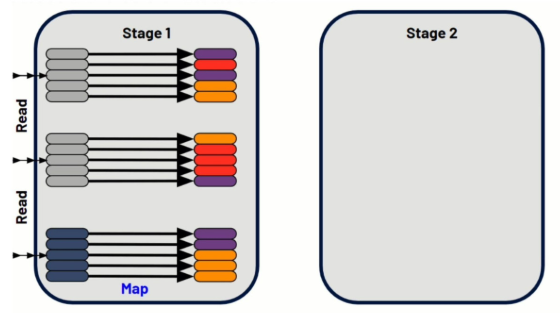

**Schritt 2 — Shuffle:** Jetzt wird geshuffelt, weil die Map-Operation Daten erzeugt hat, die basierend auf dem spezifischen Mapping in Stage 2 verschoben werden müssen. Dies verteilt Daten netzwerkweit und repräsentiert Netzwerkbewegung von einem Worker zum anderen — Worker müssen beim Cloud-Anbieter Dinge über das Netzwerk verschieben, und genau das ist ein Shuffle.

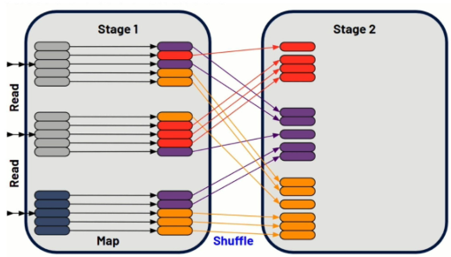

**Schritt 3 — Reduce:** Es folgt die Reduce-Operation, an deren Ende die ausgegebenen Daten stehen.


**Schritt 4 — Schreiben:** Die ausgegebenen Daten müssen anschließend in eine DataFrame oder Tabelle geschrieben werden. Stage 1 und Stage 2 sind abgeschlossen, dazwischen liegt der Shuffle — das Resultat davon, dass Daten in Stage 1 durch das Mapping zugewiesen und anschließend reorganisiert wurden, damit sie durch die Reducer-Funktion laufen können.


## <a id="wide-narrow">3. Wide vs. Narrow Transformations</a>

| Transformation | Anzahl Stages | Shuffle? | Beispiele |
|---|---|---|---|
| **Wide Transformation** | benötigt zwei Stages | **ja**, meist verbunden mit Shuffling — dem Prozess der Datenneuverteilung über Partitionen hinweg | `join()`, `distinct()`, `groupBy()`, `orderBy()`, teils Actions wie `count()` |
| **Narrow Transformation** | benötigt nur eine Stage | nein | Filter, Map, Projektionen |

---

## <a id="erkennen">4. Shuffles im Spark UI und Query Profile erkennen</a>

### 4.1 Long-Running Stages diagnostizieren (Spark UI)

Systematischer Diagnoseweg:

1. **Längste Stage identifizieren** — am Ende der Job-Seite die Stages nach Dauer sortieren.
2. **I/O-Metriken notieren** — Input, Output, **Shuffle Read** (konsumierte Shuffle-Daten), **Shuffle Write** (produzierte Shuffle-Daten).
3. **Task-Anzahl prüfen** — ein einzelner Task kann bereits ein Problem signalisieren.
4. **Detailseite öffnen** — über den Stage-Beschreibungslink zu Skew- und Spill-Analyse wechseln.


**Spill vs. Shuffle:** Spill tritt auf, wenn Spark während Shuffles, Joins, Sortierungen oder Aggregationen zu wenig Ausführungsspeicher hat und auf Festplatte ausweichen muss — Datenbewegung von Memory auf Disk kann teuer sein und tritt am häufigsten während des Daten-Shufflings auf.


**Hohes I/O einschätzen:** größte I/O-Spalte durch (Worker-Cores × Dauer in Sekunden) teilen — nähert sich das Ergebnis 3 MB/Sekunde/Core, ist die Stage wahrscheinlich I/O-gebunden.

- **Hoher Shuffle:** „Databricks empfiehlt, `spark.sql.shuffle.partitions=auto` zu setzen, damit Spark die optimale Anzahl an Shuffle-Partitionen automatisch wählt."
- **Hoher Input:** Delta-Format, Liquid Clustering, Photon, verbesserte Query-Selektivität, Delta Cache, Dynamic File Pruning bei Joins, Cluster skalieren/Serverless.
- **Hoher Output:** unnötige Neuschreibvorgänge prüfen, MERGE-Operationen optimieren, Deletion Vectors statt vollständigem Parquet-Rewrite, Photon.

### 4.2 Shuffle in der Query Profile (Databricks SQL)

Die Query Profile visualisiert Ausführungsdetails zur Fehlersuche bei Performance-Engpässen und zeigt Operator-Metriken (Ausführungszeit, verarbeitete Zeilen, Speicherverbrauch). Shuffle erscheint dort als eigener Operator-Typ: Daten werden neu verteilt oder repartitioniert. Shuffle-Operationen sind ressourcenintensiv, weil sie Daten zwischen Executors im Cluster bewegen.

Shuffle-Knoten erscheinen im DAG-Graph neben anderen gängigen Operationen wie Scan, Join, Union, Hash/Sort und Filter. Zugriff über Query-History-Sidebar, SQL-Editor-Ergebnisse, Notebooks (mit SQL-Warehouse/Serverless-Compute) oder die Jobs-UI.

**Praxisbeispiel für High-Concurrency/Low-Latency-Workloads:** Hohe Shuffle-Werte erkennt man in der Query Profile an großen Zahlen bei „shuffle bytes written" und „shuffle bytes read" sowie langen Laufzeiten in Shuffle-bezogenen Stages. Macht Shuffle den Großteil des Speicherverbrauchs aus, ist Optimierung nötig — statt das Warehouse einfach zu vergrößern, empfiehlt sich, die Query zu optimieren oder das physische Datenlayout zu verbessern. In einem dokumentierten Beispiel (E-Mail-Marketing-Plattform) blieb nach Optimierung von Datei-Layout und Materialized Views weiterhin Shuffle bestehen (bedingt durch analytische Aggregationen), aber deutlich reduziert durch effizienteres Pruning.

---

## <a id="aqe">5. Adaptive Query Execution und Shuffles</a>

AQE nutzt exakte Laufzeitstatistiken nach Shuffle- und Broadcast-Exchanges, um Query-Pläne dynamisch zu optimieren. Drei der vier AQE-Kernfähigkeiten wirken direkt auf Shuffles (die dritte, Skew-Join-Handling, ist in [Data Skew.md](Data%20Skew.md) ausführlich behandelt); die vierte, Empty-Relation-Erkennung, betrifft die Query-Planung insgesamt:

- **Empty Relation Detection** (vierte AQE-Kernfähigkeit): erkennt leere Zwischenergebnisse zur Laufzeit und propagiert diese Information durch den restlichen Query-Plan, wodurch nachgelagerte Operationen auf offensichtlich leeren Daten (z. B. Joins gegen eine leere Relation) übersprungen werden können.

### 5.1 Dynamisches Coalescing von Shuffle-Partitionen

AQE „kombiniert dynamisch Partitionen (fasst kleine Partitionen zu angemessen großen zusammen) nach dem Shuffle-Exchange." Das adressiert Performance-Probleme durch schlechten I/O-Durchsatz und Scheduling-Overhead bei zu kleinen Tasks.

**Konkretes Beispiel:** Query `SELECT max(i) FROM tbl GROUP BY j` erzeugt nach lokaler Gruppierung 5 Shuffle-Partitionen. Ohne AQE bedeutet das 5 Tasks für die finale Aggregation, von denen drei Partitionen unnötig klein sind — „es ist Verschwendung, für jede von ihnen einen eigenen Task zu starten." Mit AQE werden die drei kleinen Partitionen zu einer zusammengefasst, wodurch sich die Task-Anzahl für die finale Aggregation von 5 auf 3 reduziert.

| Ohne Coalescing (5 kleine Partitionen) | Mit Coalescing (3 zusammengefasste Partitionen) |
|---|---|
|  |  |

**So im Query-Plan erkennbar:** Der `CustomShuffleReader`-Knoten zeigt an, ob und wie AQE Partitionen behandelt hat.

- **Flag `coalesced`:** AQE hat kleine Partitionen nach dem Shuffle basierend auf der Zielpartitionsgröße erkannt und zusammengefasst.

  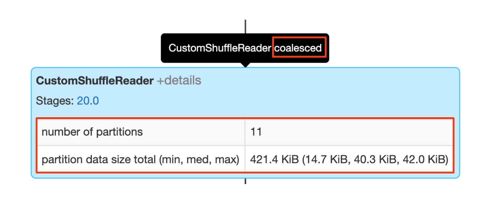

- **Flag `skewed`:** AQE hat Datenskew in einer oder mehreren Partitionen vor einem Sort-Merge-Join erkannt (siehe [Data Skew.md](Data%20Skew.md) für Details).

  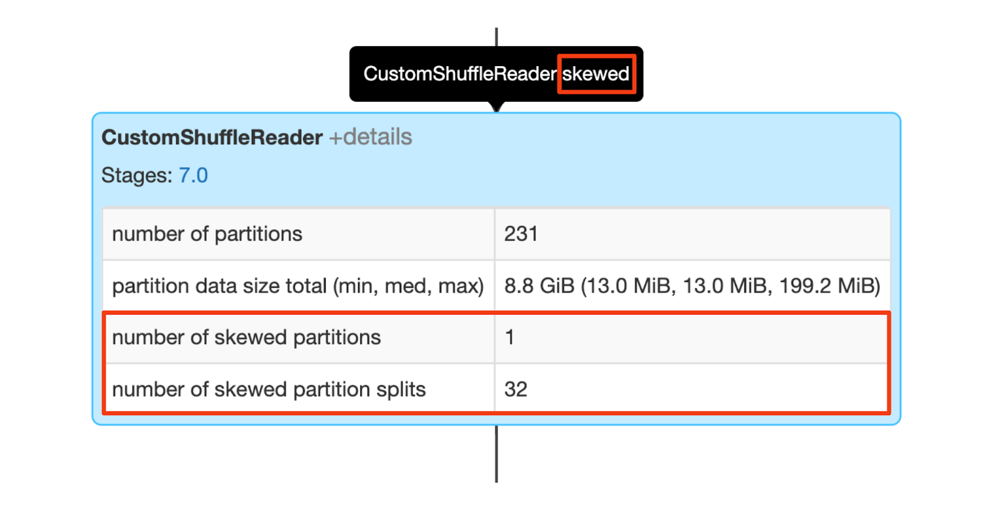

- Beide Effekte können **gleichzeitig** auftreten:

  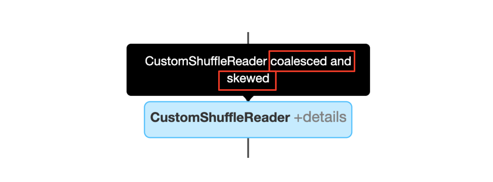

Allgemeiner CustomShuffleReader-Knoten aus der offiziellen AQE-Dokumentation, mit Coalesced-Eigenschaft:


### 5.2 Dynamische Join-Strategie-Umwandlung

AQE wandelt Sort-Merge-Joins automatisch in Broadcast-Hash-Joins um, wenn Laufzeitstatistiken zeigen, dass eine Join-Seite kleiner ist als ursprünglich geschätzt — „Broadcast-Hash-Join ist meist am performantesten, wenn eine Join-Seite gut in den Speicher passt." Das eliminiert den Shuffle-Overhead für diesen Join vollständig, statt ihn nur zu optimieren.

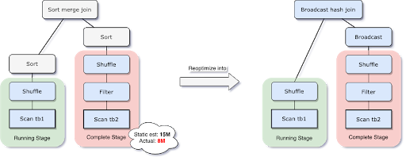

Die Umwandlung greift, wenn die Laufzeitstatistiken einer der beiden Join-Seiten unter dem adaptiven Broadcast-Schwellenwert (`spark.sql.adaptive.autoBroadcastJoinThreshold`, siehe [Data Skew.md](Data%20Skew.md), Abschnitt 4.5) liegen. Das ist nicht so effizient, wie von vornherein einen Broadcast-Hash-Join zu planen, aber besser, als den Sort-Merge-Join fortzusetzen — denn dadurch entfällt das Sortieren beider Join-Seiten, und Shuffle-Dateien können lokal statt über das Netzwerk gelesen werden (sofern `spark.sql.adaptive.localShuffleReader.enabled` aktiviert ist).

Dieses „lokalisierte Shuffle" (Shuffle, das pro Mapper statt pro Reducer gelesen wird, um den Netzwerkverkehr zu reduzieren) wird über den Parameter `spark.sql.adaptive.localShuffleReader.enabled` gesteuert (Standard: `true`, seit Spark 3.0.0) und greift automatisch überall dort, wo die Shuffle-Partitionierung durch eine solche Umwandlung nicht mehr benötigt wird.

### 5.2.1 Sort-Merge-Join zu Shuffled-Hash-Join

Neben der Umwandlung zu Broadcast-Hash-Join kennt AQE eine zweite Join-Strategie-Umwandlung: Ein Sort-Merge-Join wird zu einem **Shuffled-Hash-Join**, wenn **alle** Post-Shuffle-Partitionen kleiner sind als der über `spark.sql.adaptive.maxShuffledHashJoinLocalMapThreshold` konfigurierte Schwellenwert (Standard: `0`, d. h. deaktiviert; seit Spark 3.2.0). Ist dieser Wert nicht kleiner als `spark.sql.adaptive.advisoryPartitionSizeInBytes` gesetzt und übersteigt keine Partitionsgröße den Schwellenwert, bevorzugt Spark die Shuffled-Hash-Join-Strategie — unabhängig vom Wert von `spark.sql.join.preferSortMergeJoin`.

### 5.3 Konfigurationsparameter

| Parameter | Standard | Bedeutung |
|---|---|---|
| `spark.sql.shuffle.partitions` | `200`, auf `"auto"` setzbar | aktiviert Auto-Optimized-Shuffle basierend auf Query-Plan und Eingabedatengröße |
| `spark.sql.adaptive.coalescePartitions.enabled` | `true` | Partition-Coalescing an/aus |
| `spark.sql.adaptive.advisoryPartitionSizeInBytes` | `64MB` | Zielgröße für zusammengefasste Partitionen |
| `spark.sql.adaptive.coalescePartitions.minPartitionSize` | `1MB` | Mindestgröße einer zusammengefassten Partition |
| `spark.sql.adaptive.coalescePartitions.minPartitionNum` | 2× Cluster-Kerne | Mindestanzahl Partitionen (nicht empfohlen zu setzen) |
| `spark.databricks.adaptive.autoOptimizeShuffle.enabled` | — | Databricks-spezifische Alternative: „Auto-Optimized Shuffle" — nützlich, wenn keine hohe initiale Shuffle-Partitionsanzahl manuell über `spark.sql.shuffle.partitions` gesetzt werden kann |

**Zusätzliche Broadcast-Nuance:** Selbst wenn eine Tabelle unter dem Broadcast-Schwellenwert liegt, kann AQE das Broadcasting ablehnen, falls der Anteil nicht-leerer Partitionen unter `spark.sql.adaptive.nonEmptyPartitionRatioForBroadcastJoin` liegt.

**Broadcast-Hints bleiben sinnvoll:** Ein statisch geplanter Broadcast-Join (per Hint) ist meist performanter als ein von AQE dynamisch geplanter — bei bekannten Query-Mustern lohnen sich manuelle Hints also weiterhin.

**Join-Reordering ist kein AQE-Bestandteil:** AQE ändert nicht die Reihenfolge von Joins. Bei Skew-Optimierung gilt außerdem: In einem `LEFT OUTER JOIN` kann nur Skew auf der linken Seite optimiert werden.

**Erweiterte Anpassung des AQE-Optimizers:** Über `spark.sql.adaptive.optimizer.excludedRules` lässt sich eine kommagetrennte Liste von Regelnamen angeben, die im adaptiven Optimizer deaktiviert werden sollen — der Optimizer loggt, welche Regeln tatsächlich ausgeschlossen wurden (seit Spark 3.1.0). Über `spark.sql.adaptive.customCostEvaluatorClass` lässt sich eine eigene Cost-Evaluator-Klasse für die adaptive Ausführung setzen; ohne Angabe nutzt Spark seinen eingebauten `SimpleCostEvaluator` (seit Spark 3.2.0).

### 5.3.1 Query-Pläne auf AQE-Re-Optimierung analysieren

Drei Wege, um zu prüfen, ob und wie AQE einen Plan zur Laufzeit verändert hat:

- **Spark UI:** zeigt `AdaptiveSparkPlan`-Knoten mit einem `isFinalPlan`-Flag, das während der Ausführung von `false` auf `true` wechselt, sobald der finale Plan feststeht.
- **`DataFrame.explain()`:** zeigt sowohl den initialen als auch den aktuellen/finalen Plan unterhalb jedes `AdaptiveSparkPlan`-Knotens, zusätzlich Laufzeitstatistiken mit einem `isRuntime`-Flag (`false` = Compile-Zeit-Schätzung, `true` = tatsächlich gesammelte Daten).
- **SQL `EXPLAIN`:** führt die Query nicht aus — initialer und aktueller Plan bleiben deshalb identisch und spiegeln das tatsächliche AQE-Verhalten zur Laufzeit **nicht** wider.

### 5.4 AQE in Structured Streaming

Ab Databricks Runtime 13.1 wendet AQE Re-Optimierung auch auf Streaming-Queries mit `foreachBatch`-Sink an: „Adaptives Query-Replanning wird unabhängig für jeden Micro-Batch ausgelöst, da sich die Charakteristik der Daten über die Zeit und über verschiedene Micro-Batches hinweg ändern kann." Dynamisches Coalescing reduziert dabei ineffiziente kleine Partitionen — z. B. bei Delta-MERGE-Operationen — und wirkt nur auf zustandslose Operationen innerhalb der `foreachBatch`-Callback-Funktion, um Repartitionierung von zustandsbehafteten Operatoren zu vermeiden (Korrektheit).

**Join-Strategie-Umwandlung auch hier:** „AQE hat dynamisch von einem `SortMergeJoin` zu einem `BroadcastHashJoin` gewechselt, was den Join erheblich beschleunigen kann."

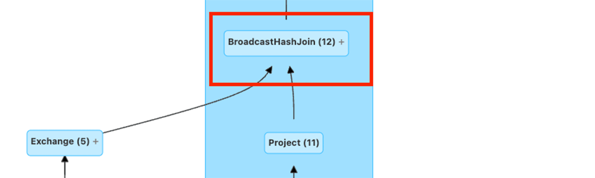

**Benchmark-Zahlen:** allgemeine zustandslose Queries 1,2x–2x Speedup (Ausreißer bis 16x); Delta-MERGE-Operationen median 1,38x allein durch AQE, 2,87x kombiniert mit Photon.

---

## <a id="hints-klauseln">6. SQL-Hints und -Klauseln zur Steuerung von Shuffles</a>

### 6.1 Partitionierungs-Hints

| Hint | Wirkung |
|---|---|
| `COALESCE(part_num)` | reduziert die Partitionsanzahl auf den angegebenen Wert (kein Shuffle) |
| `REPARTITION({part_num \| [part_num,] column_name [, ...]})` | repartitioniert nach Anzahl und/oder Spaltenausdrücken (mit Shuffle) |
| `REPARTITION_BY_RANGE(part_num [, column_name [...]] \| column_name [...])` | repartitioniert bereichsbasiert |
| `REBALANCE([column_name])` | gleicht Ausgabepartitionen automatisch aus, „sodass jede Partition eine angemessene Größe hat" — erfordert aktivierte AQE |

```sql
SELECT /*+ COALESCE(3) */ * FROM t;
SELECT /*+ REPARTITION(3) */ * FROM t;
SELECT /*+ REPARTITION(c) */ * FROM t;
SELECT /*+ REPARTITION(3, c) */ * FROM t;
SELECT /*+ REPARTITION */ * FROM t;
SELECT /*+ REPARTITION_BY_RANGE(c) */ * FROM t;
SELECT /*+ REPARTITION_BY_RANGE(3, c) */ * FROM t;
SELECT /*+ REBALANCE */ * FROM t;
SELECT /*+ REBALANCE(3) */ * FROM t;
SELECT /*+ REBALANCE(c) */ * FROM t;
SELECT /*+ REBALANCE(3, c) */ * FROM t;
```

`REPARTITION` ohne Parameter überlässt AQE die Bestimmung einer geeigneten Partitionsanzahl vollständig.

### 6.2 Join-Hints

**Automatisches Broadcasting ohne Hint:** Bereits beim Query-Planning (vor jeder AQE-Neubewertung) broadcastet Spark automatisch die Seite eines Joins, deren laut Statistik geschätzte Größe unter einem Schwellenwert liegt — ganz ohne Hint.

| Parameter | Standard | Bedeutung |
|---|---|---|
| `spark.sql.autoBroadcastJoinThreshold` | `10MB` (seit Spark 1.1.0) | maximale Tabellengröße in Bytes für automatisches Broadcasting beim Query-Planning; `-1` deaktiviert automatisches Broadcasting vollständig |
| `spark.sql.broadcastTimeout` | `300` Sekunden (seit Spark 1.3.0) | Timeout für die Broadcast-Wartezeit bei Broadcast-Joins |

Auf Databricks liegt der praktisch wirksame Standardwert stattdessen bei **30 MB** (`spark.databricks.adaptive.autoBroadcastJoinThreshold`, siehe [Data Skew.md](Data%20Skew.md), Abschnitt 4.5); dieser Parameter betrifft jedoch nur die dynamische AQE-Umwandlung zur Laufzeit (Abschnitt 5.2), nicht die statische Entscheidung beim Query-Planning.

Priorisierung: `BROADCAST` > `MERGE` > `SHUFFLE_HASH` > `SHUFFLE_REPLICATE_NL`.

| Hint | Alias | Wirkung |
|---|---|---|
| `BROADCAST(table_name)` | `BROADCASTJOIN`, `MAPJOIN` | Broadcast-Join — die Hint-Seite wird unabhängig von `autoBroadcastJoinThreshold` gebroadcastet; **kein Shuffle** |
| `MERGE(table_name)` | `SHUFFLE_MERGE`, `MERGEJOIN` | Shuffle-Sort-Merge-Join |
| `SHUFFLE_HASH(table_name)` | — | Shuffle-Hash-Join |
| `SHUFFLE_REPLICATE_NL(table_name)` | — | Shuffle-and-Replicate-Nested-Loop-Join |

```sql
SELECT /*+ BROADCAST(t1) */ * FROM t1 INNER JOIN t2 ON t1.key = t2.key;
SELECT /*+ MERGE(t1) */ * FROM t1 INNER JOIN t2 ON t1.key = t2.key;
SELECT /*+ SHUFFLE_HASH(t1) */ * FROM t1 INNER JOIN t2 ON t1.key = t2.key;
SELECT /*+ SHUFFLE_REPLICATE_NL(t1) */ * FROM t1 INNER JOIN t2 ON t1.key = t2.key;
```

Äquivalent über die DataFrame-API: `spark.table("t1").join(spark.table("t2").hint("broadcast"), "key")`.

**Build-Seite bei beidseitigem Hint:** Sind beide Join-Seiten mit `BROADCAST` oder beide mit `SHUFFLE_HASH` gehintet, wählt Spark die Build-Seite anhand des Join-Typs und der Relationsgrößen selbst aus.

**Keine Garantie:** Spark folgt einem Join-Hint nicht zwingend, da die angeforderte Strategie nicht jeden Join-Typ unterstützt — in solchen Fällen weicht Spark auf eine andere Strategie aus.

### 6.3 CLUSTER BY, DISTRIBUTE BY, SORT BY, ORDER BY (Query-Klauseln)

Diese SELECT-Klauseln repartitionieren bzw. sortieren Query-Ergebnisse explizit — nicht zu verwechseln mit der `CLUSTER BY`-Klausel bei `CREATE TABLE` für Liquid Clustering (siehe [Data Skew.md](Data%20Skew.md), Abschnitt 9.1).

| Klausel | Repartitioniert? | Sortiert? |
|---|---|---|
| `DISTRIBUTE BY expr` | ja (Shuffle nach Ausdruck) | nein |
| `SORT BY expr` | nein | ja, innerhalb der Partitionen |
| `CLUSTER BY expr` | ja | ja, innerhalb der Partitionen — semantisch äquivalent zu `DISTRIBUTE BY` gefolgt von `SORT BY` |
| `ORDER BY expr` | — | ja, **global** über das gesamte Ergebnis (garantiert Gesamtordnung, keine Partitionierung) |

```sql
-- Nur repartitionieren, keine Sortierung innerhalb der Partition
SELECT age, name FROM person DISTRIBUTE BY age;

-- Repartitionieren UND innerhalb jeder Partition sortieren
SELECT age, name FROM person CLUSTER BY age;
-- Bei 2 Shuffle-Partitionen z. B.:
-- 18  John A
-- 18  Anil B
-- 25  Zen Hui
-- 25  Mike A
-- 16  Shone S
-- 16  Jack N
```

**Wichtig:** `CLUSTER BY` garantiert Sortierung nur *innerhalb* jeder Partition, nicht über das gesamte Ergebnis hinweg — dafür ist `ORDER BY` nötig, das aber keine Partitionierung vornimmt.

### 6.4 SQL-Funktion `shuffle()`

Nicht zu verwechseln mit dem Shuffle-Konzept selbst: `shuffle(expr)` ist eine SQL-Array-Funktion, die die Elemente eines Arrays zufällig permutiert (nicht-deterministisch).

```sql
SELECT shuffle(array(1, 20, 3, 5));
-- Ergebnis: [3,1,5,20]

SELECT shuffle(array(1, 20, NULL, 3));
-- Ergebnis: [20,NULL,3,1]
```

---

## <a id="pyspark-api">7. PySpark: repartition, coalesce, shuffle()</a>

### 7.1 `DataFrame.repartition()` — mit Shuffle

```python
repartition(numPartitions: Union[int, "ColumnOrName"], *cols: "ColumnOrName")
```

`numPartitions` kann eine Ganzzahl (Zielpartitionsanzahl) oder eine Column sein; `cols` sind optionale Partitionierungsspalten. Gibt eine neue, **hash-partitionierte** DataFrame zurück.

```python
from pyspark.sql import functions as sf

df = spark.range(0, 64, 1, 9).withColumn(
    "name", sf.concat(sf.lit("name_"), sf.col("id").cast("string"))
).withColumn("age", sf.col("id") - 32)

# In 10 Partitionen repartitionieren
df.repartition(10).select(
    sf.spark_partition_id().alias("partition")
).distinct().sort("partition").show()

# In 7 Partitionen nach Spalte 'age' repartitionieren
df.repartition(7, "age").select(
    sf.spark_partition_id().alias("partition")
).distinct().sort("partition").show()
```

### 7.2 `DataFrame.coalesce()` — meist ohne Shuffle

```python
coalesce(numPartitions: int)
```

Reduziert Partitionen über eine **narrow dependency** — in den meisten Fällen findet **kein Shuffle** statt. Beim Reduzieren von 1.000 auf 100 Partitionen beansprucht jede neue Partition einfach mehrere bestehende, ohne Datenbewegung. Wird eine höhere Partitionsanzahl angefragt, bleibt die aktuelle Anzahl unverändert. Bei drastischer Reduktion (z. B. auf eine einzelne Partition) kann sich die Berechnung auf wenige Knoten konzentrieren — dann ist `repartition()` vorzuziehen, da dessen zusätzlicher Shuffle-Schritt parallele Ausführung über mehrere Knoten ermöglicht.

```python
spark.range(0, 10, 1, 3).coalesce(1).select(
    sf.spark_partition_id().alias("partition")
).distinct().sort("partition").show()
# Ergebnis: eine einzelne Partition (0)
```

**Coalesce im Vergleich zu Repartition zur Performance-Optimierung:**


### 7.3 `pyspark.sql.functions.shuffle()`

```python
sf.shuffle(col, seed=None)
```

Gibt eine neue Column mit einem Array in zufälliger Reihenfolge zurück (`seed`-Parameter für den Zufallsgenerator seit Databricks Runtime 16.1).

```python
import pyspark.sql.functions as sf
df = spark.sql("SELECT ARRAY(1, 20, 3, 5) AS data")
df.select("*", sf.shuffle(df.data, sf.lit(123))).show()
# +-------------+-------------+
# |         data|shuffle(data)|
# +-------------+-------------+
# |[1, 20, 3, 5]|[5, 1, 20, 3]|
# +-------------+-------------+
```

### 7.4 Pandas Function APIs und Shuffle

Drei APIs zur Anwendung nativer Python-Funktionen auf PySpark-DataFrames via Apache Arrow — zwei davon shuffeln implizit Daten nach Gruppierungsschlüssel:

**Grouped Map** (`groupBy().applyInPandas()`) — Split (Gruppierung via `groupBy`, impliziert Shuffle) → Apply (Funktion je Gruppe) → Combine. **Wichtige Einschränkung:** „Alle Daten einer Gruppe werden vor Anwendung der Funktion in den Speicher geladen" — kann bei skewed Gruppengrößen zu Speicherproblemen führen (siehe [Data Skew.md](Data%20Skew.md)).

```python
df = spark.createDataFrame([(1, 1.0), (1, 2.0), (2, 3.0), (2, 5.0), (2, 10.0)], ("id", "v"))
def subtract_mean(pdf):
    v = pdf.v
    return pdf.assign(v=v - v.mean())
df.groupby("id").applyInPandas(subtract_mean, schema="id long, v double").show()
```

**Map** (`DataFrame.mapInPandas()`) — transformiert Iteratoren von pandas-DataFrames, **kein Shuffle**, da keine Gruppierung stattfindet.

```python
df = spark.createDataFrame([(1, 21), (2, 30)], ("id", "age"))
def filter_func(iterator):
    for pdf in iterator:
        yield pdf[pdf.id == 1]
df.mapInPandas(filter_func, schema=df.schema).show()
```

**Cogrouped Map** (`groupBy().cogroup().applyInPandas()`) — shuffelt Daten zweier DataFrames so, dass zusammengehörige Gruppen kolokiert werden, wendet dann eine Funktion auf beide Gruppen zugleich an.

```python
def asof_join(l, r):
    return pd.merge_asof(l, r, on="time", by="id")
df1.groupby("id").cogroup(df2.groupby("id")).applyInPandas(
    asof_join, schema="time int, id int, v1 double, v2 string"
).show()
```

---

## <a id="join-strategien">8. Join-Strategien und Shuffles</a>

| Strategie | Shuffle? | Bemerkung |
|---|---|---|
| **Broadcast Hash Join** | nein | kleinere Tabelle wird an alle Executors verteilt statt geshuffelt; Standard-Threshold für automatisches Broadcasting: 30 MB (`spark.databricks.adaptive.autoBroadcastJoinThreshold`, siehe [Data Skew.md](Data%20Skew.md)) |
| **Shuffle Hash Join** | ja | Standard für Databricks Photon; vermeidet den zusätzlichen Sortierschritt eines Sort-Merge-Joins |
| **Sort-Merge Join** | ja | Standard für Open-Source-Spark; erfordert Shuffle plus Sortierung beider Seiten |
| **Shuffle-Replicate-Nested-Loop-Join** | ja | für Kreuzprodukte/nicht-äquivalente Join-Bedingungen |

### Bucketing — explizit nicht empfohlen

- Bucketing eliminiert die Sortierung im Sort-Merge-Join durch vorsortierte Partitionen.
- Schwer korrekt umzusetzen und von Haus aus teuer — besonders bei periodisch wechselnden Datensätzen.
- Die Kosten fallen bei der Erstellung des Datensatzes an, in der Annahme, dass sich das durch häufige Joins beider Tabellen amortisiert.
- Nicht sinnvoll für Datensätze unter 1–5 TB.

### Storage Partition Join (SPJ) — die moderne Verallgemeinerung von Bucketing

**Storage Partition Join** nutzt das bestehende Storage-Layout, um die Shuffle-Phase eines Joins zu vermeiden — eine Verallgemeinerung des Bucket-Join-Konzepts (das nur für klassisch gebucketete Tabellen gilt) auf Tabellen, die nach Funktionen aus dem `FunctionCatalog` partitioniert sind. SPJ wird aktuell für kompatible **V2-Datenquellen** unterstützt (z. B. Apache Iceberg) — nicht für klassische Hive-/Delta-Tabellen im V1-Format.

| Parameter | Standard | Bedeutung |
|---|---|---|
| `spark.sql.sources.v2.bucketing.enabled` | `true` (seit 3.3.0) | versucht, Shuffle über das von einer V2-Datenquelle gemeldete Partitioning zu eliminieren |
| `spark.sql.sources.v2.bucketing.pushPartValues.enabled` | `true` (seit 3.4.0) | eliminiert Shuffle auch dann, wenn einer Join-Seite Partitionswerte der anderen fehlen — setzt obigen Parameter voraus |
| `spark.sql.requireAllClusterKeysForCoPartition` | `true` (seit 3.4.0) | verlangt standardmäßig, dass Join-/MERGE-Keys identisch und in derselben Reihenfolge wie die Partitionsschlüssel sind, um Shuffle zu eliminieren — auf `false` setzen, um das aufzuweichen |
| `spark.sql.sources.v2.bucketing.partiallyClusteredDistribution.enabled` | `false` (seit 3.4.0) | aktiviert Skew-Optimierung bei Nicht-Full-Outer-Joins: Die größere Tabellenseite (laut Statistik) wird partiell geclustert, die kleinere Seite entsprechend gruppiert und repliziert — setzt die beiden vorherigen Parameter voraus |
| `spark.sql.sources.v2.bucketing.allowJoinKeysSubsetOfPartitionKeys.enabled` | `false` (seit 4.0.0) | vermeidet Shuffle auch, wenn die Join-/MERGE-Bedingung nicht alle Partitionsspalten abdeckt — setzt `requireAllClusterKeysForCoPartition = false` voraus |
| `spark.sql.sources.v2.bucketing.allowCompatibleTransforms.enabled` | `false` (seit 4.0.0) | vermeidet Shuffle auch bei kompatiblen, aber nicht identischen Partition-Transforms |
| `spark.sql.sources.v2.bucketing.shuffle.enabled` | `false` (seit 4.0.0) | versucht, Shuffle auf einer Join-Seite zu vermeiden, indem das von einer V2-Datenquelle auf der anderen Seite gemeldete Partitioning genutzt wird |

**Erkennbar im Query-Plan:** Wird SPJ angewendet, enthält der physische Plan **keine `Exchange`-Knoten** mehr vor dem Join — d. h. kein Daten-Shuffle für diesen Join.

**Beispiel mit Apache Iceberg:** Zwei nach `(dep, bucket(8, id))` partitionierte Iceberg-Tabellen werden auf `dep` und `id` gejoint.

```sql
CREATE TABLE prod.db.target (id INT, salary INT, dep STRING)
USING iceberg PARTITIONED BY (dep, bucket(8, id));

CREATE TABLE prod.db.source (id INT, salary INT, dep STRING)
USING iceberg PARTITIONED BY (dep, bucket(8, id));

SET 'spark.sql.sources.v2.bucketing.enabled' 'true';
SET 'spark.sql.sources.v2.bucketing.pushPartValues.enabled' 'true';
SET 'spark.sql.requireAllClusterKeysForCoPartition' 'false';
SET 'spark.sql.sources.v2.bucketing.partiallyClusteredDistribution.enabled' 'true';

EXPLAIN SELECT * FROM target t INNER JOIN source s ON t.dep = s.dep AND t.id = s.id;
```

Ohne SPJ enthält der Plan vor dem `SortMergeJoin` je Seite einen `Exchange`-Knoten (Daten-Shuffle); mit aktiviertem SPJ und obiger Konfiguration entfallen diese Exchange-Knoten vollständig — die bereits partitionierten Iceberg-Splits werden direkt gejoint.

**Einordnung gegenüber der Bucketing-Empfehlung oben:** SPJ löst die Kernkritik am klassischen Bucketing (schwer korrekt umzusetzen, teuer bei sich ändernden Datensätzen) durch die Kopplung an moderne V2-Partition-Transforms und automatische Skew-Behandlung — bleibt aber wie klassisches Bucketing an ein sorgfältig geplantes, gemeinsames Storage-Layout beider Join-Seiten gebunden.

### Re-Evaluierung der Join-Strategie als Shuffle-Mitigation

Allgemeine Techniken zur Reduktion von Shuffle-Kosten bei Joins:

- Join-Reihenfolge ändern (Reordering)
- Dynamisches Wechseln der Join-Strategie (siehe AQE, Abschnitt 5.2)
- Datensätze denormalisieren, besonders wenn der Shuffle in einem Join begründet liegt — mit AQE und Dynamic Partition Pruning (DPP) zunehmend unnötig, aber außerhalb von Spark 3 weiterhin eine valide Strategie

### Praxisbeispiel: Broadcast in Lakeflow-Pipelines

Für Dimensionstabellen-Joins wird ein Broadcast-Hint empfohlen: Er weist Spark an, die kleinere Tabelle an alle Executors zu broadcasten, statt einen Shuffle-Join durchzuführen. Für zeitreihenbasierte Proximity-Joins (z. B. nächstgelegenes Event in einem Zeitfenster) wird eine Range-Join-Bedingung empfohlen, mit Watermark auf beiden Seiten bei Stream-Joins, oder alternativ Pre-Binning von Events in Zeit-Buckets vor dem Join.

---

## <a id="photon">9. Photon und Shuffles</a>

Photon ist Databricks' vektorisierte, spaltenorientierte Query-Engine, die native C++-Ausführung anstelle der JVM-basierten Spark-SQL-Engine nutzt.

### 9.1 Redesignter Columnar Shuffle

Photon „nutzt ein neu konzipiertes spaltenbasiertes Shuffle, um den Durchsatz bei großangelegten Joins zu erhöhen." Zusätzlich „ersetzt Photon Sort-Merge-Joins durch performante Hash-Joins."

Diese Verbesserungen basieren auf Photons spaltenweiser Batch-Verarbeitung, die „cache-freundliche sequenzielle Lesevorgänge ermöglicht, die Speicherbandbreite und CPU-Pipeline-Effizienz maximieren."

### 9.2 Photon Vectorized Shuffle — technischer Hintergrund und Benchmarks

Shuffle-Operationen beinhalten traditionell umfangreiche, schwer optimierbare Random-Memory-Zugriffe. Statt die Häufigkeit solcher Zugriffe zu reduzieren, wurde das Shuffle-Design neu konstruiert, um den Abstand zwischen aufeinanderfolgenden Speicherzugriffen zu minimieren — das neue spaltenbasierte Shuffle-Design „bewegt Daten effizient", „führt weniger Instruktionen aus" und „berücksichtigt den Cache".

**Benchmark-Zahlen:**

- **1,5x höherer Durchsatz** bei CPU-gebundenen Workloads wie großen Joins — trägt zusätzlich zum bestehenden 5x-Performance-Gewinn 25 % weitere Verbesserung bei.
- Am deutlichsten profitieren CPU-intensive Workloads mit umfangreichen Join-Operationen oder Funnel-Logik — „oft werden dadurch Minuten an Gesamtlaufzeit eingespart."

### Quellen

- https://docs.databricks.com/aws/en/compute/photon
- https://www.databricks.com/blog/databricks-sql-accelerates-customer-workloads-5x-just-three-years

---

## <a id="low-shuffle-merge">10. Low Shuffle Merge</a>

### 10.1 Was Low Shuffle Merge ist

Eine Optimierung für den `MERGE`-Befehl, die simultane Updates, Inserts und Deletes auf Delta-Lake-Tabellen bei deutlich reduzierten Shuffle-Operationen durchführt.

### 10.2 Traditionelles MERGE vs. Low Shuffle Merge

**Traditionelles MERGE** läuft in zwei Join-Schritten ab:

1. Inner Join zwischen Ziel- und Quelltabelle, um alle Dateien mit Übereinstimmungen zu finden.
2. Outer Join zwischen den selektierten Dateien in Ziel- und Quelltabelle, um die aktualisierten/gelöschten/eingefügten Daten zu schreiben.

Dabei werden **alle** Zeilen (geänderte wie unveränderte) durch mehrere Shuffle-Stages und aufwendige Berechnungen prozessiert — problematisch, da Delta-Tabellen dateibasiert aktualisieren: Ändert ein MERGE nur wenige Zeilen einer Datei, müssen dennoch alle übrigen Zeilen dieser Datei verarbeitet und neu geschrieben werden.

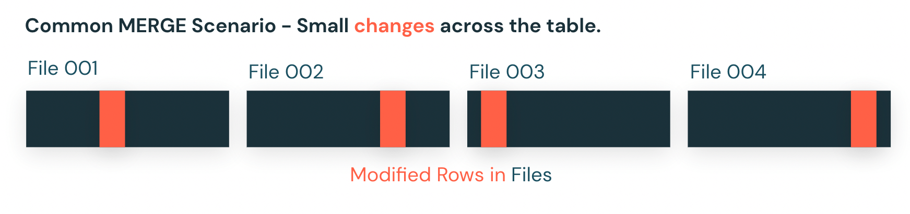

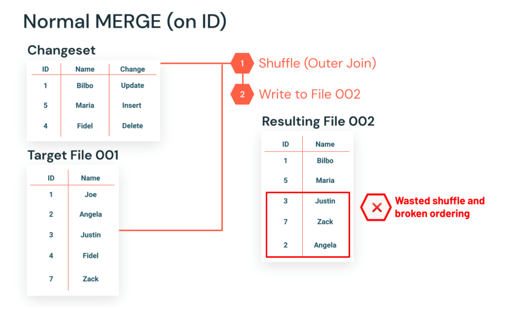

**Low Shuffle Merge (LSM)** separiert unveränderte Zeilen in einen gestrafften Verarbeitungsmodus, der Shuffles vollständig vermeidet: „Verarbeitung unveränderter Zeilen in einem separaten, gestrafften Modus" — ohne Shuffles, teure Berechnungen oder anderen Overhead.

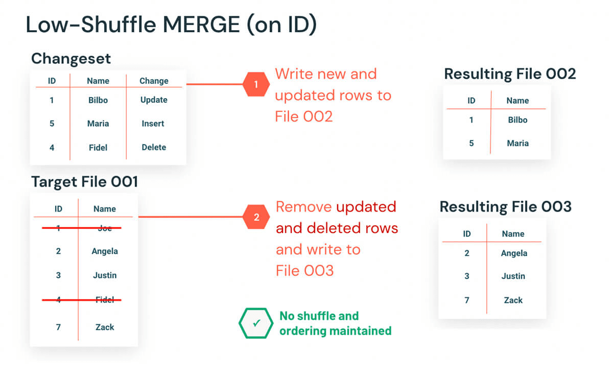

Zusätzlich zum Delta-DML-internen Mechanismus (UPDATE/DELETE arbeiten dateibasiert ohne verteilte Shuffles; MERGE nutzt den oben beschriebenen zweistufigen Join-Ansatz):

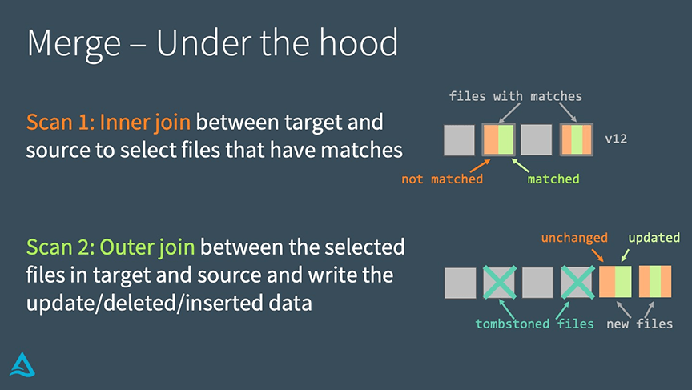

### 10.3 Vorteile

- Substanziell verbesserte Performance bei Workloads mit kleinem Änderungsvolumen.
- Reduziert die Notwendigkeit, nach MERGE-Operationen `OPTIMIZE` auszuführen.
- Erhält das bestehende Datenlayout unveränderter Datensätze, einschließlich Liquid-Clustering-Anordnung, im Best-Effort-Modus.

### 10.4 Aktivierung

- **Standard:** automatisch aktiviert seit Databricks Runtime 10.4 LTS (davor Public Preview ab Runtime 9.0/9.1 LTS über `spark.databricks.delta.merge.enableLowShuffle = true`, seit 10.4+ ohne Wirkung).

### 10.5 Kombination mit Photon

Photon beschleunigt die typischen MERGE-Flaschenhälse (Joins, Lesen, Schreiben) zusätzlich zur reinen Shuffle-Reduktion durch LSM: „Die gemeinsame Nutzung von Photon und LSM kann zu einer bis zu 4-fachen Performance-Steigerung führen."

**Benchmark-Zahlen:**

- Low Shuffle Merge allein: **2–3x** durchschnittliche Verbesserung, bis zu **5x** bei verteilten Update-Workloads.
- Photon + LSM kombiniert: bis zu **4x** Performance-Steigerung.
- Reale Finance-Company-Benchmark: **3,6x** Verbesserung bei einer 1,5-Mrd.-Zeilen-Tabelle mit 27.000-Zeilen-Changeset.
- **Healthcare-Kunde:** 10,6x durchschnittliche Batch-MERGE-Verbesserung, Streaming-Verarbeitung von 1 Stunde auf 5 Minuten reduziert.
- **Fintech-Kunde:** 7x durchschnittliche Batch-Merge-Verbesserung, durchschnittliche Merge-Zeit von 11 Minuten auf 1,5 Minuten reduziert (dünn besetzte Updates über große Zeiträume für Fraud-Detection-Pipeline).

### 10.6 Delta Lake 1.1: automatisches Repartitioning nach MERGE

Delta Lake 1.1 führte eine ergänzende Optimierung ein: Bei partitionierten Tabellen repartitionieren MERGE-Operationen die Ausgabedaten automatisch vor dem Schreiben (`repartitionBeforeWrite`), was Small-File-Probleme durch MERGE auf partitionierten Tabellen adressiert. Gemessene Verbesserung: von 19,66 Minuten auf 7,68 Minuten (**~60 % Reduktion**).

### Quellen

- https://docs.databricks.com/aws/en/optimizations/low-shuffle-merge
- https://www.databricks.com/blog/faster-merge-performance-low-shuffle-merge-and-photon
- https://www.databricks.com/blog/2021/09/08/announcing-public-preview-of-low-shuffle-merge.html
- https://www.databricks.com/blog/2020/09/29/diving-into-delta-lake-dml-internals-update-delete-merge.html
- https://www.databricks.com/blog/2022/01/31/make-your-data-lakehouse-run-faster-with-delta-lake-1-1.html
- https://docs.databricks.com/aws/en/delta/best-practices

---

## <a id="streaming">11. Shuffles in Structured Streaming</a>

### 11.1 Stateful vs. stateless: unterschiedliche Shuffle-Charakteristik

**Stateful Queries** (Streaming-Aggregation, `distinct`/`dropDuplicates`, Stream-Stream-Joins) erfordern inkrementelle Updates an einem Zwischenzustand (State) — im Gegensatz zu stateless Queries, die nur nachverfolgen, welche Zeilen bereits verarbeitet wurden.

**Wichtige Einschränkung bei Stateful Queries:** Die Anzahl der Shuffle-Partitionen wird beim Erstellen des Checkpoints fixiert. Ein nachträgliches Ändern von `spark.sql.shuffle.partitions` hat auf laufende Queries **keine** Wirkung — dafür muss ein neuer Checkpoint erstellt werden (siehe aber Abschnitt 11.2, on-demand State Repartitioning).

**Optimierungsempfehlungen:**

- Compute-optimierte Instanzen als Worker verwenden.
- Shuffle-Partitionen auf das 1- bis 2-fache der Cluster-Kernanzahl setzen.
- `spark.sql.streaming.noDataMicroBatches.enabled` deaktivieren, um die Verarbeitung leerer Micro-Batches zu vermeiden.
- Changelog-Checkpointing mit RocksDB aktivieren (empfohlen ab Databricks Runtime 13.3 LTS+).

**Stateless Queries** (Stream-Static-Joins, `MERGE INTO` mit Delta-Lake-Tabellen) verzichten auf Zwischenzustand und können moderne Shuffle-Optimierungen nutzen:

- **AQE für stateless Streaming:** standardmäßig aktiviert über `spark.sql.adaptive.streaming.stateless.enabled true`.
- **Auto Optimized Shuffle (AOS):** aktivierbar über `spark.sql.shuffle.partitions auto`.

Bei stateless Queries lässt sich die Shuffle-Partitionsanzahl beim Query-Neustart anpassen, um wechselnde Eingabevolumina abzudecken.

### 11.2 On-Demand State Repartitioning

Ermöglicht die Größenanpassung der Partitionsanzahl für stateful Queries **unter Beibehaltung des Checkpoint-Zustands** — die frühere Notwendigkeit, bei Partitionsänderungen komplett neue Checkpoints anzulegen, entfällt.

**Voraussetzungen:** Databricks Runtime 18 LTS oder höher; RocksDB-State-Store-Provider (Standard ab DBR 17.3+).

**Auslösen:**

```python
query.stop()
spark.conf.set("spark.sql.streaming.stateStore.partitions", "<numPartitions>")
query = df.writeStream.start()
```

`spark.sql.streaming.stateStore.partitions` steuert Shuffle- und Streaming-State-Partitionen und hat für stateful Queries Vorrang vor `spark.sql.shuffle.partitions`.

**Ablauf:** Nach dem Neustart vervollständigt die Query den zuletzt geplanten Micro-Batch, führt dann eine Repartition-Operation aus, die State-Daten in die neue Partitionsstruktur umverteilt, bevor die normale Verarbeitung fortgesetzt wird. Die `StreamingQueryProgress`-Metrik `controlBatch.REPARTITION` zeigt die Dauer dieser Repartitionierung in Millisekunden; größere State-Größen können diese Dauer erhöhen.

### 11.3 State Reader API und Shuffle-Partition-Skew

Die State Reader API erlaubt das Abfragen interner State-Daten und -Metadaten über zwei DataFrame-Formate: `state-metadata` (High-Level-Informationen darüber, was im State Store gespeichert ist) und `statestore` (granularer Zugriff auf die Key-Value-Daten selbst).

Der Standardwert für `spark.sql.shuffle.partitions` ist 200 — dieser Wert bestimmt direkt die Anzahl der State-Store-Instanzen im Cluster. Das `state-metadata`-Format zeigt die tatsächlich genutzte Partitionsanzahl; `statestore` ermöglicht das Erkennen von Skew in der Schlüsselverteilung über Partitionen hinweg — kritisch zur Identifikation von Performance-Engpässen bei größeren Workloads.

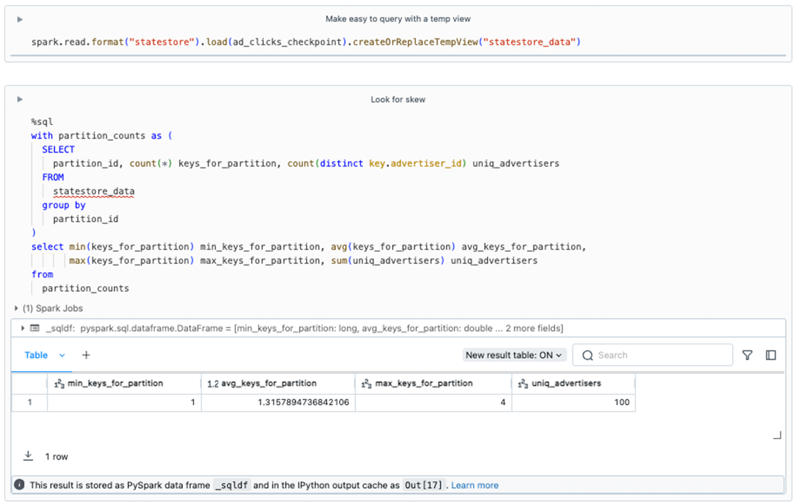

### 11.4 Multiple Streams auf einem Cluster

Bei mehreren gleichzeitig laufenden Queries teilen sich diese CPU, Speicher, DAG-Scheduler, Task-Scheduler und treiberseitige UDF-Ausführung. Für stateful Stages gilt: „Spark plant Tasks proportional zur Anzahl der Shuffle-Partitionen." Empfehlung: Shuffle-Partitionen an die Anwendungsanforderungen anpassen und vermeiden, zu viele Partitionen auf demselben Executor-Knoten zu bündeln, da knotenweise laufende Wartungsoperationen (Snapshots, Cleanup) sonst zu Engpässen führen können.

### 11.5 Real-Time Mode: Streaming Shuffle

Real-Time Mode (RTM) ist ein neuer Trigger-Typ für Structured Streaming mit Latenzen im Bereich weniger bis niedriger hundert Millisekunden. Der zentrale architektonische Unterschied zum Micro-Batch-Modus betrifft die Shuffle-Behandlung:

**Micro-Batch-Modus:** Beispielsweise puffert eine Group-by-Aggregation alle Datensätze, führt eine Vor-Aggregation durch und gibt Ergebnisse erst am Ende des Batches aus — Reducer warten, bis alle Mapper fertig sind, was unnötige Verzögerungen erzeugt.

**Real-Time Mode:** Operatoren werden umstrukturiert, um Pufferung zu minimieren und Ergebnisse kontinuierlich zu produzieren. Der entscheidende Baustein ist ein **„Streaming Shuffle"**: Daten werden zwischen Tasks unmittelbar weitergegeben, statt zwischen Micro-Batches auf Festplatte zu persistieren — Reducer können mit der Verarbeitung von Shuffle-Dateien beginnen, sobald diese verfügbar sind, statt auf den Abschluss aller Mapper zu warten. Dies umgeht die Latenz-Engpässe traditioneller festplattenbasierter Shuffles.

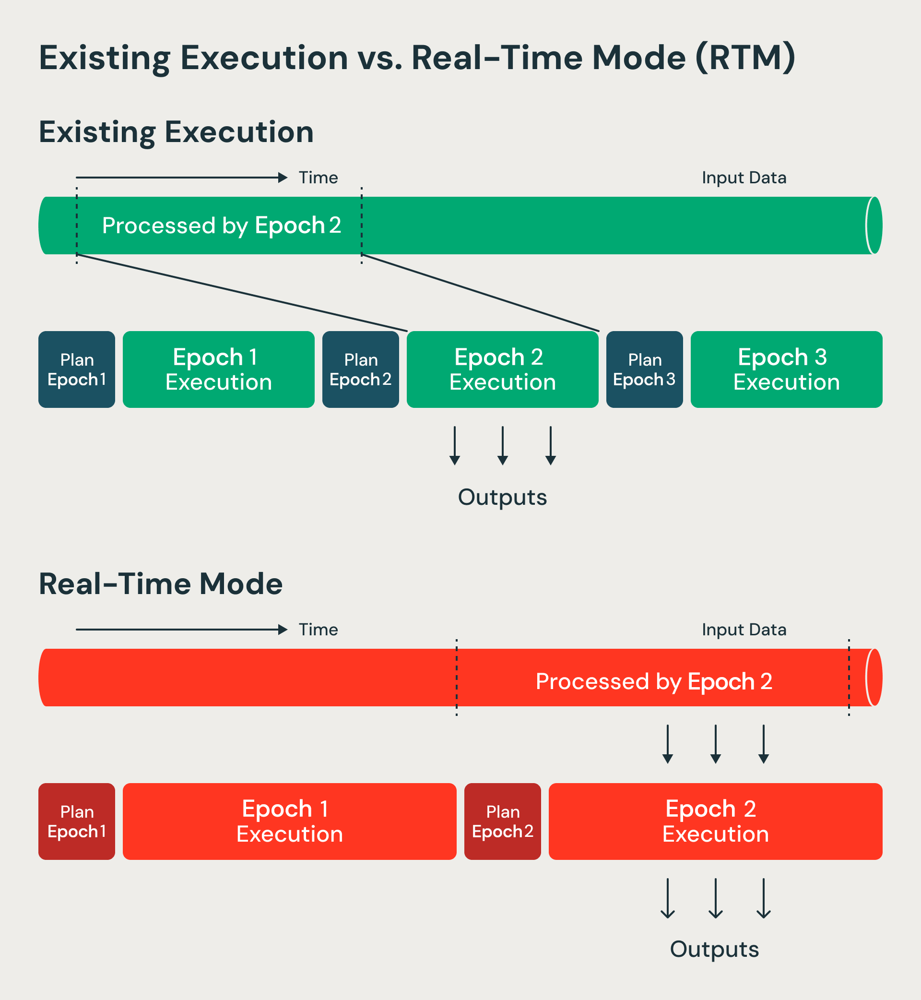

**Benchmark-Zahlen:** bis zu 92 % schneller als Apache Flink bei Feature-Computation-Workloads (Kunden-Benchmark); Coinbase erreichte über 80 % Reduktion der End-to-End-Latenz (Sub-100ms P99); MakeMyTrip erzielte Sub-50ms-P50-Latenzen für personalisierte Suche.

### Quellen

- https://docs.databricks.com/aws/en/structured-streaming/state-repartitioning
- https://docs.databricks.com/aws/en/structured-streaming/stateful-streaming
- https://docs.databricks.com/aws/en/structured-streaming/stateless-streaming
- https://docs.databricks.com/aws/en/structured-streaming/real-time/performance
- https://docs.databricks.com/aws/en/structured-streaming/multiple-streams
- https://docs.databricks.com/aws/en/ldp/stateful-processing
- https://docs.databricks.com/aws/en/connect/streaming/kafka/faq
- https://www.databricks.com/blog/performance-improvements-stateful-pipelines-apache-spark-structured-streaming
- https://www.databricks.com/blog/announcing-state-reader-api-new-statestore-data-source
- https://www.databricks.com/blog/breaking-microbatch-barrier-architecture-apache-spark-real-time-mode
- https://www.databricks.com/blog/introducing-real-time-mode-apache-sparktm-structured-streaming
- https://www.databricks.com/blog/announcing-general-availability-real-time-mode-apache-spark-structured-streaming-databricks
- https://www.databricks.com/blog/real-time-mode-ultra-low-latency-streaming-spark-apis-without-second-engine
- https://databricks.com/blog/2023/01/10/streaming-production-collected-best-practices-part-2.html

---

## <a id="ldp">12. Shuffles in Lakeflow Declarative Pipelines</a>

### Skew-Management (siehe auch [Data Skew.md](Data%20Skew.md))

- **Salting:** stark geskewte Keys durch Anhängen eines zufälligen Bucket-Suffixes vor Gruppierung/Aggregation in zwei Stufen salzen.
- **Liquid Clustering:** adressiert Skew in gespeicherten Tabellen — „selbstoptimierend, skew-resistent und inkrementell", ohne manuelle Partitionsauswahl.

### Join-Optimierung

- **Broadcast-Hints** für Dimensionstabellen-Joins, um Shuffle-Joins zu vermeiden.
- **Range-Join-Bedingungen** für zeitreihenbasierte Proximity-Joins, mit Watermark auf beiden Seiten bei Stream-Joins, oder Pre-Binning in Zeit-Buckets als Alternative.

### Stateful Processing

Watermarks setzen zeitbasierte Schwellenwerte für stateful Operationen. Bei großen Zwischenzuständen wird RocksDB-basiertes State-Management empfohlen:

```json
{
  "configuration": {
    "spark.sql.streaming.stateStore.providerClass":
      "com.databricks.sql.streaming.state.RocksDBStateStoreProvider"
  }
}
```

Serverless-Pipelines verwalten State-Store-Konfiguration automatisch, ohne manuelles Setup. Relevante Operationen: Stream-Stream-Joins (Watermark auf beiden Seiten plus Zeitintervall-Klausel erforderlich), Windowed Aggregations (Tumbling/Sliding), Deduplication über `dropDuplicatesWithinWatermark()`.

### Weitere Empfehlungen

- Pipelines nicht zu häufig auf Low-Volume-Quellen triggern, um Small-File-Proliferation zu vermeiden.
- Inkrementelles statt vollständiges Neuberechnen für Materialized Views nutzen.
- Watermarks für stateful Operationen konsequent einsetzen, um Speicherverbrauch zu begrenzen.

### Quellen

- https://docs.databricks.com/aws/en/ldp/best-practices
- https://docs.databricks.com/aws/en/ldp/stateful-processing

---

## <a id="cluster">13. Cluster-Konfiguration zur Shuffle-Optimierung</a>

### 13.1 VM-Größe: fewer & larger vs. many & smaller

Aus einer privaten Kursnotiz, bestätigt durch offizielle Best Practices: Durch die Nutzung **weniger, größerer VMs (z. B. mehr Cores)** zahlt man weiterhin die Disk-I/O-Kosten, reduziert aber das Netzwerk-I/O. Ein Compute mit einer kleineren Anzahl größerer Knoten „kann das für Shuffles benötigte Netzwerk- und Disk-I/O reduzieren." Für komplexe ETL-Transformationen empfiehlt Databricks, „weniger Worker zu nutzen, um die Menge geshuffelter Daten zu reduzieren", kompensiert durch größere Instanzgrößen.

**Beispielrechnung:** Zwei Worker mit je 16 Cores/128 GB RAM erreichen dieselbe Rechen- und Speicherkapazität wie acht Worker mit je 4 Cores/32 GB RAM.

### 13.2 NVMe/SSD für Shuffle-Read/Write

Aus einer privaten Kursnotiz: Shuffle-Lese-/Schreibvorgänge lassen sich durch NVMe- und SSD-Speicher beschleunigen. Offiziell bestätigt: „Storage optimized mit aktiviertem Disk-Cache"-Instanzen sowie Instanzen mit lokalem Storage eignen sich für analytische und ML-Workloads mit wiederholten Lese- und Shuffle-Operationen. Lokaler Disk wird primär bei Spill während Shuffles und beim Caching genutzt.

**Zusätzliche EBS-Shuffle-Volumes:** Für Instanzen ohne lokale Disks, oder um Shuffle-Storage zu erhöhen, lassen sich zusätzliche EBS-Volumes angeben (verschlüsselt, für On-Demand- und Spot-Instanzen). Autoscaling Local Storage überwacht freien Diskspace und hängt automatisch ein neues EBS-Volume an, bevor der Speicherplatz eines Workers ausgeht (bis zu 5 TB pro Instanz).

### 13.3 Weitere Shuffle-Reduktions-Strategien

Aus einer privaten Kursnotiz:

- Netzwerk-I/O durch weniger, größere Worker reduzieren.
- Shuffle-Lese-/Schreibvorgänge durch NVMe & SSDs beschleunigen.
- Menge geshuffelter Daten reduzieren: unnötige Spalten entfernen, unnötige Datensätze präventiv herausfiltern.
- Datensätze denormalisieren, besonders wenn der Shuffle in einem Join begründet liegt.

### 13.4 Cluster-Metriken zur Shuffle-Diagnose

Über das Compute-Metriken-Dashboard verfügbar (minutengenau, Verzögerung typischerweise unter einer Minute):

- **Network received/transmitted:** über das Netzwerk empfangene/gesendete Bytes je Gerät.
- **Total shuffle read / Total shuffle write:** Gesamtgröße gelesener bzw. geschriebener Shuffle-Daten in Bytes.
- **Free filesystem space:** Filesystem-Nutzung je Mount-Point.

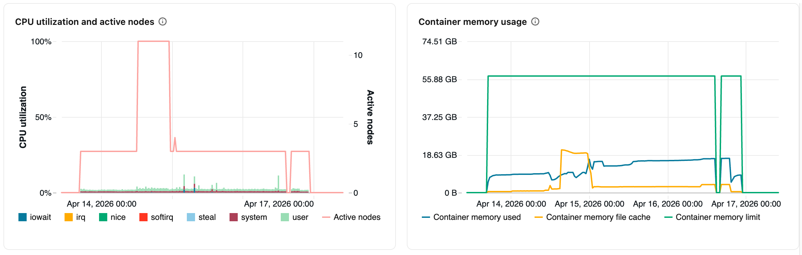

### 13.5 Optimized Autoscaling und Shuffle-Daten

Traditionelles Autoscaling entfernt Worker nicht flexibel während unterschiedlicher Job-Phasen — die deployte Worker-Anzahl bleibt statisch, während aktive Executors stark schwanken:

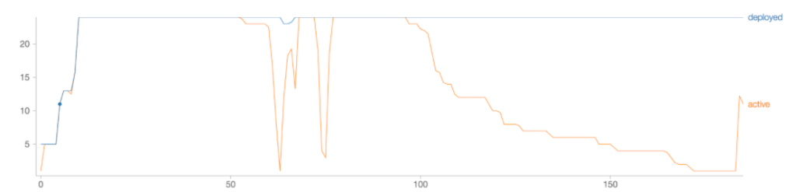

**Databricks' Optimized Autoscaling** nutzt Spark-Shuffle- und Executor-Statistiken, um Cluster intelligent zu resizen — bis zu 30 % Kosteneinsparung bei lang laufenden Workloads. Der Mechanismus berichtet periodisch detaillierte Statistiken über idle Executors und den Speicherort von Zwischendateien im Cluster; Worker werden nur entfernt, wenn sie idle sind **und** keine Shuffle-Daten enthalten, die von laufenden Queries benötigt werden. Das System kann sogar herunterskalieren, während auf anderen Executors desselben Spark-Jobs noch Tasks laufen — ohne Tasks abzubrechen oder Zwischenergebnisse neu zu berechnen.

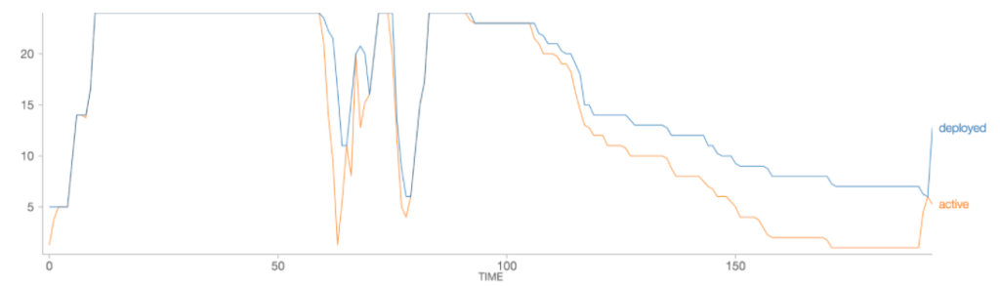

### Quellen

- Private Kursnotiz (VM-Größe, NVMe/SSD, Denormalisierung als Mitigationsstrategien)
- https://docs.databricks.com/aws/en/compute/cluster-config-best-practices
- https://docs.databricks.com/aws/en/compute/configure
- https://docs.databricks.com/aws/en/compute/cluster-metrics
- https://docs.databricks.com/aws/en/lakehouse-architecture/cost-optimization/best-practices
- https://docs.databricks.com/aws/en/lakehouse-architecture/performance-efficiency/best-practices
- https://docs.databricks.com/aws/en/lakehouse-architecture/deployment-guide/observability
- https://www.databricks.com/blog/2018/05/02/introducing-databricks-optimized-auto-scaling.html
- https://www.databricks.com/discover/pages/optimize-data-workloads-guide

---

## <a id="delta-layout">14. Delta-Tabellenlayout und Shuffles</a>

### 14.1 Auto Compaction und Optimized Writes

**Auto Compaction** fasst kleine Dateien innerhalb von Tabellenpartitionen nach erfolgreichen Schreibvorgängen zusammen, synchron auf dem schreibenden Cluster (`autoOptimize.autoCompact`-Tabelleneigenschaft oder `spark.databricks.delta.autoCompact.enabled`).

**Optimized Writes** verbessern die Dateigröße bereits beim Schreiben und sind „am effektivsten für partitionierte Tabellen, da sie die Anzahl kleiner Dateien je Partition reduzieren."


### 14.2 Zielgröße und automatische Skalierung

`delta.targetFileSize` steuert die Ausgabedateigröße über OPTIMIZE, Liquid Clustering, Auto Compaction und Optimized Writes hinweg. Automatische Skalierung nach Tabellengröße:

| Tabellengröße | Ziel-Dateigröße |
|---|---|
| < 2,56 TB | 256 MB |
| 2,56–10 TB | linear steigend von 256 MB auf 1 GB |
| > 10 TB | 1 GB |

Für Tabellen über 1 TB empfiehlt sich ein regelmäßiger `OPTIMIZE`-Zeitplan zur weiteren Dateikonsolidierung.

### 14.3 MERGE-Shuffle-Partitionen konfigurieren

Der `MERGE`-Befehl shuffelt Daten mehrfach, um die aktualisierten Daten zu berechnen und zu schreiben; die Anzahl der dafür genutzten Tasks wird über `spark.sql.shuffle.partitions` gesteuert — höhere Werte erhöhen die Parallelität, erzeugen aber mehr kleine Dateien.

**Tuning bei Bottlenecks im MERGE (aus der Delta-DML-Internals-Analyse):**

- **Inner-Join-Bottleneck** (Auffinden übereinstimmender Dateien): Shuffle-Partitionen anpassen, Broadcast-Join-Schwellenwerte anpassen, kleine Dateien kompaktieren.
- **Outer-Join-Bottleneck** (Schreiben der aktualisierten Daten): Shuffle-Partitionen anpassen (Warnung: kann bei partitionierten Tabellen zu vielen kleinen Dateien führen), Broadcast-Schwellenwerte anpassen, Quelltabelle cachen.

### Quellen

- https://docs.databricks.com/aws/en/delta/best-practices
- https://docs.databricks.com/aws/en/delta/tune-file-size
- https://www.databricks.com/blog/2020/09/29/diving-into-delta-lake-dml-internals-update-delete-merge.html

---

## <a id="query-watchdog">15. Query Watchdog</a>

Schützt vor Queries, die Compute-Ressourcen durch die häufigsten Ursachen großer Queries monopolisieren, und terminiert Queries, die einen Schwellenwert überschreiten. Adressiert drei Hauptgefahren:

1. **Übermäßige Output-Zeilen** — Queries, die unverhältnismäßig mehr Output als Input erzeugen.
2. **Partition-Überlastung** — Queries, die viele externe Partitionen großer Tabellen abrufen.
3. **Ressourcensättigung** — Berechnungen auf extrem großen Datensätzen, die die Performance für gemeinsam nutzende Nutzer verlangsamen.

### Beispielszenario

Zwei Tabellen mit je einer Million Zeilen werden über einen gemeinsamen leeren String als Join-Key verbunden — Ergebnis: eine Billion Zeilen, konzentriert auf einem einzigen Executor, was die Query unbegrenzt hängen lässt und gemeinsam genutzte Ressourcen blockiert.


### Konfigurationsparameter

| Parameter | Zweck | Standard |
|---|---|---|
| `spark.databricks.queryWatchdog.enabled` | Aktiviert den Watchdog-Prozess | — |
| `spark.databricks.queryWatchdog.outputRatioThreshold` | maximales Output/Input-Zeilenverhältnis | 1000 |
| `spark.databricks.queryWatchdog.minTimeSecs` | minimale Task-Laufzeit vor Abbruch | — |
| `spark.databricks.queryWatchdog.minOutputRows` | minimale Output-Zeilenanzahl vor Abbruch | — |
| `spark.databricks.queryWatchdog.maxHivePartitions` | maximale abzurufende Hive-Partitionen | — |
| `spark.databricks.queryWatchdog.maxQueryTasks` | maximale Tasks für extrem große Datensätze | — |

**Empfohlen für:** interaktive Analyse-Cluster, auf denen SQL-Analysten und Data Scientists Compute teilen.
**Nicht empfohlen für:** ETL-Szenarien ohne menschliche Aufsicht zur Fehlerkorrektur.

### Quelle

- https://docs.databricks.com/aws/en/compute/troubleshooting/query-watchdog

---

## <a id="historie">16. Historische Entwicklung und Praxisbeispiele</a>

### 16.1 Evolution über Spark-Versionen

| Version | Shuffle-relevante Neuerung |
|---|---|
| **Frühe Spark-Releases** (2014/2015) | Sort-based Shuffle Layer und Netty-basierte Netzwerkschicht (Zero-Copy, explizites Memory-Management) ermöglichten Petabyte-Shuffles über 250.000 Tasks — Grundlage für den 2014 aufgestellten Daytona-GraySort-Weltrekord: 100 TB in 23 Minuten sortiert (4,27 TB/min vs. 1,42 TB/min bei Hadoop MapReduce, ~3x schneller mit 10x weniger Maschinen: 206 vs. 2.100 Knoten). Der Benchmark erzeugte 500 TB Disk-I/O und 200 TB Netzwerk-I/O. |
| **Spark 3.0** (DBR 7.0) | AQE eingeführt: dynamisches Coalescing von Shuffle-Partitionen, dynamische Join-Strategie-Umwandlung, dynamische Skew-Join-Optimierung. Auf 3-TB-TPC-DS-Benchmark: >1,5x Speedup bei 2 Queries, >1,1x bei 37 weiteren. Dynamic Partition Pruning brachte zusätzlich 2x–18x Speedup bei 60 von 102 TPC-DS-Queries. |
| **Spark 3.1** | Shuffle-Entfernung in bestimmten Szenarien durch mehrere Optimizer-Initiativen (SPARK-31869, SPARK-32282, SPARK-33399). Shuffle-Hash-Join (SHJ) unterstützt jetzt alle Join-Typen mit Codegen-Unterstützung (SPARK-32399, SPARK-32421) — eliminiert den Sortierschritt des Sort-Merge-Joins, liefert höhere CPU-/IO-Effizienz beim Join großer mit kleineren (nicht broadcastbaren) Tabellen, kann aber bei großer Build-Seite zu OOM führen. |
| **Spark 3.2** | AQE standardmäßig **aktiviert** (SPARK-33679), inkl. Shuffle-Partition-Coalescing als Teil der Re-Optimierung, vollständig kompatibel mit Dynamic Partition Pruning. TPC-DS-Kompilierzeit um 61 % reduziert gegenüber 3.1.2. |
| **Spark 3.3** (DBR 11.0) | Bloom-Filter-Joins als Row-Level-Runtime-Filter ergänzend zu Dynamic Partition/File Pruning — reduzieren die Menge zu shuffelnder Daten frühzeitig, bis zu 10x Speedup auf TPC-DS. Full-Outer-Shuffled-Hash-Join-Verbesserungen (SPARK-32567) durch erweiterte Whole-Stage-Codegen-Abdeckung: 10–20 % schneller. |

### 16.2 Praxisbeispiel: 60-TB-Produktions-Workload (Facebook-Case-Study, 2016)

Konkrete Shuffle-Bottlenecks und ihre Behebung bei einem großskaligen Produktions-Workload:

- **Shuffle-Write-Latenz:** Map-Tasks öffneten und schlossen dieselbe Datei für jede Partition wiederholt — Fix führte zu **bis zu 50 % Speed-up** (SPARK-5581).
- **Shuffle-Service-Bottleneck:** Reducer verbrachten 10–15 % ihrer Zeit mit Warten auf Map-Daten (SPARK-15074), verursacht durch wiederholtes Öffnen/Schließen von Index-Dateien im Shuffle-Service. Index-Caching reduzierte die gesamte Shuffle-Fetch-Zeit um **50 %**.
- **Verbindungs-Timeouts:** häufige Executor-Timeouts beim Verbindungsaufbau zum Shuffle-Service während der Shuffle-Phase.
- **Konfigurationsänderungen:** `spark.shuffle.io.serverThreads` (mehr Netty-Server-Threads), `spark.shuffle.io.backLog` (größeres Backlog), Input-Split-Größe von 256-MB-Blöcken auf 2 GB erhöht (Task-Anzahl von 250.000 auf ~31.000 reduziert).
- **Gesamtergebnis:** 4,5–6x CPU-Verbesserung und ~5x Latenzverbesserung gegenüber einer vergleichbaren Hive-Pipeline.

### 16.3 Praxisbeispiel: Star-Schema-Design

Aus den offiziellen Best Practices für Star Schemas auf Databricks: kleinere Dimensionstabellen werden auf dem Dimension-Key geclustert und beim Join zu den Faktentabellen gebroadcastet — das vermeidet teure Shuffle-Operationen, indem kleine Lookup-Tabellen über Worker repliziert statt die große Faktentabelle geshuffelt wird. Für größere, nicht broadcastbare Dimensionen und Faktentabellen minimiert Liquid Clustering (begrenzt auf die besten 1–4 Spalten, typischerweise Foreign Keys) den Shuffle-Overhead durch Kolokation zusammengehöriger Daten.

### Quellen

- https://www.databricks.com/blog/2014/11/05/spark-officially-sets-a-new-record-in-large-scale-sorting.html
- https://www.databricks.com/blog/2015/04/24/recent-performance-improvements-in-apache-spark-sql-python-dataframes-and-more.html
- https://www.databricks.com/blog/2020/06/18/introducing-apache-spark-3-0-now-available-in-databricks-runtime-7-0.html
- https://www.databricks.com/blog/2021/03/02/introducing-apache-spark-3-1.html
- https://www.databricks.com/blog/2021/10/19/introducing-apache-spark-3-2.html
- https://www.databricks.com/blog/2022/06/15/introducing-apache-spark-3-3-for-databricks-runtime-11-0.html
- https://www.databricks.com/blog/2016/08/31/apache-spark-scale-a-60-tb-production-use-case.html
- https://www.databricks.com/blog/five-simple-steps-for-implementing-a-star-schema-in-databricks-with-delta-lake
- https://www.databricks.com/blog/what-is-spark-tuning
- https://www.databricks.com/blog/2017/04/01/next-generation-physical-planning-in-apache-spark.html (satirischer April-Fools-Beitrag ohne substanzielle technische Inhalte zu Shuffle-Placement-Entscheidungen — nicht als ernsthafte Quelle verwertbar)

---

## <a id="zusammenfassung">17. Zusammenfassung</a>

- Ein **Shuffle** verschiebt Daten vom Output einer Stage zum Input der nächsten — eine Nebenwirkung breiter (wide) Transformationen wie `join()`, `groupBy()`, `distinct()`, `orderBy()`. Er beinhaltet teures Netzwerk- und Disk-I/O und ist eine der teuersten Operationen in Spark.
- **Diagnose:** Spark UI (Shuffle Read/Write-Metriken je Stage) und Query Profile (Shuffle-Operator im DAG) zeigen, wo und wie viel geshuffelt wird; `spark.sql.shuffle.partitions=auto` ist der empfohlene Ausgangspunkt.
- **AQE** reduziert Shuffle-Overhead automatisch durch Partition-Coalescing (kleine Post-Shuffle-Partitionen zusammenfassen) und dynamische Umwandlung von Sort-Merge- zu Broadcast-Hash-Joins (Shuffle komplett vermeiden).
- **Manuelle Steuerung:** SQL-Hints (`REPARTITION`, `COALESCE`, `REBALANCE`, Join-Hints wie `BROADCAST`/`MERGE`/`SHUFFLE_HASH`) sowie `DISTRIBUTE BY`/`CLUSTER BY` auf SQL-Ebene, `repartition()`/`coalesce()` auf DataFrame-Ebene.
- **Photon** beschleunigt Shuffles durch ein neu konzipiertes spaltenbasiertes Shuffle-Design und ersetzt Sort-Merge- durch Hash-Joins.
- **Low Shuffle Merge** vermeidet Shuffles für unveränderte Zeilen bei `MERGE`-Operationen — kombiniert mit Photon bis zu 4x schneller.
- **Structured Streaming** unterscheidet stateful Queries (Shuffle-Partitionsanzahl beim Checkpoint fixiert, außer via On-Demand State Repartitioning) von stateless Queries (volle AQE-/Auto-Optimized-Shuffle-Unterstützung); Real-Time Mode ersetzt festplattenbasierte Shuffles durch kontinuierliches In-Memory-Streaming-Shuffle.
- **Cluster-Konfiguration:** wenige, große Worker-Knoten reduzieren Netzwerk-I/O bei Shuffles; NVMe/SSD-Storage beschleunigt Shuffle-Read/Write; Databricks' Optimized Autoscaling berücksichtigt aktiv Shuffle-Daten-Standorte beim Herunterskalieren.
- **Delta-Tabellenlayout** (Auto Compaction, Optimized Writes, Ziel-Dateigrößen) reduziert Small-File-Probleme, die MERGE-Shuffles zusätzlich verlangsamen können.
- **Query Watchdog** schützt interaktive Cluster vor extremen, unbeabsichtigt explodierenden Shuffles (z. B. durch kartesische Joins).
