# Data Skew in Spark und Databricks

Umfassende Referenz zu Data Skew: was es ist, wie man es im Spark UI erkennt, wie Databricks es automatisch behandelt (Adaptive Query Execution), und welche manuellen Mitigationsstrategien es gibt. Basierend auf einer privaten Kursnotiz sowie zahlreichen offiziellen Databricks-Doku-Seiten und Engineering-Blogposts (jeweils am Ende jedes Abschnitts referenziert).

## Abschnittsübersicht

1. [Was ist Data Skew?](#was-ist-skew)
2. [Auswirkungen von Skew](#auswirkungen)
3. [Skew im Spark UI erkennen](#erkennen)
4. [Adaptive Query Execution (AQE)](#aqe)
5. [Manuelle Steuerung: Skew Hints (Legacy)](#skew-hints)
6. [Join-Hints im Überblick](#join-hints)
7. [Range Joins und Skew](#range-joins)
8. [Weitere Mitigationsstrategien](#mitigation)
9. [Datenlayout-Optimierung zur Skew-Vermeidung](#datenlayout)
10. [Photon und Skew](#photon)
11. [Cluster-Konfiguration und Best Practices](#cluster)
12. [Query Watchdog: Schutz vor explodierenden Queries](#query-watchdog)
13. [Skew in Structured Streaming](#streaming)
14. [Praxisbeispiele](#praxisbeispiele)
15. [Zusammenfassung](#zusammenfassung)

---

## <a id="was-ist-skew">1. Was ist Data Skew?</a>

Aus einer privaten Kursnotiz übernommen: Daten werden beim Einlesen typischerweise als 128-MB-Partitionen gleichmäßig verteilt gelesen. Sobald Daten transformiert werden (z. B. durch Aggregation), kann es passieren, dass eine Spark-Partition deutlich mehr Datensätze enthält als eine andere — das ist **Data Skew**. Ein geringes Maß an Skew ist meist vernachlässigbar, aber starker Skew kann zu Spill oder — schlimmer — zu schwer diagnostizierbaren Out-of-Memory-Fehlern führen.

**Beispiel:** Vier Partitionen, ursprünglich nach dem Einlesen gleichmäßig verteilt. Nach einer Aggregation nach Stadt könnten die Städte A, B und C ähnlich groß sein (z. B. wenn die Datenmenge mit der Bevölkerung korreliert und die Städte vergleichbar groß sind) — aber Stadt D hat doppelt so viele Einwohner und damit doppelt so viele Datensätze. Die Partition, die D enthält, wird dadurch proportional größer als die der anderen drei Städte.


## <a id="auswirkungen">2. Auswirkungen von Skew</a>

Ist eine Partition (z. B. Stadt D) doppelt so groß wie die anderen:

- Sie braucht doppelt so lange zur Verarbeitung.
- Sie benötigt doppelt so viel Arbeitsspeicher.

Daraus folgt:

- **Die gesamte Stage dauert so lange wie der am längsten laufende Task** — die übrigen, kleineren Partitionen sind längst fertig, während der Cluster auf die eine große Partition wartet.
- Es steht möglicherweise nicht genug RAM für die geskewten Partitionen zur Verfügung → Spill auf Festplatte oder OOM-Fehler.

## <a id="erkennen">3. Skew im Spark UI erkennen</a>

Der Databricks-eigene Spark-UI-Debugging-Guide beschreibt einen schrittweisen, praktischen Diagnoseweg: **Jobs-Timeline prüfen → längste Stage untersuchen → auf Skew/Spill prüfen → I/O-gebunden einschätzen → weitere Ursachen für langsame Stages untersuchen.**

### 3.1 Spark UI öffnen

Über die Compute-Seite die gewünschte Compute-Ressource auswählen und den Tab **Spark UI** öffnen.

### 3.2 Jobs-Timeline als Startpunkt

Unter **Jobs → Event Timeline** lässt sich auf einen Blick erkennen, was lief, wie lange jeder Schritt dauerte und ob etwas fehlgeschlagen ist.

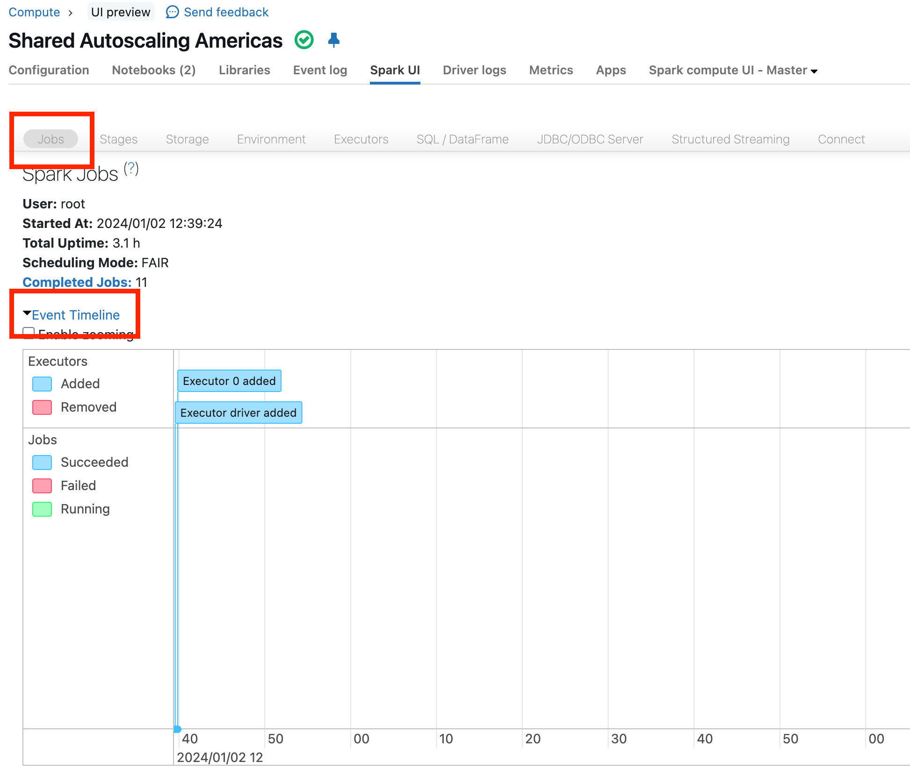

Worauf zu achten ist:

- **Fehlgeschlagene Jobs/Executors:** rote Statusanzeigen.
- **Ausführungslücken:** Pausen von einer Minute oder länger mitten in der Pipeline sind untersuchenswert (kurze Lücken durch Driver-Koordination sind normal).
- **Von wenigen langen Jobs dominierte Timeline:** deutet auf einen konkreten Flaschenhals hin.
- **Viele sehr kleine Jobs** (Sekunden oder weniger): deutet auf ineffiziente Fragmentierung hin.
- Ohne eines dieser Muster: den längsten Job nach Dauer sortieren und dort weiter untersuchen.

### 3.3 Längste Stage identifizieren

Am Ende der Job-Seite die Liste der Stages nach Dauer sortieren. Für die längste Stage die vier I/O-Metriken prüfen (Input, Output, Shuffle Read, Shuffle Write) sowie die Anzahl der Tasks — ein einzelner Task kann bereits ein Hinweis auf ein Problem sein.


### 3.4 Skew- und Spill-Statistiken lesen

In den **Summary Metrics** der Stage-Detailseite die Verteilung der Task-Dauer vergleichen:

> „Ist die Max-Dauer 50 % größer als die 75.-Perzentil-Dauer, leidet die Stage wahrscheinlich unter Skew."


Zusätzlich oben auf der Stage-Seite auf **Spill-Statistiken** prüfen — Spill tritt auf, wenn Spark während Shuffles, Joins, Sortierungen oder Aggregationen zu wenig Ausführungsspeicher hat und auf Festplatte ausweichen muss. Fehlen Spill-Statistiken, hat die Stage kein Spill-Problem.

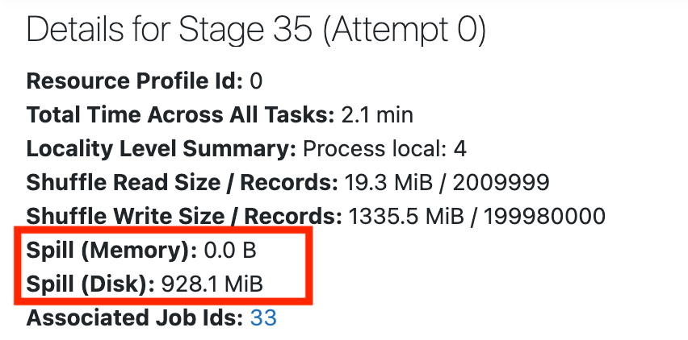

### 3.5 Stage mit niedrigem I/O, aber trotzdem langsam

Ist die Stage langsam, aber die I/O-Werte niedrig, liegt der Flaschenhals wahrscheinlich in der Berechnung selbst, nicht im Lesen/Schreiben. Über **Associated SQL Query** lässt sich der SQL-DAG öffnen, der zeigt, wo Zeit anfällt:

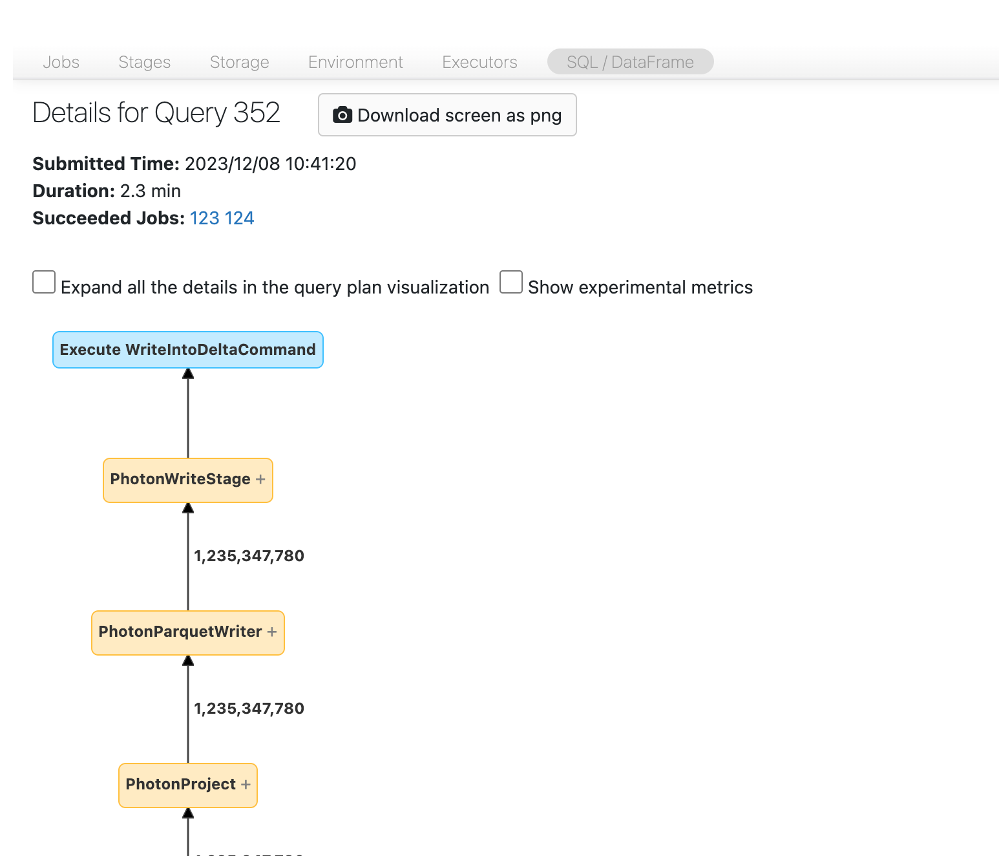

Häufige Ursachen bei niedrigem I/O:

- **Viele kleine Dateien lesen/schreiben** — Dateien sollten mindestens 8 MB groß sein; das Small-File-Problem entsteht meist durch Partitionierung nach zu vielen oder hochkardinalen Spalten. Abhilfe: `OPTIMIZE` ausführen und Predictive Optimization aktivieren.
- **Langsame UDFs** — testweise auskommentieren, um den Einfluss zu prüfen; nativen Funktionen statt UDFs bevorzugen.
- **Kartesische Joins** — sehr teuer; prüfen, ob das wirklich beabsichtigt ist.
- **Explodierende Joins/`explode()`** — wenige Zeilen gehen hinein, um Größenordnungen mehr kommen heraus:

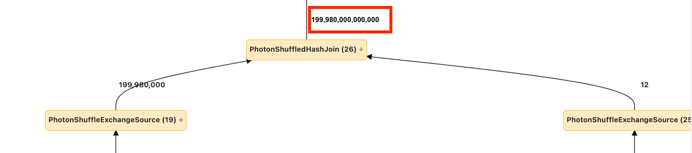

### 3.6 Stage mit hohem I/O

Faustregel: größte I/O-Spalte durch (Worker-Cores × Dauer in Sekunden) teilen — nähert sich das Ergebnis 3 MB/Sekunde/Core, ist die Stage wahrscheinlich I/O-gebunden.

- **Hoher Input:** Delta-Format nutzen, Liquid Clustering für besseres Data Skipping, Photon für beschleunigtes Lesen (besonders bei breiten Tabellen), Query-Selektivität verbessern, Delta Cache nutzen, Joins über Dynamic File Pruning (DFP) optimieren, Cluster skalieren oder Serverless nutzen.
- **Hoher Output:** prüfen, ob unnötig viele Daten neu geschrieben werden, Delta-MERGE-Operationen optimieren, Deletion Vectors statt vollständigem Parquet-Neuschreiben nutzen, Photon für schnelleres Schreiben.
- **Hoher Shuffle:** `spark.sql.shuffle.partitions=auto` setzen, damit Spark die Partitionsanzahl automatisch optimiert.

### 3.7 Fehlschlagende Jobs

Häufige Ursachen für entfernte Executors: Autoscaling (erwartet, kein Fehler), verlorene Spot-Instanzen, oder Speichererschöpfung (wahrscheinlichste Erklärung bei echten Fehlern). Diagnose: fehlgeschlagene Stage öffnen, einzelne fehlgeschlagene Tasks auf Muster prüfen; bei Executor-Ausfällen zuerst das Event-Log der Compute-Ressource, dann den Tab **Executors** im Spark UI für die Logs der ausgefallenen Executors prüfen.


### Quellen

- https://docs.databricks.com/aws/en/optimizations/spark-ui-guide/
- https://docs.databricks.com/aws/en/optimizations/spark-ui-guide/long-spark-stage-page
- https://docs.databricks.com/aws/en/optimizations/spark-ui-guide/long-spark-stage
- https://docs.databricks.com/aws/en/optimizations/spark-ui-guide/slow-spark-stage-low-io
- https://docs.databricks.com/aws/en/optimizations/spark-ui-guide/long-spark-stage-io
- https://docs.databricks.com/aws/en/optimizations/spark-ui-guide/jobs-timeline
- https://docs.databricks.com/aws/en/optimizations/spark-ui-guide/failing-spark-jobs
- https://docs.databricks.com/aws/en/compute/troubleshooting/debugging-spark-ui

---

## <a id="aqe">4. Adaptive Query Execution (AQE)</a>

Aus einer privaten Kursnotiz: Data Skew ist letztlich unvermeidbar — aber Databricks behandelt es standardmäßig automatisch. In vielen MPP-Systemen (Massively Parallel Processing) beeinträchtigt Skew die Performance erheblich, da einzelne Worker deutlich mehr Daten verarbeiten als andere; die meisten Cloud-Data-Warehouses erfordern eine manuelle, offline durchgeführte Neuverteilung. Mit **Adaptive Query Execution** zerlegt Spark größere Partitionen automatisch in kleinere, ähnlich große Partitionen.


### 4.1 Was AQE ist

Query-Re-Optimierung, die **während der Ausführung** stattfindet: AQE nutzt exakte Laufzeitstatistiken (nach Shuffle- und Broadcast-Exchanges), um Query-Pläne dynamisch zu optimieren — besonders wertvoll, wenn die vorab geschätzten Statistiken veraltet oder gar nicht vorhanden sind. AQE greift bei nicht-streamenden Queries mit mindestens einem Exchange (Joins, Aggregationen, Fenster­funktionen) oder einer Subquery; eine Re-Optimierung ist dabei nicht für jede anwendbare Query garantiert.

### 4.2 Die vier Kernfähigkeiten

1. **Dynamische Join-Strategie-Umwandlung** — wandelt Sort-Merge-Joins automatisch in Broadcast-Hash-Joins um, wenn das zur Laufzeit vorteilhaft erscheint.
2. **Partition-Coalescing** — fasst kleine Partitionen nach dem Shuffle zu sinnvoll großen zusammen und reduziert so I/O-Overhead.
3. **Skew-Join-Handling** — teilt geskewte Tasks auf und repliziert sie zu gleichmäßig großen Tasks.
4. **Leere-Relationen-Erkennung** — erkennt leere Zwischenergebnisse und propagiert das durch den gesamten Plan.

### 4.3 Wie Skew-Join-Optimierung intern funktioniert

AQE erkennt Skew automatisch anhand der Shuffle-Datei-Statistiken. Der Ablauf:

1. **Erkennung:** Das System vergleicht Partitionsgrößen und identifiziert Partitionen, die deutlich größer sind als die übrigen.
2. **Aufteilen und Replizieren:** Die geskewte Partition wird in kleinere Sub-Partitionen aufgeteilt, die jeweils mit der korrespondierenden Partition der anderen Seite gejoint werden.

**Beispiel aus dem Databricks-Engineering-Blog:** Tabelle A hat eine Partition A0, die deutlich größer ist als ihre drei Geschwisterpartitionen. Ohne Optimierung führen vier Tasks den Sort-Merge-Join aus, wobei ein Task unverhältnismäßig lange braucht. Nach der Optimierung laufen fünf Tasks mit annähernd gleicher Ausführungszeit — die Gesamtlaufzeit sinkt spürbar.

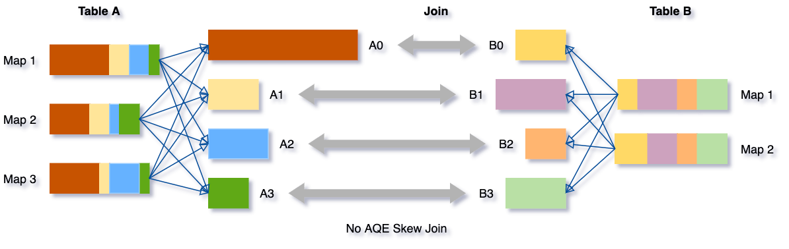

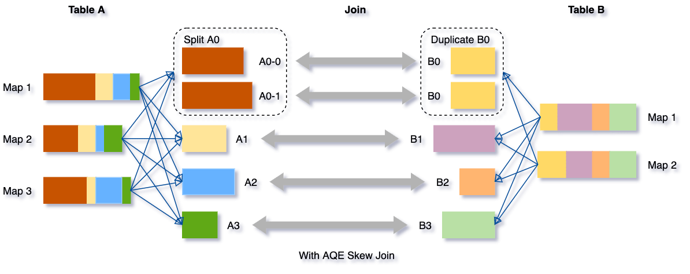

Der Gesamtablauf von AQE — Ausgangsplan, Sammeln von Laufzeitstatistiken, Re-Optimierung:

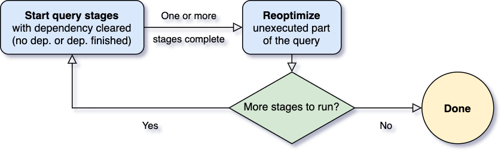

Auf TPC-DS-Benchmarks brachte AQE zunächst (Spark 3.0, initiale Einführung) Beschleunigungen von bis zu **8x** bei einzelnen Queries; 32 von 103 Queries zeigten mehr als 1,1x Speedup.

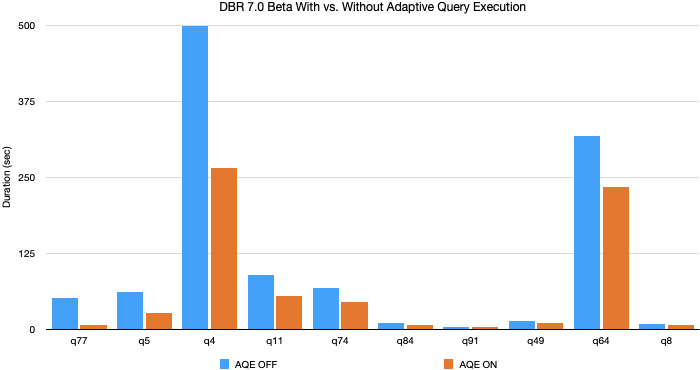

### 4.4 So im Spark UI erkennen

Ein per AQE behandelter Skew-Join erscheint im Query-Plan als eigener Knoten mit Skew-Markierung; der `CustomShuffleReader`-Knoten meldet, wie viele Partitionen als geskewt erkannt und in wie viele neue Partitionen sie aufgeteilt wurden.

| Vor Ausführung | Während Ausführung | Nach Ausführung |
|---|---|---|
|  |  |  |

Skew-Join-Knoten im finalen physischen Plan, grafisch und als Explain-String:


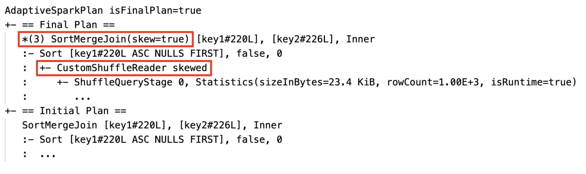

Der `CustomShuffleReader`-Knoten, der Coalescing und Skew-Splitting anzeigt:


### 4.5 Konfigurationsparameter

**Aktivieren/Deaktivieren:**

| Parameter | Standard | Bedeutung |
|---|---|---|
| `spark.databricks.optimizer.adaptive.enabled` | `true` | AQE insgesamt an/aus (Databricks-spezifischer Schalter) |
| `spark.sql.adaptive.enabled` | `true` (seit Spark 3.2; Standard `false` in Spark 3.0 Open Source) | AQE in Open-Source-Spark |

**Shuffle-Partitionen automatisch optimieren:**

| Parameter | Standard | Bedeutung |
|---|---|---|
| `spark.sql.shuffle.partitions` | `200`, auf `"auto"` setzbar | Anzahl Shuffle-Partitionen; `auto` lässt AQE automatisch optimieren |
| `spark.databricks.adaptive.autoOptimizeShuffle.enabled` | — | Databricks-spezifisch: setzt automatisch die Map-seitige Partitionsanzahl, die Open-Source-AQE nicht automatisch setzt |

**Broadcast-Join-Umwandlung:**

| Parameter | Standard |
|---|---|
| `spark.databricks.adaptive.autoBroadcastJoinThreshold` | `30MB` |
| `spark.sql.adaptive.autoBroadcastJoinThreshold` (Open-Source-Spark, seit 3.2.0) | standardmäßig identisch zu `spark.sql.autoBroadcastJoinThreshold` (10MB, siehe [Shuffles.md](Shuffles.md), Abschnitt 6.2); gilt **nur** innerhalb des AQE-Frameworks für die dynamische Laufzeit-Umwandlung, nicht für die statische Broadcast-Entscheidung beim Query-Planning; `-1` deaktiviert dynamisches Broadcasting |

**Partition-Coalescing:**

| Parameter | Standard |
|---|---|
| `spark.sql.adaptive.coalescePartitions.enabled` | `true` |
| `spark.sql.adaptive.advisoryPartitionSizeInBytes` | `64MB` |
| `spark.sql.adaptive.coalescePartitions.minPartitionSize` | `1MB` |
| `spark.sql.adaptive.coalescePartitions.minPartitionNum` | 2× Cluster-Kerne |

**Skew-Join-Handling:**

| Parameter | Standard |
|---|---|
| `spark.sql.adaptive.skewJoin.enabled` | `true` |
| `spark.sql.adaptive.skewJoin.skewedPartitionFactor` | `5` |
| `spark.sql.adaptive.skewJoin.skewedPartitionThresholdInBytes` | `256MB` |
| `spark.sql.adaptive.forceOptimizeSkewedJoin` | `false` (seit Spark 3.3.0) |

`forceOptimizeSkewedJoin` erzwingt die Skew-Join-Optimierung, selbst wenn dadurch zusätzlicher Shuffle entsteht — verhindert Straggler-Tasks auch in Grenzfällen, in denen AQE die Optimierung sonst als nicht lohnenswert einstuft.

Aus der privaten Kursnotiz, konsistent mit den offiziellen Standardwerten: Eine Partition gilt als geskewt, wenn **beide** Bedingungen erfüllt sind — ihre Größe übersteigt (`skewedPartitionFactor` × Median-Partitionsgröße) **und** sie übersteigt den `skewedPartitionThresholdInBytes`-Schwellenwert. Mit anderen Worten: eine Partition mit mindestens 256 MB, die zugleich mindestens 5-mal größer ist als die durchschnittliche Partitionsgröße, wird von AQE als geskewt behandelt. Idealerweise sollte `skewedPartitionThresholdInBytes` größer als `spark.sql.adaptive.advisoryPartitionSizeInBytes` gesetzt sein.

**Wichtige Einschränkung (aus Kursmaterial, konsistent mit dem Zweck von `spark.sql.shuffle.partitions`):** Bei mehr als 2.000 Shuffle-Partitionen kann Spark keine spezifischen Shuffle-Block-Größen mehr nachverfolgen und speichert nur noch Durchschnittswerte — AQE kann Skew unter dieser Bedingung nicht mehr erkennen. Abhilfe: Anzahl der Shuffle-Partitionen unter 2.000 halten, oder den entsprechenden Schwellenwert-Parameter erhöhen.

**Skew-Splitting bei `REBALANCE` (offizielle Spark-Doku):** Getrennt von der Sort-Merge-Join-Skew-Optimierung oben behandelt AQE auch Skew innerhalb der von `RebalancePartitions` erzeugten Partitionen (siehe `REBALANCE`-Hint in [Shuffles.md](Shuffles.md), Abschnitt 6.1) — geskewte Partitionen werden dabei gemäß `spark.sql.adaptive.advisoryPartitionSizeInBytes` in kleinere Teile aufgesplittet:

| Parameter | Standard |
|---|---|
| `spark.sql.adaptive.optimizeSkewsInRebalancePartitions.enabled` | `true` (seit Spark 3.2.0) |
| `spark.sql.adaptive.rebalancePartitionsSmallPartitionFactor` | `0.2` (seit Spark 3.3.0) — eine Partition wird beim Splitten mit einer Nachbarpartition zusammengeführt, wenn ihre Größe kleiner ist als dieser Faktor multipliziert mit `advisoryPartitionSizeInBytes` |

**Leere-Relationen-Propagation:**

| Parameter | Standard |
|---|---|
| `spark.databricks.adaptive.emptyRelationPropagation.enabled` | `true` |

### 4.6 Evolution über Spark-/Databricks-Runtime-Versionen

| Version | Neuerung bei AQE/Skew |
|---|---|
| **Spark 3.0** (DBR 7.0) | AQE erstmals eingeführt: Partition-Coalescing, dynamische Join-Strategie-Umwandlung, dynamische Skew-Join-Optimierung. Auf einem 3-TB-TPC-DS-Benchmark: >1,5x Speedup bei 2 Queries, >1,1x bei 37 weiteren. Insgesamt 2x Performance-Verbesserung gegenüber Spark 2.4. |
| **DBR 7.3 LTS** | AQE production-ready für Produktions-Workloads; Databricks-spezifisches „Auto-Optimized Shuffle" (`spark.databricks.adaptive.autoOptimizeShuffle.enabled`) ergänzt die fehlende automatische Map-seitige Partitionierung von Open-Source-AQE. |
| **Spark 3.2** | AQE standardmäßig **aktiviert** (vorher opt-in). Volle Kompatibilität mit Dynamic Partition Pruning. Kompilierzeit für TPC-DS-Queries um 61 % reduziert. |
| **Spark 3.3** (DBR 11.0) | AQE-Verbesserungen: Propagation leerer Zwischenergebnisse durch Aggregate/Union, Optimierung von Ein-Zeilen-Query-Plänen, Elimination redundanter Limits im AQE-Optimizer. Zusätzlich Whole-Stage-Codegen für Full-Outer-Sort-Merge-Join (+20–30 %) und Full-Outer-Shuffled-Hash-Join (+10–20 %); Bloom-Filter-Joins mit bis zu 10x Verbesserung auf TPC-DS. |
| **Spark 3.5** | AQE-Unterstützung für SQL-Cache ergänzt (Details dazu nicht öffentlich dokumentiert). |

### 4.7 AQE in Structured Streaming

Ab **Databricks Runtime 13.1** lässt sich AQE auch auf Streaming-Queries anwenden, die den `foreachBatch`-Sink nutzen: AQE sammelt Laufzeitstatistiken während der Micro-Batch-Ausführung und wendet dynamische Re-Optimierungen an. AQE wirkt dabei nur auf **zustandslose Operatoren** und wird auf den Micro-Batch-DataFrame **innerhalb** der `foreachBatch`-Callback-Funktion angewendet — zustandsbehaftete Operatoren, die vor `foreachBatch` laufen, werden separat ohne AQE ausgeführt, um Korrektheitsprobleme durch Repartitionierung zu vermeiden.

**Empfehlung:** Transformationen (insbesondere Joins) nach Möglichkeit innerhalb der `foreachBatch`-Funktion statt vorher auf dem Streaming-DataFrame anwenden, um AQE-Abdeckung zu maximieren.

**Interne Benchmarks:** median 1,38x Speedup allein durch AQE, 2,87x kombiniert mit Photon; einzelne Queries bis zu 16x schneller durch bessere Join-Strategie-Wahl.

### Quellen

- https://docs.databricks.com/aws/en/optimizations/aqe
- https://www.databricks.com/blog/2020/05/29/adaptive-query-execution-speeding-up-spark-sql-at-runtime.html
- https://www.databricks.com/blog/2020/10/21/faster-sql-adaptive-query-execution-in-databricks.html
- https://www.databricks.com/blog/adaptive-query-execution-structured-streaming
- https://www.databricks.com/blog/2020/06/18/introducing-apache-spark-3-0-now-available-in-databricks-runtime-7-0.html
- https://www.databricks.com/blog/2021/03/08/upgrade-production-workloads-to-be-safer-easier-and-faster-with-databricks-runtime-7-3-lts.html
- https://www.databricks.com/blog/2021/10/19/introducing-apache-spark-3-2.html
- https://www.databricks.com/blog/2022/06/15/introducing-apache-spark-3-3-for-databricks-runtime-11-0.html
- https://www.databricks.com/blog/introducing-apache-sparktm-35
- https://spark.apache.org/docs/latest/sql-performance-tuning.html#converting-sort-merge-join-to-broadcast-join

---

## <a id="skew-hints">5. Manuelle Steuerung: Skew Hints (Legacy)</a>

**Hinweis:** Diese Databricks-Doku-Seite ist **retired und wird nicht mehr gepflegt**. Skew-Hints sind nicht mehr erforderlich — Databricks behandelt Skew standardmäßig automatisch über AQE (`spark.sql.adaptive.skewJoin.enabled = true`). Der Abschnitt bleibt als historische Referenz erhalten, u. a. weil ältere Spark-2.x-Workloads darauf zurückgreifen konnten.

**Erkennungsmerkmal für Data Skew laut Doku:** eine Query, bei der „nur sehr wenige Tasks fertig zu werden scheinen", mit stark unausgewogener Task-Laufzeitverteilung.

### Legacy-Skew-Hint-Syntax (nur SQL)

**1. Nur Relationsname:**

```sql
SELECT /*+ SKEW('orders') */ *
FROM orders, customers
WHERE c_custId = o_custId
```

**2. Mit Spaltenangabe:**

```sql
-- einzelne Spalte
SELECT /*+ SKEW('orders', 'o_custId') */ *
FROM orders, customers
WHERE o_custId = c_custId

-- mehrere Spalten
SELECT /*+ SKEW('orders', ('o_custId', 'o_storeRegionId')) */ *
FROM orders, customers
WHERE o_custId = c_custId AND o_storeRegionId = c_regionId
```

**3. Mit expliziten Skew-Werten:**

```sql
SELECT /*+ SKEW('orders', 'o_custId', 0) */ *
FROM orders, customers
WHERE o_custId = c_custId

SELECT /*+ SKEW('orders', 'o_custId', (0, 1, 2)) */ *
FROM orders, customers
WHERE o_custId = c_custId
```

Aus einer privaten Kursnotiz, ergänzend zur historischen Einordnung — drei „klassische" Lösungswege vor AQE:

1. **Adaptive Query Execution** (seit Spark 3.1 standardmäßig aktiviert)
2. **Skew-Werte filtern**
3. **Databricks' proprietärer Skew-Hint** — einfacher als Salting, guter Kompromiss für Spark-2.x-Umgebungen
4. **Join-Keys salten**, um eine gleichmäßige Verteilung beim Shuffle zu erzwingen — wenn keine der anderen Optionen passt

### Quelle

- https://docs.databricks.com/aws/en/archive/legacy/skew-join
- https://docs.databricks.com/aws/en/sql/language-manual/sql-ref-syntax-qry-select-hints (verweist für den `SKEW`-Hint ausschließlich auf die Legacy-Seite, ohne eigene Syntaxangabe)

---

## <a id="join-hints">6. Join-Hints im Überblick</a>

Databricks SQL unterstützt drei Kategorien von Hints zur Steuerung des Query-Plans.

### Partitionierungs-Hints

| Hint | Wirkung |
|---|---|
| `COALESCE(part_num)` | reduziert die Partitionsanzahl auf den angegebenen Wert |
| `REPARTITION(part_num \| [part_num,] column_name)` | verteilt Daten nach Partitionsanzahl und/oder Spalten neu |
| `REPARTITION_BY_RANGE(part_num [, column_name] \| column_name)` | bereichsbasierte Neuverteilung |
| `REBALANCE([column_name])` | gleicht Partitionsgrößen automatisch aus; erfordert aktivierte AQE |

```sql
SELECT /*+ COALESCE(3) */ * FROM t;
SELECT /*+ REPARTITION(3, c) */ * FROM t;
SELECT /*+ REBALANCE(c) */ * FROM t;
```

### Join-Hints

Priorisierung: `BROADCAST` > `MERGE` > `SHUFFLE_HASH` > `SHUFFLE_REPLICATE_NL`.

| Hint | Wirkung |
|---|---|
| `BROADCAST(table_name)` (Alias: `BROADCASTJOIN`, `MAPJOIN`) | Broadcast-Join |
| `MERGE(table_name)` (Alias: `SHUFFLE_MERGE`, `MERGEJOIN`) | Shuffle-Sort-Merge-Join |
| `SHUFFLE_HASH(table_name)` | Shuffle-Hash-Join |
| `SHUFFLE_REPLICATE_NL(table_name)` | Shuffle-and-Replicate-Nested-Loop-Join |

```sql
SELECT /*+ BROADCAST(t1) */ * FROM t1 INNER JOIN t2 ON t1.key = t2.key;
SELECT /*+ MERGE(t1) */ * FROM t1 INNER JOIN t2 ON t1.key = t2.key;
```

**Hinweis:** Verdeckt ein Tabellen-Alias den ursprünglichen Namen, muss im Hint der Alias verwendet werden.

### Quelle

- https://docs.databricks.com/aws/en/sql/language-manual/sql-ref-syntax-qry-select-hints

---

## <a id="range-joins">7. Range Joins und Skew</a>

Range-Join-Optimierung beschleunigt Joins mit „Point-in-Interval"- (ein Wert liegt zwischen zwei Werten der anderen Relation, z. B. `points.p BETWEEN ranges.start AND ranges.end`) oder „Interval-Overlap"-Bedingungen (überlappende Intervalle, z. B. `r1.start < r2.end AND r2.start < r1.end`). Databricks SQL erkennt qualifizierende Range Joins automatisch und leitet per Sampling eine passende Bin-Größe ab — ohne manuelle Konfiguration.

**Bezug zu Skew:** Bei stark unterschiedlichen Intervalllängen ist die Wahl der Bin-Größe entscheidend. Empfehlung: die Bin-Größe am 90., 99. oder 99,9. Perzentil der Intervalllängen ausrichten, um Filtereffizienz gegen die Gefahr abzuwägen, dass sehr lange Intervalle zu viele Bins überspannen. Liegt der Wert am 90. Perzentil als Bin-Größe, sind nur 10 % der Intervalllängen länger als das Bin-Intervall.

**Bin-Größe:** ein numerischer Parameter, der den Wertebereich in gleich große Intervalle unterteilt — bei `DATE`-Werten in Tagen, bei `TIMESTAMP`-Werten in Sekunden.

### Drei Konfigurationswege

1. **Automatisch** (Standard in Databricks SQL) — Bin-Größe wird per Sampling abgeleitet.
2. **Range-Join-Hint:**

   ```sql
   SELECT /*+ RANGE_JOIN(points, 10) */ *
   FROM points JOIN ranges
   ON points.p >= ranges.start AND points.p < ranges.end;
   ```

3. **Session-Konfiguration:**

   ```sql
   SET spark.databricks.optimizer.rangeJoin.binSize=5
   ```

Hints überschreiben Session-Konfiguration und automatische Ableitung.

**Automatische Optimierung deaktivieren:**

```sql
SET spark.databricks.optimizer.autoRangeJoin.enabled = false;
```

**Python DataFrame API:**

```python
events.hint("range_join", 60).join(minutes,
  on=[events.event_start < minutes.minute_end,
      minutes.minute_start < events.event_end]).show()
```

**Intervalllängen-Verteilung zur Bin-Größen-Analyse abfragen:**

```sql
SELECT map_from_arrays(
  ARRAY(0.5, 0.9, 0.99, 0.999, 0.9999),
  APPROX_PERCENTILE(end::DOUBLE - start::DOUBLE,
    ARRAY(0.5, 0.9, 0.99, 0.999, 0.9999))
) AS bin_sizes
FROM ranges;
```

### Range Joins bei räumlichen (Spatial) Daten

Geodaten sind oft besonders stark geskewt — dichte urbane Regionen gegenüber dünn besiedelten ländlichen Gebieten, stark schwankende geometrische Komplexität (z. B. die verzweigte norwegische Küstenlinie gegenüber Colorados einfachen Grenzen). Selbst nach effizientem File Pruning bleiben rechenintensive geometrische Operationen für die verbleibenden Join-Kandidaten nötig. Databricks SQL Serverless und Databricks Runtime 17.3 kombinieren automatisch R-Tree-Indizierung, in Photon optimierte räumliche Joins und intelligente Range-Join-Optimierung — in drei kundennahen Benchmark-Queries (Punkt-in-Polygon, Flächenabdeckung, Straßen-Schnittmengen mit Overture-Maps-Daten) ergab das bis zu **17x** schnellere räumliche Joins gegenüber Apache Sedona auf Classic Clusters.

### Quellen

- https://docs.databricks.com/aws/en/optimizations/range-join
- https://docs.databricks.com/aws/en/transform/join
- https://www.databricks.com/blog/databricks-spatial-joins-now-17x-faster-out-box

---

## <a id="mitigation">8. Weitere Mitigationsstrategien</a>

Aus einer privaten Kursnotiz, vier gängige Ansätze in aufsteigender Aufwandsreihenfolge:

### 8.1 Skew-Werte filtern

Lässt sich der Wert, um den herum Skew entsteht, aus der Query herausfiltern, löst das das Problem oft am einfachsten. **Beispiel:** Ein Join über eine Spalte mit vielen `NULL`-Werten erzeugt typischerweise Skew, weil alle `NULL`-Datensätze in derselben Partition landen — das Herausfiltern der `NULL`-Werte behebt das Problem in diesem Fall vollständig.

### 8.2 Skew-Hints

Lassen sich Tabelle, Spalte und idealerweise auch die konkreten Werte identifizieren, die den Skew verursachen, lässt sich Spark explizit darüber informieren (siehe Abschnitt 5) — allerdings inzwischen durch AQE weitgehend obsolet.

### 8.3 AQE-Skew-Optimierung

Siehe Abschnitt 4 — der empfohlene Standardweg, da automatisch und ohne Codeänderung wirksam.

### 8.4 Salting

Wenn keine der obigen Optionen funktioniert, bleibt **Salting** als letzte Option: eine große, geskewte Partition wird in kleinere Partitionen aufgeteilt, indem zufällige Ganzzahlen als Suffix an die Werte der geskewten Spalte angehängt werden.

**Praxisbeispiel** (aus den offiziellen Best Practices für Lakeflow-Pipelines, siehe Quelle): Wenn Join- oder `groupBy`-Keys ungleichmäßig über Partitionen verteilt sind, werden bestimmte Tasks zum Flaschenhals. Empfehlung: stark geskewte Keys durch Anhängen eines zufälligen Bucket-Suffixes salzen und die Aggregation in zwei Stufen durchführen — zunächst nach dem gesalzenen Key, danach über die Bucket-Suffixe hinweg final zusammenführen.

### 8.5 Coalesce vs. Repartition

Zwei DataFrame-Methoden, die scheinbar ähnliches tun, sich aber grundlegend unterscheiden:

```python
coalesce(numPartitions: int) -> DataFrame
```

`coalesce()` erzeugt eine neue DataFrame mit exakt `numPartitions` Partitionen über eine **narrow dependency** — es findet **kein Shuffle** statt. Beim Reduzieren von 1.000 auf 100 Partitionen beansprucht jede neue Partition 10 bestehende. Wird eine höhere Partitionsanzahl angefordert, bleibt sie unverändert (kein Shuffle, um Partitionen zu erhöhen).

```python
spark.range(0, 10, 1, 3).coalesce(1).select(
    sf.spark_partition_id().alias("partition")
).distinct().sort("partition").show()
# Ergebnis: eine einzelne Partition (0)
```

**Wichtiger Unterschied zu `repartition()`:** `coalesce()` shuffelt nicht und ist daher effizient beim Reduzieren von Partitionen — bei drastischer Reduktion (z. B. auf eine einzelne Partition) konzentriert sich die Berechnung aber auf sehr wenige Knoten. In solchen Fällen ist `repartition()` vorzuziehen, da es einen zusätzlichen Shuffle-Schritt einführt, wodurch die bisherigen Partitionen weiterhin parallel verarbeitet werden können, bevor neu verteilt wird.

### Quellen

- Private Kursnotiz (Filterung, Skew-Hints, AQE, Salting als vier Kernstrategien)
- https://docs.databricks.com/aws/en/ldp/best-practices (Salting-Praxisbeispiel für Lakeflow Pipelines)
- https://docs.databricks.com/aws/en/pyspark/reference/classes/dataframe/coalesce

---

## <a id="datenlayout">9. Datenlayout-Optimierung zur Skew-Vermeidung</a>

Skew entsteht nicht nur zur Laufzeit bei Joins/Aggregationen, sondern auch durch das physische Speicherlayout der Tabellen selbst — überproportional große oder viele sehr kleine Dateien pro Partition.

### 9.1 Liquid Clustering

Liquid Clustering ersetzt klassisches Hive-Style-Partitioning und `ZORDER` und organisiert Daten automatisch anhand von Clustering-Keys — ohne bestehende Daten neu schreiben zu müssen, wenn sich die Keys ändern. Besonders relevant für **Tabellen mit starkem Data Skew** sowie hochkardinale Filterspalten.

```sql
CREATE TABLE table1 (col0 INT, col1 STRING) CLUSTER BY (col0);
```

```python
df = spark.read.table("table1")
df.write.clusterBy("col0").saveAsTable("table2")
```

Automatische Key-Wahl (ab DBR 15.4 LTS):

```sql
CREATE OR REPLACE TABLE table1 (column01 int, column02 string) CLUSTER BY AUTO;
```

Verwaltung:

```sql
ALTER TABLE <table_name> CLUSTER BY (<clustering_columns>);
ALTER TABLE table_name CLUSTER BY NONE;   -- Clustering entfernen
OPTIMIZE table_name;                       -- Clustering anwenden
OPTIMIZE table_name FULL;                  -- vollständiges Neu-Clustering (DBR 16.4+)
```

**Warum Liquid Clustering Skew gezielter vermeidet als Partitionierung:** Bei niedrigkardinalen Spalten zielt das System darauf ab, dass jede Datei nur Zeilen eines einzelnen Werts enthält (z. B. eines Datums); bei höherkardinalen Spalten wird zusätzlich eine feinkörnigere Sortierung innerhalb der Dateien jedes Werts angewendet — ganz ohne manuellen Eingriff. Klassisches Partitioning zwingt zur Wahl zwischen zwei schlechten Optionen: eine zu hochkardinale Spalte erzeugt Milliarden winziger Dateien, eine ungünstig gewählte Spalte kann Queries verlangsamen statt beschleunigen.

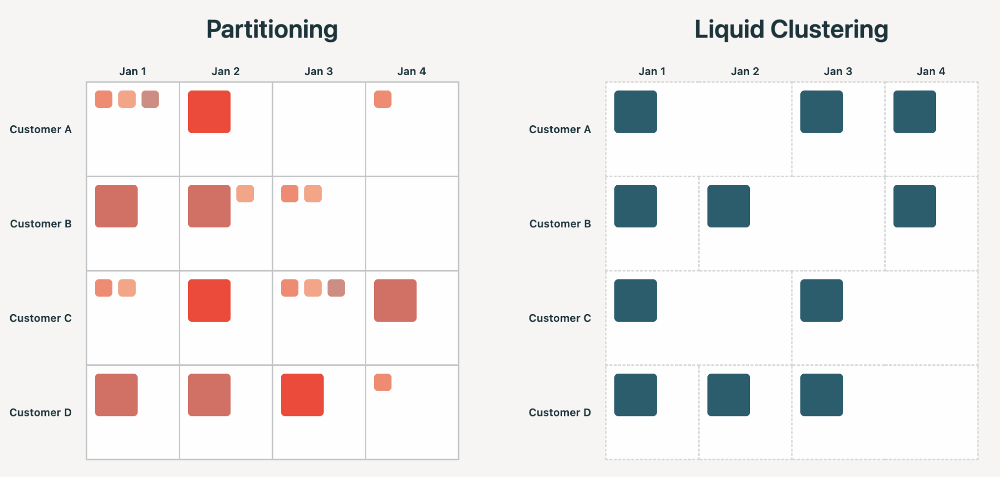

**Reale Benchmark-Zahlen aus dem Databricks-Engineering-Blog:**

- **Arctic Wolf** (3,8-PB-Tabelle): Query-Zeit von 51 s auf 6,6 s (7,7x), Dateianzahl von 4 Mio. auf 2 Mio. reduziert.
- **Interne 1,1-PB-Tabelle:** Wall-Clock-Zeit von 406 s auf 70 s (5,9x), gelesene Bytes von 3,5 TB auf 0,48 TB (−86 %).
- **Bolt** (TB-große CDC-Tabelle): +138 % Schreibdurchsatz, im Schnitt −21 % (bis zu −63 %) Lesezeit, Umstellung ohne Downtime während laufender Ingestion.
- **Co-Clustered Joins** (Private Preview): Query-Zeit von 28 min auf 14 min (−51 %), Shuffle-Volumen von 1,2 TiB auf 150 GiB (−87 %).
- **OPTIMIZE-Planungszeit** auf einer 10-PB-Tabelle: von 12 Stunden auf 23 Minuten reduziert; Ausführung auf Medium-Clustern 5x schneller.

### 9.2 Data Skipping und Statistiken

Delta Lake und verwaltete Apache-Iceberg-Tabellen sammeln beim Schreiben automatisch Datei-Statistiken (Minimum/Maximum-Werte, Null-Counts, Gesamtanzahl Datensätze), mit denen Databricks zur Query-Zeit irrelevante Dateien überspringen kann. Bei External Tables werden standardmäßig die ersten 32 Spalten indiziert; Managed Tables nutzen Predictive Optimization zur intelligenten Spaltenwahl ohne diese Begrenzung.

```sql
ALTER TABLE table_name SET TBLPROPERTIES('delta.dataSkippingStatsColumns' = 'col1, col2, col3');
```

```sql
-- Statistiken für Bestandsdaten manuell nachberechnen (DBR 14.3 LTS+)
ANALYZE TABLE table_name COMPUTE DELTA STATISTICS;
```

### 9.3 `OPTIMIZE` und `ZORDER`

```sql
OPTIMIZE table_name [FULL] [WHERE predicate] [ZORDER BY (col_name1 [, ...])]
```

- **`FULL`** (DBR 16.0+): schreibt alle Dateien der Tabelle neu — sinnvoll bei Liquid-Clustering-Tabellen oder beim Wechsel des Kompressions-Codecs.
- **`WHERE`**: optimiert nur die Teilmenge, die dem Partitions-/Clustering-Prädikat entspricht.
- **`ZORDER BY`**: kolokiert Spalteninformationen in denselben Dateien, damit Data-Skipping-Algorithmen weniger lesen müssen.

```sql
OPTIMIZE events;
OPTIMIZE events FULL;
OPTIMIZE events WHERE date >= '2017-01-01';
OPTIMIZE events WHERE date >= current_timestamp() - INTERVAL 1 day ZORDER BY (eventType);
```

**Wichtig:** Bin-Packing (Standard-Kompaktierung) ist idempotent — ein zweiter Lauf auf unveränderten Daten hat keinen Effekt. Z-Ordering ist **nicht** idempotent, arbeitet aber inkrementell. Z-Ordering gleicht Dateien nach **Tupel-Anzahl**, nicht nach Speichergröße aus — bei stark unterschiedlich breiten Datensätzen kann das selbst zu Skew in der Task-Dauer führen. Databricks empfiehlt für neue Tabellen Liquid Clustering statt Z-Ordering.

### 9.4 Praxisbeispiel Star Schema

Fünf Best Practices für Star Schemas auf Databricks: Delta Tables verwenden, Liquid Clustering zur Dateioptimierung anwenden, Faktentabellen clustern, Keys größerer Dimensionstabellen clustern, Predictive Optimization für aktuelle Statistiken nutzen. Für Dimensionstabellen, die zu groß zum Broadcasten sind, werden gezielt die Foreign Keys als Clustering-Keys gewählt; kleinere Dimensionen werden stattdessen direkt in den Join zur Faktentabelle gebroadcastet. Liquid Clustering wird hier explizit auch als Mittel „gegen zu kleine oder zu große Dateien (Skew und Balance)" beschrieben.

### Quellen

- https://docs.databricks.com/aws/en/tables/clustering
- https://docs.databricks.com/aws/en/tables/data-skipping
- https://docs.databricks.com/aws/en/sql/language-manual/delta-optimize
- https://www.databricks.com/blog/debunking-8-data-layout-myths-why-liquid-clustering-outperforms-partitioning
- https://www.databricks.com/blog/five-simple-steps-for-implementing-a-star-schema-in-databricks-with-delta-lake

---

## <a id="photon">10. Photon und Skew</a>

Photon ist eine von Databricks entwickelte, vektorisierte Query-Engine, die SQL-Workloads, DataFrame-API-Aufrufe, ETL-Pipelines und zustandslose Streaming-Workloads beschleunigt — durch spaltenweise (columnar) statt zeilenweise Verarbeitung. Photon ersetzt die JVM-basierte Spark-SQL-Ausführungs-Engine durch eine native C++-Runtime, behält aber den Spark-Query-Optimizer (Catalyst) für die Planung bei.

**Relevanz für Skew-behaftete Workloads:**

- Ersetzt Sort-Merge-Joins durch performantere Hash-Joins.
- Nutzt einen neu konzipierten spaltenbasierten Shuffle für höheren Durchsatz bei großangelegten Joins.
- Implementiert Filter-Pushdown und Row-Group-Skipping.
- Läuft nativ in C++, wodurch Garbage-Collection-Pausen und JIT-Verzögerungen entfallen.

Trifft Photon auf nicht unterstützte Operationen, fällt es für den Rest der Operation transparent auf die Spark-Runtime zurück. Der offizielle Doku-Text enthält **keine explizite Aussage zur direkten Skew-Behandlung** durch Photon — die Vorteile ergeben sich indirekt über schnellere Joins/Shuffles, nicht über eine eigene Skew-Erkennung.

**Kombination mit Low-Shuffle-MERGE (LSM):** Photon beschleunigt zusätzlich die in `MERGE`-Workloads typischen Flaschenhälse (Joins, Lesen, Schreiben) — kombiniert mit LSM ergeben sich bis zu **4x** Performance-Steigerungen. LSM selbst entfernt nur geänderte/gelöschte Zeilen aus der Originaldatei und schreibt neue/aktualisierte Zeilen in eine separate Datei, statt den gesamten Datensatz zu shuffeln — das bringt bis zu 5x Verbesserung bei MERGE-lastigen Workloads (typisch 2–3x). Ein zusätzlicher Vorteil: LSM erhält die bestehende ZORDER-Clusterung unveränderter Daten, sodass keine teure Neu-Clusterung nach dem MERGE nötig ist.

**Reale Benchmarks (LSM):** Healthcare-Kunde 10,6x schneller (Streaming-Verarbeitung von 1 Stunde auf 5 Minuten reduziert); Fintech-Kunde von 11 auf 1,5 Minuten (7x) bei dünn besetzten Updates; Finanzunternehmen 3,6x schneller bei 1,5 Mrd. Zeilen mit 27.000-Zeilen-Changeset.

### Quellen

- https://docs.databricks.com/aws/en/compute/photon
- https://www.databricks.com/blog/faster-merge-performance-low-shuffle-merge-and-photon

---

## <a id="cluster">11. Cluster-Konfiguration und Best Practices</a>

### Compute-Konfiguration

- **Standard Access Mode** für die meisten Workloads verwenden — erzwingt Nutzerisolation und Datenzugriffsberechtigungen bei vertretbaren Kosten.
- **Autoscaling aktivieren**, um Worker-Knoten während lang laufender Tasks dynamisch hinzuzufügen/zu entfernen.
- **Photon evaluieren**, besonders für SQL-Workloads und DataFrame-Operationen mit Joins, Aggregationen und Scans großer Tabellen.
- **Cluster-Größe:** ein größerer Cluster für einen linear skalierenden Workload ist nicht teurer als ein kleinerer — nur schneller. Ausschlaggebende Faktoren: Gesamtzahl der Executor-Cores (Parallelität), Gesamt-Executor-Memory (Datenkapazität), lokaler Executor-Speicher.
- **Workload-spezifisch konfigurieren:** komplexe ETL-Workloads profitieren von wenigen, größeren Workern (weniger Shuffle-Overhead); Datenanalyse eher von Single-Node-Compute mit großer VM und Disk Caching.

### Partitionierungs-Faustregeln

Tabellen unter 1 TB **nicht** partitionieren, und nur nach einer Spalte partitionieren, wenn pro Partition mindestens 1 GB Daten anfallen — das vermeidet Über-Partitionierung mit übermäßig vielen kleinen Dateien (siehe auch Abschnitt 9 zu Liquid Clustering als modernere Alternative).

### Performance-Monitoring

Mehrschichtiges Monitoring wird empfohlen:

- **System-Tabellen:** `system.compute`, `system.workflow`, `system.query` abfragen, um teure Queries, unterausgelastete Cluster und Kostensenkungspotenziale zu identifizieren.
- **Query-Profile:** visualisieren Task-Ausführung, Timing, Zeilenanzahl und Speichernutzung — für Serverless/SQL-Warehouses das Pendant zum Spark UI; hilft, Skew und Partitionsungleichgewicht zu analysieren.
- **Spark-Event-Logs:** identifizieren lange Stages, Skew, Shuffles und Speicherdruck (siehe Abschnitt 3).
- **Alerting:** Echtzeit-Alarme bei Fehlschlägen, Anomalieerkennung über SQL-Alerts für Job-Dauer-Anomalien oder wiederholte Fehlschläge, SLA-basierte Schwellenwerte für kritische Workloads.
- Drittanbieter-Integration (Datadog, Prometheus, AWS CloudWatch) zur Zentralisierung und Korrelation mit Infrastrukturmetriken.

### Performance-Tests

Mit produktionsrepräsentativen Daten testen — inklusive Volumen, Datei-Layout und **Skew-Charakteristik**. Cluster vor dem Benchmark über Pools/Caches vorwärmen; sowohl den ersten als auch nachfolgende Läufe (mit/ohne Vorwärmen) testen, um Engpässe vor dem Produktivgang zu identifizieren.

### Quellen

- https://docs.databricks.com/aws/en/compute/cluster-config-best-practices
- https://docs.databricks.com/aws/en/optimizations
- https://docs.databricks.com/aws/en/lakehouse-architecture/performance-efficiency/best-practices
- https://docs.databricks.com/aws/en/lakehouse-architecture/deployment-guide/observability

---

## <a id="query-watchdog">12. Query Watchdog: Schutz vor explodierenden Queries</a>

Ein extremer Sonderfall von Skew/explodierenden Joins: **Query Watchdog** prüft, ob eine Query auf Task-Ebene im Verhältnis zu den Eingabezeilen zu viele Ausgabezeilen erzeugt, und verhindert so, dass durchlaufende Queries Cluster-Ressourcen unbegrenzt belegen.

**Beispielszenario aus dem Databricks-Blog:** Zwei Tabellen mit je einer Million Zeilen werden über eine Spalte gejoint, die nur leere Strings enthält — das Ergebnis sind **eine Billion Zeilen**, konzentriert auf einem einzigen Executor: praktisch ein kartesisches Produkt. Solche Queries scheinen zu laufen, werden aber nie fertig und frustrieren nicht nur den Verursacher, sondern auch andere Nutzer desselben Clusters.

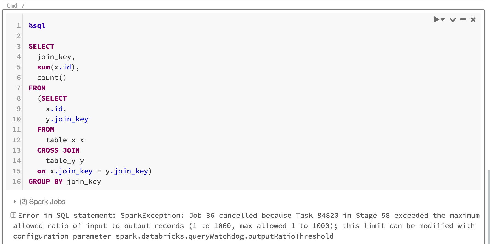

### Konfiguration

Zwei Kerneinstellungen:

1. **Feature aktivieren.**
2. **Output-Ratio setzen** — maximal erlaubte Zeilenvervielfachung pro Task (Standard: **1000x**).

Der Schwellenwert ist frei konfigurierbar; Empfehlung: niedrig anfangen und den für das eigene Team passenden Wert ermitteln — ein Bereich von 1.000 bis 10.000 ist ein guter Startpunkt. Zwei weitere optionale Parameter steuern die minimale Task-Laufzeit vor einem Abbruch sowie die minimale Ausgabezeilenanzahl, ab der überhaupt abgebrochen wird.

**Empfohlen für:** interaktive Analyse-Cluster, auf denen mehrere SQL-Analysten Ressourcen teilen und Queries in Echtzeit anpassen können.
**Nicht empfohlen für:** Produktions-ETL-Workloads ohne menschliche Aufsicht, die auf Fehler reagieren könnte.

### Quelle

- https://www.databricks.com/blog/2017/04/17/query-watchdog-handling-disruptive-queries-spark-sql.html

---

## <a id="streaming">13. Skew in Structured Streaming</a>

Data Skew ist auch bei Streaming-Workloads eine häufige Latenzursache: **„Data Skew — wenn einige wenige Tasks deutlich mehr Daten erhalten als der Rest. Bei geskewten Daten brauchen diese Tasks länger als die anderen, oft mit Spill auf Festplatte."** Da die Performance eines Streams durch den langsamsten Task begrenzt wird, verlangsamt eine ungleiche Datenverteilung die gesamte Pipeline — bestimmte Executor müssen unverhältnismäßig viele Daten verarbeiten, was zu Spill und langsamerer Gesamtausführung führt.

**Empfehlung:** die Anzahl der Input-Partitionen erhöhen und/oder die Last pro Core über Batch-Size-Einstellungen senken, um die Latenz zu reduzieren.

**Allgemeine Effizienz-Empfehlungen für Streaming-Produktions-Workloads:**

- übermäßige Shuffle-Operationen vermeiden,
- komplexe Joins vermeiden,
- zu großzügig bemessene Watermark-Schwellen vermeiden,
- Cluster zunächst eher großzügig dimensionieren und anschließend anhand der tatsächlichen Auslastung verkleinern.

Siehe auch Abschnitt 4.7 zu AQE in Structured Streaming (`foreachBatch`), das ebenfalls zur Skew-Minderung in Streaming-Pipelines beiträgt.

### Quelle

- https://databricks.com/blog/2023/01/10/streaming-production-collected-best-practices-part-2.html

---

## <a id="praxisbeispiele">14. Praxisbeispiele im Überblick</a>

| Anwendungsfall | Skew-relevantes Muster | Quelle/Abschnitt |
|---|---|---|
| Star-Schema-Joins | große Dimensionen clustern statt broadcasten, kleine Dimensionen broadcasten | Abschnitt 9.4 |
| Räumliche (Spatial) Joins | R-Tree-Indizierung + Range-Join-Optimierung gegen stark ungleich verteilte Geodaten | Abschnitt 7 |
| Delta `MERGE` | Low-Shuffle-MERGE + Photon vermeiden unnötigen Shuffle bei Änderungsoperationen | Abschnitt 10 |
| Lakeflow-Pipelines-Aggregationen | zweistufiges Salting geskewter Join-/`groupBy`-Keys | Abschnitt 8.4 |
| Interaktive Analyse-Cluster | Query Watchdog als Schutz vor explodierenden Joins | Abschnitt 12 |
| Streaming-Pipelines | mehr Input-Partitionen, kleinere Batch-Size, `foreachBatch` + AQE | Abschnitt 13 |

---

## <a id="zusammenfassung">15. Zusammenfassung</a>

- **Data Skew** entsteht, wenn eine Spark-Partition deutlich mehr Datensätze enthält als andere — meist nach Aggregationen/Joins über ungleichmäßig verteilte Schlüsselwerte. Eine Stage dauert immer so lange wie ihr längster Task; starker Skew führt zu Spill oder OOM.
- **Erkennung:** Spark UI von der Jobs-Timeline über die längste Stage bis zu den Summary-Metrics durcharbeiten — Faustregel: Max-Dauer > 150 % der 75.-Perzentil-Dauer deutet auf Skew hin.
- **Automatische Behandlung:** Adaptive Query Execution (AQE) ist seit Spark 3.2 standardmäßig aktiviert und behandelt Skew automatisch durch Aufteilen und Replizieren geskewter Partitionen — in den meisten Fällen ist keine manuelle Intervention mehr nötig.
- **Manuelle Eingriffe**, falls AQE nicht ausreicht, in aufsteigender Aufwandsreihenfolge: Skew-Werte filtern → (historisch) Skew-Hints → Salting der Join-Keys.
- **Vorbeugend:** ein gutes physisches Datenlayout (Liquid Clustering statt Partitionierung/Z-Ordering, angemessene Dateigrößen, aktuelle Statistiken) reduziert die Wahrscheinlichkeit und Schwere von Skew von vornherein erheblich.
- **Photon** und **Low-Shuffle-MERGE** reduzieren zusätzlich die Kosten von Shuffles und Joins, ohne Skew selbst zu erkennen.
- **Query Watchdog** schützt interaktive Cluster vor dem Extremfall explodierender, kartesischer Joins.
