# Spill in Spark und Databricks

Umfassende Referenz zu Spill: was es ist, wie man es erkennt, was es typischerweise verursacht, und wie man es vermeidet — von der JVM-Speicherarchitektur über Adaptive Query Execution bis zu Query Profile und Photon. Ergänzt [Data Skew.md](Data%20Skew.md) und [Shuffles.md](Shuffles.md), mit denen sich Grundlagen zur Spark-UI-Diagnose überschneiden.

## Abschnittsübersicht

1. [Was ist Spill?](#was-ist-spill)
2. [Typische Ursachen von Spill](#ursachen)
3. [Spill erkennen: Spark UI, Query Profile, Performance Insights](#erkennen)
4. [Spark-Speicherarchitektur: Storage- vs. Execution-Memory](#speicherarchitektur)
5. [Project Tungsten: explizites Memory-Management](#tungsten)
6. [Garbage-Collection-Tuning](#gc-tuning)
7. [AQE und Spill-Vermeidung](#aqe)
8. [Shuffle-Partitionen richtig dimensionieren](#shuffle-partitionen)
9. [Photon und Spill](#photon)
10. [PySpark-Memory-Profiling](#memory-profiling)
11. [Instance-Storage-Autoscaling](#instance-storage)
12. [Disk Cache und lokaler Storage](#disk-cache)
13. [Spill in Structured Streaming](#streaming)
14. [Cluster- und Warehouse-Sizing](#cluster-sizing)
15. [Spill-Mitigation im Überblick](#mitigation)
16. [Praxisbeispiele](#praxisbeispiele)
17. [Zusammenfassung](#zusammenfassung)

---

## <a id="was-ist-spill">1. Was ist Spill?</a>

Spill beschreibt, was passiert, wenn so viel Daten anfallen, dass sie nicht vollständig in den RAM passen. Ein Teil muss auf die Festplatte ausgelagert werden. Werden diese Daten später wieder benötigt, müssen sie von der Festplatte zurück in den RAM geholt werden. Diese Situation tritt auf, wenn das Datenvolumen den verfügbaren, dem Cluster zugewiesenen RAM übersteigt. Das System muss dann auf Disk-Lese-/Schreibvorgänge zurückgreifen, um RAM freizugeben und die Berechnung fortzusetzen. Diese Vorgänge sind deutlich langsamer. Geht dem System trotzdem der Speicher vollständig aus, führt das zu einem Out-of-Memory-Fehler, der den gesamten Job zum Scheitern bringt.

- Spill bezeichnet das Verschieben von Daten von RAM auf Disk und später zurück in den RAM.
- Es tritt auf, wenn eine gegebene Partition schlicht zu groß ist, um in den RAM zu passen.
- Spark wird dadurch zu [potenziell] teuren Disk-Lese-/Schreibvorgängen gezwungen, um lokalen RAM freizugeben.
- All das nur, um den gefürchteten OOM-Fehler zu vermeiden.

Spill ist das, was passiert, wenn Spark wenig Ausführungsspeicher hat. Dieser Speicher wird für Operationen wie Shuffles, Joins, Sortierungen und Aggregationen benötigt. Wird der Speicher knapp, beginnt Spark, Daten vom Memory auf die Disk zu verschieben. Das kann teuer sein. Spill tritt am häufigsten während des Daten-Shufflings auf.

---

## <a id="ursachen">2. Typische Ursachen von Spill</a>

Häufige Situationen, die einen Spill auslösen können:

| Ursache | Code/Parameter | Erklärung |
|---|---|---|
| Zu hoch gesetzte maximale Partitionsgröße | `spark.sql.files.maxPartitionBytes` (Standard: 128 MB) | Führt zu übergroßen Partitionen, die nicht in den RAM passen und auf Disk geschrieben werden müssen |
| Explodieren selbst kleiner Arrays | `explode()` | Kann schnell mehr Daten erzeugen, als der verfügbare RAM bewältigen kann |
| Joins mit vielen neuen Zeilen | `join()` / `crossJoin()` | Besonders Cross-Joins zwischen Tabellen können eine riesige Anzahl neuer Zeilen erzeugen, die den Speicherlimit übersteigen |
| Joins auf geskewten Keys | `join()` / `crossJoin()` nach skew-Spalte | Führt dazu, dass bestimmte Partitionen deutlich größer werden als andere (siehe [Data Skew.md](Data%20Skew.md)) |
| Group-by auf niedrigkardinalen Spalten | `groupBy()` | Wenige, große Gruppen können pro Partition mehr Daten konzentrieren, als RAM verfügbar ist |
| Zählen eindeutiger Werte / Set-Aggregation | `countDistinct()`, `size(collect_set())` | Baut intern große Zwischenstrukturen auf |
| Zu niedrig gesetzte Shuffle-Partitionen oder falsche Nutzung von Repartition | `spark.sql.shuffle.partitions` zu niedrig, falscher `repartition()`-Einsatz | Führt zu größeren Partitionen pro Task als nötig |

Zusammengefasst: Alles, was die Datenmenge über das hinaus erhöht, was der RAM des Clusters bewältigen kann, kann zu einem Spill führen — mit der Folge langsamerer, diskbasierter Berechnung.

Die Ursache lässt sich präziser fassen: Der Standardwert für die Anzahl der Spark-SQL-Shuffle-Partitionen (die Anzahl der CPU-Kerne, die breite Transformationen wie Joins und Aggregationen ausführen) beträgt 200 — das ist nicht immer optimal. Dadurch erhält jeder Spark-Task (bzw. CPU-Kern) eine große Datenmenge zur Verarbeitung; reicht der verfügbare Speicher pro Kern nicht aus, um diese Daten zu fassen, wird ein Teil davon auf Disk gespillt.

**Kaskadeneffekt:**

```
Große Input-Partitionen → große Datenmenge pro Task
       ↓
Zu wenige Shuffle-Partitionen → große geshuffelte Datenmenge pro Task
       ↓
Unzureichender Speicher → Spill auf Disk
```

Bei Operationen wie `explode()`, die Daten stark vergrößern, empfiehlt sich, die Größe der Input-Partitionen zu reduzieren (`spark.sql.files.maxPartitionBytes`, Standard 128 MB), um dem Effekt von `explode()` entgegenzuwirken.

**Weitere Parameter für das Input-Partitioning beim Dateilesen** (nur wirksam bei dateibasierten Quellen wie Parquet, JSON, ORC):

| Parameter | Standard | Bedeutung |
|---|---|---|
| `spark.sql.files.maxPartitionBytes` | `128 MB` | maximale Bytes pro Partition beim Einlesen von Dateien |
| `spark.sql.files.openCostInBytes` | `4 MB` | geschätzte Kosten zum Öffnen einer Datei, gemessen in Bytes, die in derselben Zeit gescannt werden könnten — genutzt, um mehrere kleine Dateien in eine Partition zu packen; bewusst eher überschätzt, damit Partitionen mit vielen kleinen Dateien nicht langsamer laufen als Partitionen mit wenigen großen |
| `spark.sql.files.minPartitionNum` | `spark.sql.leafNodeDefaultParallelism` (falls nicht gesetzt) | empfohlene (nicht garantierte) Mindestanzahl an Datei-Split-Partitionen |
| `spark.sql.files.maxPartitionNum` | kein Limit | empfohlene (nicht garantierte) Höchstanzahl an Datei-Split-Partitionen — überschreitet die initiale Partitionsanzahl diesen Wert, skaliert Spark jede Partition neu, um sich diesem Wert anzunähern |

**Paralleles Auflisten von Input-Pfaden:** Bei vielen Input-Pfaden nutzt Spark verteiltes Listing statt sequenziellem — steuerbar über `spark.sql.sources.parallelPartitionDiscovery.threshold` (Standard: `32` Pfade, ab der parallel gelistet wird) und `spark.sql.sources.parallelPartitionDiscovery.parallelism` (Standard: `10000`, deckelt die maximale Listing-Parallelität).

**Wichtig:** Auch nach dem Feintuning der Shuffle-Partitionsanzahl können weiterhin viele Spills auftreten, die tatsächlich auf Data Skew zurückzuführen sind, nicht auf schlecht dimensionierte Partitionen (siehe [Data Skew.md](Data%20Skew.md) für Skew-Mitigation).

---

## <a id="erkennen">3. Spill erkennen: Spark UI, Query Profile, Performance Insights</a>

### 3.1 Spill im Spark UI (Classic Compute)

Spill wird **nur** auf der Detailseite einer einzelnen Stage dargestellt — in den Summary Metrics, den Aggregated Metrics by Executor und der Tasks-Tabelle — oder in den zugehörigen Query-Details. Das macht Spill schwer erkennbar, da man aktiv danach suchen muss: **Ist kein Spill vorhanden, erscheinen die entsprechenden Spalten im Spark UI gar nicht erst** — sind sie also sichtbar, gibt es irgendwo Spill.

Sehen Sie keine Statistiken für Spill, hat die Stage keinen Spill. Die Spill-Spalten werden also nur angezeigt, wenn tatsächlich gespillt wurde. Spill-Statistiken erscheinen oben auf der Stage-Detailseite, gemeinsam mit weiteren Metriken wie **Peak Execution Memory**.


**Die zwei Spill-Werte:**

Im Spark UI wird Spill durch zwei Werte repräsentiert, die immer gemeinsam angezeigt werden:

- **Spill (Memory):** die Größe der gespillten Partitionsdaten, wie sie im Arbeitsspeicher vorlagen.
- **Spill (Disk):** die Größe derselben Daten, wie sie auf der Festplatte vorliegen.

Der Disk-Wert ist stets kleiner als der Memory-Wert — bedingt durch die natürliche Kompression, die beim Serialisieren der Daten vor dem Schreiben auf Disk entsteht.

### 3.2 Diagnoseweg: Long-Running Stages

Systematischer Ablauf:

1. **Längste Stage identifizieren** — Stages am Ende der Job-Seite nach Dauer sortieren.
2. **I/O-Metriken notieren** — Input, Output, Shuffle Read, Shuffle Write.
3. **Task-Anzahl prüfen** — ein einzelner Task kann ein Problem signalisieren.
4. **Stage-Beschreibungslink öffnen**, um zu Skew- und Spill-Analyse zu gelangen.


### 3.3 Slow Stage mit niedrigem I/O

Ist eine Stage langsam, aber die I/O-Werte niedrig, liegt der Flaschenhals wahrscheinlich in der Berechnung selbst — mögliche Ursachen:

- **Small-File-Problem** — Lesen/Schreiben zehntausender oder mehr Dateien unter 8 MB. Abhilfe: `OPTIMIZE`, Predictive Optimization, Datei-Layout überdenken.
- **Langsame UDFs** — hoher CPU-Verbrauch. UDFs testweise auskommentieren, dann durch native Spark-Funktionen ersetzen; bei Speicherengpässen vor der UDF-Anwendung repartitionieren, um die Last zu verteilen.
- **Kartesische Joins** — teure Operationen, wo möglich vermeiden.
- **Datenexplosion** — `explode()` oder explodierende Joins erzeugen um Größenordnungen mehr Output-Zeilen als Input-Zeilen, was die Verarbeitungszeit drastisch erhöht.

Der SQL-DAG (über die zugehörige SQL-Query) ist das primäre Diagnosewerkzeug — er zeigt, wo Zeit an welchem Knoten anfällt.

### 3.4 Spill in der Query Profile (Databricks SQL)

Bei SQL-Warehouses tritt Spill auf, wenn ein SQL-Warehouse den verfügbaren Speicher erschöpft und temporäre Ergebnisse auf Disk schreibt. Das ist deutlich langsamer als In-Memory-Verarbeitung.

**Erkennung:** In der Query Profile auf Werte bei „spill (bytes)" oder „spill time" achten — diese Metriken zeigen direkt an, dass ein Disk-Overflow stattfindet. Ergänzend lassen sich Helper-Queries auf System-Tabellen in SQL-Alerts oder Dashboards zur automatisierten Spill-Erkennung umwandeln.

**Praxisbeispiel — schlechtes vs. optimiertes Query-Profil:**

| Vor Optimierung: niedriges Pruning, hoher Shuffle, Spill auf Disk | Nach Optimierung: reduzierter Spill und Shuffle |
|---|---|
| 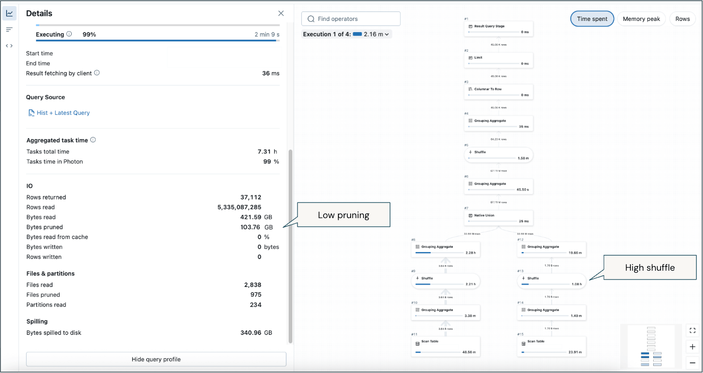 | 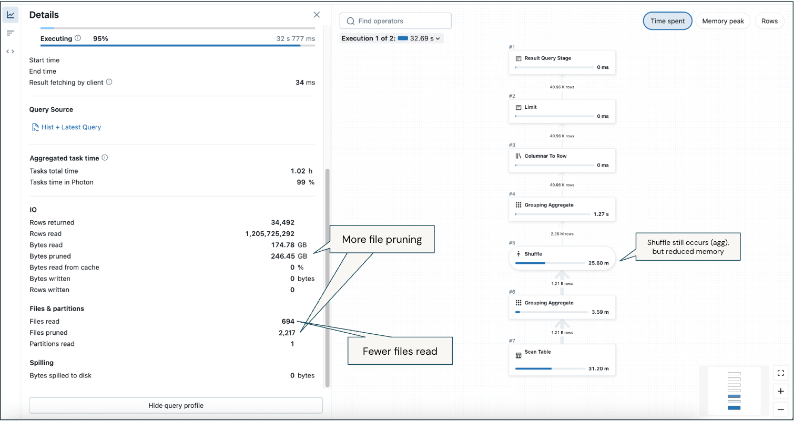 |

**Mitigation:**

- Als primäre Maßnahme: SQL-Warehouse-T-Shirt-Größe erhöhen, um mehr Speicher bereitzustellen (z. B. Small → Medium, Medium → Large).
- Sekundär: Queries durch frühzeitiges Filtern optimieren, Data Skew reduzieren, Joins vereinfachen, Datei-Layout über Liquid Clustering oder passend dimensionierte Dateien verbessern, um gescannte und geshuffelte Datenmengen zu begrenzen.

### 3.5 Performance Insights (Databricks SQL)

Databricks SQL bietet eine dedizierte Insight-Kategorie **`DATA_SPILL`** unter „Compute and resource insights":

Daten wurden während der Query-Ausführung auf Disk gespillt, weil sie nicht in den Speicher passten.

**Empfohlene Maßnahmen:** Warehouse-Größe erhöhen, um mehr Speicher bereitzustellen, oder die Menge verarbeiteter Daten reduzieren (Zeilen, Spalten oder die Größe großer Spalten wie Strings, Arrays, Maps, Structs).

Performance Insights erscheinen sowohl in der Query-History-Ansicht als auch in der Query Profile (Tab „Performance insights"), Insights werden nach ihrem geschätzten Effekt auf die Gesamt-Task-Dauer priorisiert. Bei erkannten, umsetzbaren Insights lässt sich über den Button „Optimize" Genie Code aufrufen, der entweder die Query umschreibt oder Empfehlungen in Klartext liefert.

### 3.6 Query Profile allgemein

Die Query Profile visualisiert Ausführungsdetails zur Fehlersuche und zeigt Operator-Metriken (Ausführungszeit, verarbeitete Zeilen, Speicherverbrauch) — darunter **„Memory peak"** als eine der verfügbaren Metriken in der DAG-Visualisierung. Operatoren wie Scan, Join, Union, Shuffle, Hash/Sort und Filter erscheinen im DAG-Graph; die Detailansicht zeigt Summary-Metriken links und die Operator-Graphenansicht rechts.

---

## <a id="speicherarchitektur">4. Spark-Speicherarchitektur: Storage- vs. Execution-Memory</a>

Der JVM-Heap wird in zwei Bereiche geteilt:

- **Storage Memory:** cacht Daten (RDDs/DataFrames), die später wiederverwendet werden sollen.
- **Execution Memory:** wird für Berechnungen in Shuffles, Sortierungen, Joins und Aggregationen genutzt — der Speicher, der bei Erschöpfung zu Spill führt.

Diese Aufteilung erzeugt drei Arbitrierungs-Herausforderungen:

1. Wie wird Speicher zwischen Execution und Storage arbitriert?
2. Wie wird Speicher über gleichzeitig laufende Tasks hinweg arbitriert?
3. Wie wird Speicher über Operatoren innerhalb desselben Tasks arbitriert?

Statt Speicher im Voraus statisch zu reservieren, wird Speicherkonkurrenz dynamisch gehandhabt, indem Teilnehmer bei Bedarf zum Spillen gezwungen werden — Spill ist also ein eingebauter Mechanismus des Unified-Memory-Management-Modells, nicht nur ein Fehlerfall.

**Verhältnis Speicherverbrauch ↔ GC-Effizienz:** Je weniger Speicherplatz RDDs beanspruchen, desto mehr Heap-Speicher bleibt für die Programmausführung, was die GC-Effizienz erhöht; umgekehrt führt übermäßiger RDD-Speicherverbrauch durch viele gepufferte Objekte in der Old Generation zu erheblichen Performance-Einbußen.

---

## <a id="tungsten">5. Project Tungsten: explizites Memory-Management</a>

Project Tungsten ist das Dachprojekt für Änderungen an Sparks Ausführungs-Engine mit dem Ziel, die Speicher- und CPU-Effizienz substanziell zu verbessern und Performance näher an die Grenzen moderner Hardware zu bringen. Motiviert ist das durch die Beobachtung, dass Spark-Workloads zunehmend durch CPU- und Speichernutzung statt durch I/O und Netzwerkkommunikation limitiert sind.

### 5.1 Das Problem mit dem JVM-Objektmodell

Ein einfacher 4-Byte-String „abcd" benötigt im JVM-Objektmodell über 48 Byte insgesamt — bedingt durch UTF-16-Encoding (8 Byte pro Zeichen), einen 12-Byte-Header und einen 8-Byte-Hashcode. Dieser Overhead wird bei großem Datenvolumen zum Problem.

### 5.2 Explizites Memory-Management statt Garbage Collection

Statt sich auf Garbage Collection zu verlassen, führt Tungsten explizites Memory-Management über `sun.misc.Unsafe` ein, um die meisten Spark-Operationen direkt auf Binärdaten statt auf Java-Objekten arbeiten zu lassen. Der Speicherzugriff ist dabei C-artig, über JIT-kompilierte intrinsische Methoden, die zu einzelnen Maschineninstruktionen kompilieren.

**Benchmark:** Die neue Hash-Tabelle für Aggregationsoperationen erreichte über 1 Million Aggregationsoperationen pro Sekunde in einem einzelnen Thread — etwa das 2-Fache des Durchsatzes von `java.util.HashMap`. Entscheidend: Sie zeigt nahezu keine Performance-Degradation bei steigender Speichernutzung, während die JVM-Standardimplementierung letztlich durch GC ins Trashing gerät.

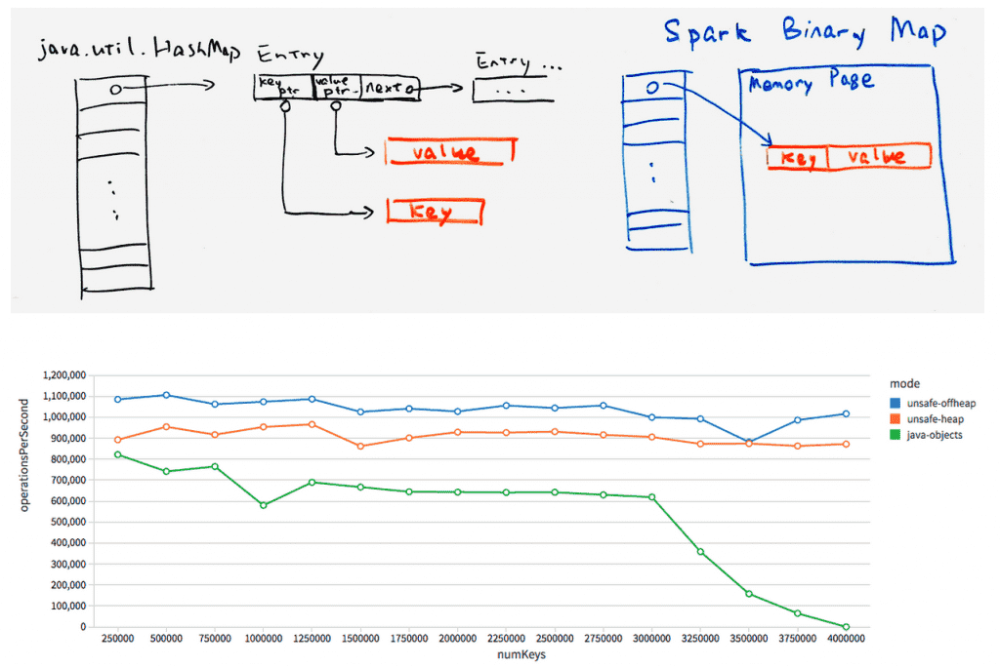

### 5.3 Cache-bewusste Berechnung

Traditionelles zeigerbasiertes Sortieren hat schlechte Cache-Trefferraten, da Vergleiche zufällig lokalisierte Datensätze dereferenzieren. Die Lösung: Sortierschlüssel werden zusammen mit Zeigern gespeichert (z. B. 64-Bit-Zeiger + 64-Bit-Schlüssel = 128-Bit-Paare), was linearen Zugriff ermöglicht — dieser cache-bewusste Sort erreichte eine 3-fache Beschleunigung gegenüber der Vorgängerversion.

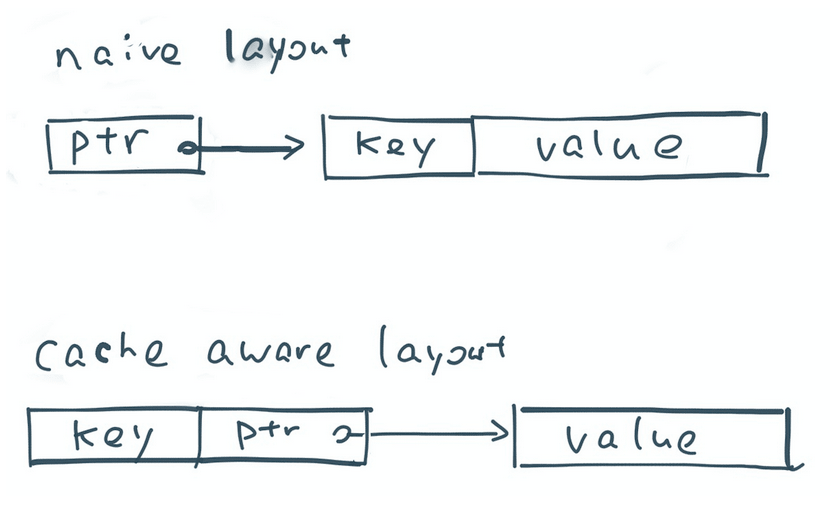

### 5.4 Weitere Tungsten-Bausteine

- **CPU-Register-Optimierung** (Tungsten Phase 2): platziert Zwischendaten in CPU-Registern — Größenordnungen weniger Zyklen als der Zugriff über Speicher.
- **Code-Generierung:** ermöglicht modernen Compilern und CPUs effizienten Betrieb.

---

## <a id="gc-tuning">6. Garbage-Collection-Tuning</a>

Spark-Anwendungen nutzen häufig 100 GB oder mehr Heap-Speicher — ungewöhnlich für traditionelle Java-Anwendungen — und erfordern daher spezialisierte GC-Tuning-Strategien.

### 6.1 Traditionelles generationelles Heap-Layout

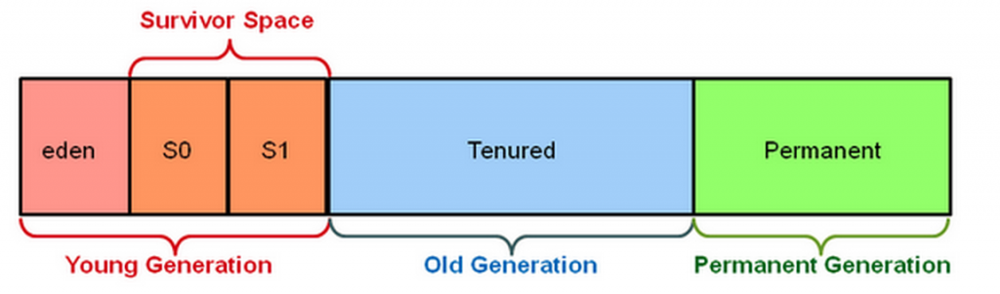

### 6.2 Garbage-Collector-Vergleich

| Collector | Eigenschaft | Nachteil bei Spark |
|---|---|---|
| **Parallel GC** | zielt auf Durchsatz | Whole-Heap-Compaction führt zu erheblichen Pausenzeiten; häufige Full-GC-Events beeinträchtigten die Performance in Tests |
| **CMS GC** | zielt auf niedrige Latenz | keine Compaction; noch längere Full-GC-Pausenzeiten als Parallel GC in Tests |
| **G1 GC** | zielt auf hohen Durchsatz **und** niedrige Latenz | partitioniert den Heap in gleich große Regionen statt fixer Young-/Old-Generationen — erwies sich als überlegen für Sparks variable Speichermuster |

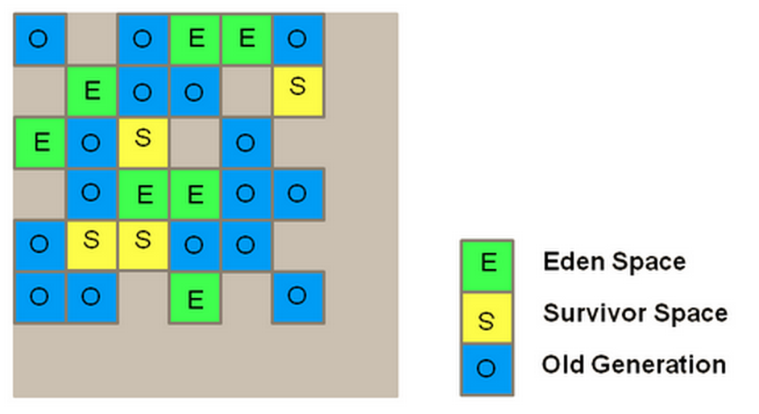

### 6.3 G1-GC-Tuning-Empfehlungen

**Ausgangspunkt:** Ein guter Startpunkt beim G1-Collector ist, *kein* Tuning vorzunehmen — aktivierbar über `-XX:+UseG1GC`.

**Logging-Flags für detaillierte GC-Analyse:**

```
-XX:+PrintFlagsFinal -XX:+PrintReferenceGC -verbose:gc
-XX:+PrintGCDetails -XX:+PrintGCTimeStamps
-XX:+PrintAdaptiveSizePolicy -XX:+UnlockDiagnosticVMOptions
-XX:+G1SummarizeConcMark
```

**Full-GC (Evacuation Failure) vermeiden:**

- `InitiatingHeapOccupancyPercent` vom Standard 45 auf einen niedrigeren Wert (z. B. 35) senken, damit G1 das initiale Concurrent Marking früher startet.
- `ConcGCThreads` erhöhen (z. B. auf 20), um mehr Threads für das Concurrent Marking bereitzustellen und diese Phase zu beschleunigen.

**Humongous Objects adressieren:** Objekte, die über 50 % der Regionsgröße hinausgehen, erzeugen Overhead. `G1HeapRegionSize` erhöhen, falls möglich (Standard-Maximum: 32 MB) — erfordert Analyse des Programms, um solche Objekte zu identifizieren und ihre Erzeugung zu minimieren.

**Stop-the-World-Pausenzeiten reduzieren:**

- `G1RSetUpdatingPauseTimePercent` senken (Standard 10 %).
- `G1ConcRefinementThreads` erhöhen, um Remembered-Set-Updates von der STW- in die Concurrent-Phase zu verschieben.

**Lang laufende Anwendungen:** `-XX:AlwaysPreTouch` nutzt bereits beim Start den gesamten benötigten Speicher beim Betriebssystem an und vermeidet dynamische Nachforderungen.

### 6.4 Ergebnis nach Tuning

- 1,7x Performance-Verbesserung gegenüber ungetuntem G1.
- 1,5x Verbesserung gegenüber Parallel GC.
- Reduktion von 6,5 Minuten (Parallel GC) auf 4,3 Minuten.

### 6.5 Strategische Empfehlungen

1. RDD-Caching auditieren — sicherstellen, dass gecachte RDDs nach Gebrauch freigegeben werden (siehe Fallbeispiel unten).
2. Konservativ starten — G1 mit Standardwerten einsetzen, bevor Parameter angepasst werden.
3. Logs methodisch analysieren — Evacuation Failures und Humongous-Object-Allokationsmuster identifizieren.
4. Nebenläufigkeit balancieren — mehr Concurrent-Threads tauschen Worker-Ressourcen gegen reduzierte STW-Zeit.

### 6.6 Fallbeispiel: unnötiges RDD-Caching

Ein Bagel-Komponenten-Fallbeispiel zeigte, dass RDDs jedes Supersteps im Speicher gecacht wurden, ohne sie über die Zeit freizugeben — obwohl sie nach einer einzelnen Iteration nicht mehr benötigt wurden. Nach Entfernen des unnötigen Cachings stabilisiert sich die RDD-Größe nach drei Iterationen, und der Cache-Speicher wird effektiv kontrolliert. Das ergab eine Gesamtlaufzeit-Verbesserung von 10–20 %.

---

## <a id="aqe">7. AQE und Spill-Vermeidung</a>

AQE reduziert Spill-Risiko über mehrere Mechanismen (Details zur Gesamtmechanik siehe [Data Skew.md](Data%20Skew.md) und [Shuffles.md](Shuffles.md)):

### 7.1 Partition-Coalescing

Sind zu wenige Partitionen vorhanden, kann die Datengröße jeder Partition sehr groß werden. Die Tasks zur Verarbeitung dieser großen Partitionen müssen dann möglicherweise Daten auf Disk spillen. AQE begegnet dem, indem zu Beginn eine relativ hohe Anzahl an Shuffle-Partitionen gesetzt und benachbarte kleine Partitionen zur Laufzeit anhand der Shuffle-Datei-Statistiken zu größeren zusammengefasst werden.

| Ohne Coalescing (mehr kleine Partitionen, Risiko oversized Restpartitionen) | Mit Coalescing (angemessen große, gleichmäßige Partitionen) |
|---|---|
| 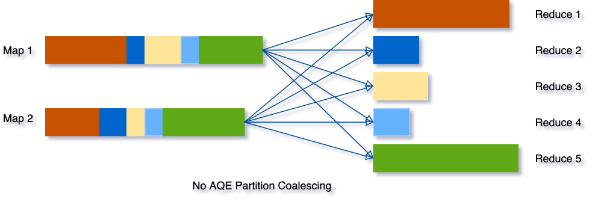 | 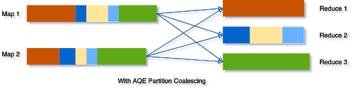 |

### 7.2 Skew-Join-Handling

AQEs Skew-Optimierung verhindert übergroße Partitionen, indem ungleichmäßige Datenverteilung erkannt und problematische Partitionen in kleinere Sub-Partitionen aufgeteilt werden, um die Arbeitslast über Tasks hinweg auszubalancieren — dies verhindert genau die Art übergroßer, geskewter Partition, die sonst zum Spillen gezwungen wäre (siehe [Data Skew.md](Data%20Skew.md), Abschnitt 4).

### 7.3 Konfiguration (Zusammenfassung)

```
spark.sql.adaptive.enabled = true
spark.sql.adaptive.coalescePartitions.enabled = true
spark.sql.adaptive.skewJoin.enabled = true
spark.sql.adaptive.autoBroadcastJoinThreshold = 30MB   -- Standard
```

**Auto-Optimized Shuffle (AOS):** `autoOptimizeShuffle` ist eine AQE-Funktion, die automatisch die passende Anzahl an Shuffle-Partitionen findet.

**Einschränkung bei stark komprimierten Tabellen:** AOS kann die korrekte Shuffle-Partitionsanzahl in Fällen mit ungewöhnlich hoher Kompressionsrate (20x bis 40x) unter Umständen nicht richtig schätzen. Workaround: den Pre-Shuffle-Partitionsgrößen-Schwellenwert reduzieren:

```
spark.sql.adaptive.preshufflePartitionSizeInBytes = 16MB   -- statt Standard 128MB
```

Bleibt Spill weiterhin bestehen, diesen Wert weiter auf z. B. 8 MB reduzieren.

---

## <a id="shuffle-partitionen">8. Shuffle-Partitionen richtig dimensionieren</a>

### 8.1 Manuelles Tuning

**Formel:**

```
Anzahl Partitionen = Gesamte geshuffelte Datenmenge / 128 MB   (optimale Verarbeitungsgröße pro Task)
```

**Vorgehen:**

1. Die betroffene Query einmal ausführen.
2. Im Spark UI den Exchange-Knoten im SQL-DAG prüfen → Metrik „data size total".
3. Die Summary-Metriken der Shuffle-Stage notieren.
4. Partitionsanzahl mit obiger Formel berechnen.
5. Konfiguration anwenden:

```
spark.sql.shuffle.partitions = [berechneter_wert]
```

**Alternative Faustregel:** Wird weder Auto-Tuning (AOS) noch manuelles Feintuning genutzt, als Faustregel das Zwei- bis besser Dreifache der Gesamtanzahl an Worker-CPU-Kernen setzen.

**Zielbereich:** Nach dem Tuning der Shuffle-Partitionsanzahl sollte jeder Task etwa **128 MB bis 200 MB** an Daten verarbeiten — das definiert die Balance zwischen Parallelität und Speichereffizienz.

### 8.2 Spill-Erkennung über Task-Metriken

- **Exchange-Knoten im SQL-DAG beobachten:** Spill äußert sich als hoher Speicherdruck und Disk-I/O-Muster.
- **Shuffle-Read-Größen über Tasks vergleichen:** signifikante Varianz deutet auf ungleiche Datenverteilung hin, die Speicherdruck auf bestimmte Tasks erzeugt.
- **Performance-Degradation beobachten:** Spillen auf Disk ist eine teure Operation, da sie Datenserialisierung, -deserialisierung sowie Lese- und Schreibvorgänge auf Disk umfasst. Unerwartete Verlangsamungen nach breiten Transformationen signalisieren daher möglichen Spill.

### 8.3 Praxis-Screenshot

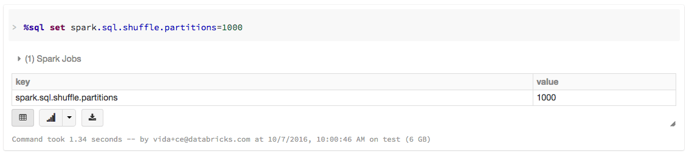

---

## <a id="photon">9. Photon und Spill</a>

Photon ist Databricks' vektorisierte, spaltenorientierte Query-Engine, die nativen C++-Code statt der JVM-basierten Spark-SQL-Engine ausführt.

### 9.1 Off-Heap-Speicherkoordination

Die Photon-Bibliothek wird in die JVM geladen; Spark und Photon kommunizieren über JNI und übergeben Datenzeiger an Off-Heap-Speicher. Entscheidend für Spill-Verhalten: **Photon integriert sich mit Sparks Memory-Manager für koordiniertes Spilling bei gemischten Plänen. Sowohl Spark als auch Photon sind so konfiguriert, dass sie Off-Heap-Speicher nutzen und sich unter Speicherdruck koordinieren.** Diese hybride Koordination ermöglicht effiziente Ressourcennutzung, wenn Queries teils in Photon und teils in Spark laufen.

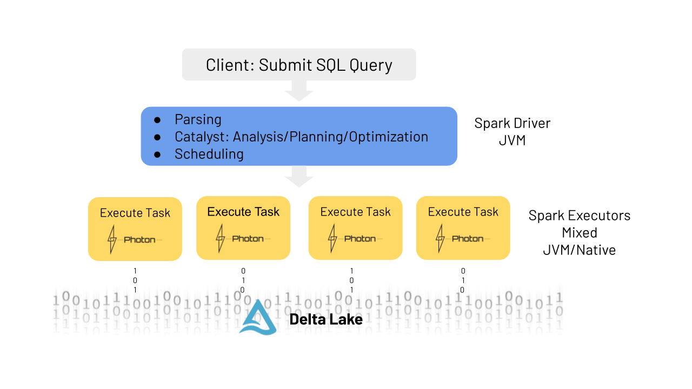

### 9.2 Redesignter Columnar Shuffle

Photon nutzt ein neu konzipiertes spaltenbasiertes Shuffle, um den Durchsatz bei großangelegten Joins zu erhöhen, und ersetzt Sort-Merge-Joins durch performante Hash-Joins. Beides reduziert indirekt Speicherdruck während Shuffle-lastiger Operationen (siehe [Shuffles.md](Shuffles.md), Abschnitt 9).

### 9.3 Benchmarks

- TPC-DS Power Test (1 TB Scale Factor): bis zu **2x** schneller als Databricks Runtime 8.0.
- Private-Preview-Kunden: **2–4x** durchschnittliche Speedups bei SQL-Workloads über verschiedene Szenarien (SQL-Jobs, IoT-Zeitreihenanalyse, Data Loading).

---

## <a id="memory-profiling">10. PySpark-Memory-Profiling</a>

### 10.1 Memory Profiler (ab Databricks Runtime 12.0 / Apache Spark 3.4)

Speicher war lange ein blinder Fleck im PySpark-Profiling. Der Memory Profiler (basierend auf der Python-Bibliothek `memory-profiler`) schließt diese Lücke, indem er Python-Worker-Subprozesse auf Executors profiliert — mit zeilengenauer Analyse, aggregierter Speichernutzung über verteilte Executors und dem Ziel, Out-of-Memory-Fehler und Spill-Risiko durch UDF-Optimierung zu reduzieren.

**Unterstützte UDF-Typen:** Python-UDFs (zeilenweise), Pandas-UDFs (vektorisiert), `mapInPandas`, `applyInPandas`, `mapInArrow`.

**Aktivierung:**

```python
# Memory Profiler Library auf dem Cluster installieren, dann:
spark.conf.set("spark.python.profile.memory", "true")
```

**Beispiel — unoptimierte UDF (Speicherverbrauch ~185 MiB):**

```python
def arith_op(pdf):
    result = []
    for x in pdf.v:
        result.append(x * 2)
    return pd.DataFrame({'v': result})
```

**Optimierte, vektorisierte Version (Speicherverbrauch ~61 MiB, ~2x Reduktion):**

```python
def optimized_arith_op(pdf):
    return pd.DataFrame({'v': pdf.v * 2})
```

**Profile anzeigen:**

```python
sc.show_profiles()       # Profile anzeigen
sc.dump_profiles(path)   # Profile auf Disk speichern
```

Profil-Ausgabespalten: `Line #`, `Mem usage` (Speicher nach Zeilenausführung), `Increment` (Differenz zur Vorzeile), `Occurrences` (Ausführungsanzahl), `Line Contents`.

**Vorher/Nachher-Vergleich der Profil-Ausgabe:**

| Vor Optimierung (Peak 125 MiB auf der Iterationszeile) | Nach Optimierung (~61 MiB Gesamtspeicher) |
|---|---|
| 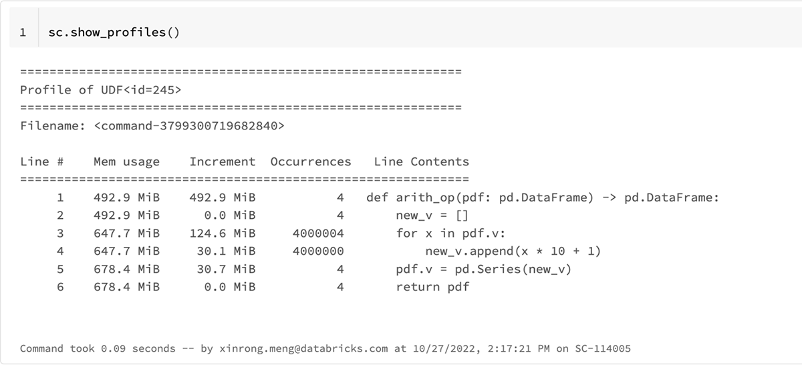 | 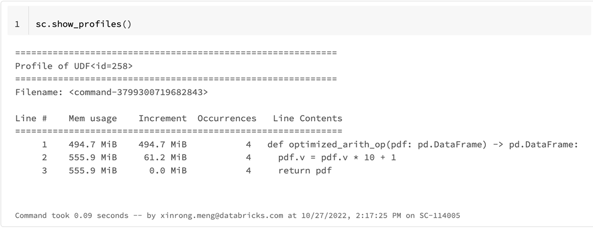 |

### 10.2 Performance Profiler

Ergänzend zum Memory Profiler steht ein cProfile-basierter Performance Profiler zur Verfügung (Treiber-Profiling als normaler Python-Prozess; Worker-Profiling über den seit Spark 3.3 verfügbaren UDF-Profiler). Aktivierung über `spark.python.profile = true`.

**Beispiel — Vektorisierung reduziert Funktionsaufrufe drastisch:**

```python
# Unoptimierte Pandas-UDF
def plus_one(pdf):
    return pdf.apply(lambda x: x + 1)

# Optimierte, vektorisierte Pandas-UDF
def plus_one(pdf):
    return pdf + 1
```

Ergebnis: Arithmetik-Operationen von 8.000 auf 8 Aufrufe reduziert, Gesamtfunktionsaufrufe von 2.898.160 auf 2.384, Ausführungszeit von 2,300 s auf 0,004 s.

### 10.3 Unified Profiling (ab Databricks Runtime 17.0)

Vereint Performance- und Memory-Profiling für PySpark-UDFs in einer SparkSession-basierten Konfiguration (kompatibel mit Spark Connect, Laufzeit-Umschaltung, Unterstützung registrierter UDFs):

```python
spark.conf.set("spark.sql.pyspark.udf.profiler", "perf")     # Performance-Analyse
spark.conf.set("spark.sql.pyspark.udf.profiler", "memory")   # Speicher-Analyse
```

---

## <a id="instance-storage">11. Instance-Storage-Autoscaling</a>

### 11.1 Warum lokaler Storage benötigt wird

Spark benötigt Diskspeicher für Zwischenergebnisse, wenn Operationen den verfügbaren Speicher übersteigen:

- **Shuffle-Operationen:** Datenaustausch zwischen Executors bei Joins/Aggregationen, gespeichert als Shuffle-Dateien.
- **Broadcast-Caching:** an Worker verteilte Daten für schnellen Zugriff.
- **Daten-Caching:** häufig genutzte Remote-Daten (z. B. S3) lokal gecacht zur I/O-Beschleunigung.

### 11.2 Probleme statischer Provisionierung

1. **Unvorhersehbarer Bedarf:** Der benötigte Diskspeicher steht nur indirekt im Verhältnis zur Datengröße — bedingt durch Kompression, Verteilung und Operationskomplexität. Nutzer greifen oft zu tagelangem Trial-and-Error.
2. **Ineffizienz durch Data Skew:** ungleiche Datenverteilung führt dazu, dass manche Worker deutlich mehr Diskspeicher benötigen als andere — was Über-Provisionierung auf allen Knoten erzwingt.

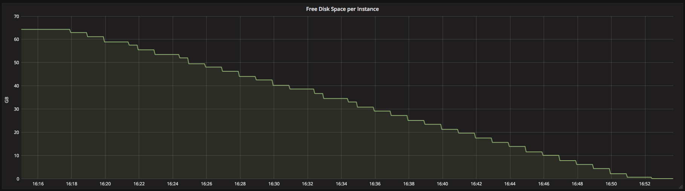

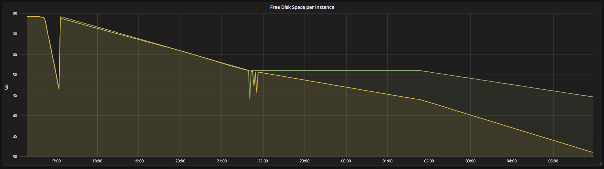

3. **Compliance-Lücken:** Verschlüsselung von lokalem Instance-Storage war lange nicht ohne Weiteres verfügbar, was Nutzer zwang, Performance zugunsten verschlüsselter EBS-Volumes zu opfern.

### 11.3 Wie Autoscaling funktioniert

Databricks nutzt den Linux Logical Volume Manager (LVM) und dynamisches EBS-Attachment:

- automatisches Bereitstellen und Anhängen neuer EBS-Volumes, sobald der freie Diskspeicher unter einen Mindestschwellenwert fällt,
- Allokation zunehmend größerer Volumes bis zu einem konfigurierten Maximum,
- Freigabe von Volumes bei sinkender Cluster-Last,
- optionale Verschlüsselung für lokalen wie EBS-Storage.

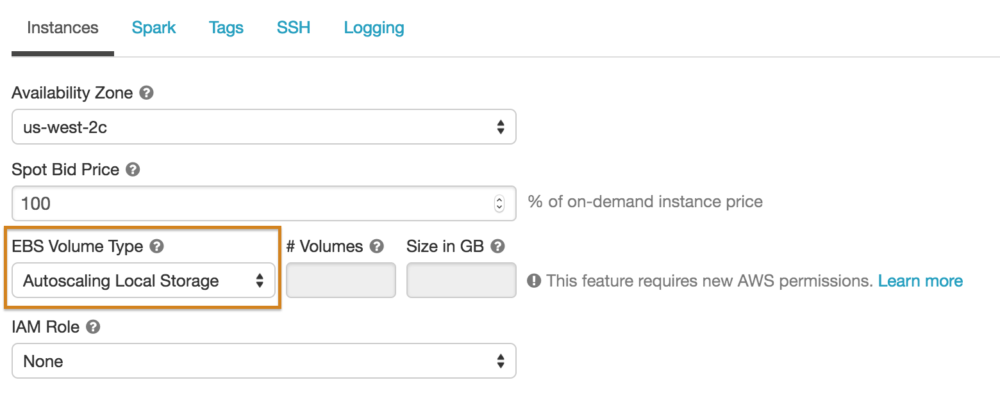

**Direkter Bezug zur Spill-Mitigation:** Autoscaling adressiert direkt „Spill-to-Disk"-Fehlschläge, indem Rätselraten bei der Storage-Provisionierung entfällt — Spark-Jobs können abschließen, wenn Zwischenergebnisse aus dem Speicher gespillt werden müssen, ohne dass ein „Disk full"-Fehler auftritt.

---

## <a id="disk-cache">12. Disk Cache und lokaler Storage</a>

Der Databricks Disk Cache beschleunigt Datenzugriffe, indem Kopien entfernter Parquet-Dateien im lokalen Storage der Knoten in einem schnellen Zwischenformat abgelegt werden — automatisches Caching bei jedem Remote-Fetch, nachfolgende Zugriffe erfolgen lokal.

**Was gecacht wird:** beliebige Parquet-Tabellen auf S3, ABFS und anderen Dateisystemen, sowie Delta-Lake-Tabellen (nur Remote-Dateien, keine In-Memory-DataFrames).

**Empfehlung:** Worker-Typ mit SSD-Volumes wählen. Der Disk Cache ist standardmäßig so konfiguriert, dass er höchstens die Hälfte des auf den lokalen SSDs der Worker verfügbaren Speicherplatzes nutzt — damit konkurriert der Disk Cache implizit mit dem Speicherplatz, der für Spill zur Verfügung steht.

**Konfigurationsparameter:**

```
spark.databricks.io.cache.maxDiskUsage       -- reservierter Diskspeicher für gecachte Daten pro Knoten (Bytes)
spark.databricks.io.cache.maxMetaDataCache   -- reservierter Diskspeicher für gecachte Metadaten pro Knoten (Bytes)
spark.databricks.io.cache.compression.enabled -- aktiviert komprimiertes Speicherformat
```

```python
spark.conf.set("spark.databricks.io.cache.enabled", "[true | false]")
```

---

## <a id="streaming">13. Spill in Structured Streaming</a>

### 13.1 Data Skew als Latenzursache in Streams

Data Skew bedeutet, dass einige wenige Tasks deutlich mehr Daten erhalten als der Rest. Bei geskewten Daten brauchen diese Tasks länger als die anderen, oft mit Spill auf Festplatte. Da die Performance eines Streams durch den langsamsten Task begrenzt wird, verlangsamt ungleiche Datenverteilung die gesamte Pipeline.

### 13.2 Watermark-Konfiguration und Speicherverbrauch

Ein zu großzügiger Watermark-Schwellenwert führt dazu, dass Structured Streaming mehr Daten zwischen Batches im State Store hält, was die Speicheranforderungen über den gesamten Cluster hinweg erhöht. Eine stateful Query ohne definierten Watermark — oder mit einem sehr langen — lässt den State unkontrolliert wachsen, verlangsamt den Stream über die Zeit und kann letztlich zum Fehlschlag führen.

**Empfehlung:** übermäßige Shuffle-Operationen, Joins oder extreme Watermark-Schwellenwerte vermeiden, da jedes davon den Ressourcenbedarf erhöht.

### 13.3 State-Store-Speicherdruck und RocksDB

Bei einer großen Anzahl an Keys (typischerweise Millionen) entsteht übermäßiger Speicherdruck auf den Maschinenspeicher, was die Häufigkeit von GC-Pausen erhöht. **RocksDB** als alternativer State-Store-Provider lindert diesen Speicherdruck — als eingebettbarer, persistenter Key-Value-Store belegt RocksDB keinen JVM-Heap-Speicher mehr und ermöglicht effizienteres State-Management.

**Wichtig:** Sofern kein geschäftlicher Bedarf besteht, sämtlichen bisher verarbeiteten Streaming-State aufzubewahren (selten der Fall), sollten stateful Operationen so implementiert werden, dass das System nicht mehr benötigte State-Datensätze verwirft.

### 13.4 Verbesserte RocksDB-Speicherverwaltung (DBR 13.3 LTS)

**Vorherige Einschränkung:** Alle Micro-Batch-Updates wurden über `WriteBatchWithIndex` im Speicher gepuffert; Nutzer konnten nur individuelle Instanz-Speicherlimits konfigurieren, mehrere State-Store-Instanzen auf einem Worker konnten sich gegenseitig verstärkende Speicherprobleme verursachen.

**Neuer Ansatz:** Ein globales Speicherlimit über alle State-Store-Instanzen eines Executor-Knotens hinweg über das Write-Buffer-Manager-Feature von RocksDB; `WriteBatchWithIndex` entfällt — Updates werden nicht mehr unbegrenzt gepuffert, sondern direkt in die Datenbank geschrieben. Das Write-Ahead-Log wird nicht mehr explizit benötigt, da Updates sicher als SST-Dateien geschrieben und während Checkpoints ins persistente Storage gesichert werden.

**Changelog-Checkpointing:** Statt bei jedem Micro-Batch einen vollständigen State-Snapshot zu erstellen, werden nur Änderungen seit dem letzten Checkpoint gespeichert, mit asynchronem Snapshot-Upload, der die Task-Ausführung nicht blockiert.

**Benchmark-Ergebnisse (Latenzreduktion, DBR 13.3 LTS vs. DBR 12.2, i3.2xlarge-Cluster mit 5 Workern):**

| Operation | p95-Reduktion | p99-Reduktion |
|---|---|---|
| Streaming-Aggregation (Kafka) | bis zu 76 % | bis zu 87 % |
| Stream-Stream-Join | bis zu 78 % | bis zu 83 % |
| Drop Duplicates | bis zu 77 % | bis zu 93 % |
| `flatMapGroupsWithState` | bis zu 65 % | bis zu 66 % |

### 13.5 Batch-Größe kontrollieren

Admission-Control-Parameter verhindern, dass zu große Micro-Batches Spill und kaskadierende Verzögerungen der Micro-Batch-Verarbeitung auslösen:

```python
# Delta Lake / Auto Loader: Standard 1000 Dateien pro Micro-Batch
.option("maxFilesPerTrigger", "1000")

# "Soft max" für Datenvolumen pro Micro-Batch (kein Standardwert)
.option("maxBytesPerTrigger", "1g")
```

Werden beide Parameter zusammen genutzt, stoppt die Verarbeitung eines Micro-Batches, sobald die niedrigere der beiden Grenzen erreicht ist. Für Kafka gilt stattdessen `maxOffsetsPerTrigger`.

**`Trigger.AvailableNow`** teilt die Daten anhand von `maxFilesPerTrigger` und `maxBytesPerTrigger` in mehrere Micro-Batches auf — feingranularer als `Trigger.Once`.

### 13.6 Kinesis-spezifisch: Puffer-Spill

Bei einem plötzlichen Anstieg des Datenvolumens in Kinesis-Streams kann sich die zugewiesene Puffer-Kapazität füllen und nicht schnell genug leeren, um neue Daten aufzunehmen — Spark spillt Daten vom Puffer auf Disk, was die Stream-Verarbeitung verlangsamt.

**Log-Indikator:**

```
./log4j.txt:879546:20/03/02 17:15:04 INFO BlockManagerInfo: Updated
kinesis_49290928_1_ef24cc00-abda-4acd-bb73-cb135aed175c on disk on
10.0.208.13:43458 (current size: 88.4 MB, original size: 0.0 B)
```

**Empfohlene Lösungen:** Cluster-Speicherkapazität erhöhen (mehr Knoten oder mehr Speicher pro Knoten), oder den Parameter `fetchBufferSize` reduzieren.

---

## <a id="cluster-sizing">14. Cluster- und Warehouse-Sizing</a>

### 14.1 RAM pro Core und Instance-Typen

Die Gesamtmenge an RAM über alle Executors bestimmt, wie viel Daten im Speicher gehalten werden können, bevor sie auf Disk gespillt werden. Bei signifikantem Spill auf Disk oder OOM-Fehlern: Speicher der Instanzen erhöhen.

**Empfohlene Instance-Typen:** „Memory optimized für ML, starke Shuffle- und Spill-Workloads." Lokaler Disk wird primär bei Spill während Shuffles und beim Caching genutzt — daher „Storage optimized mit aktiviertem Disk-Cache" oder Instanzen mit lokalem Storage für Datenanalyse- und ML-Workloads mit wiederholten Lese- und Spill-Operationen.

**Sizing-Faktoren:**

- Gesamtanzahl Executor-Cores (maximale Parallelität)
- Gesamt-Executor-Memory (RAM-Kapazität vor Disk-Spill)
- Art und Menge des Executor-lokalen Storage

### 14.2 Cluster-Metriken zur Spill-Diagnose

Direkt als „Spill" benannte Metriken existieren im Cluster-Metriken-Dashboard nicht explizit — verfügbar sind aber verwandte Indikatoren:

- **Container Memory Usage:** durchschnittlicher Speicherverbrauch des Spark-Containers über alle Knoten.
- **JVM Heap Usage:** durchschnittliche JVM-Heap-Nutzung, Kapazität und Maximalgrenze.
- **iowait** (CPU-Modus): Zeit, die auf I/O gewartet wird — ein indirekter Hinweis auf Disk-Aktivität durch Spill.
- **Total shuffle read / write:** Größe gelesener bzw. geschriebener Shuffle-Daten (siehe [Shuffles.md](Shuffles.md)).

### 14.3 SQL-Warehouse-Sizing

Spillen Queries auf Disk, sollte die Cluster-Größe erhöht werden. Dazu auf Spills im Query-Profil prüfen. Metriken wie „Bytes spilled to disk" im Ausführungsplan zeigen an, dass die Warehouse-Größe eventuell zu klein ist. Autoscaling-Verhalten von SQL-Warehouses reagiert primär auf Query-Wartezeiten in der Warteschlange und geschätzte Query-Laufzeit — nicht explizit auf erkannten Spill. Spill-Mitigation erfordert daher meist eine manuelle Anpassung der Warehouse-Größe.

---

## <a id="mitigation">15. Spill-Mitigation im Überblick</a>

Übersicht der wichtigsten Maßnahmen:

1. **Cluster mit mehr RAM pro Core allokieren** — größerer Speicherraum zur Verarbeitung der Daten.
2. **Data Skew adressieren** — ist eine Partition deutlich größer als andere, hilft deren Verkleinerung, sie leichter im Speicher unterzubringen (siehe [Data Skew.md](Data%20Skew.md)).
3. **Größe der Spark-Partitionen verwalten** — über `spark.sql.files.maxPartitionBytes` und `spark.sql.shuffle.partitions` angemessen dimensionieren (siehe Abschnitt 8).
4. **Teure Operationen wie `explode()` vermeiden**, wo möglich.
5. **Datenmenge präventiv reduzieren** — unnötige Spalten ausschließen, nicht benötigte Zeilen frühzeitig herausfiltern.

6. **AQE aktiviert lassen** (Partition-Coalescing, Skew-Join-Handling — siehe Abschnitt 7).
7. **Bei stark komprimierten Tabellen** `spark.sql.adaptive.preshufflePartitionSizeInBytes` reduzieren (Abschnitt 7.3).
8. **Delta Cache statt Spark Cache bevorzugen** — speichereffizienter.
9. **Instance-Storage-Autoscaling nutzen**, damit Spill nicht durch volle lokale Disks in einen harten Fehler eskaliert (Abschnitt 11).
10. **Bei SQL-Warehouses:** T-Shirt-Größe erhöhen, Data Skew reduzieren, Joins vereinfachen, Datei-Layout über Liquid Clustering verbessern (Abschnitt 3.4).
11. **Bei Streaming-Workloads:** Watermarks konsequent setzen, RocksDB als State-Store-Provider nutzen, Batch-Größe über `maxFilesPerTrigger`/`maxBytesPerTrigger` begrenzen (Abschnitt 13).
12. **GC-Tuning** bei Java-Heap-lastigen Workloads: G1 GC mit minimalem Tuning als Ausgangspunkt (Abschnitt 6).
13. **PySpark-UDFs profilen** und vektorisieren, um Speicherverbrauch pro Task zu reduzieren (Abschnitt 10).

---

## <a id="praxisbeispiele">16. Praxisbeispiele</a>

### 16.1 Debugging eines wiederkehrenden OOM-Fehlers (Disney Streaming Services)

Ein Structured-Streaming-Job mit `flatMapGroupsWithState` stürzte alle drei Tage mit `java.lang.OutOfMemoryError: GC Overhead limit exceeded` bzw. `Java heap space` ab. Zehnstufige Debugging-Methodik:

1. **Log-Analyse:** Treiber-Logs im Spark UI auf Executor-Ausfälle prüfen, dann Executor-Logs auf konkrete OOM-Fehler.
2. **GC-Tuning:** G1GC aktivieren — löste das Problem teilweise (weniger Full-GC-Häufigkeit), Java-Heap-Space-Fehler blieben jedoch bestehen.
3. **Cluster-Health-Monitoring:** Ganglia zeigte stetig wachsenden Cluster-Speicher, der abrupt „von der Klippe fiel" — Hinweis auf State-Akkumulation oder Memory Leak.
4. **Streaming-Metriken:** `stateOperators.numRowsTotal` gegen Event-Zeit geplottet zeigte Stabilität — State-Retention als Ursache ausgeschlossen.
5. **Heap-Dumps:** `HeapDumpOnOutOfMemory` aktiviert, periodische Dumps alle 12 Stunden zum Vergleich gesammelt, mit YourKit/Eclipse MAT analysiert.
6. **Root Cause:** exzessive `HashMap$Node[16384]`-Instanzen stammten aus dem AWS SDK, nicht aus der Geschäftslogik — ein Hinweis auf nicht geschlossene HTTP-Verbindungen.
7. **Lösung:** Die Anwendung erzeugte pro Partition neue Kinesis-Clients, schloss aber nur den `KinesisClient` — die zugrunde liegenden Apache-HTTP-Clients blieben offen und verursachten TCP-Connection-Leaks.

**Lehre:** Öffnest du eine Verbindung, schließe sie immer, sobald du fertig bist. Bei zukünftigen Untersuchungen sollte zudem ein JVM-Profiler an den Executor angehängt werden.

### 16.2 60-TB-Produktions-Workload (Facebook, 2016)

Mehrere Speicher- und Spill-relevante Bugs wurden bei diesem großskaligen Workload identifiziert und behoben:

- **Executor-OOM durch Sorter-Bug (SPARK-13958):** Ursprünglich passten nur vier Reduce-Tasks pro Host in den Speicher. Ursache: ein Bug im Sorter ließ ein Zeiger-Array unbegrenzt wachsen. Der Fix erzwang, dass Daten auf Disk gespillt werden, sobald kein Speicher mehr für das wachsende Zeiger-Array verfügbar ist — ermöglichte danach 24 Tasks pro Host.
- **Memory Leak im Sorter (SPARK-14363):** Tasks gaben zwar alle Speicherseiten frei, das Zeiger-Array selbst wurde jedoch nicht freigegeben. Das führte zu ungenutzten Speicherblöcken sowie zu häufigem Spilling und Executor-OOMs. Der korrekte Fix zur Speicherfreigabe brachte eine 30%ige Performance-Verbesserung.
- **Konfigurierbare Puffergröße (SPARK-15958):** Die anfängliche Standard-Puffergröße betrug nur 4 KB. Bei großen Workloads verschwendete das signifikant Zeit für das Erweitern des Puffers und das Kopieren der Inhalte. Erhöhung auf 64 MB brachte ~5 % Beschleunigung.

**Gesamtergebnis:** 4,5–6x CPU-Verbesserung und ~5x Latenzverbesserung gegenüber einer vergleichbaren Hive-Pipeline.

### 16.3 Single-Node-Benchmarking: Spark vs. Pandas bei Speicherdruck

Ein direkter Vergleich zeigt den fundamentalen Unterschied im Umgang mit Speicherlimits: Sparks Operatoren spillen Daten auf Disk, wenn sie nicht in den Speicher passen. Dadurch läuft Spark auch auf beliebig großen Daten gut. Auf einer Maschine mit 244 GB Systemspeicher, 32 virtuellen Cores und 4× 1900 GB NVMe-SSD (für Shuffle/Spill) verarbeitete PySpark (mit 10 GB zugewiesenem Memory) erfolgreich Datensätze bis ~35 GB auf Disk — das 3,5-Fache des zugewiesenen RAM, dank automatischem Spill. **Pandas hingegen stürzte bei Dateien über 39 GB vollständig ab**, da es Daten, die den physischen Speicher übersteigen, nicht verarbeiten kann.

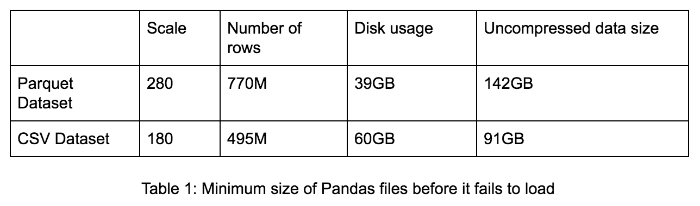

### 16.4 CloudSort-Weltrekord (2016)

Databricks, Nanjing University und Alibaba Group stellten einen neuen CloudSort-Benchmark-Rekord von **1,44 $ pro Terabyte** für das Sortieren von 100 TB Daten auf — eine Zwei-Drittel-Kostenreduktion gegenüber dem vorherigen Rekord von 4,51 $/TB (394 `ecs.n1.large`-Knoten auf AliCloud, je 8 GB Speicher, 4×135 GB SSD Cloud Disk). Drei kritische Innovationen für die Effizienz: **Project Tungsten** (Off-Heap-Memory-Management zur GC-Vermeidung und CPU-Effizienzsteigerung), Netty-basiertes Networking für höheren Shuffle-Durchsatz, sowie der Catalyst-Optimizer mit Whole-Stage-Codegen.

---

## <a id="zusammenfassung">17. Zusammenfassung</a>

- **Spill** ist das Verschieben von Daten zwischen RAM und Disk, wenn eine Partition nicht mehr vollständig in den verfügbaren Ausführungsspeicher passt — der letzte Schutzmechanismus vor einem Out-of-Memory-Fehler, aber selbst teuer durch Serialisierung, Deserialisierung und Disk-I/O.
- **Häufige Ursachen:** zu hoch gesetzte `maxPartitionBytes`, `explode()`, Cross-Joins, Joins auf geskewten Keys, Group-by auf niedrigkardinalen Spalten, `countDistinct()`/`collect_set()`, zu niedrig gesetzte oder falsch genutzte Shuffle-Partitionen/`repartition()`.
- **Erkennung:** im Spark UI erscheinen Spill-Spalten (Memory und Disk, immer gemeinsam) nur auf der Stage-Detailseite und **nur dann**, wenn tatsächlich Spill vorliegt; in Databricks SQL zeigen Query Profile („spill bytes/time") und die dedizierte `DATA_SPILL`-Performance-Insight denselben Sachverhalt.
- **Grundlegende Architektur:** Sparks Unified-Memory-Management arbitriert dynamisch zwischen Storage- und Execution-Memory und erzwingt bei Bedarf Spill, statt Speicher starr vorab zu reservieren; Project Tungsten reduziert den JVM-Objekt-Overhead durch explizites Off-Heap-Memory-Management.
- **Automatische Vermeidung:** AQE reduziert Spill-Risiko durch Partition-Coalescing und Skew-Join-Handling; Photon koordiniert Off-Heap-Spilling zwischen Spark und Photon in gemischten Ausführungsplänen.
- **Manuelle Stellschrauben:** Shuffle-Partitionen über die Formel „geshuffelte Datenmenge / 128 MB" dimensionieren, GC-Tuning (G1 GC) bei JVM-Heap-lastigen Workloads, PySpark-UDFs über den Memory Profiler analysieren und vektorisieren.
- **Infrastruktur:** Instance-Storage-Autoscaling verhindert, dass Spill durch volle lokale Disks eskaliert; memory-optimierte Instanztypen und ausreichend lokaler SSD-Storage reduzieren Spill-Wahrscheinlichkeit und -Kosten von vornherein.
- **Streaming-spezifisch:** RocksDB als State-Store-Provider und konsequente Watermark-Nutzung begrenzen den Speicherbedarf stateful Queries; `maxFilesPerTrigger`/`maxBytesPerTrigger` verhindern zu große Micro-Batches.
