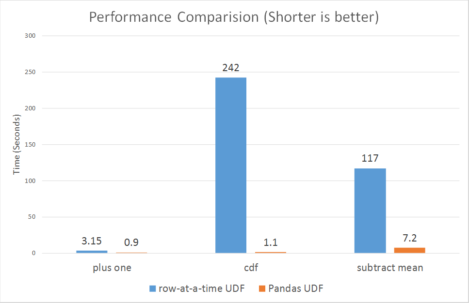
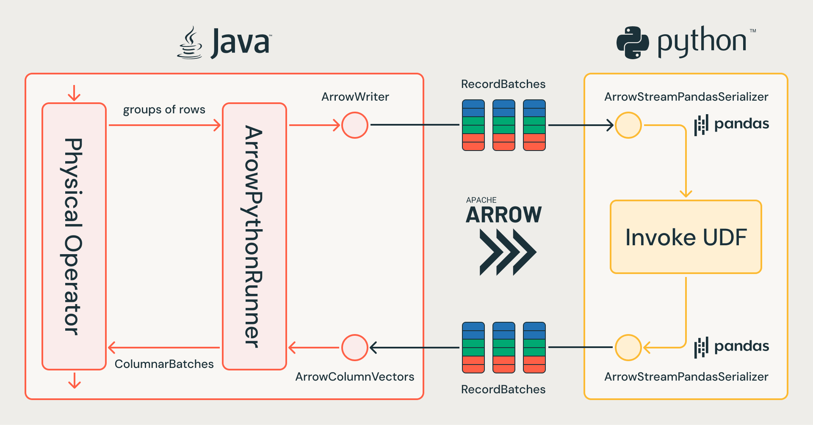
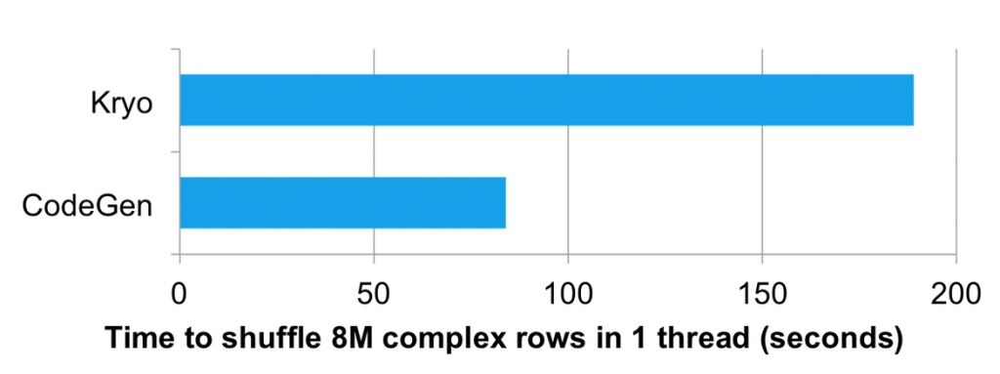
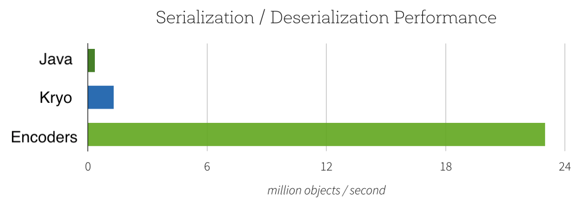
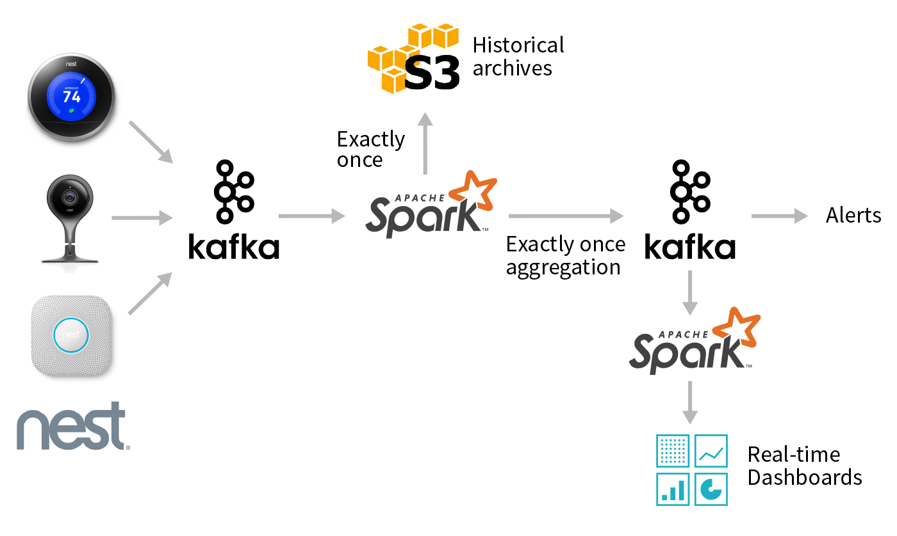

# Serialization in Spark und Databricks

Umfassende Referenz zu Serialisierung: warum UDFs teuer sind, wie Datasets/Encoders und Apache Arrow diese Kosten senken, und welche Datenformate (Avro, Protobuf) für welchen Zweck geeignet sind. Ergänzt [Data Skew.md](Data%20Skew.md), [Shuffles.md](Shuffles.md) und [Spill.md](Spill.md), mit denen sich Grundlagen zu Project Tungsten und Spark-Tuning überschneiden. Für die vollständige API-Referenz zu allen UDF-Typen (Unity-Catalog-governed und session-scoped, inklusive aller Code-Beispiele) siehe den Ordner [UDFs](../../UDFs/00%20Overview.md).

## Abschnittsübersicht

1. [Warum Serialisierung ein Performance-Problem ist](#warum-problem)
2. [UDF-Performance-Hierarchie im Überblick](#performance-hierarchie)
3. [Standard-Python-UDFs: der teuerste Weg](#python-udfs)
4. [Pandas (Vectorized) UDFs: Serialisierung über Apache Arrow](#pandas-udfs)
5. [Arrow-Optimized Python UDFs (Spark 3.5)](#arrow-optimized-udfs)
6. [Arrow UDFs: die nächste Generation (Databricks Runtime 18.0)](#arrow-udfs-native)
7. [Pandas Function APIs](#pandas-function-apis)
8. [Scala-UDFs und Typed Transformations](#scala-udfs)
9. [UDFs in Spark Connect vs. Classic](#spark-connect)
10. [Der Catalyst-Optimizer und die UDF-Blackbox](#catalyst-blackbox)
11. [Project Tungsten: Binärformat statt Java-Objekte](#tungsten)
12. [Datasets und Encoders](#datasets-encoders)
13. [Java- vs. Kryo-Serialisierung](#java-kryo)
14. [Avro als Serialisierungsformat](#avro)
15. [Protocol Buffers als Serialisierungsformat](#protobuf)
16. [Kafka: binäre Serialisierung von Key/Value](#kafka)
17. [Isolation Levels: Serialisierbarkeit von Transaktionen](#isolation-levels)
18. [Mitigation im Überblick](#mitigation)
19. [Zusammenfassung](#zusammenfassung)

---

## <a id="warum-problem">1. Warum Serialisierung ein Performance-Problem ist</a>

Serialisierung ist ein wichtiges Thema der Code-Optimierung, besonders im Umgang mit User-Defined Functions (UDFs). Serialisierung bezeichnet den Prozess, der beim Erstellen einer UDF nötig wird — diese Funktion muss serialisiert und an jeden Executor im Cluster verteilt werden. Während Spark-SQL- und DataFrame-Operationen hochgradig optimiert sind und Sparks interne Effizienzmechanismen nutzen können, gilt dieses Optimierungsniveau nur, wenn diese Operationen direkt verwendet werden. Wird eine eigene UDF geschrieben, muss sie serialisiert und an alle Executors verteilt werden, was Zeit- und Ressourcen-Overhead hinzufügt. Zusätzlich müssen Parameter und Rückgabewerte für jeden UDF-Aufruf für jede Datenzeile konvertiert werden, was die Rechenkosten weiter erhöht.

**Python-UDFs sind in diesem Kontext am wenigsten optimiert** — Python-Code muss gepickelt werden (in ein für Python geeignetes Format serialisiert), und Spark muss in jedem Executor einen Python-Interpreter starten. Die Hin- und Rückkonvertierung jeder Zeile zwischen Python und der DataFrame fügt eine weitere Overhead-Schicht hinzu, was diese UDFs deutlich weniger effizient macht als native Spark-SQL- oder DataFrame-Ausdrücke.

Zusammengefasst:

- Spark-SQL- und DataFrame-Instruktionen sind hochgradig optimiert.
- Alle UDFs müssen serialisiert und an jeden Executor verteilt werden.
- Parameter und Rückgabewert jeder UDF müssen für jede Datenzeile konvertiert werden, bevor sie an Executors verteilt werden.
- Python-UDFs trifft es noch härter:
  - Der Python-Code muss gepickelt werden.
  - Spark muss in jedem einzelnen Executor einen Python-Interpreter instanziieren.
  - Die Konvertierung jeder Zeile zwischen Python und DataFrame kostet zusätzlich.

---

## <a id="performance-hierarchie">2. UDF-Performance-Hierarchie im Überblick</a>

Rangfolge von schnellster zu langsamster Option:

1. **Built-in-Funktionen und SQL-UDFs** — laufen vollständig innerhalb der JVM, keine zusätzliche Serialisierung.
2. **Scala-UDFs** — vermeiden JVM-Serialisierungs-Overhead, laufen aber weiterhin als Blackbox für den Catalyst-Optimizer.
3. **Python-UDFs** — erfordern Datenserialisierung zwischen JVM und Python-Prozess.
4. **Pandas-UDFs** — bis zu 100x schneller als Python-UDFs dank Apache Arrow, das den Serialisierungs-Overhead reduziert.

**Empfehlung für den Einsatz von UDFs allgemein:** UDFs eignen sich für Ad-hoc-Queries, manuelle Datenbereinigung, explorative Datenanalyse und Operationen auf kleinen bis mittelgroßen Datensätzen — etwa Verschlüsselung, Entschlüsselung, Hashing, JSON-Parsing und Validierung. Für große Datensätze und regelmäßig laufende Workloads wie ETL-Jobs und Streaming-Operationen sind native Apache-Spark-Methoden zu bevorzugen.

**UDF-Typen im Überblick:**

| Typ | Beschreibung |
|---|---|
| **Scalar UDFs** | verarbeiten einzelne Zeilen, ein Ergebnis pro Zeile — Unity-Catalog-governed oder session-scoped |
| **Batch Scalar UDFs** | verarbeiten mehrere Werte mit 1:1-Input/Output-Verhältnis, reduzieren Zeile-für-Zeile-Overhead bei großskaligen Workloads |
| **Non-Scalar UDFs** | operieren auf ganzen Datensätzen mit flexiblem Input/Output-Verhältnis (1:N oder many:many) — inklusive Pandas-UDFs mit verschiedenen Mustern |
| **UDAFs** (User-Defined Aggregate Functions) | aggregieren mehrere Zeilen zu einem Ergebnis — nur session-scoped |
| **UDTFs** (User-Defined Table-Returning Functions) | akzeptieren Input-Argumente und geben mehrere Zeilen/Spalten pro Input-Zeile zurück |

---

## <a id="python-udfs">3. Standard-Python-UDFs: der teuerste Weg</a>

### Registrierung

```python
def squared(s):
    return s * s

spark.udf.register("squaredWithPython", squared)
```

**Mit explizitem Rückgabetyp:**

```python
from pyspark.sql.types import LongType

def squared_typed(s):
    return s * s

spark.udf.register("squaredWithPython", squared_typed, LongType())
```

### Nutzung

**Über Spark SQL:**

```sql
SELECT id, squaredWithPython(id) AS id_squared FROM test
```

**Über die DataFrame-API mit explizitem Typ:**

```python
from pyspark.sql.functions import udf
from pyspark.sql.types import LongType

squared_udf = udf(squared, LongType())
df.select("id", squared_udf("id").alias("id_squared"))
```

**Als Dekorator:**

```python
@udf("long")
def squared_udf(s):
    return s * s
```

### `udf()`-Signatur im Detail

```python
import pyspark.sql.functions as sf

# Als Dekorator ohne Parameter
@sf.udf
def function_name(col):
    pass

# Als Dekorator mit Rückgabetyp und Arrow-Option
@sf.udf(returnType=<returnType>, useArrow=<useArrow>)
def function_name(col):
    pass

# Als Funktionswrapper
sf.udf(f=<function>, returnType=<returnType>, useArrow=<useArrow>)
```

| Parameter | Typ | Beschreibung |
|---|---|---|
| `f` | function | optional, Python-Funktion bei eigenständiger Nutzung |
| `returnType` | DataType oder str | optional, Rückgabetyp als DataType-Objekt oder DDL-String; Standard `StringType` |
| `useArrow` | bool | optional, aktiviert Arrow-Optimierung für Serialisierung; bei `None` wird die Spark-Konfiguration genutzt (siehe Abschnitt 5) |

### Wichtige Einschränkung: Auswertungsreihenfolge

Spark SQL garantiert nicht die Reihenfolge, in der Subexpressions ausgewertet werden — das System kann nicht zusichern, dass Null-Prüfungen vor dem UDF-Aufruf ausgeführt werden. Die Lösung erfordert entweder eingebaute Null-Awareness in der UDF selbst oder bedingte Verzweigungen (`IF`/`CASE WHEN`).

### Warum genau diese UDFs am teuersten sind

Wie in Abschnitt 1 erläutert: der Python-Code muss gepickelt werden, Spark muss pro Executor einen Python-Interpreter starten, und jede Zeile muss zwischen Python und der DataFrame hin- und herkonvertiert werden — pro Zeile, nicht in Batches.

---

## <a id="pandas-udfs">4. Pandas (Vectorized) UDFs: Serialisierung über Apache Arrow</a>

Pandas-UDFs, auch vektorisierte UDFs genannt, nutzen Apache Arrow für den Datentransfer und pandas für die Verarbeitung. Sie liefern erhebliche Performance-Gewinne: **bis zu 100x schneller als zeilenweise Python-UDFs**, da sie Operationen batchweise statt Zeile für Zeile ausführen.

**Zentraler Mechanismus:** Arrow konvertiert Datenpartitionen in Record Batches und eliminiert damit die teure Python-Serialisierung — dieses Batching treibt den 100x-Performance-Vorteil gegenüber zeilenweisen Python-UDFs.

### 4.1 Grundsyntax

Alle Pandas-UDFs nutzen den `@pandas_udf`-Dekorator mit Python-Type-Hints:

```python
from pyspark.sql.functions import pandas_udf
import pandas as pd

@pandas_udf("returnType")
def function_name(args) -> ReturnType:
    # Implementierung
    ...
```

### 4.2 Series to Series UDF

Vektorisiert skalare Operationen zur Nutzung mit `select()` und `withColumn()`. Type-Hint: `pd.Series, pd.Series -> pd.Series`.

```python
@pandas_udf(LongType())
def multiply_func(a: pd.Series, b: pd.Series) -> pd.Series:
    return a * b

df.select(multiply_func(col("x"), col("x"))).show()
```

### 4.3 Iterator of Series to Iterator of Series UDF

Verarbeitet Batches sequenziell — nützlich zur Initialisierung von Zustand (z. B. Laden eines ML-Modells). Type-Hint: `Iterator[pd.Series] -> Iterator[pd.Series]`.

```python
from typing import Iterator

@pandas_udf("long")
def plus_one(batch_iter: Iterator[pd.Series]) -> Iterator[pd.Series]:
    for x in batch_iter:
        yield x + 1

df.select(plus_one(col("x"))).show()
```

**Wichtig:** `try`/`finally` nutzen, um Ressourcen nach Verarbeitung aller Batches freizugeben.

### 4.4 Iterator of Multiple Series to Iterator of Series UDF

Akzeptiert mehrere Spalten als Tupel-Iterator, unterstützt zustandsbehaftete Initialisierung. Type-Hint: `Iterator[Tuple[pd.Series, pd.Series]] -> Iterator[pd.Series]`.

```python
from typing import Iterator, Tuple

@pandas_udf("long")
def multiply_two_cols(
    iterator: Iterator[Tuple[pd.Series, pd.Series]]
) -> Iterator[pd.Series]:
    for a, b in iterator:
        yield a * b

df.select(multiply_two_cols("x", "x")).show()
```

### 4.5 Series to Scalar UDF

Aggregationsfunktion, die eine pandas-Series auf einen einzelnen Wert reduziert — unterstützt `groupBy.agg()` und Window-Funktionen. Type-Hint: `pd.Series -> Any` (skalarer Typ).

```python
@pandas_udf("double")
def mean_udf(v: pd.Series) -> float:
    return v.mean()

df.select(mean_udf(df['v'])).show()
df.groupby("id").agg(mean_udf(df['v'])).show()
```

**Einschränkung:** unterstützt keine partielle Aggregation, und alle Daten je Gruppe werden vollständig in den Speicher geladen (siehe [Data Skew.md](Data%20Skew.md) zu Risiken bei geskewten Gruppengrößen).

### 4.6 Konfiguration und Sonderfälle

**Arrow-Batch-Größe:**

```python
spark.conf.set("spark.sql.execution.arrow.maxRecordsPerBatch", "10000")  # Standard
```

Steuert den Speicherverbrauch beim JVM-zu-Python-Transfer.

**Timestamp-Handling:** Spark speichert UTC-Timestamps in Mikrosekunden-Genauigkeit, pandas nutzt `datetime64[ns]` in Nanosekunden-Genauigkeit. Die Konvertierung erfolgt automatisch — Nanosekunden-Anteile werden dabei abgeschnitten, wenn pandas-Daten zurück nach Spark konvertiert werden.

### 4.7 `pandas_udf()`-Signatur im Detail

```python
import pyspark.sql.functions as sf

# Als Dekorator
@sf.pandas_udf(returnType=<returnType>, functionType=<functionType>)
def function_name(col):
    pass

# Als Funktionswrapper
sf.pandas_udf(f=<function>, returnType=<returnType>, functionType=<functionType>)
```

| Parameter | Typ | Beschreibung |
|---|---|---|
| `f` | function | optional, Python-Funktion bei eigenständiger Nutzung |
| `returnType` | DataType oder str | optional, DataType-Objekt oder DDL-Typ-String |
| `functionType` | int | optional, Enum-Wert aus `PandasUDFType`; Standard `SCALAR` |

### 4.8 Historie: die ursprüngliche Einführung (Spark 2.3, 2017)

Traditionelle zeilenweise Python-UDFs litten unter „hohem Serialisierungs- und Aufruf-Overhead", was Data Engineers dazu zwang, performance-kritische Funktionen in Java oder Scala statt Python zu schreiben — trotz Pythons Dominanz in der Data Science. Ursprünglich gab es zwei Typen: **Scalar Pandas UDFs** (vektorisierte skalare Operationen, `pandas.Series` → `pandas.Series`) und **Grouped Map Pandas UDFs** (Split-Apply-Combine, `pandas.DataFrame` → `pandas.DataFrame`).

**Benchmark (Databricks 4.0, Scala 2.11, Cluster mit 6,0 GB Speicher, 0,88 Cores, Single Node, 10 Millionen Zeilen):** Pandas-UDFs zeigten Performance-Verbesserungen „zwischen 3x und über 100x" gegenüber zeilenweisen Ansätzen über drei Testszenarien (Plus-One, kumulative Wahrscheinlichkeit, Gruppenmittelwert-Subtraktion).



### 4.9 Redesign mit Python-Type-Hints (Spark 3.0)

Die ursprüngliche API wuchs organisch und führte zu Inkonsistenzen und Verwirrung bei Nutzern. Spark 3.0 führte Python-Type-Hints (PEP 484) statt manueller Typangabe ein — der Code wird dadurch selbsterklärender und ermöglicht bessere IDE-Unterstützung, bei unveränderten Performance-Charakteristika: „nahezu keine (De-)Serialisierungskosten" durch direkten Datenaustausch zwischen JVM und Python-Treiber/-Executors über Apache Arrow.

**Vier Kern-Pandas-UDF-Typen ab Spark 3.0:**

1. **Series to Series** — entspricht dem Scalar Pandas UDF aus Spark 2.3.
2. **Iterator of Series to Iterator of Series** — neu in Spark 3.0, ermöglicht Prefetching und teure Zustandsinitialisierung.
3. **Iterator of Multiple Series to Iterator of Series** — neu in Spark 3.0, akzeptiert mehrere Input-Spalten.
4. **Series to Scalar** — entspricht dem Grouped Aggregate Pandas UDF aus Spark 2.4.

---

## <a id="arrow-optimized-udfs">5. Arrow-Optimized Python UDFs (Spark 3.5)</a>

Databricks Runtime 14.0 und Apache Spark 3.5 führten Arrow-optimierte Python-UDFs ein, um Performance über die traditionelle cloudpickle-basierte Methode hinaus zu verbessern. Diese Optimierung nutzt Apache Arrows spaltenbasiertes In-Memory-Format für schnelleren Datenaustausch zwischen JVM- und Python-Prozessen — im Unterschied zu den echten Pandas-UDFs aus Abschnitt 4 handelt es sich hier um eine Optimierung des **Serialisierungswegs standardmäßiger, zeilenweiser Python-UDFs**, nicht um vektorisierte Verarbeitung.

### Performance-Verbesserungen

- **Einzeltransformation:** Arrow-optimierte Python-UDFs sind **~1,6x schneller** als gepickelte Python-UDFs, gemessen über verschiedene Datensatzgrößen auf einem Cluster mit 3 Workern/1 Driver (16 vCPUs, 122 GiB pro Maschine).
- **Verkettete UDFs:** bei verketteten Operationen auf 32-GB-Datensätzen liefert die Arrow-Optimierung etwa **1,9x schnellere** Ausführung gegenüber pickle-basierten UDFs.

### Technische Vorteile

Arrows spaltenbasiertes Format bietet bessere Kompression und Speicherlokalität im Vergleich zur zeilenbasierten Pickle-Serialisierung — effizienter für analytische Workloads. Zusätzlich verbessert es problematische Typkonvertierungen: String-zu-Integer-Konvertierung gelingt zuverlässig (Pickle fällt bei nicht eindeutigen Fällen auf `NULL` zurück), Datumskonvertierungen werden sauber zu Strings serialisiert (Pickle legt zugrunde liegende Java-Objekte mehrdeutig offen).

### Aktivierung

**Pro UDF:**

```python
@udf(returnType=IntegerType(), useArrow=True)
def add_one(x):
    if x is not None:
        return x + 1
```

**Session-weit:**

```python
spark.conf.set("spark.sql.execution.pythonUDF.arrow.enabled", "true")
```

---

## <a id="arrow-udfs-native">6. Arrow UDFs: die nächste Generation (Databricks Runtime 18.0)</a>

Arrow UDFs sind ein Nachfolger für Pandas-UDFs, der eine zusätzliche Konvertierungsebene eliminiert: Pandas-UDFs konvertieren Arrow-Daten zunächst in pandas-DataFrames, was zusätzliche Serialisierungs-/Kopieraufwände erzeugt — „die Pandas/Arrow-Datenkonvertierung führt zu zusätzlichen Datenkopien. Zero-Copy-Ansätze sind nur in bestimmten, eng begrenzten Fällen möglich." Arrow UDFs „operieren direkt auf Arrow-Daten, ohne Inputs in Pandas- oder NumPy-Objekte zu konvertieren — das erhält das spaltenbasierte Layout durchgängig."



### Benchmark-Zahlen

- **~10 % schnellere** Ausführung im Vergleich zu Pandas-UDFs.
- **~40 % weniger Speicherverbrauch** während der Ausführung.
- Bessere Unterstützung komplexer Datentypen (z. B. verschachtelte `StructType`-Instanzen bei Aggregations-Anwendungsfällen).

### Unterstützte Funktionstypen

| Typ | Beschreibung |
|---|---|
| **Arrow Scalar Functions** | zeilenweise Transformationen mit `pyarrow.Array`-Ein-/Ausgabe, drei Input-Modi (direkt, Iterator, Iterator mehrerer Arrays) |
| **Arrow Aggregate Functions** | Gruppenreduktionsoperationen mit skalarem Rückgabewert, dieselben drei Input-Modi |
| **Arrow Table Functions (UDTFs)** | akzeptieren `pyarrow.RecordBatch` oder mehrere `pa.Array`-Inputs, erzeugen `pyarrow.Table`-Outputs für komplexe Transformationen |
| **DataFrame-APIs** | `mapInArrow()`, `groupBy().applyInArrow()`, `cogroup().applyInArrow()` |

### Code-Beispiele

**Skalare Arrow-UDF:**

```python
import pyarrow as pa

@arrow_udf("long")
def arrow_add_one(s: pa.Array) -> pa.Array:
    return s + 1
```

**SQL-Nutzung:**

```sql
SELECT arrow_add_one(col) FROM table
```

**Arrow-UDTF:**

```python
@arrow_udtf("id long, name string")
def explode_name(batch: pa.RecordBatch):
    return pa.table({...})
```

### Verfügbarkeit

Native Arrow UDFs erschienen mit Databricks Runtime 18.0. Bezogen auf Unity-Catalog-governte Batch-UDFs mit `PARAMETER STYLE PANDAS` verarbeiten diese Daten weiterhin über pandas-Iteratoren, nicht über natives Arrow-Format — eine technisch verwandte, aber getrennte Funktionalität.

---

## <a id="pandas-function-apis">7. Pandas Function APIs</a>

Pandas Function APIs ermöglichen die direkte Anwendung nativer Python-Funktionen auf PySpark-DataFrames. Sie „nutzen Apache Arrow zum Datentransfer und pandas zur Datenverarbeitung" — dieselbe interne Logik wie bei der Pandas-UDF-Ausführung, inklusive PyArrow und unterstützter SQL-Typen.

### 7.1 Grouped Map

```python
def subtract_mean(pdf):
    v = pdf.v
    return pdf.assign(v=v - v.mean())

df.groupby("id").applyInPandas(subtract_mean, schema="id long, v double").show()
```

**Speicherrisiko:** Alle Daten einer Gruppe werden vor Anwendung der Funktion vollständig in den Speicher geladen — kann bei geskewten Gruppengrößen zu Out-of-Memory-Fehlern führen (siehe [Data Skew.md](Data%20Skew.md)).

### 7.2 Map (`mapInPandas`, neu in Spark 3.0)

```python
def filter_func(iterator):
    for pdf in iterator:
        yield pdf[pdf.id == 1]

df.mapInPandas(filter_func, schema=df.schema).show()
```

### 7.3 Cogrouped Map

```python
def asof_join(l, r):
    return pd.merge_asof(l, r, on="time", by="id")

df1.groupby("id").cogroup(df2.groupby("id")).applyInPandas(
    asof_join, schema="time int, id int, v1 double, v2 string"
).show()
```

**Wichtige Einschränkung:** Weder Grouped Map noch Cogrouped Map respektieren die `maxRecordsPerBatch`-Konfiguration — die Verantwortung, dass Daten in den verfügbaren Speicher passen, liegt beim Entwickler.

---

## <a id="scala-udfs">8. Scala-UDFs und Typed Transformations</a>

Wer UDFs in Scala nutzen muss, sollte **Typed Transformations** gegenüber den herkömmlichen Scala-UDFs bevorzugen. Scala-UDFs vermeiden zwar den JVM-Serialisierungs-Overhead, den Python-UDFs erleiden (da alles innerhalb der JVM läuft), bleiben aber weiterhin eine Blackbox für den Catalyst-Optimizer (siehe Abschnitt 10) — Typed Transformations, die auf Datasets mit Encodern arbeiten (siehe Abschnitt 12), profitieren dagegen von Tungstens binärem Format und generiertem Bytecode.

---

## <a id="spark-connect">9. UDFs in Spark Connect vs. Classic</a>

Ein entscheidender Unterschied besteht darin, wie UDFs in den beiden Architekturen gehandhabt werden:

- **Spark Classic:** UDFs werden „eager erstellt" — externe Variablenwerte werden zum Zeitpunkt der Definition erfasst.
- **Spark Connect:** „Python-UDFs sind lazy. Ihre Serialisierung und Registrierung wird bis zur Ausführungszeit verzögert." Das bedeutet, dass externe Variablen, auf die eine UDF verweist, ihre aktuellen Werte zum Zeitpunkt der **Ausführung** behalten, nicht zum Zeitpunkt der Erstellung — was zu unerwartetem Verhalten führen kann.

**Best Practices bei Spark Connect:**

- **Temporary Views:** eindeutige Namen (z. B. UUID-basiert) verwenden, da Spark Connect nur Namensreferenzen statt eingebetteter Pläne speichert.
- **UDF-Wrapping:** Function-Factories nutzen, um Variablenwerte vor der UDF-Serialisierung korrekt zu erfassen.
- **Fehlererkennung:** eager Analyse über `df.columns`, `df.schema` oder `df.collect()` auslösen, wenn Fehlerbehandlung nötig ist.
- **Schema-Zugriff:** wiederholte Schema-Lookups auf neu erstellten DataFrames minimieren, um RPC-Overhead zu reduzieren.

### Serialisierung bei Databricks Connect

Databricks Connect serialisiert UDFs und überträgt sie als Teil der Requests an den Server — ein fundamentaler Aspekt der Client-Server-Architektur mit einer wichtigen Einschränkung: **die Python-Version des Clients muss mit der Python-Version des Databricks-Compute übereinstimmen.**

Unterstützte UDF-Erstellungsmethoden: `pyspark.sql.udf`, `pyspark.sql.pandas_udf`, `pyspark.sql.udtf`, `mapInPandas`, `mapInArrow`, `applyInPandas`, `applyInArrow`, sowie Streaming-Funktionen (`DataStreamWriter.foreach`, `DataStreamWriter.foreachBatch`, `StatefulProcessor`).

**Abhängigkeitsmanagement:** manuelle Angabe über `withDependencies()` (PyPI, Unity-Catalog-Volumes, lokale Pakete) oder automatische Erkennung über `withAutoDependencies()`, die Import-Statements innerhalb der UDFs scannt.

---

## <a id="catalyst-blackbox">10. Der Catalyst-Optimizer und die UDF-Blackbox</a>

- Der Catalyst-Optimizer kann Code vor und nach einer UDF nicht miteinander verbinden.
- Die UDF ist eine Blackbox — das bedeutet, Optimierungen beschränken sich auf den Code vor und nach der UDF, ohne die UDF selbst und ihr Zusammenspiel mit dem restlichen Code einzubeziehen.
- UDFs bilden eine Analysebarriere für den Catalyst-Optimizer.

**Konkrete Empfehlungen:**

- **UDFs vermeiden:** „Ich fordere dich heraus, eine Reihe von Transformationen zu finden, die sich nicht mit den eingebauten, kontinuierlich optimierten, community-unterstützten Higher-Order-Funktionen umsetzen lassen."
- Müssen in Python UDFs genutzt werden (häufig bei Data Scientists), Vectorized UDFs statt gewöhnlicher Python-UDFs oder **Apache-Arrow-optimierte Python-UDFs** verwenden (siehe Abschnitte 4–6).
- Müssen in Scala UDFs genutzt werden, Typed Transformations statt gewöhnlicher Scala-UDFs verwenden (siehe Abschnitt 8).
- Der Versuchung widerstehen, UDFs zu nutzen, um Spark-Code mit bestehender Geschäftslogik zu integrieren — diese Logik nach Spark zu portieren, zahlt sich fast immer aus.

Verwende keine Python- oder Scala-UDFs, wenn eine native Funktion existiert. Serialisierung ist nötig, um Daten zwischen Python und Spark zu übertragen, und das verlangsamt Queries erheblich. Muss dennoch eine UDF implementiert werden, sollten Pandas-UDFs genutzt werden: Apache Arrow bewegt Daten dabei effizient zwischen Spark und Python hin und her.

---

## <a id="tungsten">11. Project Tungsten: Binärformat statt Java-Objekte</a>

Project Tungsten ist Sparks Dachprojekt zur substanziellen Verbesserung der Speicher- und CPU-Effizienz (siehe auch [Spill.md](Spill.md), Abschnitt 5, für Details zum Memory-Management-Aspekt). Für Serialisierung relevant ist insbesondere die Anwendung von Codegenerierung auf Shuffle-Serialisierung.

### Codegenerierte Serialisierung: Kryo vs. generierter Serializer

„Mit Codegenerierung können wir den Durchsatz der Serialisierung erhöhen und damit den Netzwerkdurchsatz beim Shuffle steigern." Der codegenerierte Serializer „nutzt aus, dass alle Zeilen eines einzelnen Shuffles dasselbe Schema haben, und generiert dafür spezialisierten Code."

**Benchmark:** Beim Shuffeln von 8 Millionen komplexen Zeilen in einem einzelnen Thread war die codegenerierte Version **über 2x schneller** beim Shuffeln als die Kryo-Version.



Shuffle ist häufig eher durch Datenserialisierung als durch das zugrunde liegende Netzwerk limitiert — diese Optimierung ist entsprechend bedeutsam für die Gesamt-Performance von Spark (siehe [Shuffles.md](Shuffles.md)).

---

## <a id="datasets-encoders">12. Datasets und Encoders</a>

Encoders bieten einen grundlegend anderen Ansatz zur Datenserialisierung im Vergleich zu traditionellen Java- oder Kryo-Methoden: „Encoders sind hochoptimiert und nutzen Laufzeit-Codegenerierung, um maßgeschneiderten Bytecode für Serialisierung und Deserialisierung zu erzeugen."

Statt vollständige Objekte zu materialisieren, nutzen Encoder Sparks Tungsten-Binärformat und ermöglichen Operationen direkt auf serialisierten Daten — „die serialisierten Daten liegen bereits im Tungsten-Binärformat vor, was bedeutet, dass viele Operationen in-place ausgeführt werden können, ohne ein Objekt überhaupt materialisieren zu müssen." Das eliminiert unnötige Objektinstanziierung und Speicher-Overhead.

### Benchmark-Zahlen

- **Speichereffizienz:** Der Dataset-Ansatz mit Encodern verbraucht beim Cachen von Strings im Speicher **4,5x weniger Platz** als vergleichbare RDD-Implementierungen.
- **Serialisierte Größe:** Encodierte Daten sind **bis zu 2x kleiner**, was Netzwerktransferkosten bei verteilten Operationen direkt reduziert.



---

## <a id="java-kryo">13. Java- vs. Kryo-Serialisierung</a>

Spark unterstützt zwei Serialisierungsbibliotheken:

- **Java Serialization** — Standard, allgemein kompatibel, aber langsamer und mit größerem serialisierten Fußabdruck.
- **Kryo Serialization** — schneller und kompakter als Java-Serialisierung, muss aber explizit konfiguriert werden (Klassen ggf. registrieren).

Datenserialisierung bestimmt maßgeblich die Netzwerk-Performance — gute Ergebnisse bei der Spark-Performance lassen sich erzielen, indem lang laufende Jobs beendet, Jobs auf einer präzise abgestimmten Ausführungs-Engine betrieben und alle Ressourcen effizient genutzt werden.

**Einordnung im Vergleich zu Tungsten/Encodern (Abschnitte 11–12):** Sowohl Java- als auch Kryo-Serialisierung arbeiten mit dem klassischen JVM-Objektmodell und dessen Overhead — Tungstens codegenerierter Serializer und Dataset-Encoder umgehen dieses Modell zugunsten eines kompakten Binärformats und erreichen dadurch deutlich höhere Performance als beide klassischen Serialisierer.

---

## <a id="avro">14. Avro als Serialisierungsformat</a>

Apache Avro ist „ein zeilenbasiertes Datenserialisierungsformat, das reichhaltige Datenstrukturen und eine kompakte, schnelle Binärkodierung bietet." Databricks-Nutzer begegnen Avro am häufigsten beim Einlesen von Daten aus Event-Streaming-Systemen wie Apache Kafka und Google Pub/Sub, wo Avro das dominierende Serialisierungsformat ist.

### 14.1 Unterstützte Funktionen

Automatische Schema-Konvertierung zwischen Avro und Spark-SQL-Typen, Partitionierung, Kompressionsoptionen, benutzerdefinierte Record-Namen.

### 14.2 Lesen und Schreiben

**SQL:**

```sql
SELECT * FROM read_files(
  '/Volumes/<catalog>/<schema>/<volume>/reviews_avro',
  format => 'avro')
```

**Python:**

```python
df = spark.read.format("avro").load("/Volumes/<catalog>/<schema>/<volume>/reviews_avro")
display(df)

df = spark.read.table("samples.wanderbricks.reviews")
df.write.format("avro").save("/Volumes/<catalog>/<schema>/<volume>/reviews_avro")
```

**Mit benutzerdefiniertem Schema:**

```python
avro_schema = '{"type": "record", "name": "Review", "fields": [...]}'
df = spark.read.format("avro").option("avroSchema", avro_schema).load("/path/")
```

**Partitioniert schreiben:**

```python
df_with_parts.write.format("avro").partitionBy("year", "month").save("/path/")
```

### 14.3 Performance-Charakteristik gegenüber Parquet

Für „primär analytische und lesehungrige" Workloads wird Parquet empfohlen: „Parquets spaltenbasiertes Layout bietet effizientere Query-Performance als Avros zeilenbasierten Storage." Im Umkehrschluss eignet sich Avro besser für schreiblastige oder Streaming-Szenarien.

### 14.4 Historie: Avro als eingebaute Datenquelle (Spark 2.4)

Ab Apache Spark 2.4 erhielt Avro native Integration, wodurch externe Bibliotheken entfallen — die Implementierung stammt ursprünglich aus Databricks' Open-Source-Projekt `spark-avro`.

**Neue Fähigkeiten:** Laden/Speichern über `format("avro")` in DataFrameReader/-Writer, neue SQL-Funktionen `from_avro()` und `to_avro()` für spaltenweise Avro-Operationen, Unterstützung für Avro-Logical-Types (Decimal, Timestamp, Date). `from_avro()`/`to_avro()` sind auf Scala und Java beschränkt.

**Benchmark (Databricks Community Edition, Single Node, 6 GB Speicher, 1-Millionen-Zeilen-DataFrame mit gemischten Spaltentypen):**

- Lese-Performance: **~2x schneller** als die externe Bibliothek.
- Schreib-Performance: **~8–10 % Verbesserung.**

**Rückwärtskompatibilität:** Das eingebaute Modul bleibt vollständig kompatibel mit der externen `spark-avro`-Bibliothek. Bestehender Code mit `com.databricks.spark.avro` erfordert keine Anpassung.

### 14.5 Avro mit Structured Streaming

`from_avro`/`to_avro` funktionieren in Batch- und Streaming-Queries, für Python, Scala und Java, und unterstützen komplexe wie primitive Typen. Drei Implementierungsansätze:

1. **Manuell spezifiziertes Schema** über `SchemaBuilder`.
2. **JSON-Format-Schema**, geladen aus einer Datei.
3. **Confluent-Schema-Registry-Integration** — `from_avro` ruft Schemas über Subject-Namen und Registry-Adresse ab, statt sie manuell anzugeben.

**Schema Evolution** (ab Databricks Runtime 14.2) über die Option `avroSchemaEvolutionMode`:

| Modus | Verhalten |
|---|---|
| `none` (Standard) | ignoriert Schema-Änderungen |
| `restart` | wirft `UnknownFieldException`, erfordert Neustart der Query |

**Parse-Modus für inkompatible Schema-Änderungen:**

| Modus | Verhalten |
|---|---|
| `FAILFAST` (Standard) | wirft `SparkException` |
| `PERMISSIVE` | gibt stillschweigend Null-Records aus |

### 14.6 Avro, Kafka und Schema Registry gemeinsam

Lang laufende Streaming-Jobs stehen vor drei zentralen Fragen bei sich ändernden Stream-Schemas: Welche Schema-Änderungen sind sicher? Wie liest man Daten zukunftssicher? Wie verfolgt man die Änderungshistorie nach?

Eine **Schema Registry** fungiert als Metadaten-Repository (ähnlich dem Hive Metastore) — sie „erfasst das Schema aller registrierten Datenströme sowie deren Änderungshistorie" und ermöglicht die Durchsetzung von Kompatibilitätsstufen, um breaking Changes zu verhindern. Statt vollständiger Schemas im Record wird lediglich ein **Schema-Identifier** Teil jedes Records — effizienter und flexibler.

```python
# Beispielhafte Nutzung mit Confluent Schema Registry (siehe auch Abschnitt 15 für Protobuf-Äquivalent)
schema_registry_options = {
    "confluent.schema.registry.address": "https://schema-registry:8081/",
    "confluent.schema.registry.subject.name": "t-value"
}
```

Verfügbar seit Databricks Runtime 4.2. **Authentifizierung** gegen externe Registries (ab Runtime 12.2+) läuft über Basic-Auth-Credentials (`USER_INFO`) oder API-Key/Secret. **Truststore/Keystore-Unterstützung** (ab Runtime 14.3+) läuft über Unity-Catalog-Volumes für SSL-Zertifikat-Authentifizierung.

---

## <a id="protobuf">15. Protocol Buffers als Serialisierungsformat</a>

Databricks unterstützt das Lesen und Schreiben von Protobuf-Daten über die Funktionen `from_protobuf` und `to_protobuf`, die zwischen binärem Protobuf und Spark-SQL-Struct-Typen konvertieren — für Streaming- wie Batch-Workloads. Mindestvoraussetzung: Databricks Runtime 12.2 LTS oder höher.

### Funktionssignaturen

**Python:**

```python
from_protobuf(
    data: 'ColumnOrName',
    messageName: Optional[str] = None,
    descFilePath: Optional[str] = None,
    options: Optional[Dict[str, str]] = None
)

to_protobuf(
    data: 'ColumnOrName',
    messageName: Optional[str] = None,
    descFilePath: Optional[str] = None,
    options: Optional[Dict[str, str]] = None
)
```

### Mit Confluent Schema Registry

```python
from pyspark.sql.protobuf.functions import to_protobuf, from_protobuf
from pyspark.sql.functions import struct

schema_registry_options = {
    "schema.registry.subject": "app-events-value",
    "schema.registry.address": "https://schema-registry:8081/"
}

# In Binärformat serialisieren
reviews_df = spark.read.table("samples.wanderbricks.reviews")
proto_bytes_df = reviews_df.select(
    to_protobuf(struct("review_id", "rating", "comment"),
                options=schema_registry_options).alias("proto_bytes"))

# Aus Binärformat deserialisieren
reviews_restored_df = proto_bytes_df.select(
    from_protobuf("proto_bytes",
                  options=schema_registry_options).alias("proto_event"))
```

**Authentifizierung:**

```python
schema_registry_options = {
    "schema.registry.subject": "app-events-value",
    "schema.registry.address": "https://remote-endpoint",
    "confluent.schema.registry.basic.auth.credentials.source": "USER_INFO",
    "confluent.schema.registry.basic.auth.user.info": "key:secret"
}
```

**SSL/TLS** (ab Databricks Runtime 14.3 LTS+):

```python
schema_registry_options = {
    "schema.registry.subject": "app-events-value",
    "schema.registry.address": "https://remote-endpoint",
    "confluent.schema.registry.ssl.truststore.location":
        "/Volumes/<catalog>/<schema>/<volume>/kafka.client.truststore.jks",
    "confluent.schema.registry.ssl.truststore.password": "<password>",
    "confluent.schema.registry.ssl.keystore.location":
        "/Volumes/<catalog>/<schema>/<volume>/kafka.client.keystore.jks",
    "confluent.schema.registry.ssl.keystore.password": "<password>",
    "confluent.schema.registry.ssl.key.password": "<password>"
}
```

### Mit Descriptor-Datei (ohne Schema Registry)

```python
descriptor_file = "/path/to/proto_descriptor.desc"

proto_bytes_df = reviews_df.select(
    to_protobuf(struct("review_id", "rating", "comment"),
                "Review", descriptor_file).alias("proto_bytes"))

reviews_restored_df = proto_bytes_df.select(
    from_protobuf("proto_bytes", "Review",
                  descFilePath=descriptor_file).alias("review"))
```

### Schema-Evolution-Option

| Option | Erforderlich | Standard | Zweck |
|---|---|---|---|
| `schema.registry.schema.evolution.mode` | nein | `"restart"` | steuert Schema-Änderungen: `"restart"` beendet die Query, `"none"` ignoriert Änderungen |

---

## <a id="kafka">16. Kafka: binäre Serialisierung von Key/Value</a>

Structured Streaming empfängt Kafka-Records als DataFrames mit binären `key`- und `value`-Spalten — „typischerweise beginnen wir damit, die binären Werte in den Key- und Value-Spalten zu parsen."



### 16.1 Lesen: UTF8-String-Deserialisierung

```python
df.select(col("value").cast("string"))
```

### 16.2 Lesen: JSON-Deserialisierung

```python
from pyspark.sql.functions import from_json

df.select(from_json(col("value"), schema).alias("parsed_value"))
```

### 16.3 Benutzerdefinierte Deserializer

Bestehende Kafka-`Deserializer`-Implementierungen lassen sich in Scala als UDFs wrappen, um proprietäre Serialisierungsformate zu handhaben.

### 16.4 Schreiben nach Kafka

DataFrames benötigen zwingend eine `value`-Spalte (binär) und optional eine `key`-Spalte — fehlt sie, wird automatisch ein Null-Key ergänzt, was in manchen Fällen zu ungleicher Datenpartitionierung führen kann (siehe [Data Skew.md](Data%20Skew.md)).

```python
from pyspark.sql.functions import to_json, struct, col

df.select(
    col("userId").cast("string").alias("key"),
    to_json(struct("*")).alias("value")
).writeStream.format("kafka") \
 .option("kafka.bootstrap.servers", "localhost:9092") \
 .option("topic", "users") \
 .option("checkpointLocation", "/tmp/checkpoint") \
 .start()
```

---

## <a id="isolation-levels">17. Isolation Levels: Serialisierbarkeit von Transaktionen</a>

Nicht zu verwechseln mit Datenserialisierung im Sinne der vorherigen Abschnitte: „Serializable" bezeichnet hier die **Serialisierbarkeit von Transaktionen** — ein Konzept aus der Datenbank-Isolationstheorie. Delta Lake auf Databricks unterstützt zwei Isolation-Level für konkurrierende Tabellenoperationen:

| Level | Garantie | Verhalten |
|---|---|---|
| **Serializable** (stärkstes Level) | committete Schreiboperationen und **alle** Lesevorgänge sind serialisierbar | Operationen laufen nur, wenn eine serielle Ausführungsreihenfolge existiert, die zur Tabellenhistorie passt; Reader sehen nur historisch valide Tabellenzustände |
| **WriteSerializable** (Standard) | nur Schreiboperationen (nicht Lesevorgänge) sind serialisierbar | „guter Kompromiss aus Datenkonsistenz und Verfügbarkeit für die meisten gängigen Operationen"; Reader können Tabellenzustände sehen, die nie im Delta-Log erschienen sind |

**Beispiel für den Unterschied:** Bei einer gleichzeitigen Delete-/Insert-Transaktion kann unter `WriteSerializable` eine Delete-Transaktion committen, obwohl die eingefügten Daten fehlen (Transaktionen erscheinen logisch umsortiert). Unter `Serializable` erzeugt das einen Konflikt und verhindert den Commit.

**Performance-Kompromiss:** `WriteSerializable` opfert Lesekonsistenz zugunsten besserer Verfügbarkeit und Performance. `Serializable` bietet maximale Konsistenz, aber strengere Konflikterkennung — potenziell mehr fehlschlagende Transaktionen.

**Konfiguration:**

```sql
ALTER TABLE <table-name> SET TBLPROPERTIES ('delta.isolationLevel' = 'Serializable');
```

---

## <a id="mitigation">18. Mitigation im Überblick</a>

1. **UDFs generell vermeiden** — nahezu jede Transformation lässt sich mit eingebauten, kontinuierlich optimierten Higher-Order-Funktionen umsetzen.
2. **Python-UDFs unvermeidbar?** Vectorized (Pandas) UDFs oder Apache-Arrow-optimierte Python-UDFs statt gewöhnlicher Python-UDFs nutzen (Abschnitte 4–6).
3. **Scala-UDFs unvermeidbar?** Typed Transformations auf Datasets mit Encodern nutzen statt gewöhnlicher Scala-UDFs (Abschnitte 8, 12).
4. **UDFs nicht zur Integration von Business-Logik nutzen** — das Portieren dieser Logik nach Spark zahlt sich fast immer aus.
5. **Native Funktionen bevorzugen**, bevor überhaupt eine UDF geschrieben wird — Serialisierung zwischen Python und Spark verlangsamt Queries erheblich.
6. **Kryo statt Java-Serialisierung** für RDD-lastige Workloads erwägen, wo klassische JVM-Serialisierung noch relevant ist (Abschnitt 13).
7. **Passendes Datenformat wählen:** Parquet für analytische, lesehungrige Workloads; Avro für schreiblastige/Streaming-Szenarien mit Schema-Evolution-Bedarf (Abschnitt 14).
8. **Schema Registry nutzen** bei Avro-/Protobuf-Kafka-Pipelines, um volle Schemas nicht in jedem Record mitzuführen (Abschnitte 14.6, 15).
9. **Isolation Level bewusst wählen** — `WriteSerializable` (Standard) für die meisten Fälle, `Serializable` nur, wenn maximale Lesekonsistenz unverzichtbar ist (Abschnitt 17).

---

## <a id="zusammenfassung">19. Zusammenfassung</a>

- **Serialisierung** wird immer dann zum Performance-Problem, wenn Code (UDFs) oder Daten zwischen der JVM und einem externen Prozess (Python-Interpreter, Netzwerk, Disk) transportiert werden müssen — jede UDF muss serialisiert und an alle Executors verteilt werden, und Parameter/Rückgabewerte müssen pro Zeile konvertiert werden.
- **Performance-Hierarchie:** eingebaute Funktionen/SQL-UDFs > Scala-UDFs (Typed Transformations) > Pandas-/Arrow-UDFs > Standard-Python-UDFs — Python-UDFs sind am teuersten, da Code gepickelt, ein Python-Interpreter pro Executor gestartet und jede Zeile einzeln konvertiert werden muss.
- **Apache Arrow** ist der zentrale Baustein moderner UDF-Performance: Pandas-UDFs erreichen dadurch bis zu 100x Speedup gegenüber zeilenweisen Python-UDFs; Arrow-optimierte Python-UDFs beschleunigen selbst Standard-UDFs um ~1,6–1,9x; native Arrow-UDFs eliminieren zusätzlich die Pandas-Zwischenkonvertierung (~10 % schneller, ~40 % weniger Speicher als Pandas-UDFs).
- **Project Tungsten** und **Dataset-Encoder** umgehen das klassische JVM-Objektmodell zugunsten eines kompakten Binärformats — codegenerierte Serialisierung ist über 2x schneller als Kryo beim Shuffle, Encoder benötigen bis zu 4,5x weniger Speicher und erzeugen bis zu 2x kleinere serialisierte Daten als klassische Java-/Kryo-Serialisierung.
- **Der Catalyst-Optimizer** kann UDFs nicht in seine Optimierungen einbeziehen — sie bilden eine Analysebarriere, weshalb native Funktionen grundsätzlich vorzuziehen sind.
- **Datenformate:** Avro (zeilenbasiert, kompakt, schema-evolutionsfreundlich) dominiert bei Kafka-/Event-Streaming-Pipelines; Parquet ist für analytische Workloads überlegen; Protocol Buffers bieten eine strukturierte Alternative mit vergleichbarer Schema-Registry-Integration.
- **Isolation Levels** (`Serializable`/`WriteSerializable`) betreffen ein verwandtes, aber eigenständiges Konzept — die Serialisierbarkeit konkurrierender Transaktionen, nicht die Datenserialisierung selbst.
