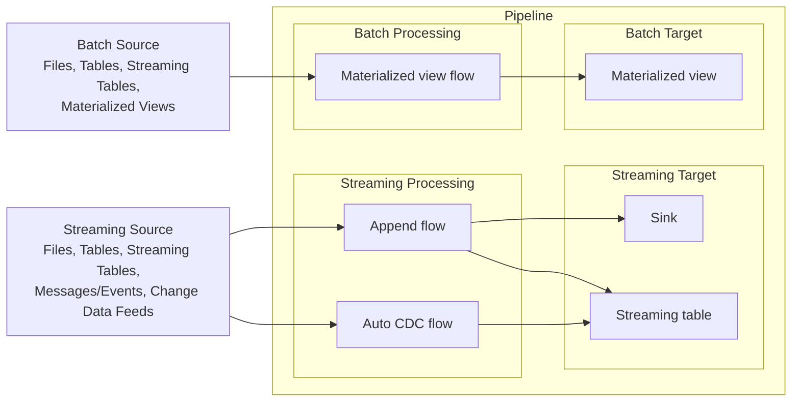
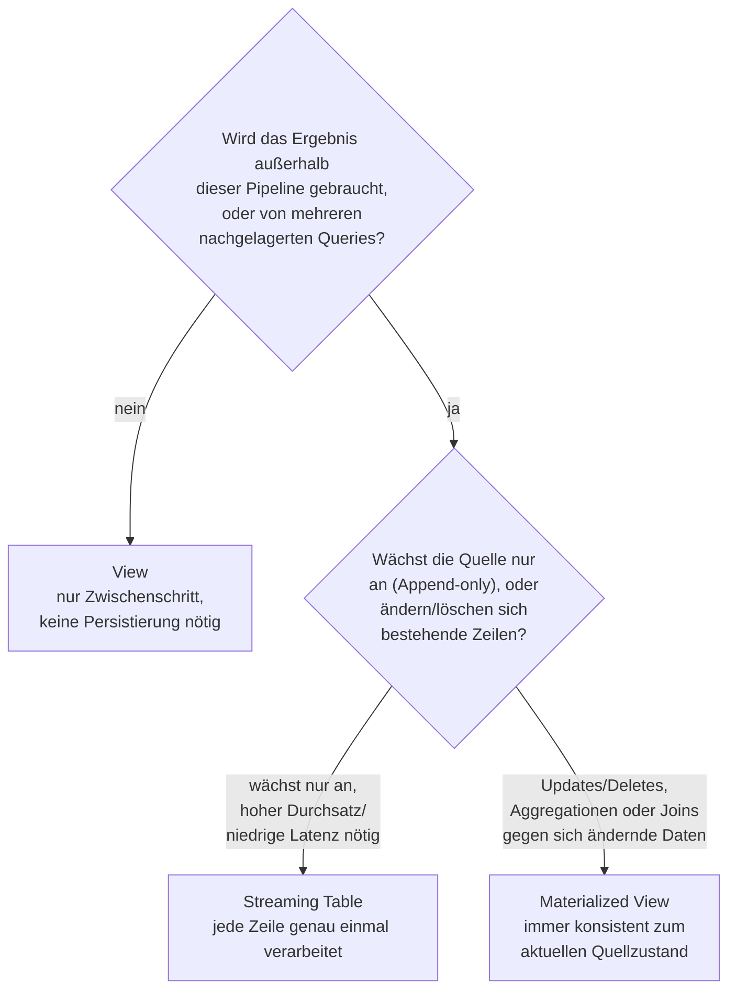

# 03 Lakeflow Pipelines — Gesamtübersicht

Konsolidierte Übersicht aller 126 Original-Markdown-Dateien im Ordner `07 Data Management\01 Data Engineering\03 Lakeflow Pipelines\` (16 Unterordner: Concepts, Tutorials, Build und Entwicklung, Ingestion und Laden von Daten, CDC, Flows, Transformationen, Data Quality/Expectations, Sinks, Governance und Zugriff, Konfiguration und Compute, Unity Catalog und Schema-Verwaltung, Observability, Developer Reference inkl. SQL- und Python-Referenz, Databricks SQL für LDP, Best Practices) mit **allen** enthaltenen Code-Beispielen und einer kurzen, einfachen Einführung pro Thema. Jede Originaldatei bleibt die primäre, ausführliche Quelle — dieses Dokument dient als kompakter Überblick plus vollständige Code-Referenz an einem Ort.

Lakeflow Pipelines ist Databricks' deklaratives Framework für Batch- und Streaming-ETL (früher **Delta Live Tables / DLT**) und baut auf dem offenen **Apache Spark™ Declarative Pipelines (SDP)** auf.

**Verifikationsstatus:** Die Originaldateien zitieren durchgängig offizielle Databricks-Doku-Quellen (`docs.databricks.com`, teils `learn.microsoft.com/azure/databricks`). Für dieses Dokument wurden die Themen zusätzlich gegen aktuelle **Databricks-Blog-Artikel** (`databricks.com/blog`) abgeglichen — Ergebnisse siehe Abschnitt 130 „Verifikationsprotokoll" am Ende dieser Datei.

## Inhalt

1. Übersicht: Was sind Lakeflow-Pipelines?
2. Was ist Spark Declarative Pipelines (SDP)?
3. Wo ist DLT geblieben? (Umbenennung zu Lakeflow-Pipelines)
4. Pipelines (das Konzept)
5. Standalone Pipelines
6. Views
7. Materialized Views
8. Streaming Tables
9. Refresh-Semantik
10. Pipeline-Modi: Triggered vs. Continuous
11. Serverless vs. Classic Compute
12. Tutorials-Übersicht
13. Tutorial: Erste Pipeline
14. Tutorial: Pipelines mit mehreren Quellen (ETL mit CDC)
15. Tutorial: Datei-Pipelines (FILE-Typ und KI-Funktionen)
16. Tutorial: Geodaten-Pipelines
17. Einschränkungen von Lakeflow-Pipelines
18. Pipelines erstellen (Build-Übersichtsseite)
19. Notebook-Entwicklungserfahrung (Legacy)
20. Lakeflow Pipelines Editor (Multi-File-Editor)
21. Python-Module aus Git-Ordnern oder Workspace-Dateien importieren
22. Pipeline-Code in der lokalen Entwicklungsumgebung entwickeln
23. Source Control für Lakeflow Declarative Pipelines
24. Unit Testing für Pipelines
25. Berechtigungen für Lakeflow Declarative Pipelines
26. Konvertierung einer Pipeline in ein Bundle-Projekt
27. Data Engineering Agent (Genie Code Agent Mode)
28. Daten laden in Pipelines
29. Schema-Inferenz und -Evolution mit `from_json` in Pipelines
30. API-Ingestion in Pipelines
31. Azure Event Hubs als Pipeline-Datenquelle
32. Die AUTO-CDC-APIs: CDC-Grundlagen
33. Change Data Feed (CDF) im Kontext von CDC
34. SCD Type 1 vs. Type 2 — konzeptioneller Vergleich
35. Externe RDBMS-Tabelle mit AUTO CDC replizieren
36. Fortgeschrittene AUTO-CDC-Themen
37. Flows — Grundlagen
38. Flows in Lakeflow-Pipelines verwenden (Praxisbeispiele)
39. Flow-Muster: Fan-in, Fan-out und Multiplexing
40. Backfill historischer Daten mit Pipelines
41. Batch-Verarbeitung mit REPLACE-WHERE-Flows
42. Partieller Snapshot-Ersatz mit REPLACE-USING-Flows
43. ForEachBatch: Schreiben in beliebige Daten-Sinks in Pipelines
44. Transformationen in Pipelines deklarieren
45. Inkrementelles Refresh für Materialized Views
46. Full Refresh für Streaming Tables
47. Zustandsbehaftete Verarbeitung mit Watermarks optimieren
48. Expectations: Datenqualitätsprüfungen in Pipelines
49. Erweiterte Expectation-Patterns
50. Sinks: externe Ausgabeziele für Pipeline-Daten
51. Sinks in der Praxis: create_sink() und append_flow
52. Externer Zugriff: External Data Access und Compatibility Mode
53. GDPR / Right to be Forgotten in Lakeflow Pipelines
54. Pipeline konfigurieren: Grundeinstellungen
55. Ziel-Catalog und -Schema festlegen
56. Classic Compute konfigurieren
57. Serverless Compute für Lakeflow Pipelines
58. Enhanced Autoscaling und Vertical Autoscaling
59. Real-Time Mode: Millisekunden-Latenz in Pipelines
60. Pipelines in Workflows orchestrieren (Jobs, Airflow, ADF)
61. Unity Catalog in Lakeflow Declarative Pipelines
62. Hive Metastore (Legacy) in Lakeflow Declarative Pipelines
63. Hive-Metastore-Pipeline zu Unity Catalog klonen
64. Migration zum Default Publishing Mode (DPM)
65. LIVE-Schema (Legacy)
66. ALTER-SQL-Anweisungen mit Pipeline-Datasets nutzen
67. Pipeline-Updates ausführen
68. Pipeline-Properties-Referenz
69. Pipelines parametrisieren
70. Tabellen zwischen Pipelines verschieben
71. Observability-Übersicht: Die drei Monitoring-Ebenen
72. Pipelines in der UI überwachen
73. Pipeline-Event-Log überwachen (Abfragebeispiele)
74. Event-Log-Schema (Feldreferenz)
75. Query History für Pipelines
76. Event Hooks — Custom Monitoring von Pipelines
77. Eine Pipeline nach Streaming-Checkpoint-Fehlschlag wiederherstellen
78. Hohe Initialisierungszeiten in Pipelines beheben
79. Developer Reference — Übersicht
80. SQL vs. Python für Lakeflow Declarative Pipelines
81. SQL-Entwicklung für Lakeflow Declarative Pipelines
82. SQL-Referenz-Übersicht für Lakeflow Declarative Pipelines
83. Python-Entwicklung für Lakeflow Declarative Pipelines
84. Python-API-Referenz — Übersicht
85. Dataset-Definitionsfunktionen
86. Metaprogrammierung mit Python
87. Environment-Versionen
88. Environment-Versionskompatibilität
89. Externe Python-Abhängigkeiten verwalten
90. DLT-Meta
91. SQL-Referenz: CREATE VIEW (Pipelines)
92. SQL-Referenz: CREATE TEMPORARY VIEW (Pipelines)
93. SQL-Referenz: CREATE MATERIALIZED VIEW (Pipelines)
94. SQL-Referenz: REFRESH POLICY-Klausel (Materialized View)
95. SQL-Referenz: CREATE STREAMING TABLE (Pipelines)
96. SQL-Referenz: CREATE TABLE ... FLOW (Pipelines)
97. SQL-Referenz: CREATE FLOW (Pipelines)
98. SQL-Referenz: AUTO CDC ... INTO (Pipelines)
99. SQL-Referenz: REFRESH (MATERIALIZED VIEW oder STREAMING TABLE)
100. `@dp.table` — Streaming-Tabellen per Python-Dekorator definieren
101. `@dp.temporary_view` — temporäre Sichten per Python definieren (Nachfolger von `@view`)
102. `@dp.materialized_view` — Materialized Views per Python definieren
103. `create_streaming_table()` — Zieltabelle für Streaming-Operationen anlegen
104. `create_table()` — Tabelle funktional (ohne Dekorator) anlegen
105. Expectations — Datenqualität mit sechs Dekoratoren erzwingen
106. `@dp.append_flow` — Append-Flows und Backfills definieren
107. `@dp.replace_flow` — Zeilen anhand von Schlüsselspalten ersetzen
108. `@dp.update_flow` — fortlaufend aktualisierte Ergebnisse in einen Sink schreiben
109. `create_auto_cdc_flow()` (früher `apply_changes()`) — Change Data Capture verarbeiten
110. `create_auto_cdc_from_snapshot_flow()` (früher `apply_changes_from_snapshot()`) — Änderungen zwischen Snapshots erkennen
111. `create_sink()` — Daten in Kafka, Event Hubs oder eine Delta-Tabelle schreiben
112. `@dp.foreach_batch_sink` — Micro-Batches mit eigener Python-Logik verarbeiten
113. Databricks SQL für Lakeflow Declarative Pipelines — Übersicht (Standalone Pipelines)
114. Standalone Materialized Views (Databricks SQL) — Grundlagen
115. Standalone Materialized Views konfigurieren
116. Standalone Materialized Views überwachen
117. Refresh-Zeitpläne für Standalone Pipelines
118. Standalone Streaming Tables (Databricks SQL)
119. Flows mit REPLACE WHERE für Standalone Streaming Tables (Databricks SQL)
120. Python für Standalone Pipelines nutzen (Databricks SQL)
121. Anforderungen und Compute für Standalone Pipelines
122. Best Practices für Lakeflow Pipelines — Übersicht
123. Datasets über Lakeflow Pipelines hinweg organisieren
124. Dimensionale Modellierung in Lakeflow Pipelines
125. Verarbeitungsgarantien in Lakeflow Pipelines
126. Produktionsreife für Lakeflow Pipelines
127. Zerobus Ingest — Direktes Streaming in Delta-Tabellen ohne Message Broker
128. Lakeflow Connect — Datenbank- und SaaS-Konnektoren (SQL Server, Salesforce, Workday)
129. Databricks Document Intelligence — KI-gestützte Dokumentenverarbeitung in Lakeflow
130. Verifikationsprotokoll (Databricks-Blog-Abgleich)

---

## 1. Übersicht: Was sind Lakeflow-Pipelines?

**Einfach erklärt:** Lakeflow-Pipelines sind ein deklaratives Framework, mit dem man Batch- und Streaming-Datenpipelines in SQL oder Python baut, ohne die Orchestrierung selbst zu programmieren. Man beschreibt nur, welche Tabellen (Datasets) aus welchen Quellen entstehen sollen — Reihenfolge, Parallelisierung, Fehler-Retries und inkrementelle Verarbeitung übernimmt das System automatisch. Die fünf Kernbausteine sind Pipeline, Flow, Streaming Table, Materialized View und Sink; sie bauen auf Apache Spark™ Declarative Pipelines (SDP) auf.

**Drei Vorteile gegenüber manueller Orchestrierung:**

| Vorteil | Bedeutung |
|---|---|
| Automatische Orchestrierung | Flows laufen in korrekter Reihenfolge, maximal parallel, mit stufenweisen Retries |
| Deklarative Verarbeitung | Wenige Definitionen statt hunderte Zeilen Spark-Code; AUTO-CDC-API für Change Data Capture (SCD 1/2) |
| Inkrementelle Verarbeitung | Materialized Views werden möglichst nur mit neuen/geänderten Daten aktualisiert |

**Drei Dataset-Typen:**

| Dataset-Typ | Verarbeitung |
|---|---|
| Streaming Table | jeder Datensatz genau einmal, Append-only-Quelle vorausgesetzt |
| Materialized View | wird bei Bedarf neu berechnet, um den aktuellen Datenstand zu spiegeln |
| View | wird bei Abfrage ausgewertet, nicht persistiert |

Kernkonzepte-Diagramm aus der Originaldatei (Mermaid, nachgezeichnet):



Kein SQL/Python-Code-Beispiel in dieser Übersichtsdatei — sie verweist für Details auf die jeweiligen Einzeldateien (Flows, Sinks, Pipelines, Ingestion, Data Quality).

---

## 2. Was ist Spark Declarative Pipelines (SDP)?

**Einfach erklärt:** Apache Spark™ Declarative Pipelines (SDP) ist das offene, portable Fundament, auf dem Lakeflow-Pipelines aufbauen. SDP selbst ist bereits ein deklaratives Framework für Batch- und Streaming-Pipelines in SQL und Python mit automatischer Orchestrierung und Abhängigkeitsauflösung. Lakeflow-Pipelines (früher Delta Live Tables/DLT) fügen darauf produktionsorientierte Zusatzfunktionen hinzu: AUTO-CDC (inkl. SCD Type 1 und 2), Datenqualitäts-Expectations, abfragbares Event-Logging sowie Update-Flows und Continuous-Processing-Modi. Der Vorteil: Transformationscode bleibt über verschiedene SDP-Laufzeiten portabel statt an ein proprietäres System gebunden zu sein.

**Typische Anwendungsfälle laut Doku:**
- Einlesen von Daten aus Cloud-Speicher (S3, ADLS Gen2, Google Cloud Storage) und Message-Bussen (Kafka, Kinesis, Pub/Sub, EventHub, Pulsar)
- Inkrementelle Batch- und Streaming-Transformationen

Keine Code-Beispiele in dieser Datei — reiner Konzeptüberblick über drei Übersichtsseiten (Startseite, Concepts-Übersicht, SDP-Fundament-Seite).

---

## 3. Wo ist DLT geblieben? (Umbenennung zu Lakeflow-Pipelines)

**Einfach erklärt:** Das Produkt, das früher Delta Live Tables (DLT) hieß, heißt jetzt Lakeflow-Pipelines — eine reine Umbenennung, keine erzwungene Migration. Bestehender DLT-Code funktioniert unverändert weiter. Wer die neuen Namen nutzen will, kann im Python-Code `import dlt` durch `from pyspark import pipelines as dp` ersetzen; die SQL-Syntax selbst blieb durch diese Umbenennung unverändert, nur ältere `LIVE`-Schlüsselwörter (aus DLT-Frühzeit) gelten als veraltet zugunsten moderner Syntax ohne `LIVE`.

**Python-API-Namensänderungen:**
- `@dlt` → `@dp`
- `@table` erzeugt jetzt Streaming Tables; neuer Decorator `@materialized_view` erzeugt Materialized Views
- `@view` → `@temporary_view`

**SQL: identische Syntax für aktuelle Befehle, aber veraltete `LIVE`-Varianten existieren noch:**

| Bereich | DLT-Syntax | SDP-Syntax (Lakeflow und Apache, wo zutreffend) | In Apache Spark verfügbar |
|---|---|---|---|
| SQL – Streaming Table | `CREATE STREAMING TABLE ...` | `CREATE STREAMING TABLE ...` | Ja |
| SQL – Materialized View | `CREATE MATERIALIZED VIEW ...` | `CREATE MATERIALIZED VIEW ...` | Ja |
| SQL – Flow | `CREATE FLOW ...` | `CREATE FLOW ...` | Ja |

| Veraltet (DLT) | Modern (SDP) |
|---|---|
| `CREATE OR REFRESH STREAMING LIVE TABLE` | `CREATE OR REFRESH STREAMING TABLE` |
| `CREATE OR REFRESH LIVE TABLE` | `CREATE OR REFRESH MATERIALIZED VIEW` |
| `CREATE LIVE VIEW` / `CREATE TEMPORARY LIVE VIEW` | `CREATE VIEW` / `CREATE TEMPORARY VIEW` |

**Verbleibende DLT-Referenzen:** Die klassischen SKUs für Lakeflow-Pipelines beginnen weiterhin mit `DLT`; Event-Log-Schemas mit `dlt` im Namen wurden nicht geändert; Python-APIs mit `dlt` im Namen funktionieren weiter, sind aber nicht mehr empfohlen.

Keine eigenständigen Code-Beispiele in dieser Datei (nur die Syntax-Fragmente in den Tabellen oben).

---

## 4. Pipelines (das Konzept)

**Einfach erklärt:** Eine Pipeline ist die zentrale Entwicklungs- und Ausführungseinheit von Lakeflow — der Container für alle darin definierten Flows, Streaming Tables, Materialized Views und Sinks. Beim Ausführen ("Update") analysiert die Pipeline automatisch die Abhängigkeiten zwischen ihren Datasets, ordnet sie in einem gerichteten azyklischen Graphen (DAG) an und führt sie in der richtigen Reihenfolge aus. Quellcode kann in SQL oder Python geschrieben werden (pro Datei jeweils nur eine Sprache), und die Reihenfolge der Dateien im Projekt spielt keine Rolle, da Abhängigkeiten automatisch erkannt werden.

**Vier Pipeline-Typen:**

| Typ | Bedeutung |
|---|---|
| ETL | Standard-Lakeflow-Pipeline |
| Ingestion | verwaltete Ingestion-Pipeline über Lakeflow Connect |
| MV/ST | Standalone-Pipeline für eine einzelne Materialized View bzw. Streaming Table |
| Database Table Sync | Pipeline, die eine Tabelle mit einer Lakebase-Datenbank synchronisiert |

Pipeline-Updates laufen entweder **Triggered** (einmal bis zur Fertigstellung) oder **Continuous** (fortlaufend). Der **Lakeflow-Pipelines-Editor** bietet Multi-File-Editing, visuelle Abhängigkeitsgraphen, Datenvorschauen und Git-Integration. Alle von einer Pipeline verwalteten Tabellen sind Delta-Tabellen mit vollen Delta-Lake-Garantien (ACID, Time Travel, Schema Enforcement) plus automatischer Wartung über Predictive Optimization (`OPTIMIZE`, `VACUUM`).

Keine Code-Beispiele in dieser Datei — reiner Konzeptüberblick.

---

## 5. Standalone Pipelines

**Einfach erklärt:** Es gibt zwei Wege, Materialized Views und Streaming Tables zu erstellen: als **Standalone**-Objekt (ein einzelnes Dataset, per SQL aus einem SQL-Warehouse oder Serverless-Notebook definiert, Databricks verwaltet die Pipeline dahinter automatisch) oder als Teil einer vollwertigen **Lakeflow-Pipeline** (viele Datasets, SQL und Python, mit Abhängigkeitsorchestrierung und Lineage). Beide laufen auf derselben deklarativen Engine und erzeugen von Unity Catalog verwaltete Tabellen — der Unterschied liegt nur darin, wie viel Orchestrierung man selbst autoriert.

**Vergleichstabelle:**

| Eigenschaft | Standalone Streaming Table / Materialized View | Pipeline Streaming Table / Materialized View |
|---|---|---|
| Authoring-Schnittstelle | SQL-Syntax, über ein Databricks-SQL-Warehouse oder mit `spark.sql()` in einem Notebook auf Serverless General Compute | SQL und Python |
| Umfang | Ein Dataset, in einer von Databricks verwalteten Pipeline | Viele Datasets in einer Pipeline, mit Abhängigkeitsorchestrierung und Lineage |
| Ausführung | Triggered, mit `SCHEDULE`, `TRIGGER ON UPDATE` oder einem SQL-Task | Triggered oder Continuous |
| Nur-Pipeline-Funktionen | — | Sinks, `create_auto_cdc_from_snapshot_flow()`, private Datasets |
| Pipeline-Typ-Label | `MV/ST` | `ETL` |
| Verschieben zwischen Pipelines | Nicht unterstützt; Tabelle muss in Ziel-Pipeline neu erstellt werden | Unterstützt |

Standalone-Pipelines eignen sich für einzelne beschleunigte Abfragen/Transformationen ohne Sinks oder Multi-Stage-Orchestrierung; Lakeflow-Pipelines für mehrstufige Pipelines mit Zwischen-Datasets, Python-Autoring, Sinks oder CDC aus Datenbank-Snapshots.

Keine Code-Beispiele in dieser Datei.

---

## 6. Views

**Einfach erklärt:** Eine View wird bei jeder Abfrage neu berechnet und nicht gespeichert — sie ist keine Unity-Catalog-verwaltete Tabelle, verursacht also keine Speicherkosten und keinen eigenen Refresh-Zyklus. Views eignen sich, um große Queries in wartbare Teilschritte zu zerlegen, Zwischenergebnisse mit Expectations zu validieren, ohne sie zu veröffentlichen, oder um Speicher-/Compute-Kosten zu sparen. Anders als Streaming Tables und Materialized Views ist eine View nur innerhalb der Pipeline abfragbar, die sie definiert.

**Entscheidungsdiagramm (aus dem Original, nachgezeichnet):**



| | View | Materialized View | Streaming Table |
|---|---|---|---|
| Persistiert? | nein, bei jeder Abfrage neu berechnet | ja, als Unity-Catalog-Tabelle | ja, als Unity-Catalog-Tabelle |
| Außerhalb der Pipeline abfragbar? | nein | ja | ja |
| Verarbeitungssemantik | on demand | Batch, hält Ergebnis konsistent zum aktuellen Quellzustand | jede Zeile genau einmal (Append-only-Quelle vorausgesetzt) |
| Passt zu | Zwischenschritte, Validierung, Kostenersparnis | Aggregationen/Joins gegen sich ändernde Daten, mehrere Konsumenten, Zwischenprüfung während Entwicklung | kontinuierlich wachsende Quellen, hoher Durchsatz, niedrige Latenz |

```python
from pyspark import pipelines as dp

@dp.view
def customers_filtered():
  return spark.read.table("customers_raw").where("email IS NOT NULL")
```

```sql
CREATE OR REFRESH TEMPORARY VIEW customers_filtered
AS SELECT * FROM customers_raw WHERE email IS NOT NULL;
```

---

## 7. Materialized Views

**Einfach erklärt:** Eine Materialized View cacht das Ergebnis einer Query und aktualisiert es in festgelegten Intervallen, statt bei jeder Abfrage neu zu rechnen — dadurch sind Abfragen deutlich schneller als gegen normale Views. Das System verfolgt Änderungen an vorgelagerten Daten nach und verarbeitet bei einem Update nach Möglichkeit nur die geänderten Daten (inkrementell), garantiert aber immer ein korrektes Ergebnis — notfalls durch vollständige Neuberechnung. Materialized Views eignen sich für Aggregationen/Joins gegen sich ändernde Daten und werden von Databricks in `__databricks_internal` gespeichert (Metadaten über Unity Catalog, Daten im Cloud-Speicher).

**Einschränkungen:**
- Nicht für Low-Latency-Anwendungsfälle gedacht (Sekunden/Minuten, nicht Millisekunden)
- Nicht jede Berechnung lässt sich inkrementell durchführen
- Keine Unterstützung für `CLONE`-Operationen
- UDF-Verhaltensänderungen können ein manuelles vollständiges Refresh erfordern

Eine Materialized View ist zugleich ein eigener Batch-**Flow-Typ**, der stets implizit als Teil ihrer Definition angelegt wird (anders als bei Streaming Tables lässt er sich nicht separat vom Ziel definieren).

```sql
CREATE OR REPLACE MATERIALIZED VIEW regional_sales
AS SELECT *
FROM partners
  INNER JOIN sales ON
    partners.partner_id = sales.partner_id;
```

---

## 8. Streaming Tables

**Einfach erklärt:** Eine Streaming Table ist eine Delta-Tabelle mit zusätzlicher Unterstützung für Streaming- bzw. inkrementelle Verarbeitung: Jede eingehende Zeile wird nur einmal verarbeitet, was sie ideal für große Mengen an Append-only-Daten macht (z. B. Dateneingang über Auto Loader, Kafka, Event Hubs, Pub/Sub). Für sich ändernde Quelldaten (Updates/Deletes) sollte statt einfachem Anhängen `AUTO CDC` verwendet werden. Eine Streaming Table wird immer nur von einer einzigen Pipeline besessen und aktualisiert, auch wenn mehrere Flows an sie anhängen können.

**Wichtige Einschränkungen (laut GCP-Doku fünf, AWS-Doku vier):**
1. Begrenzte Evolution — Query-Änderungen wirken sich nur auf neu verarbeitete Zeilen aus, außer bei Full Refresh
2. Low-Latency-Anforderungen brauchen natürlich begrenzte oder watermark-begrenzte Streams
3. Joins werden bei Änderungen der Dimensionstabellen nicht neu berechnet ("fast-but-wrong")
4. Keine `CLONE`-Unterstützung
5. `REFRESH`-Privileg für Nicht-Admins erforderlich, um dahinterliegende Pipelines einzusehen

Für Low-Latency-Workloads mit Sub-Sekunden-Latenz existiert der separate **Real-Time Mode**.

Keine Code-Beispiele in dieser Datei — reiner Konzeptüberblick.

---

## 9. Refresh-Semantik

**Einfach erklärt:** Läuft ein Pipeline-Update, werden die definierten Materialized Views und Streaming Tables aktualisiert, damit sie den aktuellen Zustand der Quelldaten widerspiegeln. Es gibt drei Refresh-Arten: **Default Refresh** (Streaming Tables verarbeiten nur neue Datensätze; Materialized Views wählen inkrementell oder vollständig, auf Serverless per Kostenmodell), **Full Refresh** (alle Datensätze werden neu verarbeitet, bei Streaming Tables inkl. Truncate und Checkpoint-Löschung — nur bei Bedarf, z. B. inkompatible Schema-Änderung) und **Reset Checkpoints** (nur für Streaming Tables: löscht Checkpoints ausgewählter Flows, ohne bereits geschriebene Daten zu löschen, und verarbeitet die Quelle über diese Flows neu).

Zentraler Unterschied: Streaming Tables priorisieren beim Standard-Refresh geringere Zeit-/Ressourcenkosten, während Materialized Views volle Korrektheit bewahren, indem sie automatisch zwischen inkrementeller und vollständiger Neuberechnung wählen.

Keine Code-Beispiele in dieser Datei.

---

## 10. Pipeline-Modi: Triggered vs. Continuous

**Einfach erklärt:** Der **Triggered**-Modus aktualisiert die verfügbaren Daten einmal und stoppt dann; der **Continuous**-Modus hält Tabellen fortlaufend aktuell, sobald neue Daten eintreffen. Für Millisekunden-Latenzen gibt es den separaten Real-Time Mode. Der Pipeline-Modus ist unabhängig vom Tabellentyp — sowohl Materialized Views als auch Streaming Tables lassen sich in beiden Modi aktualisieren. Standalone Materialized Views und Streaming Tables laufen dagegen immer im Triggered-Modus.

**Vergleichstabelle:**

| Schlüsselfrage | Triggered | Continuous |
|---|---|---|
| Wann stoppt das Update? | Automatisch, sobald abgeschlossen. | Läuft fortlaufend, bis manuell gestoppt. |
| Welche Daten werden verarbeitet? | Daten, die beim Start des Updates verfügbar sind. | Alle Daten, sobald sie an den konfigurierten Quellen eintreffen. |
| Für welche Aktualitätsanforderungen am besten geeignet? | Datenupdates alle 10 Minuten, stündlich oder täglich. | Datenupdates alle 10 Sekunden bis wenige Minuten gewünscht. |

Triggered Pipelines senken Ressourcenverbrauch/Kosten (Cluster läuft nur so lange wie nötig), Continuous Pipelines brauchen einen dauerhaft laufenden Cluster (teurer, aber niedrigere Latenz). Databricks empfiehlt, Continuous Pipelines über einen **Continuous Job** statt über die eingebaute Pipeline-Einstellung "Continuous" zu betreiben — der Job steuert dann den Ausführungsmodus und hat Vorrang vor der Pipeline-Einstellung **Pipeline Mode**. Daher wird empfohlen, **Pipeline Mode** auf Triggered zu belassen, wenn die Pipeline in einen Continuous Job eingebettet ist.

Das Trigger-Intervall für Continuous-Pipelines lässt sich über `pipelines.trigger.interval` steuern (pro Flow oder pipeline-weit) — relevant ausschließlich für Continuous Pipelines, da eine Triggered Pipeline jede Tabelle nur einmal verarbeitet.

Keine Code-Beispiele in dieser Datei.

---

## 11. Serverless vs. Classic Compute

**Einfach erklärt:** Jede Lakeflow-Pipeline läuft entweder auf Serverless- oder Classic-Compute — eine reine Pro-Pipeline-Einstellung, keine automatische Entscheidung. Databricks empfiehlt Serverless für nahezu alle Pipelines: Databricks verwaltet die gesamte Infrastruktur (keine Cluster-Konfiguration nötig) und schaltet Zusatzfunktionen frei, die Classic Compute nicht bietet — insbesondere **inkrementelles Refresh für Materialized Views**, das ausschließlich auf Serverless verfügbar ist (auf Classic werden Materialized Views immer vollständig neu berechnet).

**Vergleichstabelle:**

| Fähigkeit | Serverless | Classic |
|---|---|---|
| Infrastrukturverwaltung | Databricks verwaltet die gesamte Infrastruktur. Keine Cluster-Konfiguration nötig. | Cluster müssen konfiguriert werden, einschließlich Autoscaling, Instance-Typen und Cluster-Policies. |
| Inkrementelles Refresh für Materialized Views | Unterstützt, wann immer kosteneffizient. | Nicht unterstützt — immer vollständige Neuberechnung. |
| Autoscaling | Horizontal und vertikal (größere Executors). | Nur horizontal, Instance-Typen selbst gewählt. |
| Stream Pipelining | Standardmäßig aktiviert (parallele Microbatches). | Nicht verfügbar. |
| Berechtigung zur Compute-Erstellung | Nicht erforderlich. | Erforderlich (uneingeschränkte Cluster-Erstellung oder Compute-Policy). |
| Compute-Policies/Instance-Typen | Von Databricks verwaltet. | Manuell konfiguriert. |
| Unity Catalog | Immer verwendet. | Unity Catalog oder Legacy-Hive-Metastore möglich. |
| Kostenzuordnung | Custom Tags über Serverless-Nutzungsrichtlinie. | Tags direkt an der Pipeline, manuell mit Abrechnung verknüpfen. |
| Update-/Wartungscluster | Von Databricks verwaltet. | Separat selbst konfiguriert. |
| Single-Node-Compute | Nicht nötig, automatisch dimensioniert. | Selbst konfiguriert für kleine Workloads. |

**Classic Compute nur nötig, wenn:** Tabellen den Legacy-Hive-Metastore verwenden, privates Networking benötigt wird, oder die Region kein Serverless unterstützt. Der Compute-Typ wird in den Pipeline-**Compute**-Einstellungen über den Schalter **Serverless** gesetzt; neue Pipelines nutzen standardmäßig Serverless.

Keine Code-Beispiele in dieser Datei.

---

## 12. Tutorials-Übersicht

**Einfach erklärt:** Die offizielle Tutorials-Seite bietet praktische Übungen von der ersten Pipeline über ETL mit CDC bis zu geografischem Dateneingang und quellcodeverwalteten Bundles. Sie listet sieben Haupt-Tutorials: (1) Erste Pipeline erstellen, (2) CDC-Pipeline (Change Data Capture), (3) SQL-ETL (inkrementelle Pipeline mit Streaming Tables, AUTO CDC, Materialized Views), (4) Geodaten-Pipeline (GPS-Daten gegen Lager-Geofences), (5) Datei-Verarbeitungs-Pipeline (unstrukturierte Dokumente mit KI-Funktionen), (6) quellcodeverwaltete Pipeline mit Declarative Automation Bundles und Git-Ordnern, (7) Konvertierung einer bestehenden Pipeline in ein Bundle-Projekt. In diesem Themenblock werden die Tutorials 1, 2, 4 und 5 als eigene Dateien vollständig mit Code ausgearbeitet (siehe die folgenden vier Abschnitte); die Tutorials 3, 6 und 7 liegen außerhalb des zugewiesenen Themenblocks.

Keine Code-Beispiele in dieser Übersichtsdatei selbst.

---

## 13. Tutorial: Erste Pipeline

**Einfach erklärt:** Dieses Einsteiger-Tutorial zeigt, wie man im Lakeflow-Pipelines-Editor eine neue Pipeline mit Beispielcode erstellt und dann schrittweise erweitert: zuerst werden ungültige Datensätze über Expectations herausgefiltert, danach wird eine Analyse-Query gebaut, die die Top-100-Nutzer nach Buchungsanzahl ermittelt. Voraussetzungen sind ein Databricks-Workspace mit aktiviertem Unity Catalog, Compute-Zugriff sowie Berechtigungen zum Erstellen von Schemas und Pipelines.

**Schritt 1 — Pipeline erstellen:** Über **New → ETL Pipeline**, optional Name/Katalog/Schema/Sprache (Python oder SQL) wählen, dann **Use sample code** und **Run pipeline**. Danach existieren zwei Tabellen (`sample_users_<date_time>`, `sample_aggregation_<date_time>`) aus der Beispieldatenquelle `wanderbricks`.

**Schritt 2 — Datenqualitätsprüfungen anwenden:** Zeilen ohne E-Mail-Adresse werden über eine Expectation verworfen.

```sql
-- Zeilen ohne E-Mail-Adresse verwerfen
CREATE MATERIALIZED VIEW users_cleaned(
  CONSTRAINT non_null_email EXPECT (email IS NOT NULL) ON VIOLATION DROP ROW)
AS SELECT * FROM sample_users_<date_time>;
```

```python
from pyspark import pipelines as dp

@dp.materialized_view
@dp.expect_or_drop("no null emails", "email IS NOT NULL")
def users_cleaned():
    return spark.read.table("sample_users_<date_time>")
```

**Schritt 3 — Top-User analysieren:** Die bereinigten Nutzerdaten werden mit den Buchungen verknüpft, um die Top-100-Nutzer nach Buchungsanzahl zu ermitteln.

```sql
CREATE OR REFRESH MATERIALIZED VIEW users_and_bookings AS
SELECT u.name AS name, COUNT(b.booking_id) AS booking_count
FROM users_cleaned u
JOIN samples.wanderbricks.bookings b ON u.user_id = b.user_id
GROUP BY u.name ORDER BY booking_count DESC LIMIT 100;
```

```python
from pyspark import pipelines as dp
from pyspark.sql.functions import col, count, desc

@dp.materialized_view
def users_and_bookings():
    return (spark.read.table("users_cleaned")
        .join(spark.read.table("samples.wanderbricks.bookings"), "user_id")
        .groupBy(col("name"))
        .agg(count("booking_id").alias("booking_count"))
        .orderBy(desc("booking_count")).limit(100))
```

Nach diesem Schritt enthält der Pipeline-Graph vier Tabellen. Weiterführend empfiehlt die Doku: Selective Execution, Data Previews, interaktiver Pipeline-Graph, Integration mit Declarative Automation Bundles.

---

## 14. Tutorial: Pipelines mit mehreren Quellen (ETL mit CDC)

**Einfach erklärt:** Dieses Tutorial baut eine vollständige Bronze/Silver/Gold-Pipeline mit Change Data Capture (CDC): Künstliche Kundendaten mit Operationen `APPEND`/`DELETE`/`UPDATE` werden per Auto Loader eingelesen, bereinigt, und dann mit `AUTO CDC` sowohl als aktueller Stand (SCD Type 1) als auch als vollständige Änderungshistorie (SCD Type 2) materialisiert. Voraussetzungen: aktiviertes Unity Catalog, verfügbares Serverless Compute, Berechtigungen für Schema/Volume-Erstellung sowie Pipeline-Rechte.

**Schritt 1 — Pipeline erstellen:** Über **New → ETL Pipeline**, Name/Katalog/Schema/Sprache wählen, **Use sample code**.

**Schritt 2 — Beispieldaten erzeugen** (mit `Faker`):

```python
%pip install faker

catalog = "<my_catalog>"
schema = db = dbName = db = "<my_schema>"
spark.sql(f'USE CATALOG `{catalog}`')
spark.sql(f'USE SCHEMA `{schema}`')
spark.sql(f'CREATE VOLUME IF NOT EXISTS `{catalog}`.`{db}`.`raw_data`')
```

```python
volume_folder = f"/Volumes/{catalog}/{db}/raw_data"
try:
  dbutils.fs.ls(volume_folder+"/customers")
except:
  print(f"folder doesn't exist, generating the data under {volume_folder}...")
  from pyspark.sql import functions as F
  from faker import Faker
  from collections import OrderedDict
  import uuid
  fake = Faker()
  import random
  fake_firstname = F.udf(fake.first_name)
  fake_lastname = F.udf(fake.last_name)
  fake_email = F.udf(fake.ascii_company_email)
  fake_date = F.udf(lambda:fake.date_time_this_month().strftime("%m-%d-%Y %H:%M:%S"))
  fake_address = F.udf(fake.address)
  operations = OrderedDict([("APPEND", 0.5),("DELETE", 0.1),("UPDATE", 0.3),(None, 0.01)])
  fake_operation = F.udf(lambda:fake.random_elements(elements=operations, length=1)[0])
  fake_id = F.udf(lambda: str(uuid.uuid4()) if random.uniform(0, 1) < 0.98 else None)
  df = spark.range(0, 100000).repartition(100)
  df = df.withColumn("id", fake_id())
  df = df.withColumn("firstname", fake_firstname())
  df = df.withColumn("lastname", fake_lastname())
  df = df.withColumn("email", fake_email())
  df = df.withColumn("address", fake_address())
  df = df.withColumn("operation", fake_operation())
  df_customers = df.withColumn("operation_date", fake_date())
  df_customers.repartition(100).write.format("json").mode("overwrite").save(volume_folder+"/customers")
```

```python
catalog = "<my_catalog>"
schema = "<my_schema>"
display(spark.read.json(f"/Volumes/{catalog}/{schema}/raw_data/customers"))
```

**Schritt 3 — Inkrementeller Dateneingang mit Auto Loader (Bronze):**

```python
from pyspark import pipelines as dp
from pyspark.sql.functions import *

path = "/Volumes/<catalog>/<schema>/raw_data/customers"
dp.create_streaming_table("customers_cdc_bronze",
  comment="New customer data incrementally ingested from cloud object storage landing zone")

@dp.append_flow(target = "customers_cdc_bronze", name = "customers_bronze_ingest_flow")
def customers_bronze_ingest_flow():
  return (
      spark.readStream
          .format("cloudFiles")
          .option("cloudFiles.format", "json")
          .option("cloudFiles.inferColumnTypes", "true")
          .load(f"{path}")
  )
```

```sql
CREATE OR REFRESH STREAMING TABLE customers_cdc_bronze
COMMENT "New customer data incrementally ingested from cloud object storage landing zone";

CREATE FLOW customers_bronze_ingest_flow AS
INSERT INTO customers_cdc_bronze BY NAME
  SELECT *
  FROM STREAM read_files(
    "/Volumes/<catalog>/<schema>/raw_data/customers",
    format => "json",
    inferColumnTypes => "true"
  )
```

**Schritt 4 — Bereinigung und Expectations (Silver):**

```python
from pyspark import pipelines as dp
from pyspark.sql.functions import *

dp.create_streaming_table(
  name = "customers_cdc_clean",
  expect_all_or_drop = {"no_rescued_data": "_rescued_data IS NULL",
"valid_id": "id IS NOT NULL",
"valid_operation": "operation IN ('APPEND', 'DELETE', 'UPDATE')"}
  )

@dp.append_flow(target = "customers_cdc_clean",
  name = "customers_cdc_clean_flow")
def customers_cdc_clean_flow():
  return (
      spark.readStream.table("customers_cdc_bronze")
          .select("address", "email", "id", "firstname", "lastname",
          "operation", "operation_date", "_rescued_data")
  )
```

```sql
CREATE OR REFRESH STREAMING TABLE customers_cdc_clean (
  CONSTRAINT no_rescued_data EXPECT (_rescued_data IS NULL) ON VIOLATION DROP ROW,
  CONSTRAINT valid_id EXPECT (id IS NOT NULL) ON VIOLATION DROP ROW,
  CONSTRAINT valid_operation EXPECT (operation IN ('APPEND', 'DELETE', 'UPDATE'))
    ON VIOLATION DROP ROW)
COMMENT "New customer data incrementally ingested from cloud object storage landing zone";

CREATE FLOW customers_cdc_clean_flow AS
INSERT INTO customers_cdc_clean BY NAME
SELECT * FROM STREAM customers_cdc_bronze;
```

**Schritt 5 — Customers-Tabelle mit AUTO CDC materialisieren (Gold, SCD Type 1):**

```python
from pyspark import pipelines as dp
from pyspark.sql.functions import *

dp.create_streaming_table(name="customers",
  comment="Clean, materialized customers")

dp.create_auto_cdc_flow(
  target="customers",
  source="customers_cdc_clean",
  keys=["id"],
  sequence_by=col("operation_date"),
  ignore_null_updates=False,
  apply_as_deletes=expr("operation = 'DELETE'"),
  except_column_list=["operation", "operation_date", "_rescued_data"],
)
```

```sql
CREATE OR REFRESH STREAMING TABLE customers;

CREATE FLOW customers_cdc_flow
AS AUTO CDC INTO customers
FROM stream(customers_cdc_clean)
KEYS (id)
APPLY AS DELETE WHEN
operation = "DELETE"
SEQUENCE BY operation_date
COLUMNS * EXCEPT (operation, operation_date, _rescued_data)
STORED AS SCD TYPE 1;
```

**Schritt 6 — Update-Historie mit SCD Type 2 nachverfolgen:**

```python
from pyspark import pipelines as dp
from pyspark.sql.functions import *

dp.create_streaming_table(
    name="customers_history",
    comment="Slowly Changing Dimension Type 2 for customers")

dp.create_auto_cdc_flow(
    target="customers_history",
    source="customers_cdc_clean",
    keys=["id"],
    sequence_by=col("operation_date"),
    ignore_null_updates=False,
    apply_as_deletes=expr("operation = 'DELETE'"),
    except_column_list=["operation", "operation_date", "_rescued_data"],
    stored_as_scd_type="2",
)
```

```sql
CREATE OR REFRESH STREAMING TABLE customers_history;

CREATE FLOW customers_history_cdc
AS AUTO CDC INTO customers_history
FROM stream(customers_cdc_clean)
KEYS (id)
APPLY AS DELETE WHEN
operation = "DELETE"
SEQUENCE BY operation_date
COLUMNS * EXCEPT (operation, operation_date, _rescued_data)
STORED AS SCD TYPE 2;
```

**Schritt 7 — Materialized View für Aggregation erstellen:**

```python
from pyspark import pipelines as dp
from pyspark.sql.functions import *

@dp.table(
  name = "customers_history_agg",
  comment = "Aggregated customer history")
def customers_history_agg():
  return (
    spark.read.table("customers_history")
      .groupBy("id")
      .agg(
          count_distinct("address").alias("address_count"),
          count_distinct("email").alias("email_count"),
          count_distinct("firstname").alias("firstname_count"),
          count_distinct("lastname").alias("lastname_count")
      )
  )
```

```sql
CREATE OR REPLACE MATERIALIZED VIEW customers_history_agg AS
SELECT
  id,
  count(distinct address) as address_count,
  count(distinct email) AS email_count,
  count(distinct firstname) AS firstname_count,
  count(distinct lastname) AS lastname_count
FROM customers_history
GROUP BY id
```

**Schritt 8 — Job zur Zeitplanung erstellen:** Über den **Schedule**-Button im Editor, **Add schedule** im Dialog **Schedules**, optional Job-Name, Zeitplan-Einstellung setzen, mit **Create** bestätigen.

---

## 15. Tutorial: Datei-Pipelines (FILE-Typ und KI-Funktionen)

**Einfach erklärt:** Dieses Tutorial zeigt eine Medaillon-Pipeline, die unstrukturierte Dokumente (PDF-Verträge) Ende-zu-Ende verarbeitet: Bronze liest sie als verwaltete `FILE`-Referenzen ein, Silver parst und klassifiziert sie mit KI-Funktionen (`ai_parse_document`, `ai_classify`), Gold extrahiert strukturierte Felder je Vertragstyp mit `ai_extract`. Der `FILE`-Datentyp sowie die genannten KI-Funktionen befinden sich im Preview-Status und müssen von einem Workspace-Admin über **Manage Databricks previews** aktiviert werden; zusätzlich wird ein beschreibbares Unity-Catalog-Volume für den `FileSpace` der Bronze-Tabelle benötigt.

**Schritt 1 — Bronze: Verträge als FILE-Referenzen einlesen:**

```sql
CREATE OR REFRESH STREAMING TABLE raw_contracts (
  path STRING,
  size BIGINT,
  modification_time TIMESTAMP,
  file FILE MANAGED)
TBLPROPERTIES ('databricks.filespace-preview' = '/Volumes/my_catalog/my_schema/filespace/')
AS SELECT *
  FROM STREAM read_files(
    '/Volumes/samples/sec/contracts/',
    format => 'file');
```

```python
from pyspark import pipelines as dp

@dp.table(
  name="raw_contracts",
  schema="path STRING, size BIGINT, modification_time TIMESTAMP, file FILE MANAGED",
  table_properties={"databricks.filespace-preview": "/Volumes/my_catalog/my_schema/filespace/"})
def raw_contracts():
  return (
    spark.readStream.format("cloudFiles")
      .option("cloudFiles.format", "file")
      .load("/Volumes/samples/sec/contracts/")
  )
```

**Schritt 2 — Silver: Parsen und Klassifizieren:**

```sql
CREATE OR REFRESH MATERIALIZED VIEW parsed_contracts AS
  SELECT
    path,
    ai_parse_document(file) AS parsed
  FROM raw_contracts;
```

```python
@dp.materialized_view(name="parsed_contracts")
def parsed_contracts():
  return (
    spark.read.table("raw_contracts")
      .selectExpr("path", "ai_parse_document(file) AS parsed")
  )
```

```sql
CREATE OR REFRESH MATERIALIZED VIEW classified_contracts AS
  SELECT
    path,
    parsed,
    ai_classify(
      parsed,
      '["affiliate_agreement", "marketing_agreement", "consulting_agreement", "hosting_agreement", "escrow_agreement"]',
      map('version', '2.1')
    ):response[0].value::STRING AS contract_type
  FROM parsed_contracts
  WHERE is_variant_null(parsed:error_status);
```

```python
@dp.materialized_view(name="classified_contracts")
def classified_contracts():
  return (
    spark.read.table("parsed_contracts")
      .filter("is_variant_null(parsed:error_status)")
      .selectExpr(
        "path",
        "parsed",
        """ai_classify(
             parsed,
             '["affiliate_agreement", "marketing_agreement", "consulting_agreement", "hosting_agreement", "escrow_agreement"]',
             map('version', '2.1')
           ):response[0].value::STRING AS contract_type""")
  )
```

**Schritt 3 — Gold: Strukturierte Felder extrahieren** (für `consulting_agreement`):

```sql
CREATE OR REFRESH MATERIALIZED VIEW consulting_agreements AS
  WITH extracted AS (
    SELECT
      path,
      ai_extract(
        parsed,
        '["company_name", "consultant_name", "compensation_amount", "effective_date"]',
        map('version', '2.1')
      ) AS fields
    FROM classified_contracts
    WHERE contract_type = 'consulting_agreement'
  )
  SELECT
    path,
    fields:response.company_name.value::STRING AS company_name,
    fields:response.consultant_name.value::STRING AS consultant_name,
    fields:response.compensation_amount.value::STRING AS compensation_amount,
    fields:response.effective_date.value::STRING AS effective_date
  FROM extracted;
```

```python
@dp.materialized_view(name="consulting_agreements")
def consulting_agreements():
  return (
    spark.read.table("classified_contracts")
      .filter("contract_type = 'consulting_agreement'")
      .selectExpr(
        "path",
        """ai_extract(
             parsed,
             '["company_name", "consultant_name", "compensation_amount", "effective_date"]',
             map('version', '2.1')
           ) AS fields""")
      .selectExpr(
        "path",
        "fields:response.company_name.value::STRING AS company_name",
        "fields:response.consultant_name.value::STRING AS consultant_name",
        "fields:response.compensation_amount.value::STRING AS compensation_amount",
        "fields:response.effective_date.value::STRING AS effective_date")
  )
```

Für die übrigen vier Vertragstypen liefert das Tutorial keine fertige Gold-Tabelle, aber vorgeschlagene Extraktionsfelder nach demselben Muster:

| Vertragstyp | Vorgeschlagene Felder |
|---|---|
| `affiliate_agreement` | `party_1_name`, `party_2_name`, `commission_rate`, `payment_frequency` |
| `marketing_agreement` | `party_1_name`, `party_2_name`, `effective_date`, `territory` |
| `hosting_agreement` | `provider_name`, `customer_name`, `effective_date`, `term_length` |
| `escrow_agreement` | `owner_name`, `licensee_name`, `escrow_agent_name`, `software_name` |

---

## 16. Tutorial: Geodaten-Pipelines

**Einfach erklärt:** Dieses Tutorial baut eine Pipeline, die GPS-Pings einliest, Längen-/Breitengrad in native räumliche `GEOMETRY`-Typen umwandelt und per räumlichem Join prüft, ob sich ein Gerät innerhalb eines Lager-Geofence-Polygons befindet (Warehouse Arrivals). Voraussetzungen: aktiviertes Unity Catalog, ggf. Serverless Compute, Berechtigungen für Schema-/Volume-Erstellung und Pipelines, sowie eine Runtime, die native räumliche Typen und Funktionen (`ST_Point`, `ST_GeomFromWKT`, `ST_Contains`) unterstützt (konkrete Versionsnummer laut Doku nicht genannt).

**Schritt 1 — Pipeline erstellen:** über **New → ETL Pipeline**, Name/Katalog/Schema/Sprache wählen, **Use sample code**.

**Schritt 2 — GPS- und Geofence-Beispieldaten erzeugen** (5000 simulierte GPS-Pings, zwei WKT-Geofence-Polygone):

```python
from pyspark.sql import functions as F

catalog = "<catalog>"
schema = "<schema>"
spark.sql(f"USE CATALOG `{catalog}`")
spark.sql(f"USE SCHEMA `{schema}`")
spark.sql(f"CREATE VOLUME IF NOT EXISTS `{catalog}`.`{schema}`.`raw_data`")
volume_base = f"/Volumes/{catalog}/{schema}/raw_data"

gps_path = f"{volume_base}/gps"
df_gps = (
    spark.range(0, 5000)
    .repartition(10)
    .select(
        F.format_string("device_%d", F.col("id").cast("long")).alias("device_id"),
        F.current_timestamp().alias("timestamp"),
        (-118.3 + F.rand() * 0.2).alias("longitude"),
        (34.0 + F.rand() * 0.2).alias("latitude"),
    ))
df_gps.write.format("json").mode("overwrite").save(gps_path)

geofences_path = f"{volume_base}/geofences"
geofences_data = [
    ("Warehouse_A", "POLYGON ((-118.35 34.02, -118.25 34.02, -118.25 34.08, -118.35 34.08, -118.35 34.02))"),
    ("Warehouse_B", "POLYGON ((-118.20 34.05, -118.12 34.05, -118.12 34.12, -118.20 34.12, -118.20 34.05))"),
]
df_geo = spark.createDataFrame(geofences_data, ["warehouse_name", "boundary_wkt"])
df_geo.write.format("json").mode("overwrite").save(geofences_path)
```

**Schritt 3 — GPS-Daten in Bronze-Streaming-Table einlesen:**

```sql
CREATE OR REFRESH STREAMING TABLE gps_bronze
COMMENT "Raw GPS pings ingested from volume using Auto Loader";

CREATE FLOW gps_bronze_ingest_flow AS
INSERT INTO gps_bronze BY NAME
SELECT *
FROM STREAM read_files(
  "/Volumes/<catalog>/<schema>/raw_data/gps",
  format => "json",
  inferColumnTypes => "true")
```

```python
from pyspark import pipelines as dp

path = "/Volumes/<catalog>/<schema>/raw_data/gps"

dp.create_streaming_table(
  name="gps_bronze",
  comment="Raw GPS pings ingested from volume using Auto Loader",
)

@dp.append_flow(target="gps_bronze", name="gps_bronze_ingest_flow")
def gps_bronze_ingest_flow():
    return (
        spark.readStream.format("cloudFiles")
        .option("cloudFiles.format", "json")
        .option("cloudFiles.inferColumnTypes", "true")
        .load(path)
    )
```

**Schritt 4 — Silver-Streaming-Table mit Geometrie-Punkten:**

```sql
CREATE OR REFRESH STREAMING TABLE raw_gps_silver
COMMENT "GPS pings with native geometry point for spatial joins";

CREATE FLOW raw_gps_silver_flow AS
INSERT INTO raw_gps_silver BY NAME
SELECT
  device_id,
  timestamp,
  longitude,
  latitude,
  ST_Point(longitude, latitude) AS point_geom
FROM STREAM(gps_bronze)
```

```python
from pyspark import pipelines as dp
from pyspark.sql import functions as F

dp.create_streaming_table(
  name="raw_gps_silver",
  comment="GPS pings with native geometry point for spatial joins",
)

@dp.append_flow(target="raw_gps_silver", name="raw_gps_silver_flow")
def raw_gps_silver_flow():
    return (
        spark.readStream.table("gps_bronze")
        .select(
            "device_id",
            "timestamp",
            "longitude",
            "latitude",
            F.expr("ST_Point(longitude, latitude)").alias("point_geom"),
        )
    )
```

**Schritt 5 — Warehouse-Geofences-Gold-Tabelle erstellen:**

```sql
CREATE OR REPLACE MATERIALIZED VIEW warehouse_geofences_gold AS
SELECT
  warehouse_name,
  ST_GeomFromWKT(boundary_wkt) AS boundary_geom
FROM read_files(
  "/Volumes/<catalog>/<schema>/raw_data/geofences",
  format => "json")
```

```python
from pyspark import pipelines as dp
from pyspark.sql import functions as F

path = "/Volumes/<catalog>/<schema>/raw_data/geofences"

@dp.table(name="warehouse_geofences_gold", comment="Warehouse geofence polygons as geometry")
def warehouse_geofences_gold():
    return (
        spark.read.format("json").load(path).select(
            "warehouse_name",
            F.expr("ST_GeomFromWKT(boundary_wkt)").alias("boundary_geom"),
        )
    )
```

**Schritt 6 — Warehouse-Arrivals-Tabelle mit räumlichem Join:**

```sql
CREATE OR REPLACE MATERIALIZED VIEW warehouse_arrivals AS
SELECT
  g.device_id,
  g.timestamp,
  w.warehouse_name
FROM raw_gps_silver g
JOIN warehouse_geofences_gold w
  ON ST_Contains(w.boundary_geom, g.point_geom)
```

```python
from pyspark import pipelines as dp
from pyspark.sql import functions as F

@dp.table(name="warehouse_arrivals", comment="Devices that have entered a warehouse geofence")
def warehouse_arrivals():
    g = spark.read.table("raw_gps_silver")
    w = spark.read.table("warehouse_geofences_gold")
    return (
        g.alias("g")
        .join(w.alias("w"), F.expr("ST_Contains(w.boundary_geom, g.point_geom)"))
        .select(
            F.col("g.device_id").alias("device_id"),
            F.col("g.timestamp").alias("timestamp"),
            F.col("w.warehouse_name").alias("warehouse_name"),
        )
    )
```

**Verifikation des räumlichen Joins:**

```sql
-- Anzahl der Ankünfte je Lager
SELECT warehouse_name, COUNT(*) AS arrival_count
FROM warehouse_arrivals
GROUP BY warehouse_name
ORDER BY warehouse_name;
```

```sql
-- Stichprobe der jüngsten Datensätze
SELECT device_id, timestamp, warehouse_name
FROM warehouse_arrivals
ORDER BY timestamp DESC
LIMIT 10;
```

```python
display(spark.table("warehouse_arrivals").groupBy("warehouse_name").count().orderBy("warehouse_name"))
display(spark.table("warehouse_arrivals").orderBy("timestamp", ascending=False).limit(10))
```

**Schritt 7 — Pipeline zeitplanen (optional):** Über den **Schedule**-Button, **Add schedule**, optional Job-Name, Standard-Zeitplan täglich (anpassbar), mit **Create** bestätigen.

---

## 17. Einschränkungen von Lakeflow-Pipelines

**Einfach erklärt:** Diese Datei listet dokumentierte harte Grenzen und Limitierungen von Lakeflow-Pipelines: von der maximalen Anzahl gleichzeitiger Pipeline-Updates über Grenzen für Quell-Dateien bis zu fehlender Unterstützung für bestimmte Funktionen wie `pivot()` oder Time Travel auf Materialized Views. Diese Grenzen sind wichtig zu kennen, bevor man große oder komplexe Pipelines plant.

**Übersicht der wichtigsten Limits:**

| Bereich | Limit / Einschränkung |
|---|---|
| Concurrent Pipeline Updates | max. 1000 gleichzeitige Pipeline-Updates pro Workspace |
| Quell-Dateien (nur einzelne Dateien/Notebooks) | max. 100 pro Pipeline |
| Quell-Einträge (mit Ordnern) | max. 50 Einträge; max. 1000 direkt/indirekt referenzierte Dateien |
| Dataset als Ziel | nur einer einzigen Operation, außer Streaming Tables mit mehreren Append-Flows |
| Identity-Columns | nicht unterstützt bei AUTO-CDC-Zieltabellen; bei Materialized Views können sie bei Updates neu berechnet werden (Empfehlung: nur bei Streaming Tables verwenden) |
| Externer Zugriff | Materialized Views/Streaming Tables standardmäßig nur für Databricks-Clients zugänglich |
| Unity-Catalog-Compute | eigene Anforderungen, siehe separate Seite |
| Time Travel | nur bei Streaming Tables unterstützt, nicht bei Materialized Views |
| `pivot()`-Funktion | nicht unterstützt (erfordert eager Loading zur Schemaberechnung) |
| Ressourcen-Quoten | siehe separate Seite "Resource limits" |

Keine Code-Beispiele in dieser Datei.

---

## 18. Pipelines erstellen (Build-Übersichtsseite)

**Einfach erklärt:** Die Doku-Seite "Build pipelines" ist eine schlanke Hub-Seite, die alle Themen rund um das Erstellen und Betreiben von Lakeflow Declarative Pipelines (LDP) auflistet und auf die jeweiligen Detailseiten verlinkt. Sie enthält selbst kaum eigenständigen Inhalt, sondern dient als Inhaltsverzeichnis für Editor, Genie Code, Berechtigungen, Datenladen, Transformationen, Full Refresh, Datenqualität und Sinks.

| Thema | Beschreibung laut Doku | Doku-Pfad |
|---|---|---|
| Develop in the Lakeflow Pipelines Editor | Pipelines im Editor erstellen, ausführen und debuggen — mit Pipeline-Graph, Datenvorschauen und selektiver Ausführung. | `/ldp/multi-file-editor` |
| Use Genie Code for pipeline development | Pipeline-Code aus einem einzigen Prompt heraus generieren, bearbeiten und debuggen — mit dem Genie-Code-Agent-Modus im Editor. | `/ldp/de-agent` |
| Manage identities and privileges | Steuert die Identität, unter der eine Pipeline läuft, sowie wer Pipelines und ihre Ausgabe erstellen, ausführen, aktualisieren und einsehen darf. | `/ldp/privileges` |
| Load data | Daten aus Cloud-Objektspeicher und Streaming-Message-Bussen in die Pipeline laden. | `/ldp/load` |
| Transform data | Transformationen, Joins und Aggregationen anwenden, um abgeleitete Datasets zu erstellen. | `/ldp/transform` |
| Full refresh for streaming tables | Alle Quelldaten neu verarbeiten, um eine Streaming Table komplett neu aufzubauen. | `/ldp/full-refresh-st` |
| Data quality | Datensätze mit Expectations validieren und steuern, was bei einem fehlgeschlagenen Datensatz passiert. | `/ldp/expectations` |
| Write datasets | Pipeline-Ergebnisse in Sinks wie Apache Kafka und Azure Event Hubs schreiben; Flows verwenden, um in Streaming-Ziele zu schreiben. | `/ldp/ldp-sinks` |

Ergänzend zeigt das Kursmaterial ein Beispiel für programmatische Pipeline-Erstellung über eine kurseigene (nicht-öffentliche) SDK-Hilfsklasse:

```python
pipeline = DeclarativePipelineCreator(
                            pipeline_name=f"sdk_health_etl_{DA.catalog_dev}",
                            catalog_name = DA.catalog_name,
                            schema_name = 'default',
                            root_path_folder_name='src',
                            source_folder_names=[
                                'src/sdp/**',
                                'tests/integration_test/**'],
                            configuration = {
                                'target': 'development',
                                'raw_data_path':f'/Volumes/{DA.catalog_name}/default/health'
                            })

pipeline.create_pipeline()
pipeline.start_pipeline()
```

---

## 19. Notebook-Entwicklungserfahrung (Legacy)

**Einfach erklärt:** Dies ist die veraltete, Notebook-basierte Art, Pipelines zu entwickeln — sie lässt sich nicht mehr neu aktivieren und wird nur noch in Workspaces angezeigt, die bereits vorher darauf gesetzt hatten. Ein Notebook wird dabei direkt mit einer Pipeline verbunden, wodurch sich Validierung, Updates, Event Log, Dataflow-Graph und Pipeline-UI direkt im Notebook nutzen lassen. Die empfohlene Standard-Erfahrung ist heute der Lakeflow Pipelines Editor.

Keine Code-Beispiele in dieser Datei.

---

## 20. Lakeflow Pipelines Editor (Multi-File-Editor)

**Einfach erklärt:** Der Lakeflow Pipelines Editor ist die moderne IDE zum Entwickeln von Pipelines: Asset-Browser, Multi-File-Code-Editor, Pipeline-Graph, Datenvorschauen und Ausführungs-Insights sind in einer Oberfläche vereint. Er ersetzt die Notebook-basierte Legacy-Erfahrung, organisiert Code in Ordnern (`transformations`, `explorations`, `utilities`) und unterstützt selektives Ausführen einzelner Dateien oder Tabellen statt immer der ganzen Pipeline.

| Ordnername | Empfohlener Inhalt |
|---|---|
| `<pipeline_root_folder>` | Root-Ordner, der alle Ordner und Dateien der Pipeline enthält. |
| `transformations` | Quellcode-Dateien, z. B. Python- oder SQL-Code-Dateien mit Tabellendefinitionen. |
| `explorations` | Nicht-Quellcode-Dateien, z. B. Notebooks, Queries und Dateien für explorative Datenanalyse. |
| `utilities` | Nicht-Quellcode-Dateien mit Python-Modulen, die aus anderen Code-Dateien importiert werden können. |

Beispiel für eine reale Multi-Datei-Pipeline-Struktur aus dem Kursmaterial:

```
ecommerce_pipeline/
└── transformations/
    ├── bronze_ingestion.sql        -- Rohdaten-Ingestion (Streaming Tables, ggf. mehrere Flows)
    ├── silver_transformation.sql   -- Bereinigung/Transformation (Streaming Tables)
    └── gold_analytics.sql          -- Aggregationen (Materialized Views)
```

Python-Module aus Speicherorten außerhalb des Root-Ordners importieren:

```python
import sys, os
sys.path.append(os.path.abspath('<alternate_path_for_utilities>/utilities'))
from utils import *
```

Einschränkung: Python-Module werden innerhalb einer UDF nicht automatisch gefunden, auch wenn sie im Root-Ordner liegen:

```python
sys.path.append(os.path.abspath("/Workspace/Users/path/to/modules"))
```

---

## 21. Python-Module aus Git-Ordnern oder Workspace-Dateien importieren

**Einfach erklärt:** Python-Code für eine Pipeline lässt sich auf drei Wegen einbinden: als pipeline-eigene Utility-Datei (automatisch auf `sys.path`), als geteiltes Modul über die Pipeline-Umgebung (für mehrere Pipelines), oder direkt per `import`-Anweisung aus einer beliebigen Workspace-Datei. Welcher Weg passt, hängt davon ab, ob das Modul nur von einer Pipeline oder von mehreren genutzt werden soll.

Utility-Datei referenzieren (liegt im Ordner `utilities`, automatisch auf `sys.path`):

```python
from utilities import my_utils
```

Modul an anderer Stelle referenzieren (Pfad manuell ergänzen):

```python
from utilities import my_module
```

```python
import sys, os
sys.path.append(os.path.abspath('<module-path>'))

from my_module import *
```

Praxisbeispiel — Dataset-Queries als Python-Module: Modul zum Einlesen der Rohdaten (`clickstream_raw_module.py`):

```python
from pyspark import pipelines as dp

json_path = "/databricks-datasets/wikipedia-datasets/data-001/clickstream/raw-uncompressed-json/2015_2_clickstream.json"

def create_clickstream_raw_table(spark):
  @dp.table
  def clickstream_raw():
    return (
      spark.read.json(json_path)
    )
```

Modul zum Aufbereiten der Daten (`clickstream_prepared_module.py`):

```python
from clickstream_raw_module import *
from pyspark import pipelines as dp
from pyspark.sql.functions import *
from pyspark.sql.types import *

def create_clickstream_prepared_table(spark):
  create_clickstream_raw_table(spark)
  @dp.table
  @dp.expect("valid_current_page_title", "current_page_title IS NOT NULL")
  @dp.expect_or_fail("valid_count", "click_count > 0")
  def clickstream_prepared():
    return (
      spark.read("clickstream_raw")
        .withColumn("click_count", expr("CAST(n AS INT)"))
        .withColumnRenamed("curr_title", "current_page_title")
        .withColumnRenamed("prev_title", "previous_page_title")
        .select("current_page_title", "click_count", "previous_page_title")
    )
```

Pipeline-Quelldatei, die beide Module importiert und nutzt:

```python
import sys, os
sys.path.append(os.path.abspath('<module-path>'))

from pyspark import pipelines as dp
from clickstream_prepared_module import *
from pyspark.sql.functions import *
from pyspark.sql.types import *

create_clickstream_prepared_table(spark)

@dp.table(
  comment="A table containing the top pages linking to the Apache Spark page."
)
def top_spark_referrers():
  return (
    spark.read.table("catalog_name.schema_name.clickstream_prepared")
      .filter(expr("current_page_title == 'Apache_Spark'"))
      .withColumnRenamed("previous_page_title", "referrer")
      .sort(desc("click_count"))
      .select("referrer", "click_count")
      .limit(10)
  )
```

---

## 22. Pipeline-Code in der lokalen Entwicklungsumgebung entwickeln

**Einfach erklärt:** Pipeline-Code lässt sich in der eigenen IDE schreiben, lokal mit Apache Spark testen und anschließend über die Databricks CLI validieren, deployen und im Workspace ausführen — ohne die IDE zu verlassen. Nur Code, der ausschließlich Apache-Spark-Declarative-Pipelines-APIs nutzt, läuft auch lokal; Lakeflow-spezifische Features wie `AUTO CDC` und Expectations laufen ausschließlich auf Databricks.

Pipeline-Code-Import:

```python
from pyspark import pipelines as dp
```

Transformationslogik von `dp`-Decorators trennen, um sie lokal mit `pytest` testbar zu machen:

```python
# transformations/clean.py — pure PySpark, unit-testable on its own
def clean_orders(df):
    return df.filter("quantity > 0").withColumn("amount_usd", df.amount.cast("double"))

# pipeline file — a thin dp wrapper that imports and calls the logic
from pyspark import pipelines as dp
from transformations.clean import clean_orders

@dp.table(name="orders_silver")
def orders_silver():
    return clean_orders(spark.readStream.table("orders_bronze"))
```

CLI-Befehle für Pipeline-Updates direkt aus dem Terminal:

```bash
databricks pipelines init      # scaffold a pipeline project
databricks pipelines dry-run   # validate the pipeline graph without publishing data
databricks pipelines deploy    # deploy the project to your workspace
databricks pipelines run       # run an update
```

---

## 23. Source Control für Lakeflow Declarative Pipelines

**Einfach erklärt:** Eine Pipeline lässt sich zusammen mit ihrem gesamten Code über Declarative Automation Bundles (früher Databricks Asset Bundles) source-controllen: Die Pipeline-Konfiguration wird dabei als YAML neben den Python-/SQL-Quelldateien in Git abgelegt. Das bringt Nachvollziehbarkeit, testbare Entwicklungs-Workspaces pro Entwickler, saubere Zusammenarbeit und Governance-Konformität. Ein Bundle ist dabei kein eigenes ETL-Framework, sondern nur der Packaging- und Deployment-Wrapper um die eigentliche Pipeline-Logik herum.

Keine Code-Beispiele in dieser Datei — der Artikel beschreibt ausschließlich UI-Workflows (Pipeline im Editor als "Set up as source-controlled" anlegen, Bundle-Struktur mit `databricks.yml` und `resources`-Ordner erkunden, Änderungen über das Git-Icon pushen).

---

## 24. Unit Testing für Pipelines

**Einfach erklärt:** Mit dem (Beta-)Pipeline-Testing-Framework lassen sich Python- oder SQL-Transformationen im Lakeflow Pipelines Editor mit Mock-Daten testen, ohne Produktionsdaten zu berühren — inklusive Auto-CDC-Flows, Streaming Tables und Expectations. Eine spezielle Test-`SparkSession` leitet alle namensbasierten Tabellenoperationen automatisch in ein temporäres Test-Schema um; Lese-/Schreibzugriffe über Pfad oder Connector (Kafka, Auto Loader) umgehen diese Isolation jedoch und wirken auf echte Produktivsysteme.

Katalog-Privilegien für das temporäre Test-Schema gewähren:

```sql
GRANT USE CATALOG, CREATE SCHEMA ON CATALOG <catalog_name> TO `<principal>`;
```

Pipeline auf Preview-Channel und Triggered-Modus stellen:

```json
"continuous": false,
"channel": "PREVIEW"
```

Standard-Test-Imports:

```python
import pytest
from pyspark.pipelines.testing import TestPipeline, test_spark

test_pipeline = TestPipeline.active()
```

Event-Log-Zugriff über `event_log_table_name` statt `event_log()`:

```python
status = test_pipeline.run(test_spark, set(["catalog.schema.table"]))
assert status.event_log_table_name is not None
events = test_spark.table(status.event_log_table_name)
```

Mock-Daten erzeugen — per SQL oder `createDataFrame`:

```python
# Option 1: Using SQL
test_spark.sql("""
    CREATE TABLE catalog.schema.table_name AS
    SELECT * FROM VALUES
        (1, 'value1'),
        (2, 'value2')
    AS t(id, name)
""")

# Option 2: Using createDataFrame
df = test_spark.createDataFrame(
    [(1, 'value1'), (2, 'value2')],
    schema=["id", "name"]
)
df.write.saveAsTable("catalog.schema.table_name")
```

Mock-Daten mit Faker:

```python
# Option 3: Using Faker for synthetic data
from pyspark.sql import functions as F
from faker import Faker

fake = Faker()
fake_firstname = F.udf(fake.first_name)
fake_lastname = F.udf(fake.last_name)
fake_email = F.udf(fake.ascii_company_email)

df = (
    test_spark.range(0, 100)
    .withColumn("firstname", fake_firstname())
    .withColumn("lastname", fake_lastname())
    .withColumn("email", fake_email())
)
df.write.saveAsTable("catalog.schema.table_name")
```

Pipeline oder einzelne Tabellen ausführen:

```python
# Run specific tables
test_pipeline.run(test_spark, set(["catalog.schema.table1", "catalog.schema.table2"]))

# Run all tables in the pipeline
test_pipeline.run(test_spark)
```

**Beispiel 1: Aggregationen (Zeilenzahl, Schema, Null-Handling).** Pipeline-Transformationen:

```python
from pyspark import pipelines as dp
from pyspark.sql.functions import col, count, count_if

@dp.table
def users():
    return (
        spark.read.table("catalog.schema.wanderbricks_users")
        .select("user_id", "email", "name", "user_type")
    )

@dp.table
def counts():
    return (
        spark.read.table("catalog.schema.users")
        .withColumn("valid_email", col("email").isNotNull())
        .groupBy("user_type")
        .agg(
            count("user_id").alias("total_count"),
            count_if("valid_email").alias("count_valid_emails")
        )
    )
```

Tests:

```python
import pytest
from pyspark.pipelines.testing import TestPipeline, test_spark
from pyspark.testing import assertDataFrameEqual

test_pipeline = TestPipeline.active()

# Mock data fixture
def mock_users(session):
    session.sql("""
        CREATE TABLE catalog.schema.wanderbricks_users AS
        SELECT * FROM VALUES
            (1, 'alice@example.com', 'Alice', 'admin'),
            (2, NULL, 'Bob', 'user'),
            (3, 'charlie@example.com', 'Charlie', 'user'),
            (4, NULL, 'Dana', 'admin')
        AS t(user_id, email, name, user_type)
    """)

# Test 1: Row count
def test_users_row_count(test_spark):
    mock_users(test_spark)
    test_pipeline.run(test_spark, set(["catalog.schema.users"]))
    result = test_spark.table("catalog.schema.users")
    assert result.count() == 4

# Test 2: Schema validation
def test_users_schema(test_spark):
    mock_users(test_spark)
    test_pipeline.run(test_spark, set(["catalog.schema.users"]))
    result = test_spark.table("catalog.schema.users")
    expected_fields = {"user_id", "email", "name", "user_type"}
    actual_fields = set(f.name for f in result.schema.fields)
    assert expected_fields == actual_fields

# Test 3: Null handling
def test_users_null_handling(test_spark):
    mock_users(test_spark)
    test_pipeline.run(test_spark, set(["catalog.schema.users"]))
    result = test_spark.table("catalog.schema.users")
    null_emails = result.filter("email IS NULL").count()
    assert null_emails == 2

# Test 4: Aggregation
def test_counts(test_spark):
    mock_users(test_spark)
    # Run both tables since counts depends on users
    test_pipeline.run(test_spark, set(["catalog.schema.users", "catalog.schema.counts"]))
    result = test_spark.table("catalog.schema.counts")
    # Check counts for each user_type
    admin_row = result.filter("user_type = 'admin'").collect()[0]
    user_row = result.filter("user_type = 'user'").collect()[0]
    assert admin_row["total_count"] == 2
    assert admin_row["count_valid_emails"] == 1
    assert user_row["total_count"] == 2
    assert user_row["count_valid_emails"] == 1

# Test 5: Full DataFrame comparison with assertDataFrameEqual
def test_counts_full_dataframe(test_spark):
    mock_users(test_spark)
    test_pipeline.run(test_spark, set(["catalog.schema.users", "catalog.schema.counts"]))
    result = test_spark.table("catalog.schema.counts")
    expected = test_spark.createDataFrame(
        [("admin", 2, 1), ("user", 2, 1)],
        schema=["user_type", "total_count", "count_valid_emails"]
    )
    assertDataFrameEqual(result, expected)
```

**Beispiel 2: Auto CDC.** Pipeline-Transformation:

```python
from pyspark import pipelines as dp
from pyspark.sql.functions import col

@dp.view
def users():
  return spark.readStream.table("catalog.schema.change_feed")

dp.create_streaming_table("target_autocdc")
dp.create_auto_cdc_flow(
  target="target_autocdc",
  source="users",
  keys=["userId"],
  sequence_by=col("ts"),
  stored_as_scd_type=1
)
```

Tests:

```python
import pytest
from pyspark.pipelines.testing import TestPipeline, test_spark

test_pipeline = TestPipeline.active()

# Test 1: Standard inserts and updates
def test_auto_cdc_flow(test_spark):
    # Create a mock change feed table
    test_spark.sql("""
        CREATE TABLE catalog.schema.change_feed AS
        SELECT * FROM VALUES
            (1, 'Alice', 1000),
            (2, 'Bob', 1001),
            (1, 'Alice Updated', 1002)
        AS t(userId, name, ts)
    """)
    # Run the pipeline
    test_pipeline.run(test_spark, set(["catalog.schema.target_autocdc"]))
    # Read the output
    result = test_spark.table("catalog.schema.target_autocdc")
    # Verify two users exist
    user_ids = set(row["userId"] for row in result.collect())
    assert user_ids == {1, 2}
    # Verify latest record for userId=1 has ts=1002
    latest_user1 = result.filter("userId = 1").collect()[0]
    assert latest_user1["ts"] == 1002
    assert latest_user1["name"] == "Alice Updated"
    # Verify userId=2 has ts=1001
    user2 = result.filter("userId = 2").collect()[0]
    assert user2["ts"] == 1001

# Test 2: Late-arriving and out-of-order events
def test_auto_cdc_late_arriving(test_spark):
    # First batch of change events
    test_spark.sql("""
        CREATE TABLE catalog.schema.change_feed AS
        SELECT * FROM VALUES
            (1, 'Alice', 1000),
            (2, 'Bob', 1001)
        AS t(userId, name, ts)
    """)
    # Run the pipeline with the initial batch
    test_pipeline.run(test_spark, set(["catalog.schema.target_autocdc"]))

    # Append late-arriving events to the change feed:
    # - A newer event for userId=1 (ts=1003) that arrived after the first run
    # - A stale event for userId=2 (ts=999) with a timestamp older than what is already applied
    test_spark.sql("""
        INSERT INTO catalog.schema.change_feed VALUES
            (1, 'Alice Updated', 1003),
            (2, 'Bob (stale)', 999)
    """)
    # Re-run the pipeline. sequence_by=ts ensures stale events do not overwrite newer state.
    test_pipeline.run(test_spark, set(["catalog.schema.target_autocdc"]))

    result = test_spark.table("catalog.schema.target_autocdc")
    # userId=1 should reflect the newer late-arriving event
    alice = result.filter("userId = 1").collect()[0]
    assert alice["ts"] == 1003
    assert alice["name"] == "Alice Updated"
    # userId=2 should be unchanged: the stale event with an older ts is ignored
    bob = result.filter("userId = 2").collect()[0]
    assert bob["ts"] == 1001
    assert bob["name"] == "Bob"
```

**Beispiel 3: Auto CDC aus Snapshot.** Pipeline-Transformation:

```python
from pyspark import pipelines as dp

@dp.view(name="source")
def source():
  return spark.read.table("catalog.schema.snapshot")

dp.create_streaming_table("catalog.schema.target")
dp.create_auto_cdc_from_snapshot_flow(
  target="target",
  source="source",
  keys=["userId"],
  stored_as_scd_type=2
)
```

Test:

```python
import pytest
from pyspark.pipelines.testing import TestPipeline, test_spark

test_pipeline = TestPipeline.active()

def test_auto_cdc_from_snapshot_flow(test_spark):
    # Create initial snapshot
    test_spark.sql("""
        CREATE TABLE catalog.schema.snapshot AS
        SELECT * FROM VALUES
            (1, 'Alice', '2024-01-01'),
            (2, 'Bob', '2024-01-02')
        AS t(userId, name, created_at)
    """)
    # Run the pipeline
    test_pipeline.run(test_spark, set(["catalog.schema.target"]))
    # Simulate a new snapshot by truncating and inserting updated data
    test_spark.sql("TRUNCATE TABLE catalog.schema.snapshot")
    test_spark.sql("INSERT INTO catalog.schema.snapshot VALUES (2, 'Bob', '2024-01-03')")
    test_pipeline.run(test_spark, set(["catalog.schema.target"]))
    # Verify SCD Type 2: should have 3 rows (original Alice, original Bob, updated Bob)
    result = test_spark.table("catalog.schema.target")
    assert result.count() == 3
    user_ids = [row["userId"] for row in result.collect()]
    assert set(user_ids) == {1, 2}
```

**Beispiel 4: Joins und Expectations.** Pipeline-Transformation:

```python
from pyspark import pipelines as dp

@dp.table
@dp.expect_or_drop("uploaded after Jan 2024", "uploaded_at > '2024-01-01'")
def property_images_amenities_join():
    return (
        spark.read.table("catalog.schema.property_images")
        .join(
            spark.read.table("catalog.schema.property_amenities"),
            on="property_id",
            how="inner"
        )
    )
```

Tests:

```python
import pytest
from pyspark.pipelines.testing import TestPipeline, test_spark

test_pipeline = TestPipeline.active()

# Mock property datasets
def mock_properties(session):
    session.sql("""
        CREATE TABLE catalog.schema.property_images AS
        SELECT * FROM VALUES
            (101, 'img1.jpg', '2024-02-01'),
            (102, 'img2.jpg', '2024-01-15'),
            (103, 'img3.jpg', '2024-12-20')
        AS t(property_id, image_url, uploaded_at)
    """)
    session.sql("""
        CREATE TABLE catalog.schema.property_amenities AS
        SELECT * FROM VALUES
            (101, 'wifi'),
            (102, 'pool'),
            (103, 'parking')
        AS t(property_id, amenity)
    """)

# Test 1: Join
def test_property_join(test_spark):
    mock_properties(test_spark)
    test_pipeline.run(test_spark, set(["catalog.schema.property_images_amenities_join"]))
    result = test_spark.table("catalog.schema.property_images_amenities_join")
    # Should have 3 rows after join
    assert result.count() == 3
    # Check all property_ids are present
    property_ids = set(row["property_id"] for row in result.collect())
    assert property_ids == {101, 102, 103}

# Test 2: Expectation
def test_property_expectation(test_spark):
    mock_properties(test_spark)
    # Add a row with uploaded_at before Jan 2024
    test_spark.sql("""
        INSERT INTO catalog.schema.property_images VALUES (104, 'img4.jpg', '2023-12-31')
    """)
    # Add a matching row in the amenities table for the join
    test_spark.sql("""
        INSERT INTO catalog.schema.property_amenities VALUES (104, 'gym')
    """)
    test_pipeline.run(test_spark, set(["catalog.schema.property_images_amenities_join"]))
    result = test_spark.table("catalog.schema.property_images_amenities_join")
    # Only property_ids with uploaded_at > '2024-01-01' should be present
    valid_ids = set(row["property_id"] for row in result.collect())
    assert 104 not in valid_ids
    assert valid_ids == {101, 102, 103}
```

---

## 25. Berechtigungen für Lakeflow Declarative Pipelines

**Einfach erklärt:** Pipelines laufen unter einer festgelegten "Run-as"-Identität (idealerweise ein Service Principal statt einer Einzelperson) und werden über Access Control Lists mit den Stufen `CAN VIEW`, `CAN RUN`, `CAN MANAGE` und `IS OWNER` abgesichert. Wer die Pipeline nur ausführen will, braucht `CAN RUN`; wer Einstellungen ändern oder die Pipeline löschen will, braucht `CAN MANAGE` oder `IS OWNER`. Sensible Zugangsdaten gehören immer in Secrets statt in den Pipeline-Code.

| Fähigkeit | NO PERMISSIONS | CAN VIEW | CAN RUN | CAN MANAGE | IS OWNER |
|---|---|---|---|---|---|
| Pipeline-Details ansehen und Pipeline auflisten | | ✓ | ✓ | ✓ | ✓ |
| Spark-UI und Treiber-Logs einsehen | | ✓ | ✓ | ✓ | ✓ |
| Ein Pipeline-Update starten und stoppen | | | ✓ | ✓ | ✓ |
| Pipeline-Cluster direkt stoppen | | | ✓ | ✓ | ✓ |
| Pipeline-Einstellungen bearbeiten | | | | ✓ | ✓ |
| Die Pipeline löschen | | | | ✓ | ✓ |
| Runs und Experiments bereinigen (purge) | | | | ✓ | ✓ |
| Berechtigungen ändern | | | | ✓ | ✓ |

Owner per REST API ändern:

```json
{
  "access_control_list": [
    {
      "user_name": "new.owner@example.com",
      "permission_level": "IS_OWNER"
    }
  ]
}
```

Nicht-Admins Zugriff auf Treiber-Logs erlauben:

```json
{
  "configuration": {
    "spark.databricks.acl.needAdminPermissionToViewLogs": "false"
  }
}
```

Credentials aus einem Secret Scope referenzieren:

```python
api_token = dbutils.secrets.get(scope="orders-pipeline-secrets", key="external_api_token")
```

---

## 26. Konvertierung einer Pipeline in ein Bundle-Projekt

**Einfach erklärt:** Eine bestehende, über die UI erstellte Pipeline lässt sich per Databricks CLI (`bundle generate`) in ein Declarative-Automation-Bundle-Projekt umwandeln: Konfiguration und Quelldateien landen dabei in einer source-controllten YAML-Struktur, die sich über `bundle deploy` in beliebige Ziel-Workspaces (Dev/Staging/Prod) ausrollen lässt. Über benannte "Targets" in `databricks.yml` lässt sich dieselbe Pipeline unverändert durch mehrere Umgebungen befördern, gesteuert über Variablen statt hartkodierter Werte.

Bundle-Ordner anlegen und initialisieren:

```bash
mkdir -p ~/source/my-pipelines/ingestion/events/my-bundle
```

```bash
cd ~/source/my-pipelines/ingestion/events/my-bundle
```

```bash
databricks bundle init
```

Pipeline-Konfiguration aus bestehender Pipeline generieren:

```bash
databricks bundle generate pipeline --existing-pipeline-id <pipeline-id> --profile <profile-name>
```

Erzeugte Projektstruktur:

```
├── databricks.yml                            # Project configuration file created with the bundle init command
├── resources/
│   └── {your-pipeline-name.pipeline}.yml     # Pipeline configuration
└── src/
    └── {source folders and files...}         # Your pipeline's declarative queries
```

Bundle-Pipeline an bestehende Pipeline binden:

```bash
databricks bundle deployment bind <pipeline-name> <pipeline-ID> --profile <profile-name>
```

Bundle deployen:

```bash
databricks bundle deploy --target <target-name> --profile <profile-name>
```

Targets mit Variablen in `databricks.yml`:

```yaml
bundle:
  name: orders_pipeline

variables:
  catalog:
    description: Unity Catalog to write to
    default: dev_catalog

targets:
  dev:
    mode: development
    default: true
    variables:
      catalog: dev_catalog

  prod:
    mode: production
    variables:
      catalog: prod_catalog
    run_as:
      service_principal_name: '12345678-90ab-cdef-1234-567890abcdef'
```

Über Umgebungen befördern:

```bash
databricks bundle validate --target prod
databricks bundle deploy --target prod
databricks bundle run orders_pipeline --target prod
```

Werte pro Target an SQL- bzw. Python-Quellcode übergeben:

```yaml
resources:
  pipelines:
    orders_pipeline:
      name: orders-pipeline
      # For SQL source code. Reference as ${source_catalog}.
      parameters:
        source_catalog: ${var.catalog}
        source_schema: raw
      # For Python source code. Read with spark.conf.get("source_catalog").
      configuration:
        source_catalog: ${var.catalog}
        source_schema: raw
```

CI/CD-Workflow (GitHub Actions) für Deployment nach Staging via OIDC:

```yaml
# .github/workflows/deploy.yml
name: Deploy pipeline bundle

on:
  push:
    branches: [main]

permissions:
  id-token: write
  contents: read

jobs:
  deploy-staging:
    runs-on: ubuntu-latest
    environment: staging
    env:
      DATABRICKS_AUTH_TYPE: github-oidc
      DATABRICKS_HOST: ${{ vars.DATABRICKS_HOST }}
      DATABRICKS_CLIENT_ID: ${{ vars.DATABRICKS_CLIENT_ID }} # Service principal application ID
    steps:
      - uses: actions/checkout@v4

      - name: Install Databricks CLI
        uses: databricks/setup-cli@main

      - name: Validate bundle
        run: databricks bundle validate --target staging

      - name: Deploy bundle
        run: databricks bundle deploy --target staging
```

| Problem | Lösung |
|---|---|
| Fehler "`databricks.yml` not found" beim Ausführen von `bundle generate` | Die Datei muss mit `databricks bundle init` oder manuell erstellt werden. |
| Bestehende Pipeline-Einstellungen stimmen nicht mit den Werten in der generierten Pipeline-YAML-Konfiguration überein | Die Pipeline-ID erscheint nicht in der Bundle-Konfigurations-YML-Datei; fehlende Einstellungen manuell nachtragen. |

---

## 27. Data Engineering Agent (Genie Code Agent Mode)

**Einfach erklärt:** Genie Code im Agent-Modus ist ein KI-Partner im Lakeflow Pipelines Editor, der aus einem einzigen Prompt heraus Daten erkundet, Pipeline-Code generiert und ausführt, Fehler behebt und ganze Pipelines End-to-End planen kann. Er respektiert dabei stets die Unity-Catalog-Berechtigungen des Nutzers und fragt vor Codeausführung oder Pipeline-Updates um Erlaubnis. Zusätzlich kann er (Beta) bestehende dbt- oder Informatica-Projekte automatisch in eine Lakeflow-Pipeline migrieren.

Beispiel-Prompt für eine Migration:

```
Migrate the project at /Volumes/my_catalog/my_schema/my_volume/my_project
```

Weitere Beispiel-Prompts aus der Doku:

- "Build and run a medallion architecture pipeline for fraud detection using the table transactions and customers in my_catalog.my_schema."
- "Explain every step of this pipeline."
- "Fix the failure in this pipeline."

---

## 28. Daten laden in Pipelines

**Einfach erklärt:** Diese Übersichtsseite ordnet jede Datenquelle einem passenden Ladeweg zu: Dateien aus Cloud-Speicher über Auto Loader, Message Busse (Kafka, Pub/Sub, Kinesis, Pulsar, Event Hubs) als native Streaming-Quelle, bestehende Tabellen direkt referenzieren, kleine/statische Datensätze als Batch, externe Systeme über JDBC/Lakehouse Federation oder Python-Custom-Data-Sources. Alle von einer Pipeline erzeugten Tabellen werden unabhängig vom Eingabeformat immer als Delta-Tabelle gespeichert.

| Quelle | Empfohlener Anbindungsweg |
|---|---|
| Dateien in Cloud-Objektspeicher (S3, ADLS, GCS) | Auto Loader (`cloudFiles`-Format) — übernimmt inkrementelle Erkennung, Schema-Inferenz und -Evolution. |
| Datenbanken und SaaS-Anwendungen | Lakeflow-Connect-Managed-Connector, sofern vorhanden; sonst direkte Ingestion oder API-Antworten als Dateien ablegen. |
| Message Busse (Kafka, Kinesis, Event Hubs, Pub/Sub) | Direkt als Structured-Streaming-Quelle lesen. |
| Andere Delta-Tabellen/UC-Objekte | Direkt referenzieren, UC übernimmt Governance/Lineage. |
| Kleine/statische Referenzdaten | Als Batch-Quelle in einer Materialized View laden. |
| Beliebige HTTP-/REST-API ohne Managed Connector | Aus der Pipeline heraus abrufen oder als Dateien landen (siehe API-Ingestion). |

Laden aus einer bestehenden Tabelle:

```python
@dp.table(
  comment="A table summarizing counts of the top baby names for New York for 2021."
)
def top_baby_names_2021():
  return (
    spark.read.table("baby_names_prepared")
      .filter(expr("Year_Of_Birth == 2021"))
      .groupBy("First_Name")
      .agg(sum("Count").alias("Total_Count"))
      .sort(desc("Total_Count"))
  )
```

```sql
CREATE OR REFRESH MATERIALIZED VIEW top_baby_names_2021
COMMENT "A table summarizing counts of the top baby names for New York for 2021."
AS SELECT
  First_Name,
  SUM(Count) AS Total_Count
FROM baby_names_prepared
WHERE Year_Of_Birth = 2021
GROUP BY First_Name
ORDER BY Total_Count DESC
```

Auto Loader aus Cloud-Objektspeicher:

```python
@dp.table
def customers():
  return (
    spark.readStream.format("cloudFiles")
      .option("cloudFiles.format", "json")
      .load("abfss://myContainer@myStorageAccount.dfs.core.windows.net/analysis/*/*/*.json")
  )
```

```sql
CREATE OR REFRESH STREAMING TABLE sales
  AS SELECT *
  FROM STREAM read_files(
    'abfss://myContainer@myStorageAccount.dfs.core.windows.net/analysis/*/*/*.json',
    format => "json"
  );
```

CSV aus einem Unity-Catalog-Volume:

```python
@dp.table
def customers():
  return (
    spark.readStream.format("cloudFiles")
      .option("cloudFiles.format", "csv")
      .load("/Volumes/my_catalog/retail_org/customers/")
  )
```

```sql
CREATE OR REFRESH STREAMING TABLE customers
AS SELECT * FROM STREAM read_files(
  "/Volumes/my_catalog/retail_org/customers/",
  format => "csv"
)
```

Kafka über `read_kafka`:

```python
from pyspark import pipelines as dp

@dp.table
def kafka_raw():
  return (
    spark.readStream
      .format("kafka")
      .option("kafka.bootstrap.servers", "kafka_server:9092")
      .option("subscribe", "topic1")
      .load()
  )
```

```sql
CREATE OR REFRESH STREAMING TABLE kafka_raw AS
  SELECT *
  FROM STREAM read_kafka(
    bootstrapServers => 'kafka_server:9092',
    subscribe => 'topic1'
  );
```

Google Pub/Sub über `read_pubsub`:

```python
@dp.table
def pubsub_raw():
  auth_options = {
    "clientId": client_id,
    "clientEmail": client_email,
    "privateKey": private_key,
    "privateKeyId": private_key_id
  }
  return (
    spark.readStream
      .format("pubsub")
      .option("subscriptionId", "my-subscription")
      .option("topicId", "my-topic")
      .option("projectId", "my-project")
      .options(auth_options)
      .load()
  )
```

```sql
CREATE OR REFRESH STREAMING TABLE pubsub_raw
AS SELECT * FROM STREAM read_pubsub(
  subscriptionId => 'my-subscription',
  projectId => 'my-project',
  topicId => 'my-topic',
  clientEmail => secret('pubsub-scope', 'clientEmail'),
  clientId => secret('pubsub-scope', 'clientId'),
  privateKeyId => secret('pubsub-scope', 'privateKeyId'),
  privateKey => secret('pubsub-scope', 'privateKey')
);
```

Laden aus externem System (Lakehouse Federation / PostgreSQL via Python):

```python
import dp

@dp.table
def postgres_raw():
  return (
    spark.read
      .format("postgresql")
      .option("dbtable", table_name)
      .option("host", database_host_url)
      .option("port", 5432)
      .option("database", database_name)
      .option("user", username)
      .option("password", password)
      .load()
  )
```

Kleine/statische Datensätze:

```python
@dp.table
def clickstream_raw():
  return (spark.read.format("json").load("/databricks-datasets/wikipedia-datasets/data-001/clickstream/raw-uncompressed-json/2015_2_clickstream.json"))
```

```sql
CREATE OR REFRESH MATERIALIZED VIEW clickstream_raw
AS SELECT * FROM read_files(
  "/databricks-datasets/wikipedia-datasets/data-001/clickstream/raw-uncompressed-json/2015_2_clickstream.json"
)
```

Python-Custom-Data-Source (Batch und Streaming):

```python
from pyspark import pipelines as dp

# Assume `my_custom_datasource` is a custom Python custom data
# source that supports both batch and streaming reads, and has
# been registered using `spark.dataSource.register`.

# This creates a materialized view
@dp.table(name = "read_from_batch")
def read_from_batch():
    return spark.read.format("my_custom_datasource").load()

# This creates a streaming table
@dp.table(name = "read_from_streaming")
def read_from_streaming():
    return spark.readStream.format("my_custom_datasource").load()
```

Änderungen an einer Quell-Streaming-Table ignorieren (`skipChangeCommits`):

```python
@dp.table
def b():
   return spark.readStream.option("skipChangeCommits", "true").table("A")
```

Speicher-Credentials sicher über Secrets einbinden — Pipeline-Settings-JSON:

```json
{
  "id": "43246596-a63f-11ec-b909-0242ac120002",
  "storage": "abfss://<container-name>@<storage-account-name>.dfs.core.windows.net/<path>",
  "clusters": [
    {
      "spark_conf": {
        "spark.hadoop.fs.azure.account.key.<storage-account-name>.dfs.core.windows.net": "{{secrets/<scope-name>/<secret-name>}}"
      },
      "autoscale": {
        "min_workers": 1,
        "max_workers": 5,
        "mode": "ENHANCED"
      }
    }
  ],
  "development": true,
  "continuous": false,
  "libraries": [
    {
      "notebook": {
        "path": "/Users/user@databricks.com/Pipeline Notebooks/pipeline quickstart"
      }
    }
  ],
  "name": "pipeline quickstart using ADLS2"
}
```

```python
from pyspark import pipelines as dp

json_path = "abfss://<container-name>@<storage-account-name>.dfs.core.windows.net/<path-to-input-dataset>"
@dp.create_table(
  comment="Data ingested from an ADLS2 storage account."
)
def read_from_ADLS2():
  return (
    spark.readStream.format("cloudFiles")
      .option("cloudFiles.format", "json")
      .load(json_path)
  )
```

Vertiefung — `COPY INTO` als batch-orientierte Alternative zu Auto Loader:

```sql
COPY INTO target_table [ BY POSITION | ( col_name [ , <col_name> ... ] ) ]
  FROM { source_clause | ( SELECT expression_list FROM source_clause ) }
  FILEFORMAT = data_source
  [ VALIDATE [ ALL | num_rows ROWS ] ]
  [ FILES = ( file_name [, ...] ) | PATTERN = glob_pattern ]
  [ FORMAT_OPTIONS ( { data_source_reader_option = value } [, ...] ) ]
  [ COPY_OPTIONS ( { copy_option = value } [, ...] ) ]
```

```sql
COPY INTO target_table BY POSITION
FROM '/Volumes/my_catalog/retail_org/customers/'
FILEFORMAT = CSV
VALIDATE 15 ROWS
PATTERN = 'data_202*.csv'
FORMAT_OPTIONS ('headers' = 'false')
COPY_OPTIONS ('force' = 'true', 'mergeSchema' = 'true')
```

---

## 29. Schema-Inferenz und -Evolution mit `from_json` in Pipelines

**Einfach erklärt:** Innerhalb einer Pipeline kann `from_json` das Schema eines JSON-Strings automatisch erkennen und bei neuen Feldern weiterentwickeln, statt wie sonst ein festes Schema zu verlangen — dafür wird das Schema-Argument auf `NULL` gesetzt und ein eindeutiger `schemaLocationKey` vergeben. Schema Hints erlauben es, einzelne Feldtypen zu überschreiben, und `schemaEvolutionMode` steuert, wie mit neu auftauchenden Spalten umgegangen wird (hinzufügen, retten, ignorieren oder fehlschlagen). **Diese Funktion ist in Public Preview.**

Automatische Schema-Inferenz aktivieren:

```sql
from_json(jsonStr, NULL, map("schemaLocationKey", "<uniqueKey>" [, otherOptions]))
```

```python
from_json(jsonStr, None, {"schemaLocationKey": "<uniqueKey>"[, otherOptions]})
```

Mehrere `from_json`-Ausdrücke mit eindeutigen Keys:

```sql
SELECT
  value,
  from_json(value, NULL, map('schemaLocationKey', 'keyX')) parsedX,
  from_json(value, NULL, map('schemaLocationKey', 'keyY')) parsedY,
FROM STREAM READ_FILES('/databricks-datasets/nyctaxi/sample/json/', format => 'text')
```

```python
(spark.readStream
    .format("cloudFiles")
    .option("cloudFiles.format", "text")
    .load("/databricks-datasets/nyctaxi/sample/json/")
    .select(
      col("value"),
      from_json(col("value"), None, {"schemaLocationKey": "keyX"}).alias("parsedX"),
      from_json(col("value"), None, {"schemaLocationKey": "keyY"}).alias("parsedY"))
)
```

Festes Schema (auch außerhalb von Pipelines nutzbar):

```
from_json(jsonStr, schema, [, options])
```

Schema Hints:

```sql
SELECT
-- The JSON `{"a": 1}` will treat `a` as a BIGINT
from_json(data, NULL, map('schemaLocationKey', 'w', 'schemaHints', '')),
-- The JSON `{"a": 1}` will treat `a` as a STRING
from_json(data, NULL, map('schemaLocationKey', 'x', 'schemaHints', 'a STRING')),
-- The JSON `{"a": {"b": 1}}` will treat `a` as a MAP<STRING, BIGINT>
from_json(data, NULL, map('schemaLocationKey', 'y', 'schemaHints', 'a MAP<STRING, BIGINT'>)),
-- The JSON `{"a": {"b": 1}}` will treat `a` as a STRING
from_json(data, NULL, map('schemaLocationKey', 'z', 'schemaHints', 'a STRING')),
FROM STREAM READ_FILES(...)
```

Schema-Evolution-Modi:

```sql
SELECT
-- If a new column appears, the pipeline will automatically add it to the schema:
from_json(a, NULL, map('schemaLocationKey', 'w', 'schemaEvolutionMode', 'addNewColumns')),
-- If a new column appears, the pipeline will add it to the rescued data column:
from_json(b, NULL, map('schemaLocationKey', 'x', 'schemaEvolutionMode', 'rescue')),
-- If a new column appears, the pipeline will ignore it:
from_json(c, NULL, map('schemaLocationKey', 'y', 'schemaEvolutionMode', 'none')),
-- If a new column appears, the pipeline will fail:
from_json(d, NULL, map('schemaLocationKey', 'z', 'schemaEvolutionMode', 'failOnNewColumns')),
FROM STREAM READ_FILES(...)
```

| `schemaEvolutionMode` | Verhalten beim Lesen einer neuen Spalte |
|---|---|
| `addNewColumns` (Standard) | Stream schlägt fehl. Neue Spalten werden zum Schema hinzugefügt. |
| `rescue` | Schema wird nie weiterentwickelt; neue Spalten werden in der Rescued-Data-Spalte aufgezeichnet. |
| `failOnNewColumns` | Stream schlägt fehl und startet nicht neu, bis `schemaHints` aktualisiert werden. |
| `none` | Entwickelt das Schema nicht weiter, neue Spalten werden ignoriert. |

Rescued-Data-Spalte umbenennen:

```
from_json(jsonStr, None, {"schemaLocationKey": "keyX", "rescuedDataColumn": "my_rescued_data"})
```

Corrupt Records über Schema Hints erfassen:

```sql
CREATE STREAMING TABLE bronze AS
  SELECT
    from_json(value, NULL,
      map('schemaLocationKey', 'nycTaxi',
          'schemaHints', '_corrupt_record STRING',
          'columnNameOfCorruptRecord', '_corrupt_record')) jsonCol
  FROM STREAM READ_FILES('/databricks-datasets/nyctaxi/sample/json/', format => 'text')
```

Auf ein `from_json`-Feld erst in einer nachgelagerten Query referenzieren:

```sql
CREATE STREAMING TABLE bronze AS
  SELECT
    from_json(value, NULL, map('schemaLocationKey', 'nycTaxi')) jsonCol
  FROM STREAM READ_FILES('/databricks-datasets/nyctaxi/sample/json/', format => 'text')

CREATE STREAMING TABLE silver AS
  SELECT jsonCol.VendorID, jsonCol.total_amount
  FROM bronze
```

Fehlerhafte Variante (gleiche Query referenziert `from_json`-Feld):

```sql
CREATE STREAMING TABLE bronze AS
  SELECT
    from_json(value, NULL, map('schemaLocationKey', 'nycTaxi')) jsonCol
  FROM STREAM READ_FILES('/databricks-datasets/nyctaxi/sample/json/', format => 'text')
  WHERE jsonCol.total_amount > 100.0
```

Behoben über `schemaHints`:

```sql
CREATE STREAMING TABLE bronze AS
  SELECT
    from_json(value, NULL, map('schemaLocationKey', 'nycTaxi', 'schemaHints', 'total_amount DOUBLE')) jsonCol
  FROM STREAM READ_FILES('/databricks-datasets/nyctaxi/sample/json/', format => 'text')
  WHERE jsonCol.total_amount > 100.0
```

Beispiel — Streaming Table aus Cloud-Objektspeicher:

```sql
CREATE STREAMING TABLE bronze AS
  SELECT
    from_json(value, NULL, map('schemaLocationKey', 'nycTaxi')) jsonCol
  FROM STREAM READ_FILES('/databricks-datasets/nyctaxi/sample/json/', format => 'text')
```

```python
@dp.table(comment="from_json autoloader example")
def bronze():
  return (
    spark.readStream
         .format("cloudFiles")
         .option("cloudFiles.format", "text")
         .load("/databricks-datasets/nyctaxi/sample/json/")
         .select(from_json(col("value"), None, {"schemaLocationKey": "nycTaxi"}).alias("jsonCol"))
)
```

Beispiel — Streaming Table aus Kafka:

```sql
CREATE STREAMING TABLE bronze AS
  SELECT
    value,
    from_json(value, NULL, map('schemaLocationKey', 'keyX')) jsonCol,
  FROM READ_KAFKA(
    bootstrapSevers => '<server:ip>',
    subscribe => 'events',
    "startingOffsets", "latest"
)
```

```python
@dp.table(comment="from_json kafka example")
def bronze():
  return (
    spark.readStream
         .format("kafka")
         .option("kafka.bootstrap.servers", "<server:ip>")
         .option("subscribe", "<topic>")
         .option("startingOffsets", "latest")
         .load()
         .select(col("value"), from_json(col("value"), None, {"schemaLocationKey": "keyX"}).alias("jsonCol"))
)
```

---

## 30. API-Ingestion in Pipelines

**Einfach erklärt:** Für Daten aus einer HTTP-/REST-API gibt es keine eingebaute generische Quelle — Authentifizierung, Pagination und Rate Limits müssen selbst gehandhabt werden. Je nach Datenvolumen und Aktualisierungsbedarf gibt es drei Muster: periodische Abrufe als Materialized View für kleine Payloads, die Python Data Source API für hochvolumige/streamende APIs mit Checkpoint-Fortschritt, oder eine entkoppelte Ingestion über einen geplanten Job plus Auto Loader.

| Muster | Einsatz wenn |
|---|---|
| Periodische Abrufe als Materialized View | Kleine bis mittlere Payloads, einmaliger Abruf pro Pipeline-Lauf. |
| Python Data Source API | Hochvolumige oder streamende APIs mit Checkpoint-Fortschritt. |
| Entkoppelte Ingestion mit Auto Loader | API-Eigenheiten isolieren, Exactly-once-Datei-Tracking. |

Muster 1 — API-Token als Spark-Config im Pipeline-Settings-JSON:

```json
{
  "clusters": [
    {
      "spark_conf": {
        "api.token": "{{secrets/<scope-name>/<secret-name>}}"
      }
    }
  ]
}
```

Materialized View, die die API aufruft:

```python
import requests
from pyspark import pipelines as dp
from pyspark.sql import Row

@dp.materialized_view(
    name="exchange_rates_bronze",
    comment="Daily FX rates pulled from a public REST API",
)
def exchange_rates_bronze():
    resp = requests.get(
        "https://api.example.com/v1/rates",
        params={"base": "USD"},
        headers={"Authorization": f"Bearer {spark.conf.get('api.token')}"},
        timeout=30,
    )
    resp.raise_for_status()
    rates = resp.json()["rates"]
    rows = [Row(currency=k, rate=float(v), as_of_date=resp.json()["date"]) for k, v in rates.items()]
    return spark.createDataFrame(rows)
```

Pagination innerhalb der Funktion behandeln:

```python
import requests
from pyspark import pipelines as dp
from pyspark.sql import Row

@dp.materialized_view(
    name="customers_bronze",
    comment="Customers pulled from a paginated REST API",
)
def customers_bronze():
    token = spark.conf.get("api.token")
    rows = []
    url = "https://api.example.com/v1/customers"
    while url:  # follow the API's next-page cursor until exhausted
        resp = requests.get(
            url,
            headers={"Authorization": f"Bearer {token}"},
            timeout=30,
        )
        resp.raise_for_status()
        payload = resp.json()
        rows.extend(Row(**record) for record in payload["data"])
        url = payload.get("next")  # None on the last page
    return spark.createDataFrame(rows)
```

Muster 2 — Custom Data Source registrieren und lesen:

```python
spark.dataSource.register(MyApiDataSource)
```

```python
from pyspark import pipelines as dp

@dp.table(name="events_bronze")
def events_bronze():
    return spark.readStream.format("my_api_source").load()
```

Muster 3 — Notebook/Skript, das API-Antworten als Dateien landet:

```python
import requests, json, time

token = dbutils.secrets.get(scope="<scope-name>", key="<secret-name>")
volume_path = "/Volumes/main/raw/landing/api_events"

resp = requests.get(
    "https://api.example.com/v1/events",
    headers={"Authorization": f"Bearer {token}"},
    timeout=30,
)
resp.raise_for_status()
# One file per run; the pipeline's Auto Loader tracks which files it has ingested.
with open(f"{volume_path}/events_{int(time.time())}.json", "w") as f:
    json.dump(resp.json()["data"], f)
```

Pipeline liest die gelandeten Dateien via Auto Loader:

```python
from pyspark import pipelines as dp

@dp.table(name="api_events_bronze")
def api_events_bronze():
    return (
        spark.readStream.format("cloudFiles")
            .option("cloudFiles.format", "json")
            .load("/Volumes/main/raw/landing/api_events")
    )
```

---

## 31. Azure Event Hubs als Pipeline-Datenquelle

**Einfach erklärt:** Da der Structured-Streaming-Event-Hubs-Connector als Drittanbieter-JVM-Bibliothek in Pipelines nicht erlaubt ist, werden Event-Hubs-Nachrichten stattdessen über die Kafka-kompatible Schnittstelle von Event Hubs gelesen, mit dem in der Databricks Runtime enthaltenen Kafka-Connector. Der Policy Key wird als Databricks Secret hinterlegt statt im Code, und die Verbindung erfolgt über SASL/SSL mit einem Connection-String im JAAS-Format.

Secret Scope anlegen und Policy Key speichern:

```bash
databricks --profile <profile-name> secrets create-scope <scope-name>

databricks --profile <profile-name> secrets put-secret <scope-name> <shared-policy-name> --string-value <shared-policy-key>
```

Pipeline-Code zum Konsumieren von IoT-Events aus Event Hubs:

```python
from pyspark import pipelines as dp
import pyspark.sql.types as T
from pyspark.sql.functions import *

# Event Hubs configuration
EH_NAMESPACE                    = spark.conf.get("iot.ingestion.eh.namespace")
EH_NAME                         = spark.conf.get("iot.ingestion.eh.name")

EH_CONN_SHARED_ACCESS_KEY_NAME  = spark.conf.get("iot.ingestion.eh.accessKeyName")
SECRET_SCOPE                    = spark.conf.get("io.ingestion.eh.secretsScopeName")
EH_CONN_SHARED_ACCESS_KEY_VALUE = dbutils.secrets.get(scope = SECRET_SCOPE, key = EH_CONN_SHARED_ACCESS_KEY_NAME)

EH_CONN_STR                     = f"Endpoint=sb://{EH_NAMESPACE}.servicebus.windows.net/;SharedAccessKeyName={EH_CONN_SHARED_ACCESS_KEY_NAME};SharedAccessKey={EH_CONN_SHARED_ACCESS_KEY_VALUE}"
# Kafka Consumer configuration

KAFKA_OPTIONS = {
  "kafka.bootstrap.servers"  : f"{EH_NAMESPACE}.servicebus.windows.net:9093",
  "subscribe"                : EH_NAME,
  "kafka.sasl.mechanism"     : "PLAIN",
  "kafka.security.protocol"  : "SASL_SSL",
  "kafka.sasl.jaas.config"   : f"kafkashaded.org.apache.kafka.common.security.plain.PlainLoginModule required username=\"$ConnectionString\" password=\"{EH_CONN_STR}\";",
  "kafka.request.timeout.ms" : spark.conf.get("iot.ingestion.kafka.requestTimeout"),
  "kafka.session.timeout.ms" : spark.conf.get("iot.ingestion.kafka.sessionTimeout"),
  "maxOffsetsPerTrigger"     : spark.conf.get("iot.ingestion.spark.maxOffsetsPerTrigger"),
  "failOnDataLoss"           : spark.conf.get("iot.ingestion.spark.failOnDataLoss"),
  "startingOffsets"          : spark.conf.get("iot.ingestion.spark.startingOffsets")
}

# PAYLOAD SCHEMA
payload_ddl = """battery_level BIGINT, c02_level BIGINT, cca2 STRING, cca3 STRING, cn STRING, device_id BIGINT, device_name STRING, humidity BIGINT, ip STRING, latitude DOUBLE, lcd STRING, longitude DOUBLE, scale STRING, temp  BIGINT, timestamp BIGINT"""
payload_schema = T._parse_datatype_string(payload_ddl)

# Basic record parsing and adding ETL audit columns
def parse(df):
  return (df
    .withColumn("records", col("value").cast("string"))
    .withColumn("parsed_records", from_json(col("records"), payload_schema))
    .withColumn("iot_event_timestamp", expr("cast(from_unixtime(parsed_records.timestamp / 1000) as timestamp)"))
    .withColumn("eh_enqueued_timestamp", expr("timestamp"))
    .withColumn("eh_enqueued_date", expr("to_date(timestamp)"))
    .withColumn("etl_processed_timestamp", col("current_timestamp"))
    .withColumn("etl_rec_uuid", expr("uuid()"))
    .drop("records", "value", "key")
  )

@dp.create_table(
  comment="Raw IOT Events",
  table_properties={
    "quality": "bronze",
    "pipelines.reset.allowed": "false" # preserves the data in the delta table if you do full refresh
  },
  partition_cols=["eh_enqueued_date"]
)
@dp.expect("valid_topic", "topic IS NOT NULL")
@dp.expect("valid records", "parsed_records IS NOT NULL")
def iot_raw():
  return (
   spark.readStream
    .format("kafka")
    .options(**KAFKA_OPTIONS)
    .load()
    .transform(parse)
  )
```

Pipeline-Settings-JSON mit ADLS-Speicherpfad und Konfigurationsparametern:

```json
{
  "storage": "abfss://<container-name>@<storage-account-name>.dfs.core.windows.net/iot/",
  "configuration": {
    "iot.ingestion.eh.namespace": "<eh-namespace>",
    "iot.ingestion.eh.accessKeyName": "<eh-policy-name>",
    "iot.ingestion.eh.name": "<eventhub>",
    "io.ingestion.eh.secretsScopeName": "<secret-scope-name>",
    "iot.ingestion.spark.maxOffsetsPerTrigger": "50000",
    "iot.ingestion.spark.startingOffsets": "latest",
    "iot.ingestion.spark.failOnDataLoss": "false",
    "iot.ingestion.kafka.requestTimeout": "60000",
    "iot.ingestion.kafka.sessionTimeout": "30000"
  }
}
```

---

## 32. Die AUTO-CDC-APIs: CDC-Grundlagen

**Einfach erklärt:** Die `AUTO CDC`-APIs (Nachfolger von `APPLY CHANGES`) wenden Change-Data-Capture-Events automatisch auf eine Zieltabelle an, inklusive korrekter Behandlung nicht-chronologisch eintreffender Updates, Deletes und Truncates — als SCD Typ 1 (nur aktueller Stand) oder Typ 2 (vollständige Historie). `AUTO CDC` verarbeitet einen Change Data Feed, `AUTO CDC FROM SNAPSHOT` vergleicht stattdessen aufeinanderfolgende Snapshots, wenn kein CDC-Feed verfügbar ist. Beide APIs benötigen Serverless Lakeflow Pipelines oder die Editionen Pro/Advanced und werden von Apache Spark Declarative Pipelines nicht unterstützt.

Sequenzierung nach mehreren Spalten (STRUCT):

```sql
SEQUENCE BY STRUCT(timestamp_col, id_col)
```

```python
sequence_by = struct("timestamp_col", "id_col")
```

Eingabedaten für die folgenden Beispiele:

| userId | name | city | operation | sequenceNum |
|---|---|---|---|---|
| 124 | Raul | Oaxaca | INSERT | 1 |
| 123 | Isabel | Monterrey | INSERT | 1 |
| 125 | Mercedes | Tijuana | INSERT | 2 |
| 126 | Lily | Cancun | INSERT | 2 |
| 123 | null | null | DELETE | 6 |
| 125 | Mercedes | Guadalajara | UPDATE | 6 |
| 125 | Mercedes | Mexicali | UPDATE | 5 |
| 123 | Isabel | Chihuahua | UPDATE | 5 |

Optionaler TRUNCATE-Datensatz:

| userId | name | city | operation | sequenceNum |
|---|---|---|---|---|
| null | null | null | TRUNCATE | 3 |

Beispieldaten anlegen:

```sql
CREATE SCHEMA IF NOT EXISTS main.cdc_tutorial;

CREATE TABLE main.cdc_tutorial.users_cdf
AS SELECT
  col1 AS userId,
  col2 AS name,
  col3 AS city,
  col4 AS operation,
  col5 AS sequenceNum
FROM (
  VALUES
  -- Initial load.
  (124, "Raul",     "Oaxaca",      "INSERT", 1),
  (123, "Isabel",   "Monterrey",   "INSERT", 1),
  -- New users.
  (125, "Mercedes", "Tijuana",     "INSERT", 2),
  (126, "Lily",     "Cancun",      "INSERT", 2),
  -- Isabel is removed from the system and Mercedes moved to Guadalajara.
  (123, null,       null,          "DELETE", 6),
  (125, "Mercedes", "Guadalajara", "UPDATE", 6),
  -- This batch of updates arrived out of order. The batch at sequenceNum 6 is the final state.
  (125, "Mercedes", "Mexicali",    "UPDATE", 5),
  (123, "Isabel",   "Chihuahua",   "UPDATE", 5)
  -- Uncomment to test TRUNCATE.
  -- ,(null, null,      null,          "TRUNCATE", 3)
);
```

SCD Typ 1 verarbeiten:

```python
from pyspark import pipelines as dp
from pyspark.sql.functions import col, expr

@dp.view
def users():
  return spark.readStream.table("main.cdc_tutorial.users_cdf")

dp.create_streaming_table("users_current")

dp.create_auto_cdc_flow(
  target = "users_current",
  source = "users",
  keys = ["userId"],
  sequence_by = col("sequenceNum"),
  apply_as_deletes = expr("operation = 'DELETE'"),
  apply_as_truncates = expr("operation = 'TRUNCATE'"),
  except_column_list = ["operation", "sequenceNum"],
  stored_as_scd_type = 1
)
```

```sql
CREATE OR REFRESH STREAMING TABLE users_current;

CREATE FLOW apply_cdc AS AUTO CDC INTO
  users_current
FROM
  stream(main.cdc_tutorial.users_cdf)
KEYS
  (userId)
APPLY AS DELETE WHEN
  operation = "DELETE"
APPLY AS TRUNCATE WHEN
  operation = "TRUNCATE"
SEQUENCE BY
  sequenceNum
COLUMNS * EXCEPT
  (operation, sequenceNum)
STORED AS
  SCD TYPE 1;
```

Ergebnis SCD Typ 1:

| userId | name | city |
|---|---|---|
| 124 | Raul | Oaxaca |
| 125 | Mercedes | Guadalajara |
| 126 | Lily | Cancun |

Mit TRUNCATE bei sequenceNum=3:

| userId | name | city |
|---|---|---|
| 125 | Mercedes | Guadalajara |

SCD Typ 2 verarbeiten:

```python
from pyspark import pipelines as dp
from pyspark.sql.functions import col, expr

@dp.view
def users():
  return spark.readStream.table("main.cdc_tutorial.users_cdf")

dp.create_streaming_table("users_history")

dp.create_auto_cdc_flow(
  target = "users_history",
  source = "users",
  keys = ["userId"],
  sequence_by = col("sequenceNum"),
  apply_as_deletes = expr("operation = 'DELETE'"),
  except_column_list = ["operation", "sequenceNum"],
  stored_as_scd_type = "2"
)
```

```sql
CREATE OR REFRESH STREAMING TABLE users_history;

CREATE FLOW apply_cdc AS AUTO CDC INTO
  users_history
FROM
  stream(main.cdc_tutorial.users_cdf)
KEYS
  (userId)
APPLY AS DELETE WHEN
  operation = "DELETE"
SEQUENCE BY
  sequenceNum
COLUMNS * EXCEPT
  (operation, sequenceNum)
STORED AS
  SCD TYPE 2;
```

Ergebnis SCD Typ 2:

| userId | name | city | __START_AT | __END_AT |
|---|---|---|---|---|
| 123 | Isabel | Monterrey | 1 | 5 |
| 123 | Isabel | Chihuahua | 5 | 6 |
| 124 | Raul | Oaxaca | 1 | null |
| 125 | Mercedes | Tijuana | 2 | 5 |
| 125 | Mercedes | Mexicali | 5 | 6 |
| 125 | Mercedes | Guadalajara | 6 | null |
| 126 | Lily | Cancun | 2 | null |

Spaltenteilmenge mit SCD Typ 2 verfolgen (`city` ausgeschlossen):

```python
from pyspark import pipelines as dp
from pyspark.sql.functions import col, expr

@dp.view
def users():
  return spark.readStream.table("main.cdc_tutorial.users_cdf")

dp.create_streaming_table("users_history")

dp.create_auto_cdc_flow(
  target = "users_history",
  source = "users",
  keys = ["userId"],
  sequence_by = col("sequenceNum"),
  apply_as_deletes = expr("operation = 'DELETE'"),
  except_column_list = ["operation", "sequenceNum"],
  stored_as_scd_type = "2",
  track_history_except_column_list = ["city"]
)
```

```sql
CREATE OR REFRESH STREAMING TABLE users_history;

CREATE FLOW apply_cdc AS AUTO CDC INTO
  users_history
FROM
  stream(main.cdc_tutorial.users_cdf)
KEYS
  (userId)
APPLY AS DELETE WHEN
  operation = "DELETE"
SEQUENCE BY
  sequenceNum
COLUMNS * EXCEPT (operation, sequenceNum)
STORED AS SCD TYPE 2
TRACK HISTORY ON * EXCEPT (city)
```

Ergebnis:

| userId | name | city | __START_AT | __END_AT |
|---|---|---|---|---|
| 123 | Isabel | Chihuahua | 1 | 6 |
| 124 | Raul | Oaxaca | 1 | null |
| 125 | Mercedes | Guadalajara | 2 | null |
| 126 | Lily | Cancun | 2 | null |

**`AUTO CDC FROM SNAPSHOT`-Beispiele — Snapshots nach Pipeline-Ingestion-Zeit.** Beispieldaten:

```sql
CREATE SCHEMA IF NOT EXISTS main.cdc_tutorial;

CREATE TABLE main.cdc_tutorial.snapshot (
  userId INT,
  city STRING
);

INSERT INTO main.cdc_tutorial.snapshot VALUES
  (1, 'Oaxaca'), (2, 'Monterrey'), (3, 'Tijuana');
```

Option A — aus einer Delta-Tabelle lesen:

```python
from pyspark import pipelines as dp

@dp.view(name="source")
def source():
  return spark.read.table("main.cdc_tutorial.snapshot")
```

Option B — aus Cloud-Storage lesen:

```python
from pyspark import pipelines as dp

@dp.view(name="source")
def source():
  return spark.read.format("csv").option("header", True).load("<snapshot-path>")
```

Option C — via JDBC lesen (nur Classic Compute):

```python
from pyspark import pipelines as dp

@dp.view(name="source")
def source():
  return (spark.read
    .format("jdbc")
    .option("url", "<jdbc-url>")
    .option("dbtable", "<table-name>")
    .option("user", "<username>")
    .option("password", "<password>")
    .load()
  )
```

Zieltabelle und Flow für alle drei Optionen:

```python
dp.create_streaming_table("target")

dp.create_auto_cdc_from_snapshot_flow(
  target = "target",
  source = "source",
  keys = ["userId"],
  stored_as_scd_type = 2
)
```

Ergebnis nach erstem Lauf:

| userId | city | __START_AT | __END_AT |
|---|---|---|---|
| 1 | Oaxaca | 0 | null |
| 2 | Monterrey | 0 | null |
| 3 | Tijuana | 0 | null |

Neuen Snapshot simulieren:

```sql
TRUNCATE TABLE main.cdc_tutorial.snapshot;

INSERT INTO main.cdc_tutorial.snapshot VALUES
  (2, 'Carmel'),
  (3, 'Los Angeles'),
  (4, 'Death Valley'),
  (6, 'Kings Canyon');
```

Ergebnis nach zweitem Lauf mit SCD Typ 2:

| userId | city | __START_AT | __END_AT |
|---|---|---|---|
| 1 | Oaxaca | 0 | 1 |
| 2 | Monterrey | 0 | 1 |
| 2 | Carmel | 1 | null |
| 3 | Tijuana | 0 | 1 |
| 3 | Los Angeles | 1 | null |
| 4 | Death Valley | 1 | null |
| 6 | Kings Canyon | 1 | null |

Ergebnis nach zweitem Lauf mit SCD Typ 1:

| userId | city |
|---|---|
| 2 | Carmel |
| 3 | Los Angeles |
| 4 | Death Valley |
| 6 | Kings Canyon |

**Snapshots über Versions-Funktionen verarbeiten:**

```python
from pyspark import pipelines as dp
from typing import Optional, Tuple
from pyspark.sql import DataFrame

def next_snapshot_and_version(latest_snapshot_version: Optional[int]) -> Optional[Tuple[DataFrame, int]]:
  snapshot_dir = "/Volumes/main/cdc_tutorial/snapshots/" # or the location you created the sample data

  files = dbutils.fs.ls(snapshot_dir)
  snapshot_files = [f.name for f in files if f.name.startswith("snapshot_") and f.name.endswith(".csv")]

  snapshot_versions = []
  for filename in snapshot_files:
    try:
      version = int(filename.replace("snapshot_", "").replace(".csv", ""))
      snapshot_versions.append(version)
    except ValueError:
      continue

  snapshot_versions.sort()

  if latest_snapshot_version is None:
    if snapshot_versions:
      next_version = snapshot_versions[0]
    else:
      return None
  else:
    next_versions = [v for v in snapshot_versions if v > latest_snapshot_version]
    if next_versions:
      next_version = next_versions[0]
    else:
      return None

  snapshot_path = f"{snapshot_dir}snapshot_{next_version}.csv"
  df = spark.read.format("csv").option("header", True).load(snapshot_path)
  return (df, next_version)

dp.create_streaming_table("main.cdc_tutorial.target_versioned")

dp.create_auto_cdc_from_snapshot_flow(
  target = "main.cdc_tutorial.target_versioned",
  source = next_snapshot_and_version,
  keys = ["userId"],
  stored_as_scd_type = 2
)
```

Ergebnis nach `snapshot_1.csv`:

| userId | city | __START_AT | __END_AT |
|---|---|---|---|
| 1 | Oaxaca | 1 | null |
| 2 | Monterrey | 1 | null |
| 3 | Tijuana | 1 | null |

Ergebnis nach `snapshot_2.csv`:

| userId | city | __START_AT | __END_AT |
|---|---|---|---|
| 1 | Oaxaca | 1 | 2 |
| 2 | Monterrey | 1 | 2 |
| 2 | Carmel | 2 | null |
| 3 | Tijuana | 1 | 2 |
| 3 | Los Angeles | 2 | null |
| 4 | Death Valley | 2 | null |

**`AUTO CDC INTO` vs. `MERGE INTO` (Kursbeispiel, nicht dokuverifiziert).** Traditioneller manueller Ansatz:

```sql
MERGE INTO target_table AS t
USING source_stream AS s
ON t.id = s.id
WHEN MATCHED AND s.operation = 'UPDATE'
  THEN UPDATE SET *
WHEN MATCHED AND s.operation = 'DELETE'
  THEN DELETE
WHEN NOT MATCHED AND s.operation = 'INSERT'
  THEN INSERT *
```

---

## 33. Change Data Feed (CDF) im Kontext von CDC

**Einfach erklärt:** Change Data Feed (CDF) verfolgt Row-Level-Änderungen zwischen Versionen einer einzelnen Delta- oder Iceberg-v3-Tabelle — anders als `AUTO CDC INTO`, das Change-Records von außen in eine Zieltabelle einspielt. CDF wirkt "von innen nach außen": Es beantwortet, was sich seit Version X in einer Tabelle geändert hat, unabhängig davon, wodurch die Änderung entstand, und eignet sich damit besonders, um Löschungen (z. B. DSGVO-Anfragen) durch das gesamte Lakehouse zu propagieren. Die vollständige CDF-Referenz (Aktivierung, Ausgabeschema, Retention) ist in der separaten Tables-Übersichtsdatei dokumentiert.

Keine Code-Beispiele in dieser Datei — sie enthält nur eine konzeptionelle Einordnung von CDF im CDC-Kontext (Stream- vs. Batch-Konsum, Abgrenzung zu `AUTO CDC INTO`) ohne eigene Codebeispiele.

Vollständige CDF-Referenz: [02 Change Data Feed.md](../01%20Platform/02%20Tables/07%20Table%20Features/02%20Change%20Data%20Feed.md)

---

## 34. SCD Type 1 vs. Type 2 — konzeptioneller Vergleich

**Einfach erklärt:** SCD Typ 1 speichert nur den aktuellen Zustand eines Datensatzes und überschreibt alte Werte unwiderruflich — nützlich, wenn nur der aktuelle Stand zählt und nachgelagerte Materialized Views inkrementell aktualisiert werden sollen. SCD Typ 2 bewahrt dagegen die vollständige Änderungshistorie über die Spalten `__START_AT`/`__END_AT`, sodass sich der Zustand zu jedem früheren Zeitpunkt rekonstruieren lässt — wichtig für Auditing, Point-in-Time-Reporting und Trendanalysen. Beide `AUTO CDC`-APIs unterstützen beide Typen über `STORED AS SCD TYPE 1/2` bzw. `stored_as_scd_type`.

| Operation | SCD Typ 1 | SCD Typ 2 |
|---|---|---|
| **INSERT** | Neuer Datensatz wird eingefügt. | Neuer Datensatz wird als erste aktive Version eingefügt (`__START_AT` gesetzt, `__END_AT = NULL`). |
| **UPDATE** | Bestehender Datensatz wird direkt überschrieben — der alte Wert ist danach nicht mehr abrufbar. | Die bisherige aktive Version wird geschlossen (`__END_AT` erhält den Sequenzwert des Updates), eine neue Version wird als aktiv eingefügt. Beide Zeilen bleiben erhalten. |
| **DELETE** | Datensatz wird aus der Zieltabelle entfernt (via `APPLY AS DELETE WHEN`). | Die Historie bleibt erhalten: Die aktive Version wird geschlossen, es wird aber keine neue aktive Version eingefügt. |

Keine eigenen Code-Beispiele in dieser Datei — sie verweist für konkrete Syntax und durchgerechnete Beispiele auf `CDC-Grundlagen.md`.

---

## 35. Externe RDBMS-Tabelle mit AUTO CDC replizieren

**Einfach erklärt:** Um eine Tabelle aus einem externen relationalen Datenbanksystem laufend zu spiegeln, kombiniert man einen einmaligen `once`-Flow für die initiale Vollkopie mit einem fortlaufenden `AUTO CDC`-Flow für den Change Feed — beide schreiben in dieselbe Ziel-Streaming-Table. Die Reihenfolge der Flow-Ausführung spielt dabei keine Rolle, aber ein Full Refresh der Zieltabelle führt den `once`-Flow erneut aus, was bei bereits bereinigten Snapshot-Daten zu Datenverlust führen kann.

Source View für den vollständigen Snapshot:

```python
@dp.view()
def full_orders_snapshot():
    return (
        spark.readStream
        .format("cloudFiles")
        .option("cloudFiles.format", "json")
        .option("cloudFiles.includeExistingFiles", "true")
        .option("cloudFiles.inferColumnTypes", "true")
        .load(orders_snapshot_path)
        .select("*")
    )
```

```sql
CREATE OR REFRESH VIEW full_orders_snapshot
AS SELECT *
FROM STREAM read_files("${orders_snapshot_path}", "json", map(
  "cloudFiles.includeExistingFiles", "true",
  "cloudFiles.inferColumnTypes", "true"
));
```

Source View für den fortlaufenden Change Feed:

```python
@dp.view()
def rdbms_orders_change_feed():
    return (
        spark.readStream
        .format("cloudFiles")
        .option("cloudFiles.format", "json")
        .option("cloudFiles.includeExistingFiles", "true")
        .option("cloudFiles.inferColumnTypes", "true")
        .load(orders_cdc_path)
    )
```

```sql
CREATE OR REFRESH VIEW rdbms_orders_change_feed
AS SELECT *
FROM STREAM read_files("${orders_cdc_path}", "json", map(
  "cloudFiles.includeExistingFiles", "true",
  "cloudFiles.inferColumnTypes", "true"
));
```

Initiale Befüllung (Once Flow):

```python
from pyspark import pipelines as dp

# Step 1: Create the target streaming table
dp.create_streaming_table("rdbms_orders")

# Step 2: Once Flow — Load initial snapshot of full RDBMS table
dp.create_auto_cdc_flow(
  flow_name = "initial_load_orders",
  once = True,  # one-time load
  target = "rdbms_orders",
  source = "full_orders_snapshot",  # e.g., ingested from JDBC into bronze
  keys = ["order_id"],
  sequence_by = "timestamp",
  stored_as_scd_type = "1"
)
```

```sql
-- Step 1: Create the target streaming table
CREATE OR REFRESH STREAMING TABLE rdbms_orders;

-- Step 2: Once Flow for initial snapshot
CREATE FLOW rdbms_orders_hydrate
AS AUTO CDC ONCE INTO rdbms_orders
FROM stream(full_orders_snapshot)
KEYS (order_id)
SEQUENCE BY timestamp
STORED AS SCD TYPE 1;
```

Fortlaufender Change Feed (Change Flow):

```python
from pyspark import pipelines as dp

# Step 3: Change Flow — Ingest ongoing CDC stream from source system
dp.create_auto_cdc_flow(
  flow_name = "orders_incremental_cdc",
  target = "rdbms_orders",
  source = "rdbms_orders_change_feed", # e.g., ingested from Kafka or Debezium
  keys = ["order_id"],
  sequence_by = "timestamp",
  stored_as_scd_type = "1"
)
```

```sql
-- Step 3: Continuous CDC ingestion
CREATE FLOW rdbms_orders_continuous
AS AUTO CDC INTO rdbms_orders
FROM stream(rdbms_orders_change_feed)
KEYS (order_id)
SEQUENCE BY timestamp
STORED AS SCD TYPE 1;
```

---

## 36. Fortgeschrittene AUTO-CDC-Themen

**Einfach erklärt:** Dieser Artikel vertieft `AUTO CDC` jenseits der Grundlagen: DML direkt auf einer CDC-Zieltabelle, Change Data Feed vom CDC-Ziel oder von einer Materialized View lesen, Metriken (`num_upserted_rows`, `num_deleted_rows`), partielle Updates bei fehlenden vs. explizit-null-Spalten, und Bitemporal AUTO CDC (Beta) mit zwei Zeitdimensionen (Business Time und System Time).

DML auf einer SCD-Typ-2-Ziel-Streaming-Table:

```sql
INSERT INTO my_streaming_table (id, name, __START_AT, __END_AT) VALUES (123, 'John Doe', 5, NULL);
```

`__START_AT`/`__END_AT` über eine View umbenennen:

```sql
CREATE VIEW my_employees_view AS
SELECT
  *,
  __START_AT AS valid_from,
  __END_AT AS valid_to
FROM my_scd2_target_table;
```

Row-Tracking-Status einer Materialized View prüfen:

```sql
SHOW TBLPROPERTIES my_mv ('delta.enableRowTracking');
```

Externe Metadaten-Synchronisation für eine in einer Pipeline erzeugte Materialized View:

```json
{
  "configuration": {
    "pipelines.externalMetadata.enabled": "true"
  }
}
```

Für eine eigenständige Materialized View:

```sql
REPAIR TABLE my_mv SYNC METADATA;
```

CDF einer Materialized View aus einer Streaming Table auf dem Preview-Channel lesen:

```sql
CREATE OR REFRESH STREAMING TABLE sales
TBLPROPERTIES ('pipelines.channel' = 'preview')
  AS SELECT * FROM STREAM my_mv WITH (readChangeFeed=true)
```

Partielle Updates — Beispiel mit einer Quellspalte `columnsToUpdate`:

```python
from pyspark import pipelines as dp

dp.create_streaming_table("target")

dp.create_auto_cdc_flow(
  target = "target",
  source = "cdc_source",
  keys = ["id"],
  sequence_by = "sequenceNum",
  stored_as_scd_type = 1,
  columns_to_update = "columnsToUpdate"
)
```

```sql
CREATE OR REFRESH STREAMING TABLE target;

CREATE FLOW apply_cdc AS AUTO CDC INTO
  target
FROM
  stream(cdc_source)
KEYS
  (id)
SEQUENCE BY
  sequenceNum
STORED AS
  SCD TYPE 1
COLUMNS TO UPDATE
  columnsToUpdate;
```

Bitemporal-AUTO-CDC-Beispiel — synthetische CDC-Events mit Business Time (`bt`) und System Time (`st`):

```python
from pyspark import pipelines as dp

# Source: synthetic CDC events
dp.create_streaming_table(name="cdc_source")

@dp.append_flow(target="cdc_source", once=True)
def load_cdc_source():
  return spark.createDataFrame(
    [
      (1, "x10", "y10", 10, 100),
      (1, "x20", "y20", 20, 200)
    ],
    schema="id INT, x STRING, y STRING, bt INT, st INT",
  )

# Target: bitemporal table
dp.create_streaming_table(name="target_bitemporal")

dp.create_auto_cdc_flow(
  target = "target_bitemporal",
  source = "cdc_source",
  keys = ["id"],
  sequence_by = "bt",
  system_sequence_by = "st",
  stored_as_scd_type = "bitemporal"
)
```

```sql
-- Source: synthetic CDC events
CREATE OR REFRESH STREAMING TABLE cdc_source_sql;

CREATE FLOW cdc_source_sql AS INSERT INTO ONCE
  cdc_source_sql BY NAME
SELECT * FROM VALUES
  (1, 'x10', 'y10', 10, 100),
  (1, 'x20', 'y20', 20, 200)
  AS t(id, x, y, bt, st);

-- Target: bitemporal table
CREATE OR REFRESH STREAMING TABLE target_bitemporal_sql;

CREATE FLOW target_bitemporal_sql AS AUTO CDC INTO
  target_bitemporal_sql
FROM
  stream(cdc_source_sql)
KEYS
  (id)
SEQUENCE BY
  bt
SYSTEM SEQUENCE BY
  st
STORED AS
  BITEMPORAL;
```

| Spalte | Bedeutung |
|---|---|
| `__START_AT` | Business Time, ab der diese Zeile gültig wurde. |
| `__END_AT` | Business Time, ab der die Gültigkeit dieser Zeile endet. `null`, falls unbegrenzt gültig. |
| `__SYSTEM_START_AT` | System Time, ab der Daten und Business-Time-Intervall dieser Zeile als wahr bekannt sind. |
| `__SYSTEM_END_AT` | System Time, ab der Daten und Business-Time-Intervall dieser Zeile als ungültig bekannt sind. |

---

## 37. Flows — Grundlagen

**Einfach erklärt:** Ein Flow ist die kleinste Verarbeitungseinheit einer Pipeline — er besteht aus einer Query und einem Target und verarbeitet Daten entweder als Batch oder inkrementell als Stream. Es gibt sechs Flow-Typen (Append, Materialized View, Auto CDC, REPLACE USING, REPLACE WHERE, Update), die sich in Semantik (Batch/Streaming), erlaubtem Ziel und Zweck unterscheiden; jeder Flow verwaltet seinen eigenen Checkpoint unter seinem Flow-Namen, sodass ein Umbenennen den Fortschritt zurücksetzt und ein Fehler in einem Flow die übrigen Flows nicht beeinträchtigt.

| Flow-Typ | Semantik | Erlaubtes Ziel | Kurzbeschreibung |
|---|---|---|---|
| **Append** | Streaming | Streaming Table, Sink | Häufigster Typ — hängt bei jedem Update neue Zeilen an |
| **Materialized View** | Batch | nur Materialized View | wird implizit mit der MV definiert; verarbeitet wann immer möglich nur neue/geänderte Quelldaten |
| **Auto CDC** | Streaming | nur Streaming Table | verarbeitet CDC-Events (Insert/Update/Delete), inkl. SCD Typ 1/2 |
| **REPLACE USING** *(Beta)* | Streaming | Streaming Table | ersetzt Zeilen anhand Key + Sequenz aus partiellen Snapshots |
| **REPLACE WHERE** | Batch | Streaming Table | berechnet und überschreibt ein per Prädikat definiertes Batch-Fenster neu |
| **Update** *(Public Preview)* | Streaming | nur Sink (kein Delta-Ziel) | gibt globale, nicht-watermarked Streaming-Aggregate aus |

Standard-Flow (Tabelle und Flow in einem Schritt):

```sql
CREATE OR REFRESH STREAMING TABLE customers_silver
AS SELECT * FROM STREAM(customers_bronze)
```

Update-Flow-Beispiel (schreibt in einen Kafka-Sink):

```python
from pyspark import pipelines as dp
from pyspark.sql.functions import col

dp.create_sink("event_counts_sink", "kafka", {
    "kafka.bootstrap.servers": broker_address,
    "topic": output_topic,
})

@dp.update_flow(
    name="event_counts_flow",
    target="event_counts_sink",
)
def event_counts():
    return (
        spark.readStream
            .format("kafka")
            .option("kafka.bootstrap.servers", broker_address)
            .option("subscribe", input_topic)
            .load()
            .selectExpr("CAST(key AS STRING) AS event_type")
            .groupBy(col("event_type"))
            .count()
    )
```

---

## 38. Flows in Lakeflow-Pipelines verwenden (Praxisbeispiele)

**Einfach erklärt:** Diese Sammlung zeigt, wie Flows praktisch eingesetzt werden: ein Standard-Flow entsteht automatisch mit der Tabelle, ein getrennt definierter Flow erlaubt mehrere Flows auf ein Ziel, mehrere Kafka-Topics lassen sich per Fan-in in eine Tabelle schreiben, ein `once`-Flow ermöglicht einmalige Backfills, und Append-Flows ersetzen `UNION`-Queries ohne Full-Refresh-Zwang. Zusätzlich zeigt ein `transformWithState`-Beispiel zustandsbehaftete Verarbeitung (Sensor-Heartbeat-Überwachung).

Standard-Flow anlegen:

```sql
CREATE OR REFRESH STREAMING TABLE customers_silver
AS SELECT * FROM STREAM(customers_bronze)
```

```python
from pyspark import pipelines as dp

@dp.table()
def customers_silver():
  return spark.readStream.table("customers_bronze")
```

Flow getrennt von seinem Ziel definieren:

```python
from pyspark import pipelines as dp

# create streaming table
dp.create_streaming_table("customers_silver")

# add a flow
@dp.append_flow(
  target = "customers_silver")
def customer_silver():
  return spark.readStream.table("customers_bronze")
```

```sql
-- create a streaming table
CREATE OR REFRESH STREAMING TABLE customers_silver;

-- add a flow
CREATE FLOW customers_silver
AS INSERT INTO customers_silver BY NAME
SELECT * FROM STREAM(customers_bronze);
```

In eine Streaming Table aus mehreren Kafka-Topics schreiben:

```python
from pyspark import pipelines as dp

dp.create_streaming_table("kafka_target")

# Kafka stream from multiple topics
@dp.append_flow(target = "kafka_target")
def topic1():
  return (
    spark.readStream
      .format("kafka")
      .option("kafka.bootstrap.servers", "host1:port1,...")
      .option("subscribe", "topic1")
      .load()
  )

@dp.append_flow(target = "kafka_target")
def topic2():
  return (
    spark.readStream
      .format("kafka")
      .option("kafka.bootstrap.servers", "host1:port1,...")
      .option("subscribe", "topic2")
      .load()
  )
```

```sql
CREATE OR REFRESH STREAMING TABLE kafka_target;

CREATE FLOW
  topic1
AS INSERT INTO
  kafka_target BY NAME
SELECT * FROM
  read_kafka(bootstrapServers => 'host1:port1,...', subscribe => 'topic1');

CREATE FLOW
  topic2
AS INSERT INTO
  kafka_target BY NAME
SELECT * FROM
  read_kafka(bootstrapServers => 'host1:port1,...', subscribe => 'topic2');
```

Mehrere Flows per Python-Schleife erzeugen:

```python
from pyspark import pipelines as dp

dp.create_streaming_table("kafka_target")

topic_list = ["topic1", "topic2", "topic3"]

for topic_name in topic_list:

  @dp.append_flow(target = "kafka_target", name=f"{topic_name}_flow")
  def topic_flow(topic=topic_name):
    return (
      spark.readStream
        .format("kafka")
        .option("kafka.bootstrap.servers", "host1:port1,...")
        .option("subscribe", topic)
        .load()
    )
```

Einmaliger Daten-Backfill:

```python
from pyspark import pipelines as dp

@dp.table()
def csv_target():
  return spark.readStream
    .format("cloudFiles")
    .option("cloudFiles.format","csv")
    .load("path/to/sourceDir")

@dp.append_flow(
  target = "csv_target",
  once = True)
def backfill():
  return spark.read
    .format("cloudFiles")
    .option("cloudFiles.format","csv")
    .load("path/to/backfill/data/dir")
```

```sql
CREATE OR REFRESH STREAMING TABLE csv_target
AS SELECT * FROM
  read_files(
    "path/to/sourceDir",
    "csv"
  );

CREATE FLOW
  backfill
AS INSERT INTO ONCE
  csv_target BY NAME
SELECT * FROM
  read_files(
    "path/to/backfill/data/dir",
    "csv"
  );
```

Append-Flow-Verarbeitung statt `UNION` — die `UNION`-Variante:

```python
@dp.create_table(name="raw_orders")
def unioned_raw_orders():
  raw_orders_us = (
    spark.readStream
      .format("cloudFiles")
      .option("cloudFiles.format", "csv")
      .load("/path/to/orders/us")
  )

  raw_orders_eu = (
    spark.readStream
      .format("cloudFiles")
      .option("cloudFiles.format", "csv")
      .load("/path/to/orders/eu")
  )

  return raw_orders_us.union(raw_orders_eu)
```

Ersetzt durch Append-Flows:

```python
dp.create_streaming_table("raw_orders")

@dp.append_flow(target="raw_orders")
def raw_orders_us():
  return spark.readStream
    .format("cloudFiles")
    .option("cloudFiles.format", "csv")
    .load("/path/to/orders/us")

@dp.append_flow(target="raw_orders")
def raw_orders_eu():
  return spark.readStream
    .format("cloudFiles")
    .option("cloudFiles.format", "csv")
    .load("/path/to/orders/eu")

# Additional flows can be added without the full refresh that a UNION query would require:
@dp.append_flow(target="raw_orders")
def raw_orders_apac():
  return spark.readStream
    .format("cloudFiles")
    .option("cloudFiles.format", "csv")
    .load("/path/to/orders/apac")
```

```sql
CREATE OR REFRESH STREAMING TABLE raw_orders;

CREATE FLOW
  raw_orders_us
AS INSERT INTO
  raw_orders BY NAME
SELECT * FROM
  STREAM read_files(
    "/path/to/orders/us",
    format => "csv"
  );

CREATE FLOW
  raw_orders_eu
AS INSERT INTO
  raw_orders BY NAME
SELECT * FROM
  STREAM read_files(
    "/path/to/orders/eu",
    format => "csv"
  );

-- Additional flows can be added without the full refresh that a UNION query would require:
CREATE FLOW
  raw_orders_apac
AS INSERT INTO
  raw_orders BY NAME
SELECT * FROM
  STREAM read_files(
    "/path/to/orders/apac",
    format => "csv"
  );
```

`transformWithState` — Sensor-Heartbeat-Überwachung; Konfiguration für RocksDB als State-Provider (ab Runtime 17.2 Standard):

```json
"configuration": {
    "spark.sql.streaming.stateStore.providerClass": "com.databricks.sql.streaming.state.RocksDBStateStoreProvider",
    "spark.sql.streaming.stateStore.rocksdb.changelogCheckpointing.enabled": "true"
}
```

```python
from typing import Iterator

import pandas as pd

from pyspark import pipelines as dp
from pyspark.sql.functions import col, from_json
from pyspark.sql.streaming import StatefulProcessor, StatefulProcessorHandle
from pyspark.sql.types import StructType, StructField, LongType, StringType, TimestampType

KAFKA_TOPIC = "<your-kafka-topic>"

output_schema = StructType([
    StructField("sensor_id", LongType(), False),
    StructField("sensor_type", StringType(), False),
    StructField("last_heartbeat_time", TimestampType(), False)])

class SensorHeartbeatProcessor(StatefulProcessor):
    def init(self, handle: StatefulProcessorHandle) -> None:
        # Define state schema to store sensor information (sensor_id is the grouping key)
        state_schema = StructType([
            StructField("sensor_type", StringType(), False),
            StructField("last_heartbeat_time", TimestampType(), False)])
        self.sensor_state = handle.getValueState("sensorState", state_schema)
        # State variable to track the previously registered timer
        timer_schema = StructType([StructField("timer_ts", LongType(), False)])
        self.timer_state = handle.getValueState("timerState", timer_schema)
        self.handle = handle

    def handleInputRows(self, key, rows, timerValues) -> Iterator[pd.DataFrame]:
        # Process one row from input and update state
        pdf = next(rows)
        row = pdf.iloc[0]
        # Store or update the sensor information in state using current timestamp
        current_time = pd.Timestamp(timerValues.getCurrentProcessingTimeInMs(), unit='ms')
        self.sensor_state.update((
            row["sensor_type"],
            current_time
        ))

        # Delete old timer if already registered
        if self.timer_state.exists():
            old_timer = self.timer_state.get()[0]
            self.handle.deleteTimer(old_timer)

        # Register a timer for 5 minutes from current processing time
        expiry_time = timerValues.getCurrentProcessingTimeInMs() + (5 * 60 * 1000)
        self.handle.registerTimer(expiry_time)
        # Store the new timer timestamp in state
        self.timer_state.update((expiry_time,))

        # No output on input processing, output only on timer expiry
        return iter([])

    def handleExpiredTimer(self, key, timerValues, expiredTimerInfo) -> Iterator[pd.DataFrame]:
        # Emit output row based on state store
        if self.sensor_state.exists():
            state = self.sensor_state.get()
            output = pd.DataFrame({
                "sensor_id": [key[0]],  # Use grouping key as sensor_id
                "sensor_type": [state[0]],
                "last_heartbeat_time": [state[1]]
            })
            # Remove the entry for the sensor from the state store
            self.sensor_state.clear()
            # Remove the timer state entry
            self.timer_state.clear()
            yield output

    def close(self) -> None:
        pass

dp.create_streaming_table("sensorAlerts")

# Define the schema for the Kafka message value
sensor_schema = StructType([
    StructField("sensor_id", LongType(), False),
    StructField("sensor_type", StringType(), False),
    StructField("sensor_value", LongType(), False)])

@dp.append_flow(target = "sensorAlerts")
def kafka_delta_flow():
    return (
      spark.readStream
        .format("kafka")
        .option("subscribe", KAFKA_TOPIC)
        .option("startingOffsets", "earliest")
        .load()
        .select(from_json(col("value").cast("string"), sensor_schema).alias("data"), col("timestamp"))
        .select("data.*", "timestamp")
        .withWatermark('timestamp', '1 hour')
        .groupBy(col("sensor_id"))
        .transformWithStateInPandas(
          statefulProcessor = SensorHeartbeatProcessor(),
          outputStructType = output_schema,
          outputMode = 'update',
          timeMode = 'ProcessingTime'))
```

Praxisbeispiel — Multi-Format-Bronze mit mehreren Quellen (Kursmaterial): Bronze-Streaming-Table mit geschütztem Full Refresh und einem Flow pro Quelle:

```sql
CREATE OR REPLACE STREAMING TABLE bronze.orders_bronze
(
  subsidiary_id STRING, order_id STRING, order_timestamp STRING, customer_id STRING,
  region STRING, country STRING, city STRING, channel STRING, sku STRING, category STRING,
  qty STRING, unit_price STRING, discount_pct STRING, coupon_code STRING, total_amount STRING,
  order_date STRING,
  source_file STRING,      -- über die _metadata-Spalte befüllt
  file_mod_time TIMESTAMP  -- über die _metadata-Spalte befüllt
)
TBLPROPERTIES ('pipelines.reset.allowed' = false);  -- schützt die Bronze-Tabelle vor versehentlichem Full Refresh

CREATE FLOW bright_home_orders_flow
AS INSERT INTO bronze.orders_bronze BY NAME
SELECT
  CAST(subsidiary_id AS STRING) AS subsidiary_id, -- ... übrige Spalten analog gecastet
  _metadata.file_name AS source_file,
  _metadata.file_modification_time AS file_mod_time
FROM STREAM read_files('${bright_home_orders_source}', format => 'csv', header => true);

-- Zwei weitere, strukturell identische Flows lesen dieselbe Zielspalten aus zwei
-- anderen Quellen — eine zweite CSV-Quelle (lumina_sports_orders_flow) und eine
-- JSON-Quelle (northstar_outfitters_orders_flow, format => 'json') — und schreiben
-- ebenfalls per INSERT INTO ... BY NAME in bronze.orders_bronze.
```

Nachgelagerte Silver-Tabelle mit `TRY_CAST`, Constraints und `CLUSTER BY AUTO`:

```sql
CREATE OR REFRESH STREAMING TABLE silver.orders_silver
(
  subsidiary_id STRING, order_id STRING,
  order_timestamp TIMESTAMP, order_date DATE,
  qty INT, unit_price DOUBLE, discount_pct DOUBLE, total_amount DOUBLE,
  CONSTRAINT qty_valid          EXPECT (qty >= 0) ON VIOLATION DROP ROW,
  CONSTRAINT total_amount_valid EXPECT (total_amount >= 0) ON VIOLATION DROP ROW,
  CONSTRAINT timestamp_not_null EXPECT (order_timestamp IS NOT NULL) ON VIOLATION FAIL UPDATE
)
CLUSTER BY AUTO
AS SELECT
  subsidiary_id, order_id,
  TRY_CAST(order_timestamp AS TIMESTAMP) AS order_timestamp,
  TRY_CAST(order_date      AS DATE)      AS order_date,
  TRY_CAST(qty          AS INT)    AS qty,
  TRY_CAST(unit_price   AS DOUBLE) AS unit_price,
  TRY_CAST(discount_pct AS DOUBLE) AS discount_pct,
  TRY_CAST(total_amount AS DOUBLE) AS total_amount
FROM STREAM bronze.orders_bronze;
```

---

## 39. Flow-Muster: Fan-in, Fan-out und Multiplexing

**Einfach erklärt:** Fan-in führt viele Quellen (z. B. mehrere Kafka-Topics oder Regionen) über unabhängige Append-Flows mit eigenen Checkpoints in ein gemeinsames Ziel zusammen. Fan-out verteilt umgekehrt einen verarbeiteten Datenstrom an mehrere Ziele — über `for`-Schleifen (identische Logik), unabhängige Flows (zielspezifische Logik) oder `foreach_batch_sink` (individuelles Routing, z. B. an nicht-streaming-fähige Systeme). Das Multiplex-Pattern (aus einem Databricks-Kundenblogpost zu Uplift) kombiniert dynamisches Fan-out per Meta-Programming mit `AUTO CDC`, um 100+ sich unabhängig entwickelnde Kafka-Topics ohne manuellen Code-Release automatisch als eigene Tabellen zu provisionieren.

Fan-in — Append-Flows aus mehreren Kafka-Topics:

```python
from pyspark import pipelines as dp

dp.create_streaming_table("all_topics")

@dp.append_flow(target="all_topics")
def topic1():
    return spark.readStream.format("kafka") \
        .option("kafka.bootstrap.servers", "host1:port1,...") \
        .option("subscribe", "topic1") \
        .load()

@dp.append_flow(target="all_topics")
def topic2():
    return spark.readStream.format("kafka") \
        .option("kafka.bootstrap.servers", "host1:port1,...") \
        .option("subscribe", "topic2") \
        .load()
```

```sql
CREATE OR REFRESH STREAMING TABLE all_topics;

CREATE FLOW topic1
AS INSERT INTO all_topics BY NAME
SELECT * FROM read_kafka(bootstrapServers => 'host1:port1,...', subscribe => 'topic1');

CREATE FLOW topic2
AS INSERT INTO all_topics BY NAME
SELECT * FROM read_kafka(bootstrapServers => 'host1:port1,...', subscribe => 'topic2');
```

Fan-out a) `for`-Schleifen für identische Logik pro Ziel:

```python
regions = ["US", "EU", "APAC"]

for region in regions:
    @dp.materialized_view(name=f"orders_{region.lower()}_filtered")
    def filtered_orders(region_filter=region):
        return spark.read.table("combined_orders").filter(f"region = '{region_filter}'")
```

Fan-out b) unabhängige Flows für zielspezifische Logik:

```python
from pyspark import pipelines as dp
from pyspark.sql.functions import col

@dp.materialized_view(name="orders_sink")
def region_orders():
    return spark.read.table("combined_orders").groupBy("region").count()

@dp.materialized_view(name="orders_bi_materialized")
def orders_bi():
    return spark.read.table("combined_orders").select("order_id", "amount", "region")

@dp.materialized_view(name="orders_ml_features")
def orders_ml():
    return (
        spark.read.table("combined_orders")
        .withColumn("high_value_order", col("amount") > 1000)
        .select("order_id", "high_value_order", "region")
    )
```

Fan-out c) ForEachBatch für individuelles Routing:

```python
@dp.foreach_batch_sink(name="user_events_feb")
def user_events_handler(batch_df, batch_id):
    batch_df.write.format("delta").mode("append").saveAsTable("my_catalog.my_schema.my_delta_table")
    batch_df.write.format("json").mode("append").save("/Volumes/path/to/json_target")

@dp.append_flow(target="user_events_feb", name="user_events_flow")
def read_user_events():
    return (
        spark.readStream.format("cloudFiles")
        .option("cloudFiles.format", "json")
        .load("/data/incoming/events")
    )
```

| Kombination | Wann einsetzen |
|---|---|
| Ein Flow → ein Sink mit mehreren Ausgabezielen | einfache Multi-Output-Fälle mit gemeinsamer Transformationslogik |
| Mehrere Flows → ein gemeinsamer Sink | zentralisiert Transformation, Fehlerbehandlung und Checkpoint |
| Ein Flow → ein dedizierter Sink (viele unabhängige Paare) | viele unabhängige Streams mit eigener Verarbeitungslogik, isolierte Fehlerbehandlung |

**Multiplex-Pattern (Uplift-Blogpost, 2022).** Vereinfachtes Code-Skelett für die dynamische Bronze-Stage-2-Aufteilung nach Event-Typ:

```python
from pyspark import pipelines as dp

@dp.table(name="events_bronze")
def events_bronze():
    return spark.readStream.format("kafka") \
        .option("kafka.bootstrap.servers", "host1:port1,...") \
        .option("subscribe", "all-events") \
        .load()

event_types = ["order", "payment", "shipment"]  # z. B. aus einer Konfigurationsdatei

for event_type in event_types:
    @dp.table(name=f"events_{event_type}")
    def events_by_type(t=event_type):
        return spark.readStream.table("events_bronze").where(f"event_type = '{t}'")
```

**Ergebnisse laut Blogpost:** Reduktion von 100+ Notebooks auf wenige Pipeline-Tasks (rund 98 % weniger verwaltete Code-Artefakte), parallele statt serielle Tabellengenerierung, zentrale Data-Quality-UI statt manueller Überwachung über 100+ Notebooks, Wegfall tausender Zeilen "Hausmeister-Code". Der Blogpost warnt jedoch ausdrücklich, dass Multiplexing ein komplexes Streaming-Design-Pattern mit eigenen Trade-offs ist und grundlegende Streaming-Production-Practices vorausgehen sollten.

---

## 40. Backfill historischer Daten mit Pipelines

**Einfach erklärt:** Backfilling bedeutet, historische Daten nachträglich durch eine Pipeline zu verarbeiten, die ursprünglich für aktuelle/streamende Daten gebaut wurde — umgesetzt über einen spezialisierten Append-Flow mit der `ONCE`-Option (`append once` bzw. `INSERT INTO ONCE`). Historische Daten werden typischerweise an die Bronze-Schicht angehängt, damit Silver/Gold automatisch mitziehen; der Backfill-Flow bleibt im Pipeline-Graph, läuft aber nach Abschluss nur bei einem Full Refresh erneut.

Ausgangs-Pipeline — inkrementelle Ingestion ab einem Startdatum:

```python
from pyspark import pipelines as dp

source_root_path = spark.conf.get("registration_events_source_root_path")
begin_year = spark.conf.get("begin_year")
incremental_load_path = f"{source_root_path}/*/*/*"

# create a streaming table and the default flow to ingest streaming events
@dp.table(name="registration_events_raw", comment="Raw registration events")
def ingest():
    return (
        spark
        .readStream
        .format("cloudFiles")
        .option("cloudFiles.format", "json")
        .option("cloudFiles.inferColumnTypes", "true")
        .option("cloudFiles.maxFilesPerTrigger", 100)
        .option("cloudFiles.schemaEvolutionMode", "addNewColumns")
        .option("modifiedAfter", "2025-01-01T00:00:00.000+00:00")
        .load(incremental_load_path)
        .where(f"year(timestamp) >= {begin_year}") # safeguard to not process data before begin_year
    )
```

```sql
-- create a streaming table and the default flow to ingest streaming events
CREATE OR REFRESH STREAMING LIVE TABLE registration_events_raw AS
SELECT * FROM read_files(
  "/Volumes/gc/demo/apps_raw/event_registration/*/*/*",
  format => "json",
  inferColumnTypes => true,
  maxFilesPerTrigger => 100,
  schemaEvolutionMode => "addNewColumns",
  modifiedAfter => "2024-12-31T23:59:59.999+00:00"
)
WHERE year(timestamp) >= '2025'; -- safeguard to not process data before begin_year
```

Backfill der vorangegangenen 3 Jahre (parametrisiert per Jahr, meta-programmiert):

```python
from pyspark import pipelines as dp

source_root_path = spark.conf.get("registration_events_source_root_path")
begin_year = spark.conf.get("begin_year")
backfill_years = spark.conf.get("backfill_years") # e.g. "2024,2023,2022"
incremental_load_path = f"{source_root_path}/*/*/*"

# meta programming to create append once flow for a given year (called later)
def setup_backfill_flow(year):
    backfill_path = f"{source_root_path}/year={year}/*/*"
    @dp.append_flow(
        target="registration_events_raw",
        once=True,
        name=f"flow_registration_events_raw_backfill_{year}",
        comment=f"Backfill {year} Raw registration events")
    def backfill():
        return (
            spark
            .read
            .format("json")
            .option("inferSchema", "true")
            .load(backfill_path)
        )

# create the streaming table
dp.create_streaming_table(name="registration_events_raw", comment="Raw registration events")

# append the original incremental, streaming flow
@dp.append_flow(
        target="registration_events_raw",
        name="flow_registration_events_raw_incremental",
        comment="Raw registration events")
def ingest():
    return (
        spark
        .readStream
        .format("cloudFiles")
        .option("cloudFiles.format", "json")
        .option("cloudFiles.inferColumnTypes", "true")
        .option("cloudFiles.maxFilesPerTrigger", 100)
        .option("cloudFiles.schemaEvolutionMode", "addNewColumns")
        .option("modifiedAfter", "2024-12-31T23:59:59.999+00:00")
        .load(incremental_load_path)
        .where(f"year(timestamp) >= {begin_year}")
    )

# parallelize one time multi years backfill for faster processing
# split backfill_years into array
for year in backfill_years.split(","):
    setup_backfill_flow(year) # call the previously defined append_flow for each year
```

```sql
-- create the streaming table
CREATE OR REFRESH STREAMING TABLE registration_events_raw;

-- append the original incremental, streaming flow
CREATE FLOW
  registration_events_raw_incremental
AS INSERT INTO
  registration_events_raw BY NAME
SELECT * FROM STREAM read_files(
  "/Volumes/gc/demo/apps_raw/event_registration/*/*/*",
  format => "json",
  inferColumnTypes => true,
  maxFilesPerTrigger => 100,
  schemaEvolutionMode => "addNewColumns",
  modifiedAfter => "2024-12-31T23:59:59.999+00:00"
)
WHERE year(timestamp) >= '2025';

-- one time backfill 2024
CREATE FLOW
  registration_events_raw_backfill_2024
AS INSERT INTO ONCE
  registration_events_raw BY NAME
SELECT * FROM read_files(
  "/Volumes/gc/demo/apps_raw/event_registration/year=2024/*/*",
  format => "json",
  inferColumnTypes => true
);

-- one time backfill 2023
CREATE FLOW
  registration_events_raw_backfill_2023
AS INSERT INTO ONCE
  registration_events_raw BY NAME
SELECT * FROM read_files(
  "/Volumes/gc/demo/apps_raw/event_registration/year=2023/*/*",
  format => "json",
  inferColumnTypes => true
);

-- one time backfill 2022
CREATE FLOW
  registration_events_raw_backfill_2022
AS INSERT INTO ONCE
  registration_events_raw BY NAME
SELECT * FROM read_files(
  "/Volumes/gc/demo/apps_raw/event_registration/year=2022/*/*",
  format => "json",
  inferColumnTypes => true
);
```

Beispiel: SCD-Ziel während einer Migration befüllen — Legacy-Historie einmalig einspielen, dann laufenden CDC-Flow anhängen:

```sql
CREATE OR REFRESH STREAMING TABLE customers_history;

-- One-time seed: replay the legacy history as change events
CREATE FLOW customers_history_seed
AS AUTO CDC ONCE INTO customers_history
FROM stream(legacy.customers_scd2)
KEYS (customer_id)
SEQUENCE BY valid_from
STORED AS SCD TYPE 2;

-- Ongoing live CDC into the same target
CREATE FLOW customers_history_cdc
AS AUTO CDC INTO customers_history
FROM stream(customers_cdc_bronze)
KEYS (customer_id)
SEQUENCE BY change_timestamp
STORED AS SCD TYPE 2;
```

---

## 41. Batch-Verarbeitung mit REPLACE-WHERE-Flows

**Einfach erklärt:** Ein REPLACE-WHERE-Flow berechnet und überschreibt nur eine gezielte Teilmenge einer Tabelle (definiert über ein Prädikat, z. B. "letzte 7 Tage"), statt die gesamte Historie neu zu verarbeiten — ideal für inkrementelle Batch-Verarbeitung ohne Streaming-Semantik. Inkrementelles Refresh (nur Serverless Compute) verarbeitet dabei sogar nur die seit dem letzten Lauf geänderten Quelldaten neu, sofern das Prädikat deterministisch ist und auf Basis-Spalten verweist; sonst fällt der Lauf auf vollständige Neuberechnung des Fensters zurück.

`FLOW REPLACE WHERE` inline mit `CREATE STREAMING TABLE`:

```sql
CREATE STREAMING TABLE orders_enriched
FLOW REPLACE WHERE date >= date_add(current_date(), -7) BY NAME
SELECT
  o.order_id,
  o.date,
  o.region,
  p.product_name,
  o.qty,
  o.price
FROM orders_fct o
JOIN product_dim p
  ON o.product_id = p.product_id;
```

Langform mit `CREATE FLOW`:

```sql
CREATE STREAMING TABLE orders_enriched;

CREATE FLOW orders_enriched AS
INSERT INTO orders_enriched BY NAME
REPLACE WHERE date >= date_add(current_date(), -7)
SELECT
  o.order_id,
  o.date,
  o.region,
  p.product_name,
  o.qty,
  o.price
FROM orders_fct o
JOIN product_dim p
  ON o.product_id = p.product_id;
```

Python:

```python
from pyspark import pipelines as dp
from pyspark.sql import functions as F
from pyspark.sql.functions import col

@dp.table(
  replace_where=col("date") >= F.date_sub(F.current_date(), 7)
)
def orders_enriched():
  orders_fct = spark.read.table("orders_fct").select("date", "order_id", "region", "qty", "price")
  product_dim = spark.read.table("product_dim")
  return orders_fct.join(product_dim, "product_id")
```

Predicate Override — initiale historische Befüllung:

```python
pipeline_id = "<pipeline-id>"
overrides = [
  {
    "flow_name": "orders_enriched",
    "predicate_override": "date BETWEEN '2020-01-01' AND '2024-12-31'",
  }
]

resp = start_update_with_replace_where(
  pipeline_id=pipeline_id,
  replace_where_overrides=overrides,
)
print(resp)
```

Predicate Override — Spalte für einen Zeitraum korrigieren:

```python
pipeline_id = "<pipeline-id>"
overrides = [
  {
    "flow_name": "orders_enriched",
    "predicate_override": "date >= date_add(current_date(), -30)",
  }
]

resp = start_update_with_replace_where(
  pipeline_id=pipeline_id,
  replace_where_overrides=overrides,
  refresh_selection=["orders_enriched"],
)
print(resp)
```

Mehrere Dimensionen kombinieren:

```python
overrides = [
  {
    "flow_name": "orders_enriched",
    "predicate_override": "date >= date_add(current_date(), -30) AND region = 'asia'",
  }
]
```

Helper-Funktion für Predicate Overrides über die Pipeline-Update-API:

```python
from databricks.sdk import WorkspaceClient
from databricks.sdk.service.pipelines import StartUpdateResponse

def start_update_with_replace_where(
  pipeline_id: str,
  replace_where_overrides: list[dict],
  refresh_selection: list[str] = None,
) -> StartUpdateResponse:
  """Start a pipeline update with REPLACE WHERE predicate overrides."""
  client = WorkspaceClient()

  body = {
    "pipeline_id": pipeline_id,
    "cause": "JOB_TASK",
    "update_cause_details": {
      "job_details": {"performance_target": "PERFORMANCE"}
    },
    "replace_where_overrides": replace_where_overrides,
  }

  if refresh_selection:
    body["refresh_selection"] = refresh_selection

  res = client.api_client.do(
    "POST",
    f"/api/2.0/pipelines/{pipeline_id}/updates",
    body=body,
    headers={"Accept": "application/json", "Content-Type": "application/json"},
  )

  return StartUpdateResponse.from_dict(res)
```

DML-Anweisung für historische Daten aus einer anderen Quelle:

```sql
INSERT INTO orders_enriched
SELECT *
FROM orders_enriched_legacy
WHERE date < '2025-01-01';
```

Best Practice — bewegliche untere Grenze:

```sql
FLOW REPLACE WHERE date >= date_add(current_date(), -7)
```

Prädikatsspalte in `GROUP BY` einschließen:

```sql
FLOW REPLACE WHERE date >= date_add(current_date(), -7) BY NAME
SELECT date, region, SUM(amount) AS total
FROM sales
GROUP BY date, region;
```

Prädikatsspalte in Join-Keys einschließen:

```sql
FLOW REPLACE WHERE date >= date_add(current_date(), -7) BY NAME
SELECT f.date, f.user_id, d.region, f.revenue
FROM fact f
JOIN dim d ON f.date = d.date AND f.user_id = d.user_id;
```

| Grund für Full-Recompute-Rückfall | Bedeutung |
|---|---|
| `EXTERNAL_CHANGE_IN_REPLACE_WINDOW` | Ein externes DML hat Zeilen im aktuellen Replace-Fenster verändert. |
| `REPLACE_WHERE_NOT_DETERMINISTIC` | Das Prädikat verwendet nicht-deterministische Ausdrücke. |
| `PRIOR_REPLACE_WHERE_NOT_DETERMINISTIC` | Das vorherige Refresh nutzte ein nicht-deterministisches Prädikat. |
| `UNSUPPORTED_REPLACE_WHERE_PREDICATE` | Prädikat lässt sich nicht durchreichen, Fenster enthält nicht verarbeitete Zeilen, oder Predicate Override wird genutzt. |

Beispiel 1 — historische Aggregate trotz kurzer Quellen-Retention:

```sql
CREATE STREAMING TABLE events_agg
FLOW REPLACE WHERE date >= date_add(current_date(), -3) BY NAME
SELECT
  date,
  key,
  SUM(val) AS agg
FROM events_raw
GROUP BY ALL;
```

```python
from pyspark import pipelines as dp
from pyspark.sql import functions as F
from pyspark.sql.functions import col

@dp.table(
  replace_where=col("date") >= F.date_sub(F.current_date(), 3)
)
def events_agg():
  return (
    spark.read.table("events_raw")
      .groupBy("date", "key")
      .agg(F.sum("val").alias("agg"))
  )
```

Beispiel 2 — Neuberechnung bei Dimensionsänderung verhindern:

```sql
CREATE STREAMING TABLE fact_dim_join
FLOW REPLACE WHERE f.date >= date_add(current_date(), -1) BY NAME
SELECT
  f.date,
  f.user_id,
  d.region,
  f.revenue
FROM fact_table f
JOIN dim_users d
  ON f.user_id = d.user_id;
```

```python
from pyspark import pipelines as dp
from pyspark.sql import functions as F
from pyspark.sql.functions import col

@dp.table(
  replace_where=col("date") >= F.date_sub(F.current_date(), 1)
)
def fact_dim_join():
  fact_table = spark.read.table("fact_table").alias("f")
  dim_users = spark.read.table("dim_users").alias("d")
  return (
    fact_table.join(dim_users, col("f.user_id") == col("d.user_id"))
      .select(
        col("f.date"),
        col("f.user_id"),
        col("d.region"),
        col("f.revenue"),
      )
  )
```

Beispiel 3 — neue Metrik ergänzen ohne volle Neuberechnung. Initiale Definition:

```sql
CREATE STREAMING TABLE clickstream_daily
FLOW REPLACE WHERE event_date >= date_add(current_date(), -7) BY NAME
SELECT
  event_date,
  page_id,
  COUNT(*) AS clicks
FROM clickstream_raw
GROUP BY ALL;
```

```python
from pyspark import pipelines as dp
from pyspark.sql import functions as F
from pyspark.sql.functions import col

@dp.table(
  replace_where=col("event_date") >= F.date_sub(F.current_date(), 7)
)
def clickstream_daily():
  return (
    spark.read.table("clickstream_raw")
      .groupBy("event_date", "page_id")
      .agg(F.count("*").alias("clicks"))
  )
```

Query um `uniq_users` erweitert:

```sql
CREATE STREAMING TABLE clickstream_daily
FLOW REPLACE WHERE event_date >= date_add(current_date(), -7) BY NAME
SELECT
  event_date,
  page_id,
  COUNT(*) AS clicks,
  COUNT(DISTINCT user_id) AS uniq_users
FROM clickstream_raw
GROUP BY ALL;
```

```python
@dp.table(
  replace_where=col("event_date") >= F.date_sub(F.current_date(), 7)
)
def clickstream_daily():
  return (
    spark.read.table("clickstream_raw")
      .groupBy("event_date", "page_id")
      .agg(
        F.count("*").alias("clicks"),
        F.countDistinct("user_id").alias("uniq_users"),
      )
  )
```

Neue Metrik nachträglich für 30 Tage einspielen:

```python
overrides = [
  {
    "flow_name": "clickstream_daily",
    "predicate_override": "event_date BETWEEN '2026-01-01' AND '2026-01-30'",
  }
]

resp = start_update_with_replace_where(
  pipeline_id="<pipeline-id>",
  replace_where_overrides=overrides,
  refresh_selection=["clickstream_daily"],
)
```

Beispiel 4 — auf kleinem Fenster iterieren, bevor volle Historie befüllt wird:

```sql
CREATE STREAMING TABLE revenue_attribution
FLOW REPLACE WHERE event_date >= date_add(current_date(), -7) BY NAME
SELECT
  event_date,
  campaign_id,
  SUM(revenue) AS total_revenue
FROM marketing_events
GROUP BY ALL;
```

```python
from pyspark import pipelines as dp
from pyspark.sql import functions as F
from pyspark.sql.functions import col

@dp.table(
  replace_where=col("event_date") >= F.date_sub(F.current_date(), 7)
)
def revenue_attribution():
  return (
    spark.read.table("marketing_events")
      .groupBy("event_date", "campaign_id")
      .agg(F.sum("revenue").alias("total_revenue"))
  )
```

Historischen Vollbackfill per Predicate Override anstoßen:

```python
overrides = [
  {
    "flow_name": "revenue_attribution",
    "predicate_override": "event_date >= date_add(current_date(), -365)",
  }
]

resp = start_update_with_replace_where(
  pipeline_id="<pipeline-id>",
  replace_where_overrides=overrides,
  refresh_selection=["revenue_attribution"],
)
```

---

## 42. Partieller Snapshot-Ersatz mit REPLACE-USING-Flows

**Einfach erklärt:** **(Beta)** Ein REPLACE-USING-Flow hält eine Zieltabelle mit einer streamenden Quelle synchron, indem er alle Zeilen ersetzt, deren Key-Spalten in den eingehenden Daten vorkommen, und alle übrigen Zeilen unverändert lässt — erfordert keinen echten Primärschlüssel wie `AUTO CDC`. Eine `SEQUENCE BY`-Spalte sorgt dafür, dass für jeden Key immer die höchste Sequenz gewinnt, auch bei nicht-geordnet eintreffenden Updates; Keys ohne Update im aktuellen Batch bleiben unangetastet.

Funktionsweise — Eingangsdaten:

| region_id | device_type | event_type | seq |
|---|---|---|---|
| 1 | iOS | click | 1 |
| 1 | Android | conversion | 1 |
| 2 | iOS | click | 1 |
| 2 | desktop | click | 1 |

Update-Batch für Region 1 und 3:

| region_id | device_type | event_type | seq |
|---|---|---|---|
| 1 | iOS | click | 2 |
| 1 | Android | conversion | 2 |
| 1 | desktop | click | 2 |
| 3 | iOS | click | 1 |
| 3 | desktop | click | 2 |

Ergebnis in der Zieltabelle:

| region_id | device_type | event_type | seq | Ergebnis |
|---|---|---|---|---|
| 1 | iOS | click | 2 | Ersetzt, da seq 2 größer als seq 1 |
| 1 | Android | conversion | 2 | Ersetzt, da seq 2 größer als seq 1 |
| 1 | desktop | click | 2 | Ersetzt, da seq 2 größer als seq 1 |
| 2 | iOS | click | 1 | Unangetastet, da der Key in diesem Update nicht vorkommt |
| 2 | desktop | click | 1 | Unangetastet, da der Key in diesem Update nicht vorkommt |
| 3 | desktop | click | 2 | Hinzugefügt. Die seq-1-Zeile für Region 3 wird nicht hinzugefügt, da nur die höchste Sequenz pro Key angewendet wird. |

`FLOW REPLACE USING` inline mit `CREATE STREAMING TABLE`:

```sql
CREATE STREAMING TABLE payments_current
FLOW REPLACE USING (payment_id) SEQUENCE BY payment_date BY NAME
SELECT payment_id, booking_id, status, payment_date
FROM STREAM(samples.wanderbricks.payments);
```

Langform:

```sql
CREATE STREAMING TABLE payments_current;

CREATE FLOW payments_flow AS
INSERT INTO payments_current BY NAME
REPLACE USING (payment_id) SEQUENCE BY payment_date
SELECT payment_id, booking_id, status, payment_date
FROM STREAM(samples.wanderbricks.payments);
```

Python — Tabelle und Flow zusammen mit `@dp.table`:

```python
from pyspark import pipelines as dp

@dp.table(name="payments_current", replace_using=["payment_id"], sequence_by="payment_date")
def payments_current():
  return spark.readStream.table("samples.wanderbricks.payments")
```

Alternativ bestehende Streaming Table über `@dp.replace_flow` ansteuern:

```python
from pyspark import pipelines as dp

dp.create_streaming_table("payments_current")

@dp.replace_flow(target="payments_current", replace_using=["payment_id"], sequence_by="payment_date")
def payments_flow():
  return spark.readStream.table("samples.wanderbricks.payments")
```

| Praxis | Begründung |
|---|---|
| Eine Sequenz verwenden, die pro Key-Version strikt monoton steigt. | Zwei Zeilen mit gleichem Key und gleicher Sequenz werden beide behalten — führt zu doppelten Zeilen. |
| Eine nicht-null Sequenz verwenden. | Eine `null`-Sequenz kann zu undefiniertem Verhalten führen. |

Beispiel 1 — neuesten Datensatz je Key behalten:

```sql
CREATE OR REFRESH STREAMING TABLE bookings_current
FLOW REPLACE USING (booking_id) SEQUENCE BY booking_update_id BY NAME
SELECT booking_id, status, total_amount, booking_update_id
FROM STREAM(samples.wanderbricks.booking_updates);
```

```python
from pyspark import pipelines as dp

@dp.table(
  name="bookings_current",
  replace_using=["booking_id"],
  sequence_by="booking_update_id"
)
def bookings_current():
  return spark.readStream.table("samples.wanderbricks.booking_updates")
```

Beispiel 2 — nach mehr als einer Spalte mit Key versehen:

```sql
CREATE OR REFRESH STREAMING TABLE bookings_by_property
FLOW REPLACE USING (property_id, booking_id) SEQUENCE BY booking_update_id BY NAME
SELECT property_id, booking_id, status, total_amount, booking_update_id
FROM STREAM(samples.wanderbricks.booking_updates);
```

```python
from pyspark import pipelines as dp

@dp.table(
  name="bookings_by_property",
  replace_using=["property_id", "booking_id"],
  sequence_by="booking_update_id"
)
def bookings_by_property():
  return spark.readStream.table("samples.wanderbricks.booking_updates")
```

Beispiel 3 — ungültige Datensätze per Expectation verwerfen:

```python
from pyspark import pipelines as dp

@dp.table(
  name="bookings_validated",
  replace_using=["booking_id"],
  sequence_by="booking_update_id"
)
@dp.expect_or_drop("positive_amount", "total_amount > 0")
def bookings_validated():
  return spark.readStream.table("samples.wanderbricks.booking_updates")
```

---

## 43. ForEachBatch: Schreiben in beliebige Daten-Sinks in Pipelines

**Einfach erklärt:** Der ForEachBatch-Sink verarbeitet einen Stream als Serie von Micro-Batches, wobei jeder Batch mit einer eigenen Python-Funktion beliebig verarbeitet werden kann — etwa um in Ziele zu schreiben, die keine nativen Streaming-Writes unterstützen (z. B. JDBC), Merges/Upserts durchzuführen oder an mehrere Ziele gleichzeitig zu schreiben. Anders als bei eingebauten Sinks übernimmt die Pipeline hier kein Housekeeping der Zieldaten — Datenretention und -bereinigung liegen vollständig beim Anwender, und bei einem Full Refresh wird nur der Checkpoint zurückgesetzt, nicht die Zieldaten.

Basis-Syntax-Beispiel:

```python
from pyspark import pipelines as dp

# Create a ForEachBatch sink
@dp.foreach_batch_sink(name = "my_foreachbatch_sink")
def feb_sink(df, batch_id):
  # Custom logic here. You can perform merges,
  # write to multiple destinations, etc.
  return

# Create source data for example:
@dp.table()
def example_source_data():
  return spark.range(5)

# Add sink to an append flow:
@dp.append_flow(
    target="my_foreachbatch_sink",
)
def my_flow():
  return spark.readStream.format("delta").table("example_source_data")
```

Beispiel mit NYC-Taxi-Beispieldaten:

```python
from pyspark import pipelines as dp
from pyspark.sql.functions import current_timestamp

# Create foreachBatch sink
@dp.foreach_batch_sink(name = "my_foreach_sink")
def my_foreach_sink(df, batch_id):
    # Custom logic here. You can perform merges,
    # write to multiple destinations, etc.
    # For this example, we are adding a timestamp column.
    enriched = df.withColumn("processed_timestamp", current_timestamp())
    # Write to a Delta location
    enriched.write \
      .format("delta") \
      .mode("append") \
      .saveAsTable("my_catalog.my_schema.trips_sink_delta")
    # Return is optional here, but generally not used for the sink
    return

# Create an append flow that reads sample data,
# and sends it to the ForEachBatch sink
@dp.append_flow(
    target="my_foreach_sink",
)
def taxi_source():
  df = spark.readStream.table("samples.nyctaxi.trips")
  return df
```

Schreiben an mehrere Ziele mit idempotenten Writes (`txnVersion`/`txnAppId`):

```python
from pyspark import pipelines as dp

app_id = "my-app-name" # different applications that write to the same table should have unique txnAppId

# Create the ForEachBatch sink
@dp.foreach_batch_sink(name="user_events_feb")
def user_events_handler(df, batch_id):
    # Optionally do transformations, logging, or merging logic
    # ...

    # Write to a Delta table
    df.write \
     .format("delta") \
     .mode("append") \
     .option("txnVersion", batch_id) \
     .option("txnAppId", app_id) \
     .saveAsTable("my_catalog.my_schema.example_table_1")

    # Also write to a JSON file location
    df.write \
      .format("json") \
      .mode("append") \
      .option("txnVersion", batch_id) \
      .option("txnAppId", app_id) \
      .save("/tmp/json_target")
    return

# Create source data for example
@dp.table()
def example_source():
  return spark.range(5)

# Create the append flow, and target the ForEachBatch sink
@dp.append_flow(target="user_events_feb", name="user_events_flow")
def read_user_events():
    return spark.readStream.format("delta").table("example_source")
```

`spark.sql()` innerhalb des Sinks verwenden:

```python
from pyspark import pipelines as dp
from pyspark.sql import Row

@dp.foreach_batch_sink(name = "example_sink")
def feb_sink(df, batch_id):
  df.createOrReplaceTempView("df_view")
  df.sparkSession.sql("MERGE INTO target_table AS tgt " +
            "USING df_view AS src ON tgt.id = src.id " +
            "WHEN MATCHED THEN UPDATE SET tgt.id = src.id * 10 " +
            "WHEN NOT MATCHED THEN INSERT (id) VALUES (id)"
          )
  return

# Create target delta table
spark.range(5).write.format("delta").mode("overwrite").saveAsTable("target_table")

# Create source table
@dp.table()
def src_table():
  return spark.range(5)

@dp.append_flow(
    target="example_sink",
)
def example_flow():
  return spark.readStream.format("delta").table("source_table")
```

Merge mit einer externen Delta-Lake-Tabelle:

```python
from pyspark import pipelines as dp
from pyspark.sql.functions import col
from delta.tables import DeltaTable

@dp.foreach_batch_sink(name = "external_merge_feb")
def foreachBatchFunc(df, batchId):
  out = DeltaTable.forName(df.sparkSession, $table)
  out.alias("target") \
    .merge(df.alias("source"), "source.value = target.value") \
    .whenMatchedUpdateAll() \
    .whenNotMatchedInsertAll() \
    .whenNotMatchedBySourceDelete() \
    .execute()

@dp.update_flow(
    target="external_merge_feb",
    name="merge_flow"
)
def read_data():
    return (
        spark.readStream.format("delta")
        .load("/tmp/source_delta_table")
        .filter(col("value").isNotNull())
    )
```

Parameter für Databricks Connect vorab abrufen statt im UDF:

```python
# Instead of accessing parameters within the UDF...
def foreach_batch(df, batchId):
  value = dbutils.widgets.get ("X") + str (i)

# ...get the parameters first, and use them within the UDF:
argX = dbutils.widgets.get ("X")

def foreach_batch(df, batchId):
  value = argX + str (i)
```

---

## 44. Transformationen in Pipelines deklarieren

**Einfach erklärt:** In Lakeflow-Pipelines wird jede Tabelle gegen eine Query definiert, die einen DataFrame zurückgibt — Apache-Spark-Operationen, UDFs und sogar MLflow-Modelle lassen sich dabei einsetzen. Zwischentabellen, die niemand von außen sehen soll, lassen sich mit `PRIVATE` verstecken. Streaming Tables und Materialized Views lassen sich in derselben Pipeline mischen (Streaming für einfache Bronze/Silver-Schritte, Materialized Views für komplexe Aggregationen oder CDC-Ziele), und Stream-Static-Joins reichern einen Datenstrom mit dem jeweils aktuellsten Snapshot einer Dimensionstabelle an. Ein spezielles Property-Pattern schützt zudem manuell gelöschte oder aktualisierte Datensätze davor, bei einem Full Refresh aus der Quelle erneut eingelesen zu werden.

| Join-Typ | Quellen | Ausgabetyp | Verarbeitete Daten |
|---|---|---|---|
| Stream-Static (Stream-Snapshot) | Streaming + Statisch | Streaming Table | nur neue Zeilen |
| MV-Join | Streaming + Streaming | Materialized View | alle Zeilen je Lauf |
| Stream-Stream | Streaming + Streaming | Streaming Table | nur neue Zeilen (windowed) |

```sql
CREATE PRIVATE STREAMING TABLE private_table
AS SELECT ... ;
```

```python
@dp.table(
  private=True)
def private_table():
  return ("...")
```

```python
@dp.table
def streaming_bronze():
  return (
    # Since this is a streaming source, this table is incremental.
    spark.readStream.format("cloudFiles")
      .option("cloudFiles.format", "json")
      .load("abfss://path/to/raw/data")
  )

@dp.table
def streaming_silver():
  # Since we read the bronze table as a stream, this silver table is also
  # updated incrementally.
  return spark.readStream.table("streaming_bronze").where(...)

@dp.materialized_view
def live_gold():
  # This table will be recomputed completely by reading the whole silver table
  # when it is updated.
  return spark.read.table("streaming_silver").groupBy("user_id").count()
```

```sql
CREATE OR REFRESH STREAMING TABLE streaming_bronze
AS SELECT * FROM STREAM read_files(
  "abfss://path/to/raw/data",
  format => "json"
)

CREATE OR REFRESH STREAMING TABLE streaming_silver
AS SELECT * FROM STREAM(streaming_bronze) WHERE...

CREATE OR REFRESH MATERIALIZED VIEW live_gold
AS SELECT count(*) FROM streaming_silver GROUP BY user_id
```

```python
@dp.table
def customer_sales():
  return spark.readStream.table("sales").join(spark.read.table("customers"), ["customer_id"], "left")
```

```sql
CREATE OR REFRESH STREAMING TABLE customer_sales
AS SELECT * FROM STREAM(sales)
  INNER JOIN LEFT customers USING (customer_id)
```

```python
%pip install mlflow==2.20.2

from pyspark import pipelines as dp
import mlflow

run_id= "<mlflow-run-id>"
model_name = "<the-model-name-in-run>"
model_uri = f"runs:/{run_id}/{model_name}"
loaded_model_udf = mlflow.pyfunc.spark_udf(spark, model_uri=model_uri)

@dp.materialized_view
def model_predictions():
  return spark.read.table(<input-data>)
    .withColumn("prediction", loaded_model_udf(<model-features>))
```

```python
%pip install mlflow==2.20.2

from pyspark import pipelines as dp
import mlflow
from pyspark.sql.functions import struct

run_id = "mlflow_run_id"
model_name = "the_model_name_in_run"
model_uri = f"runs:/{run_id}/{model_name}"
loaded_model_udf = mlflow.pyfunc.spark_udf(spark, model_uri=model_uri)

categoricals = ["term", "home_ownership", "purpose",
  "addr_state","verification_status","application_type"]

numerics = ["loan_amnt", "emp_length", "annual_inc", "dti", "delinq_2yrs",
  "revol_util", "total_acc", "credit_length_in_years"]

features = categoricals + numerics

@dp.materialized_view(
  comment="GBT ML predictions of loan risk",
  table_properties={
    "quality": "gold"
  }
)
def loan_risk_predictions():
  return spark.read.table("loan_risk_input_data")
    .withColumn('predictions', loaded_model_udf(struct(features)))
```

```sql
CREATE OR REFRESH STREAMING TABLE raw_user_table
TBLPROPERTIES(pipelines.reset.allowed = false)
AS SELECT * FROM STREAM read_files("/databricks-datasets/iot-stream/data-user", format => "csv");

CREATE OR REFRESH STREAMING TABLE bmi_table
AS SELECT userid, (weight/2.2) / pow(height*0.0254,2) AS bmi FROM STREAM(raw_user_table);
```

---

## 45. Inkrementelles Refresh für Materialized Views

**Einfach erklärt:** Eine Materialized View lässt sich bei jedem Update entweder vollständig neu berechnen oder inkrementell aktualisieren — inkrementell heißt, nur Änderungen seit dem letzten Refresh fließen ein, was auf Serverless-Compute deutlich günstiger sein kann und trotzdem dasselbe Ergebnis liefert wie eine Batch-Query. Databricks wählt standardmäßig per Kostenmodell selbst, ob inkrementell oder vollständig gerechnet wird; über `REFRESH POLICY` lässt sich dieses Verhalten aber explizit erzwingen. Nicht jede Datenquelle und nicht jede SQL-Konstruktion unterstützt inkrementelles Refresh — Views mit Row Filtern/Column Masks etwa nie, und manche Operatoren erfordern zusätzlich aktiviertes Row Tracking.

| SQL-Keyword/-Klausel | Unterstützung für inkrementelles Refresh |
|---|---|
| `SELECT`-Ausdrücke\* | Ja — deterministische Built-in-Funktionen und unveränderliche UDFs |
| `GROUP BY` | Ja |
| `WITH` | Ja (CTEs) |
| `WITH RECURSIVE` | Nein — Full Refresh |
| `UNION ALL`\* | Ja |
| `WHERE`, `HAVING`\* | Ja |
| `INNER/LEFT/FULL/RIGHT JOIN`\* | Ja |
| `OVER` | Ja — `PARTITION_BY` muss angegeben sein |
| `QUALIFY` | Ja |
| `EXPECTATIONS` | Ja, außer bei Lesen aus einer View mit Expectations oder `DROP`-Expectation + `NOT NULL`-Spalten |
| Nicht-deterministische Datentypen (`FLOAT`/`DOUBLE`-Summen) | Erzwingt Full Refresh — Lösung: Cast zu `DECIMAL` |
| Volumes, External Locations, Foreign Catalogs, Foreign Iceberg Tables | Nicht unterstützt |

| Status (Incrementalization) | Beschreibung |
|---|---|
| **Incremental** | inkrementell refresht |
| **Full recompute** | vollständig neu berechnet |
| **No change** | keine Änderung erkannt, kein Update |

```sql
SELECT account_id,
  COUNT(txn_id) txn_count,
  SUM(txn_amount) account_revenue
FROM transactions_table
GROUP BY account_id
```

```sql
CREATE OR REPLACE MATERIALIZED VIEW transaction_summary AS
SELECT account_id,
  COUNT(txn_id) txn_count,
  SUM(txn_amount) account_revenue
FROM transactions_table
GROUP BY account_id
```

```python
@dp.materialized_view()
def transaction_summary():
  return (spark.read.table("transactions_table")
    .groupBy("account_id")
    .agg(
      count("*").alias("txn_count"),
      sum("txn_amount").alias("account_revenue")
    )
  )
```

```sql
ALTER TABLE <table-name> SET TBLPROPERTIES (
  delta.enableDeletionVectors = true,
  delta.enableRowTracking = true,
  delta.enableChangeDataFeed = true);
```

```sql
REFRESH MATERIALIZED VIEW mv_name FULL
```

```sql
SELECT
  timestamp,
  message
FROM
  event_log(TABLE(<fully-qualified-table-name>))
WHERE
  event_type = 'planning_information'
ORDER BY
  timestamp desc;
```

```sql
-- Create a materialized view with an incremental refresh policy
CREATE MATERIALIZED VIEW IF NOT EXISTS my_mv
REFRESH POLICY INCREMENTAL
AS SELECT a, sum(b) FROM my_catalog.example.my_table GROUP BY a;
```

```python
from pyspark import pipelines as dp

@dp.materialized_view(
  refresh_policy = 'incremental_strict'
)
def my_mv():
  return spark.read("main.default.source_table")
```

---

## 46. Full Refresh für Streaming Tables

**Einfach erklärt:** Ein Full Refresh einer Streaming Table verwirft alle bestehenden Daten und Checkpoints und startet den Stream komplett neu — das ist nötig bei bestimmten Schema-, Layout- oder Quelländerungen, kann aber bei Quellen mit kurzer Retention (z. B. Kafka) zu dauerhaftem Datenverlust führen. Full Refreshes müssen immer explizit ausgelöst werden, nie automatisch. Als Best Practice empfiehlt Databricks, Rohdaten möglichst flexibel (z. B. als `variant`/`string`) in einer robusten Bronze-Tabelle zu halten, damit nachgelagerte, strenger typisierte Tabellen einen Full Refresh benötigen können, ohne dass historische Daten verloren gehen.

| Situation | Best Practice |
|---|---|
| Auf Stabilität hin designen | Schema so planen, dass Änderungen vermieden werden, die einen Full Refresh erfordern; Spalten hinzufügen ist meist sicher, Ändern bestehender Spalten/Partitionierung meist nicht. |
| Quellen mit kurzer Retention | Rohdaten in eine Bronze-Streaming-Table mit flexiblen Spaltentypen (`variant`/`string`) streamen, damit diese selbst keinen Full Refresh braucht, auch wenn nachgelagerte Tabellen einen benötigen. |
| Alternativen vor Full Refresh erwägen | Neuen Flow statt Aktualisierung des bestehenden Flows anlegen, Checkpoint zurücksetzen, oder neue Streaming Table + `UNION`-View mit der alten kombinieren. |
| Wenn Full Refresh nötig ist | In Dev/Staging testen, Abhängigkeiten dokumentieren, Wartungsfenster einplanen, genug historische Daten in der Quelle sicherstellen. |

Keine Code-Beispiele in dieser Datei.

---

## 47. Zustandsbehaftete Verarbeitung mit Watermarks optimieren

**Einfach erklärt:** Ein Watermark definiert einen zeitbasierten Schwellenwert, bis zu dem verspätete Streaming-Daten noch akzeptiert werden — danach gilt das Zeitfenster als abgeschlossen und der Zustand wird verworfen. Watermarks sind bei Aggregationen, Windowed Aggregations, Stream-Stream-Joins (auf beiden Seiten nötig) und Deduplizierung (`dropDuplicatesWithinWatermark`) essenziell, damit Queries inkrementell statt komplett neu berechnet werden. Für sehr niedrige Latenzanforderungen empfiehlt Databricks zusätzlich RocksDB-basiertes State-Management (bei Serverless automatisch verwaltet).

```python
withWatermark("timestamp", "3 minutes")
```

```sql
WATERMARK timestamp DELAY OF INTERVAL 3 MINUTES
```

```python
from pyspark import pipelines as dp

dp.create_streaming_table("adImpressionClicks")
@dp.append_flow(target = "adImpressionClicks")
def joinClicksAndImpressions():
  clicksDf = (read_stream("rawClicks")
    .withWatermark("clickTimestamp", "3 minutes")
  )
  impressionsDf = (read_stream("rawAdImpressions")
    .withWatermark("impressionTimestamp", "3 minutes")
  )
  joinDf = impressionsDf.alias("imp").join(
  clicksDf.alias("click"),
  expr("""
    imp.userId = click.userId AND
    clickAdId = impressionAdId AND
    clickTimestamp >= impressionTimestamp AND
    clickTimestamp <= impressionTimestamp + interval 3 minutes
  """),
  "inner"
  ).select("imp.userId", "impressionAdId", "clickTimestamp", "impressionSeconds")

  return joinDf
```

```sql
CREATE OR REFRESH STREAMING TABLE
  silver.adImpressionClicks
AS SELECT
  imp.userId, impressionAdId, clickTimestamp, impressionSeconds
FROM STREAM
  (bronze.rawAdImpressions)
WATERMARK
  impressionTimestamp DELAY OF INTERVAL 3 MINUTES imp
INNER JOIN STREAM
  (bronze.rawClicks)
WATERMARK clickTimestamp DELAY OF INTERVAL 3 MINUTES click
ON
  imp.userId = click.userId
AND
  clickAdId = impressionAdId
AND
  clickTimestamp >= impressionTimestamp
AND
  clickTimestamp <= impressionTimestamp + interval 3 minutes
```

```sql
CREATE OR REFRESH STREAMING TABLE
  gold.adImpressionSeconds
AS SELECT
  impressionAdId, window(clickTimestamp, "5 minutes") as impressions_window, sum(impressionSeconds) as totalImpressionSeconds
FROM STREAM
  (silver.adImpressionClicks)
WATERMARK
  clickTimestamp DELAY OF INTERVAL 3 MINUTES
GROUP BY
  impressionAdId, window(clickTimestamp, "5 minutes")
```

```python
from pyspark import pipelines as dp

@dp.table()
def profit_by_hour():
  return (
    spark.readStream.table("sales")
      .withWatermark("timestamp", "1 hour")
      .groupBy(window("timestamp", "1 hour").alias("time"))
      .aggExpr("sum(profit) AS profit")
  )
```

```json
{
  "spark_conf": {
    "spark.databricks.delta.withEventTimeOrder.enabled": "true"
  }
}
```

```python
clicksDedupDf = (
  spark.readStream.table
    .option("withEventTimeOrder", "true")
    .table("rawClicks")
    .withWatermark("clickTimestamp", "5 seconds")
    .dropDuplicatesWithinWatermark(["userId", "clickAdId"]))
```

```json
{
  "configuration": {
    "spark.sql.streaming.stateStore.providerClass": "com.databricks.sql.streaming.state.RocksDBStateStoreProvider"
  }
}
```

---

## 48. Expectations: Datenqualitätsprüfungen in Pipelines

**Einfach erklärt:** Expectations sind optionale SQL-Boolean-Klauseln in Streaming Tables, Materialized Views oder Views einer Pipeline, die jeden durchfließenden Datensatz prüfen. Jede Expectation besteht aus einem eindeutigen Namen, einer SQL-Constraint-Klausel und einer Aktion bei Verletzung: `warn` (Standard, Datensatz bleibt), `drop` (Datensatz wird verworfen) oder `fail` (Update stoppt und rollt zurück). Expectations sind eine Lakeflow-exklusive Erweiterung — reines Apache Spark Declarative Pipelines kennt sie nicht.

| Aktion | SQL-Syntax | Python-Syntax | Ergebnis |
|---|---|---|---|
| `warn` (Standard) | `EXPECT` | `dp.expect` | Ungültige Datensätze werden ins Ziel geschrieben. |
| `drop` | `EXPECT ... ON VIOLATION DROP ROW` | `dp.expect_or_drop` | Ungültige Datensätze werden vor dem Schreiben verworfen. |
| `fail` | `EXPECT ... ON VIOLATION FAIL UPDATE` | `dp.expect_or_fail` | Ungültige Datensätze verhindern das Update; manuelles Eingreifen nötig. |

```python
@dp.table
@dp.expect("valid_customer_age", "age BETWEEN 0 AND 120")
def customers():
  return spark.readStream.table("datasets.samples.raw_customers")
```

```sql
CREATE OR REFRESH STREAMING TABLE customers(
  CONSTRAINT valid_customer_age EXPECT (age BETWEEN 0 AND 120)
) AS SELECT * FROM STREAM(datasets.samples.raw_customers);
```

```python
@dp.expect(<constraint-name>, <constraint-clause>)
```

```python
@dp.expect(<constraint-name>, <constraint-clause>)
@dp.expect(<constraint2-name>, <constraint2-clause>)
```

```sql
CONSTRAINT <constraint-name> EXPECT ( <constraint-clause> )
```

```sql
CONSTRAINT <constraint-name> EXPECT ( <constraint-clause> ),
CONSTRAINT <constraint2-name> EXPECT ( <constraint2-clause> )
```

```python
# Einfacher Constraint
@dp.expect("non_negative_price", "price >= 0")

# SQL-Funktionen
@dp.expect("valid_date", "year(transaction_date) >= 2020")

# CASE-Anweisungen
@dp.expect("valid_order_status", """
   CASE
     WHEN type = 'ORDER' THEN status IN ('PENDING', 'COMPLETED', 'CANCELLED')
     WHEN type = 'REFUND' THEN status IN ('PENDING', 'APPROVED', 'REJECTED')
     ELSE false
   END
""")

# Mehrere Constraints
@dp.expect("non_negative_price", "price >= 0")
@dp.expect("valid_purchase_date", "date <= current_date()")

# Komplexe Geschäftslogik
@dp.expect(
  "valid_subscription_dates",
  """start_date <= end_date
    AND end_date <= current_date()
    AND start_date >= '2020-01-01'"""
)

# Komplexe Boolean-Logik
@dp.expect("valid_order_state", """
   (status = 'ACTIVE' AND balance > 0)
   OR (status = 'PENDING' AND created_date > current_date() - INTERVAL 7 DAYS)
""")
```

```sql
-- Einfacher Constraint
CONSTRAINT non_negative_price EXPECT (price >= 0)

-- SQL-Funktionen
CONSTRAINT valid_date EXPECT (year(transaction_date) >= 2020)

-- CASE-Anweisungen
CONSTRAINT valid_order_status EXPECT (
  CASE
    WHEN type = 'ORDER' THEN status IN ('PENDING', 'COMPLETED', 'CANCELLED')
    WHEN type = 'REFUND' THEN status IN ('PENDING', 'APPROVED', 'REJECTED')
    ELSE false
  END
)

-- Mehrere Constraints
CONSTRAINT non_negative_price EXPECT (price >= 0),
CONSTRAINT valid_purchase_date EXPECT (date <= current_date())

-- Komplexe Geschäftslogik
CONSTRAINT valid_subscription_dates EXPECT (
  start_date <= end_date
  AND end_date <= current_date()
  AND start_date >= '2020-01-01'
)

-- Komplexe Boolean-Logik
CONSTRAINT valid_order_state EXPECT (
  (status = 'ACTIVE' AND balance > 0)
  OR (status = 'PENDING' AND created_date > current_date() - INTERVAL 7 DAYS)
)
```

```python
@dp.expect("valid timestamp", "timestamp > '2012-01-01'")
```

```sql
CONSTRAINT valid_timestamp EXPECT (timestamp > '2012-01-01')
```

```python
@dp.expect_or_drop("valid_current_page", "current_page_id IS NOT NULL AND current_page_title IS NOT NULL")
```

```sql
CONSTRAINT valid_current_page EXPECT (current_page_id IS NOT NULL and current_page_title IS NOT NULL) ON VIOLATION DROP ROW
```

```python
@dp.expect_or_fail("valid_count", "count > 0")
```

```sql
CONSTRAINT valid_count EXPECT (count > 0) ON VIOLATION FAIL UPDATE
```

```console
[EXPECTATION_VIOLATION.VERBOSITY_ALL] Flow 'sensor-pipeline' failed to meet the expectation. Violated expectations: 'temperature_in_valid_range'. Input data: '{"id":"TEMP_001","temperature":-500,"timestamp_ms":"1710498600"}'. Output record: '{"sensor_id":"TEMP_001","temperature":-500,"change_time":"2024-03-15 10:30:00"}'. Missing input data: false
```

```python
valid_pages = {"valid_count": "count > 0", "valid_current_page": "current_page_id IS NOT NULL AND current_page_title IS NOT NULL"}

@dp.table
@dp.expect_all(valid_pages)
def raw_data():
  # Create a raw dataset

@dp.table
@dp.expect_all_or_drop(valid_pages)
def prepared_data():
  # Create a cleaned and prepared dataset

@dp.table
@dp.expect_all_or_fail(valid_pages)
def customer_facing_data():
  # Create cleaned and prepared to share the dataset
```

---

## 49. Erweiterte Expectation-Patterns

**Einfach erklärt:** Über die Basis-Constraints hinaus bietet Databricks Muster für portable, wiederverwendbare Regeln (zentral in einer Tabelle oder einem Python-Modul gepflegt), für tabellenübergreifende Validierung (Row-Count-Abgleich, fehlende Datensätze, Primärschlüssel-Eindeutigkeit), für robuste Schema-Evolution und für das Quarantäne-Pattern, bei dem ungültige Datensätze nicht verworfen, sondern in eine separate, partitionierte Tabelle geroutet werden — kein Datensatz geht verloren. Eine wichtige Faustregel: Spalten, die NULL sein können (optional oder erst durch Schema-Evolution hinzugekommen), sollten Constraints immer mit `CASE WHEN ... IS NOT NULL THEN ... ELSE TRUE END` NULL-tolerant formulieren, sonst fluten historische NULL-Werte die Pipeline-UI mit falschen Verletzungsmeldungen. Validation-Tabellen mit `expect_or_fail` erzwingen dabei nur Datenqualität, keine Orchestrierung — für bedingte Ausführung braucht es separate, per Job koordinierte Pipelines.

| Problemtyp | Beispiel | Erkennt `NOT NULL`? | Erweiterte Expectation? |
|---|---|---|---|
| Numerische Anomalie | Negative Menge in einer Bestellung | Nein | Ja |
| Zeitliche Inkonsistenz | Event-Datum auf Jahr 1970 (System-Default) | Nein | Ja |
| Bereichsverletzung | Rabattsatz = 120 % | Nein | Ja |
| Optionales-Feld-Regel | Feld darf NULL sein, muss bei Vorhandensein aber >= 0 sein | Nein | Ja |
| Schema-Evolution | Neue, mitten im Stream hinzugefügte Spalte bricht bestehende Regeln | Nein | Ja |
| Datenverlust | Ungültige Datensätze werden dauerhaft verworfen — kein Audit-Trail | Nein | Ja |

| | `drop` | Quarantäne-Pattern |
|---|---|---|
| Ungültige Datensätze | dauerhaft gelöscht | in Quarantäne-Tabelle erhalten |
| Audit-Trail | keiner | vollständig, abfragbar |
| Wiederherstellung | nicht möglich | Regel korrigieren → aus Quarantäne neu einspeisen |
| Lesbarkeit-Performance | vollständiger Table-Scan der sauberen Daten | Partition Pruning auf `is_quarantined` |
| Pipeline-Komplexität | gering — eine Tabelle | moderat — temporäre Tabelle + zwei Views |
| Geeignet für | unkritische Streams mit stabilen Regeln | produktive Pipelines mit Compliance-, Audit- oder Nachbearbeitungsbedarf |

```sql
CREATE OR REPLACE TABLE
  rules
AS SELECT
  col1 AS name,
  col2 AS constraint,
  col3 AS tag
FROM (
  VALUES
  ("website_not_null","Website IS NOT NULL","validity"),
  ("fresh_data","to_date(updateTime,'M/d/yyyy h:m:s a') > '2010-01-01'","maintained"),
  ("social_media_access","NOT(Facebook IS NULL AND Twitter IS NULL AND Youtube IS NULL)","maintained")
)
```

```python
from pyspark import pipelines as dp
from pyspark.sql.functions import expr, col

def get_rules(tag):
  """
    loads data quality rules from a table
    :param tag: tag to match
    :return: dictionary of rules that matched the tag
  """
  df = spark.read.table("rules").filter(col("tag") == tag).collect()
  return {
      row['name']: row['constraint']
      for row in df
  }

@dp.table
@dp.expect_all_or_drop(get_rules('validity'))
def raw_farmers_market():
  return (
    spark.read.format('csv').option("header", "true")
      .load('/databricks-datasets/data.gov/farmers_markets_geographic_data/data-001/')
  )

@dp.table
@dp.expect_all_or_drop(get_rules('maintained'))
def organic_farmers_market():
  return (
    spark.read.table("raw_farmers_market")
      .filter(expr("Organic = 'Y'"))
  )
```

```python
def get_rules_as_list_of_dict():
  return [
    {
      "name": "website_not_null",
      "constraint": "Website IS NOT NULL",
      "tag": "validity"
    },
    {
      "name": "fresh_data",
      "constraint": "to_date(updateTime,'M/d/yyyy h:m:s a') > '2010-01-01'",
      "tag": "maintained"
    },
    {
      "name": "social_media_access",
      "constraint": "NOT(Facebook IS NULL AND Twitter IS NULL AND Youtube IS NULL)",
      "tag": "maintained"
    }
  ]
```

```python
from pyspark import pipelines as dp
from rules_module import *
from pyspark.sql.functions import expr, col

def get_rules(tag):
  """
    loads data quality rules from a table
    :param tag: tag to match
    :return: dictionary of rules that matched the tag
  """
  return {
    row['name']: row['constraint']
    for row in get_rules_as_list_of_dict()
    if row['tag'] == tag
  }

@dp.table
@dp.expect_all_or_drop(get_rules('validity'))
def raw_farmers_market():
  return (
    spark.read.format('csv').option("header", "true")
      .load('/databricks-datasets/data.gov/farmers_markets_geographic_data/data-001/')
  )

@dp.table
@dp.expect_all_or_drop(get_rules('maintained'))
def organic_farmers_market():
  return (
    spark.read.table("raw_farmers_market")
      .filter(expr("Organic = 'Y'"))
  )
```

```python
@dp.materialized_view(
  name="count_verification",
  comment="Validates equal row counts between tables"
)
@dp.expect_or_fail("no_rows_dropped", "a_count == b_count")
def validate_row_counts():
  return spark.sql("""
    SELECT * FROM
      (SELECT COUNT(*) AS a_count FROM table_a),
      (SELECT COUNT(*) AS b_count FROM table_b)""")
```

```sql
CREATE OR REFRESH MATERIALIZED VIEW count_verification(
  CONSTRAINT no_rows_dropped EXPECT (a_count == b_count)
) AS SELECT * FROM
  (SELECT COUNT(*) AS a_count FROM table_a),
  (SELECT COUNT(*) AS b_count FROM table_b)
```

```python
@dp.materialized_view(
  name="report_compare_tests",
  comment="Validates no records are missing after joining"
)
@dp.expect_or_fail("no_missing_records", "r_key IS NOT NULL")
def validate_report_completeness():
  return (
    spark.read.table("validation_copy").alias("v")
      .join(
        spark.read.table("report").alias("r"),
        on="key",
        how="left_outer"
      )
      .select(
        "v.*",
        "r.key as r_key"
      )
  )
```

```sql
CREATE OR REFRESH MATERIALIZED VIEW report_compare_tests(
  CONSTRAINT no_missing_records EXPECT (r_key IS NOT NULL)
)
AS SELECT v.*, r.key as r_key FROM validation_copy v
  LEFT OUTER JOIN report r ON v.key = r.key
```

```python
@dp.materialized_view(
  name="report_pk_tests",
  comment="Validates primary key uniqueness"
)
@dp.expect_or_fail("unique_pk", "num_entries = 1")
def validate_pk_uniqueness():
  return (
    spark.read.table("report")
      .groupBy("pk")
      .count()
      .withColumnRenamed("count", "num_entries")
  )
```

```sql
CREATE OR REFRESH MATERIALIZED VIEW report_pk_tests(
  CONSTRAINT unique_pk EXPECT (num_entries = 1)
)
AS SELECT pk, count(*) as num_entries
  FROM report
  GROUP BY pk
```

```python
@dp.table
@dp.expect_all_or_fail({
  "required_columns": "col1 IS NOT NULL AND col2 IS NOT NULL",
  "valid_col3": "CASE WHEN col3 IS NOT NULL THEN col3 > 0 ELSE TRUE END"
})
def evolving_table():
  # Legacy data (V1 schema)
  legacy_data = spark.read.table("legacy_source")

  # New data (V2 schema)
  new_data = spark.read.table("new_source")

  # Combine both sources
  return legacy_data.unionByName(new_data, allowMissingColumns=True)
```

```sql
CREATE OR REFRESH MATERIALIZED VIEW evolving_table(
  -- Merging multiple constraints into one as expect_all is Python-specific API
  CONSTRAINT valid_migrated_data EXPECT (
    (col1 IS NOT NULL AND col2 IS NOT NULL) AND (CASE WHEN col3 IS NOT NULL THEN col3 > 0 ELSE TRUE END)
  ) ON VIOLATION FAIL UPDATE
) AS
  SELECT * FROM new_source
  UNION
  SELECT *, NULL as col3 FROM legacy_source;
```

```sql
CREATE OR REFRESH STREAMING TABLE bronze_events
COMMENT "Bronze: alle Felder als STRING, Schema Rescue aktiviert"
AS SELECT *
FROM STREAM read_files(
  '/path/to/source',
  format => 'json',
  schemaEvolutionMode => 'rescue'
)
```

```sql
CREATE OR REFRESH STREAMING TABLE silver_events (
  CONSTRAINT valid_amount EXPECT (
    CASE WHEN amount IS NOT NULL
    THEN amount >= 0 ELSE TRUE END
  ) ON VIOLATION DROP ROW
)
AS SELECT *,
  TRY_CAST(amount_str AS DOUBLE) AS amount
FROM STREAM bronze_events
```

```python
@dp.view
def stats_validation_view():
  # Calculate statistical bounds from historical data
  bounds = spark.sql("""
    SELECT
      avg(amount) - 3 * stddev(amount) as lower_bound,
      avg(amount) + 3 * stddev(amount) as upper_bound
    FROM historical_stats
    WHERE
      date >= CURRENT_DATE() - INTERVAL 30 DAYS
  """)

  # Join with new data and apply bounds
  return spark.read.table("new_data").crossJoin(bounds)

@dp.table
@dp.expect_or_drop(
  "within_statistical_range",
  "amount BETWEEN lower_bound AND upper_bound"
)
def validated_amounts():
  return spark.read.table("stats_validation_view")
```

```sql
CREATE OR REFRESH MATERIALIZED VIEW stats_validation_view AS
  WITH bounds AS (
    SELECT
    avg(amount) - 3 * stddev(amount) as lower_bound,
    avg(amount) + 3 * stddev(amount) as upper_bound
    FROM historical_stats
    WHERE date >= CURRENT_DATE() - INTERVAL 30 DAYS
  )
  SELECT
    new_data.*,
    bounds.*
  FROM new_data
  CROSS JOIN bounds;

CREATE OR REFRESH MATERIALIZED VIEW validated_amounts (
  CONSTRAINT within_statistical_range EXPECT (amount BETWEEN lower_bound AND upper_bound)
)
AS SELECT * FROM stats_validation_view;
```

```python
from pyspark import pipelines as dp
from pyspark.sql.functions import expr

rules = {
  "valid_pickup_zip": "(pickup_zip IS NOT NULL)",
  "valid_dropoff_zip": "(dropoff_zip IS NOT NULL)",
}
quarantine_rules = "NOT({0})".format(" AND ".join(rules.values()))

@dp.view
def raw_trips_data():
  return spark.readStream.table("samples.nyctaxi.trips")

@dp.table(
  temporary=True,
  partition_cols=["is_quarantined"],
)
@dp.expect_all(rules)
def trips_data_quarantine():
  return (
    spark.readStream.table("raw_trips_data").withColumn("is_quarantined", expr(quarantine_rules))
  )

@dp.view
def valid_trips_data():
  return spark.read.table("trips_data_quarantine").filter("is_quarantined=false")

@dp.view
def invalid_trips_data():
  return spark.read.table("trips_data_quarantine").filter("is_quarantined=true")
```

```sql
CREATE TEMPORARY STREAMING LIVE VIEW raw_trips_data AS
  SELECT * FROM STREAM(samples.nyctaxi.trips);

CREATE OR REFRESH TEMPORARY STREAMING TABLE trips_data_quarantine(
  -- Option 1 - merge all expectations to have a single name in the pipeline event log
  CONSTRAINT quarantined_row EXPECT (pickup_zip IS NOT NULL OR dropoff_zip IS NOT NULL),
  -- Option 2 - Keep the expectations separate, resulting in multiple entries under different names
  CONSTRAINT invalid_pickup_zip EXPECT (pickup_zip IS NOT NULL),
  CONSTRAINT invalid_dropoff_zip EXPECT (dropoff_zip IS NOT NULL)
)
PARTITIONED BY (is_quarantined)
AS
  SELECT
    *,
    NOT ((pickup_zip IS NOT NULL) and (dropoff_zip IS NOT NULL)) as is_quarantined
  FROM STREAM(raw_trips_data);

CREATE TEMPORARY LIVE VIEW valid_trips_data AS
SELECT * FROM trips_data_quarantine WHERE is_quarantined=FALSE;

CREATE TEMPORARY LIVE VIEW invalid_trips_data AS
SELECT * FROM trips_data_quarantine WHERE is_quarantined=TRUE;
```

```sql
CREATE OR REFRESH STREAMING TABLE trips_quarantine (
  CONSTRAINT valid_distance EXPECT (trip_distance > 0),
  CONSTRAINT valid_fare     EXPECT (fare_amount >= 0),
  CONSTRAINT valid_pax      EXPECT (passenger_count BETWEEN 1 AND 9)
  -- WARN (Default): macht Metriken in der UI sichtbar, verwirft keine Datensätze
)
PARTITIONED BY (is_quarantined)
AS SELECT *,
  NOT(
    trip_distance > 0
    AND fare_amount >= 0
    AND passenger_count BETWEEN 1 AND 9
  ) AS is_quarantined
FROM STREAM bronze_trips;

-- Saubere Datensätze für nachgelagerte Analytics
CREATE OR REFRESH MATERIALIZED VIEW valid_trips_data
AS SELECT * FROM trips_quarantine
WHERE is_quarantined = FALSE;

-- Fehlgeschlagene Datensätze, erhalten für Nachbearbeitung und Audit
CREATE OR REFRESH MATERIALIZED VIEW invalid_trips_data
AS SELECT * FROM trips_quarantine
WHERE is_quarantined = TRUE;
```

```sql
CONSTRAINT valid_discount
EXPECT (
  discount_rate >= 0
  AND discount_rate <= 100
)
-- Jeder NULL-Datensatz wird als Verletzung markiert
```

```sql
CONSTRAINT valid_discount EXPECT (
  CASE
    WHEN discount_rate IS NOT NULL
    THEN discount_rate >= 0 AND discount_rate <= 100
    ELSE TRUE
  END
)
```

---

## 50. Sinks: externe Ausgabeziele für Pipeline-Daten

**Einfach erklärt:** Standardmäßig schreiben Pipeline-Flows in von Unity Catalog verwaltete Delta-Tabellen. Ein Sink durchbricht das bewusst und lässt einen Append- oder Update-Flow stattdessen Daten an ein externes Ziel schreiben — etwa eine externe Delta-Tabelle, Apache Kafka, Azure Event Hubs oder einen benutzerdefinierten Datenspeicher. Sinks eignen sich besonders für Low-Latency-Anwendungsfälle wie Fraud Detection, Reverse ETL oder das Schreiben in nicht nativ unterstützte Formate — sie haben aber keine Pipeline-Lineage und unterstützen keine Expectations oder CDC.

| | Managed Table (Standard) | Sink |
|---|---|---|
| Speicherort | bleibt in Unity Catalog | beliebiges externes System |
| Lineage | vollständige Pipeline-Lineage | keine Pipeline-Lineage |
| Expectations / CDC | unterstützt | nicht unterstützt |
| Schreibmodus | je nach Flow-Typ | nur Anhängen (`append_flow`) oder `update`-Mode (`update_flow`) |
| Typische Ziele | Streaming Table, Materialized View | Delta außerhalb der Pipeline, Kafka, Event Hubs, Custom |

| Sink-Typ | Beschreibung |
|---|---|
| **Delta-Table-Sinks** | Schreiben in Unity-Catalog-Managed- oder -External-Delta-Tabellen (Dateipfad oder vollqualifizierter Tabellenname). |
| **Apache-Kafka-Sinks** | Schreiben in Kafka-Topics über den im Pipeline-Runtime enthaltenen Kafka-Connector. |
| **Azure-Event-Hubs-Sinks** | Schreiben in Event Hubs über die Kafka-Schnittstelle, gleiche Optionen wie Kafka-Sinks. |
| **Python-Custom-Sinks** | Schreiben in einen beliebigen Datenspeicher über `spark.dataSource.register`. |
| **ForEachBatch-Sinks** | Benutzerdefinierte Python-Logik pro Micro-Batch, z. B. für Multi-Target-Writes oder Upserts. |

Keine Code-Beispiele in dieser Datei — reiner Konzeptüberblick (Code siehe "Sinks in der Praxis").

---

## 51. Sinks in der Praxis: create_sink() und append_flow

**Einfach erklärt:** Ein Sink wird in zwei Schritten implementiert: zuerst per `create_sink()` erstellen (Delta, Kafka, Event Hubs oder eine registrierte Python-Custom-Data-Source), dann per `append_flow` oder `update_flow` mit `target=<sink-name>` befüllen. Die Sink-API steht nur in Python zur Verfügung, unterstützt nur Streaming-Queries, und ein Full Refresh räumt zuvor in den Sink geschriebene Daten nicht auf. Für Delta-Sinks muss der Tabellenname vollständig qualifiziert sein (`catalog.schema.table` bzw. `schema.table` im Hive-Metastore).

```python
dp.create_sink(
  name = "delta_sink",
  format = "delta",
  options = {"path": "/Volumes/catalog_name/schema_name/volume_name/path/to/data"}
)
```

```python
dp.create_sink(
  name = "delta_sink",
  format = "delta",
  options = { "tableName": "catalog_name.schema_name.table_name" }
)
```

```python
credential_name = "<service-credential>"
eh_namespace_name = "dp-eventhub"
bootstrap_servers = f"{eh_namespace_name}.servicebus.windows.net:9093"
topic_name = "dp-sink"

dp.create_sink(
name = "eh_sink",
format = "kafka",
options = {
    "databricks.serviceCredential": credential_name,
    "kafka.bootstrap.servers": bootstrap_servers,
    "topic": topic_name
  }
)
```

```python
from pyspark import pipelines as dp

# Assume `my_custom_datasource` is a custom Python streaming
# data source that writes data to your system.

# Create Lakeflow pipelines sink using my_custom_datasource
dp.create_sink(
    name="custom_sink",
    format="my_custom_datasource",
    options={
        <options-needed-for-custom-datasource>
    }
)

# Create append flow to send data to RequestBin
@dp.append_flow(name="flow_to_custom_sink", target="custom_sink")
def flow_to_custom_sink():
    return read_stream("my_source_data")
```

```python
@dp.append_flow(name = "delta_sink_flow", target="delta_sink")
def delta_sink_flow():
  return(
  spark.readStream.table("spark_referrers")
  .selectExpr("current_page_id", "referrer", "current_page_title", "click_count")
)
```

```python
@dp.append_flow(name = "kafka_sink_flow", target = "eh_sink")
def kafka_sink_flow():
return (
  spark.readStream.table("spark_referrers")
  .selectExpr("cast(current_page_id as string) as key", "to_json(struct(referrer, current_page_title, click_count)) AS value")
)
```

```python
@table("from_sink_table")
def fromSink():
  return read_stream("my_sink")
```

---

## 52. Externer Zugriff: External Data Access und Compatibility Mode

**Einfach erklärt:** Standardmäßig sind Materialized Views und Streaming Tables von externen Systemen aus nicht zugreifbar. **External Data Access** veröffentlicht extern zugängliche Metadaten, sodass moderne Delta-4.0+- oder Iceberg-v3-Clients ohne Datenkopie und mit Read-after-write-Konsistenz zugreifen können. **Compatibility Mode** (Public Preview) erzeugt dagegen eine schreibgeschützte, nach Zeitplan aktualisierte Datenkopie für eine breitere Palette (auch älterer) Clients — auf Kosten von Aktualitäts-Verzögerung und Speicherkosten. Für plain Delta-Tabellen außerhalb einer Pipeline (z. B. Sink-Ziele) bleibt die manuelle Delta-UniForm-Konfiguration der relevante Weg.

| Eigenschaft | External Data Access | Compatibility Mode |
|---|---|---|
| Datenkopie | Keine Datenkopie erforderlich. | Datenkopie erforderlich. |
| Konsistenz | Read-after-write-Konsistenz. | Standardmäßig stündliches Update, mit Verzögerung durch Kopierzeit. |
| Zugriff | Erfordert Delta-4.0+- oder Iceberg-v3-REST-API-Zugriff. | Kompatibel mit allen Delta-Lake- oder Iceberg-Clients. |
| Einzelnes Tabellenobjekt | Erscheint als Managed Table mit Original-Namen. | Erscheint als neue Tabelle an neuem Speicherort. |
| Kosten | < 1 % der Refresh-Kosten. | Großteil durch Übertragung der Legacy-Daten. |

| Property (Delta UniForm) | Zweck |
|---|---|
| `delta.enableDeletionVectors = false` | Iceberg v2 kennt keine Soft-Delete-Marker — alle Deletes müssen Hard Deletes sein. |
| `delta.columnMapping.mode = name` | Hält Spaltenidentifikatoren konsistent; dauerhaft, nicht entfernbar. |
| `delta.enableIcebergCompatV2 = true` | Aktiviert Delta-Schreibprotokoll-Kompatibilität mit Iceberg v2. |
| `delta.universalFormat.enabledFormats = iceberg` | Löst asynchrone Iceberg-Metadatengenerierung nach jedem Delta-Commit aus. |

Keine Code-Beispiele in dieser Datei — reiner Konzeptüberblick.

---

## 53. GDPR / Right to be Forgotten in Lakeflow Pipelines

**Einfach erklärt:** GDPR und CCPA verpflichten dazu, auf Anfrage alle personenbezogenen Daten (PII) eines Kunden vollständig zu löschen — Delta Lakes ACID-Point-Deletes machen das effizient möglich, wobei bei aktivierten Deletion Vectors zusätzlich `REORG TABLE ... APPLY (PURGE)` nötig ist. Empfohlen wird, zuerst in der Bronze-Schicht zu löschen und die Änderung dann nach Silver/Gold zu propagieren: Materialized Views behandeln Löschungen automatisch, Streaming Tables benötigen dagegen das explizite `skipChangeCommits`-Pattern, da sie nur Append-only-Quellen verarbeiten. Regelmäßige Tabellenpflege (Predictive Optimization oder `VACUUM`) sorgt dafür, dass gelöschte Daten auch aus dem Cloud-Speicher verschwinden.

```python
spark.sql("DELETE FROM bronze.users WHERE user_id = 5")
```

```python
spark.sql("""
  MERGE INTO target
  USING (
    SELECT user_id
    FROM gdpr_control_table
  ) AS source
  ON target.user_id = source.user_id
  WHEN MATCHED THEN DELETE
""")
```

```python
from pyspark.sql.types import StructType, StructField, StringType, IntegerType, MapType, DateType

catalog = "users"
schema = "name"

# Create table containing sample users
users_schema = StructType([
   StructField('user_id', IntegerType(), False),
   StructField('username', StringType(), True),
   StructField('email', StringType(), True),
   StructField('registration_date', StringType(), True),
   StructField('user_preferences', MapType(StringType(), StringType()), True)
])

users_data = [
   (1, 'alice', 'alice@example.com', '2021-01-01', {'theme': 'dark', 'language': 'en'}),
   (2, 'bob', 'bob@example.com', '2021-02-15', {'theme': 'light', 'language': 'fr'}),
   (3, 'charlie', 'charlie@example.com', '2021-03-10', {'theme': 'dark', 'language': 'es'}),
   (4, 'david', 'david@example.com', '2021-04-20', {'theme': 'light', 'language': 'de'}),
   (5, 'eve', 'eve@example.com', '2021-05-25', {'theme': 'dark', 'language': 'it'})
]

users_df = spark.createDataFrame(users_data, schema=users_schema)
users_df.write.mode("overwrite").saveAsTable(f"{catalog}.{schema}.source_users")

# Create table containing clickstream (i.e. user activities)
from pyspark.sql.types import TimestampType

clicks_schema = StructType([
   StructField('click_id', IntegerType(), False),
   StructField('user_id', IntegerType(), True),
   StructField('url_clicked', StringType(), True),
   StructField('click_timestamp', StringType(), True),
   StructField('device_type', StringType(), True),
   StructField('ip_address', StringType(), True)
])

clicks_data = [
   (1001, 1, 'https://example.com/home', '2021-06-01T12:00:00', 'mobile', '192.168.1.1'),
   (1002, 1, 'https://example.com/about', '2021-06-01T12:05:00', 'desktop', '192.168.1.1'),
   (1003, 2, 'https://example.com/contact', '2021-06-02T14:00:00', 'tablet', '192.168.1.2'),
   (1004, 3, 'https://example.com/products', '2021-06-03T16:30:00', 'mobile', '192.168.1.3'),
   (1005, 4, 'https://example.com/services', '2021-06-04T10:15:00', 'desktop', '192.168.1.4'),
   (1006, 5, 'https://example.com/blog', '2021-06-05T09:45:00', 'tablet', '192.168.1.5')
]

clicks_df = spark.createDataFrame(clicks_data, schema=clicks_schema)
clicks_df.write.format("delta").mode("overwrite").saveAsTable(f"{catalog}.{schema}.source_clicks")
```

```python
from pyspark import pipelines as dp
from pyspark.sql.functions import col, concat_ws, count, countDistinct, avg, when, expr

catalog = "users"
schema = "name"

# ----------------------------
# Bronze Layer - Raw Data Ingestion
# ----------------------------

@dp.table(
   name=f"{catalog}.{schema}.users_bronze",
   comment='Raw users data loaded from source'
)
def users_bronze():
   return (
     spark.readStream.table(f"{catalog}.{schema}.source_users")
   )

@dp.table(
   name=f"{catalog}.{schema}.clicks_bronze",
   comment='Raw clicks data loaded from source'
)
def clicks_bronze():
   return (
       spark.readStream.table(f"{catalog}.{schema}.source_clicks")
   )

# ----------------------------
# Silver Layer - Data Cleaning and Enrichment
# ----------------------------

@dp.create_streaming_table(
   name=f"{catalog}.{schema}.users_silver",
   comment='Cleaned and standardized users data'
)

@dp.view
@dp.expect_or_drop('valid_email', "email IS NOT NULL")
def users_bronze_view():
   return (
       spark.readStream
           .table(f"{catalog}.{schema}.users_bronze")
           .withColumn('registration_date', col('registration_date').cast('timestamp'))
           .dropDuplicates(['user_id', 'registration_date'])
           .select('user_id', 'username', 'email', 'registration_date', 'user_preferences')
   )

@dp.create_auto_cdc_flow(
   target=f"{catalog}.{schema}.users_silver",
   source="users_bronze_view",
   keys=["user_id"],
   sequence_by="registration_date",
)

@dp.table(
   name=f"{catalog}.{schema}.clicks_silver",
   comment='Cleaned and standardized clicks data'
)
@dp.expect_or_drop('valid_click_timestamp', "click_timestamp IS NOT NULL")
def clicks_silver():
   return (
       spark.readStream
           .table(f"{catalog}.{schema}.clicks_bronze")
           .withColumn('click_timestamp', col('click_timestamp').cast('timestamp'))
           .withWatermark('click_timestamp', '10 minutes')
           .dropDuplicates(['click_id'])
           .select('click_id', 'user_id', 'url_clicked', 'click_timestamp', 'device_type', 'ip_address')
   )

@dp.table(
   name=f"{catalog}.{schema}.user_clicks_silver",
   comment='Joined users and clicks data on user_id'
)
def user_clicks_silver():
   # Read users_silver as a static DataFrame - each refresh
   # will use a snapshot of the users_silver table.
   users = spark.read.table(f"{catalog}.{schema}.users_silver")

   # Read clicks_silver as a streaming DataFrame.
   clicks = spark.readStream \
       .table('clicks_silver')

   # Perform the join - join of a static dataset with a
   # streaming dataset creates a streaming table.
   joined_df = clicks.join(users, on='user_id', how='inner')

   return joined_df

# ----------------------------
# Gold Layer - Aggregated and Business-Level Data
# ----------------------------

@dp.materialized_view(
   name=f"{catalog}.{schema}.user_behavior_gold",
   comment='Aggregated user behavior metrics'
)
def user_behavior_gold():
   df = spark.read.table(f"{catalog}.{schema}.user_clicks_silver")
   return (
       df.groupBy('user_id')
         .agg(
             count('click_id').alias('total_clicks'),
             countDistinct('url_clicked').alias('unique_urls')
         )
   )

@dp.materialized_view(
   name=f"{catalog}.{schema}.marketing_insights_gold",
   comment='User segments for marketing insights'
)
def marketing_insights_gold():
   df = spark.read.table(f"{catalog}.{schema}.user_behavior_gold")
   return (
       df.withColumn(
           'engagement_segment',
           when(col('total_clicks') >= 100, 'High Engagement')
           .when((col('total_clicks') >= 50) & (col('total_clicks') < 100), 'Medium Engagement')
           .otherwise('Low Engagement')
       )
   )
```

```python
catalog = "users"
schema = "name"

def apply_gdpr_delete(user_id):
 tables_with_pii = ["clicks_bronze", "users_bronze", "clicks_silver", "users_silver", "user_clicks_silver"]

 for table in tables_with_pii:
   print(f"Deleting user_id {user_id} from table {table}")
   spark.sql(f"""
     DELETE FROM {catalog}.{schema}.{table}
     WHERE user_id = {user_id}
   """)
```

```python
def users_bronze():
   return (
     spark.readStream.option('skipChangeCommits', 'true').table(f"{catalog}.{schema}.source_users")
   )
```

---

## 54. Pipeline konfigurieren: Grundeinstellungen

**Einfach erklärt:** Pipeline-Einstellungen gliedern sich in Quellcode (die Transformationsdateien) und Infrastruktur (Compute, Update-Verarbeitung, Speicherort). Neue Pipelines starten standardmäßig mit Unity Catalog, Current Channel und Serverless Compute — eine Konfiguration, die für die meisten Anwendungsfälle einschließlich Produktion geeignet ist. Wichtige weitere Stellschrauben sind der Run-as-User (Service Principals als Best Practice), der Pipeline-Modus (Triggered vs. Continuous), die Produktedition (Core/Pro/Advanced je nach benötigten Features wie CDC oder Expectations) sowie Notifications, Parameters, Configuration und Tags.

Keine Code-Beispiele in dieser Datei.

---

## 55. Ziel-Catalog und -Schema festlegen

**Einfach erklärt:** Der Default-Catalog und das Default-Schema einer Pipeline gelten für alle Dataset-Definitionen und Lesevorgänge, sofern nicht in der Query überschrieben. Für Datasets außerhalb dieser Standardwerte empfiehlt Databricks vollständig qualifizierte Identifier; `USE CATALOG`/`USE SCHEMA` setzen den aktuellen Kontext nur für die jeweilige Datei. Existiert ein gelesenes Dataset nicht, schlägt das Update fehl; existiert ein zu schreibendes Dataset nicht, wird es (samt Schema) automatisch angelegt.

| Operation | Ergebnis |
|---|---|
| Read | Existiert für den angegebenen Identifier keine Tabelle, Materialized View, Streaming Table oder View, schlägt das Update fehl. |
| Write | Existiert für den angegebenen Identifier keine Materialized View, Streaming Table, View oder kein Sink, versucht das Update, das Dataset zu erstellen. Falls nötig, erstellt das Update auch das angegebene Schema. |

```python
from pyspark import pipelines as dp

@dp.materialized_view(name="main.stores.regional_sales")
def func():
  return spark.read.table("partners");
```

```sql
CREATE OR REPLACE MATERIALIZED VIEW main.stores.regional_sales
  AS SELECT *
  FROM partners;
```

---

## 56. Classic Compute konfigurieren

**Einfach erklärt:** Databricks empfiehlt Serverless für neue Pipelines; Classic Compute wird nur gewählt, wenn spezifische Instanztypen, Compute-Policies, Init-Skripte oder externe JDBC-Treiber nötig sind, oder der Workspace außerhalb einer Serverless-Region liegt. Jede Pipeline besitzt einen Update- und einen Maintenance-Cluster, die über das `label`-Feld (`default`, `updates`, `maintenance`) getrennt konfiguriert werden können. Liquid Clustering lässt sich direkt über `CLUSTER BY AUTO` oder `CLUSTER BY (spalten)` in der Tabellendefinition aktivieren, ganz ohne separaten `OPTIMIZE`-Befehl.

```json
{
  "clusters": [
    {
      "label": "default",
      "policy_id": "<policy-id>",
      "apply_policy_default_values": true
    }
  ]
}
```

```json
{
  "clusters": [
    {
      "label": "default",
      "autoscale": {
        "min_workers": 1,
        "max_workers": 5,
        "mode": "ENHANCED"
      }
    },
    {
      "label": "updates",
      "spark_conf": {
        "key": "value"
      }
    }
  ]
}
```

```json
{
  "clusters": [
    {
      "label": "updates",
      "node_type_id": "Standard_D12_v2",
      "driver_node_type_id": "Standard_D3_v2",
      "...": "..."
    }
  ]
}
```

```json
{
  "configuration": {
    "pipelines.clusterShutdown.delay": "60s"
  }
}
```

```json
{
  "clusters": [
    {
      "num_workers": 0
    }
  ]
}
```

```sql
-- Databricks wählt die Clustering-Spalten automatisch anhand der Query-Historie
CREATE OR REFRESH STREAMING TABLE my_table
CLUSTER BY AUTO
AS SELECT * FROM STREAM source_table;

-- Explizit angegebene Clustering-Spalten
CREATE OR REFRESH STREAMING TABLE my_table
CLUSTER BY (region, order_date)
AS SELECT * FROM STREAM source_table;
```

---

## 57. Serverless Compute für Lakeflow Pipelines

**Einfach erklärt:** Serverless-Pipelines laufen auf von Databricks verwaltetem Compute, benötigen keine Compute-Erstellungsberechtigung, nutzen immer Unity Catalog und entfernen fast alle Infrastruktur-Konfigurationsoptionen. Sie bringen drei besondere Features mit: inkrementelles Refresh für Materialized Views, Stream Pipelining (gleichzeitige statt sequenzielle Micro-Batches) und Vertical Autoscaling (automatische Wahl kosteneffizienter Instanztypen). Für Triggered-Pipelines lässt sich zwischen Standard Performance Mode (günstiger, 4-6 Minuten Startlatenz) und Performance Optimized (schneller, mehr DBU-Verbrauch) wählen.

Keine Code-Beispiele in dieser Datei.

---

## 58. Enhanced Autoscaling und Vertical Autoscaling

**Einfach erklärt:** Enhanced Autoscaling passt die Clustergröße automatisch an das Workload-Volumen an — es fährt unterausgelastete Knoten proaktiv herunter, ohne laufende Tasks zu gefährden, und ist für alle neuen Pipelines Standard (bei Serverless immer aktiv, nicht deaktivierbar). Es nutzt Task Slot Utilization und Task Queue Size als Steuerungsmetriken. Serverless-Pipelines ergänzen das horizontale Autoscaling zusätzlich um Vertical Autoscaling, das bei Out-of-Memory-Fehlern automatisch größere Instanztypen wählt und bei durchgängiger Unterauslastung wieder verkleinert.

```json
{
  "clusters": [
    {
      "autoscale": {
        "min_workers": 5,
        "max_workers": 10,
        "mode": "ENHANCED"
      }
    }
  ]
}
```

---

## 59. Real-Time Mode: Millisekunden-Latenz in Pipelines

**Einfach erklärt:** Real-Time Mode (Public Preview, Databricks Runtime 18.1.3) erreicht End-to-End-Latenzen von bis zu 5 Millisekunden für operative Workloads wie Betrugserkennung — es baut auf dem Continuous-Modus auf und ergänzt ihn um Long-running Batches, gleichzeitiges Stage-Scheduling und Streaming Shuffle. Aktiviert wird es in drei Schritten: Pipeline auf Continuous setzen, `spark.databricks.streaming.realTimeMode.enabled=true` setzen, und einen `@dp.update_flow` mit `pipelines.trigger: "RealTime"` definieren. Unterstützt werden nur Kafka-artige Quellen/Senken (Kafka, MSK, Event Hubs) sowie Broadcast-Joins — Stream-Stream-Joins, `forEachBatch` und mehrere andere Operatoren werden nicht unterstützt.

| Anforderung | Wert |
|---|---|
| Databricks Runtime | 18.1.3 auf dem Lakeflow-Pipelines-Preview-Channel |
| Compute-Typ | Classic Compute oder Serverless |

| Connector | Als Quelle | Als Senke | Hinweise |
|---|---|---|---|
| Apache Kafka | Ja | Ja | — |
| AWS MSK | Ja | Ja | Kafka-kompatibles Interface |
| Azure Event Hubs (Kafka-Connector) | Ja | Ja | Kafka-kompatibles Interface |
| Amazon Kinesis | Ja | Nicht unterstützt | Nur EFO-Modus |
| Delta | Nicht unterstützt | Nicht unterstützt | — |

```json
{
  "continuous": true
}
```

```ini
spark.databricks.streaming.realTimeMode.enabled = true
```

```json
{
  "continuous": true,
  "spark_conf": {
    "spark.databricks.streaming.realTimeMode.enabled": "true"
  }
}
```

```python
from pyspark import pipelines as dp

# Define the output sink
dp.create_sink(
    "my_kafka_sink",
    "kafka",
    {
        "kafka.bootstrap.servers": "<bootstrap-servers>",
        "topic": "<output-topic>",
    }
)

# Define the real-time update flow targeting the sink
@dp.update_flow(
    name="my_rtm_flow",
    target="my_kafka_sink",
    spark_conf={
        "pipelines.trigger": "RealTime",
        "pipelines.trigger.interval": "5 minutes",  # optional; defaults to 5 minutes
    }
)
def my_real_time_flow():
    return (
        spark.readStream
            .format("kafka")
            .option("kafka.bootstrap.servers", "<bootstrap-servers>")
            .option("subscribe", "<input-topic>")
            .load()
    )
```

```python
from pyspark import pipelines as dp

dp.create_sink("kafka_output_sink", "kafka", {
    "kafka.bootstrap.servers": broker_address,
    "topic": output_topic,
})

@dp.update_flow(
    name="kafka_rtm_flow",
    target="kafka_output_sink",
    spark_conf={
        "pipelines.trigger": "RealTime",
        "pipelines.trigger.interval": "5 minutes",
    }
)
def kafka_rtm_flow():
    return (
        spark.readStream
            .format("kafka")
            .option("kafka.bootstrap.servers", broker_address)
            .option("subscribe", input_topic)
            .option("startingOffsets", "latest")
            .load()
            .selectExpr("CAST(key AS STRING)", "CAST(value AS STRING)", "timestamp")
    )
```

```python
from pyspark import pipelines as dp
from pyspark.sql.functions import broadcast, expr

dp.create_sink("enriched_output_sink", "kafka", {
    "kafka.bootstrap.servers": broker_address,
    "topic": enriched_output_topic,
})

@dp.update_flow(
    name="enriched_events_flow",
    target="enriched_output_sink",
    spark_conf={
        "pipelines.trigger": "RealTime",
        "pipelines.trigger.interval": "5 minutes",
    }
)
def enriched_events():
    lookup = spark.read.table("catalog.schema.lookup_table")
    return (
        spark.readStream
            .format("kafka")
            .option("kafka.bootstrap.servers", broker_address)
            .option("subscribe", input_topic)
            .load()
            .withColumn("event_key", expr("CAST(value AS STRING)"))
            .join(broadcast(lookup), expr("event_key = lookup_key"))
            .select("event_key", "lookup_value", "timestamp")
    )
```

```python
from pyspark import pipelines as dp
from pyspark.sql.functions import col

dp.create_sink("event_counts_sink", "kafka", {
    "kafka.bootstrap.servers": broker_address,
    "topic": output_topic,
})

@dp.update_flow(
    name="event_counts_flow",
    target="event_counts_sink",
    spark_conf={
        "pipelines.trigger": "RealTime",
        "pipelines.trigger.interval": "5 minutes",
        "spark.sql.shuffle.partitions": "8",
    }
)
def event_counts():
    return (
        spark.readStream
            .format("kafka")
            .option("kafka.bootstrap.servers", broker_address)
            .option("subscribe", input_topic)
            .load()
            .selectExpr("CAST(key AS STRING) AS event_type", "timestamp")
            .groupBy(col("event_type"))
            .count()
    )
```

---

## 60. Pipelines in Workflows orchestrieren (Jobs, Airflow, ADF)

**Einfach erklärt:** Pipelines lösen ihre eigenen Dataset-Abhängigkeiten automatisch auf, aber für bedingte Ausführung, Verzweigung oder Koordination mit anderen Workloads braucht es einen dedizierten Orchestrator — Lakeflow Jobs (Pipeline-Task), Apache Airflow (`DatabricksSubmitRunOperator`) oder Azure Data Factory (Web-Aktivität gegen die Pipelines-REST-API). Wichtig bei ADF: Sind Retries sowohl in der Pipeline als auch in der ADF-Aktivität konfiguriert, multiplizieren sich die Versuche (Standard 5 × ADF-Wert) — Databricks empfiehlt daher, Retries nur an einer Stelle zu begrenzen.

```python
from airflow import DAG
from airflow.providers.databricks.operators.databricks import DatabricksSubmitRunOperator
from airflow.utils.dates import days_ago

default_args = {
  'owner': 'airflow'
}

with DAG('ldp',
         start_date=days_ago(2),
         schedule_interval="@once",
         default_args=default_args
         ) as dag:

  opr_run_now=DatabricksSubmitRunOperator(
    task_id='run_now',
    databricks_conn_id='CONNECTION_ID',
    pipeline_task={"pipeline_id": "8279d543-063c-4d63-9926-dae38e35ce8b"}
  )
```

---

## 61. Unity Catalog in Lakeflow Declarative Pipelines

**Einfach erklärt:** Unity Catalog ist der empfohlene und für neue Pipelines standardmäßig aktivierte Publishing-Weg — er verwaltet Berechtigungen, Lineage und den Tabellenlebenszyklus vollautomatisch. Eine Pipeline kann nicht gleichzeitig in Hive Metastore und Unity Catalog schreiben und lässt sich auch nicht nachträglich umstellen (nur klonen, siehe eigenes Kapitel). Tabellen ohne Definition in der Pipeline werden inaktiv (bleiben 7 Tage per `UNDROP` wiederherstellbar), Standard-Zugriff auf erzeugte Tabellen läuft über `GRANT`/`REVOKE`, und Row Filter/Column Masks laufen beim Pipeline-Refresh mit den Rechten des Pipeline-Owners, bei Abfragen dagegen im Kontext des abfragenden Nutzers.

```
DELETE /api/2.0/pipelines/{pipeline_id}?cascade=false
```

```sql
CREATE OR REFRESH MATERIALIZED VIEW
  table_name
AS SELECT
  *
FROM
  my_catalog.my_schema.table1;
```

```python
@dp.materialized_view
def table_name():
  return spark.read.table("my_catalog.my_schema.table")
```

```sql
CREATE OR REFRESH STREAMING TABLE
  table_name
AS SELECT
  *
FROM
  STREAM(my_catalog.my_schema.table1);
```

```python
@dp.table
def table_name():
  return spark.readStream.table("my_catalog.my_schema.table")
```

```sql
CREATE OR REFRESH MATERIALIZED VIEW
  table_name
AS SELECT
  *
FROM
  <hms_federation_catalog>.some_schema.table;
```

```python
@dp.materialized_view
def table3():
  return spark.read.table("<hms_federation_catalog>.some_schema.table")
```

```sql
CREATE OR REFRESH STREAMING TABLE table_name
AS SELECT *
FROM STREAM read_files(
  "/path/to/uc/external/location",
  format => "json"
)
```

```python
@dp.table(table_properties={"quality": "bronze"})
def table_name():
  return (
     spark.readStream.format("cloudFiles")
     .option("cloudFiles.format", "json")
     .load(f"{path_to_uc_external_location}")
 )
```

```sql
GRANT SELECT ON TABLE
  my_catalog.my_schema.table_name
TO
  `user@databricks.com`
```

```sql
REVOKE SELECT ON TABLE
  my_catalog.my_schema.table_name
FROM
  `user@databricks.com`
```

```sql
GRANT CREATE { MATERIALIZED VIEW | TABLE } ON SCHEMA
  my_catalog.my_schema
TO
  { principal | user }
```

```sql
-- Datensätze mit bestimmter ID löschen
DELETE FROM my_streaming_table WHERE id = 123;
```

```sql
-- Datensätze mit bestimmter ID aktualisieren
UPDATE my_streaming_table SET name = 'Jane Doe' WHERE id = 123;
```

---

## 62. Hive Metastore (Legacy) in Lakeflow Declarative Pipelines

**Einfach erklärt:** Für Workspaces ohne Unity Catalog lässt sich eine Pipeline stattdessen in den legacy Hive Metastore veröffentlichen — dabei werden nur Tabellen registriert, Views nicht. Ein expliziter Speicherort sollte immer angegeben werden, um Schreiben ins DBFS-Root zu vermeiden; S3-Zugriff läuft über AWS Instance Profiles. Das Event Log liegt relativ zum Speicherort unter `/system/events` bzw. standardmäßig unter `/pipelines/<pipeline-id>/system/events`.

```json
{
  "clusters": [
    {
      "aws_attributes": {
        "instance_profile_arn": "arn:aws:..."
      }
    }
  ]
}
```

```sql
CREATE OR REPLACE TEMP VIEW event_log_raw
AS SELECT * FROM delta.`<event-log-path>`;
```

```sql
CREATE OR REPLACE TEMP VIEW latest_update AS
SELECT origin.update_id AS id
FROM event_log_raw
WHERE event_type = 'create_update'
ORDER BY timestamp DESC
LIMIT 1;
```

---

## 63. Hive-Metastore-Pipeline zu Unity Catalog klonen

**Einfach erklärt:** Da bestehende Hive-Metastore-Pipelines nicht direkt auf Unity Catalog aktualisiert werden können, bietet Databricks eine REST-API (`/clone` mit `clone_mode: MIGRATE_TO_UC`), die Quellcode, Konfiguration, Daten, Metadaten und Checkpoints in eine neue Unity-Catalog-Pipeline überführt — Streaming Tables setzen dabei an der zuvor erreichten Position fort. Voraussetzung ist unter anderem, dass alle Hive-Metastore-Referenzen im Quellcode vollständig qualifiziert sind (`hive_metastore.schema.table`) und die Quell-Pipeline beim Start inaktiv ist. Nach dem Klonen laufen beide Pipelines unabhängig voneinander weiter.

```bash
curl -X POST \
  --header "Authorization: Bearer <personal-access-token>" \
  <databricks-instance>/api/2.0/pipelines/<pipeline-id>/clone \
  --data @clone-pipeline.json
```

```json
{
  "catalog": "<target-catalog-name>",
  "target": "<target-schema-name>",
  "name": "<new-pipeline-name>",
  "clone_mode": "MIGRATE_TO_UC",
  "configuration": {
    "pipelines.migration.ignoreExplicitPath": "true"
  }
}
```

```python
import requests

# Your Databricks workspace URL, with no trailing spaces
WORKSPACE = "<databricks-instance>"

# The pipeline ID of the Hive metastore pipeline to clone
SOURCE_PIPELINE_ID = "<pipeline-id>"

# The target catalog name in Unity Catalog
TARGET_CATALOG = "<target-catalog-name>"

# (Optional) The name of a target schema in Unity Catalog. If empty, the same schema name as the Hive metastore pipeline is used
TARGET_SCHEMA = "<target-schema-name>"

# (Optional) The name of the new pipeline. If empty, the following is used for the new pipeline name: f"{originalPipelineName} [UC]"
CLONED_PIPELINE_NAME = "<new-pipeline-name>"

# This is the only supported clone mode
CLONE_MODE = "MIGRATE_TO_UC"

# Specify override configurations
OVERRIDE_CONFIGS = {"pipelines.migration.ignoreExplicitPath": "true"}

def get_token():
    ctx = dbutils.notebook.entry_point.getDbutils().notebook().getContext()
    return getattr(ctx, "apiToken")().get()

def check_source_pipeline_exists():
    data = requests.get(
        f"{WORKSPACE}/api/2.0/pipelines/{SOURCE_PIPELINE_ID}",
        headers={"Authorization": f"Bearer {get_token()}"},
    )
    assert data.json()["pipeline_id"] == SOURCE_PIPELINE_ID, "The provided source pipeline does not exist!"

def request_pipeline_clone():
    payload = {
      "catalog": TARGET_CATALOG,
      "clone_mode": CLONE_MODE,
    }
    if TARGET_SCHEMA != "":
      payload["target"] = TARGET_SCHEMA
    if CLONED_PIPELINE_NAME != "":
      payload["name"] = CLONED_PIPELINE_NAME
    if OVERRIDE_CONFIGS:
      payload["configuration"] = OVERRIDE_CONFIGS
    data = requests.post(
        f"{WORKSPACE}/api/2.0/pipelines/{SOURCE_PIPELINE_ID}/clone",
        headers={"Authorization": f"Bearer {get_token()}"},
        json=payload,
    )
    response = data.json()
    return response

check_source_pipeline_exists()
request_pipeline_clone()
```

---

## 64. Migration zum Default Publishing Mode (DPM)

**Einfach erklärt:** Der Default Publishing Mode löst den veralteten Legacy Publishing Mode mit dem virtuellen `LIVE`-Schema ab und erlaubt, dass eine einzelne Pipeline in mehrere Kataloge/Schemas schreibt. Die Migration betrifft nur Metadaten (keine Datenbewegung), ist aber unumkehrbar und erfordert die Konfiguration `pipelines.enableDPMForExistingPipeline=true` für ein einmaliges Update. Vor der Migration muss Code angepasst werden, der `LIVE` zur Spaltendefinition nutzt oder auf zirkuläre bzw. mehrteilige (gepunktete) Namen setzt — beides wird von Warnung zu Fehler.

```sql
CREATE OR REPLACE MATERIALIZED VIEW target AS SELECT LIVE.source.id FROM LIVE.source;
```

```sql
CREATE OR REPLACE MATERIALIZED VIEW target AS SELECT source.id FROM LIVE.source;
```

```sql
CREATE OR REPLACE MATERIALIZED VIEW table1 AS SELECT * FROM target_catalog.target_schema.table1;
```

```python
@dlt.view(name="a.b.c")
def transform():
  return …
```

| Fehler | Beschreibung/Lösung |
|---|---|
| `CANNOT_MIGRATE_HMS_PIPELINE` | Migration wird für Hive-Metastore-Pipelines nicht unterstützt; zuerst zu UC klonen. |
| `MISSING_EXPECTED_PROPERTY` | Kein aktuelles Update vor Setzen der Migrations-Property gelaufen. |
| `PIPELINE_INCOMPATIBLE_WITH_DPM` | Pipeline-Code nicht vollständig DPM-kompatibel. |

---

## 65. LIVE-Schema (Legacy)

**Einfach erklärt:** Das virtuelle `LIVE`-Schema definierte im Legacy Publishing Mode eine Grenze für alle Pipeline-Datasets, referenziert über Syntax wie `SELECT * FROM LIVE.bronze_table` — der Default Publishing Mode ignoriert dieses Schlüsselwort und nutzt stattdessen das konfigurierte Pipeline-Schema. Zwei unumkehrbare Migrationswege führen weg vom Legacy-Modus: Tabellen einzeln in eine Pipeline im Default Mode verschieben, oder den Default Publishing Mode direkt in der bestehenden Legacy-Pipeline aktivieren. Für Legacy-Unity-Catalog-Pipelines liefert die Table Valued Function `event_log` Zugriff auf das Event Log, ausschließlich für den Pipeline-Owner.

```sql
CREATE MATERIALIZED VIEW silver_table
AS SELECT * FROM raw_data
```

```sql
CREATE MATERIALIZED VIEW silver_table
AS SELECT * FROM main.default.raw_data
```

```sql
SELECT * FROM event_log("04c78631-3dd7-4856-b2a6-7d84e9b2638b")
```

```sql
SELECT * FROM event_log(TABLE(my_catalog.my_schema.table1))
```

```sql
CREATE VIEW event_log_raw AS SELECT * FROM event_log("<pipeline-ID>");
```

```sql
CREATE OR REPLACE TEMP VIEW latest_update AS
SELECT origin.update_id AS id
FROM event_log_raw
WHERE event_type = 'create_update'
ORDER BY timestamp DESC
LIMIT 1;
```

---

## 66. ALTER-SQL-Anweisungen mit Pipeline-Datasets nutzen

**Einfach erklärt:** `ALTER STREAMING TABLE` und `ALTER MATERIALIZED VIEW` ändern Eigenschaften von Pipeline-Datasets — die zentrale Falle dabei: Der Pipeline-Code, der die Tabelle definiert, wird bei jedem Update erneut ausgeführt und macht manuelle `ALTER`-Änderungen (z. B. das Entfernen einer Column Mask) beim nächsten Refresh wieder rückgängig. Die Lösung ist daher immer, zuerst die SQL-Definition im Pipeline-Quellcode anzupassen und erst danach den `ALTER`-Befehl auszuführen. Zeitplan bzw. Trigger eines Datasets lassen sich grundsätzlich nicht per `ALTER` ändern.

```sql
CREATE OR REPLACE MATERIALIZED VIEW masked_view (
    id int,
    name string,
    region string,
    ssn string MASK catalog.schema.ssn_mask_fn
)
WITH ROW FILTER catalog.schema.us_filter_fn ON (region)
AS SELECT id, name, region, ssn
       FROM employees;
```

```sql
ALTER MATERIALIZED VIEW masked_view ALTER COLUMN ssn DROP MASK;
```

---

## 67. Pipeline-Updates ausführen

**Einfach erklärt:** Ein Pipeline-Update startet einen Cluster, prüft den Quellcode und aktualisiert alle Tabellen/Views — standardmäßig als Refresh (inkrementell wo möglich) oder als Full Refresh (immer vollständige Neuberechnung, Checkpoints werden zurückgesetzt). Updates lassen sich selektiv auf einzelne Tabellen, nur fehlgeschlagene Tabellen oder einzelne Flow-Checkpoints (über die REST-API mit vollqualifiziertem Flow-Namen) beschränken; ein Dry Run (Public Preview) prüft Fehler, ohne Daten zu schreiben. Das Ausführungsverhalten unterscheidet sich je nach Auslöser: UI-„Run now" nutzt Fast-Start-Verhalten mit deaktivierten Retries, Job-/API-/Continuous-Läufe nutzen automatisches Retry- und Restart-Verhalten.

```bash
curl -X POST \
-H "Authorization: Bearer <your-token>" \
-H "Content-Type: application/json" \
-d '{
"reset_checkpoint_selection": ["my_catalog.my_schema.my_streaming_table"]
}' \
https://<your-databricks-instance>/api/2.0/pipelines/<your-pipeline-id>/updates
```

```bash
curl -X POST \
-H "Authorization: Bearer <your-token>" \
-H "Content-Type: application/json" \
-d '{
"reset_checkpoint_selection": ["my_catalog.my_schema.my_custom_flow_name"]
}' \
https://<your-databricks-instance>/api/2.0/pipelines/<your-pipeline-id>/updates
```

| Update-Typ | Materialized View | Streaming Table |
|---|---|---|
| Refresh (Standard) | Aktualisiert Ergebnisse, inkrementell wo effizienter. | Verarbeitet neue Datensätze durch definierte Logik. |
| Full Refresh | Berechnet Ergebnisse vollständig neu. | Löscht Daten und Checkpoints, verarbeitet alle Quelldaten neu. |
| Reset Streaming Flow Checkpoints | Nicht anwendbar. | Löscht nur Checkpoints, nicht die Daten, verarbeitet alle Quelldaten neu. |

---

## 68. Pipeline-Properties-Referenz

**Einfach erklärt:** Diese Referenz listet alle JSON/YAML-Konfigurationseinstellungen von Lakeflow Pipelines (Pipeline-Level wie `catalog`, `channel`, `edition`, `serverless`), Tabellen-Properties (u. a. `pipelines.reset.allowed` zum Schutz vor Full-Refresh-Datenverlust) sowie das Trigger-Intervall (`pipelines.trigger.interval`, mit unterschiedlichen Defaults für Streaming- vs. Complete-Queries). Manche Cluster-Attribute wie `spark_version` oder `autotermination_minutes` lassen sich grundsätzlich nicht manuell setzen, da die Pipeline-Runtime den Cluster-Lebenszyklus selbst verwaltet.

| Property | Default | Beschreibung (Auswahl) |
|---|---|---|
| `catalog` | nicht gesetzt (legacy Hive) | Setzen aktiviert Unity Catalog für die Pipeline. |
| `schema` | erforderlich | Standardschema für Datasets/Metadaten. |
| `channel` | `current` | `preview` zum Testen kommender Runtime-Änderungen. |
| `edition` | `ADVANCED` | `CORE`/`PRO`/`ADVANCED` je nach benötigten Features. |
| `photon` | `false` | Aktiviert die Photon-Engine. |
| `pipelines.maxFlowRetryAttempts` | 2 | Max. Retries für einen einzelnen Flow. |
| `pipelines.numUpdateRetryAttempts` | 5 (getriggert) / unbegrenzt (kontinuierlich) | Max. Retries für das gesamte Update. |
| `pipelines.reset.allowed` (Tabelle) | `true` | Steuert, ob Full Refresh für diese Tabelle erlaubt ist. |
| `pipelines.autoOptimize.zOrderCols` (Tabelle) | keiner | Z-Order-Spalten (Liquid Clustering wird stattdessen empfohlen). |

```json
{"pipelines.trigger.interval" : "1 hour"}
{"pipelines.trigger.interval" : "10 seconds"}
{"pipelines.trigger.interval" : "30 second"}
{"pipelines.trigger.interval" : "1 minute"}
{"pipelines.trigger.interval" : "10 minutes"}
{"pipelines.trigger.interval" : "10 minute"}
```

```python
@dp.table(
  spark_conf={"pipelines.trigger.interval" : "10 seconds"}
)
def <function-name>():
    return (<query>)
```

```sql
SET pipelines.trigger.interval=10 seconds;

CREATE OR REFRESH MATERIALIZED VIEW TABLE_NAME
AS SELECT ...
```

```json
{
  "configuration": {
    "pipelines.trigger.interval": "10 seconds"
  }
}
```

---

## 69. Pipelines parametrisieren

**Einfach erklärt:** Pipeline-Parameter (Beta) sind veränderliche Key-Value-Paare, mit denen sich derselbe Pipeline-Quellcode über Umgebungen oder Datasets hinweg wiederverwenden lässt, ohne den Code selbst zu ändern — referenziert in SQL über Named-Parameter-Syntax (`:parametername`, für Bezeichner mit `IDENTIFIER()`). Sie lassen sich auf Pipeline-, Task- oder Job-Ebene überschreiben (mit klarer Prioritätsreihenfolge), funktionieren aber nur in SQL — Python nutzt weiterhin das ältere `Configuration`-Feld mit `spark.conf.get()`. Wichtige Falle: Eine Filterung auf beiden Seiten eines Datumsbereichs (`>= :start_date AND < :end_date`) macht inkrementelles Refresh von Materialized Views ungültig und erzwingt bei jedem Update einen Full Refresh.

```json
{
  "name": "Sales pipeline",
  "parameters": {
    "source_catalog": "dev_catalog",
    "source_schema": "sales",
    "start_date": "2026-01-01"
  }
}
```

```yaml
resources:
  pipelines:
    my_pipeline:
      name: Sales pipeline
      parameters:
        source_catalog: dev_catalog
        source_schema: sales
        start_date: '2026-01-01'
```

```sql
CREATE OR REFRESH MATERIALIZED VIEW transaction_summary AS
SELECT account_id,
  COUNT(txn_id) AS txn_count,
  SUM(txn_amount) AS account_revenue
FROM :source_catalog.sales.transactions
WHERE txn_date >= :start_date
GROUP BY account_id
```

```sql
USE CATALOG IDENTIFIER(:source_catalog);
USE SCHEMA IDENTIFIER(:source_schema);
CREATE OR REFRESH MATERIALIZED VIEW daily_sales AS
SELECT date(timestamp) AS date,
  SUM(price) AS total_sales
FROM transactions
GROUP BY date;
```

```sql
CREATE OR REFRESH MATERIALIZED VIEW recent_orders AS
SELECT * FROM orders
WHERE order_date >= :start_date AND order_date < :end_date;
```

```sql
CREATE OR REFRESH MATERIALIZED VIEW recent_orders AS
SELECT * FROM orders
WHERE order_date >= :start_date;
```

```sql
-- SQL-Beispiel
CREATE OR REFRESH MATERIALIZED VIEW customer_events
AS SELECT * FROM source_table WHERE date > '${mypipeline.start_date}';
```

```python
# Python-Beispiel
from pyspark import pipelines as dp
from pyspark.sql.functions import col

@dp.table
def customer_events():
  start_date = spark.conf.get("mypipeline.start_date")
  return spark.read.table("source_table").where(col("date") > start_date)
```

---

## 70. Tabellen zwischen Pipelines verschieben

**Einfach erklärt:** Streaming Tables und Materialized Views lassen sich ohne Full Refresh und ohne Datenverlust von einer Pipeline in eine andere verschieben — etwa um große Pipelines aufzuteilen oder Refresh-Zeitpläne pro Tabelle anzupassen. Der Ablauf: Quell-Pipeline anhalten, Tabellendefinition aus dem Quellcode entfernen, per `ALTER ... SET TBLPROPERTIES("pipelines.pipelineId"=...)` die Ziel-Pipeline-ID zuweisen, und die Definition in den Ziel-Pipeline-Code einfügen. Voraussetzung ist unter anderem, dass beide Pipelines demselben Nutzer gehören und sich einen Metastore teilen; Append-once-Flows und private Tabellen/Views lassen sich nicht verschieben.

```sql
ALTER [MATERIALIZED VIEW | STREAMING TABLE | TABLE] <table-name>
SET TBLPROPERTIES("pipelines.pipelineId"="<destination-pipeline-id>");
```

```sql
ALTER STREAMING TABLE sales
SET TBLPROPERTIES("pipelines.pipelineId"="abcd1234-ef56-ab78-cd90-1234efab5678");
```

```python
from pyspark import pipelines as dp
from pyspark.sql.functions import col

@dp.table
def table_a():
    return spark.read.table("source_table")

@dp.table
def table_b():
    return (
        spark.read.table("table_a")
        .select(col("column1"), col("column2"))
    )

@dp.table
def table_c():
    return (
        spark.read.table("table_b")
        .groupBy(col("column1"))
        .agg(sum("column2").alias("sum_column2"))
    )
```

```python
from pyspark import pipelines as dp
from pyspark.sql.functions import col

@dp.table
def table_a():
    return spark.read.table("source_table")

# Removed, to be in new pipeline:
# @dp.table
# def table_b():
#     return (
#         spark.read.table("table_a")
#         .select(col("column1"), col("column2"))
#     )

@dp.table
def table_c():
    return (
        spark.read.table("table_b")
        .groupBy(col("column1"))
        .agg(sum("column2").alias("sum_column2"))
    )
```

```sql
ALTER MATERIALIZED VIEW table_b
SET TBLPROPERTIES("pipelines.pipelineId"="<new-pipeline-id>");
```

```python
from pyspark import pipelines as dp
from pyspark.sql.functions import col

@dp.table(name="table_b")
def table_b():
    return (
        spark.read.table("table_a")
        .select(col("column1"), col("column2"))
    )
```

```python
from pyspark import pipelines as dp
from pyspark.sql.functions import col

@dp.table(name="source_catalog.source_schema.table_b")
def table_b():
    return (
        spark.read.table("source_catalog.source_schema.table_a")
        .select(col("column1"), col("column2"))
    )
```

---

## 71. Observability-Übersicht: Die drei Monitoring-Ebenen

**Einfach erklärt:** Lakeflow Declarative Pipelines lassen sich auf drei Ebenen überwachen — von einem schnellen Blick auf den Status bis zur tiefen, programmatischen Analyse. Die Jobs-&-Pipelines-Liste zeigt auf einen Blick die letzten fünf Läufe, die Pipeline-Monitoring-UI zeigt Graph, Zeilenzahlen und Datenqualität je Update, und das Event Log ist die zugrunde liegende Delta-Tabelle, aus der sich alles per SQL abfragen lässt. Zusätzlich lassen sich Benachrichtigungen (E-Mail) und Query History nutzen, sowie benutzerdefinierte Event Hooks für eigenes Monitoring/Alerting.

| Thema | Beschreibung |
|---|---|
| Monitoring über die UI | Fortschritt und Status von Pipeline-Updates beobachten und bei Erfolg/Fehlschlag alarmieren. Metriken für Streaming-Quellen wie Apache Kafka und Auto Loader anzeigen. |
| Event Log | Detaillierte Informationen zu Pipeline-Updates extrahieren, z. B. Data Lineage, Datenqualitätsmetriken und Ressourcennutzung. |
| Query History | Abfrageperformance über die Query History inspizieren und diagnostizieren. |
| Custom Monitoring | Benutzerdefinierte Aktionen bei bestimmten Ereignissen mittels Event Hooks definieren. |

| Troubleshooting-Thema | Beschreibung |
|---|---|
| Wiederherstellung nach Streaming-Checkpoint-Fehlschlag | Eine Pipeline mit ungültigem oder beschädigtem Streaming-Checkpoint wiederherstellen. |
| Hohe Initialisierungszeiten beheben | Hohe Initialisierungszeiten einer Pipeline durch Aufteilen und Lastverteilung von Flows über mehrere Pipelines beheben. |

Keine Code-Beispiele in dieser Datei.

---

## 72. Pipelines in der UI überwachen

**Einfach erklärt:** Über **Jobs & Pipelines** in der Seitenleiste lassen sich alle Pipelines und Jobs einsehen, starten, stoppen und bearbeiten. Die Monitoring-Seite zeigt den Pipeline-Graph (DAG) mit Status je Tabelle, erlaubt das Debuggen fehlgeschlagener Updates über das Event Log, zeigt die Update-Historie der letzten 60 Tage und liefert Streaming-Backlog-Metriken (Public Preview) für Quellen wie Kafka, Kinesis, Delta, Auto Loader und Google Pub/Sub. E-Mail-Benachrichtigungen lassen sich für Erfolg, Fehlschlag (wiederholbar/nicht wiederholbar) und einzelne Flow-Fehlschläge konfigurieren.

**Streaming-Metriken je Quelle:**

| Quelle | Backlog Bytes | Backlog Records | Backlog Seconds | Backlog Files |
|---|---|---|---|---|
| Kafka | ✓ | ✓ | | |
| Kinesis | ✓ | | ✓ | |
| Delta | ✓ | | | ✓ |
| Auto Loader | ✓ | | | ✓ |
| Google Pub/Sub | ✓ | ✓ | | |

Keine Code-Beispiele in dieser Datei.

---

## 73. Pipeline-Event-Log überwachen (Abfragebeispiele)

**Einfach erklärt:** Das Event Log ist eine (meist versteckte) Delta-Tabelle, die alle Informationen zu einer Pipeline enthält — Audit-Logs, Datenqualität, Fortschritt und Lineage. Zugriff erfolgt über `event_log(<pipelineId>)` oder eine explizit veröffentlichte Tabelle; empfohlen wird, zunächst eine View `event_log_raw` darüber zu erstellen. Alle folgenden Beispiele setzen diese View voraus und zeigen, wie sich Update-Historie, Kosten, Datenqualität, Lineage, Auto-Loader-Fortschritt, Backlogs, Autoscaling, Cluster-Ressourcen und Streaming-Metriken direkt per SQL auswerten lassen.

```sql
SELECT * FROM event_log(<pipelineId>);
```

```json
{
  "id": "ec2a0ff4-d2a5-4c8c-bf1d-d9f12f10e749",
  "name": "billing_pipeline",
  "event_log": {
    "catalog": "catalog_name",
    "schema": "schema_name",
    "name": "event_log_table_name"
  }
}
```

```sql
CREATE VIEW event_log_raw
AS SELECT * FROM <catalog_name>.<schema_name>.<event_log_table_name>;
```

```python
df = spark.readStream.table("event_log_raw")
```

Pipeline-Updates überwachen (Update-ID, Status, Start-/Endzeit, Dauer):

```sql
with last_status_per_update AS (
    SELECT
        origin.pipeline_id AS pipeline_id,
        origin.pipeline_name AS pipeline_name,
        origin.update_id AS pipeline_update_id,
        FROM_JSON(details, 'struct<update_progress: struct<state: string>>').update_progress.state AS last_update_state,
        timestamp,
        ROW_NUMBER() OVER (
            PARTITION BY origin.update_id
            ORDER BY timestamp DESC
        ) AS rn
    FROM event_log_raw
    WHERE event_type = 'update_progress'
    QUALIFY rn = 1
),
update_durations AS (
    SELECT
        origin.pipeline_id AS pipeline_id,
        origin.pipeline_name AS pipeline_name,
        origin.update_id AS pipeline_update_id,
        -- Capture the start of the update
        MIN(CASE WHEN event_type = 'create_update' THEN timestamp END) AS start_time,

        -- Capture the end of the update based on terminal states or current timestamp (relevant for continuous mode pipelines)
        COALESCE(
            MAX(CASE
                WHEN event_type = 'update_progress'
                 AND FROM_JSON(details, 'struct<update_progress: struct<state: string>>').update_progress.state IN ('COMPLETED', 'FAILED', 'CANCELED')
                THEN timestamp
            END),
            current_timestamp()
        ) AS end_time
    FROM event_log_raw
    WHERE event_type IN ('create_update', 'update_progress')
      AND origin.update_id IS NOT NULL
    GROUP BY pipeline_id, pipeline_name, pipeline_update_id
    HAVING start_time IS NOT NULL
)
SELECT
    s.pipeline_id,
    s.pipeline_name,
    s.pipeline_update_id,
    d.start_time,
    d.end_time,
    CASE
        WHEN d.start_time IS NOT NULL AND d.end_time IS NOT NULL THEN
            ROUND(TIMESTAMPDIFF(MILLISECOND, d.start_time, d.end_time) / 1000)
        ELSE NULL
    END AS duration_seconds,
    s.last_update_state AS pipeline_update_status
FROM last_status_per_update s
JOIN update_durations d
  ON s.pipeline_id = d.pipeline_id
 AND s.pipeline_update_id = d.pipeline_update_id
ORDER BY d.start_time DESC;
```

Probleme beim inkrementellen Refresh von Materialized Views debuggen (Planungsinformationen je Flow):

```sql
WITH latest_update AS (
  SELECT
    origin.pipeline_id,
    origin.update_id AS latest_update_id
  FROM event_log_raw AS origin
  WHERE origin.event_type = 'create_update'
  ORDER BY timestamp DESC
  -- LIMIT 1 -- remove if you want to get all of the update_ids
),
parsed_planning AS (
  SELECT
    origin.pipeline_name,
    origin.pipeline_id,
    origin.flow_name,
    lu.latest_update_id,
    from_json(
      details:planning_information,
      'struct<
        technique_information: array<struct<
          maintenance_type: string,
          is_chosen: boolean,
          is_applicable: boolean,
          cost: double,
          incrementalization_issues: array<struct<
            issue_type: string,
            prevent_incrementalization: boolean,
            operator_name: string,
            plan_not_incrementalizable_sub_type: string,
            expression_name: string,
            plan_not_deterministic_sub_type: string
          >>
        >>
      >'
    ) AS parsed
  FROM event_log_raw AS origin
  JOIN latest_update lu
    ON origin.update_id = lu.latest_update_id
  WHERE details:planning_information IS NOT NULL
),
chosen_technique AS (
  SELECT
    pipeline_name,
    pipeline_id,
    flow_name,
    latest_update_id,
    FILTER(parsed.technique_information, t -> t.is_chosen = true)[0] AS chosen_technique,
    parsed.technique_information AS planning_information
  FROM parsed_planning
)
SELECT
  pipeline_name,
  pipeline_id,
  flow_name,
  latest_update_id,
  chosen_technique.maintenance_type,
  chosen_technique,
  planning_information
FROM chosen_technique
ORDER BY latest_update_id DESC;
```

Kosten eines Pipeline-Updates abfragen (DBU-Verbrauch, Run-As-Nutzer):

```sql
SELECT
  sku_name,
  billing_origin_product,
  usage_date,
  collect_set(identity_metadata.run_as) as users,
  SUM(usage_quantity) AS `DBUs`
FROM
  system.billing.usage
WHERE
  usage_metadata.dlt_pipeline_id = :pipeline_id
GROUP BY
  ALL;
```

Metriken für alle Flows einer Pipeline abfragen (Dauer, Datenqualität, verarbeitete Zeilen):

```sql
WITH flow_progress_raw AS (
  SELECT
    origin.pipeline_name         AS pipeline_name,
    origin.pipeline_id           AS pipeline_id,
    origin.flow_name             AS table_name,
    origin.update_id             AS update_id,
    timestamp,
    details:flow_progress.status AS status,
    TRY_CAST(details:flow_progress.metrics.num_output_rows AS BIGINT)      AS num_output_rows,
    TRY_CAST(details:flow_progress.metrics.num_upserted_rows AS BIGINT)    AS num_upserted_rows,
    TRY_CAST(details:flow_progress.metrics.num_deleted_rows AS BIGINT)     AS num_deleted_rows,
    TRY_CAST(details:flow_progress.data_quality.dropped_records AS BIGINT) AS num_expectation_dropped_rows,
    FROM_JSON(
      details:flow_progress.data_quality.expectations,
      SCHEMA_OF_JSON("[{'name':'str', 'dataset':'str', 'passed_records':42, 'failed_records':42}]")
    ) AS expectations_array

  FROM event_log_raw
  WHERE event_type = 'flow_progress'
    AND origin.flow_name IS NOT NULL
    AND origin.flow_name != 'pipelines.flowTimeMetrics.missingFlowName'
),

aggregated_flows AS (
  SELECT
    pipeline_name,
    pipeline_id,
    update_id,
    table_name,
    MIN(CASE WHEN status IN ('STARTING', 'RUNNING', 'COMPLETED') THEN timestamp END) AS start_timestamp,
    MAX(CASE WHEN status IN ('STARTING', 'RUNNING', 'COMPLETED') THEN timestamp END) AS end_timestamp,
    MAX_BY(status, timestamp) FILTER (
      WHERE status IN ('COMPLETED', 'FAILED', 'CANCELLED', 'EXCLUDED', 'SKIPPED', 'STOPPED', 'IDLE')
    ) AS final_status,
    SUM(COALESCE(num_output_rows, 0))              AS total_output_records,
    SUM(COALESCE(num_upserted_rows, 0))            AS total_upserted_records,
    SUM(COALESCE(num_deleted_rows, 0))             AS total_deleted_records,
    MAX(COALESCE(num_expectation_dropped_rows, 0)) AS total_expectation_dropped_records,
    MAX(expectations_array)                        AS total_expectations

  FROM flow_progress_raw
  GROUP BY pipeline_name, pipeline_id, update_id, table_name
)
SELECT
  af.pipeline_name,
  af.pipeline_id,
  af.update_id,
  af.table_name,
  af.start_timestamp,
  af.end_timestamp,
  af.final_status,
  CASE
    WHEN af.start_timestamp IS NOT NULL AND af.end_timestamp IS NOT NULL THEN
      ROUND(TIMESTAMPDIFF(MILLISECOND, af.start_timestamp, af.end_timestamp) / 1000)
    ELSE NULL
  END AS duration_seconds,

  af.total_output_records,
  af.total_upserted_records,
  af.total_deleted_records,
  af.total_expectation_dropped_records,
  af.total_expectations
FROM aggregated_flows af
-- Optional: filter to latest update only
WHERE af.update_id = (
  SELECT update_id
  FROM aggregated_flows
  ORDER BY end_timestamp DESC
  LIMIT 1
)
ORDER BY af.end_timestamp DESC, af.pipeline_name, af.pipeline_id, af.update_id, af.table_name;
```

Datenqualitäts- bzw. Expectations-Metriken abfragen:

```sql
WITH latest_update AS (
  SELECT
    origin.pipeline_id,
    origin.update_id AS latest_update_id
  FROM event_log_raw AS origin
  WHERE origin.event_type = 'create_update'
  ORDER BY timestamp DESC
  LIMIT 1 -- remove if you want to get all of the update_ids
),
SELECT
  row_expectations.dataset as dataset,
  row_expectations.name as expectation,
  SUM(row_expectations.passed_records) as passing_records,
  SUM(row_expectations.failed_records) as failing_records
FROM
  (
    SELECT
      explode(
        from_json(
          details:flow_progress:data_quality:expectations,
          "array<struct<name: string, dataset: string, passed_records: int, failed_records: int>>"
        )
      ) row_expectations
    FROM
      event_log_raw,
      latest_update
    WHERE
      event_type = 'flow_progress'
      AND origin.update_id = latest_update.id
  )
GROUP BY
  row_expectations.dataset,
  row_expectations.name;
```

Lineage-Informationen abfragen:

```sql
with latest_update as (
  SELECT origin.update_id as id
    FROM event_log_raw
    WHERE event_type = 'create_update'
    ORDER BY timestamp DESC
    limit 1 -- remove if you want all of the update_ids
)
SELECT
  details:flow_definition.output_dataset as flow_name,
  details:flow_definition.input_datasets as input_flow_names,
  details:flow_definition.flow_type as flow_type,
  details:flow_definition.schema, -- the schema of the flow
  details:flow_definition -- overall flow_definition object
FROM event_log_raw inner join latest_update on origin.update_id = latest_update.id
WHERE details:flow_definition IS NOT NULL
ORDER BY timestamp;
```

Cloud-Datei-Ingestion mit Auto Loader überwachen:

```sql
with latest_update as (
  SELECT origin.update_id as id
    FROM event_log_raw
    WHERE event_type = 'create_update'
    ORDER BY timestamp DESC
    limit 1 -- remove if you want all of the update_ids
)
SELECT
  timestamp,
  details:operation_progress.status,
  details:operation_progress.type,
  details:operation_progress:auto_loader_details
FROM
  event_log_raw,latest_update
WHERE
  event_type like 'operation_progress'
  AND
  origin.update_id = latest_update.id
  AND
  details:operation_progress.type in ('AUTO_LOADER_LISTING', 'AUTO_LOADER_BACKFILL');
```

Daten-Backlog zur Optimierung der Streaming-Dauer überwachen:

```sql
with latest_update as (
  SELECT origin.update_id as id
    FROM event_log_raw
    WHERE event_type = 'create_update'
    ORDER BY timestamp DESC
    limit 1 -- remove if you want all of the update_ids
)
SELECT
  timestamp,
  Double(details :flow_progress.metrics.backlog_bytes) as backlog
FROM
  event_log_raw,
  latest_update
WHERE
  event_type ='flow_progress'
  AND
  origin.update_id = latest_update.id;
```

Autoscaling-Ereignisse für klassisches Compute überwachen:

```sql
with latest_update as (
  SELECT origin.update_id as id
    FROM event_log_raw
    WHERE event_type = 'create_update'
    ORDER BY timestamp DESC
    limit 1 -- remove if you want all of the update_ids
)
SELECT
  timestamp,
  Double(
    case
      when details :autoscale.status = 'RESIZING' then details :autoscale.requested_num_executors
      else null
    end
  ) as starting_num_executors,
  Double(
    case
      when details :autoscale.status = 'SUCCEEDED' then details :autoscale.requested_num_executors
      else null
    end
  ) as succeeded_num_executors,
  Double(
    case
      when details :autoscale.status = 'PARTIALLY_SUCCEEDED' then details :autoscale.requested_num_executors
      else null
    end
  ) as partially_succeeded_num_executors,
  Double(
    case
      when details :autoscale.status = 'FAILED' then details :autoscale.requested_num_executors
      else null
    end
  ) as failed_num_executors
FROM
  event_log_raw,
  latest_update
WHERE
  event_type = 'autoscale'
  AND
  origin.update_id = latest_update.id
```

Compute-Ressourcennutzung für klassisches Compute überwachen:

```sql
with latest_update as (
  SELECT origin.update_id as id
    FROM event_log_raw
    WHERE event_type = 'create_update'
    ORDER BY timestamp DESC
    limit 1 -- remove if you want all of the update_ids
)
SELECT
  timestamp,
  Double(details:cluster_resources.avg_num_queued_tasks) as queue_size,
  Double(details:cluster_resources.avg_task_slot_utilization) as utilization,
  Double(details:cluster_resources.num_executors) as current_executors,
  Double(details:cluster_resources.latest_requested_num_executors) as latest_requested_num_executors,
  Double(details:cluster_resources.optimal_num_executors) as optimal_num_executors,
  details :cluster_resources.state as autoscaling_state
FROM
  event_log_raw,
  latest_update
WHERE
  event_type = 'cluster_resources'
  AND
  origin.update_id = latest_update.id;
```

Pipeline-Streaming-Metriken überwachen:

```sql
SELECT
  parse_json(get_json_object(details, '$.stream_progress.progress_json')) AS stream_progress_json
FROM event_log_raw
WHERE event_type = 'stream_progress';
```

Beispiel eines solchen Ereignisses als JSON:

```json
{
  "id": "abcd1234-ef56-7890-abcd-ef1234abcd56",
  "sequence": {
    "control_plane_seq_no": 1234567890123456
  },
  "origin": {
    "cloud": "<cloud>",
    "region": "<region>",
    "org_id": 0123456789012345,
    "pipeline_id": "abcdef12-abcd-3456-7890-abcd1234ef56",
    "pipeline_type": "WORKSPACE",
    "pipeline_name": "<pipeline name>",
    "update_id": "1234abcd-ef56-7890-abcd-ef1234abcd56",
    "request_id": "1234abcd-ef56-7890-abcd-ef1234abcd56"
  },
  "timestamp": "2025-06-17T03:18:14.018Z",
  "message": "Completed a streaming update of 'flow_name'.",
  "level": "INFO",
  "details": {
    "stream_progress": {
      "progress": {
        "id": "abcdef12-abcd-3456-7890-abcd1234ef56",
        "runId": "1234abcd-ef56-7890-abcd-ef1234abcd56",
        "name": "silverTransformFromBronze",
        "timestamp": "2022-11-01T18:21:29.500Z",
        "batchId": 4,
        "durationMs": {
          "latestOffset": 62,
          "triggerExecution": 62
        },
        "stateOperators": [],
        "sources": [
          {
            "description": "DeltaSource[dbfs:/path/to/table]",
            "startOffset": {
              "sourceVersion": 1,
              "reservoirId": "abcdef12-abcd-3456-7890-abcd1234ef56",
              "reservoirVersion": 3216,
              "index": 3214,
              "isStartingVersion": true
            },
            "endOffset": {
              "sourceVersion": 1,
              "reservoirId": "abcdef12-abcd-3456-7890-abcd1234ef56",
              "reservoirVersion": 3216,
              "index": 3214,
              "isStartingVersion": true
            },
            "latestOffset": null,
            "metrics": {
              "numBytesOutstanding": "0",
              "numFilesOutstanding": "0"
            }
          }
        ],
        "sink": {
          "description": "DeltaSink[dbfs:/path/to/sink]",
          "numOutputRows": -1
        }
      }
    }
  },
  "event_type": "stream_progress",
  "maturity_level": "EVOLVING"
}
```

Beispiel unabgeschnittener Datensätze in einer Kafka-Quelle:

```json
{
  "description": "KafkaV2[Subscribe[KAFKA_TOPIC_NAME_INPUT_A]]",
  "startOffsetTruncated": false,
  "startOffset": {
    "KAFKA_TOPIC_NAME_INPUT_A": {
      "0": 349706380
    }
  },
  "endOffsetTruncated": false,
  "endOffset": {
    "KAFKA_TOPIC_NAME_INPUT_A": {
      "0": 349706672
    }
  },
  "latestOffsetTruncated": false,
  "latestOffset": {
    "KAFKA_TOPIC_NAME_INPUT_A": {
      "0": 349706672
    }
  },
  "numInputRows": 292,
  "inputRowsPerSecond": 13.65826278123392,
  "processedRowsPerSecond": 14.479817514628582,
  "metrics": {
    "avgOffsetsBehindLatest": "0.0",
    "estimatedTotalBytesBehindLatest": "0.0",
    "maxOffsetsBehindLatest": "0",
    "minOffsetsBehindLatest": "0"
  }
}
```

Nutzeraktionen im Event Log abfragen:

```sql
SELECT timestamp, details:user_action:action, details:user_action:user_name FROM event_log_raw WHERE event_type = 'user_action'
```

Beispielergebnis:

| `timestamp` | `action` | `user_name` |
|---|---|---|
| 2021-05-20T19:36:03.517+0000 | `START` | `user@company.com` |
| 2021-05-20T19:35:59.913+0000 | `CREATE` | `user@company.com` |
| 2021-05-27T00:35:51.971+0000 | `START` | `user@company.com` |

Laufzeitinformationen zu einem Pipeline-Update:

```sql
SELECT origin.update_id, details:runtime_details:runtime_version:dbr_version FROM event_log_raw WHERE event_type = 'runtime_details'
```

---

## 74. Event-Log-Schema (Feldreferenz)

**Einfach erklärt:** Jeder Eintrag im Event Log ist ein `PipelineEvent`-Objekt mit Feldern wie `id`, `timestamp`, `level`, `event_type` und einem `details`-JSON-String, dessen Struktur vom jeweiligen `event_type` abhängt (z. B. `flow_progress`, `update_progress`, `create_update`, `planning_information`). Die Doku listet für jeden Event-Typ die genauen Detail-Felder sowie zahlreiche Hilfsobjekte (Enums für Status, Issue-Typen, Wartungstypen usw.), die beim Debuggen von Full-Refresh-Ursachen oder Cluster-Autoscaling helfen.

**PipelineEvent-Objekt:**

| Feld | Beschreibung |
|---|---|
| `id` | Eindeutiger Bezeichner für den Event-Log-Eintrag. |
| `sequence` | JSON-String mit Metadaten zur Identifizierung und Ordnung von Ereignissen. |
| `origin` | JSON-String mit Metadaten zum Ursprung des Ereignisses (Cloud, Region, Nutzer, Pipeline). |
| `timestamp` | Zeitpunkt der Aufzeichnung des Ereignisses, in UTC. |
| `message` | Menschenlesbare Nachricht, die das Ereignis beschreibt. |
| `level` | Warnstufe: `INFO`, `WARN`, `ERROR`, `METRICS`. |
| `maturity_level` | Stabilität des Schemas: `STABLE`, `NULL`, `EVOLVING`, `DEPRECATED`. |
| `error` | Bei einem Fehler: Details zur Fehlerbeschreibung. |
| `details` | JSON-String mit strukturierten Details — Format hängt vom `event_type` ab. |
| `event_type` | Der Ereignistyp. |

**Übersicht der `event_type`-Werte:**

| `event_type` | Beschreibung |
|---|---|
| `create_update` | Vollständige Konfiguration, mit der ein Update gestartet wurde. |
| `user_action` | Details zu jeder Nutzeraktion an der Pipeline. |
| `runtime_details` | Details zur für das Update genutzten Runtime. |
| `flow_progress` | Lebenszyklus eines Flows von Start bis Abschluss/Fehlschlag. |
| `update_progress` | Lebenszyklus eines Pipeline-Updates. |
| `flow_definition` | Schema und Query-Plan eines Flows (Lineage). |
| `dataset_definition` | Definition eines Datasets (MV/Streaming Table). |
| `sink_definition` | Definition eines Sinks. |
| `deprecation` | Bald oder bereits veraltete Features. |
| `cluster_resources` | Cluster-Ressourcen (nur klassisches Compute). |
| `autoscale` | Autoscaling-Infos (nur klassisches Compute). |
| `planning_information` | Inkrementell vs. vollständiger Refresh einer MV. |
| `hook_progress` | Status eines Nutzer-Event-Hooks. |
| `operation_progress` | Fortschritt einer Operation (z. B. Auto Loader). |
| `stream_progress` | Fortschritt einer Streaming-Pipeline. |
| `behavior_change_in_spark_connect` | Erkanntes Environment-Version-Kompatibilitätsmuster. |

Zusätzlich enthält die Originaldatei sehr umfangreiche Detail-Tabellen je `event_type` (u. a. `flow_progress`, `update_progress`, `flow_definition`, `planning_information`, `autoscale`) sowie Hilfsobjekte/Enums: `AutoscaleInfo`, `CostModelRejectionSubType`, `DataQualityMetrics`, `ExpectationMetrics`, `FlowMetrics`, `IncrementalizationIssue`, `IssueType` (20 mögliche Full-Refresh-Ursachen, u. a. `CDF_UNAVAILABLE`, `DATA_SCHEMA_CHANGED`, `PLAN_NOT_INCREMENTALIZABLE`, `ROW_TRACKING_NOT_ENABLED`), `MaintenanceType` (u. a. `MAINTENANCE_TYPE_COMPLETE_RECOMPUTE`, `MAINTENANCE_TYPE_ROW_BASED`, `MAINTENANCE_TYPE_APPEND_ONLY`), `Origin` (inkl. `pipeline_type`-Werte `WORKSPACE`/`DBSQL`/`MANAGED_INGESTION`/`DATABASE_TABLE_SYNC`/`BRICKSTORE`/`BRICKINDEX`), `PlanNotDeterministicSubType`, `PlanNotIncrementalizableSubType`, `TableInformation`, `TaskSlotMetrics` und `TechniqueInformation`. Diese sind in der Originaldatei vollständig tabellarisch dokumentiert und sollten dort bei Bedarf nachgeschlagen werden.

Keine Code-Beispiele in dieser Datei (reine Feldreferenz mit Tabellen).

---

## 75. Query History für Pipelines

**Einfach erklärt:** Für jede Aktualisierung einer Materialized View oder Streaming Table erscheint eine `REFRESH`-Anweisung in der Query History. Der Zugriff erfolgt über drei Wege: die Query-History-Seite (mit Filter **Pipeline compute**), den **Performance**-Tab auf der Pipeline-Monitoring-Seite, oder den **Performance**-Tab im Lakeflow Pipelines Editor (hier max. 1.000 Anweisungen sichtbar, danach Verweis auf die vollständige Query History). Provisionierungs- und Warteschlangenzeit sind dabei nicht verfügbar.

Keine Code-Beispiele in dieser Datei.

---

## 76. Event Hooks — Custom Monitoring von Pipelines

**Einfach erklärt:** Event Hooks (Public Preview) sind Python-Callback-Funktionen, die bei jedem im Event Log persistierten Ereignis ausgeführt werden — ideal für eigenes Alerting, z. B. Versand an Slack. Definiert werden sie mit dem Decorator `@dp.on_event_hook`, der optional eine maximale Anzahl aufeinanderfolgender Fehlschläge (`max_allowable_consecutive_failures`) entgegennimmt, nach der der Hook deaktiviert wird. Hooks laufen asynchron zum Pipeline-Update, aber synchron zueinander (immer nur einer gleichzeitig) und nur für Ereignisse mit `maturity_level = STABLE`.

```python
@dp.on_event_hook(max_allowable_consecutive_failures=None)
def user_event_hook(event):
  # Python code defining the event hook
```

Beispiel: Bestimmte Ereignisse gezielt verarbeiten (wartet auf `STOPPING`-Status):

```python
@dp.on_event_hook
def my_event_hook(event):
  if (
    event['event_type'] == 'update_progress' and
    event['details']['update_progress']['state'] == 'STOPPING'
  ):
    print('Received notification that update is stopping: ', event)
```

Beispiel: Alle Ereignisse an einen Slack-Channel senden:

```python
from pyspark import pipelines as dp
import requests

# Get a Slack API token from a Databricks secret scope.
API_TOKEN = dbutils.secrets.get(scope="<secret-scope>", key="<token-key>")

@dp.on_event_hook
def write_events_to_slack(event):
  res = requests.post(
    url='https://slack.com/api/chat.postMessage',
    headers={
      'Content-Type': 'application/json',
      'Authorization': 'Bearer ' + API_TOKEN,
    },
    json={
      'channel': '<channel-id>',
      'text': 'Received event:\n' + event,
    }
  )
```

Beispiel: Event Hook nach vier aufeinanderfolgenden Fehlschlägen deaktivieren:

```python
from pyspark import pipelines as dp
import random

def run_failing_operation():
   raise Exception('Operation has failed')

# Allow up to 3 consecutive failures. After a 4th consecutive
# failure, this hook is disabled.
@dp.on_event_hook(max_allowable_consecutive_failures=3)
def non_reliable_event_hook(event):
  run_failing_operation()
```

Beispiel: Pipeline mit einem Event Hook (vollständig):

```python
from pyspark import pipelines as dp
import requests
import json
import time

API_TOKEN = dbutils.secrets.get(scope="<secret-scope>", key="<token-key>")
SLACK_POST_MESSAGE_URL = 'https://slack.com/api/chat.postMessage'
DEV_CHANNEL = 'CHANNEL'
SLACK_HTTPS_HEADER_COMMON = {
 'Content-Type': 'application/json',
 'Authorization': 'Bearer ' + API_TOKEN
}

# Create a single dataset.
@dp.table
def test_dataset():
 return spark.range(5)

# Definition of event hook to send events to a Slack channel.
@dp.on_event_hook
def write_events_to_slack(event):
  res = requests.post(url=SLACK_POST_MESSAGE_URL, headers=SLACK_HTTPS_HEADER_COMMON, json = {
    'channel': DEV_CHANNEL,
    'text': 'Event hook triggered by event: ' + event['event_type'] + ' event.'
  })
```

---

## 77. Eine Pipeline nach Streaming-Checkpoint-Fehlschlag wiederherstellen

**Einfach erklärt:** Ein Streaming-Checkpoint speichert Fortschritt, Zwischenzustand und Metadaten einer Streaming-Abfrage und ist essenziell für Fehlertoleranz und Exactly-once-Verarbeitung. Ändert sich die Struktur zustandsbehafteter Operationen (z. B. Entfernen von `dropDuplicates()`), kann die Pipeline nicht mehr fortschreiten. Zur Wiederherstellung gibt es drei Strategien: Full Table Refresh (einfach, aber Datenverlust möglich), Full Refresh mit Backup und Backfill (aufwendig, aber ohne Datenverlust), oder ein selektiver Checkpoint-Reset über die REST-API (bestehende Daten bleiben erhalten, Verarbeitung wird ab definiertem Punkt fortgesetzt).

```python
@dp.temporary_view(name="customers_incremental_view")
  def query():
    return (
    spark.readStream.format("cloudFiles")
        .option("cloudFiles.format", "json")
        .option("cloudFiles.inferColumnTypes", "true")
        .option("cloudFiles.includeExistingFiles", "true")
        .load(customers_incremental_path)
        .dropDuplicates(["customer_id"])
    )

@dp.temporary_view(name="customers_snapshot_view")
def full_orders_snapshot():
    return (
        spark.readStream
        .format("cloudFiles")
        .option("cloudFiles.format", "json")
        .option("cloudFiles.includeExistingFiles", "true")
        .option("cloudFiles.inferColumnTypes", "true")
        .load(customers_snapshot_path)
        .select("*")
    )

dp.create_streaming_table("customers")

dp.create_auto_cdc_flow(
    flow_name = "customers_incremental_flow",
    target = "customers",
    source = "customers_incremental_view",
    keys = ["customer_id"],
    sequence_by = col("sequenceNum"),
    apply_as_deletes = expr("operation = 'DELETE'"),
    apply_as_truncates = expr("operation = 'TRUNCATE'"),
    except_column_list = ["operation", "sequenceNum"],
    stored_as_scd_type = 1
)
dp.create_auto_cdc_flow(
    flow_name = "customers_snapshot_flow",
    target = "customers",
    source = "customers_snapshot_view",
    keys = ["customer_id"],
    sequence_by = lit(0),
    stored_as_scd_type = 1,
    once = True
)
```

Entfernen von `dropDuplicates()` (Auslöser des Fehlschlags):

```python
@dp.temporary_view(name="customers_raw_view")
  def query():
    return (
    spark.readStream.format("cloudFiles")
        .option("cloudFiles.format", "json")
        .option("cloudFiles.inferColumnTypes", "true")
        .option("cloudFiles.includeExistingFiles", "true")
        .load()
        # .dropDuplicates()
    )
```

Resultierender Fehler:

```
Streaming stateful operator name does not match with the operator in state metadata.
This is likely to happen when a user adds/removes/changes stateful operators of existing streaming query.
Stateful operators in the metadata: [(OperatorId: 0 -> OperatorName: dedupe)];
Stateful operators in current batch: []. SQLSTATE: 42K03 SQLSTATE: XXKST
```

Checkpoint-Reset: Startposition über `modifiedAfter` setzen (Auto Loader):

```python
@dp.temporary_view(name="customers_incremental_view")
def query():
    return (
    spark.readStream.format("cloudFiles")
        .option("cloudFiles.format", "json")
        .option("cloudFiles.inferColumnTypes", "true")
        .option("cloudFiles.includeExistingFiles", "true")
        .option("modifiedAfter", "2025-04-09T06:15:00")
        .load(customers_incremental_path)
        # .dropDuplicates(["customer_id"])
    )
```

Bei Stream-Stream-Join/-Union muss die Strategie für alle beteiligten Quellen gelten:

```python
cdc_1 = spark.readStream.format("cloudFiles")...
cdc_2 = spark.readStream.format("cloudFiles")...
cdc_source = cdc_1..union(cdc_2)
```

Checkpoint per REST-API zurücksetzen:

```python
import requests
import json

# Define your Databricks instance and pipeline ID
databricks_instance = "<DATABRICKS_URL>"
token = dbutils.notebook.entry_point.getDbutils().notebook().getContext().apiToken().get()
pipeline_id = "<YOUR_PIPELINE_ID>"
flows_to_reset = ["<YOUR_FLOW_NAME>"]
# Set up the API endpoint
endpoint = f"{databricks_instance}/api/2.0/pipelines/{pipeline_id}/updates"

# Set up the request headers
headers = {
    "Authorization": f"Bearer {token}",
    "Content-Type": "application/json"
}

# Define the payload
payload = {
    "reset_checkpoint_selection": flows_to_reset
}

# Make the POST request
response = requests.post(endpoint, headers=headers, data=json.dumps(payload))

# Check the response
if response.status_code == 200:
    print("Pipeline update started successfully.")
else:
    print(f"Error: {response.status_code}, {response.text}")
```

---

## 78. Hohe Initialisierungszeiten in Pipelines beheben

**Einfach erklärt:** Pipelines mit sehr vielen Datasets/Flows verursachen Verwaltungs-Overhead — insbesondere in den Phasen `INITIALIZING` (logische Pläne) und `SETTING_UP_TABLES` (Schema-Validierung, Abhängigkeitsgraph). Dauern diese Phasen über 5 Minuten, oder laufen mehr als 30–40 Streaming Tables in einer Pipeline, kann der Driver zum CPU-/Speicher-Engpass werden. Abhilfe schafft das Aufteilen einer großen Pipeline in mehrere kleinere, ggf. per Job orchestriert — Tabellen lassen sich dabei ohne Full Refresh zwischen Unity-Catalog-Pipelines im selben Workspace verschieben.

Keine Code-Beispiele in dieser Datei.

---

## 79. Developer Reference — Übersicht

**Einfach erklärt:** Lakeflow-Pipelines unterstützen sowohl SQL als auch Python, mit laut Doku "äquivalenter Funktionalität für die meisten Datenverarbeitungs-Anwendungsfälle". Diese Übersichtsseite verlinkt auf die Detailseiten zu Python-Entwicklung (inkl. Python-Referenz und Dependency-Management), SQL-Entwicklung (inkl. SQL-Sprachreferenz) sowie weiterführende Themen wie Bundle-Konvertierung, `dlt-meta` und lokale Entwicklung.

Keine Code-Beispiele in dieser Datei.

---

## 80. SQL vs. Python für Lakeflow Declarative Pipelines

**Einfach erklärt:** Die Grundregel lautet: Lässt sich die Logik in SQL ausdrücken, SQL verwenden; wird programmatische Kontrolle (Schleifen, Bedingungen), externe Bibliotheken, UDFs oder ein Python-exklusives Feature benötigt, Python verwenden. Eine einzelne Pipeline kann beide Sprachen kombinieren, jede Sprache muss aber in einer eigenen Quelldatei stehen.

| Nur in... | Feature |
|---|---|
| SQL | Iceberg-kompatible Materialized Views |
| Python | `create_auto_cdc_from_snapshot_flow()` (Auto CDC from Snapshots) |
| Python | Sinks allgemein |
| Python | `foreach_batch_sink()` |

Keine Code-Beispiele in dieser Datei.

---

## 81. SQL-Entwicklung für Lakeflow Declarative Pipelines

**Einfach erklärt:** SQL-Pipeline-Code nutzt die `CREATE OR REFRESH`-Syntax, um Materialized Views und Streaming Tables zu definieren; das Schlüsselwort `STREAM` markiert Streaming-Semantik beim Lesen einer Quelle. Die Funktion `read_files` ruft Auto Loader auf, Expectations definieren Datenqualitätsregeln, `PRIVATE` erzeugt pipeline-interne Tabellen ohne Katalog-Metadaten, und `SET` erlaubt Parametrisierung von Abfragen über `${}`-Interpolation. `PIVOT` wird nicht unterstützt, `CREATE OR REFRESH LIVE TABLE` ist veraltet.

```sql
CREATE OR REFRESH MATERIALIZED VIEW basic_mv
AS SELECT * FROM samples.nyctaxi.trips;
```

```sql
CREATE OR REFRESH STREAMING TABLE basic_st
AS SELECT * FROM STREAM samples.nyctaxi.trips;
```

```sql
CREATE OR REFRESH STREAMING TABLE basic_st
AS SELECT * FROM STREAM samples.nyctaxi.trips WITH (SKIPCHANGECOMMITS);
```

Syntax für `read_files` in SQL:

```sql
CREATE OR REFRESH STREAMING TABLE table_name
AS SELECT *
  FROM STREAM read_files(
    "<file-path>",
    [<option-key> => <option_value>, ...]
  )
```

Streaming Table aus JSON-Dateien mit Auto Loader:

```sql
CREATE OR REFRESH STREAMING TABLE ingestion_st
AS SELECT *
FROM STREAM read_files(
  "/databricks-datasets/retail-org/sales_orders",
  format => "json");
```

Materialized View mit Batch-Semantik aus einem JSON-Verzeichnis:

```sql
CREATE OR REFRESH MATERIALIZED VIEW batch_mv
AS SELECT *
FROM read_files(
  "/databricks-datasets/retail-org/sales_orders",
  format => "json");
```

Expectation, die Datensätze mit `NULL`-Wert verwirft:

```sql
CREATE OR REFRESH STREAMING TABLE orders_valid(
  CONSTRAINT valid_date
  EXPECT (order_datetime IS NOT NULL AND length(order_datetime) > 0)
  ON VIOLATION DROP ROW
)
AS SELECT * FROM STREAM read_files("/databricks-datasets/retail-org/sales_orders");
```

Vier zusammenhängende Datasets (Streaming Table + drei Materialized Views mit Join/Aggregation):

```sql
CREATE OR REFRESH STREAMING TABLE orders(
  CONSTRAINT valid_date
  EXPECT (order_datetime IS NOT NULL AND length(order_datetime) > 0)
  ON VIOLATION DROP ROW
)
AS SELECT * FROM STREAM read_files("/databricks-datasets/retail-org/sales_orders");

CREATE OR REFRESH MATERIALIZED VIEW customers
AS SELECT * FROM read_files("/databricks-datasets/retail-org/customers");

CREATE OR REFRESH MATERIALIZED VIEW customer_orders
AS SELECT
  c.customer_id,
  o.order_number,
  c.state,
  date(timestamp(int(o.order_datetime))) order_date
FROM orders o
INNER JOIN customers c
ON o.customer_id = c.customer_id;

CREATE OR REFRESH MATERIALIZED VIEW daily_orders_by_state
AS SELECT state, order_date, count(*) order_count
FROM customer_orders
GROUP BY state, order_date;
```

Werte parametrisieren mit `SET`:

```sql
SET startDate='2025-01-01';

CREATE OR REFRESH MATERIALIZED VIEW filtered
AS SELECT * FROM src
WHERE date > ${startDate}
```

---

## 82. SQL-Referenz-Übersicht für Lakeflow Declarative Pipelines

**Einfach erklärt:** Diese Übersichtsseite listet alle SQL-Statements der Pipelines-Sprache: `AUTO CDC INTO`, `CREATE FLOW`, `CREATE MATERIALIZED VIEW`, `CREATE STREAMING TABLE`, `CREATE TABLE ... FLOW`, `CREATE TEMPORARY VIEW` und `CREATE VIEW` — jedes in einer eigenen Referenzdatei dokumentiert (siehe die folgenden neun Themen dieses Dokuments). Ergänzend gibt es `ALTER STREAMING TABLE`, `ALTER MATERIALIZED VIEW` und `EXPLAIN CREATE MATERIALIZED VIEW`, die aus Databricks SQL heraus, nicht aus der Pipeline selbst, ausgeführt werden. Python-UDFs lassen sich in SQL-Abfragen verwenden, müssen aber vorab in Python-Dateien definiert werden.

Keine Code-Beispiele in dieser Datei.

---

## 83. Python-Entwicklung für Lakeflow Declarative Pipelines

**Einfach erklärt:** Python-Code, der Pipeline-Datasets erzeugt, muss DataFrames zurückgeben. Der zentrale Unterschied zwischen `@dp.materialized_view()` (Batch-Lesen mit `spark.read`) und `@dp.table()` (Streaming-Lesen mit `spark.readStream`) bestimmt den Dataset-Typ. `for`-Schleifen erlauben dynamische Tabellenerzeugung — dabei muss die Schleifenvariable als Default-Parameter gebunden werden, sonst tappt man in die Closure-Falle, bei der am Ende alle erzeugten Tabellen auf den letzten Schleifenwert verweisen.

```python
from pyspark import pipelines as dp

@dp.materialized_view()
def basic_mv():
    return spark.read.table("samples.nyctaxi.trips")

@dp.table()
def basic_st():
    return spark.readStream.table("samples.nyctaxi.trips")
```

Mit explizitem Namen:

```python
from pyspark import pipelines as dp

@dp.materialized_view(name = "trips_mv")
def basic_mv():
    return spark.read.table("samples.nyctaxi.trips")

@dp.table(name = "trips_st")
def basic_st():
    return spark.readStream.table("samples.nyctaxi.trips")
```

Umfangreicheres Beispiel mit Join und Aggregation über mehrere Datasets:

```python
from pyspark import pipelines as dp
from pyspark.sql.functions import col

@dp.table()
@dp.expect_or_drop("valid_date", "order_datetime IS NOT NULL AND length(order_datetime) > 0")
def orders():
    return (spark.readStream
        .format("cloudFiles")
        .option("cloudFiles.format", "json")
        .load("/databricks-datasets/retail-org/sales_orders")
    )

@dp.materialized_view()
def customers():
    return spark.read.format("csv").option("header", True).load("/databricks-datasets/retail-org/customers")

@dp.materialized_view()
def customer_orders():
    return (spark.read.table("orders")
        .join(spark.read.table("customers"), "customer_id")
        .select("customer_id",
            "order_number",
            "state",
            col("order_datetime").cast("int").cast("timestamp").cast("date").alias("order_date"),
        )
    )

@dp.materialized_view()
def daily_orders_by_state():
    return (spark.read.table("customer_orders")
        .groupBy("state", "order_date")
        .count().withColumnRenamed("count", "order_count")
    )
```

Dynamische Tabellenerzeugung per `for`-Schleife — pro Region eine eigene Materialized View:

```python
from pyspark import pipelines as dp
from pyspark.sql.functions import collect_list, col

@dp.temporary_view()
def customer_orders():
    orders = spark.read.table("samples.tpch.orders")
    customer = spark.read.table("samples.tpch.customer")
    return (orders.join(customer, orders.o_custkey == customer.c_custkey)
        .select(
            col("c_custkey").alias("custkey"),
            col("c_name").alias("name"),
            col("c_nationkey").alias("nationkey"),
            col("c_phone").alias("phone"),
            col("o_orderkey").alias("orderkey"),
            col("o_orderstatus").alias("orderstatus"),
            col("o_totalprice").alias("totalprice"),
            col("o_orderdate").alias("orderdate"))
    )

@dp.temporary_view()
def nation_region():
    nation = spark.read.table("samples.tpch.nation")
    region = spark.read.table("samples.tpch.region")
    return (nation.join(region, nation.n_regionkey == region.r_regionkey)
        .select(
            col("n_name").alias("nation"),
            col("r_name").alias("region"),
            col("n_nationkey").alias("nationkey")
        )
    )

region_list = spark.read.table("samples.tpch.region").select(collect_list("r_name")).collect()[0][0]

for region in region_list:
    @dp.materialized_view(name=f"{region.lower().replace(' ', '_')}_customer_orders")
    def regional_customer_orders(region_filter=region):
        customer_orders = spark.read.table("customer_orders")
        nation_region = spark.read.table("nation_region")
        return (customer_orders.join(nation_region, customer_orders.nationkey == nation_region.nationkey)
            .select(
                col("custkey"),
                col("name"),
                col("phone"),
                col("nation"),
                col("region"),
                col("orderkey"),
                col("orderstatus"),
                col("totalprice"),
                col("orderdate")
            ).filter(f"region = '{region_filter}'")
        )
```

Die Closure-Falle — Falsch (alle Tabellen erhalten am Ende denselben letzten Wert):

```python
from pyspark import pipelines as dp

tables = ["t1", "t2", "t3"]
for t_name in tables:
    @dp.materialized(name=t_name)
    def create_table():
        return spark.read.table(t_name)
```

Richtig — Variante 1: übergeordnete Funktion:

```python
from pyspark import pipelines as dp

def create_table(table_name):
    @dp.materialized_view(name=table_name)
    def t():
        return spark.read.table(table_name)

tables = ["t1", "t2", "t3"]
for t_name in tables:
    create_table(t_name)
```

Richtig — Variante 2: Default-Parameter:

```python
from pyspark import pipelines as dp

tables = ["t1", "t2", "t3"]
for t_name in tables:
    @dp.materialized_view(name=t_name)
    def create_table(table_name=t_name):
        return spark.read.table(table_name)
```

---

## 84. Python-API-Referenz — Übersicht

**Einfach erklärt:** Die Python-Schnittstelle von Lakeflow-Pipelines ist im Modul `pyspark.pipelines` definiert, das als `dp` importiert wird. Wichtigste Funktionen/Dekoratoren: `append_flow`, `create_auto_cdc_flow`, `create_auto_cdc_from_snapshot_flow`, `create_table`, `create_sink`, `create_streaming_table`, `Expectations`-Familie, `foreach_batch_sink`, `materialized_view`, `replace_flow`, `table`, `temporary_view`, `update_flow`. Innerhalb von Dataset-Funktionen sind u. a. `collect()`, `count()`, `toPandas()`, `save()`, `saveAsTable()`, `start()` und `toTable()` untersagt. Das ältere `dlt`-Modul bleibt nutzbar, wird aber durch `pyspark.pipelines` abgelöst.

```python
from pyspark import pipelines as dp
```

| Funktion/Dekorator | Zweck |
|---|---|
| `append_flow` | Append-Flow definieren |
| `create_auto_cdc_flow` | Auto-CDC-Flow (Python-Äquivalent zu `AUTO CDC INTO`) |
| `create_auto_cdc_from_snapshot_flow` | Auto CDC aus Snapshots (nur Python) |
| `create_table` | Tabelle erstellen |
| `create_sink` | Sink erstellen (nur Python) |
| `create_streaming_table` | Streaming Table erstellen |
| `Expectations` | `expect`/`expect_or_drop`/`expect_or_fail`/`expect_all`/`expect_all_or_drop`/`expect_all_or_fail` |
| `foreach_batch_sink` | Sink mit `foreachBatch`-Logik (nur Python) |
| `materialized_view` | Materialized View definieren |
| `replace_flow` | Flow ersetzen |
| `table` | Streaming Table über Dekorator definieren |
| `temporary_view` | Temporäre Sicht definieren |
| `update_flow` | Flow aktualisieren |

---

## 85. Dataset-Definitionsfunktionen

**Einfach erklärt:** Funktionen, die Pipeline-Datasets definieren, beginnen typischerweise mit `spark.read`, `spark.readStream` oder `spark.sql()` und müssen eine Spark-DataFrame zurückgeben. Verboten sind Operationen wie `collect()`, `count()`, `toPandas()`, `save()`, `saveAsTable()`, `start()`, `toTable()`, sowie das Referenzieren außerhalb der Funktion definierter DataFrames. Der gewählte Dekorator (`@dp.table()` für Streaming, `@dp.materialized_view()` für Batch) bestimmt die Art des Ergebnisses.

```python
from pyspark import pipelines as dp

@dp.table()
def function_name():
    return (<query>)
```

---

## 86. Metaprogrammierung mit Python

**Einfach erklärt:** Metaprogrammierung nutzt innere Python-Funktionen: Ein `@dp.table`-Dekorator lässt sich innerhalb einer Factory-Funktion verschachteln, die dann mehrfach mit unterschiedlichen Parametern aufgerufen wird — so entstehen mehrere gleichartige Tabellen ohne Code-Duplikation. Da jeder Funktionsaufruf einen eigenen Scope erhält, tritt hier (anders als bei der `for`-Schleifen-Closure-Falle) kein Problem mit geteilten Variablen auf.

```python
import functools
from pyspark import pipelines as dp
from pyspark.sql.functions import *

@dp.table(
  name="raw_fire_department",
  comment="raw table for fire department response")
@dp.expect_or_drop("valid_received", "received IS NOT NULL")
@dp.expect_or_drop("valid_response", "responded IS NOT NULL")
@dp.expect_or_drop("valid_neighborhood", "neighborhood != 'None'")
def get_raw_fire_department():
  return (
    spark.read.format('csv')
      .option('header', 'true')
      .option('multiline', 'true')
      .load('/databricks-datasets/timeseries/Fires/Fire_Department_Calls_for_Service.csv')
      .withColumnRenamed('Call Type', 'call_type')
      .withColumnRenamed('Received DtTm', 'received')
      .withColumnRenamed('Response DtTm', 'responded')
      .withColumnRenamed('Neighborhooods - Analysis Boundaries', 'neighborhood')
      .select('call_type', 'received', 'responded', 'neighborhood')
  )

all_tables = []
def generate_tables(call_table, response_table, filter):
  @dp.table(
    name=call_table,
    comment="top level tables by call type"
  )
  def create_call_table():
    return spark.sql("""
      SELECT
        unix_timestamp(received,'M/d/yyyy h:m:s a') as ts_received,
        unix_timestamp(responded,'M/d/yyyy h:m:s a') as ts_responded,
        neighborhood
      FROM raw_fire_department
      WHERE call_type = '{filter}'
    """.format(filter=filter))
  @dp.table(
    name=response_table,
    comment="top 10 neighborhoods with fastest response time"
  )
  def create_response_table():
    return spark.sql("""
      SELECT
        neighborhood,
        AVG((ts_received - ts_responded)) as response_time
      FROM {call_table}
      GROUP BY 1
      ORDER BY response_time
      LIMIT 10
    """.format(call_table=call_table))
  all_tables.append(response_table)

generate_tables("alarms_table", "alarms_response", "Alarms")
generate_tables("fire_table", "fire_response", "Structure Fire")
generate_tables("medical_table", "medical_response", "Medical Incident")

@dp.table(
  name="best_neighborhoods",
  comment="which neighbor appears in the best response time list the most")
def summary():
  target_tables = [dp.read(t) for t in all_tables]
  unioned = functools.reduce(lambda x, y: x.union(y), target_tables)
  return (
    unioned.groupBy(col("neighborhood"))
      .agg(count("*").alias("score"))
      .orderBy(desc("score"))
  )
```

---

## 87. Environment-Versionen

**Einfach erklärt:** Eine Environment-Version fixiert die Python-Sprachversion und die vorinstallierten Bibliotheken, entkoppelt von Databricks-Runtime-Upgrades. Voraussetzung ist Unity Catalog; unterstützt werden die Versionen 3 und 4 auf Serverless und klassischem Compute, konfigurierbar über UI, REST API oder Bundles. Ohne explizite Angabe kann Databricks automatisch migrieren — mit Verhaltensprüfung und automatischem Rollback bei Fehlschlag. Pipelines mit Environment-Version führen Python über Spark Connect aus.

Keine Code-Beispiele in dieser Datei.

---

## 88. Environment-Versionskompatibilität

**Einfach erklärt:** Da Environment-Versionen über Spark Connect laufen, schlagen Pipelines fehl, wenn Code den Spark-Session-Zustand innerhalb eines Pipelines-Dekorators mutiert oder nicht verfügbare APIs wie `SparkContext`, `RDD`, `SQLContext` oder Py4J nutzt. Ein Kompatibilitäts-Scan (`pipelines.environmentVersion.enableCompatibilityScan = true`) erzeugt `BehaviorChangeInSparkConnect`-`WARN`-Ereignisse im Event Log und blockiert die Aktivierung, bis Warnungen behoben sind. Der Migrations-Ablauf: Scan aktivieren, Lauf auslösen, Ereignisse prüfen, Code anpassen, Environment-Version aktivieren, Migration verifizieren.

Keine Code-Beispiele in dieser Datei.

---

## 89. Externe Python-Abhängigkeiten verwalten

**Einfach erklärt:** Externe Abhängigkeiten werden primär über die **Environment**-Einstellungen der Pipeline hinzugefügt (Paketname + fixierte Version, z. B. `simplejson==3.19.*`), alternativ per Import von Workspace-Dateien. Python-Wheel-Pakete lassen sich auch direkt aus einem Unity-Catalog-Volume installieren. JVM-Bibliotheken werden nicht unterstützt, `dbutils.library.restartPython()` funktioniert nicht, und serverlose Pipelines unterstützen keine clusterweiten Init-Skripte — Databricks empfiehlt generell Environment-Einstellungen statt Init-Skripten.

Keine Code-Beispiele in dieser Datei (Pfadbeispiel `/Volumes/my_catalog/my_schema/my_ldp_volume/ldpfns-1.0-py3-none-any.whl` ist inline erwähnt, kein Fenced Code Block).

---

## 90. DLT-Meta

**Einfach erklärt:** `dlt-meta` ist ein metadatengetriebenes Metaprogrammierungs-Framework von Databricks Labs, das aus JSON-/YAML-Metadatendateien automatisch Python-Code für Bronze- und Silver-Pipelines generiert. Es eignet sich für die effiziente Ingestion vieler Tabellen und einheitliche Data-Engineering-Standards über mehrere Pipelines hinweg. Der Prozess: Metadaten erstellen → Kompilierung zu `DataflowSpec` → Generierung der Bronze-Pipelines → Generierung der Silver-Pipelines. Es handelt sich um ein Open-Source-Explorationsprojekt ohne offiziellen Databricks-Support und ohne SLA.

Keine Code-Beispiele in dieser Datei.

---

## 91. SQL-Referenz: CREATE VIEW (Pipelines)

**Einfach erklärt:** `CREATE VIEW` erzeugt in einer Pipeline eine virtuelle Tabelle ohne physische Daten, basierend auf dem Ergebnis einer Abfrage. Views dürfen keine Streaming-Abfragen enthalten, benötigen keine Kommentare-Unterstützung und sind nur in Pipelines mit Standard-Publishing-Modus (nicht im Legacy-`LIVE`-Schema) verfügbar. Benötigt werden `SELECT` auf Basistabellen, `USE CATALOG`/`USE SCHEMA` sowie `CREATE TABLE` zum Erstellen.

Formale Syntax:

```sql
CREATE VIEW view_name
  [ COMMENT view_comment ]
  [ TBLPROPERTIES ]
  AS query
```

Reales Beispiel mit allen Bausteinen:

```sql
CREATE VIEW main.sales.taxi_silver
COMMENT 'Gefilterte Taxifahrten mit positiver Distanz'
TBLPROPERTIES ('quality' = 'silver')
AS SELECT * FROM main.sales.taxi_raw
WHERE distance > 0.0;
```

Doku-eigene Beispiele:

```sql
-- Create a view from an external data source
CREATE VIEW taxi_raw AS SELECT *
  FROM read_files("/databricks-datasets/nyctaxi/sample/json/");

-- Use a view to create a filtered view:
CREATE VIEW taxi_silver AS SELECT *
  FROM taxi_raw
  WHERE distance > 0.0;
```

---

## 92. SQL-Referenz: CREATE TEMPORARY VIEW (Pipelines)

**Einfach erklärt:** `CREATE TEMPORARY VIEW` erstellt eine pipeline-private View, die nur über die Lebensdauer der Pipeline fortbesteht, nicht im Katalog registriert wird und Datenqualitäts-Expectations (`CONSTRAINT ... EXPECT`) unterstützt. Hat eine temporäre View denselben Namen wie eine Katalog-Tabelle/-View, lösen Referenzen innerhalb der Pipeline zur temporären View auf.

Formale Syntax:

```sql
CREATE TEMPORARY VIEW view_name
  [(
    [ col_name [ COMMENT col_comment ] [, ...] ]
    [ column_constraint ] [, ...]
  )]
  [ COMMENT view_comment ]
  [ TBLPROPERTIES ]
  AS query
```

Reales Beispiel mit allen Bausteinen:

```sql
CREATE TEMPORARY VIEW valid_sales_by_rep (
  sale_day COMMENT 'Verkaufsdatum',
  total_sales COMMENT 'Tagesumsatz',
  sales_rep COMMENT 'Erster Vertriebsmitarbeiter des Tages',
  CONSTRAINT valid_total_sales EXPECT (total_sales > 0) ON VIOLATION DROP ROW
)
COMMENT 'Bereinigte, nach Verkaufstag aggregierte Umsätze'
TBLPROPERTIES ('quality' = 'silver')
AS SELECT date(sales_date) AS sale_day, SUM(sales) AS total_sales, FIRST(sales_rep)
FROM sales GROUP BY date(sales_date), sales_rep;
```

Doku-eigenes Beispiel:

```sql
-- Create a temporary view, and use it
CREATE TEMPORARY VIEW my_view (sales_day, total_sales, sales_rep)
  AS SELECT date(sales_date) AS sale_day, SUM(sales) AS total_sales, FIRST(sales_rep) FROM sales GROUP BY date(sales_date), sales_rep;

CREATE OR REFRESH MATERIALIZED VIEW sales_by_date
  AS SELECT * FROM my_view;

-- Create a temporary view with a data quality expectation
CREATE TEMPORARY VIEW valid_sales (
  CONSTRAINT valid_total_sales EXPECT (total_sales > 0) ON VIOLATION DROP ROW
)
  AS SELECT date(sales_date) AS sales_day, SUM(sales) AS total_sales FROM sales GROUP BY date(sales_date);
```

---

## 93. SQL-Referenz: CREATE MATERIALIZED VIEW (Pipelines)

**Einfach erklärt:** Eine Materialized View hält vorberechnete Ergebnisse einer Abfrage vor, die manuell oder nach Zeitplan aktualisiert werden. Die Syntax erlaubt Spalten mit Typ, `NOT NULL`, `COMMENT`, `MASK`-Klauseln sowie informationelle Primary-/Foreign-Key-Constraints, dazu `view_clauses` wie `USING DELTA`/`USING ICEBERG`, `PARTITIONED BY`/`CLUSTER BY`, `LOCATION`, `TBLPROPERTIES`, `REFRESH POLICY` und `WITH ROW FILTER`. Materialized Views unterstützen weder `OPTIMIZE`/`VACUUM` (automatische Wartung) noch Identity-Spalten oder generierte/Default-Spalten.

Formale Syntax:

```sql
CREATE [OR REFRESH] [PRIVATE] MATERIALIZED VIEW
  view_name
  [ column_list ]
  [ view_clauses ]
  AS query

column_list
   ( { column_name column_type column_properties } [, ...]
    [ CONSTRAINT expectation_name EXPECT (expectation_expr)
      [ ON VIOLATION { FAIL UPDATE | DROP ROW } ] ] [, ...]
    [ , table_constraint ] [...] )

   column_properties
      { NOT NULL | COMMENT column_comment | column_constraint | MASK clause } [ ... ]

view_clauses
  { USING { DELTA | ICEBERG } |
    PARTITIONED BY (col [, ...]) |
    CLUSTER BY clause |
    LOCATION path |
    COMMENT view_comment |
    TBLPROPERTIES clause |
    REFRESH POLICY refresh_clause |
    WITH { ROW FILTER clause } } [...]
```

Reales Beispiel mit möglichst vielen Bausteinen:

```sql
CREATE OR REFRESH MATERIALIZED VIEW main.sales.customer_orders_summary (
  customer_id STRING NOT NULL PRIMARY KEY COMMENT 'Eindeutige Kunden-ID',
  customer_name STRING MASK main.sales.customer_name_mask_fn,
  order_count LONG,
  total_amount DOUBLE COMMENT 'Summe aller Bestellbeträge',
  CONSTRAINT valid_order_count EXPECT (order_count >= 0) ON VIOLATION DROP ROW,
  CONSTRAINT fk_customer_id FOREIGN KEY (customer_id) REFERENCES main.sales.customers(customer_id)
)
USING DELTA
CLUSTER BY (customer_id)
LOCATION '/mnt/gold/customer_orders_summary'
COMMENT 'Aggregierte Kundenbestellungen'
TBLPROPERTIES ('quality' = 'gold')
REFRESH POLICY INCREMENTAL
WITH ROW FILTER main.sales.region_filter_fn ON (customer_id)
AS SELECT
  customer_id,
  customer_name,
  COUNT(*) AS order_count,
  SUM(amount) AS total_amount
FROM main.sales.orders
GROUP BY customer_id, customer_name;
```

`CLUSTER BY AUTO` — automatische Wahl der Clustering-Spalten:

```sql
CREATE OR REFRESH MATERIALIZED VIEW sample_trips
CLUSTER BY AUTO
AS SELECT pickup_zip, fare_amount FROM samples.nyctaxi.trips
```

Doku-eigene Beispiele:

```sql
-- Create a materialized view by reading from an external data source, using the default schema:
CREATE OR REFRESH MATERIALIZED VIEW taxi_raw
AS SELECT * FROM read_files("/databricks-datasets/nyctaxi/sample/json/")

-- Create a materialized view by reading from a dataset defined in a pipeline:
CREATE OR REFRESH MATERIALIZED VIEW filtered_data
AS SELECT
  ...
FROM taxi_raw

-- Specify a schema and clustering columns for a table:
CREATE OR REFRESH MATERIALIZED VIEW sales
(customer_id STRING,
  customer_name STRING,
  number_of_line_items STRING,
  order_datetime STRING,
  order_number LONG,
  order_day_of_week STRING GENERATED ALWAYS AS (dayofweek(order_datetime))
) CLUSTER BY (order_day_of_week, customer_id)
COMMENT "Raw data on sales"
AS SELECT * FROM ...

-- Use automatic liquid clustering to let Databricks choose the clustering columns:
CREATE OR REFRESH MATERIALIZED VIEW sample_trips
CLUSTER BY AUTO
AS SELECT pickup_zip, fare_amount FROM samples.nyctaxi.trips

-- Specify partition columns for a table:
CREATE OR REFRESH MATERIALIZED VIEW sales
(customer_id STRING,
  customer_name STRING,
  number_of_line_items STRING,
  order_datetime STRING,
  order_number LONG,
  order_day_of_week STRING GENERATED ALWAYS AS (dayofweek(order_datetime))
) PARTITIONED BY (order_day_of_week)
COMMENT "Raw data on sales"
AS SELECT * FROM ...

-- Specify a primary and foreign key constraint for a table:
CREATE OR REFRESH MATERIALIZED VIEW sales
(customer_id STRING NOT NULL PRIMARY KEY,
  customer_name STRING,
  number_of_line_items STRING,
  order_datetime STRING,
  order_number LONG,
  order_day_of_week STRING GENERATED ALWAYS AS (dayofweek(order_datetime)),
  CONSTRAINT fk_customer_id FOREIGN KEY (customer_id) REFERENCES main.default.customers(customer_id)
)
COMMENT "Raw data on sales"
AS SELECT * FROM ...

-- Specify a row filter and mask clause for a table:
CREATE OR REFRESH MATERIALIZED VIEW sales (
  customer_id STRING MASK catalog.schema.customer_id_mask_fn,
  customer_name STRING,
  number_of_line_items STRING COMMENT 'Number of items in the order',
  order_datetime STRING,
  order_number LONG,
  order_day_of_week STRING GENERATED ALWAYS AS (dayofweek(order_datetime))
)
COMMENT "Raw data on sales"
WITH ROW FILTER catalog.schema.order_number_filter_fn ON (order_number)
AS SELECT * FROM sales_bronze
```

---

## 94. SQL-Referenz: REFRESH POLICY-Klausel (Materialized View)

**Einfach erklärt:** Die `REFRESH POLICY`-Klausel steuert, wie ein Refresh einer Materialized View mit Inkrementalisierung umgeht: `AUTO` (Standard, Kostenmodell entscheidet), `INCREMENTAL` (bevorzugt inkrementell, fällt bei Bedarf auf vollständig zurück, `CREATE` schlägt fehl wenn nicht inkrementalisierbar), `INCREMENTAL STRICT` (Refresh schlägt fehl statt zurückzufallen) oder `FULL` (immer vollständig). Schlägt ein Refresh an der Policy, liefert Databricks die Fehlerklasse `MATERIALIZED_VIEW_NOT_INCREMENTALIZABLE`.

Formale Syntax:

```sql
REFRESH POLICY refresh_policy

refresh_policy:
  AUTO | INCREMENTAL | INCREMENTAL STRICT | FULL
```

Reales Beispiel:

```sql
CREATE OR REFRESH MATERIALIZED VIEW main.sales.daily_revenue
REFRESH POLICY INCREMENTAL
AS SELECT order_date, SUM(amount) AS revenue
FROM main.sales.orders
GROUP BY order_date;
```

Fehlerdetails bei `MATERIALIZED_VIEW_NOT_INCREMENTALIZABLE`:

| Fehlerdetail | Bedeutung |
|---|---|
| `AGGREGATE_NOT_TOP_NODE` | `GROUP BY` mit komplexen Ausdrücken darüber wird nicht unterstützt. |
| `EXPRESSION_NOT_DETERMINISTIC` | Eine nicht-deterministische Funktion wie `RAND` wird verwendet. |
| `INPUT_NOT_IN_DELTA` | Eine oder mehrere Quell-Datasets sind keine Delta-Tabellen. |
| `OPERATOR_NOT_INCREMENTALIZABLE` | Ein Operator, etwa ein komplexer Join, verhindert die Inkrementalisierung. |
| `ROW_TRACKING_NOT_ENABLED` | Row Tracking auf Quelltabellen nicht aktiviert. |
| `SUBQUERY_EXPRESSION_NOT_INCREMENTALIZABLE` | Eine oder mehrere Subqueries sind nicht inkrementalisierbar. |
| `UDF_NOT_DETERMINISTIC` | Eine oder mehrere UDFs sind nicht als deterministisch markiert. |
| `WINDOW_WITHOUT_PARTITION_BY` | Window-Spezifikationen ohne `PARTITION BY` sind nicht inkrementalisierbar. |

Doku-eigenes Beispiel:

```sql
-- Create a materialized view with an incremental policy
CREATE OR REFRESH MATERIALIZED VIEW my_mv
REFRESH POLICY INCREMENTAL
AS SELECT a, sum(b) FROM my_catalog.example.my_table GROUP BY a;
```

---

## 95. SQL-Referenz: CREATE STREAMING TABLE (Pipelines)

**Einfach erklärt:** Eine Streaming Table verarbeitet Daten inkrementell — bei jedem Update werden nur neu hinzugekommene Daten angefügt. Sie lässt sich mit `table_specification` (Spalten inkl. `GENERATED ALWAYS AS IDENTITY`, `DEFAULT`, `MASK`, Constraints), `table_clauses` (`CLUSTER BY`, `LOCATION`, `TBLPROPERTIES`, `WITH ROW FILTER`) und optional inline über eine `flow_clause` (`INSERT [ONCE] BY NAME`, `AUTO CDC`, `REPLACE WHERE`, `REPLACE USING`) definieren, oder alternativ leer anlegen und per separatem `CREATE FLOW` befüllen. `ALTER TABLE` ist für Streaming Tables nicht zulässig — Änderungen laufen über erneutes `CREATE OR REFRESH` oder `ALTER STREAMING TABLE`.

Formale Syntax (Pipelines-Entwickler-Referenz):

```sql
CREATE [OR REFRESH] [PRIVATE] STREAMING TABLE
  table_name
  [ table_specification ]
  [ table_clauses ]
  [ {flow_clause | AS query} ]

table_specification
  ( { column_identifier column_type [column_properties] } [, ...]
    [ column_constraint ] [, ...]
    [ , table_constraint ] [...] )

   column_properties
      { NOT NULL | GENERATED ALWAYS AS ( expr ) | GENERATED { ALWAYS | BY DEFAULT } AS IDENTITY [ ( [ START WITH start | INCREMENT BY step ] [ ...] ) ] | DEFAULT default_expression | COMMENT column_comment | column_constraint | MASK clause } [ ... ]

table_clauses
  { USING DELTA
    PARTITIONED BY (col [, ...]) |
    CLUSTER BY clause |
    LOCATION path |
    COMMENT view_comment |
    TBLPROPERTIES clause |
    WITH { ROW FILTER clause } } [ ... ]
   } [ ... ]

flow_clause
  FLOW { { INSERT [ONCE] BY NAME query } |
  { AUTO CDC auto_cdc_flow_spec } |
  { REPLACE WHERE predicate BY NAME query } |
  { REPLACE USING ( column_name [, ...] ) SEQUENCE BY sequence_column BY NAME query } }
```

Reales Beispiel mit möglichst vielen Bausteinen:

```sql
CREATE OR REFRESH PRIVATE STREAMING TABLE main.sales.customers_bronze (
  customer_id BIGINT GENERATED ALWAYS AS IDENTITY (START WITH 1000 INCREMENT BY 1),
  ssn STRING NOT NULL PRIMARY KEY MASK main.sales.ssn_mask_fn COMMENT 'Sozialversicherungsnummer, maskiert',
  region STRING DEFAULT 'UNKNOWN' COMMENT 'Herkunftsregion',
  status STRING GENERATED ALWAYS AS (upper(region)),
  CONSTRAINT fk_region FOREIGN KEY (region) REFERENCES main.sales.regions(region)
)
CLUSTER BY (region)
LOCATION '/mnt/bronze/customers'
COMMENT 'Rohdaten zu Kunden, einmaliger Backfill'
TBLPROPERTIES ('quality' = 'bronze')
WITH ROW FILTER main.sales.region_filter_fn ON (region)
FLOW INSERT ONCE BY NAME
  SELECT * FROM STREAM read_files('/databricks-datasets/retail-org/customers/*', format => 'csv')
  WITH (SKIPCHANGECOMMITS);
```

`AS query` als Kurzform (laufende Streaming-Befüllung):

```sql
CREATE OR REFRESH STREAMING TABLE raw_data
AS SELECT * FROM STREAM read_files('abfss://my_path');
```

`FLOW AUTO CDC` (Beta, Runtime 17.3+):

```sql
CREATE OR REFRESH STREAMING TABLE target
FLOW AUTO CDC
FROM stream(cdc_data.users)
KEYS (userId)
SEQUENCE BY sequenceNum
STORED AS SCD TYPE 1;
```

`FLOW REPLACE WHERE`:

```sql
FLOW REPLACE WHERE region = 'EU' BY NAME
SELECT * FROM eu_customers_batch;
```

`FLOW REPLACE USING` (Beta, Runtime 18.2+):

```sql
FLOW REPLACE USING (payment_id) SEQUENCE BY payment_date BY NAME
SELECT payment_id, booking_id, status, payment_date
FROM STREAM(samples.wanderbricks.payments);
```

`FLOW INSERT BY NAME` ≡ `AS query`:

```sql
CREATE OR REFRESH STREAMING TABLE raw_data
AS SELECT * FROM STREAM read_files('abfss://my_path');

CREATE OR REFRESH STREAMING TABLE raw_data
FLOW INSERT BY NAME SELECT * FROM STREAM read_files('abfss://my_path');
```

Doku-eigene Beispiele (Pipelines-Entwickler-Referenz):

```sql
-- Define a streaming table from a volume of files:
CREATE OR REFRESH STREAMING TABLE customers_bronze
AS SELECT * FROM STREAM read_files("/databricks-datasets/retail-org/customers/*", format => "csv")

-- Define a streaming table from a streaming source table:
CREATE OR REFRESH STREAMING TABLE customers_silver
AS SELECT * FROM STREAM(customers_bronze)

-- Use automatic liquid clustering to let Databricks choose the clustering columns:
CREATE OR REFRESH STREAMING TABLE customers_bronze_auto
CLUSTER BY AUTO
AS SELECT * FROM STREAM read_files("/databricks-datasets/retail-org/customers/*", format => "csv")

-- Define a table with a row filter and column mask:
CREATE OR REFRESH STREAMING TABLE customers_silver (
  id int COMMENT 'This is the customer ID',
  name string,
  region string,
  ssn string MASK catalog.schema.ssn_mask_fn COMMENT 'SSN masked for privacy'
)
WITH ROW FILTER catalog.schema.us_filter_fn ON (region)
AS SELECT * FROM STREAM(customers_bronze)

-- Define a streaming table with an identity column:
CREATE OR REFRESH STREAMING TABLE customers_with_id (
  customer_id BIGINT GENERATED ALWAYS AS IDENTITY,
  name string,
  region string
)
AS SELECT name, region FROM STREAM(customers_bronze)

-- Define a streaming table that you can add flows into:
CREATE OR REFRESH STREAMING TABLE orders;

-- Define a streaming table with an inline append flow:
CREATE OR REFRESH STREAMING TABLE raw_data
FLOW INSERT BY NAME SELECT * FROM STREAM read_files('abfss://my_path');

-- Define a streaming table with an inline AUTO CDC flow:
CREATE OR REFRESH STREAMING TABLE target
FLOW AUTO CDC
FROM stream(cdc_data.users)
KEYS (userId)
SEQUENCE BY sequenceNum
STORED AS SCD TYPE 1;

-- Define a streaming table with an inline REPLACE USING flow that keeps the latest
-- row for each payment_id:
CREATE OR REFRESH STREAMING TABLE payments_current
FLOW REPLACE USING (payment_id) SEQUENCE BY payment_date BY NAME
SELECT payment_id, booking_id, status, payment_date
FROM STREAM(samples.wanderbricks.payments);
```

**Databricks-SQL-Variante** (`sql-ref-syntax-ddl-create-streaming-table`) — abweichende formale Syntax mit zusätzlicher `schedule`-Klausel:

```sql
{ CREATE OR REFRESH STREAMING TABLE | CREATE STREAMING TABLE [ IF NOT EXISTS ] }
  table_name
  [ table_specification ]
  [ table_clauses ]
  [ {flow_clause | AS query} ]

table_specification
  ( { column_identifier column_type [column_properties] } [, ...]
    [ CONSTRAINT expectation_name EXPECT (expectation_expr)
      [ ON VIOLATION { FAIL UPDATE | DROP ROW } ] ] [, ...]
    [ , table_constraint ] [...] )

column_properties
  { NOT NULL |
    GENERATED ALWAYS AS ( expr ) |
    GENERATED { ALWAYS | BY DEFAULT } AS IDENTITY [ ( [ START WITH start | INCREMENT BY step ] [ ...] ) ] |
    DEFAULT default_expression |
    COMMENT column_comment |
    column_constraint |
    MASK clause } [ ... ]

table_clauses
  { PARTITIONED BY (col [, ...]) |
    CLUSTER BY clause |
    COMMENT table_comment |
    DEFAULT COLLATION UTF8_BINARY |
    TBLPROPERTIES clause |
    schedule |
    WITH { ROW FILTER clause } } [...]

flow_clause
  FLOW { { INSERT BY NAME query } |
  { AUTO CDC auto_cdc_flow_spec } |
  { REPLACE WHERE predicate BY NAME query } |
  { REPLACE USING ( column_name [, ...] ) SEQUENCE BY sequence_column BY NAME query } }

schedule
  { SCHEDULE [ REFRESH ] schedule_clause |
    TRIGGER ON UPDATE [ AT MOST EVERY trigger_interval ] }

schedule_clause
  { EVERY number { HOUR | HOURS | DAY | DAYS | WEEK | WEEKS } |
    CRON cron_string [ AT TIME ZONE timezone_id ] }
```

Zusätzliche Doku-Beispiele dieser Variante:

```sql
-- Creates a streaming table with liquid clustering on order_date and customer_id.
CREATE OR REFRESH STREAMING TABLE orders_with_cluster_by
  CLUSTER BY (order_date, customer_id)
  AS SELECT
    o_orderkey   AS order_id,
    o_custkey    AS customer_id,
    o_orderdate  AS order_date,
    o_totalprice AS total_price
  FROM STREAM(samples.tpch.orders);
```

```sql
-- Stores the data from Kafka in an append-only streaming table.
CREATE OR REFRESH STREAMING TABLE firehose_raw
  COMMENT 'Stores the raw data from Kafka'
  TBLPROPERTIES ('delta.appendOnly' = 'true')
  AS SELECT
    value raw_data,
    offset,
    timestamp,
    timestampType
  FROM STREAM read_kafka(bootstrapServers => 'ips', subscribe => 'topic_name');
```

```sql
-- Creates a streaming table that scheduled to refresh when upstream data is updated.
-- The refresh frequency of triggered_data is at most once an hour.
CREATE STREAMING TABLE triggered_data
  TRIGGER ON UPDATE AT MOST EVERY INTERVAL 1 hour
  AS SELECT *
  FROM STREAM source_stream_data;
```

```sql
-- Read data from another streaming table scheduled to run every hour.
CREATE STREAMING TABLE firehose_bronze
  SCHEDULE EVERY 1 HOUR
  AS SELECT
    from_json(raw_data, 'schema_string') data,
    * EXCEPT (raw_data)
  FROM STREAM firehose_raw;
```

```sql
-- Creates a streaming table with schema evolution and data quality expectations.
-- The table creation or refresh fails if the data doesn't satisfy the expectation.
CREATE OR REFRESH STREAMING TABLE avro_data (
    CONSTRAINT date_parsing EXPECT (to_date(dt) >= '2000-01-01') ON VIOLATION FAIL UPDATE
  )
  AS SELECT *
  FROM STREAM read_files('gs://my-bucket/avroData');
```

```sql
-- Creates a streaming table with a column constraint
CREATE OR REFRESH STREAMING TABLE csv_data (
    id int PRIMARY KEY,
    ts timestamp,
    event string
  )
  AS SELECT *
  FROM STREAM read_files(
      's3://bucket/path',
      format => 'csv',
      schema => 'id int, ts timestamp, event string');
```

```sql
-- Creates a streaming table with a table constraint
CREATE OR REFRESH STREAMING TABLE csv_data (
    id int,
    ts timestamp,
    event string,
    CONSTRAINT pk_id PRIMARY KEY (id)
  )
  AS SELECT *
  FROM STREAM read_files(
      's3://bucket/path',
      format => 'csv',
      schema => 'id int, ts timestamp, event string');
```

```sql
-- Creates a streaming table with a row filter and a column mask
CREATE OR REFRESH STREAMING TABLE masked_csv_data (
    id int,
    name string,
    region string,
    ssn string MASK catalog.schema.ssn_mask_fn
  )
  WITH ROW FILTER catalog.schema.us_filter_fn ON (region)
  AS SELECT *
  FROM STREAM read_files('s3://bucket/path/sensitive_data')
```

---

## 96. SQL-Referenz: CREATE TABLE ... FLOW (Pipelines)

**Einfach erklärt:** **Beta.** `CREATE TABLE ... FLOW` erstellt eine Managed Table in einer Pipeline, die von einem oder mehreren Flows beschrieben wird — im Gegensatz zur Streaming Table unterstützt sie kein CDC (`AUTO CDC INTO` schlägt mit `MANAGED_TABLE_DOES_NOT_SUPPORT_CDC` fehl) und kein `FLOW ... REPLACE WHERE`, nur `FLOW INSERT [ONCE] BY NAME`. Für Fan-in (mehrere Quellen in eine Tabelle) werden zusätzliche Flows per separatem `CREATE FLOW` auf dieselbe Tabelle gerichtet.

Formale Syntax:

```sql
CREATE TABLE
  table_name
  [ table_specification ]
  [ table_clauses ]
  [ flow_clause ]

table_specification
  ( { column_identifier column_type [column_properties] } [, ...]
    [ CONSTRAINT expectation_name EXPECT (expectation_expr)
        [ ON VIOLATION { FAIL UPDATE | DROP ROW } ] ] [, ...] )

table_clauses
  { PARTITIONED BY (col [, ...]) |
    CLUSTER BY clause |
    LOCATION path |
    COMMENT table_comment |
    TBLPROPERTIES clause |
    WITH { ROW FILTER clause } } [ ... ]

flow_clause
  FLOW INSERT [ONCE] BY NAME query
```

Fan-in über separates `CREATE FLOW`:

```sql
CREATE FLOW flow_name AS INSERT INTO table_name BY NAME query
```

Reales Beispiel mit möglichst vielen Bausteinen:

```sql
CREATE TABLE main.sales.orders_managed (
  order_id BIGINT,
  customer_id BIGINT,
  order_date DATE,
  amount DOUBLE,
  CONSTRAINT positive_amount EXPECT (amount > 0) ON VIOLATION DROP ROW
)
CLUSTER BY (order_date, customer_id)
LOCATION '/mnt/managed/orders'
COMMENT 'Managed Table für Bestellungen, per Backfill befüllt'
TBLPROPERTIES ('quality' = 'silver')
WITH ROW FILTER main.sales.region_filter_fn ON (customer_id)
FLOW INSERT ONCE BY NAME
  SELECT order_id, customer_id, order_date, amount
  FROM main.sales.orders_backfill;
```

Doku-eigene Beispiele:

```sql
-- Create a managed table populated by an inline append flow from a streaming table
CREATE TABLE output
FLOW INSERT BY NAME SELECT * FROM STREAM(samples.tpch.orders);

-- Create a managed table that ingests files with schema inference and evolution
CREATE TABLE raw_data
FLOW INSERT BY NAME
  SELECT * FROM STREAM read_files('abfss://<container-name>@<storage-account-name>.dfs.core.windows.net/base/path');

-- Create a partitioned managed table from a streaming source
CREATE TABLE events
PARTITIONED BY (bucket)
FLOW INSERT BY NAME
  SELECT id, bucket FROM STREAM read_files('abfss://my_path', format => 'json');

-- Create a managed table with liquid clustering
CREATE TABLE orders_clustered
CLUSTER BY (order_date, customer_id)
FLOW INSERT BY NAME
  SELECT
    o_orderkey   AS order_id,
    o_custkey    AS customer_id,
    o_orderdate  AS order_date,
    o_totalprice AS total_price
  FROM STREAM(samples.tpch.orders);

-- Create a managed table with a data quality expectation that drops violating rows
CREATE TABLE valid_events
  (CONSTRAINT positive_id EXPECT (id > 0) ON VIOLATION DROP ROW)
FLOW INSERT BY NAME
  SELECT id FROM STREAM read_files('s3://bucket/path', format => 'json');
```

---

## 97. SQL-Referenz: CREATE FLOW (Pipelines)

**Einfach erklärt:** `CREATE FLOW` erstellt Flows oder Backfills für Tabellen in einer Pipeline — entweder als `AUTO CDC ... INTO` (Change-Data-Semantik) oder als `INSERT [ONCE] INTO ... BY NAME` (optional mit `REPLACE USING` für schlüsselbasierte Snapshot-Ersetzung). Die Zieltabelle muss eine Streaming Table sein. `ONCE` und `REPLACE USING` schließen sich gegenseitig aus, da `REPLACE USING` eine Streaming-Quelle voraussetzt.

Formale Syntax:

```sql
CREATE FLOW flow_name [COMMENT comment] AS
{
  AUTO CDC [ONCE] INTO target_table create_auto_cdc_flow_spec |
  INSERT [ONCE] INTO target_table BY NAME [ replace_using_spec ] query
}

replace_using_spec
  REPLACE USING ( column_name [, ...] ) SEQUENCE BY sequence_column
```

Reales Beispiel mit möglichst vielen Bausteinen:

```sql
CREATE FLOW payments_replace_flow COMMENT "Hält je payment_id nur die aktuellste Snapshot-Zeile" AS
INSERT INTO main.sales.payments_latest BY NAME
REPLACE USING (payment_id) SEQUENCE BY payment_date
SELECT payment_id, booking_id, status, payment_date
FROM STREAM(samples.wanderbricks.payments);
```

`ONCE` als Alternative (einmaliger Backfill):

```sql
CREATE FLOW backfill_users AS
INSERT ONCE INTO users BY NAME
SELECT * FROM user_backfill_table;
```

Doku-eigene Beispiele:

```sql
-- EXAMPLE 1:
-- Create a streaming table, and add two flows that append data to it:
CREATE OR REFRESH STREAMING TABLE users;

-- first flow into target_table:
CREATE FLOW users_flow AS
INSERT INTO users BY NAME
SELECT * FROM stream(raw_data.users);

-- second flow into target_table:
CREATE FLOW backfill_users AS
INSERT ONCE INTO users BY NAME
SELECT * FROM user_backfill_table;

-- EXAMPLE 2:
-- Create a streaming table, and add a flow that applies CDC changes to it:
CREATE OR REFRESH STREAMING TABLE admins_cdc_target_table;

-- first flow into target_table:
CREATE FLOW admin_cdc_flow AS
AUTO CDC INTO admins_cdc_target_table
FROM stream(cdc_data.admins)
KEYS (userId)
APPLY AS DELETE WHEN
  operation = "DELETE"
SEQUENCE BY sequenceNum
COLUMNS * EXCEPT (operation, sequenceNum)
STORED AS SCD TYPE 2;

-- EXAMPLE 3:
-- Create a streaming table, and add a REPLACE USING flow that keeps the latest
-- row for each payment_id from a stream of partial snapshots:
CREATE OR REFRESH STREAMING TABLE payments_latest;

CREATE FLOW payments_replace_flow AS
INSERT INTO payments_latest BY NAME
REPLACE USING (payment_id) SEQUENCE BY payment_date
SELECT payment_id, booking_id, status, payment_date
FROM STREAM(samples.wanderbricks.payments);
```

---

## 98. SQL-Referenz: AUTO CDC ... INTO (Pipelines)

**Einfach erklärt:** `AUTO CDC ... INTO` verarbeitet Change-Data-Capture-Ereignisse aus einer Quelle und wendet sie per Upsert (`INSERT`/`UPDATE`) oder `DELETE` auf eine Ziel-Streaming-Table an. Zentrale Parameter: `KEYS` (Pflicht, eindeutiger Schlüssel), `SEQUENCE BY` (Pflicht, Reihenfolge der Ereignisse), `APPLY AS DELETE WHEN`, `APPLY AS TRUNCATE WHEN` (nur SCD Type 1), `STORED AS` (SCD Type 1/2 oder bitemporal mit `SYSTEM SEQUENCE BY`), `TRACK HISTORY ON`, `IGNORE NULL UPDATES` und `COLUMNS TO UPDATE` für partielle Updates. Diese CDC-Funktionalität wurde laut Databricks-Blog 2026 um Bitemporal AUTO CDC und Partial Updates erweitert (siehe Verifikationsabschnitt).

Formale Syntax:

```sql
CREATE OR REFRESH STREAMING TABLE table_name;

CREATE FLOW flow_name AS AUTO CDC [ONCE] INTO table_name
FROM source
KEYS (keys)
[IGNORE NULL UPDATES [ON {columnList | * EXCEPT (exceptColumnList)}]]
[APPLY AS DELETE WHEN condition]
[APPLY AS TRUNCATE WHEN condition]
SEQUENCE BY orderByColumn
[SYSTEM SEQUENCE BY systemOrderByColumn]
[COLUMNS {columnList | * EXCEPT (exceptColumnList)}]
[STORED AS {SCD TYPE 1 | SCD TYPE 2 | BITEMPORAL}]
[TRACK HISTORY ON {columnList | * EXCEPT (exceptColumnList)}]
[COLUMNS TO UPDATE columnName]
```

Reales Beispiel mit möglichst vielen Bausteinen (SCD Type 2 mit `IGNORE NULL UPDATES`, `APPLY AS DELETE WHEN`, `TRACK HISTORY ON`):

```sql
CREATE OR REFRESH STREAMING TABLE main.sales.users_cdc_target;

CREATE FLOW users_cdc_flow AS AUTO CDC INTO main.sales.users_cdc_target
FROM stream(cdc_data.users)
KEYS (userId)
IGNORE NULL UPDATES ON (email, phone)
APPLY AS DELETE WHEN operation = "DELETE"
SEQUENCE BY sequenceNum
COLUMNS * EXCEPT (operation, sequenceNum)
STORED AS SCD TYPE 2
TRACK HISTORY ON * EXCEPT (city);
```

`APPLY AS TRUNCATE WHEN` — nur mit `STORED AS SCD TYPE 1`:

```sql
APPLY AS TRUNCATE WHEN operation = "TRUNCATE"
STORED AS SCD TYPE 1
```

`SYSTEM SEQUENCE BY` mit `STORED AS BITEMPORAL` (Beta):

```sql
SEQUENCE BY sequenceNum
SYSTEM SEQUENCE BY _commit_timestamp
STORED AS BITEMPORAL
```

`COLUMNS TO UPDATE` — für partielle Updates:

```sql
COLUMNS TO UPDATE changedColumnsArray
```

Doku-eigenes Beispiel:

```sql
-- Create a streaming table, then use AUTO CDC to populate it:
CREATE OR REFRESH STREAMING TABLE target;

CREATE FLOW flow
AS AUTO CDC INTO
  target
FROM stream(cdc_data.users)
  KEYS (userId)
  APPLY AS DELETE WHEN operation = "DELETE"
  SEQUENCE BY sequenceNum
  COLUMNS * EXCEPT (operation, sequenceNum)
  STORED AS SCD TYPE 2
  TRACK HISTORY ON * EXCEPT (city);
```

---

## 99. SQL-Referenz: REFRESH (MATERIALIZED VIEW oder STREAMING TABLE)

**Einfach erklärt:** `REFRESH` aktualisiert die Daten einer Streaming Table oder Materialized View — standardmäßig synchron (blockiert bis Abschluss), optional `ASYNC` (startet Hintergrund-Job auf Lakeflow-Pipelines und liefert sofort einen Link zur Pipeline). `FULL` erzwingt einen vollständigen Refresh (bei Streaming Tables inkl. Truncate); `WHERE predicate` überschreibt einmalig das `REPLACE WHERE`-Prädikat eines Flows, ohne die Tabellendefinition dauerhaft zu ändern. Für Quellen mit kurzer Retention (z. B. Kafka) wird `FULL` nicht empfohlen, da nicht mehr verfügbare Daten dabei endgültig verloren gehen.

Syntax:

```sql
REFRESH { MATERIALIZED VIEW | [ STREAMING ] TABLE } table_name
  [ FULL ] [ WHERE predicate ] [ SYNC | ASYNC ]
```

Beispiele:

```sql
-- Refreshes the materialized view to reflect the latest available data
REFRESH MATERIALIZED VIEW catalog.schema.view_name;

-- Refreshes the streaming table to process the latest available data
-- The current catalog and schema will be used to qualify the table
REFRESH STREAMING TABLE st_name;

-- Truncates the table and processes all data from scratch for the streaming table
REFRESH STREAMING TABLE cat.db.st_name FULL;

-- Overrides the REPLACE WHERE predicate for a single asynchronous refresh.
-- Only rows matching id = 3 are recomputed. The flow's static predicate is unchanged.
REFRESH STREAMING TABLE rep_st WHERE id = 3 ASYNC;
```

---

## 100. `@dp.table` — Streaming-Tabellen per Python-Dekorator definieren

**Einfach erklärt:** Mit dem Dekorator `@dp.table` markierst du eine Python-Funktion, die eine Streaming-DataFrame zurückgibt, als Definition einer Streaming-Tabelle in einer Lakeflow-Pipeline. Der Dekorator kennt sehr viele optionale Parameter — von einfachen Dingen wie einem Kommentar bis zu fortgeschrittenen Features wie automatischem Liquid Clustering oder Row-Level-Filtern. Bemerkenswert: Auch `replace_using`/`sequence_by` (eigentlich Domäne von `@dp.replace_flow`) lassen sich direkt hier mitgeben.

Vollständige Signatur:

```python
from pyspark import pipelines as dp

@dp.table(
  name="<name>",
  comment="<comment>",
  spark_conf={"<key>" : "<value>", "<key>" : "<value>"},
  table_properties={"<key>" : "<value>", "<key>" : "<value>"},
  path="<storage-location-path>",
  partition_cols=["<partition-column>", "<partition-column>"],
  cluster_by_auto = False,
  cluster_by = ["<clustering-column>", "<clustering-column>"],
  schema="schema-definition",
  row_filter = "row-filter-clause",
  private = False,
  replace_using = ["<key-column>", "<key-column>"],
  sequence_by = "<sequence-column>")
@dp.expect(...)
def <function-name>():
    return (<query>)
```

**Parameter-Übersicht:**

| Parameter | Typ | Default | Beschreibung |
|---|---|---|---|
| *(Funktion selbst)* | `function` | — | Erforderlich. Muss eine Apache-Spark-Streaming-DataFrame zurückgeben. |
| `name` | `str` | Funktionsname | Tabellenbezeichner; wenn nicht angegeben, standardmäßig der Funktionsname. |
| `comment` | `str` | — | Dokumentationstext für die Tabelle. |
| `spark_conf` | `dict` | — | Spark-Konfigurationseinstellungen für die Ausführung der Abfrage. |
| `table_properties` | `dict` | — | Delta-Lake-Tabelleneigenschaften-Zuordnungen. |
| `path` | `str` | Verwaltete Speicherposition | Speicherposition; verwendet die verwaltete Speicherposition, wenn nicht angegeben. |
| `partition_cols` | `list` | — | Spaltennamen zur Datenpartitionierung. |
| `cluster_by_auto` | `bool` | — | Aktiviert automatisches Liquid Clustering (Databricks wählt die Schlüssel selbst). |
| `cluster_by` | `list` | — | Explizite Clustering-Spalten-Bezeichner. |
| `schema` | `str` oder `StructType` | — | Strukturdefinition als SQL-DDL oder Python-Objekt. |
| `row_filter` | `str` | — | Row-Level-Zugriffsfilter-Ausdruck. |
| `private` | `bool` | — | Verbirgt die Tabelle vor dem Metastore; nur innerhalb der Pipeline zugänglich. |
| `replace_using` | `list` | — | Schlüsselspalten für REPLACE-USING-Flows (erfordert `sequence_by`). |
| `sequence_by` | `str` oder `Column` | — | Ordnungsspalte für Updates bei REPLACE-USING-Flows. |

---

## 101. `@dp.temporary_view` — temporäre Sichten per Python definieren (Nachfolger von `@view`)

**Einfach erklärt:** Der `@temporary_view`-Dekorator erzeugt eine Sicht, die du danach unter ihrem Namen in anderen Abfragen der Pipeline referenzieren kannst — auch in Materialized Views und Streaming-Tabellen. Ergebnisse werden bei jeder Abfrage neu berechnet, es wird also nichts dauerhaft gespeichert. Wichtig: Das ältere `dlt`-Modul nutzte dafür den Namen `@view`; im aktuellen `pyspark.pipelines`-Modul (importiert als `dp`) heißt der Dekorator `@temporary_view`.

Vollständige Signatur:

```python
from pyspark import pipelines as dp

@dp.temporary_view(
    name="<name>",
    comment="<comment>"
)
@dp.expect(...)
def <function-name>():
    return (<query>)
```

**Parameter:**

| Parameter | Typ | Default | Beschreibung |
|---|---|---|---|
| *(Funktion selbst)* | `function` | — | Erforderlich. Eine Funktion, die eine Apache-Spark-DataFrame oder Streaming-DataFrame zurückgibt. |
| `name` | `str` | Funktionsname | Sichtname; wenn nicht angegeben, standardmäßig der Funktionsname. Muss innerhalb von Katalog/Schema eindeutig sein. |
| `comment` | `str` | — | Eine Beschreibung für die Tabelle. |

Die dekorierte Funktion gibt je nach benutzerdefinierter Abfrage entweder eine Apache-Spark-DataFrame oder eine Streaming-DataFrame zurück.

---

## 102. `@dp.materialized_view` — Materialized Views per Python definieren

**Einfach erklärt:** `@dp.materialized_view` markiert eine Funktion, die eine Batch-DataFrame (typischerweise via `spark.read`, nicht `spark.readStream`) zurückgibt, als Definition einer Materialized View. Die View wird vorab berechnet und gespeichert, damit nachgelagerte Abfragen schneller laufen.

Vollständige Signatur:

```python
@dp.materialized_view(
    name="<name>",
    comment="<comment>",
    spark_conf = {"<key>" : "<value>", "<key>" : "<value>"},
    table_properties = {"<key>" : "<value>", "<key>" : "<value>"},
    path = "<storage-location-path>",
    partition_cols = ["<partition-column>", "<partition-column>"],
    cluster_by_auto = False,
    cluster_by = ["<clustering-column>", "<clustering-column>"],
    schema = "schema-definition",
    refresh_policy = None,
    row_filter = "row-filter-clause",
    private = False)
@dp.expect(...)
def <function-name>():
    return (<query>)
```

**Parameter:**

| Parameter | Typ | Default | Beschreibung |
|---|---|---|---|
| *(Funktion selbst)* | `function` | — | Erforderlich. Eine Funktion, die eine Apache-Spark-Batch-DataFrame aus einer benutzerdefinierten Abfrage zurückgibt. |
| `name` | `str` | Funktionsname | Tabellenname; wenn nicht angegeben, standardmäßig der Funktionsname. |
| `comment` | `str` | — | Beschreibung der Tabelle. |
| `spark_conf` | `dict` | — | Spark-Konfigurationen für die Ausführung der Abfrage. |
| `table_properties` | `dict` | — | Dictionary mit Tabelleneigenschaften. |
| `path` | `str` | — | Speicherposition für Tabellendaten. |
| `partition_cols` | `list` | — | Spalten zur Tabellenpartitionierung. |
| `cluster_by_auto` | `bool` | `False` | Aktiviert automatisches Liquid Clustering. |
| `cluster_by` | `list` | — | Spalten für Liquid-Clustering-Schlüssel. |
| `schema` | `str` oder `StructType` | — | SQL-DDL-String oder Python-`StructType`-Schemadefinition. |
| `refresh_policy` | `str` | `"auto"` | Beta-Feature: `auto`, `incremental`, `incremental_strict` oder `full`. |
| `row_filter` | `str` | — | (Public Preview) Row-Filter-Klausel für Zugriffskontrolle auf Zeilenebene. |
| `private` | `bool` | `False` | Erstellt die Tabelle ohne Veröffentlichung im Metastore. |

Codebeispiel:

```python
from pyspark import pipelines as dp

@dp.materialized_view(
    comment="Raw data on sales",
    schema="""
        customer_id STRING,
        customer_name STRING,
        order_number LONG
    """,
    cluster_by = ["customer_id"])
def sales():
    return ("...")
```

---

## 103. `create_streaming_table()` — Zieltabelle für Streaming-Operationen anlegen

**Einfach erklärt:** `create_streaming_table()` ist keine Dekorator-Funktion, sondern ein direkter Funktionsaufruf, mit dem du in einer Pipeline eine leere Zieltabelle für Streaming-Operationen anlegst. Typischerweise wird diese Tabelle danach als `target` für `create_auto_cdc_flow()`, `create_auto_cdc_from_snapshot_flow()`, `append_flow` oder `replace_flow` verwendet.

Vollständige Signatur:

```python
from pyspark import pipelines as dp

dp.create_streaming_table(
  name = "<table-name>",
  comment = "<comment>",
  spark_conf={"<key>" : "<value", "<key" : "<value>"},
  table_properties={"<key>" : "<value>", "<key>" : "<value>"},
  path="<storage-location-path>",
  partition_cols=["<partition-column>", "<partition-column>"],
  cluster_by_auto = False,
  cluster_by = ["<clustering-column>", "<clustering-column>"],
  schema="schema-definition",
  expect_all = {"<key>" : "<value", "<key" : "<value>"},
  expect_all_or_drop = {"<key>" : "<value", "<key" : "<value>"},
  expect_all_or_fail = {"<key>" : "<value", "<key" : "<value>"},
  row_filter = "row-filter-clause")
```

**Parameter:**

| Parameter | Typ | Default | Beschreibung |
|---|---|---|---|
| `name` | `str` | — | Erforderlich. Der Tabellenname. |
| `comment` | `str` | — | Eine Beschreibung für die Tabelle. |
| `spark_conf` | `dict` | — | Eine Liste von Spark-Konfigurationen für die Ausführung dieser Abfrage. |
| `table_properties` | `dict` | — | Ein `dict` mit Tabelleneigenschaften für die Tabelle. |
| `path` | `str` | Verwaltete Speicherposition des Schemas | Eine Speicherposition für Tabellendaten. Falls nicht gesetzt, wird die verwaltete Speicherposition des die Tabelle enthaltenden Schemas verwendet. |
| `partition_cols` | `list` | — | Eine Liste von einer oder mehreren Spalten zur Partitionierung der Tabelle. |
| `cluster_by_auto` | `bool` | — | Aktiviert automatisches Liquid Clustering für die Tabelle. |
| `cluster_by` | `list` | — | Aktiviert Liquid Clustering für die Tabelle und definiert die als Clustering-Schlüssel zu verwendenden Spalten. |
| `schema` | `str` oder `StructType` | — | Eine Schema-Definition für die Tabelle. Schemas lassen sich als SQL-DDL-String oder mit einem Python-`StructType` definieren. |
| `expect_all` | `dict` | — | Datenqualitäts-Constraints für die Tabelle (Variante "einbeziehen"). |
| `expect_all_or_drop` | `dict` | — | Datenqualitäts-Constraints für die Tabelle (Variante "verwerfen bei Verstoß"). |
| `expect_all_or_fail` | `dict` | — | Datenqualitäts-Constraints für die Tabelle (Variante "Abbruch bei Verstoß"). |
| `row_filter` | `str` | — | (Public Preview) Eine Row-Filter-Klausel für die Tabelle. |

Codebeispiel (Verwendung als Zieltabelle für `create_auto_cdc_from_snapshot_flow()`):

```python
from pyspark import pipelines as dp

dp.create_streaming_table("target")
dp.create_auto_cdc_from_snapshot_flow(
  target = "target",
  source = "source",
  keys = ["log_id"],
  stored_as_scd_type = 1)
```

---

## 104. `create_table()` — Tabelle funktional (ohne Dekorator) anlegen

**Einfach erklärt:** `create_table()` ist die funktionale Variante zum Anlegen einer Tabelle: Statt eine Funktion mit `@dp.table()` zu dekorieren, rufst du `create_table()` direkt auf und befüllst die Tabelle danach separat, typischerweise über einen oder mehrere `@dp.append_flow(target=...)`-Flows.

Vollständige Signatur:

```python
from pyspark import pipelines as dp

dp.create_table(
  name="<table-name>",
  comment="<comment>",
  spark_conf={"<key>": "<value>"},
  table_properties={"<key>": "<value>"},
  partition_cols=["<partition-column>"],
  path="<storage-location-path>",
  schema="schema-definition",
  expect_all={"<key>": "<value>"},
  expect_all_or_drop={"<key>": "<value>"},
  expect_all_or_fail={"<key>": "<value>"},
  cluster_by=["<clustering-column>"],
  cluster_by_auto=False,
  row_filter="row-filter-clause",
  private=False
)
```

**Parameter:**

| Parameter | Typ | Default | Beschreibung |
|---|---|---|---|
| `name` | `str` | — | Erforderlich. Der Tabellenname. |
| `comment` | `str` | — | Eine Beschreibung für die Tabelle. |
| `spark_conf` | `dict` | — | Eine Liste von Spark-Konfigurationen für die Ausführung dieser Abfrage. |
| `table_properties` | `dict` | — | Ein `dict` mit Tabelleneigenschaften für die Tabelle. |
| `partition_cols` | `list` | — | Eine Liste von einer oder mehreren Spalten zur Partitionierung der Tabelle. |
| `path` | `str` | — | Eine Speicherposition für Tabellendaten. |
| `schema` | `str` oder `StructType` | — | Schemas lassen sich als SQL-DDL-String oder mit einem Python-`StructType` definieren. |
| `expect_all` | `dict` | — | Datenqualitäts-Constraints für die Tabelle. |
| `expect_all_or_drop` | `dict` | — | Datenqualitäts-Constraints für die Tabelle (Variante "verwerfen"). |
| `expect_all_or_fail` | `dict` | — | Datenqualitäts-Constraints für die Tabelle (Variante "Abbruch"). |
| `cluster_by` | `list` | — | Aktiviert Liquid Clustering für die Tabelle und definiert die Clustering-Spalten. |
| `cluster_by_auto` | `bool` | `False` | Aktiviert automatisches Liquid Clustering für die Tabelle. |
| `row_filter` | `str` | — | (Public Preview) Eine Row-Filter-Klausel für die Tabelle. |
| `private` | `bool` | `False` | Bei `True` wird eine private Tabelle angelegt, die nicht im Katalog veröffentlicht wird. |

Codebeispiel (Tabelle wird über zwei separate Append-Flows aus zwei Quellen befüllt):

```python
from pyspark import pipelines as dp

dp.create_table("combined")

@dp.append_flow(target="combined")
def from_a():
    return spark.readStream.table("source_a")

@dp.append_flow(target="combined")
def from_b():
    return spark.readStream.table("source_b")
```

---

## 105. Expectations — Datenqualität mit sechs Dekoratoren erzwingen

**Einfach erklärt:** Expectations sind Dekoratoren, mit denen du Datenqualitäts-Regeln auf Materialized Views, Streaming-Tabellen oder temporären Sichten durchsetzt. Es gibt sechs Varianten, die sich in zwei Dimensionen unterscheiden: was bei einem Verstoß passiert (Zeile trotzdem einbeziehen, Zeile verwerfen, oder die ganze Pipeline abbrechen) und ob ein einzelner oder mehrere Constraints gleichzeitig geprüft werden.

| Dekorator | Aktion bei Verstoß | Anzahl Constraints |
|---|---|---|
| `@dp.expect()` | Zeile einbeziehen | Einzeln |
| `@dp.expect_or_drop()` | Zeile verwerfen | Einzeln |
| `@dp.expect_or_fail()` | Abbruch | Einzeln |
| `@dp.expect_all()` | Zeile einbeziehen | Mehrere |
| `@dp.expect_all_or_drop()` | Zeile verwerfen | Mehrere |
| `@dp.expect_all_or_fail()` | Abbruch | Mehrere |

Syntax (Expectation-Dekoratoren stehen nach `@dp.table()`, `@dp.materialized_view()` oder `@dp.temporary_view()` und vor der Dataset-Funktion):

```python
from pyspark import pipelines as dp

@dp.table()
@dp.expect(description, constraint)
def <function-name>():
    return (<query>)
```

Vollständige Übersicht aller sechs Dekoratoren in derselben Positions-Syntax:

```python
from pyspark import pipelines as dp

@dp.table()
@dp.expect(description, constraint)
@dp.expect_or_drop(description, constraint)
@dp.expect_or_fail(description, constraint)
@dp.expect_all({description: constraint, ...})
@dp.expect_all_or_drop({description: constraint, ...})
@dp.expect_all_or_fail({description: constraint, ...})
def <function-name>():
    return (<query>)
```

Praxisbeispiel mit `@dp.expect_or_drop`:

```python
from pyspark import pipelines as dp

@dp.table()
@dp.expect_or_drop("valid_date", "order_datetime IS NOT NULL AND length(order_datetime) > 0")
def orders_valid():
    return (spark.readStream
        .format("cloudFiles")
        .option("cloudFiles.format", "json")
        .load("/databricks-datasets/retail-org/sales_orders")
    )
```

**Parameter:**

| Parameter | Typ | Beschreibung |
|---|---|---|
| `description` | `str` | Erforderlich. Identifiziert den Constraint; muss pro Dataset eindeutig sein. |
| `constraint` | `str` | Erforderlich. SQL-Bedingungsausdruck, der pro Datensatz ausgewertet wird; löst aus, wenn er `false` ergibt. |

Bei den `expect_all`-Varianten werden `description` und `constraint`-Paare als `dict` übergeben (`{description: constraint, ...}`).

Beim einfachen `@dp.expect` wird die Zeile immer in das Ziel-Dataset einbezogen, unabhängig vom Constraint-Ergebnis; die Anzahl gültiger und ungültiger Datensätze wird zusammen mit anderen Dataset-Metriken protokolliert. Mehrere Expectation-Dekoratoren lassen sich gleichzeitig auf ein Dataset anwenden.

---

## 106. `@dp.append_flow` — Append-Flows und Backfills definieren

**Einfach erklärt:** `@dp.append_flow` erzeugt einen Flow, der Daten an eine bestehende Tabelle oder einen Sink anhängt (append), statt sie zu ersetzen. Damit lassen sich auch mehrere Quellen in dieselbe Zieltabelle schreiben, oder ein einmaliger Backfill aus historischen Daten durchführen (`once=True`).

Vollständige Signatur:

```python
@dp.append_flow(
  target = "<target-table-name>",
  name = "<flow-name>",
  once = False,
  spark_conf = {"<key>" : "<value>", "<key>" : "<value>"},
  comment = "<comment>"
)
def <function-name>():
  return (<streaming-query>)
```

**Parameter:**

| Parameter | Typ | Default | Beschreibung |
|---|---|---|---|
| *(Funktion selbst)* | `function` | — | Erforderlich. Eine Funktion, die eine Apache-Spark-Streaming-DataFrame aus einer benutzerdefinierten Abfrage zurückgibt. |
| `target` | `str` | — | Erforderlich. Name der Tabelle oder des Sinks, den der Append-Flow adressiert. |
| `name` | `str` | Funktionsname | Der Flow-Name; wenn nicht angegeben, wird standardmäßig der Funktionsname verwendet. |
| `once` | `bool` | `False` | Definiert optional einen einmaligen Flow (z. B. für einen Backfill). Bei `once=True`: Der Rückgabewert muss eine Batch-DataFrame sein, keine Streaming-DataFrame; der Flow läuft standardmäßig nur einmal, außer die Pipeline durchläuft einen vollständigen Refresh. |
| `comment` | `str` | — | Eine Beschreibung für den Flow. |
| `spark_conf` | `dict` | — | Eine Liste von Spark-Konfigurationen für die Ausführung dieser Abfrage. |

Codebeispiel: Append-Flow und Backfill in einen Delta-Sink

```python
from pyspark import pipelines as dp
dp.create_sink("my_sink", "delta", {"path": "/tmp/delta_sink"})

@dp.append_flow(name = "flow", target = "my_sink")
def flowFunc():
  return <streaming-query>

@dp.append_flow(name = "backfill", target = "my_sink", once = True)
def backfillFlowFunc():
    return (
      spark.read
      .format("json")
      .load("/path/to/backfill/")
    )
```

Codebeispiel: Append-Flow in einen Kafka-Sink

```python
dp.create_sink(
  "my_kafka_sink",
  "kafka",
  {
    "kafka.bootstrap.servers": "host:port",
    "topic": "my_topic"
  })

@dp.append_flow(name = "flow", target = "my_kafka_sink")
def myFlow():
  return read_stream("xxx").select(F.to_json(F.struct("*")).alias("value"))
```

---

## 107. `@dp.replace_flow` — Zeilen anhand von Schlüsselspalten ersetzen

**Einfach erklärt:** `@dp.replace_flow` ersetzt gezielt Zeilen einer bestehenden Streaming-Tabelle anhand von Schlüsselspalten, statt nur anzuhängen. Für jeden Schlüssel gewinnt der Datensatz mit dem höchsten Wert in `sequence_by` — so lassen sich Updates korrekt in die Zieltabelle einspielen.

Vollständige Signatur:

```python
@dp.replace_flow(
  target = "<target-table-name>",
  replace_using = ["<key-column>", "<key-column>"],
  sequence_by = "<sequence-column>",
  name = "<flow-name>",
  comment = "<comment>",
  spark_conf = {"<key>" : "<value>", "<key>" : "<value>"}
)
def <function-name>():
  return (<streaming-query>)
```

**Parameter:**

| Parameter | Typ | Default | Beschreibung |
|---|---|---|---|
| *(Funktion selbst)* | `function` | — | Erforderlich. Gibt eine Apache-Spark-Streaming-DataFrame aus einer benutzerdefinierten Abfrage zurück. |
| `target` | `str` | — | Erforderlich. Name der Streaming-Tabelle, die die Updates erhält. |
| `replace_using` | `list` | — | Erforderlich. Schlüsselspalten, die die zu ersetzenden Zielzeilen identifizieren; mindestens eine Spalte erforderlich. |
| `sequence_by` | `str` oder `Column` | — | Erforderlich. Spalte zur Ordnung von Updates; pro Schlüssel gewinnt der höchste Sequenzwert. |
| `name` | `str` | Funktionsname | Flow-Name; wenn nicht angegeben, standardmäßig der Funktionsname. |
| `comment` | `str` | — | Beschreibung für den Flow. |
| `spark_conf` | `dict` | — | Spark-Konfigurationen für die Ausführung der Abfrage. |

Codebeispiel: einzelne Schlüsselspalte

```python
from pyspark import pipelines as dp

dp.create_streaming_table("orders_current")
@dp.replace_flow(
  target = "orders_current",
  replace_using = ["order_id"],
  sequence_by = "updated_at")
def orders_flow():
  return spark.readStream.table("order_updates")
```

Codebeispiel: mehrere Schlüsselspalten

```python
dp.create_streaming_table("accounts_current")
@dp.replace_flow(
  target = "accounts_current",
  replace_using = ["region", "account_id"],
  sequence_by = "updated_at")
def accounts_flow():
  return spark.readStream.table("account_updates")
```

---

## 108. `@dp.update_flow` — fortlaufend aktualisierte Ergebnisse in einen Sink schreiben

**Einfach erklärt:** `@dp.update_flow` schreibt fortlaufend aktualisierte Ergebnisse — etwa laufende Aggregationen — in einen Sink. Im Unterschied zu `@dp.append_flow`, das nur Zeilen anhängt, kann `@dp.update_flow` bestehende Werte aktualisieren. Eine wichtige Einschränkung: Delta-Tabellen-Sinks werden als Ziel von Update-Flows nicht unterstützt — nur Kafka-Sinks (und ähnliche) funktionieren hier.

Vollständige Signatur:

```python
@dp.update_flow(
    target = "<sink-name>",
    name = "<flow-name>",
    spark_conf = {"<key>" : "<value>", "<key>" : "<value>"},
    comment = "<comment>",
    import_checkpoint = "<checkpoint-path>"
)
def <function-name>():
    return (<streaming-query>)
```

**Parameter:**

| Parameter | Typ | Default | Beschreibung |
|---|---|---|---|
| *(Funktion selbst)* | `function` | — | Erforderlich. Eine Funktion, die eine Apache-Spark-Streaming-DataFrame aus einer benutzerdefinierten Abfrage zurückgibt. |
| `target` | `str` | — | Erforderlich. Name des Sinks, in den dieser Flow schreibt. |
| `name` | `str` | Funktionsname | Der Flow-Name. Wenn nicht angegeben, standardmäßig der Funktionsname. |
| `comment` | `str` | — | Eine Beschreibung für den Flow. |
| `spark_conf` | `dict` | — | Ein Dict von Spark-Konfigurationen für die Ausführung dieser Abfrage. |
| `import_checkpoint` | `str` | — | Ein externer Checkpoint-Pfad, der vor Start des Flows importiert wird. |

Codebeispiel: Kafka-Aggregation

```python
from pyspark import pipelines as dp
from pyspark.sql.functions import col

dp.create_sink("event_counts_sink", "kafka", {
    "kafka.bootstrap.servers": broker_address,
    "topic": output_topic,
})

@dp.update_flow(
    name="event_counts_flow",
    target="event_counts_sink",
)
def event_counts():
    return (
        spark.readStream
            .format("kafka")
            .option("kafka.bootstrap.servers", broker_address)
            .option("subscribe", input_topic)
            .load()
            .selectExpr("CAST(key AS STRING) AS event_type")
            .groupBy(col("event_type"))
            .count()
    )
```

Codebeispiel: Real-Time-Modus (`pipelines.trigger`)

```python
@dp.update_flow(
    name="my_rtm_flow",
    target="my_kafka_sink",
    spark_conf={
        "pipelines.trigger": "RealTime",
        "pipelines.trigger.interval": "5 minutes",
    }
)
def my_real_time_flow():
    return (
        spark.readStream
            .format("kafka")
            .option("kafka.bootstrap.servers", broker_address)
            .option("subscribe", input_topic)
            .load()
    )
```

---

## 109. `create_auto_cdc_flow()` (früher `apply_changes()`) — Change Data Capture verarbeiten

**Einfach erklärt:** `create_auto_cdc_flow()` verarbeitet Änderungsdaten (Inserts, Updates, Deletes) aus einem Change-Data-Feed und wendet sie automatisch auf eine Zieltabelle an — inklusive automatischer Berechnung von Slowly Changing Dimensions (SCD Type 1, Type 2 oder bitemporal). Diese Funktion ersetzt die ältere Funktion `apply_changes()`, die exakt dieselbe Signatur hatte und weiterhin funktioniert.

Vollständige Signatur:

```python
from pyspark import pipelines as dp

dp.create_auto_cdc_flow(
  target = "<target-table>",
  source = "<data-source>",
  keys = ["key1", "key2", "keyN"],
  sequence_by = "<sequence-column>",
  system_sequence_by = None,
  ignore_null_updates = False,
  ignore_null_updates_column_list = None,
  ignore_null_updates_except_column_list = None,
  columns_to_update = None,
  apply_as_deletes = None,
  apply_as_truncates = None,
  column_list = None,
  except_column_list = None,
  stored_as_scd_type = "1",
  track_history_column_list = None,
  track_history_except_column_list = None,
  name = None,
  once = False
)
```

**Parameter:**

| Parameter | Typ | Default | Beschreibung |
|---|---|---|---|
| `target` | `str` | — | Erforderlich. Name der zu aktualisierenden Tabelle. Über `create_streaming_table()` lässt sich die Zieltabelle vor Aufruf von `create_auto_cdc_flow()` anlegen. |
| `source` | `str` | — | Erforderlich. Die CDC-Datenquelle (Datenquelle, die die CDC-Datensätze enthält). |
| `keys` | `list` | — | Erforderlich. Spalte(n), die eine Zeile in den Quelldaten eindeutig identifizieren. Akzeptiert Listen von Strings oder Spark-SQL-`col()`-Funktionen. |
| `sequence_by` | `str`, `col()` oder `struct()` | — | Erforderlich. Spaltenname(n), die die logische Reihenfolge der CDC-Ereignisse in den Quelldaten festlegen. Muss ein sortierbarer Datentyp sein. |
| `system_sequence_by` | `str` oder `col()` | `None` | Spalte, die den Systemzeitpunkt angibt, zu dem jedes CDC-Ereignis dem System bekannt wurde. Wird zusammen mit `stored_as_scd_type="bitemporal"` verwendet. |
| `ignore_null_updates` | `bool` | `False` | Steuert, wie Nullwerte in eingehenden CDC-Updates behandelt werden. |
| `ignore_null_updates_column_list` | `list` | `None` | Teilmenge von Spalten, für die Nullwerte in einem eingehenden Change-Datensatz ignoriert werden. |
| `ignore_null_updates_except_column_list` | `list` | `None` | Teilmenge von Spalten, die explizite Nullwerte anwenden. Alle übrigen Spalten ignorieren Nullwerte. |
| `columns_to_update` | `str` oder `col()` | `None` | Name einer Quellspalte, die pro Change-Datensatz die zu aktualisierende Spaltenmenge als Array von Spaltennamen-Strings enthält. |
| `apply_as_deletes` | `str` oder `expr()` | `None` | Legt fest, wann ein CDC-Ereignis als DELETE statt als Upsert behandelt werden soll. |
| `apply_as_truncates` | `str` oder `expr()` | `None` | Legt fest, wann ein CDC-Ereignis als vollständiges TRUNCATE der Tabelle behandelt werden soll. |
| `column_list` | `list` | `None` | Teilmenge der in die Zieltabelle zu übernehmenden Spalten. |
| `except_column_list` | `list` | `None` | Von der Zieltabelle auszuschließende Spalten. |
| `stored_as_scd_type` | `str` oder `int` | `"1"` | Ob Datensätze als SCD Type 1, SCD Type 2 oder bitemporal gespeichert werden. Standard: SCD Type 1. |
| `track_history_column_list` | `list` | `None` | Teilmenge der Ausgabespalten, deren Historie in der Zieltabelle nachverfolgt werden soll. |
| `track_history_except_column_list` | `list` | `None` | Von der Historiennachverfolgung auszuschließende Spalten. |
| `name` | `str` | Wert von `target` | Der Flow-Name. Wenn nicht angegeben, entspricht er standardmäßig dem Wert von `target`. |
| `once` | `bool` | `False` | Definiert den Flow optional als einmaligen Flow, z. B. für einen Backfill. |

Bei `column_list`/`except_column_list` sowie `track_history_column_list`/`track_history_except_column_list` wird jeweils nur einer der beiden Parameter eines Paares gleichzeitig angegeben (Einschluss- vs. Ausschlussliste). Der Rückgabewert ist eine Streaming-DataFrame (bzw. Batch-DataFrame, wenn `once=True`).

---

## 110. `create_auto_cdc_from_snapshot_flow()` (früher `apply_changes_from_snapshot()`) — Änderungen zwischen Snapshots erkennen

**Einfach erklärt:** Diese Funktion vergleicht automatisch aufeinanderfolgende Snapshots derselben Quelle (z. B. komplette Tages-Exports), erkennt Inserts/Updates/Deletes zwischen den Snapshots und wendet sie auf eine Zieltabelle an — ohne dass ein echter Change-Data-Feed vorhanden sein muss. Sie ist eine reine Python-Funktion (kein SQL-Äquivalent).

Vollständige Signatur:

```python
from pyspark import pipelines as dp

dp.create_auto_cdc_from_snapshot_flow(
  target = "<target-table>",
  source = Any,
  keys = ["key1", "key2", "keyN"],
  stored_as_scd_type = "1",
  track_history_column_list = None,
  track_history_except_column_list = None)
```

**Parameter:**

| Parameter | Typ | Default | Beschreibung |
|---|---|---|---|
| `target` | `str` | — | Erforderlich. Name der zu aktualisierenden Tabelle, angelegt über `create_streaming_table()`. |
| `source` | `str` oder Lambda-Funktion | — | Erforderlich. Tabellen-/View-Name oder eine Python-Lambda-Funktion, die eine Snapshot-DataFrame und eine Version zurückgibt. |
| `keys` | `list` | — | Erforderlich. Spalte(n), die eine Zeile eindeutig identifizieren; akzeptiert Strings oder unqualifizierte Spark-`col()`-Funktionen. |
| `stored_as_scd_type` | `str` oder `int` | `"1"` | SCD-Speichertyp: `"1"` (Default) oder `"2"`. |
| `track_history_column_list` | `list` | `None` | Optional zu verfolgende Spalten für die Historiennachverfolgung; Strings oder `col()`-Funktionen. Standardmäßig alle Spalten. |
| `track_history_except_column_list` | `list` | `None` | Alternative Ausschlussliste für die Historiennachverfolgung. |

Die Snapshot-Lambda-Funktion hat, wenn `source` als Lambda übergeben wird, folgende Signatur:

```python
lambda Any => Optional[(DataFrame, Any)]
```

Die Pipeline-Laufzeit ruft diese Funktion wiederholt auf und lädt Snapshots samt zugehöriger Version, bis `None` zurückgegeben wird. Beispielhafte Implementierung:

```python
def next_snapshot_and_version(latest_snapshot_version: Optional[int]) -> Tuple[DataFrame, Optional[int]]:
  if latest_snapshot_version is None:
    return (spark.read.load("filename.csv"), 1)
  else:
    return None

create_auto_cdc_from_snapshot_flow(
  # ...
  source = next_snapshot_and_version,
  # ...)
```

Codebeispiel (vollständiger Ablauf mit `@dp.view`/`stored_as_scd_type` als Int-Literal):

```python
from pyspark import pipelines as dp

@dp.view(name="source")
def source():
  return spark.read.format("csv").option("header", True).load("/Volumes/main/landing/growing_log.csv")

dp.create_streaming_table("target")
dp.create_auto_cdc_from_snapshot_flow(
  target = "target",
  source = "source",
  keys = ["log_id"],
  stored_as_scd_type = 1)
```

---

## 111. `create_sink()` — Daten in Kafka, Event Hubs oder eine Delta-Tabelle schreiben

**Einfach erklärt:** `create_sink()` definiert ein Ausgabeziel außerhalb der Pipeline — entweder einen Event-Streaming-Dienst wie Apache Kafka/Azure Event Hubs, oder eine Delta-Tabelle. Sinks funktionieren ausschließlich mit Append- und Update-Flows.

Vollständige Signatur:

```python
from pyspark import pipelines as dp
dp.create_sink(name=<sink_name>, format=<format>, options=<options>)
```

**Parameter:**

| Parameter | Typ | Default | Beschreibung |
|---|---|---|---|
| `name` | `str` | — | Erforderlich. Eindeutiger Bezeichner für den Sink, eindeutig innerhalb der Pipeline über alle Quelldateien hinweg. |
| `format` | `str` | — | Erforderlich. Ausgabeformat: entweder `"kafka"` oder `"delta"`. |
| `options` | `dict` | — | Optional. Sink-Konfiguration als Schlüssel-Wert-Paare (Strings); unterstützt alle Databricks-Runtime-Optionen für Kafka- und Delta-Sinks. |

Delta-Sinks akzeptieren voll qualifizierte Tabellennamen: `<catalog>.<schema>.<table>` für Unity Catalog bzw. `<schema>.<table>` für den Hive-Metastore.

Codebeispiel: Kafka-Sink

```python
from pyspark import pipelines as dp

dp.create_sink(
  "my_kafka_sink",
  "kafka",
  {
    "kafka.bootstrap.servers": "host:port",
    "topic": "my_topic"
  })
```

Codebeispiel: Externe Delta-Tabelle als Sink (über Pfad)

```python
dp.create_sink(
  "my_delta_sink",
  "delta",
  { "path": "/path/to/my/delta/table" })
```

Codebeispiel: Delta-Tabelle als Sink (über Tabellennamen)

```python
dp.create_sink(
  "my_delta_sink",
  "delta",
  { "tableName": "my_catalog.my_schema.my_table" })
```

---

## 112. `@dp.foreach_batch_sink` — Micro-Batches mit eigener Python-Logik verarbeiten

**Einfach erklärt:** `@dp.foreach_batch_sink` definiert einen Sink, der einen Stream als Serie von Micro-Batches behandelt, die du mit eigener Python-Logik verarbeitest — nützlich, wenn Kafka/Delta-Sinks nicht ausreichen und du z. B. in ein Drittsystem schreiben willst. Wichtig: `batch_id == 0` zeigt entweder den Stream-Start oder einen vollständigen Refresh (Full Refresh) an — dein Code sollte diesen Fall korrekt behandeln.

Vollständige Signatur:

```python
from pyspark import pipelines as dp

@dp.foreach_batch_sink(name="<name>")
def batch_handler(df, batch_id):
    # benutzerdefinierte Logik
```

**Parameter:**

| Parameter | Typ | Default | Beschreibung |
|---|---|---|---|
| `name` | `str` | Name der UDF | Optional. Ein eindeutiger Name zur Identifikation des Sinks innerhalb der Pipeline. Wenn nicht angegeben, wird standardmäßig der Name der UDF verwendet. |
| *(dekorierte Funktion / UDF)* | `function(df, batch_id)` | — | Die benutzerdefinierte Funktion (UDF), die für jeden Micro-Batch aufgerufen wird. |
| `df` (Parameter der UDF) | `DataFrame` | — | Spark-DataFrame mit den Daten des aktuellen Micro-Batches. |
| `batch_id` (Parameter der UDF) | `int` | — | Die ganzzahlige ID des Micro-Batches. Spark erhöht diese ID bei jedem Trigger-Intervall. |

---

## 113. Databricks SQL für Lakeflow Declarative Pipelines — Übersicht (Standalone Pipelines)

**Einfach erklärt:** Standalone Pipelines sind eine Alternative zu vollständigen Lakeflow-Pipelines: Damit legst du Materialized Views und Streaming-Tabellen direkt über einfache SQL-Syntax an, ohne eine komplette Pipeline zu konfigurieren — Databricks verwaltet die zugrunde liegende Pipeline automatisch im Hintergrund. Erstellt werden können diese Objekte über ein SQL-Warehouse oder über ein Notebook auf Serverless General Compute. Der Bereich hieß früher "Pipelines for Databricks SQL" und wurde umbenannt, weil inzwischen auch die Notebook-basierte Erstellung möglich ist.

Keine Code-Beispiele in dieser Datei.

---

## 114. Standalone Materialized Views (Databricks SQL) — Grundlagen

**Einfach erklärt:** Standalone Materialized Views sind verwaltete Tabellen, die Abfrageergebnisse vorab berechnen und zwischenspeichern, um Performance zu verbessern und Kosten zu senken. Du kannst sie ad-hoc (ohne Zeitplan), trigger-basiert (automatischer Refresh bei Quelldatenänderung) oder zeitplan-basiert per CRON erstellen. Refreshes laufen auf Serverless Compute, entweder inkrementell (nur geänderte Daten, setzt Row Tracking voraus) oder vollständig.

Ad-hoc (ohne Zeitplan):

```sql
CREATE OR REPLACE MATERIALIZED VIEW mv1
AS SELECT
  date,
  sum(sales) AS sum_of_sales
FROM
  base_table1
GROUP BY
  date;
```

Trigger-basiert (automatischer Refresh bei Quelldatenänderung):

```sql
CREATE OR REPLACE MATERIALIZED VIEW mv_trigger
  TRIGGER ON UPDATE
AS SELECT
  date,
  sum(sales) AS sum_of_sales
FROM
  base_table1
GROUP BY
  date;
```

Zeitplan-basiert (CRON):

```sql
CREATE OR REPLACE MATERIALIZED VIEW daily_revenue_by_region
  SCHEDULE CRON '0 30 3 * * ?' AT TIME ZONE 'UTC'
AS SELECT
  date_trunc('day', order_time) AS sales_date,
  region,
  sum(revenue) AS total_revenue,
  count(*) AS order_count
FROM
  orders
GROUP BY sales_date, region;
```

Inkrementeller Refresh setzt Row Tracking auf den Quelltabellen voraus:

```sql
ALTER TABLE source_table SET TBLPROPERTIES (delta.enableRowTracking = true);
```

Manueller Refresh (synchron bzw. asynchron):

```sql
REFRESH MATERIALIZED VIEW mv1;
```

```sql
REFRESH MATERIALIZED VIEW mv1 ASYNC;
```

Löschen:

```sql
DROP MATERIALIZED VIEW mv1;
```

**Einschränkungen:** keine Identity Columns oder Surrogate Keys; keine Time-Travel-Abfragen; Change Data Feed lässt sich nicht lesen, sofern nicht explizit aktiviert; zugrunde liegende Dateien können nicht in der View-Definition sichtbare Upstream-Daten enthalten. Refreshes werden separat vom SQL-Warehouse als Serverless Compute abgerechnet, proportional zur verarbeiteten Datenmenge.

---

## 115. Standalone Materialized Views konfigurieren

**Einfach erklärt:** Bestehende Standalone Materialized Views lassen sich beschreiben, mit `CREATE OR REPLACE` neu definieren (löst vollständigen Refresh aus), mit Zugriffsrechten versehen und auf einen bestimmten Runtime-Channel (z. B. Preview) umstellen. Wichtig: Verliert der Owner den Zugriff auf die Quelltabellen, bleibt die View für Nutzer weiterhin lesbar, wird aber zunehmend veraltet, da Refreshes fehlschlagen.

Spalteninformationen per `DESCRIBE`, erweiterte Metadaten per `DESCRIBE EXTENDED`. Definition aktualisieren (löst vollständigen Refresh aus, hier zusätzlich mit Preview-Channel):

```sql
CREATE OR REPLACE MATERIALIZED VIEW sales
TBLPROPERTIES ('pipelines.channel' = 'preview') AS ...
```

Privilegien vergeben:

```sql
GRANT <privilege_type> ON <mv_name> TO <principal>;
```

Beispiel:

```sql
CREATE MATERIALIZED VIEW mv_name AS SELECT * FROM source_table;
GRANT SELECT ON mv_name TO read_only_user;
GRANT SELECT ON mv_name TO refresh_user;
GRANT REFRESH ON mv_name TO refresh_user;
```

Privilegien entziehen:

```sql
REVOKE privilege_type ON <mv_name> FROM principal;
```

Beispiel:

```sql
REVOKE SELECT ON mv_name FROM read_only_user;
```

Der `privilege_type` kann `SELECT` oder `REFRESH` sein. Ein Owner-Wechsel erfolgt ausschließlich über den Catalog Explorer (kein SQL-Befehl dafür dokumentiert).

---

## 116. Standalone Materialized Views überwachen

**Einfach erklärt:** Für das Monitoring von Standalone Materialized Views stehen drei Wege zur Verfügung: der Catalog Explorer (visuell), `DESCRIBE EXTENDED` (Status/Metadaten per SQL) und Event-Log-Abfragen (detaillierte Refresh-Historie). Zusätzlich lassen sich Kosten über System-Tabellen den einzelnen Objekten zuordnen.

Details als Tabelle bzw. JSON:

```sql
-- Als Tabelle:
DESCRIBE TABLE EXTENDED sales;

-- Als einzelnes JSON-Objekt:
DESCRIBE TABLE EXTENDED sales AS JSON;
```

Event-Log-View anlegen und abfragen:

```sql
CREATE VIEW my_event_log_view AS
SELECT *
FROM event_log(TABLE(<catalog_name>.<schema_name>.<mv_name>));
```

```sql
SELECT *
FROM my_event_log_view
WHERE event_type = "update_progress"
ORDER BY timestamp desc;
```

Direkte Abfrage (nur für den Owner möglich):

```sql
SELECT *
FROM event_log(TABLE(<catalog_name>.<schema_name>.<mv_name>))
WHERE event_type = "update_progress"
ORDER BY timestamp desc;
```

Refresh-Verlauf abfragen:

```sql
SELECT *
FROM event_log(TABLE(<fully-qualified-table-name>))
WHERE event_type = "update_progress"
ORDER BY timestamp desc;
```

Refresh-Typ abfragen (inkrementell vs. vollständig):

```sql
SELECT timestamp, message
FROM event_log(TABLE(my_catalog.my_schema.sales))
WHERE event_type = 'planning_information'
ORDER BY timestamp desc;
```

Kostenzuordnung über Warehouse-Tags (automatisch vererbt):

```sql
SELECT
  usage_metadata.dlt_pipeline_id,
  custom_tags,
  SUM(usage_quantity) AS dbus
FROM system.billing.usage
WHERE billing_origin_product = 'SQL'
  AND usage_metadata.dlt_pipeline_id IS NOT NULL
  AND usage_date >= DATEADD(day, -30, current_date)
GROUP BY ALL
ORDER BY dbus DESC;
```

Kostenzuordnung über Objekt-Level-Tags (manueller Join gegen Billing-Daten):

```sql
SELECT
  u.*,
  tag_info.tags
FROM
  system.billing.usage u
LEFT JOIN (
  SELECT
    t.catalog_name,
    t.schema_name,
    t.table_name,
    collect_list(named_struct('tag_name', t.tag_name, 'tag_value', t.tag_value)) AS tags
  FROM
    main.information_schema.table_tags t
  GROUP BY
    t.catalog_name,
    t.schema_name,
    t.table_name) tag_info
  ON tag_info.catalog_name = u.usage_metadata.uc_table_catalog
  AND tag_info.schema_name = u.usage_metadata.uc_table_schema
  AND tag_info.table_name = u.usage_metadata.uc_table_name
WHERE usage_metadata.uc_table_name is not null;
```

---

## 117. Refresh-Zeitpläne für Standalone Pipelines

**Einfach erklärt:** Für Standalone Materialized Views und Streaming Tables gibt es vier Wege, Refreshes zu planen: manuell (per `REFRESH`-Anweisung oder UI), `TRIGGER ON UPDATE` (automatisch bei Änderungen an Upstream-Daten — empfohlen für Produktion), `SCHEDULE` (fester Zeitplan per `EVERY` oder `CRON`), oder als SQL-Task in einem orchestrierten Lakeflow Job. Auch bei bestehendem Zeitplan lässt sich jederzeit manuell refresht werden.

| Methode | Beschreibung | Beispiel-Anwendungsfall |
|---|---|---|
| Manuell | On-Demand-Refresh per SQL-`REFRESH`-Anweisung oder über die Workspace-UI | Entwicklung, Tests, Ad-hoc-Updates |
| `TRIGGER ON UPDATE` | Automatischer Refresh der Pipeline, sobald sich Upstream-Daten ändern | Produktions-Workloads mit Frische-SLAs oder unvorhersehbaren Refresh-Zeiträumen |
| `SCHEDULE` | Refresh der Pipeline in festen Zeitintervallen | Vorhersehbare, zeitbasierte Refresh-Anforderungen |
| SQL-Task in einem Job | Orchestrierung über Lakeflow Jobs | Komplexe Pipelines mit systemübergreifenden Abhängigkeiten |

Manueller Refresh per `REFRESH`-Anweisung:

```sql
REFRESH MATERIALIZED VIEW <table-name>;
```

`TRIGGER ON UPDATE` (Einschränkungen: max. 10 Upstream-Tabellen/30 Upstream-Views pro Pipeline überwacht, max. 1.000 Pipelines mit `TRIGGER ON UPDATE` pro Workspace, minimales Intervall 1 Minute):

```sql
CREATE OR REFRESH STREAMING TABLE catalog.schema.customer_orders
  TRIGGER ON UPDATE
AS SELECT
    o.customer_id,
    o.name,
    o.order_id
FROM catalog.schema.orders o;
```

Refresh-Frequenz drosseln mit `AT MOST EVERY`:

```sql
CREATE OR REFRESH STREAMING TABLE catalog.schema.customer_orders
  TRIGGER ON UPDATE AT MOST EVERY INTERVAL 5 MINUTES
AS SELECT
    o.customer_id,
    o.name,
    o.order_id
FROM catalog.schema.orders o;
```

`SCHEDULE EVERY` (Stunden-, Tages-, Wochenintervalle):

```sql
CREATE OR REPLACE MATERIALIZED VIEW catalog.schema.hourly_metrics
  SCHEDULE EVERY 1 HOUR
AS SELECT
    date_trunc('hour', event_time) AS hour,
    count(*) AS events
FROM catalog.schema.raw_events
GROUP BY 1;
```

`SCHEDULE CRON` (auch für sub-stündliche Intervalle nötig):

```sql
CREATE OR REPLACE MATERIALIZED VIEW catalog.schema.regular_metrics
  SCHEDULE CRON '0 */15 * * * ?' AT TIME ZONE 'UTC'
AS SELECT
    date_trunc('minute', event_time) AS minute,
    count(*) AS events
FROM catalog.schema.raw_events
WHERE event_time > current_timestamp() - INTERVAL 1 HOUR
GROUP BY 1;
```

SQL-Task in einem Job:

```sql
REFRESH STREAMING TABLE catalog.schema.sales;
```

Zeitplan zu bestehender Pipeline hinzufügen:

```sql
-- Ändert den Zeitplan so, dass die Streaming Table refresht wird,
-- sobald ihre Upstream-Daten aktualisiert werden.
ALTER STREAMING TABLE sales
  ADD TRIGGER ON UPDATE;
```

Zeitplan ändern (sub-stündlich nur via CRON):

```sql
ALTER STREAMING TABLE catalog.schema.my_table
  ALTER SCHEDULE CRON '0 */5 * * * ?';
```

Zeitplan entfernen:

```sql
ALTER STREAMING TABLE catalog.schema.my_table
  DROP SCHEDULE;
```

Refresh-Status verfolgen:

```sql
DESCRIBE TABLE EXTENDED <table-name>;
```

**Timeouts:** Ist ein `STATEMENT_TIMEOUT` gesetzt, wird dieser verwendet; sonst der Warehouse-Timeout; ohne konfigurierten Warehouse-Timeout gilt ein Standard von 2 Tagen. Der Timeout wird nur bei explizitem `CREATE OR REFRESH` neu synchronisiert.

```sql
SET STATEMENT_TIMEOUT = '6h';

CREATE OR REFRESH MATERIALIZED VIEW my_catalog.my_schema.my_mv
  SCHEDULE EVERY 12 HOURS
AS SELECT * FROM large_source_table;
```

Aktiven Refresh stoppen: über die "Pipeline details"-Seite (Button "Stop"), die Databricks CLI, oder `POST /api/2.0/pipelines/{pipeline_id}/stop`.

Benachrichtigungen (Beta) und Performance-Modus (Beta) sind über den Catalog Explorer konfigurierbar; Standard-Performance-Modus reduziert Kosten, Start typischerweise innerhalb von 4–6 Minuten.

---

## 118. Standalone Streaming Tables (Databricks SQL)

**Einfach erklärt:** Eine Standalone Streaming Table ist eine im Unity Catalog registrierte Tabelle mit Streaming-/inkrementeller Verarbeitungsunterstützung, die außerhalb einer vollständigen Lakeflow-Pipeline über reine SQL-Syntax definiert wird. Für jede Tabelle erzeugt Databricks automatisch eine zugehörige Serverless-Pipeline. Bei der Erstellung wird zunächst der gesamte vorhandene Quelldatenbestand geladen; danach hängen Refreshes nur neue Zeilen an.

Basissyntax mit `STREAM`-Schlüsselwort:

```sql
CREATE OR REFRESH STREAMING TABLE sales
  SCHEDULE EVERY 1 hour
  AS SELECT product, price FROM STREAM raw_data;
```

Der initiale Refresh und die Erstbefüllung starten sofort und verbrauchen kein SQL-Warehouse-Compute.

Auto Loader über `read_files`:

```sql
CREATE OR REFRESH STREAMING TABLE sales
  SCHEDULE EVERY 1 hour
  AS SELECT * FROM STREAM read_files(
    "/Volumes/my_catalog/my_schema/my_volume/path/to/data",
    format => "json"
  );
```

```sql
CREATE OR REFRESH STREAMING TABLE sales
  SCHEDULE EVERY 1 hour
  AS SELECT *
  FROM STREAM read_files(
  's3://mybucket/analysis/*/*/*.json',
    format => "json"
  );
```

Change Data Capture mit `FLOW AUTO CDC` (SCD Type 1):

```sql
CREATE OR REFRESH STREAMING TABLE target
  FLOW AUTO CDC
  FROM stream(cdc_data.users)
  KEYS (userId)
  SEQUENCE BY sequenceNum
  STORED AS SCD TYPE 1;
```

SCD Type 2:

```sql
CREATE OR REFRESH STREAMING TABLE target
  FLOW AUTO CDC
  FROM stream(cdc_data.users)
  KEYS (userId)
  APPLY AS DELETE WHEN operation = "DELETE"
  SEQUENCE BY sequenceNum
  COLUMNS * EXCEPT (operation, sequenceNum)
  STORED AS SCD TYPE 2;
```

`FLOW REPLACE USING`-Flows (Beta) für partielle Snapshot-Ersetzung — Klausel `BY NAME` ist verpflichtend:

```sql
CREATE OR REFRESH STREAMING TABLE payments_current
FLOW REPLACE USING (payment_id) SEQUENCE BY payment_date BY NAME
SELECT payment_id, booking_id, status, payment_date
FROM STREAM(samples.wanderbricks.payments);
```

Nur neue Daten aufnehmen (`includeExistingFiles => false`):

```sql
CREATE OR REFRESH STREAMING TABLE sales
  SCHEDULE EVERY 1 hour
  AS SELECT *
  FROM STREAM read_files(
    '/path/to/files',
    includeExistingFiles => false
  );
```

**Wichtige Änderung:** Streaming Tables laufen immer auf der aktuellsten Databricks-SQL-Runtime; `TBLPROPERTIES ('pipelines.channel' = 'preview')` wird nicht mehr unterstützt.

Manueller (inkrementeller) Refresh:

```sql
REFRESH STREAMING TABLE sales;
```

Vollständiger Refresh (verarbeitet alle Quelldaten neu, für Quellen mit kurzer Retention wie Kafka nicht empfohlen):

```sql
REFRESH STREAMING TABLE sales FULL;
```

Zugriffskontrolle:

```sql
GRANT <privilege_type> ON <st_name> TO <principal>;
```

```sql
CREATE OR REFRESH STREAMING TABLE st_name AS SELECT * FROM source_table;
-- Nur-Lese-Zugriff gewähren:
GRANT SELECT ON st_name TO read_only_user;
-- Lese- und Refresh-Zugriff gewähren:
GRANT SELECT ON st_name TO refresh_user;
GRANT REFRESH ON st_name TO refresh_user;
```

```sql
-- Privileg entziehen
REVOKE privilege_type ON <st_name> FROM principal;
```

```sql
REVOKE SELECT ON st_name FROM read_only_user;
```

Datensätze dauerhaft löschen (`REORG … PURGE`, Public Preview, nur mit aktivierten Deletion Vectors):

```sql
REORG TABLE <streaming-table-name> APPLY (PURGE);
```

---

## 119. Flows mit REPLACE WHERE für Standalone Streaming Tables (Databricks SQL)

**Einfach erklärt:** REPLACE-WHERE-Flows berechnen gezielt einen Ausschnitt einer Streaming Table neu (definiert über ein Prädikat, z. B. die letzten 7 Tage) und ersetzen nur die passenden Zeilen, statt die ganze Tabellenhistorie neu zu verarbeiten. Das eignet sich für inkrementelle Batch-Verarbeitung, spät eintreffende Daten, Schema-Evolution und Backfills. Wichtig: Ein Full Refresh löscht dabei alle Daten außerhalb des aktuellen Prädikats dauerhaft — bei einem 7-Tage-Prädikat bleiben nach einem Full Refresh nur die letzten 7 Tage übrig, selbst wenn die Pipeline vorher ein Jahr lang gelaufen ist.

Erstellungssyntax (`BY NAME` ist erforderlich):

```sql
CREATE OR REFRESH STREAMING TABLE orders_enriched
SCHEDULE EVERY 1 DAY
FLOW REPLACE WHERE date >= date_add(current_date(), -7) BY NAME
SELECT
  o.order_id,
  o.date,
  o.region,
  p.product_name,
  o.qty,
  o.price
FROM orders_fct o
JOIN product_dim p
  ON o.product_id = p.product_id;
```

Backfilling per Prädikat-Override:

```sql
REFRESH STREAMING TABLE orders_enriched
WHERE date BETWEEN '2020-01-01' AND '2024-12-31';
```

```sql
REFRESH STREAMING TABLE orders_enriched
WHERE date >= date_add(current_date(), -30) ASYNC;
```

Backfilling per direktem DML-Insert (umgeht den Flow):

```sql
INSERT INTO orders_enriched
SELECT *
FROM orders_enriched_legacy
WHERE date < '2025-01-01';
```

Full Refresh:

```sql
REFRESH STREAMING TABLE orders_enriched FULL;
```

Full Refresh verhindern:

```sql
CREATE OR REFRESH STREAMING TABLE orders_enriched
  TBLPROPERTIES (pipelines.reset.allowed = 'false')
  FLOW REPLACE WHERE date >= date_add(current_date(), -7) BY NAME
  ...
```

Beispiel 1: Historische Aggregate aus Quelle mit begrenzter Aufbewahrung:

```sql
CREATE OR REFRESH STREAMING TABLE events_agg
FLOW REPLACE WHERE date >= date_add(current_date(), -3) BY NAME
SELECT
  date,
  key,
  SUM(val) AS agg
FROM events_raw
GROUP BY ALL;
```

Beispiel 2: Neuberechnung bei Dimensionsänderungen vermeiden:

```sql
CREATE OR REFRESH STREAMING TABLE fact_dim_join
FLOW REPLACE WHERE f.date >= date_add(current_date(), -1) BY NAME
SELECT
  f.date,
  f.user_id,
  d.region,
  f.revenue
FROM fact_table f
JOIN dim_users d
  ON f.user_id = d.user_id;
```

Beispiel 3: Neue Kennzahl ergänzen, ohne die volle Historie neu zu berechnen:

```sql
CREATE OR REFRESH STREAMING TABLE clickstream_daily
FLOW REPLACE WHERE event_date >= date_add(current_date(), -7) BY NAME
SELECT
  event_date,
  page_id,
  COUNT(*) AS clicks,
  COUNT(DISTINCT user_id) AS uniq_users
FROM clickstream_raw
GROUP BY ALL;
```

Beispiel 4: Kleines Zeitfenster iterieren, bevor die volle Historie befüllt wird:

```sql
-- Initiales kurzes Fenster:
CREATE OR REFRESH STREAMING TABLE revenue_attribution
FLOW REPLACE WHERE event_date >= date_add(current_date(), -7) BY NAME
SELECT
  event_date,
  campaign_id,
  SUM(revenue) AS total_revenue
FROM marketing_events
GROUP BY ALL;

-- Historischen Bereich nachträglich befüllen (DML statt Prädikat-Override):
INSERT INTO revenue_attribution
SELECT
  event_date,
  campaign_id,
  SUM(revenue) AS total_revenue
FROM marketing_events
WHERE event_date < date_add(current_date(), -7)
GROUP BY ALL;
```

Empfehlungen: eine bewegliche untere Grenze (moving lower bound) verwenden, damit der Flow dauerhaft inkrementell-fähig bleibt; Prädikatsspalten in `GROUP BY`- und Join-Bedingungen aufnehmen, um Prädikat-Pushdown zu ermöglichen. Inkrementeller Refresh wird ausschließlich auf Serverless Compute unterstützt.

---

## 120. Python für Standalone Pipelines nutzen (Databricks SQL)

**Einfach erklärt:** Standalone Materialized Views und Streaming Tables lassen sich auch aus einem Python-Notebook heraus erstellen und refreshen — indem einfach `spark.sql()` mit den bekannten SQL-DDL-Anweisungen als String aufgerufen wird. Das ist etwas anderes als die dekorator-basierte Python-API (`@dp.table` usw.) vollständiger Lakeflow-Pipelines. Voraussetzung: ein Notebook auf Serverless General Compute mit Databricks Runtime 18.1 oder höher; das Feature ist im Beta-Status mit regionalen Einschränkungen.

Materialized View erstellen:

```python
spark.sql("""
  CREATE OR REPLACE MATERIALIZED VIEW mv1
  AS SELECT
    date,
    sum(sales) AS sum_of_sales
  FROM base_table1
  GROUP BY date
""")
```

Streaming Table erstellen:

```python
spark.sql("""
  CREATE OR REFRESH STREAMING TABLE sales
  AS SELECT product, price FROM STREAM raw_data
""")
```

Refreshen (auf Serverless General Compute synchron):

```python
spark.sql("REFRESH MATERIALIZED VIEW mv1")
spark.sql("REFRESH STREAMING TABLE sales")
```

Parametrisierte Anweisungen mit Named Parameter Markern und `IDENTIFIER()`-Wrapper für Objektnamen:

```python
mv_name = "main.sales.regional_sales"
min_sales = 1000
spark.sql("""
  CREATE OR REPLACE MATERIALIZED VIEW IDENTIFIER(:mv)
  AS SELECT
    region,
    sum(sales) AS sum_of_sales
  FROM base_table1
  WHERE sales > :min_sales
  GROUP BY region
""", args={
  "mv": mv_name,
  "min_sales": min_sales,
})
```

**Einschränkungen:** Asynchrone Refreshes werden auf Serverless General Compute nicht unterstützt; keine Kostenzuordnung pro Tabelle; benutzerdefinierte Warehouse-Tags werden nicht weitergegeben.

---

## 121. Anforderungen und Compute für Standalone Pipelines

**Einfach erklärt:** Um Standalone Materialized Views und Streaming Tables zu erstellen, brauchst du ein Serverless-fähiges, Unity-Catalog-aktiviertes Workspace sowie entweder ein SQL-Warehouse oder ein Notebook auf Serverless General Compute. Der Owner braucht `SELECT` auf den Quelltabellen, `USE CATALOG`/`USE SCHEMA` auf Quell- und Zielkatalog/-schema, sowie `CREATE MATERIALIZED VIEW` bzw. `CREATE TABLE` auf dem Zielschema. Für inkrementellen Refresh von Materialized Views aus Delta-Tabellen müssen die Quelltabellen Row Tracking aktiviert haben.

**Compute-Option SQL-Warehouse:** ein Unity-Catalog-fähiges Pro- oder Serverless-SQL-Warehouse in einer Serverless-fähigen Region, mit akzeptierten Nutzungsbedingungen.

**Compute-Option Notebook (Beta):** Serverless General Compute mit Databricks Runtime 18.1+, aktuell auf ausgewählte Regionen beschränkt, mit folgenden Einschränkungen: nur der Owner kann refreshen, keine asynchronen Refreshes, kein Preview-Channel, Tabellen müssen auf demselben Compute-Typ refresht werden wie bei der Erstellung, keine Kostenzuordnung/-kontrolle, kein vertikales Autoscaling bei Fehlern, keine Wiederholungsversuche bei Schema-Upgrades, keine Auswahl des Performance-Modus.

Keine Code-Beispiele in dieser Datei — reine Anforderungs-/Berechtigungsliste.

---

## 122. Best Practices für Lakeflow Pipelines — Übersicht

**Einfach erklärt:** Die zentrale Best-Practices-Seite fasst Empfehlungen zu Dataset-Typ-Wahl, deklarativem CDC, Datenqualität, Parametrisierung, Liquid Clustering, Streaming, Performance, Monitoring und Infrastruktur zusammen und verweist auf vier vertiefende Unterseiten (Dimensionale Modellierung, Verarbeitungsgarantien, Datasets organisieren, Produktionsreife). Grundempfehlung zur Dataset-Wahl: Streaming Tables für Ingestion/Low-Latency, Materialized Views für komplexe Transformationen mit inkrementellem Refresh, temporäre Views für Zwischenlogik ohne Speicherkosten. Für CDC wird deklaratives `AUTO CDC` statt handgeschriebenem `MERGE` empfohlen.

Datenqualität mit Expectations (`warn`, `drop`, `fail`), SQL:

```sql
CREATE OR REFRESH STREAMING TABLE orders_raw (
  CONSTRAINT valid_order_id EXPECT (order_id IS NOT NULL)) AS
SELECT * FROM STREAM read_files("/volumes/raw/orders", format => "json");

CREATE OR REFRESH STREAMING TABLE orders_clean (
  CONSTRAINT non_negative_amount EXPECT (amount >= 0) ON VIOLATION DROP ROW) AS
SELECT * FROM STREAM(orders_raw);

CREATE OR REFRESH STREAMING TABLE orders_critical (
  CONSTRAINT required_customer_id EXPECT (customer_id IS NOT NULL) ON VIOLATION FAIL UPDATE) AS
SELECT * FROM STREAM(orders_clean);
```

Python:

```python
from pyspark import pipelines as dp

@dp.table
@dp.expect("valid_order_id", "order_id IS NOT NULL")
def orders_raw():
    return spark.readStream.format("cloudFiles") \
        .option("cloudFiles.format", "json") \
        .load("/volumes/raw/orders")

@dp.table
@dp.expect_or_drop("non_negative_amount", "amount >= 0")
def orders_clean():
    return spark.readStream.table("orders_raw")

@dp.table
@dp.expect_or_fail("required_customer_id", "customer_id IS NOT NULL")
def orders_critical():
    return spark.readStream.table("orders_clean")
```

Pipelines parametrisieren, SQL:

```sql
CREATE OR REFRESH MATERIALIZED VIEW transaction_summary AS
SELECT account_id, COUNT(txn_id) AS txn_count, SUM(amount) AS total_amount
FROM ${source_catalog}.sales.transactions
GROUP BY account_id;
```

Python:

```python
from pyspark import pipelines as dp
from pyspark.sql.functions import count, sum

@dp.materialized_view
def transaction_summary():
    source_catalog = spark.conf.get("source_catalog")
    return spark.read.table(f"{source_catalog}.sales.transactions") \
        .groupBy("account_id") \
        .agg(
            count("txn_id").alias("txn_count"),
            sum("amount").alias("total_amount")
        )
```

Liquid Clustering für das Daten-Layout, SQL (automatisch):

```sql
CREATE OR REFRESH STREAMING TABLE events
CLUSTER BY AUTO
AS SELECT * FROM STREAM read_files("/volumes/raw/events", format => "parquet");
```

Python (automatisch):

```python
from pyspark import pipelines as dp

@dp.table(cluster_by_auto=True)
def events():
    return spark.readStream.format("cloudFiles") \
        .option("cloudFiles.format", "parquet") \
        .load("/volumes/raw/events")
```

SQL (manuell):

```sql
CREATE OR REFRESH STREAMING TABLE events
CLUSTER BY (event_date, region)
AS SELECT * FROM STREAM read_files("/volumes/raw/events", format => "parquet");
```

Python (manuell):

```python
from pyspark import pipelines as dp

@dp.table(cluster_by=["event_date", "region"])
def events():
    return spark.readStream.format("cloudFiles") \
        .option("cloudFiles.format", "parquet") \
        .load("/volumes/raw/events")
```

Streaming Best Practices — Watermarks für zustandsbehaftete Operationen, SQL:

```sql
CREATE OR REFRESH STREAMING TABLE event_counts AS
SELECT window(event_time, '1 minute') AS time_window, region, COUNT(*) AS cnt
FROM STREAM(events_raw)
  WATERMARK event_time DELAY OF INTERVAL 3 MINUTES
GROUP BY time_window, region;
```

Python:

```python
from pyspark import pipelines as dp
from pyspark.sql.functions import window

@dp.table
def event_counts():
    return (
        spark.readStream.table("events_raw")
            .withWatermark("event_time", "3 minutes")
            .groupBy(window("event_time", "1 minute"), "region")
            .count()
    )
```

Stream-Stream-Joins (erfordern Watermarks und zeitlich begrenzte Bedingungen), SQL:

```sql
CREATE OR REFRESH STREAMING TABLE impression_clicks AS
SELECT imp.ad_id, imp.impression_time, clk.click_time
FROM STREAM(ad_impressions)
    WATERMARK impression_time DELAY OF INTERVAL 3 MINUTES AS imp
JOIN STREAM(user_clicks)
    WATERMARK click_time DELAY OF INTERVAL 3 MINUTES AS clk
ON imp.ad_id = clk.ad_id
  AND clk.click_time BETWEEN imp.impression_time
    AND imp.impression_time + INTERVAL 3 MINUTES;
```

Python:

```python
from pyspark import pipelines as dp
from pyspark.sql.functions import expr

dp.create_streaming_table("impression_clicks")

@dp.append_flow(target="impression_clicks")
def join_impressions_and_clicks():
    impressions = spark.readStream.table("ad_impressions") \
        .withWatermark("impression_time", "3 minutes")
    clicks = spark.readStream.table("user_clicks") \
        .withWatermark("click_time", "3 minutes")
    return impressions.alias("imp").join(
        clicks.alias("clk"),
        expr("""
            imp.ad_id = clk.ad_id AND
            clk.click_time BETWEEN imp.impression_time AND imp.impression_time + INTERVAL 3 MINUTES
        """),
        "leftOuter"
    )
```

Pipeline-Performance optimieren — Join-Optimierung über Broadcast-Hinweise, SQL:

```sql
CREATE OR REFRESH MATERIALIZED VIEW enriched_orders AS
SELECT o.*, /*+ BROADCAST(p) */ p.product_name, p.category
FROM orders o
JOIN products p ON o.product_id = p.product_id;
```

Python:

```python
from pyspark import pipelines as dp
from pyspark.sql.functions import broadcast

@dp.materialized_view
def enriched_orders():
    orders = spark.read.table("orders")
    products = spark.read.table("products")
    return orders.join(broadcast(products), "product_id")
```

Pipelines überwachen:

```sql
SELECT * FROM event_log('<pipeline-id>')
WHERE event_type = 'flow_progress'
ORDER BY timestamp DESC
LIMIT 100;
```

Weitere Empfehlungen zu Infrastruktur und Architektur: Serverless Compute verwenden; Pipeline-Code über Declarative Automation Bundles versionieren; Daten nach dem Medaillon-Architektur-Muster (Bronze/Silber/Gold) organisieren; bewusste Wahl zwischen Triggered-Modus (für die meisten Anwendungsfälle) und Continuous-Modus (für Sub-Minuten-Latenzanforderungen).

---

## 123. Datasets über Lakeflow Pipelines hinweg organisieren

**Einfach erklärt:** Diese Best Practice beantwortet die Frage, welche Tabellen in dieselbe Pipeline gehören und wann eine Aufteilung auf mehrere Pipelines sinnvoll ist. Der klassische Fehler ist, alles in eine einzige riesige Pipeline zu packen — das führt zu Skalierungs-, Nebenläufigkeits- und Blast-Radius-Problemen. Die wichtigste harte Grenze: Ein einzelnes getriggertes Pipeline-Update führt maximal 16 Dataset-Updates parallel aus — mehr Datasets reihen sich in eine Warteschlange ein, statt gleichzeitig zu laufen, auch wenn Compute-Kapazität verfügbar wäre.

**In dieselbe Pipeline gehören:** Datasets, die eine Abhängigkeitskette oder logische Domäne bilden (z. B. Bronze/Silber/Gold für Bestellungen); Datasets mit gleicher Frische-Anforderung und Ausführungskadenz; Datasets, die in Summe klein genug bleiben, um bequem unter der Parallelitätsgrenze zu bleiben.

**In eine separate Pipeline gehören:** unterschiedliche Domänen/Teams (getrennte Ownership); Layer, die unabhängig skaliert oder geplant werden sollen (z. B. Ingestion/Bronze getrennt von Transformation/Silber+Gold); unterschiedliche Latenzprofile (kontinuierlicher Low-Latency-Stream nicht zusammen mit täglichem Batch); Datasets, die über die Parallelitätsgrenze hinausgehen.

**Faustregel:** weder eine einzige monolithische Pipeline noch jede Tabelle in eine eigene Pipeline zersplittern — Gruppierung nach Domäne + geteilte Kadenz + Abhängigkeit, Aufteilung an den Grenzen Ownership, Layer und Latenz. Im Zweifel sind mehrere mittelgroße, domänenorientierte Pipelines einer einzigen riesigen Pipeline vorzuziehen.

**Einschränkungen:** die 16-Dataset-Parallelitätsgrenze pro getriggertem Update; eine Aufteilung auf mehrere Pipelines kostet etwas End-to-End-Sichtbarkeit — bei einer Aufteilung sollten `system.lakeflow.pipelines` und `system.lakeflow.job_run_timeline` genutzt und die Teile über einen Lakeflow Job orchestriert werden.

Keine Code-Beispiele in dieser Datei.

---

## 124. Dimensionale Modellierung in Lakeflow Pipelines

**Einfach erklärt:** Für die Gold-Schicht empfiehlt Databricks dimensionale Modellierung nach dem Star-Schema-Prinzip: Fact-Tabellen enthalten die Ereignisse/Messwerte (z. B. Bestellungen, Klicks, Verkäufe), Dimension-Tabellen den beschreibenden Kontext dazu (z. B. Kunden, Produkte, Datum). Eine zentrale Fact-Tabelle wird über ihre Keys mit mehreren Dimension-Tabellen verbunden.

**Implementierungsempfehlung:** Fact-Tabellen als **Streaming Tables** (inkrementell aus der Silber-Schicht gespeist, für nahezu Echtzeit-Aggregate); Dimension-Tabellen typischerweise als **Materialized Views**, oder als **Streaming Tables mit `AUTO CDC` und `STORED AS SCD TYPE 2`**, wenn Änderungshistorie benötigt wird. Zusammengefasst: "Keep facts as streaming tables and dimensions as materialized views."

**Keys:** natürliche Keys bevorzugen, wenn stabil und nutzbar. Für Surrogate Keys keine Hash-Funktionen verwenden — stattdessen einen ordnungserhaltenden Surrogate Key deterministisch aus dem stabilen natürlichen Key ableiten, sodass dieselbe fachliche Entität stets auf denselben Surrogate Key abgebildet wird.

**Datumsdimension:** `dim_date` als einfache Materialized View aufbauen, generiert mit `sequence()` und `explode()` über einen Datumsbereich, statt sie aus einer Quelle einzulesen. Downstream-BI-Tools sollten die Gold-Materialized-Views direkt abfragen.

Keine Code-Beispiele in dieser Datei (die Originaldoku lieferte laut Quellrecherche keine wörtlich zitierbaren SQL-/Python-Beispiele für diese Seite).

---

## 125. Verarbeitungsgarantien in Lakeflow Pipelines

**Einfach erklärt:** Idempotenz bedeutet, dass eine Pipeline unabhängig davon, wie oft sie über dieselben Eingabedaten läuft, immer dasselbe Ergebnis liefert. Lakeflow-Pipelines sind für die von ihnen verwalteten Bestandteile standardmäßig idempotent und bieten innerhalb ihrer eigenen verwalteten Tabellen Exactly-once-Verarbeitung — jeder Datensatz beeinflusst das Ergebnis so, als wäre er genau einmal verarbeitet worden. Möglich wird das durch das Zusammenspiel aus Structured-Streaming-Checkpoints und Delta Lakes transaktionalen Schreibvorgängen: Jeder Micro-Batch committet Quell-Offsets und Ausgabe gemeinsam.

`AUTO CDC INTO` wird gegenüber handgeschriebenem `MERGE` empfohlen, da es von sich aus idempotent bezüglich seiner `keys`- und `sequence_by`-Parameter ist.

**Transformationen idempotent halten:** nicht-deterministische Funktionen in Materialized Views vermeiden; Full Refreshes sicher gestalten, indem sichergestellt wird, dass Upstream-Quellen die vollständige Historie erneut produzieren können.

**At-least-once-Quellen:** `dropDuplicatesWithinWatermark` verwenden, da diese Funktion Watermark-bewusst ist und keinen unbegrenzten State zur Duplikaterkennung benötigt.

**Grenzen der Exactly-once-Garantie:** Sie gilt nur für verwaltete Delta-zu-Delta-Flows. Als At-least-once zu behandeln sind: `foreach_batch_sink` und benutzerdefinierte externe Writes, Kafka als Sink, sowie benutzerdefinierte Python-Datenquellen.

Keine Code-Beispiele in dieser Datei.

---

## 126. Produktionsreife für Lakeflow Pipelines

**Einfach erklärt:** Produktionsreife bedeutet, dass eine Pipeline unbeaufsichtigt gegen echte Geschäftsdaten laufen kann, wobei Fehlschläge automatisch erkannt werden. Die Doku bewertet Produktionsreife anhand von sechs Dimensionen: Datenqualität, Zuverlässigkeit, Observability, Deployment/Change-Management, Compute/Kosten und Governance — als praktische Checkliste für produktive Pipelines.

**Datenqualität:** jedes fehleranfällige Dataset braucht mindestens eine definierte Expectation (nicht nur Docstring-Annahmen); bewusste Wahl zwischen `warn`, `drop` und `fail` — `fail` für Dinge, die alles stoppen sollten (z. B. ein defekter Primärschlüssel), `drop` für sicher verwerfbare Datensätze (mit Quarantäne-Tabelle), `warn` nur, wo der Trend aktiv beobachtet wird; regelmäßige Kontrolle des Data-Quality-Tabs bzw. Event-Logs.

**Zuverlässigkeit:** bewusste Wahl zwischen Triggered- und Continuous-Modus; Planung über Job-Scheduler/Lakeflow Job statt manuellem Start; konfigurierte Fehlschlag-Benachrichtigungen (E-Mail, Webhook, Event Hook); getestete Wiederherstellung nach Streaming-Checkpoint-Fehlschlag; Betrieb unter einem Service Principal statt persönlicher Nutzeridentität.

**Observability:** bekannter Speicherort des Event-Logs mit mindestens einer bereits ausgeführten Abfrage; Verifikation der `system.lakeflow.pipelines`-Tabellen oder ein Dashboard für abfragbare Pipeline-Gesundheit; Nachverfolgung von Trends bei der Update-Dauer.

**Deployment und Change Management:** Definition und Deployment über ein Bundle (Code-Review/Versionskontrolle); mindestens dev- und prod-Targets (idealerweise dev, staging, prod); umgebungsspezifische Werte über Konfiguration parametrisiert statt hartkodiert.

**Compute und Kosten:** explizite Wahl zwischen Serverless und Classic Compute (mit dokumentierter Begründung bei Classic); Enhanced Autoscaling auf Classic-Compute-Clustern aktiviert; regelmäßige Prüfung von `system.billing.usage` zur DBU-Analyse.

**Governance:** Zieltabellen in Unity Catalog mit bewusstem Layout; Least-Privilege-Zugriff, sodass der Service Principal nur die notwendigen Objekte lesen und schreiben darf.

Keine Code-Beispiele in dieser Datei.

Quelle(n): https://docs.databricks.com/aws/en/ldp/best-practices/production-readiness


---

## 127. Zerobus Ingest — Direktes Streaming in Delta-Tabellen ohne Message Broker

**Einfach erklärt:** Zerobus Ingest ist ein vollständig verwalteter, serverloser Streaming-Ingest-Dienst innerhalb von Lakeflow Connect, der Daten über eine Push-basierte API direkt — ohne Zwischenschicht wie Kafka — in Unity-Catalog-verwaltete Delta-Tabellen schreibt, ohne Infrastruktur-Provisionierung, Connector-Wartung oder manuelle Partitionsentscheidungen. Damit entfällt die klassische Zwei-Hop-Architektur (Quelle → Message-Bus → Spark) zugunsten einer direkten „Quelle → Lakehouse"-Verbindung.

**Status:** Public Preview seit 30. Oktober 2025, General Availability seit 23. Februar 2026 (AWS und Azure; GCP in Vorbereitung). Abrechnung volumenbasiert über die Lakeflow-Jobs-Serverless-SKU, mit sechsmonatiger Einführungspreisphase ab GA.

| Schnittstelle | Status |
|---|---|
| gRPC-API | empfohlen für High-Performance-Anwendungen |
| REST-API | Beta — für Webhooks/serverlose Funktionen |
| OpenTelemetry-API | Beta |
| SDKs: Python, Java, Rust, Go, TypeScript | produktionsreif |

**Performance (GA-Angaben):** über 10 GB/s aggregierter Durchsatz auf eine einzelne Tabelle, bis zu 100 MB/s pro Verbindung, Sub-5-Sekunden-Latenz, Tausende gleichzeitiger Verbindungen auf dieselbe Tabelle.

**Architektur:** dynamische Partitionierung — Ordering-Garantien sind an Stream-Verbindungen statt an statische Partitionen gebunden, was echtes Autoscaling ermöglicht; ZeroParser, ein custom Protobuf-Decoder mit ca. 1 GB/s Parsing-Durchsatz pro CPU-Kern ohne Speicherallokationen; ein Write-Ahead-Log mit asynchronen Offset-Acknowledgments für latenzoptimierte Durability. Unterstützte Formate: Protocol Buffers, Arrow, JSON.

**Referenz-Benchmark** (Databricks-eigener Stresstest mit dem NASA-NEOWISE-Datensatz, 200 Milliarden astronomische Beobachtungen über 11 Jahre): 12 GB/s Dauerdurchsatz auf eine einzelne Tabelle, 1,04 Billionen Datensätze in 24 Stunden (12 Mio. Zeilen/Sekunde) über rund 25 Stunden mit 2.048 parallelen Workern — insgesamt 1 PB in 24 Stunden ingestiert.

**Praxisbeispiele:** Toyota (IoT-Telemetrie aus Fabrikgeräten, Erkennung von Überhitzungszuständen in Minuten statt Stunden), Joby Aviation (Telemetrie-Auswertungslatenz von Tagen auf Minuten reduziert, mehrere GB/Minute), Soracom (Konnektivität über Mobilfunk/Satellit/LPWAN), weitere Anwendungsfelder in Fertigung, Telekommunikation, Cybersecurity (Log-/Metrik-Ingestion für Bedrohungserkennung) und Clickstream-/Verhaltensanalytik im Handel.

---

## 128. Lakeflow Connect — Datenbank- und SaaS-Konnektoren (SQL Server, Salesforce, Workday)

**Einfach erklärt:** Neben Dateien, Message Bussen, generischen APIs und Zerobus bietet Lakeflow Connect vorgefertigte Managed Connectors für Datenbanken und Enterprise-SaaS-Anwendungen. Sie basieren auf der Arcion-Technologie (2023 von Databricks übernommen), bauen auf Delta Live Tables/Spark Declarative Pipelines auf und laufen über Serverless Compute mit Unity-Catalog-Governance und Databricks-Workflows-/Lakeflow-Jobs-Orchestrierung.

**SQL-Server-Konnektor:** seit 25. September 2025 GA. Unterstützt Azure SQL Database, Azure SQL Managed Instance, AWS RDS für SQL Server, SQL Server auf GCP sowie On-Premises-SQL-Server-Bereitstellungen. Für inkrementelles Lesen stehen zwei Mechanismen zur Wahl: Change Data Capture (CDC) oder Change Tracking (CT); Slowly-Changing-Dimensions Type 2 wird nativ unterstützt, ohne dass sie manuell in der Pipeline nachgebaut werden muss. Seit dem Launch von Lakeflow Connect (Public Preview, 31. Juli 2024) haben laut Databricks über 2.000 Kunden den Dienst eingesetzt.

**Salesforce- und Workday-Konnektoren:** wurden zeitgleich mit dem SQL-Server-Konnektor im Juli 2024 als Public-Preview-Konnektoren eingeführt. Der Salesforce-Konnektor liest aus Salesforce Sales Cloud (CRM-Objekte für Analysen/Vorhersagen), der Workday-Konnektor aus Workday Reports-as-a-Service (RaaS) zur Anreicherung und Analyse von HR-/Finance-Reports.

Voraussetzungen: Serverless Compute im Account aktiviert, Unity-Catalog-fähiger Workspace; Serverless-Verfügbarkeit je nach Cloud-Anbieter und Region eingeschränkt. Zum Zeitpunkt der Public-Preview-Ankündigung (Sommer 2024) waren als Roadmap weitere Konnektoren angekündigt (ServiceNow, Google Analytics 4, SharePoint, PostgreSQL, SQL Server on-premises) — Letzterer ist inzwischen, wie oben beschrieben, bereits GA.

---

## 129. Databricks Document Intelligence — KI-gestützte Dokumentenverarbeitung in Lakeflow

**Einfach erklärt:** Document Intelligence ist eine Suite KI-gestützter SQL-Funktionen, die unstrukturierte Dokumente (PDFs, Scans, Office-Dateien) direkt innerhalb von Lakeflow-Pipelines in strukturierte Delta-Spalten überführt — als Antwort darauf, dass laut Databricks rund 80 % des Unternehmenswissens in Dokumenten „unsichtbar" für Analysen bleibt. Das Tutorial in Abschnitt 15 dieser Datei nutzt bereits `ai_parse_document`, `ai_classify` und `ai_extract` mit vollständigen Code-Beispielen, dort noch pauschal als „Preview"-Funktionen markiert; dieser Abschnitt ergänzt den differenzierten GA-/Preview-Status je Funktion sowie die neue Funktion `ai_prep_search` und die Einordnung in den Gesamt-Workflow.

| Funktion | Zweck | Status laut Blog |
|---|---|---|
| `ai_parse_document` | wandelt Rohdokumente (inkl. Scans, Handschrift, variable Layouts) in eine strukturierte Variant-Repräsentation um, erhält die Dokumentstruktur | GA |
| `ai_extract` | extrahiert strukturierte Werte (z. B. Rechnungsbeträge, Vertragsdaten, PO-Nummern) | Public Preview |
| `ai_classify` | klassifiziert Dokumente nach Typ (Rechnung, PO, SOW, NDA) oder Risikostufe | Public Preview |
| `ai_prep_search` | zerlegt Dokumente in Chunks für hochwertiges Embedding nachgelagerter Such-/RAG-Systeme | Public Preview |

**Workflow:** (1) Ingestion über Lakeflow Connect aus SharePoint, Google Drive u. a. in Unity-Catalog-Volumes; (2) Verarbeitung über die genannten AI-Funktionen innerhalb von Spark Declarative Pipelines (SQL/PySpark), Projektion in Silber-/Gold-Delta-Spalten; (3) Orchestrierung über Lakeflow Jobs, das Notebooks, Skripte, SQL, Pipelines sowie LLM-/Agentenaufrufe in einem einzigen Job verketten kann. Unity Catalog liefert dabei den gemeinsamen Governance-/Kontext-Layer, der es Agenten erlaubt, Entitäten wie „Vendor" oder „Contract Value" konsistent zu interpretieren.

Quelle(n): https://www.databricks.com/blog/building-databricks-document-intelligence-and-lakeflow

---

## 130. Verifikationsprotokoll (Databricks-Blog-Abgleich)

Abgleich aller 126 Originaldateien gegen aktuelle **Databricks-Blog-Artikel** (`databricks.com/blog`, teils ergänzt durch `community.databricks.com`), durchgeführt am 2026-09-24 von fünf parallelen Rechercheagenten (je ein Themenblock):

### Grundkonzepte, Tutorials, Einschränkungen (Themen 1–17)

| Thema | Blog-Quelle | Ergebnis |
|---|---|---|
| DLT → Lakeflow Umbenennung | [What happened to Delta Live Tables (DLT)?](https://docs.databricks.com/aws/en/ldp/concepts/where-is-dlt) · [Introducing Databricks Lakeflow](https://www.databricks.com/blog/introducing-databricks-lakeflow) | ✅ Korrekt dargestellt: DLT wurde am Data + AI Summit 2025 in „Lakeflow Declarative Pipelines" (Teil der größeren Lakeflow-Plattform mit Lakeflow Connect und Lakeflow Jobs) umbenannt, keine Migration nötig, Python-API-Änderungen (`@dp`, `@materialized_view`) stimmen mit Community-/Doku-Quellen überein. ⚠️ Kleine Nuance: Der volle Produktname lautet meist „Lakeflow Declarative Pipelines", die Originaldateien nutzen oft die kürzere Form „Lakeflow-Pipelines" — inhaltlich deckungsgleich. |
| SDP als Fundament / Apache-Spark-Version | DAIS-2025-Community-Berichte | ⚠️ Die Originaldatei „Was ist Spark Declarative Pipelines.md" nennt „Apache Spark 4.1" als Verfügbarkeitsgrenze für SDP; mehrere Drittquellen sprechen von „Spark 4.0". Die genaue Versionsangabe ließ sich nicht abschließend klären — bei Bedarf gegen aktuelle Doku erneut prüfen. |
| Serverless Compute für Pipelines | [The Evolution of Data Engineering: How Serverless Compute is Transforming Notebooks, Lakeflow Jobs, and Spark Declarative Pipelines](https://www.databricks.com/blog/evolution-data-engineering-how-serverless-compute-transforming-notebooks-lakeflow-jobs) | ✅ Bestätigt: Serverless ist empfohlener Standard (Blog nennt bis zu 83 % ETL-Kostensenkung, 80 % Performance-Verbesserung) — konsistent mit „Serverless vs Classic Compute.md". |
| Materialized Views/Streaming Tables, inkrementelles Refresh | [Announcing GA of Materialized Views and Streaming Tables for Databricks SQL](https://www.databricks.com/blog/announcing-general-availability-materialized-views-and-streaming-tables-databricks-sql) | ✅ Bestätigt: inkrementelles Refresh wann immer möglich, garantiert korrektes Ergebnis; Blog nennt konkrete Zahlen (bis zu 98 % günstiger) sowie erweiterte Join/Window-Unterstützung — vertieft, widerspricht nicht. |
| Neue 2026-Features (Real-Time Mode, Queued Execution, Expectations in UC, REPLACE WHERE, AUTO CDC + Liquid Clustering) | [Release Notes 2026](https://docs.databricks.com/aws/en/release-notes/dlt/2026) · [What's New at FabCon 2026](https://www.databricks.com/blog/whats-new-azure-databricks-fabcon-2026-lakebase-lakeflow-and-genie) | ⚠️ Mehrere 2026-Erweiterungen (Queued Execution Mode, Expectations direkt in Unity-Catalog-Tabellen, REPLACE-WHERE-Flows Beta, AUTO-CDC-Ziele mit Liquid Clustering) fehlen in den 17 Originaldateien — Ergänzungsbedarf, kein Widerspruch. |
| Serverless für Standalone Materialized Views/Streaming Tables | Release Notes 2026 | ⚠️ Laut Release Notes inzwischen auch auf Serverless (Beta) verfügbar — in „Standalone Pipelines.md" noch nicht erwähnt. |

### Build und Entwicklung, Ingestion, CDC, Flows (Themen 18–43)

| Thema | Blog-Quelle | Ergebnis |
|---|---|---|
| Unit Testing für Pipelines | [From Experiment to Prod: LakeFlow SDP Testing Blueprint](https://community.databricks.com/t5/technical-blog/from-experiment-to-prod-lakeflow-spark-declarative-pipelines/ba-p/164292) | ⚠️ Weiterhin Beta, nur PREVIEW-Channel — wie im Original. Community-Blog bestätigt wachsende Praxis-Adoption. |
| AUTO CDC / Change Data Capture | [Taking AUTO CDC to the next level](https://www.databricks.com/blog/taking-auto-cdc-next-level-solving-hardest-real-world-use-cases) | ✅ Bestätigt Bitemporal AUTO CDC und partielle Updates als „recent enhancements", deckt sich mit Beta-Status in den Originaldateien. |
| Declarative Automation Bundles (früher Databricks Asset Bundles) | [Announcing GA of Declarative Automation Bundles](https://www.databricks.com/blog/announcing-general-availability-databricks-asset-bundles) · [Bundles now in the Workspace](https://www.databricks.com/blog/announcing-databricks-asset-bundles-now-workspace) | ✅ GA-Status und Namenswechsel bestätigt. Neu: Bundles jetzt auch direkt im Workspace nutzbar (No-CLI) — ergänzt den CLI-zentrierten Originalinhalt. |
| Data Engineering Agent / Genie Code (Agent-Modus) | [Agentic data engineering with Genie Code and Lakeflow](https://www.databricks.com/blog/agentic-data-engineering-genie-code-and-lakeflow) · [What's new in Genie Code at DAIS 2026](https://www.databricks.com/blog/whats-new-genie-code-data-ai-summit-2026) | ✅ Funktionsumfang und Public-Preview-Charakter bestätigt; Blogs liefern zusätzliche Kundenreferenzen. |
| Lakeflow Pipelines Editor / lokale Entwicklung | [Announcing GA of Databricks Lakeflow](https://www.databricks.com/blog/announcing-general-availability-databricks-lakeflow) | ✅ GA-Status des Editors und `spark-pipelines`-CLI bestätigt, deckungsgleich mit Originaldateien. |
| REPLACE WHERE Flows (inkrementelles Refresh) | [Incremental REPLACE WHERE Flows Brings Targeted Refreshes to SDP](https://community.databricks.com/t5/technical-blog/incremental-replace-where-flows-brings-targeted-refreshes-to-sdp/ba-p/159057) | ⚠️ Ergänzt Performance-Zahlen (3,4× schneller/2,5× günstiger im TPC-DI-Benchmark), die im Original fehlen — kein Widerspruch. |

### Transformationen, Data Quality, Sinks, Governance, Konfiguration/Compute, Unity Catalog (Themen 44–70)

| Thema | Blog-Quelle | Ergebnis |
|---|---|---|
| Expectations / Data Quality | Offizielle Doku (kein dediziertes Blog) | ✅ `WARN`/`DROP`/`FAIL` und Event-Log-Metriken unverändert die Kernmechanismen — keine neuen Modi gefunden. |
| Sinks (Kafka, Delta) | [Lakeflow: A new era of agentic data engineering](https://www.databricks.com/blog/lakeflow-new-era-agentic-data-engineering) · [Introducing Databricks Lakeflow](https://www.databricks.com/blog/introducing-databricks-lakeflow) | ⚠️ Sink-Typen stimmen überein; Blogs betonen zusätzlich Lakeflow als vereinheitlichtes Produkt (Connect + Pipelines + Jobs) — für den Sink-Inhalt selbst nicht relevant. |
| Serverless Compute / Autoscaling | [Evolution of Data Engineering](https://www.databricks.com/blog/evolution-data-engineering-how-serverless-compute-transforming-notebooks-lakeflow-jobs) | ✅ Vertical Autoscaling und parallele Micro-Batch-Ausführung exakt wie im Original beschrieben. |
| Hive-Metastore-Migration zu Unity Catalog | [From HMS to Unity Catalog: A Self-Service Migration Playbook](https://community.databricks.com/t5/technical-blog/from-hms-to-unity-catalog-a-self-service-migration-playbook/ba-p/155116) | ⚠️ Community-Blog beschreibt zusätzlich UCX-Migrationstool und Hive-Metastore-Federation als alternative Migrationspfade — in den Originaldateien nicht erwähnt (dort nur der API-basierte `/clone`-Weg). |
| Real-Time Mode (Millisekunden-Latenz) | [Lakeflow: A new era of agentic data engineering](https://www.databricks.com/blog/lakeflow-new-era-agentic-data-engineering) | ✅ Bestätigt als aktuelles Public-Preview-Feature, kein GA-Wechsel gefunden — Original weiterhin aktuell. |
| Materialized Views / Incremental Refresh | [GA of Materialized Views and Streaming Tables](https://www.databricks.com/blog/announcing-general-availability-materialized-views-and-streaming-tables-databricks-sql) · [Optimizing Materialized Views Recomputes](https://www.databricks.com/blog/optimizing-materialized-views-recomputes) | ✅ `REFRESH POLICY` (AUTO/INCREMENTAL/INCREMENTAL STRICT/FULL) als GA-Feature sowie erweiterte Inkrementalisierung bestätigt. |

**Teilfazit:** Die 27 geprüften Originaldateien dieses Blocks decken den zum Recherchezeitpunkt (September 2026) offiziell dokumentierten Funktionsumfang vollständig ab. Abweichungen betreffen ausschließlich zusätzliche, unabhängige Tools/Artikel (UCX-Migrationstool, Hive-Metastore-Federation, übergeordnetes Lakeflow-Produktmarketing) — keine inhaltlichen Lücken oder veralteten Aussagen.

### Observability, Developer Reference, SQL-Referenz (Themen 71–99)

| Thema | Blog-Quelle | Ergebnis |
|---|---|---|
| Event-Log-/Observability-Grundlagen | [Observability in Databricks for jobs, Lakeflow pipelines, and Lakeflow Connect](https://docs.databricks.com/aws/en/data-engineering/observability-best-practices) | ✅ Event Log bleibt zentrale, abfragbare Wahrheitsquelle — deckt sich mit den Originaldateien. |
| Neue Observability-Ebene über System-Tabellen | [How Databricks System Tables Help Data Engineers Achieve Advanced Observability](https://www.databricks.com/en/blog/how-databricks-system-tables-help-data-engineers-achieve-advanced-observability) (Aug. 2026) | ⚠️ Ergänzendes, in den Originaldateien nicht behandeltes Feature: System-Tabellen (`system.lakeflow.*`) als vierte, workspace-übergreifende Observability-Ebene neben Pipeline-UI/Event-Log/Query-History. |
| `AUTO CDC INTO` — Bitemporal und `COLUMNS TO UPDATE` | [Taking AUTO CDC to the next level](https://www.databricks.com/blog/taking-auto-cdc-next-level-solving-hardest-real-world-use-cases) (11. Aug. 2026) | ✅ Die als Beta dokumentierten Klauseln `SYSTEM SEQUENCE BY`/`STORED AS BITEMPORAL` und `COLUMNS TO UPDATE` sind reale, kürzlich vertiefte Features — Original weiterhin korrekt. |
| SQL vs. Python — Entscheidungsregel | Offizielle Doku | ✅ Wortlaut und Grundregel stimmen exakt mit dem Original überein. |
| DLT-Meta / Metaprogrammierung | [From chaos to scale: Templatizing SDP with DLT-META](https://www.databricks.com/blog/chaos-scale-templatizing-spark-declarative-pipelines-dlt-meta) (Jan. 2026) | ✅ Konzept (metadatengetriebene Templates statt Code-Duplikation) bestätigt, Blog ergänzt Skalierungs-Fallstudien. |
| Agentic Data Engineering / neue Lakeflow-Richtung | [Lakeflow: A new era of agentic data engineering](https://www.databricks.com/blog/lakeflow-new-era-agentic-data-engineering) | ⚠️ Strategische Weiterentwicklung in Richtung KI-gestützter Pipeline-Entwicklung, in keiner der 29 Originaldateien erwähnt — Kontext für künftige Aktualisierungen. |

### Python-API-Referenz, Databricks SQL für LDP, Best Practices (Themen 100–126)

| Thema | Blog-Quelle | Ergebnis |
|---|---|---|
| Materialized Views & Streaming Tables in Databricks SQL: Preview oder GA? | [Announcing GA of Materialized Views and Streaming Tables for Databricks SQL](https://www.databricks.com/blog/announcing-general-availability-materialized-views-and-streaming-tables-databricks-sql) | ⚠️ Beide Objekttypen sind bereits seit über einem Jahr (5. Nov. 2024) GA — die Originaldateien nennen selbst keinen „Preview"-Status für MV/ST allgemein (nur einzelne Zusatzfeatures als Beta markiert). Gut zu wissen, kein Widerspruch. |
| Sharing von Materialized Views/Streaming Tables via Delta Sharing | [Now GA: Share Materialized Views and Streaming Tables with Delta Sharing](https://www.databricks.com/blog/now-ga-share-materialized-views-and-streaming-tables-delta-sharing) | ⚠️ Ergänzendes Feature, in den 27 geprüften Originaldateien nicht erwähnt — außerhalb des behandelten Scopes, aber relevant für künftige Doku-Ergänzung. |
| `apply_changes()` vs. `create_auto_cdc_flow()` | Offizielle Doku | ✅ AUTO-CDC-APIs ersetzen ältere `APPLY CHANGES`-APIs bei identischer Signatur, `apply_changes()` bleibt nutzbar — deckt sich exakt mit den Originaldateien. |
| Dimensionale Modellierung / Star-Schema im Lakehouse | [Data Modeling Best Practices for Lakehouse](https://www.databricks.com/blog/data-modeling-best-practices-implementation-modern-lakehouse) · [Lakehouse Data Modeling: Myths, Truths, and Best Practices](https://www.databricks.com/blog/databricks-lakehouse-data-modeling-myths-truths-and-best-practices) | ✅ Star-/Snowflake-Schemas als gut geeignet bestätigt; Blogs ergänzen Empfehlungen zu Liquid Clustering, Predictive Optimization, Unity Catalog Metrics — keine Widersprüche. |
| Standalone Pipelines / Serverless-Weiterentwicklung 2026 | Release-Notes-Trend, kein einzelner Blogartikel | ⚠️ Hinweise auf laufende 2026-Weiterentwicklung (Serverless-Erweiterungen, AUTO-CDC-Assistenzfunktionen im SQL-Editor); die 13 dokumentierten Python-Referenz-Funktionen erscheinen weiterhin als aktueller, vollständiger Funktionsumfang. |
| Exactly-once-Verarbeitung / Processing Guarantees | [Processing Millions of Events from Thousands of Aircraft with One Declarative Pipeline](https://www.databricks.com/blog/processing-millions-events-thousands-aircraft-one-declarative-pipeline) | ✅ Bestätigt: automatisches Checkpointing, inkrementelle Verarbeitung, Exactly-once-Garantien innerhalb verwalteter Delta-zu-Delta-Flows; Grenzen (Kafka-/Custom-Sinks als At-least-once) konsistent beschrieben. |

### Gesamtfazit

Alle 126 Originaldateien sind inhaltlich weiterhin korrekt und decken den zum Recherchezeitpunkt (September 2026) offiziell dokumentierten Funktionsumfang von Lakeflow Pipelines vollständig ab — kein Blog-Artikel widerspricht den dokumentierten Kernaussagen. Wiederkehrendes Muster: mehrere Bereiche haben seit den 2026er-Ankündigungen (Data + AI Summit 2026, FabCon 2026) neue Beta-Funktionen oder zusätzliche Ebenen erhalten, die in den ursprünglich verfassten Dateien noch nicht auftauchen — insbesondere:

- **Neue Observability-Ebene** über System-Tabellen (`system.lakeflow.*`).
- **AUTO CDC INTO** — Bitemporal-Modus (`STORED AS BITEMPORAL`) und partielle Updates (`COLUMNS TO UPDATE`), bereits als Beta erwähnt, aber vom Blog vertieft.
- **Queued Execution Mode**, Expectations direkt in Unity-Catalog-Tabellen, Liquid Clustering für AUTO-CDC-Ziele.
- **Serverless für Standalone Materialized Views/Streaming Tables** (Beta).
- **Delta Sharing für Materialized Views/Streaming Tables** (GA, aber nicht in den Originaldateien erwähnt).
- **Agentic-Data-Engineering-Strategie** als übergeordnete Produktrichtung.
- **UCX-Migrationstool und Hive-Metastore-Federation** als alternative HMS→UC-Migrationspfade neben dem dokumentierten `/clone`-Mechanismus.

Empfehlung: Diese ⚠️-markierten Punkte bei nächster Gelegenheit in die jeweiligen Originaldateien einpflegen.
