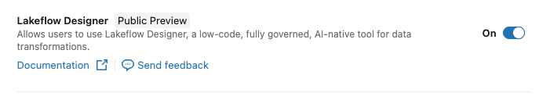
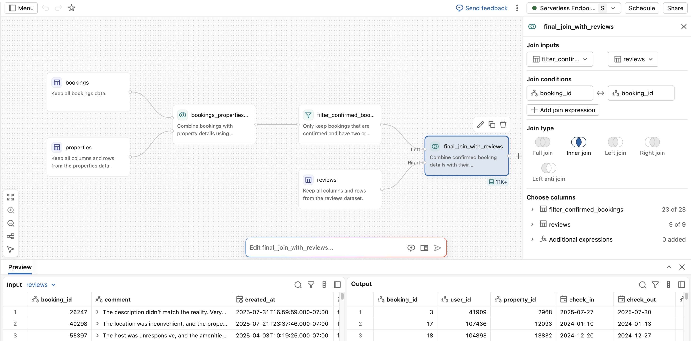
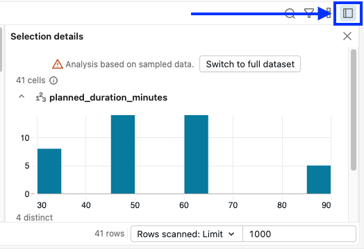
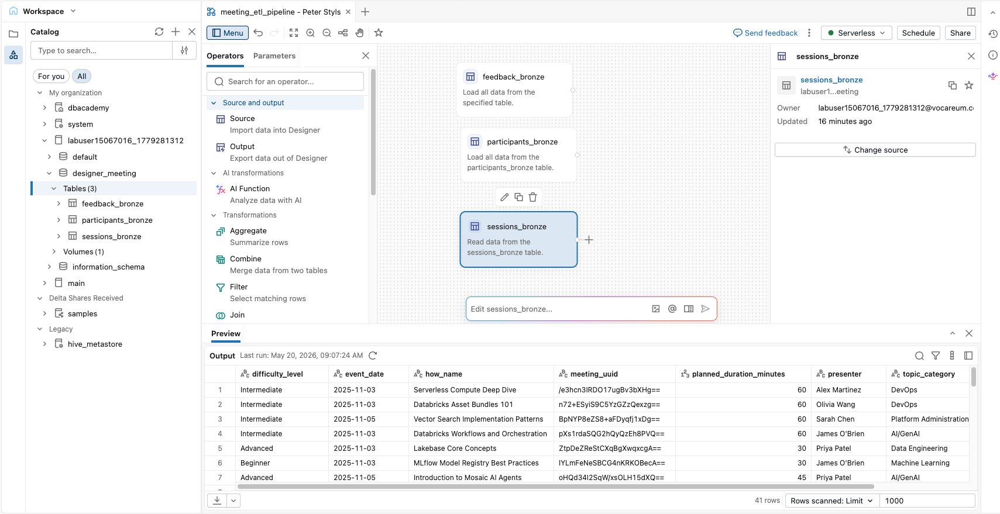

# Demo - Lakeflow Designer Überblick und Quellschicht

## Überblick

In der vorherigen Demo haben Sie die Quelldaten untersucht und den Medallion-Workflow betrachtet, den Sie erstellen werden. In dieser Demo lernen Sie **Lakeflow Designer** kennen und bauen die **Quellschicht (Source Layer)** dieses Workflows auf. Sie werden:

- lernen, was Lakeflow Designer ist und welches Problem es löst.
- die Benutzeroberfläche von Lakeflow Designer kennenlernen.
- drei bestehende Bronze-Tabellen mit drei unterschiedlichen Methoden zur Canvas hinzufügen: dem **Source**-Operator, per Drag-and-Drop aus dem **Catalog Explorer** sowie mit **Genie Code**.
- eine lokale CSV-Datei in ein Unity-Catalog-Volume hochladen und als vierte Bronze-Tabelle einlesen.

Dies ist die erste praktische Demo des Workshops. Fahren Sie mit **03 - Build the Silver Layer** fort, um diese Bronze-Tabellen zu bereinigen und zu transformieren.

## Lernziele

Am Ende dieser Demo können Sie:

- den Zweck, die Wertversprechen und die Zielgruppe von Lakeflow Designer **beschreiben**.
- die wichtigsten Bereiche der Lakeflow-Designer-Oberfläche **identifizieren**, einschließlich Canvas, Operatoren-Panel, Parameter, Compute-Auswahl und Vorschaubereich.
- Bronze-Tabellen mit drei unterschiedlichen Methoden zur Canvas **hinzufügen**: dem **Source**-Operator, per Drag-and-Drop aus dem **Catalog Explorer** sowie mit **Genie Code**.
- eine lokale CSV-Datei in ein verwaltetes Unity-Catalog-Volume **hochladen** und als neue Bronze-Tabelle einlesen.

## ERFORDERLICHE VORAUSSETZUNGEN

### Falls Sie in Ihrem eigenen Workspace arbeiten – kein von Databricks Academy bereitgestellter Vocareum-Workspace

> **Voraussetzungen**
>
> Zum Zeitpunkt dieses Kurses müssen Sie **Lakeflow Designer** in Ihrem Workspace explizit aktivieren. Dafür sind die entsprechenden Workspace-Berechtigungen erforderlich.
>
> 1. Klicken Sie oben rechts auf Ihr Konto-Symbol.
> 2. Wählen Sie **Previews** aus (erfordert die notwendigen Berechtigungen).
> 3. Suchen Sie **Lakeflow Designer** und aktivieren Sie es.
>
> 
>
> **HINWEIS:** Wenn Sie einen von Databricks Academy bereitgestellten Vocareum-Workspace verwenden, ist dies bereits für Sie eingerichtet.

## A. Lakeflow Designer im Überblick

### Was ist Lakeflow Designer?

*No-Code-Datenaufbereitung, produktionsreif. Nativ in Databricks integriert.*

- Eine **visuelle, no-code, KI-native Erfahrung** für die Datenaufbereitung und Analyse, direkt in Databricks integriert.
- Operatoren werden per Drag-and-Drop auf eine **Canvas** gezogen, um Daten zu laden, zu bereinigen, zu verknüpfen und zu transformieren.
- **Eingaben und Ausgaben werden bei jedem Schritt in der Vorschau angezeigt**, um Probleme frühzeitig zu erkennen.
- Workflows basieren auf **produktionsreifem Code** und werden vollständig durch **Unity Catalog** verwaltet.
- Der Übergang vom **Prototyp zur Produktion** erfolgt ohne Neuaufbau.

**Status:** Jetzt allgemein verfügbar (GA)

**Einfacher Weg in die Produktion** — *Einmal bauen, in Produktion ausführen.*
- Produktionsbetrieb mit **Lakeflow Jobs**.
- Kein Neuaufbau, kein Neuschreiben, keine Übergabe.
- Dasselbe Artefakt in Entwicklung und Produktion.

**KI-nativ und überprüfbar** — *Natürliche Sprache, die Sie nachvollziehen können.*
- Transformationen in einfachem Englisch beschreiben.
- **Genie Code** nutzt Ihr Schema, die Lineage und den Geschäftskontext.
- Jeder Schritt lässt sich prüfen, validieren und ist vertrauenswürdig.

**Self-Service, vollständig governt** — *Dort, wo Ihre Daten bereits liegen.*
- Datenaufbereitung direkt auf der Databricks Data Intelligence Platform.
- **Unity Catalog**-Governance, Lineage und Berechtigungen gelten automatisch.
- Keine separaten Lizenzen, verbrauchsbasierte Preisgestaltung.

**Zielgruppe**
- Fachanwender (Business Users)
- Analysten
- Analytics Engineers
- Data Engineers

**Weiterführende Informationen**
- [Produktseite: Lakeflow Designer](https://www.databricks.com/product/data-engineering/lakeflow-designer)
- [Lakeflow: Eine neue Ära des agentischen Data Engineering](https://www.databricks.com/blog/lakeflow-new-era-agentic-data-engineering)
- Dokumentation: [AWS](https://docs.databricks.com/aws/en/designer/) | [Azure](https://learn.microsoft.com/en-us/azure/databricks/designer/) | [GCP](https://docs.databricks.com/gcp/en/designer/)

## B. Lakeflow Designer öffnen und erkunden

### B1. Eine visuelle Datenaufbereitungsdatei in Lakeflow Designer erstellen

> Wenn Sie dieses Notebook in einem Tab und Lakeflow Designer in einem anderen offen halten, lässt sich der Rest der Demo leichter nachvollziehen.

1. Wählen Sie in der **Workspace-Seitenleiste** das Symbol **Folder** (Ordner).
2. Wählen Sie in Ihrem Hauptordner **More Options** > **Create** > **Visual data prep**.
   - **HINWEIS:** Sie können auch über die Hauptnavigationsleiste **+ New** > **Visual data prep** wählen.
3. Es öffnet sich eine neue Datei mit einem automatisch generierten Namen wie `Visual data prep YYYY-MM-DD HH:MM:SS`.
4. Klicken Sie oben auf der Seite auf den Namen und benennen Sie die Datei in `meeting_visual_data_prep - IHRE INITIALEN` um.
5. **Lakeflow Designer** sollte nun geöffnet und einsatzbereit sein.
6. (OPTIONAL) Suchen Sie in Ihrem Ordner die visuelle Datenaufbereitung `meeting_visual_data_prep - IHRE INITIALEN`.
   - Klicken Sie mit der rechten Maustaste auf die Datei und wählen Sie **Open in new browser tab**, damit Sie diese Anleitung parallel verfolgen können.

### B2. Die Benutzeroberfläche von Lakeflow Designer erkunden

1. Verschaffen Sie sich zunächst einen kurzen Überblick über den Bildschirm, bevor Sie etwas tun. Lakeflow Designer besteht aus einigen Hauptbereichen:

| Bereich | Wo er sich befindet | Was er tut |
|---|---|---|
| **Canvas** | Mitte des Bildschirms | Der visuelle Graph, in dem Ihr Workflow lebt. Operatoren werden hier miteinander verbunden, um den Datenfluss zu bilden. |
| **Getting started panel** | Mitte, wird angezeigt, wenn die Canvas leer ist | Bietet Abkürzungen zum Hinzufügen Ihrer ersten Quelle. Sie können auch **Genie Code** verwenden, um Ihren visuellen Workflow zu erstellen. Wir gehen diese Optionen in diesem Workshop Schritt für Schritt durch. |
| **Operators panel** | Linke Seitenleiste, Tab **Operators** | Die Bausteine, die Sie auf die Canvas ziehen. Gruppiert in **Source and output**, **AI transformations** und **Transformations**. |
| **Parameters panel** | Linke Seitenleiste, Tab **Parameters** | Wiederverwendbare Werte, auf die Sie im gesamten Workflow verweisen können. Vorerst leer. |
| **Compute selector** | Oben rechts, zeigt **Serverless** an | Die Compute-Ressource, mit der Ihre Vorschauen und der finale Workflow-Lauf ausgeführt werden. |
| **Schedule** und **Share** | Oben rechts | Planen Sie den Workflow für eine regelmäßige Ausführung oder teilen Sie ihn mit Teammitgliedern. |
| **Preview panel** | Unterhalb der Canvas | Zeigt Beispielzeilen und das Schema für den aktuell ausgewählten Operator. Wird während des Aufbaus aktualisiert. |

2. Klicken Sie links auf den Tab **Operators** und scrollen Sie durch die Liste.
    - **Integrierte Operatoren in Lakeflow Designer:** [AWS](https://docs.databricks.com/aws/en/designer/built-in-operators) | [Azure](https://learn.microsoft.com/en-us/azure/databricks/designer/built-in-operators) | [GCP](https://docs.databricks.com/gcp/en/designer/built-in-operators)
3. Klicken Sie auf den Tab **Parameters**. Er ist leer – das ist zu erwarten.
4. Schauen Sie sich das **Getting started panel** in der Mitte an. Beachten Sie die vier Möglichkeiten, Daten hinzuzufügen:
   - **Select a source** wählt eine bestehende Unity-Catalog-Tabelle aus.
   - **Upload a file** lädt eine lokale Datei wie eine CSV-Datei hoch. Dies verwenden Sie später für den Teilnehmer-Lookup.
   - **Load a sample** lädt einen von Databricks bereitgestellten Beispieldatensatz.
   - **Try an assistant prompt** lässt den KI-Assistenten anhand einer Beschreibung in natürlicher Sprache eine erste Transformation generieren.
5. Vergewissern Sie sich, dass die Compute-Auswahl oben rechts **Serverless** anzeigt. Für diesen Workflow verwenden wir Serverless-Compute.

## C. Ihre Quell-Bronze-Tabellen hinzufügen

In diesem Abschnitt fügen Sie die drei bestehenden Bronze-Tabellen (`feedback_bronze`, `participants_bronze`, `sessions_bronze`) zur Canvas hinzu. Für jede Tabelle verwenden wir eine andere Methode, damit Sie die in Lakeflow Designer verfügbaren Optionen kennenlernen.

### Der visuelle Workflow, den Sie erstellen werden

- Eine lokale CSV-Datei wird in ein Volume importiert.
- Bronze wird zu **Silber** bereinigt.
- Aus Silber werden zwei Gold-Tabellen abgeleitet. Eine KI-gestützte Bonus-Tabelle wird als Hausaufgabe angeboten.

**Manueller Datei-Upload in ein Volume**

| Knotentyp | Name | Beschreibung |
|---|---|---|
| CSV-Datei | `how_participant_lookup_week_1.csv` | Hochgeladenes Teilnehmerverzeichnis |

> **Upstream-Workflow · läuft nach Zeitplan**
>
> Quell-Workflow, verwaltet von einem anderen Team: Ein anderes Team lädt die Meeting-Quelldaten nach Zeitplan als Bronze-Tabellen und aktualisiert sie dabei mit neuen Sessions, Teilnehmern und Feedback. Sie halten Silber und Gold aktuell.

**Bronze-Tabellen**

| Tabelle | Beschreibung |
|---|---|
| `participant_lookup_bronze` | Lookup, eingelesen aus der CSV-Datei |
| `sessions_bronze` | Rohe Session-Metadaten, eine Zeile pro Session |
| `participants_bronze` | Anwesenheitsprotokoll, eine Zeile pro Teilnehmer und Session |
| `feedback_bronze` | Umfrageantworten, gespeichert als JSON-Array pro Session |

**Silber-Tabellen** *(werden in der nächsten Demo erstellt)*

| Tabelle | Beschreibung |
|---|---|
| `participant_lookup_silver` | E-Mail und Region in Teile aufgesplittet |
| `sessions_silver` | Datum typisiert, `how_name` umbenannt in `session_name` |
| `participants_silver` | Zeitstempel typisiert, `duration_in_minutes` hinzugefügt |
| `feedback_silver` | JSON aufgelöst, eine Zeile pro Antwort |

*(→ Verknüpfen und aggregieren →)*

**Gold-Tabellen** *(werden in einer späteren Demo erstellt)*

| Tabelle | Beschreibung |
|---|---|
| `gold_session_summary` | Session-Metadaten mit Anwesenheitskennzahlen |
| `gold_feedback_summary` | Durchschnittliche Bewertungen auf Session-Ebene |
| `gold_feedback_sentiment` *(Bonus / Hausaufgabe)* | Freitextantworten, getaggt mit `ai_sentiment` |

### C1. Methode 1 – Source-Operator

1. Ziehen Sie im **Operators panel** links den **Source**-Operator auf die Canvas.
2. Wählen Sie **Browse existing**, um Unity Catalog zu durchsuchen.
3. Wählen Sie die Tabelle **labuser_UNIQUE_ID.designer_meeting.feedback_bronze** aus.
4. Prüfen Sie im **Preview**-Bereich unten in der Canvas, ob die Daten geladen wurden.

### C2. Methode 2 – Tabelle auf die Canvas ziehen

1. Wählen Sie in der linken Seitenleiste das Symbol  **Catalog**.
2. Suchen Sie die Tabelle **labuser_UNIQUE_ID.designer_meeting.participants_bronze**.
3. Klicken Sie auf die Schaltfläche **>>**, um die Tabelle zur Canvas hinzuzufügen.
4. Prüfen Sie im **Preview**-Bereich, ob die Daten geladen wurden.

### C3. Methode 3 – Genie Code verwenden

1. Klicken Sie auf eine leere Stelle der Canvas, um die Auswahl aller Knoten aufzuheben.
2. Geben Sie in der **Genie Code**-Eingabezeile folgenden Prompt ein: `Add the designer_meeting.sessions_bronze table`.
3. Wählen Sie **Accept all**.
4. Prüfen Sie im **Preview**-Bereich, ob die Daten geladen wurden.

#### C3.1. Daten-Profiling in Lakeflow Designer

1. Öffnen Sie den Vorschaubereich für **designer_meeting.sessions_bronze**.
2. Wählen Sie oben rechts im Ausgabebereich das Symbol **Sidebar**.
    - Die Schaltfläche für die Seitenleiste öffnet die Auswahldetails.
    - Sie können Spalten in Ihrer Tabelle auswählen, um deren Werte zu untersuchen.
3. Wählen Sie die Spalte **planned_duration_minutes** aus.

    

Dadurch werden die Daten profiliert.
- Standardmäßig wird ein **Sample** der Daten verwendet.
- Sie können auf den **vollständigen Datensatz** umschalten.

#### Checkpoint – 3 Quelltabellen

## D. Eine lokale Datei hochladen

Beim Hochladen haben Sie folgende Möglichkeiten:

- Die Rohdatei in ein Volume in Unity Catalog hochladen. Anschließend können Sie die Datei(en) als Tabelle lesen.
- Die Datei hochladen und direkt eine Tabelle in Unity Catalog erstellen.

> **Hinweis**
>
> In diesem Abschnitt laden Sie eine CSV-Datei lokal herunter und laden sie anschließend als neue Quelltabelle in Lakeflow Designer hoch. Dies simuliert das gängige Muster, eine externe Lookup-Datei zusätzlich zu Ihren bestehenden Unity-Catalog-Tabellen einzubinden.

### D1. Datei lokal herunterladen

1. Wählen Sie zurück in diesem Notebook das Symbol **Folder** in Ihrer Workspace-Seitenleiste.
2. Öffnen Sie den Ordner **participant_lookup** und laden Sie die Datei `how_participant_lookup_week_1.csv` lokal herunter.

### D2. Datei hochladen und Tabelle in Lakeflow Designer erstellen

1. Ziehen Sie in Lakeflow Designer den **Source**-Operator unterhalb des Knotens **sessions_bronze** auf die Canvas.
2. Doppelklicken Sie auf den **Source**-Operator, um das Operator-Panel zu öffnen.
3. Wählen Sie **Create table from file**.
4. Laden Sie die Datei auf die Seite hoch.
5. Legen Sie Folgendes fest:

    | Einstellung | Wert |
    |---|---|
    | **Catalog** | `labuser_UNIQUE_ID` |
    | **Schema** | `designer_meeting` |
    | **Table name** | `participant_information` |

6. Wählen Sie **Create table**.
7. Im rechten Panel sollten nun die Konfigurationsoptionen der Quelle angezeigt werden.
    - Wählen Sie oben den automatisch generierten Knotennamen **source_#** aus.
    - Benennen Sie den Knoten in `participant_lookup_bronze` um.
    - Prüfen Sie, ob die Vorschau der Daten korrekt aussieht.

## E. Knoten automatisch anordnen (Auto Layout)

Beim Hinzufügen von Knoten können Sie diese entweder manuell positionieren oder von Lakeflow Designer anordnen lassen.

1. Wählen Sie in der Hauptsymbolleiste von Lakeflow Designer das Symbol  **Auto Layout**, um die Knoten in der Canvas zu organisieren.

Sie haben nun alle vier Bronze-Quellen auf der Canvas. In der nächsten Demo (**03 - Build the Silver Layer**) bereinigen und transformieren Sie diese Tabellen zu Silber.

---

© 2026 Databricks, Inc. Alle Rechte vorbehalten.
