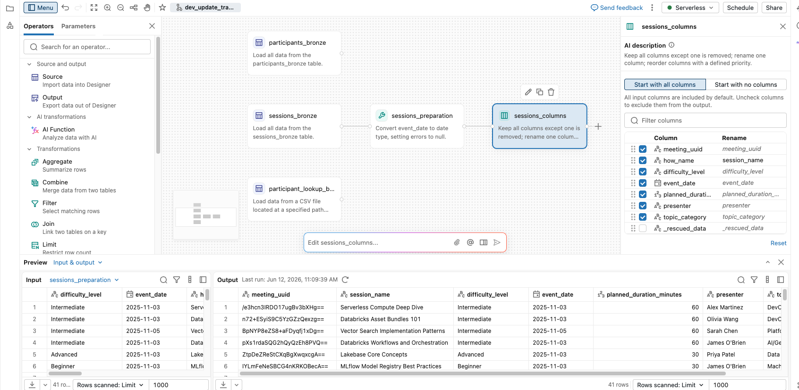
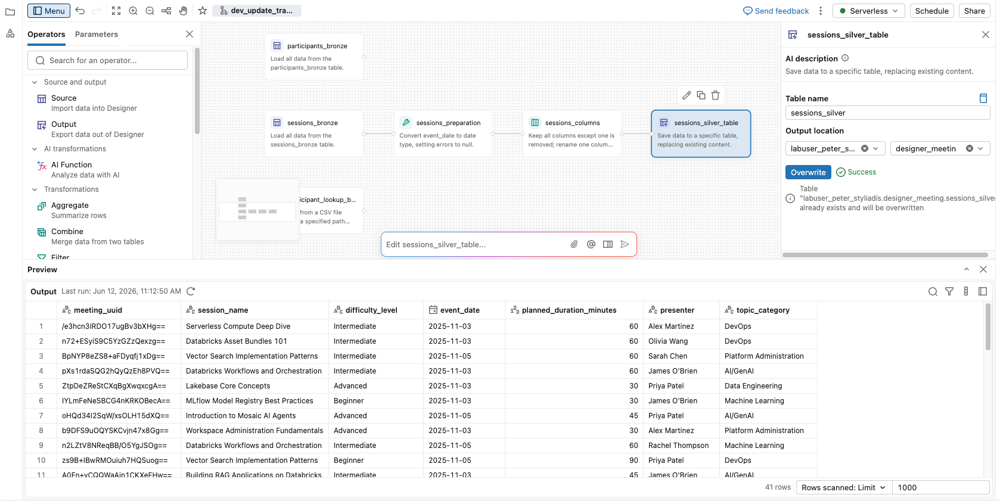
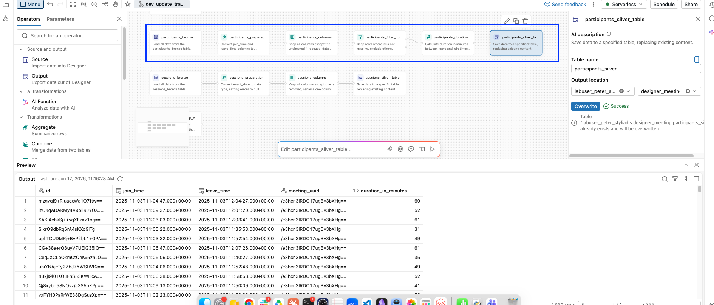
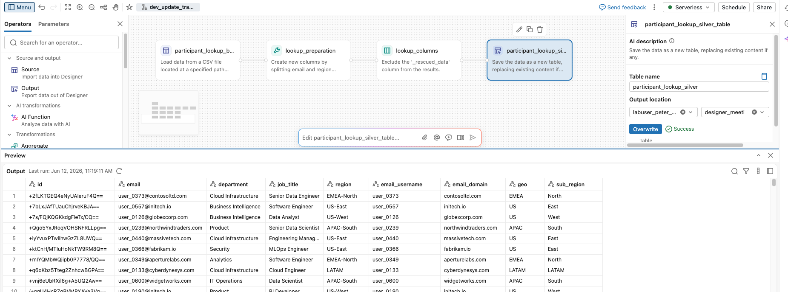
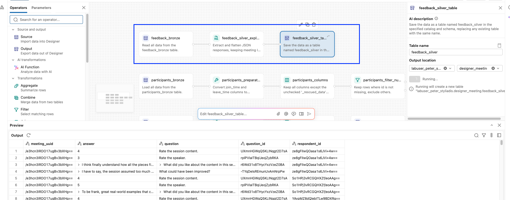
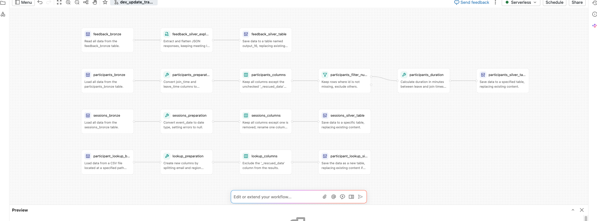

# Demo - Aufbau der Silber-Schicht

## Überblick

In der vorherigen Demo haben Sie vier Bronze-Quellen zu Ihrer Lakeflow Designer Visual Data Prep hinzugefügt. In dieser Demo bauen Sie die **Silber-Schicht** auf, indem Sie jede Bronze-Tabelle bereinigen und in eine Silber-Tabelle transformieren – dabei verwenden Sie für jede Tabelle einen anderen Erstellungsstil:

- Die Operatoren **Prepare** und **Select** (Point-and-Click).
- **Genie Code** (KI-generierte Transformationen).
- Der **SQL**-Operator (eigener Code).

Jede Silber-Tabelle wird in Unity Catalog materialisiert, damit die Gold-Schicht (nächste Demo) daraus lesen kann.

## Lernziele

Am Ende dieser Demo können Sie:

- die Operatoren **Prepare** und **Select** verwenden, um Spalten zu casten, umzubenennen und zu entfernen.
- **Genie Code** verwenden, um Transformationen in natürlicher Sprache zu beschreiben und die Operatoren von der KI generieren zu lassen.
- den **SQL**-Operator verwenden, um semistrukturierte JSON-Daten mit `parse_json`, `VARIANT` und `variant_explode_outer` zu parsen.
- jede Silber-Tabelle mithilfe des **Output**-Operators in Unity Catalog materialisieren.

> **Erforderliche Voraussetzungen**
>
> Sie müssen **02 - Lakeflow Designer Overview and Source Layer** abgeschlossen haben, bevor Sie mit dieser Demo beginnen.
>
> Bevor Sie fortfahren, bestätigen Sie, dass sich die folgenden vier Bronze-Tabellen auf Ihrer Lakeflow Designer Canvas befinden:
>
> - **sessions_bronze**
> - **participants_bronze**
> - **feedback_bronze**
> - **participant_lookup_bronze**

## Über die Silber-Schicht

Die Silber-Schicht ist der Ort, an dem Bronze-Daten bereinigt werden: Typkonvertierung, Umbenennung zur besseren Verständlichkeit und Entfernen von Spalten, die nachgelagert nicht benötigt werden.

Wir erstellen eine Silber-Tabelle pro Bronze-Tabelle.

### Der visuelle Workflow, den Sie erstellen werden

- Eine lokale CSV-Datei wird in ein Volume importiert.
- Bronze wird zu **Silber** bereinigt.
- Aus Silber werden zwei Gold-Tabellen abgeleitet. Eine KI-gestützte Bonus-Tabelle wird als Hausaufgabe angeboten.

**Quelle – manueller Datei-Upload in ein Volume**

| CSV-Datei | Beschreibung |
|---|---|
| `how_participant_lookup_week_1.csv` | Hochgeladenes Teilnehmerverzeichnis |

> **Vorgelagerter Workflow – läuft nach Zeitplan**
>
> Ein anderes Team lädt die Meeting-Quelldaten als Bronze-Tabellen nach einem Zeitplan und aktualisiert die Tabellen so mit neuen Sitzungen, Teilnehmern und Feedback. Sie halten Silber und Gold aktuell.

**Bronze-Schicht**

| Tabelle | Beschreibung |
|---|---|
| `participant_lookup_bronze` | Aus der CSV eingelesenes Lookup |
| `sessions_bronze` | Rohe Sitzungsmetadaten, eine Zeile pro Sitzung |
| `participants_bronze` | Anwesenheitsprotokoll, eine Zeile pro Teilnehmer und Sitzung |
| `feedback_bronze` | Umfrageantworten, gespeichert als JSON-Array pro Sitzung |

**Silber-Schicht**

| Tabelle | Beschreibung |
|---|---|
| `participant_lookup_silver` | E-Mail und Region in Teile aufgesplittet |
| `sessions_silver` | Datum typisiert, `how_name` in `session_name` umbenannt |
| `participants_silver` | Zeitstempel typisiert, `duration_in_minutes` hinzugefügt |
| `feedback_silver` | JSON explodiert, eine Zeile pro Antwort |

*Join und Aggregation*

**Gold-Schicht (Vorschau auf die nächste Demo)**

| Tabelle | Beschreibung |
|---|---|
| `gold_session_summary` | Sitzungsmetadaten mit Anwesenheitskennzahlen |
| `gold_feedback_summary` | Durchschnittliche Bewertungen je Sitzung |
| `gold_feedback_sentiment` *(Bonus / Hausaufgabe)* | Freitextantworten, getaggt mit `ai_sentiment` |

## A. Die Tabelle `sessions_silver` erstellen

Für **sessions_silver** müssen wir:

- Die Spalte **event_date** von `STRING` zu `DATE` konvertieren.
- **how_name** in **session_name** umbenennen.
- Die Spalte **_rescued_data** entfernen.
- Alle anderen Spalten unverändert beibehalten.

> **Hinweis**
>
> Wir verwenden für diese erste Silber-Tabelle Point-and-Click-Operatoren. Später verwenden wir **Genie Code** (KI) und den **SQL**-Operator, um dieselbe Art von Arbeit auf unterschiedliche Weise zu erledigen.

### A1. Sessions Silver – Prepare und Select

1. Wählen Sie den Knoten **sessions_bronze** aus und sehen Sie sich die Daten im **Preview**-Bereich an.

#### A1.1 Prepare-Operator

1. Navigieren Sie zum Kreis rechts am Knoten und wählen Sie **+** > **Prepare**, um den Operator hinzuzufügen.

2. Doppelklicken Sie auf den **Prepare**-Operator-Knoten, um das Konfigurationspanel zu öffnen.

3. Wählen Sie **Add action** > **Change type**

    a. **Column**: `event_date`

    b. **New type**: `date`

    c. **On parse error**: `Set to null`

    d. Benennen Sie den Knoten um in: `sessions_preparation`

    e. Klicken Sie auf **Apply**

    > **Hinweis:** Durch Klicken auf **Apply** wird die Konfiguration am Knoten gespeichert und der einzelne Operator ausgeführt. Der gesamte Workflow wird dadurch nicht ausgeführt, und es werden noch keine Tabellen erstellt. Die Tabelle `sessions_silver` wird erst erstellt, wenn Sie den gesamten Workflow über den **Output**-Knoten ausführen.

3. Überprüfen Sie die Vorschaubereiche **Input** und **Output** und bestätigen Sie:
    - **event_date** ist jetzt vom Typ `DATE`.

#### A1.2 Select-Operator

1. Wählen Sie am Knoten **sessions_prepration** **+** > **Select**, um den Operator hinzuzufügen.

    a. **how_name in session_name umbenennen:**
    - Suchen Sie die Spalte **how_name** im Operator-Panel.
    - Benennen Sie sie mithilfe der Rename-Aktion in `session_name` um.

    b. **Die Spalte _rescued_data entfernen:**
    - Suchen Sie die Spalte **_rescued_data**.
    - Entfernen Sie sie aus der Ausgabe (Häkchen entfernen oder die Drop/Remove-Aktion verwenden).

    c. Optional können Sie die Spalten auch neu anordnen. Legen Sie Folgendes als Spalte 1 & 2 fest:
    - Spalte 1: **meeting_uuid**
    - Spalte 2: **how_name | session_name**

    d. Benennen Sie den Operator in `sessions_columns` um.

    e. Klicken Sie auf **Apply**.

6. Sehen Sie sich die **Output**-Tabelle im Vorschaubereich an und bestätigen Sie:
    - **event_date** ist jetzt vom Typ `DATE`.
    - **how_name** heißt jetzt **session_name**.
    - **_rescued_data** ist nicht mehr in der Spaltenliste.
    - Die Zeilenanzahl stimmt mit **sessions_bronze** überein (41).

7. Beachten Sie im **Output**-Bereich unten rechts, dass nur **1000** Zeilen gescannt wurden. Sie können das bei Bedarf ändern.

> **Information**
>
> Lakeflow Designer-Vorschauen laufen standardmäßig auf einer Stichprobe von bis zu 1.000 Zeilen, damit die Benutzeroberfläche beim Erstellen und Validieren von Schritten reaktionsschnell bleibt.
>
> Ändern Sie die Vorschau-Einstellung, wenn die Stichprobe irreführend ist – besonders bei Joins, Filtern oder der Werteermittlung, wenn wichtige Übereinstimmungen oder Werte in den gesampelten Zeilen möglicherweise nicht vorkommen.
>
> Wenn Sie gegen alle verfügbaren Daten validieren müssen, wechseln Sie im Output-Bereich von **Rows scanned: Limit** zu **Rows scanned: Max**.
>
> Dokumentation zum **Output-Bereich**: [AWS](https://docs.databricks.com/aws/en/designer/what-is-lakeflow-designer#the-output-pane) | [Azure](https://learn.microsoft.com/en-us/azure/databricks/designer/what-is-lakeflow-designer#output) | [GCP](https://docs.databricks.com/gcp/en/designer/what-is-lakeflow-designer#the-output-pane)

#### Checkpoint – Sessions Silver: Prepare und Select



### A2. Die Tabelle `sessions_silver` erstellen

1. Wählen Sie Ihren Knoten **sessions_columns** aus.

2. Wählen Sie **+** > **Output**, um den Output-Operator hinzuzufügen. Erstellen Sie anschließend die Tabelle.

3. Konfigurieren Sie das **Output**-Panel wie folgt:

    | Setting | Value |
    |---|---|
    | **Table name** | `sessions_silver` |
    | **Catalog** | `labuser_UNIQUE_ID` |
    | **Schema** | `designer_meeting` |

    > **Hinweis:** Wenn das Schema **designer_meeting** nicht im Dropdown erscheint, wählen Sie das Symbol **x**, um die Unity-Catalog-Schemas neu zu laden.

4. Benennen Sie den Output-Knoten in `sessions_silver_table` um.

5. Wählen Sie **Run**, um die Tabelle zu erstellen, und bestätigen Sie, dass dies erfolgreich war.

6. Überprüfen Sie, dass die Tabelle in Unity Catalog erstellt wurde:
    - Wählen Sie das Symbol **Catalog** 
    - Klicken Sie mit der rechten Maustaste auf den Katalog **labuser_UNIQUE_ID** > **Open in Catalog Explorer**
    - Navigieren Sie zum Schema **designer_meeting** (bei Bedarf aktualisieren).
    - Bestätigen Sie, dass die Tabelle **sessions_silver** in der Tabellenliste zu sehen ist.
    - Wählen Sie **sessions_silver**, um zunächst das Schema und anschließend die **Sample Data** zu prüfen.
    - Bestätigen Sie:
        - **event_date** ist vom Typ `DATE`.
        - Die Spalte **session_name** existiert (umbenannt von **how_name**).
        - Die Spalte **_rescued_data** ist verschwunden.

#### Checkpoint - Sessions Silver Table



## B. Die Tabelle `participants_silver` erstellen

Dieses Mal verwenden wir **Genie Code** (KI), um die Silber-Tabelle in einem einzigen Prompt zu erstellen. Anstatt Operatoren manuell zu ziehen und zu konfigurieren, beschreiben wir, was wir wollen, und die KI generiert die Knoten für uns.

In den Daten müssen wir:

- Die Spalte **_rescued_data** entfernen.
- **join_time** und **leave_time** von `STRING` zu `TIMESTAMP` konvertieren.
- Alle Zeilen mit einer `NULL`-ID entfernen.
- Eine neue Spalte **duration_in_minutes** hinzufügen, die berechnet, wie lange jeder Teilnehmer in der Sitzung geblieben ist – in ganzen Minuten.
    - Wenn **leave_time** vor **join_time** liegt (negative Dauer), setzen Sie **duration_in_minutes** auf `NULL`.
- Alle anderen Spalten unverändert beibehalten.

1. Wählen Sie den Knoten **participants_bronze** aus und sehen Sie sich die Daten im **Preview**-Bereich an.

2. Geben Sie in der **Genie Code**-Prompt-Leiste den folgenden Prompt ein:

> **Genie Code Prompt**
> ```text
> Using the participants_bronze table:
> - Drop the _rescued_data column.
> - Cast join_time and leave_time from STRING to TIMESTAMP.
> - Drop all rows with a `NULL` id.
> - Create a new numeric column named duration_in_minutes that is the difference between leave_time and join_time in minutes, rounded to a whole number. If leave_time is before join_time (the difference would be negative), set duration_in_minutes to NULL instead.
> - Keep all other columns.
> - Create a new table in the same catalog and schema named participants_silver.
> ```

3. **Genie Code** generiert mehrere Knoten auf der Canvas. Untersuchen Sie jeden Knoten.
    > **Beachten Sie, dass die KI die benötigten Operatoren und Ausdrücke selbst abgeleitet hat. Prüfen Sie immer, was generiert wurde, bevor Sie es übernehmen.**

4. Überprüfen Sie jeden generierten Knoten (die Konfiguration und das Output-Panel). Klicken Sie anschließend auf **Accept all**, wenn alles wie erwartet aussieht.

5. Wählen Sie den **Output**-Knoten (den letzten Knoten in der Kette) aus und sehen Sie sich dessen **Preview**-Bereich an. Bestätigen Sie:
    - **join_time** und **leave_time** sind vom Typ `TIMESTAMP`.
    - **duration_in_minutes** existiert und enthält ganze Zahlen.
    - **_rescued_data** ist nicht mehr in der Spaltenliste.

    > **Hinweis:** Nutzen Sie den Checkpoint unten, um Ihr Ergebnis mit dem erwarteten Output zu vergleichen.

6. Falls das Ergebnis nicht Ihren Erwartungen entspricht, können Sie:
    - den generierten Knoten **manuell anpassen** in seinem Konfigurationspanel.
    - die von der KI generierte Beschreibung **manuell bearbeiten**, um den Operator neu zu generieren.
    - **Genie Code erneut prompten** mit einer verfeinerten Beschreibung.

7. Benennen Sie den generierten **Output**-Knoten in `participants_silver_table` um.

8. Wählen Sie **Run** am **Output**-Knoten, um die Tabelle `participants_silver` in Unity Catalog zu erstellen.
    - Bestätigen Sie, dass der Lauf erfolgreich war.

### Checkpoint - Participants Silver Table



## C. Die Tabelle `participant_lookup_silver` erstellen

Auch hier verwenden wir **Genie Code** (KI), um diese Silber-Tabelle in einem einzigen Prompt zu erstellen. Dieses Mal liegt der Fokus auf **String-Parsing**: dem Aufteilen einer Spalte in zwei.

In den Daten müssen wir:

- Die Spalte **_rescued_data** entfernen.
- Die Spalte **email** in **email_username** und **email_domain** aufteilen (die Teile vor und nach dem `@`).
- Die Spalte **region** in **geo** und **sub_region** aufteilen (die Teile vor und nach dem `-`).
- Alle anderen Spalten unverändert beibehalten, einschließlich der ursprünglichen Spalten **email** und **region**.

1. Wählen Sie den Knoten **participant_lookup_bronze** aus und sehen Sie sich die Daten im **Preview**-Bereich an.

2. Geben Sie in der **Genie Code**-Prompt-Leiste den folgenden Prompt ein:

> **Genie Code Prompt**
> ```text
> Using the participant_lookup_bronze table:
> - Drop the _rescued_data column.
> - Split the email column into two new columns: email_username (the part before the @ symbol) and email_domain (the part after the @ symbol).
> - Split the region column into two new columns: geo (the part before the hyphen) and sub_region (the part after the hyphen). If there is only one value in Region it should be the region, and the sub region should be empty.
> - Keep all other columns, including the original email and region columns.
> - Create a new table in the same catalog and schema named participant_lookup_silver.
> ```

3. **Genie Code** generiert Knoten auf der Canvas. Untersuchen Sie jeden Knoten.
    > **Prüfen Sie wie zuvor, was generiert wurde, bevor Sie es übernehmen.**

4. Überprüfen Sie jeden generierten Knoten (die Konfiguration und das Output-Panel). Klicken Sie anschließend auf **Accept all**, wenn alles wie erwartet aussieht.

5. Wählen Sie den **Output**-Knoten (den letzten Knoten in der Kette) aus und sehen Sie sich dessen **Preview**-Bereich an. Bestätigen Sie:
    - **email_username** und **email_domain** existieren und sehen korrekt aus (zum Beispiel `user_0373` und `contosoltd.com`).
    - **geo** und **sub_region** existieren und sehen korrekt aus (zum Beispiel `EMEA` und `North`).
    - **email** und **region** sind weiterhin in der Spaltenliste.
    - **_rescued_data** ist nicht mehr in der Spaltenliste.

    > **Hinweis:** Nutzen Sie den Checkpoint unten, um Ihr Ergebnis mit dem erwarteten Output zu vergleichen.

6. Falls das Ergebnis nicht Ihren Erwartungen entspricht, können Sie:
    - den generierten Knoten **manuell anpassen** in seinem Konfigurationspanel.
    - die von der KI generierte Beschreibung **manuell bearbeiten**, um den Operator neu zu generieren.
    - **Genie Code erneut prompten** mit einer verfeinerten Beschreibung.

7. Benennen Sie den generierten **Output**-Knoten in `participant_lookup_silver_table` um.

8. Wählen Sie **Run** am **Output**-Knoten, um die Tabelle `participant_lookup_silver` in Unity Catalog zu erstellen. Bestätigen Sie, dass der Lauf erfolgreich war.

### Checkpoint - Participant Lookup Silver Table



## D. Die Tabelle `feedback_silver` erstellen

Dies ist die anspruchsvollste Silber-Tabelle, wegen des verschachtelten JSON in der Spalte **responses**.

Die Tabelle **feedback_bronze** hat nur zwei Spalten:
- **meeting_uuid**
- **responses**

Für diese Silber-Tabelle verwenden wir den **SQL**-Operator, um das JSON zu parsen und in flache Zeilen aufzulösen.

### D1. Was steht in der Spalte "Responses"?

- Jede Zeile in **feedback_bronze** enthält eine **meeting_uuid** und einen `STRING`, der wie das folgende JSON aussieht.
- Jedes Objekt im Array ist eine Antwort eines Respondenten auf eine Frage.
- Jedes Objekt hat 4 Felder: **answer**, **question**, **question_id**, **respondent_id**.

**Beispielwert für responses**

```json
[
  {
    "answer": "4",
    "question": "Rate the session content.",
    "question_id": "UXmnHGWqQ5KLINqgt2D7sA",
    "respondent_id": "ze8gFlIwQOasa1s6JVi+4w=="
  },
  {
    "answer": "I think finally understand how all the pieces fit together end to end",
    "question": "What did you like about the content in this session?",
    "question_id": "r6Wd31x8THycYxzVzeZ0BA",
    "respondent_id": "ze8gFlIwQOasa1s6JVi+4w=="
  },
  {
    ....
  }
]
```

**Die 4 Felder in jedem Objekt**

| Feld | Beschreibung |
|---|---|
| `answer` | Immer ein String, auch bei Bewertungen. |
| `question` | Für Menschen lesbarer Fragetext. |
| `question_id` | Stabile ID zum Filtern nach Frage. |
| `respondent_id` | Teilnehmer, der die Antwort abgegeben hat. |

> **Warum answer immer ein STRING ist:** Dasselbe Feld enthält sowohl numerische Bewertungen wie `"4"` als auch Freitext-Feedback in derselben Spalte. Wir behalten es in Silber als **STRING** bei und casten es erst in Gold für die Bewertungsfragen nach **INT**.

### D2. Vorher und Nachher

**Vorher · Bronze – `feedback_bronze`**

1 Zeile pro Sitzung. Die Spalte **responses** enthält ein JSON-Array mit allen Antworten für diese Sitzung.

| meeting_uuid | responses |
|---|---|
| /e3hcn3... | [{"answer":"4","question":"Rate the session content.",...}, {"answer":"3","question":"Rate the speaker.",...}, {"answer":"I think finally...",...}, ...] |
| n72+ES... | [{"answer":"2","question":"Rate the session content.",...}, {"answer":"5","question":"Rate the speaker.",...}, ...] |

*Parse JSON zu VARIANT · Array explodieren · Felder extrahieren*

**Nachher · Silber – `feedback_silver`**

1 Zeile pro einzelner Antwort. Jedes Feld aus dem JSON ist jetzt eine eigene Spalte.

| meeting_uuid | answer | question | question_id | respondent_id |
|---|---|---|---|---|
| /e3hcn3... | 4 | Rate the session content. | UXmnHGW... | ze8gFlIw... |
| /e3hcn3... | 3 | Rate the speaker. | rplPVIaI... | ze8gFlIw... |
| /e3hcn3... | I think finally understand how all the pieces fit together... | What did you like about the content? | r6Wd31x8... | ze8gFlIw... |
| /e3hcn3... | 4 | Rate the session content. | UXmnHGW... | So1HPj3v... |
| /e3hcn3... | 5 | Rate the speaker. | rplPVIaI... | So1HPj3v... |
| ... | ... | ... | ... | ... |

> **Eine Bronze-Zeile (Meeting-UUID) wird zu vielen Silber-Zeilen.** Jede Antwort hat jetzt ihre eigene Zeile mit passenden Spalten, bereit zum Filtern, Joinen und Aggregieren in nachgelagerten Schritten.

### D3. Das Array mit verschachteltem JSON explodieren

> **Hinweis**
>
> Sie hätten auch **Genie Code** bitten können, dieses SQL für Sie zu schreiben, genau wie bei den anderen Knoten. Wir verwenden hier bewusst direkt den **SQL**-Operator, damit Sie weitere Operatoren innerhalb von Lakeflow Designer kennenlernen.

1. Wählen Sie den Knoten **feedback_bronze** aus und sehen Sie sich die Daten im **Preview**-Bereich an.

2. Wählen Sie **+** > **SQL**, um den SQL-Operator hinzuzufügen und ihn mit **feedback_bronze** zu verbinden.

3. Ersetzen Sie im **SQL**-Editor die Standardabfrage durch Folgendes:

```sql
SELECT
    r.meeting_uuid,
    e.value:answer::STRING        AS answer,
    e.value:question::STRING      AS question,
    e.value:question_id::STRING   AS question_id,
    e.value:respondent_id::STRING AS respondent_id
FROM feedback_bronze r
CROSS JOIN LATERAL variant_explode_outer(parse_json(r.responses)) AS e
```

> **Diese einzelne Abfrage erledigt drei Dinge gleichzeitig:**
>
> - `parse_json(r.responses)` konvertiert die **STRING**-Spalte in eine **VARIANT**.
> - `variant_explode_outer(...)`, kombiniert mit `CROSS JOIN LATERAL`, erzeugt eine Zeile pro Element des VARIANT-Arrays und stellt jedes Element als `e.value` bereit.
> - `e.value:field::STRING` verwendet den VARIANT-Pfadzugriff (`:`) und den Typ-Cast (`::`), um jedes Feld als `STRING`-Spalte zu extrahieren.

4. Klicken Sie auf **Apply**.

5. Sehen Sie sich den **Preview**-Bereich an und bestätigen Sie:
    - Die Spalten sind jetzt **meeting_uuid**, **answer**, **question**, **question_id**, **respondent_id**.
    - Jede Spalte ist vom Typ `STRING`.
    - Die Zeilenanzahl ist deutlich höher als bei **feedback_bronze** (40 Zeilen in Bronze, 1.000+ in Silber).

6. Benennen Sie den SQL-Knoten in `feedback_silver_explode` um.

7. Sehen Sie sich die **Input**- und **Output**-Vorschauen an und vergleichen Sie sie.

### D4. Die Silber-Tabelle erstellen

1. Wählen Sie den Knoten **feedback_silver_explode** aus.

2. Geben Sie in der **Genie Code**-Prompt-Leiste den folgenden Prompt ein:

> **Genie Code Prompt**
> ```text
> Create a table named feedback_silver in my designer_meeting schema
> ```

3. Überprüfen Sie die von **Genie Code** generierte **Output**-Knoten-Konfiguration (Tabellenname, Catalog, Schema). Vergleichen Sie sie mit dem Checkpoint-Bild unten.

4. Benennen Sie den Knoten `feedback_silver_table`.

5. Wählen Sie **Run**, um die Tabelle `feedback_silver` zu erstellen, und sehen Sie sich den **Output** an.

#### Checkpoint - Feedback Silver Table



## E. Die Knoten automatisch anordnen (Auto Layout)

1. Wählen Sie in der Haupt-Symbolleiste von Lakeflow Designer das Symbol **Auto Layout** , um die Knoten auf der Canvas zu organisieren.

#### Checkpoint - Feedback Bronze - Silver Visual Workflow



---

&copy; Databricks, Inc. Alle Rechte vorbehalten.
