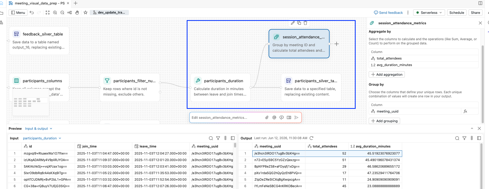
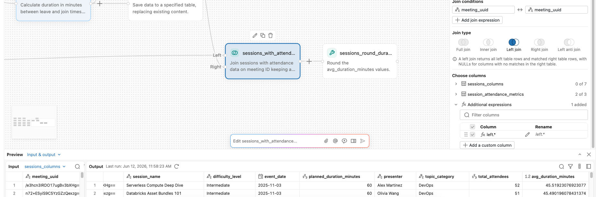
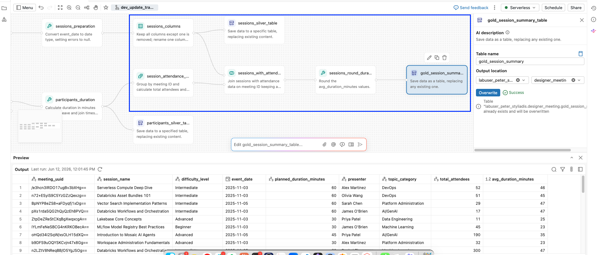
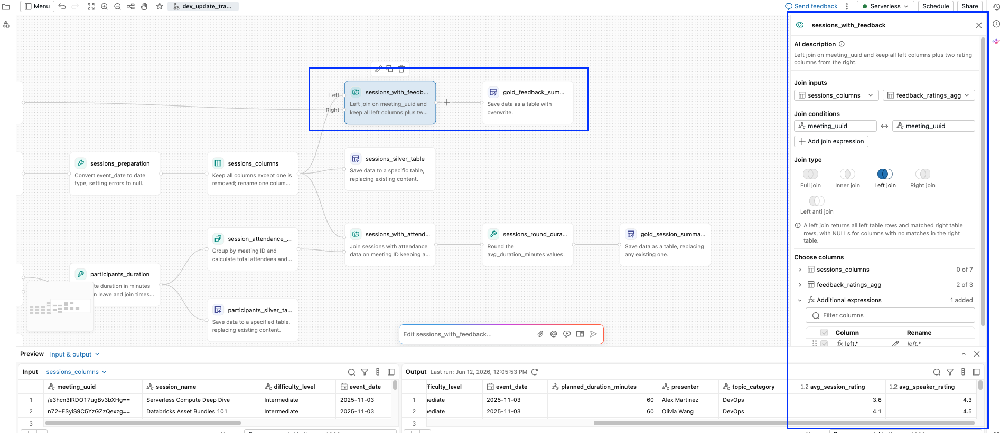
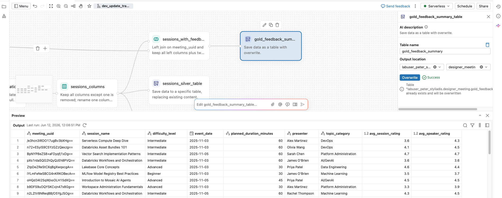

# Demo – Aufbau der Gold-Schicht

## Überblick

In dieser Demo bauen Sie die **Gold-Schicht** Ihrer visuellen Lakeflow Designer-Datenaufbereitung auf. Gold-Tabellen sind die analysefertigen Ergebnisse, die Geschäftsfragen zu Ihren Sitzungen, Teilnehmern und Feedback beantworten. Sie werden:

- **Zwei Gold-Tabellen erstellen** mit unterschiedlichen Lakeflow Designer-Ansätzen:
    - **gold_session_summary** verwendet die Operatoren **Aggregate** und **Join** (manuell per Point-and-Click).
    - **gold_feedback_summary** verwendet **Genie Code** (KI), um aus einem einzigen Prompt einen mehrstufigen Workflow zu generieren.
- **Die Ergebnisse validieren** mit einem wiederverwendbaren Python-Hilfsprogramm, das Zeilenanzahl, Spalten und eine stichprobenartig geprüfte Zeile kontrolliert.
- **Den Workflow planen (schedulen)** direkt aus der Designer-Oberfläche und lernen, wann **Lakeflow Jobs** für eine umfassendere Orchestrierung sinnvoll ist.
- **Weitere Lakeflow Designer-Funktionen erkunden** (Note- und Group-Operatoren, den AI Function-Operator, GitHub-Integration) sowie Ideen, wie Sie die Daten eigenständig weiterentwickeln können.

## Lernziele

Am Ende dieser Demo können Sie:

- Eine Gold-Tabelle **aufbauen**, indem Sie eine Silber-Tabelle aggregieren und das Ergebnis mit einer weiteren über die Operatoren **Aggregate** und **Join** verbinden.
- **Genie Code** (KI) **verwenden**, um aus einem einzigen natürlichsprachlichen Prompt einen mehrstufigen Workflow (Filter, Aggregation, Join, Output) zu generieren.
- Die entstandenen Gold-Tabellen mit einer wiederverwendbaren Python-Prüfung **validieren** (Zeilenanzahl, Spalten, stichprobenartig geprüfte Werte).
- Einen Lakeflow Designer-Workflow direkt aus der Designer-Oberfläche **planen (schedulen)** und erkennen, wann **Lakeflow Jobs** für eine umfassendere Orchestrierung sinnvoll ist.

## ERFORDERLICHE VORAUSSETZUNGEN

> **VORAUSSETZUNGEN**
>
> Sie müssen **03 – Build the Silver Layer** abgeschlossen haben, bevor Sie mit dieser Demo beginnen.
>
> Bestätigen Sie vor dem Fortfahren, dass die folgenden vier Silber-Tabellen im Schema **labuser_UNIQUE_ID.designer_meeting** vorhanden sind:
>
> - `sessions_silver`
> - `participants_silver`
> - `feedback_silver`
> - `participant_lookup_silver`

## Über die Gold-Schicht

Die Gold-Schicht ist die Stufe, auf der Daten analysefertig werden. Gold-Tabellen beantworten konkrete Geschäftsfragen.

Die beiden Tabellen, die Sie in dieser Demo erstellen, beantworten:

- **gold_session_summary**
    - *Wie viele Teilnehmer waren bei jeder Sitzung anwesend, und wie lange sind sie geblieben?*

- **gold_feedback_summary**
    - *Wie wurden Sprecher und Inhalt jeder Sitzung im Durchschnitt bewertet?*

### Der visuelle Workflow, den Sie erstellen werden

- Eine lokale CSV-Datei wird in ein Volume importiert.
- Bronze wird zu **Silber** bereinigt.
- Aus Silber werden zwei Gold-Tabellen abgeleitet. Eine KI-gestützte Bonus-Tabelle wird als Hausaufgabe angeboten.

**Manueller Datei-Upload in ein Volume**

| Element | Name | Beschreibung |
|---|---|---|
| CSV-Datei | `how_participant_lookup_week_1.csv` | Hochgeladenes Teilnehmerverzeichnis |

**Upstream-Workflow · läuft nach Zeitplan**

> Ein anderes Team lädt die Meeting-Quelldaten nach Zeitplan als Bronze-Tabellen und aktualisiert sie dabei mit neuen Sitzungen, Teilnehmern und Feedback. Sie halten Silber und Gold auf dem aktuellen Stand.

Beide Quellen (CSV und Upstream-Workflow) fließen in die folgenden Bronze-Tabellen:

| Bronze-Tabelle | Beschreibung |
|---|---|
| `participant_lookup_bronze` | Lookup, aus der CSV-Datei geladen |
| `sessions_bronze` | Rohe Sitzungsmetadaten, eine Zeile pro Sitzung |
| `participants_bronze` | Anwesenheitsprotokoll, eine Zeile pro Teilnehmer und Sitzung |
| `feedback_bronze` | Umfrageantworten, als JSON-Array pro Sitzung gespeichert |

Daraus werden die folgenden Silber-Tabellen:

| Silber-Tabelle | Beschreibung |
|---|---|
| `participant_lookup_silver` | E-Mail und Region in Bestandteile zerlegt |
| `sessions_silver` | Datum typisiert, `how_name` in `session_name` umbenannt |
| `participants_silver` | Zeitstempel typisiert, `duration_in_minutes` hinzugefügt |
| `feedback_silver` | JSON entpackt (exploded), eine Zeile pro Antwort |

**↓ Join und Aggregation ↓**

Daraus entstehen die folgenden Gold-Tabellen:

| Gold-Tabelle | Beschreibung |
|---|---|
| `gold_session_summary` | Sitzungsmetadaten mit Teilnahme-Kennzahlen |
| `gold_feedback_summary` | Durchschnittliche Bewertungen je Sitzung |
| `gold_feedback_sentiment` *(Bonus / Hausaufgabe)* | Freitextantworten, getaggt mit `ai_sentiment` |

## A. Aufbau der Tabelle `gold_session_summary`

| event_date | difficulty_level | session_name | meeting_uuid | planned_duration_minutes | presenter | topic_category | total_attendees | avg_duration_minutes |
|---|---|---|---|---|---|---|---|---|
| 2025-11-03 | Intermediate | Serverless Compute Deep Dive | /e3hcn3IRDO17ugBv3bXHg== | 60 | Alex Martinez | DevOps | 52 | 46 |
| 2025-11-03 | Intermediate | Databricks Asset Bundles 101 | n72+ESyiS9C5YzGZzQexzg== | 60 | Olivia Wang | DevOps | 51 | 45 |
| ... | ... | ... | ... | ... | ... | ... | ... | ... |

Diese Gold-Tabelle liefert eine Zeile pro Sitzung mit:

- Sitzungsmetadaten aus **sessions_silver**:
    - `session_name`
    - `event_date`
    - `presenter`
    - `topic_category`
    - `difficulty_level`
    - `planned_duration_minutes`

- Teilnahme-Kennzahlen, aggregiert aus **participants_silver**:
    - `total_attendees`
    - `avg_duration_minutes`

### Bauplan

1. **Aggregate**: `participants_silver` nach `meeting_uuid` aggregieren, um Teilnahme-Kennzahlen pro Sitzung zu erhalten.
2. **Join**: `sessions_silver` (links) mit diesem Aggregat (rechts) über `meeting_uuid` verbinden.
3. **Output**: das Ergebnis als `gold_session_summary` ausgeben.

### A1. Teilnehmer aggregieren

1. Wählen Sie auf der Zeichenfläche den Knoten **vor** dem Output-Knoten **participants_silver_table** aus.
    - Der Knotenname kann variieren, da er von der KI erzeugt wurde.

2. Wählen Sie **+** > **Aggregate**, um einen Aggregate-Operator mit dem Knoten zu verbinden.

3. Geben Sie bei ausgewähltem **Aggregate**-Knoten den folgenden Prompt in die **Genie Code**-Prompt-Leiste ein:

> **Genie Code-Prompt**
> ```text
> For each meeting_uuid, count the total number of attendees for each meeting. Also aggregate the average duration in minutes for each meeting.
> ```

4. Untersuchen Sie den Aggregate-Operator.

5. Prüfen Sie die **Output**-Vorschau. Bestätigen Sie Folgendes:
    - `total_attendees` wurde berechnet.
    - `avg_duration_minutes` wurde berechnet (aktuell eine Dezimalzahl).

6. Benennen Sie den Knoten in `session_attendance_metrics` um.

#### Checkpoint – session_attendance_metrics



### A2. `Session Information` und `Session Participation Metrics` verbinden (Join)

1. Wählen Sie den Knoten **session_attendance_metrics** auf der Zeichenfläche aus.
    - Er liegt vor Ihrem Knoten **sessions_silver_table**; der Name kann variieren, da wir den Flow mit KI erstellt haben.

2. Wählen Sie **+** > **Join**, um einen Join-Operator hinzuzufügen.

3. Geben Sie in der **Genie Code**-Prompt-Leiste den folgenden Prompt ein:

> **Genie Code-Prompt**
> ```text
> - Join all data from my sessions_columns (left join) with my session_attendance_metrics data on meeting_uuid and pull the total_attendees and avg_duration_minutes columns.
> - Keep all columns from the sessions_silver_transform data.
> - Round the avg_duration_minutes column to a whole number.
> ```

> **Überlegungen zum Join**
>
> Wir verwenden einen **LEFT JOIN**, weil die Gold-Tabelle eine Zeile pro Sitzung enthalten soll. Die Tabelle **sessions_silver_transform** definiert die Granularität der Gold-Tabelle, daher soll jede Sitzung erhalten bleiben, auch wenn keine Teilnahme-Datensätze vorhanden sind.
>
> Ein **INNER JOIN** würde Sitzungen ohne Teilnahme ausschließen, während ein **FULL JOIN** verwaiste Teilnahme-Datensätze einführen würde, die keiner passenden Sitzungsinformation zugeordnet werden können.
>
> Wählen Sie den Join-Typ immer basierend auf Ihrem Verständnis der Daten und den Anforderungen des Endergebnisses.

4. Prüfen Sie den **Join**-Operator und bestätigen Sie Folgendes *(die Ausgabe kann abweichen, sollte aber ähnliche Ergebnisse liefern)*:

    | Einstellung | Wert |
    |---|---|
    | **Join inputs** | **sessions_silver_transform** (links), **session_attendance_metrics** (rechts) |
    | **Left conditions** | `meeting_uuid` auf beiden Seiten |
    | **Join type** | Left join |
    | **Choose columns** | **sessions_silver_transform**: 0 von 7; **session_attendance_metrics**: 2 von 3 |
    | **Additional expressions** | `left.*` (wählt alle Spalten der linken Tabelle aus) |

5. Wählen Sie **Accept all**.

6. Ändern Sie im Bereich **Preview** die Einstellung **Rows scanned: Limit** auf **Rows scanned: Max**, um die vollständigen Daten zu sehen.

7. Bestätigen Sie im Bereich **Preview** Folgendes:
    - 41 Zeilen (eine pro Sitzung).
    - Alle Sitzungsmetadaten-Spalten sind vorhanden.
    - `total_attendees` und `avg_duration_minutes` (gerundet) sind befüllt.
    - `meeting_uuid` `qR7xKmN3T5WvYpLd8eZbJA==` hat einen `NULL`-Wert bei `total_attendees` und `avg_duration_minutes`, da für diese Sitzung keine Teilnahme-Kennzahlen vorliegen (sollte die letzte Zeile sein).

8. Benennen Sie den Join-Knoten in `gold_session_summary_transform` um.

#### Checkpoint – Join



### A3. Als `gold_session_summary` ausgeben

1. Wählen Sie den letzten Knoten nach dem Join aus (bzw. den Join-Knoten, falls dieser der letzte ist, `gold_session_summary_transform`. Kann variieren, da wir KI verwendet haben).

2. Wählen Sie **+** > **Output**:

    | Einstellung | Wert |
    |---|---|
    | **Table name** | `gold_session_summary` |
    | **Catalog** | `labuser_UNIQUE_ID` |
    | **Schema** | `designer_meeting` |

3. Wählen Sie **Run**, um die Tabelle zu erstellen.

4. Benennen Sie den Output-Knoten in `gold_session_summary_table` um.

5. Wählen Sie die Schaltfläche **Auto layout** .

#### Checkpoint – gold_session_summary_table



## B. Aufbau der Tabelle `gold_feedback_summary`

Diese Gold-Tabelle beantwortet: *„Wie wurde jede Sitzung im Durchschnitt bewertet?“*

| event_date | difficulty_level | session_name | meeting_uuid | planned_duration_minutes | presenter | topic_category | avg_session_rating | avg_speaker_rating |
|---|---|---|---|---|---|---|---|---|
| 2025-11-03 | Intermediate | Serverless Compute Deep Dive | /e3hcn3IRDO17ugBv3bXHg== | 60 | Alex Martinez | DevOps | 3.6 | 4.3 |
| 2025-11-03 | Intermediate | Databricks Asset Bundles 101 | n72+ESyiS9C5YzGZzQexzg== | 60 | Olivia Wang | DevOps | 4.1 | 4.5 |
| ... | ... | ... | ... | ... | ... | ... | ... | ... |

Eine Zeile pro Sitzung mit:

- `meeting_uuid`
- `session_name` (aus **sessions_silver**)
- `avg_session_rating` (Skala 1–5) aus den Antworten auf „Rate the session content“.
- `avg_speaker_rating` (Skala 1–5) aus den Antworten auf „Rate the speaker“.

In Abschnitt A haben Sie die Operatoren **Aggregate** und **Join** manuell verwendet. In diesem Abschnitt überlassen Sie **Genie Code** (KI) die gleiche Art von Arbeit – aus einem einzigen natürlichsprachlichen Prompt.

#### Die beiden benötigten Frage-IDs

| question_id | Frage |
|---|---|
| `UXmnHGWqQ5KLINqgt2D7sA` | Rate the session content |
| `rplPVIaITBqlJeojZybRKA` | Rate the speaker |

1. Wählen Sie den Knoten **feedback_silver_explode** auf der Zeichenfläche aus (der Knoten vor dem Knoten **feedback_silver_table**).

2. Geben Sie in der **Genie Code**-Prompt-Leiste den folgenden Prompt ein:

> **Genie Code-Prompt**
> ```text
> Starting from feedback_silver_explode, compute one row per meeting_uuid with:
> - avg_session_rating: average of answer (cast to integer) where question_id = 'UXmnHGWqQ5KLINqgt2D7sA' and the answer is one of '1', '2', '3', '4', '5'. Round to 1 decimal place.
> - avg_speaker_rating: average of answer (cast to integer) where question_id = 'rplPVIaITBqlJeojZybRKA' and the answer is one of '1', '2', '3', '4', '5'. Round to 1 decimal place.
> Then left join sessions_silver to the result on meeting_uuid so every session has a row, even if no feedback was submitted. Keep all columns from sessions_silver.
> Create a new table in the same catalog and schema named gold_feedback_summary.
> ```

3. **Genie Code** erzeugt die Knoten auf der Zeichenfläche. Überprüfen Sie das Ergebnis und klicken Sie anschließend auf **Accept all**, falls dazu aufgefordert.

4. Wählen Sie die Schaltfläche **Auto layout** .

5. Wählen Sie den Output-Knoten (**gold_feedback_summary_table**) aus und betrachten Sie dessen **Preview**-Bereich. Bestätigen Sie:
    - 41 Zeilen (eine pro Sitzung).
    - `session_name` ist für jede Zeile befüllt.
    - `avg_session_rating` und `avg_speaker_rating` liegen zwischen 1,0 und 5,0 (`NULL` für die Sitzung ohne Feedback).

6. Falls das Ergebnis nicht Ihren Erwartungen entspricht:
    - **Passen Sie den generierten Knoten manuell an** in seinem Konfigurationsbereich.
    - **Prompten Sie Genie Code erneut** mit einer präziseren Beschreibung.

7. Benennen Sie den generierten **Output**-Knoten in `gold_feedback_summary_table` um.

8. Wählen Sie **Run** am Output-Knoten, um die Tabelle `gold_feedback_summary` in Unity Catalog zu erstellen. Bestätigen Sie, dass der Lauf erfolgreich war.

### Checkpoint – gold_feedback_summary-Tabelle





## C. Validierung Ihrer Gold-Tabellen

Die folgenden Zellen verwenden ein kleines Python-Hilfsprogramm (`check_table`), um Ihre beiden Gold-Tabellen zu validieren. Jeder Aufruf bestätigt drei Dinge:

- Die **Zeilenanzahl** entspricht der Erwartung (41 Sitzungen).
- Die **erwarteten Spalten** sind vorhanden.
- Eine **stichprobenartig geprüfte Zeile** hat den erwarteten Wert.

Schlägt eine Prüfung fehl, gibt die Ausgabe eine `[FAIL]`-Zeile aus. Bei Fehlern in der Zeilenanzahl wird zusätzlich ein Hinweis ausgegeben, Ihre JOIN-Konfiguration zu prüfen.

**HINWEIS:** Da der Workflow mithilfe von KI erstellt wurde, können sich einige Spaltennamen geändert haben.

### C1. ERFORDERLICH – COMPUTE-UMGEBUNG AUSWÄHLEN

> **Serverless Compute auswählen**
>
> Wählen Sie vor dem Start dieses Notebooks die unten aufgeführte erforderliche Compute-Umgebung aus.
>
> - **Serverless Compute, Version 5**
>
> 
>
> Wie man eine Umgebungsversion auswählt:
> [AWS](https://docs.databricks.com/aws/en/compute/serverless/dependencies#-select-an-environment-version) |
> [Azure](https://learn.microsoft.com/en-us/azure/databricks/compute/serverless/dependencies#-select-an-environment-version) |
> [GCP](https://docs.databricks.com/gcp/en/compute/serverless/dependencies#-select-an-environment-version)
>
> **HINWEIS:** Dieses Notebook benötigt **SQL und Python und wurde mit Serverless V5 getestet**. All-Purpose-Compute funktioniert möglicherweise, es wird jedoch nicht garantiert, dass es sich gleich verhält oder alle gezeigten Funktionen unterstützt.

1. Führen Sie die Zelle aus, um die notwendige Validierungsfunktion zu erstellen.

```text
%run ./Includes/Classroom-Setup-Validation-Checker
```

### C2. `gold_session_summary` prüfen

> Je nach KI-Ergebnis können die Spaltennamen abweichen. Aktualisieren Sie in diesem Fall den Spaltennamen entsprechend der folgenden Validierung.

> Wenn die Zeilenanzahl nicht stimmt, liegt das höchstwahrscheinlich am falschen JOIN-Typ.

```python
check_table(
    table_name=f"{my_catalog}.{schema}.gold_session_summary",
    expected_rows=41,
    expected_columns=[
        "event_date", "difficulty_level", "session_name", "meeting_uuid", "planned_duration_minutes",
        "presenter", "topic_category", "total_attendees", "avg_duration_minutes",
    ],
    spot_check={
        "key_column": "meeting_uuid",
        "key_value": "qR7xKmN3T5WvYpLd8eZbJA==",
        "check_column": "total_attendees",
        "expected_value": None,
    },
)
```

### C3. `gold_feedback_summary` prüfen

> Je nach KI-Ergebnis können die Spaltennamen abweichen. Aktualisieren Sie in diesem Fall den Spaltennamen entsprechend der folgenden Validierung.

> Wenn die Zeilenanzahl nicht stimmt, liegt das höchstwahrscheinlich am falschen JOIN-Typ.

```python
check_table(
    table_name=f"{my_catalog}.{schema}.gold_feedback_summary",
    expected_rows=41,
    expected_columns=[
        "event_date", "difficulty_level", "session_name", "meeting_uuid", "planned_duration_minutes",
        "presenter", "topic_category", "avg_session_rating", "avg_speaker_rating",
    ],
    spot_check={
        "key_column": "meeting_uuid",
        "key_value": "qR7xKmN3T5WvYpLd8eZbJA==",
        "check_column": "avg_session_rating",
        "expected_value": None,
    },
)
```

## D. Planen Sie Ihren Lakeflow Designer-Workflow

Da Ihr Workflow nun Gold-Tabellen erzeugt, können Sie ihn nach einem Zeitplan (Schedule) ausführen lassen, damit die Gold-Schicht aktuell bleibt, sobald neue Bronze-Daten eintreffen.

Es gibt zwei Möglichkeiten dafür:

- **D1.** Planen Sie den gesamten Lakeflow Designer-Workflow direkt aus der Designer-Oberfläche mit einem Klick.
- **D2.** Verwenden Sie **Lakeflow Jobs**, um einen ganzen Workflow zusammen mit anderen Aufgabentypen (Notebooks, SQL-Dateien, Dashboard-Aktualisierungen) zu orchestrieren.

### D1. Den gesamten Lakeflow Designer-Workflow planen

Planen Sie den gesamten Workflow direkt aus der Designer-Oberfläche. Lakeflow Designer registriert den Zeitplan im Hintergrund als Lakeflow Job.

1. Wählen Sie oben rechts in Lakeflow Designer **Schedule**.

2. Konfigurieren Sie den Zeitplan:

    | Einstellung | Beispielwert |
    |---|---|
    | **Job name** | meeting_visual_data_prep - IHR NAME |
    | **Type** | Wählen Sie **Schedule** |
    | **Schedule** | (Optional) Legen Sie eine Zeit wenige Minuten nach der aktuellen Uhrzeit fest, um die Ausführung des Jobs zu beobachten |
    | **Time zone** | Ihre lokale Zeitzone |
    | **Compute** | **Serverless** |

3. (Optional) Öffnen Sie **Advanced settings** und erkunden Sie die verfügbaren Optionen. Über **Notifications** können Sie sich per E-Mail benachrichtigen lassen, wenn der Lauf erfolgreich ist, fehlschlägt oder länger als erwartet dauert.

4. Wählen Sie **Create**.

5. Überprüfen Sie, dass der Zeitplan aktiv ist. Die Schaltfläche **Schedule** zeigt nun den nächsten Ausführungszeitpunkt an.

6. Öffnen Sie **Jobs & Pipelines** in einem neuen Tab über die Seitenleiste, um den von Designer für Sie erstellten geplanten Job zu sehen.

> **Hinweis**
>
> Diese Ein-Klick-Planung behandelt die gesamte visuelle Datenaufbereitung als eine einzige Aufgabe. Wenn Sie Teile des Workflows unabhängig voneinander planen oder mit anderen Aufgaben kombinieren müssen, lesen Sie weiter unten.

### D2. Orchestrierung mit Lakeflow Jobs (Einführung auf hohem Niveau)

In der Produktion benötigen Sie oft mehr als einen einzelnen Zeitplan. Möglicherweise möchten Sie:

- **Diesen Workflow in kleinere Dateien für die visuelle Datenaufbereitung aufteilen** (eine für Bronze, eine für Silber, eine für Gold), damit jede Schicht mit eigenem Rhythmus läuft und unabhängig wiederholt werden kann.
- **Den Workflow mit anderen Aufgabentypen kombinieren**, etwa einem Notebook, das Validierungsprüfungen ausführt, einer SQL-Datei, die eine nachgelagerte View materialisiert, oder der Aktualisierung eines AI/BI-Dashboards.
- **Kontrollfluss und Trigger hinzufügen**, zum Beispiel die Gold-Schicht erst nach einer erfolgreichen Qualitätsprüfung auszuführen oder den Workflow zu starten, sobald neue Dateien in einem Volume eintreffen.

**Lakeflow Jobs** ist das Orchestrierungswerkzeug für all das. Es führt Dateien der visuellen Datenaufbereitung, Notebooks, SQL-Dateien, Dashboard-Aktualisierungen und mehr als Aufgaben (Tasks) in einem einzigen DAG aus.

#### Lakeflow Jobs: Über einen einzelnen Zeitplan hinaus – visuelle Datenaufbereitung mit weiteren Aufgaben orchestrieren

Teilen Sie die visuelle Datenaufbereitung in Bronze-, Silber- und Gold-Workflows auf und verketten Sie diese in einem Lakeflow Job. Fügen Sie Notebooks zur Validierung, SQL-Dateien für nachgelagerte Views oder AI/BI-Dashboard-Aktualisierungen als zusätzliche Aufgaben im selben DAG hinzu.

Der beispielhafte DAG-Ablauf sieht so aus:

| Typ | Name | Beschreibung |
|---|---|---|
| VISUAL DATA PREP | `meeting_bronze` | Quellen einlesen |
| VISUAL DATA PREP | `meeting_silver` | Bereinigen & transformieren |
| VISUAL DATA PREP | `meeting_gold` | Join & Aggregation |
| NOTEBOOK | `validate_gold` | Zeilenanzahl & Prüfungen |
| DASHBOARD | `refresh_meeting_kpis` | AI/BI-Dashboard-Aktualisierung |

Die Aufgaben laufen in dieser Reihenfolge nacheinander ab (jede startet erst, nachdem die vorherige erfolgreich abgeschlossen wurde).

**Warum mit Lakeflow Jobs orchestrieren statt mit einem einzelnen Workflow-Zeitplan?**

1. **Durchgängige Orchestrierung über Aufgabentypen hinweg** – Kombinieren Sie visuelle Datenaufbereitungs-Workflows mit Notebooks, SQL-Dateien und Dashboard-Aktualisierungen in einem einzigen DAG. Nachgelagerte Aufgaben (z. B. eine Dashboard-Aktualisierung oder ein Validierungs-Notebook) laufen erst, nachdem vorgelagerte Workflows erfolgreich abgeschlossen wurden. Keine wettlaufenden Aufgaben oder veralteten Dashboards mehr.

2. **Umfangreichere Trigger und Kontrollfluss** – Cron-Zeitpläne, Trigger bei Dateiankunft oder Tabellenaktualisierung sowie Kontrollfluss-Aufgaben (if/else, for-each, Fan-out/Fan-in) ermöglichen es, Workflow-Läufe an reale Geschäftsereignisse oder Datenankünfte zu koppeln, statt nur an einen festen Rhythmus.

3. **Einheitliches Monitoring und Wiederholungen** – Jede Aufgabe wird zu einem vollwertigen Job-Lauf mit gemeinsamer Laufhistorie, Protokollen, Metriken, Wiederholungsrichtlinien und Benachrichtigungen in der Lakeflow Jobs-Oberfläche. Langsame oder fehlgeschlagene Workflows lassen sich leicht finden und beheben.

4. **Pipelines als Code** – Verwalten Sie Ihre Dateien der visuellen Datenaufbereitung, Notebooks und Lakeflow Jobs mit Declarative Automation Bundles (DABs). Übernehmen Sie dieselben Definitionen über Dev, Staging und Prod als Teil Ihrer CI/CD-Pipeline.

5. **Observability und Kosten** – Sämtliche Aktivitäten landen in den `system.lakeflow`-Tabellen, sodass Sie mit denselben Werkzeugen, die Sie für jeden anderen Job verwenden, interne Dashboards zur Überwachung von Häufigkeit, Laufzeit, Fehlern und Kosten Ihrer Workflows aufbauen können.

**Dokumentation:**
- Lakeflow Jobs – Überblick: [AWS](https://docs.databricks.com/aws/en/jobs/) | [Azure](https://learn.microsoft.com/en-us/azure/databricks/jobs/) | [GCP](https://docs.databricks.com/gcp/en/jobs/)
- Eine Aufgabe konfigurieren: [AWS](https://docs.databricks.com/aws/en/jobs/configure-task) | [Azure](https://learn.microsoft.com/en-us/azure/databricks/jobs/configure-task) | [GCP](https://docs.databricks.com/gcp/en/jobs/configure-task)
- Trigger: [AWS](https://docs.databricks.com/aws/en/jobs/triggers) | [Azure](https://learn.microsoft.com/en-us/azure/databricks/jobs/triggers) | [GCP](https://docs.databricks.com/gcp/en/jobs/triggers)
- Dashboard-Aufgabe: [AWS](https://docs.databricks.com/aws/en/jobs/dashboard) | [Azure](https://learn.microsoft.com/en-us/azure/databricks/jobs/dashboard) | [GCP](https://docs.databricks.com/gcp/en/jobs/dashboard)

1. Klicken Sie in der Hauptnavigation mit der rechten Maustaste auf **Jobs & Pipelines** und wählen Sie **Open Link in New Tab**.

2. Wählen Sie **Create** > **Job**.

3. Wählen Sie **Add another task type**.

4. Suchen Sie **Visual data prep** (und erkunden Sie die anderen verfügbaren Aufgabentypen).

> Dies ist der Einstiegspunkt, um einen gesamten Workflow mit Lakeflow Jobs zu orchestrieren. Von hier aus können Sie **Visual data prep** mit Notebooks, SQL-Dateien und Dashboard-Aktualisierungen kombinieren (wie im obigen Diagramm gezeigt), um den vollständigen DAG aufzubauen.

## E. Mehr Möglichkeiten mit Lakeflow Designer

Diese Demo hat den zentralen Lakeflow Designer-Workflow abgedeckt: Quellen, Transformationen, Joins, Aggregationen, Genie Code, SQL und Outputs.

Es gibt einige zusätzliche Funktionen, die es wert sind bekannt zu sein und die wir in den Demonstrationen nicht behandelt haben.

### Note- und Group-Operatoren

**Was es ist**
- **Note** fügt eine Textanmerkung direkt auf der Zeichenfläche hinzu.
- **Group** bündelt zusammengehörige Knoten in einem einklappbaren Container.
- Keiner der beiden Operatoren transformiert Daten; beide dienen ausschließlich der Organisation.

**Warum es wichtig ist**
- Macht komplexe Workflows leichter lesbar und überprüfbar.
- Dokumentiert Absicht oder offene Fragen direkt neben den betreffenden Knoten.
- Eine Gruppe lässt sich einklappen, wenn Sie sich auf einen anderen Bereich der Zeichenfläche konzentrieren möchten.

**Dokumentation:** [AWS](https://docs.databricks.com/aws/en/designer/built-in-operators#organization) | [Azure](https://learn.microsoft.com/en-us/azure/databricks/designer/built-in-operators#organization) | [GCP](https://docs.databricks.com/gcp/en/designer/built-in-operators#organization)

### AI Functions

**Was es ist**
- Ein Operator, der eine Databricks-**AI-Funktion** auf eine Spalte anwendet.
- Beispiele: `ai_sentiment`, `ai_classify`, `ai_extract`, `ai_translate`.
- Die Ausgabe ist eine neue Spalte mit der Antwort der KI.

**Warum es wichtig ist**
- Reichert Daten mit semantischem Verständnis an (Sentiment, Kategorie, Zusammenfassung), ohne Python schreiben oder einen LLM-Endpunkt aufrufen zu müssen.
- Unterliegt derselben Unity Catalog-Governance wie jede andere Spalte.
- **Als Nächstes ausprobieren:** Das Hausaufgaben-Lab `06 Bonus Lab - Using AI Functions` führt anhand von `ai_sentiment` auf den Feedback-Antworten durch das Thema.

**Dokumentation:** [AWS](https://docs.databricks.com/aws/en/designer/built-in-operators#ai-function) | [Azure](https://learn.microsoft.com/en-us/azure/databricks/designer/built-in-operators#ai-function) | [GCP](https://docs.databricks.com/gcp/en/designer/built-in-operators#ai-function)

### GitHub-Integration

**Was es ist**
- Versionskontrolle von Dateien der visuellen Datenaufbereitung in einem Git-Ordner.
- Nach der Aktivierung kann das Designer-Dateiformat an ein Git-Remote-Repository committet werden.

**Warum es wichtig ist**
- Derselbe CI/CD-Workflow wie bei Notebooks: Branches, Pull Requests, Code-Review.
- Dateien der visuellen Datenaufbereitung lassen sich per Git von Dev nach Prod befördern.
- **Zu beachten:** Ohne aktivierte Git-CLI-Unterstützung schlagen Commits mit *„This file format is not supported by Git“* fehl.

**Dokumentation:** [AWS](https://docs.databricks.com/aws/en/repos/git-operations-with-repos#use-git-cli-commands-beta) | [Azure](https://learn.microsoft.com/en-us/azure/databricks/repos/git-operations-with-repos#use-git-cli-commands-beta) | [GCP](https://docs.databricks.com/gcp/en/repos/git-operations-with-repos#use-git-cli-commands-beta)

## F. Optionale nächste Schritte für den Workflow

Wir hatten nicht die Zeit, alles zu tun, was mit diesen Daten möglich wäre. Hier sind sechs Richtungen, die Sie eigenständig weiterverfolgen können – jede davon lässt sich in Lakeflow Designer umsetzen (oder daneben mit **AI/BI-Dashboards**, **Genie** oder **Lakeflow Jobs**).

1. **Die Summary-Tabellen kombinieren**
   *„Wie sieht ein vollständiger Sitzungsbericht in einer Zeile aus?“*
   `gold_session_summary` · `gold_feedback_summary`

2. **Nach Region, Abteilung oder Rolle aufschlüsseln**
   *„Wer hat teilgenommen, und wie unterschied sich das Feedback?“*
   `participant_lookup_silver` · `feedback_silver`

3. **Trends über Zeit und nach Thema**
   *„Welche Themen werden jede Woche am besten bewertet?“*
   `event_date` · `topic_category` · `difficulty_level`

4. **Geplante vs. tatsächliche Dauer**
   *„Laufen Sitzungen zu lang, zu kurz oder pünktlich?“*
   `planned_duration_minutes` · `avg_duration_minutes`

5. **Sentiment zur Geschichte hinzufügen**
   *„Was haben die Teilnehmer tatsächlich über jede Sitzung empfunden?“*
   `gold_feedback_sentiment` · `06 Bonus Lab`

6. **Vor Stakeholder bringen**
   *„Wie erkunden Nutzer das eigenständig?“*
   AI/BI-Dashboard · Genie Space

---

© Databricks, Inc. Alle Rechte vorbehalten.
