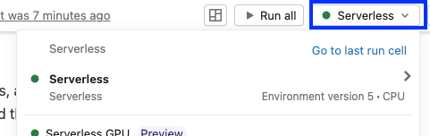
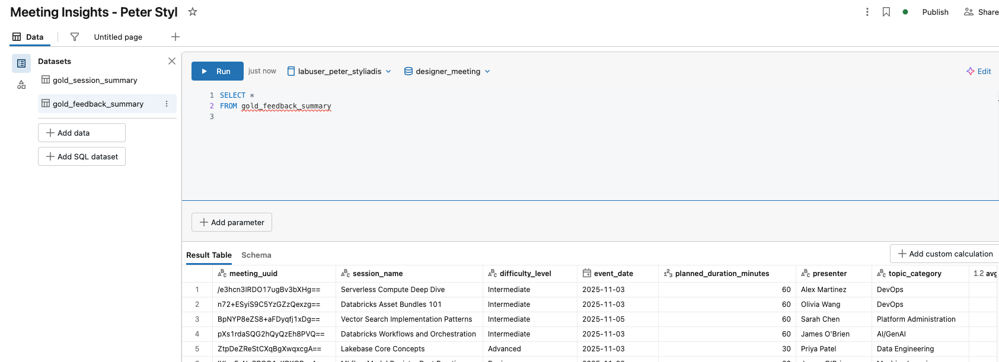
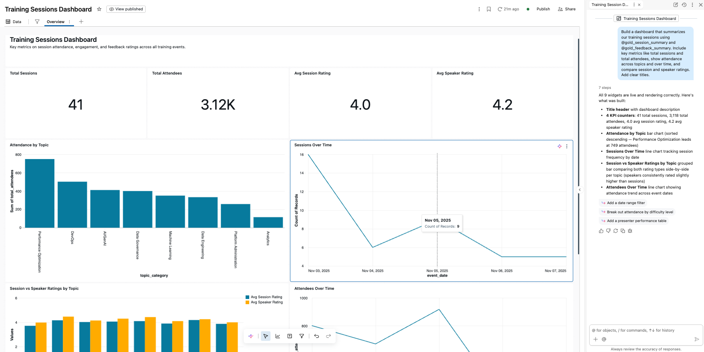
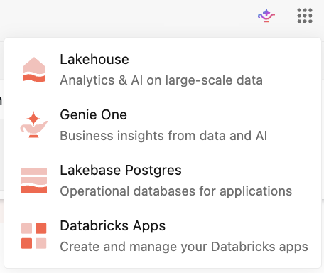
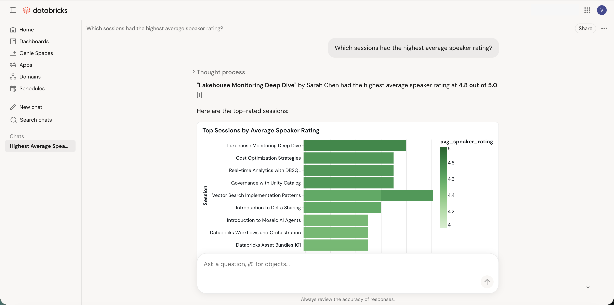

# Demo - Erkenntnisse liefern mit AI/BI und Genie

## Überblick

Sie haben Ihre Gold-Tabellen mit Lakeflow Designer gebaut. Diese analysebereiten Tabellen sind der Ausgangspunkt für das Liefern von Erkenntnissen, nicht die Ziellinie. In dieser kurzen Demo setzen Sie die Gold-Schicht für den Endnutzer-Konsum ein.

- Bauen Sie ein **AI/BI-Dashboard**, das Teilnahme und Feedback-Bewertungen der Sessions visualisiert.
- Nutzen Sie den **Genie Agent (Space)** des Dashboards, damit jeder in einfacher Sprache Fragen an die Gold-Tabellen stellen kann.
- Finden und nutzen Sie Ihre Arbeit in **Genie One**, der Startseite für Business-User bei Databricks.

## Lernziele

Am Ende dieser Demo können Sie:

- Ein **AI/BI-Dashboard erstellen** und Ihre Unity-Catalog-Gold-Tabellen als Datasets hinzufügen.
- **Genie Code** verwenden, um Visualisierungen aus Prompts in natürlicher Sprache zu generieren, und das Dashboard anschließend **veröffentlichen**.
- Mit dem **Genie Agent (Space)** des Dashboards Fragen in natürlicher Sprache an Ihre Daten **stellen**.
- **Beschreiben**, wann Sie ein AI/BI-Dashboard und wann einen **Genie Agent (Space)** einsetzen.
- Ihr Dashboard und Ihren Agent in **Genie One finden** und damit interagieren.

## PFLICHT – Rechenumgebung auswählen

> **Serverless Compute auswählen**
>
> Die Setup-Zelle unten läuft auf dem Compute des Notebooks, um Ihren Katalognamen auszugeben. Wählen Sie die unten aufgeführte erforderliche Rechenumgebung aus.
>
> - **Serverless Compute, Version 5**
>
> 
>
> **HINWEIS:** Das AI/BI-Dashboard und der Genie Agent selbst laufen auf einem **SQL-Warehouse** (das in der jeweils eigenen Oberfläche ausgewählt wird), nicht auf dem Compute dieses Notebooks.

## A. Classroom-Setup

Die Gold-Tabellen, die Sie mit **Lakeflow Designer** erstellt haben, werden für diese Demonstration benötigt.

Führen Sie die untenstehende Zelle aus, um zu bestätigen, dass Ihre **Gold**-Tabellen verfügbar sind. **Falls nicht, werden sie für Sie erstellt.**

```text
%run ./Includes/Classroom-Setup-aibi-genie
```

## B. Databricks Genie und AI/BI im Überblick

Lakeflow Designer hat Ihre Gold-Tabellen erzeugt.

**AI/BI** ist die Familie von Databricks-Erlebnissen, die Sie darauf aufsetzen, um Erkenntnisse zu liefern.

Bevor Sie irgendetwas bauen, nehmen Sie sich einen Moment Zeit, um zu sehen, wie **AI/BI Dashboards**, **Genie Agents**, **Genie One** und **Genie Code** zusammenspielen.

### B1. Überblick

> **Die Databricks-AI/BI-Familie**
> AI/BI und Genie — Databricks' agentenbasierte Business-Intelligence-Lösung. Dashboards plus konversationelle Analyse, direkt auf dem Lakehouse.
> *KI-native BI auf Databricks, angetrieben von Genie*

Die AI/BI-Familie besteht aus vier Bausteinen, die gemeinsam auf **Unity Catalog** und dem **Databricks Lakehouse** aufbauen — einer governten Kopie Ihrer Daten.

#### AI/BI Dashboards

- **Zielgruppe:** Business-User und Analysten
- **Kurzbeschreibung:** Interaktive BI-Dashboards auf Lakehouse-Daten, mit integriertem Genie.
- **Was es ist:** Interaktive BI-Dashboards direkt auf Lakehouse-Daten. Diagramme, Tabellen, Filter, Parameter und geplante Aktualisierungen. Kein separater BI-Stack erforderlich.
- **Zielgruppe (Details):** Business-User und Analysten, die interaktive, teilbare Visualisierungen und Berichte möchten.
- **Wie es sich einfügt:** Die visuelle Oberfläche von AI/BI. Genie ist integriert, sodass Nutzer Anschlussfragen in natürlicher Sprache stellen können.
- **Gute Anwendungsfälle:** Wiederkehrende KPIs und Management-Zusammenfassungen. Kuratierte Ansichten, die Sie für ein breites Publikum veröffentlichen. Standardberichte, die im Business immer wieder angefragt werden.
- **Passt gut zusammen mit:** Genie Agents für spontane Anschlussfragen. Genie Code für KI-unterstützte Erstellung.

#### Genie Agents *(vormals Genie Spaces)*

- **Zielgruppe:** Kuratiert von Fachexperten
- **Kurzbeschreibung:** Konversationelle Agents über vertrauenswürdige, domänenspezifische Daten.
- **Was es ist:** Themenspezifische konversationelle Agents auf Basis von Unity-Catalog-Daten. Enthalten Datasets, Beispielabfragen und Anweisungen, die Kennzahlen, Verknüpfungen (Joins) und Geschäftsregeln kodieren. Genau diese Kuratierung macht die Antworten vertrauenswürdig.
- **Zielgruppe (Details):** Kuratiert von Fachexperten und Analysten. Genutzt von Business-Usern, die mit dem Agent chatten, um Diagramme und Antworten in einfacher Sprache zu erhalten.
- **Wie es sich einfügt:** Jeder Agent ist eine semantische Schicht plus Assistent für eine einzelne Domäne (Finanzen, Sicherheit, Vertrieb usw.). Dashboards können einen begleitenden Genie Agent haben, damit Nutzer über den festen Bericht hinausgehen können.
- **Gute Anwendungsfälle:** Self-Service-Fragen und -Antworten zu einem definierten Thema mit vertrauenswürdigen Antworten. Business-Usern ermöglichen, Anschlussfragen zu stellen, die ein festes Dashboard nicht vorhersehen kann.

#### Genie One *(vormals Databricks One)*

- **Zielgruppe:** Business-User (Web + Mobile)
- **Kurzbeschreibung:** Die vereinfachte Startseite für Business-User für Dashboards, Agents und Apps.
- **Hinweis zur Umbenennung:** Databricks One wurde in Genie One umbenannt. Ältere Dokumentationen und Videos sprechen eventuell noch von „Databricks One", die Erfahrung ist jedoch dieselbe.
- **Was es ist:** Eine vereinfachte Oberfläche, die Business-Usern einen zentralen Einstiegspunkt bietet. Dashboards, Genie Agents und Databricks Apps an einem Ort öffnen. Über Genie in allen mit ihnen geteilten Assets suchen und chatten.
- **Zielgruppe (Details):** Business-User und Konsumenten von Daten und Apps. Konzipiert für Personen, die nicht die vollständige Workspace-Oberfläche benötigen.
- **Wie es sich einfügt:** Der zentrale Eingang für Business-Konsumenten. Enthält einen einheitlichen Chat, der Fragen an den passenden Genie Agent weiterleitet. Greift bei Bedarf auf umfassendere Genie Agents und verbundene Dokumentquellen zurück. Verfügbar für Web und Mobile.
- **Gute Anwendungsfälle:** Wenn ein nicht-technischer Nutzer einen zentralen Ort braucht, um alle mit ihm geteilten Dashboards, Agents und Apps zu finden, auf Web oder Mobile.

#### Genie Code

- **Zielgruppe:** Builder · technische Nutzer
- **Kurzbeschreibung:** Autonomer KI-Partner, der Dashboards, Pipelines und mehr baut.
- **Was es ist:** Ein autonomer KI-Partner für Datenteams. Er plant, schreibt Code, führt Code aus und iteriert über die eigenen Ergebnisse. Kein reiner Chatbot, sondern ein Agent.
- **Zielgruppe (Details):** Data Engineers und Data Analysts. Analytics Engineers und ML Engineers. Die Personen, die die Assets bauen, die Business-User später konsumieren.
- **Wo es verfügbar ist:** Derselbe Agent in Notebooks, Lakeflow-Pipelines und im Dashboard-Editor. Unterschiedliche Oberflächen, derselbe Assistent.
- **Gute Anwendungsfälle:** Pipelines bauen und reparieren. SQL für Datasets generieren. Dashboards gestalten und verfeinern. Code debuggen, Modelle und Endpunkte optimieren.

### B2. Von Gold-Tabellen zu Erkenntnissen für Konsumenten

**Von Gold-Tabellen zu Erkenntnissen** — Ihre governten **Gold-Tabellen** speisen zwei Konsumerlebnisse, **AI/BI Dashboards** und **Genie Agents**, die den Konsumenten über **Genie One** bereitgestellt werden.

> **Warum das wichtig ist**
> Beide Oberflächen lesen dieselben governten Gold-Tabellen, sodass Ihre Dashboard- und Genie-Antworten immer übereinstimmen.

Der Datenfluss sieht wie folgt aus:

**Unity-Catalog-Gold-Tabellen**

| Tabelle | Beschreibung |
|---|---|
| `gold_session_summary` | Teilnahmekennzahlen pro Session |
| `gold_feedback_summary` | Durchschnittliche Bewertungen pro Session |

↓ *(governte Daten)* ↓

**Genie One** bündelt zwei Zugänge auf denselben Gold-Tabellen:

- **AI/BI Dashboard** — Kuratierte Diagramme und KPIs
- **Genie Agent** — Fragen in natürlicher Sprache stellen

*Fragen stellen, Maßnahmen ergreifen und mit KI, die Ihr Geschäft kennt, echte Ergebnisse erzielen.*

↓ *(Antworten & Visualisierungen)* ↓

**Konsumenten:** Analysten, Business-User, Stakeholder

> **Grundlage:** Unity Catalog · eine governte Kopie Ihrer Daten · Berechtigungen durchgängig durchgesetzt

## C. Ein AI/BI-Dashboard mit Genie Code erstellen

Sie erstellen ein Dashboard, fügen beide Gold-Tabellen als Datasets hinzu und lassen anschließend **Genie Code** die Visualisierungen aus natürlicher Sprache generieren.

### C1. Neues Dashboard erstellen

1. Klicken Sie in der linken Seitenleiste mit der rechten Maustaste auf **Dashboards** > **Open Link in New Tab**.

2. Wählen Sie **Create dashboard** aus.

3. Ein leerer Dashboard-Entwurf öffnet sich.
    - **Canvas** – hier bauen und ordnen Sie Visualisierungen, Filter und Text an.
    - **Data** – hier definieren Sie die Datasets, aus denen die Visualisierungen lesen.

4. Dashboard umbenennen – Wählen Sie den Standardnamen oben links aus (*New Dashboard 20XX-07-06 11:23:21*) und geben Sie ein:
    - `Meeting Insights - YOUR NAME`

### C2. Ihre Gold-Tabellen als Daten hinzufügen

1. Wählen Sie den **Data**-Tab aus.

2. Wählen Sie **Add SQL dataset** aus.

3. Wählen Sie im Editor Ihren Standardkatalog und Ihr Standardschema aus:
    - Catalog: **labuser_UNIQUE_ID**
    - Schema: **designer_meeting**

4. Geben Sie die folgende Abfrage im Query-Editor ein und führen Sie sie mit **Run** aus:

```sql
SELECT * 
FROM gold_session_summary
```

5. Benennen Sie das Dataset **gold_session_summary**.
   - Rechtsklick auf `Untitled dataset` > **Rename**.

#### Wiederholen Sie den Vorgang und fügen Sie die folgende Abfrage hinzu:

```sql
SELECT * 
FROM gold_feedback_summary
```

6. Benennen Sie das Dataset **gold_feedback_summary**.

7. Bestätigen Sie, dass beide Datasets nun im **Data**-Tab erscheinen.

#### Checkpoint – Daten hinzufügen



### C3. Visualisierungen mit Genie Code generieren

Wechseln Sie nun zum **Canvas**-Tab und lassen Sie **Genie Code** die Diagramme für Sie erstellen.

1. Wählen Sie den Tab **Untitled Page** aus.

2. Suchen Sie das **Genie Code**-Eingabefeld (in der Mitte des Canvas bei einem neuen Dashboard, oder öffnen Sie das **Genie Code**-Seitenpanel).

3. Geben Sie den untenstehenden Prompt ein. Verwenden Sie das **@**-Symbol, um Ihre Datasets namentlich zu referenzieren, damit Genie Code den richtigen Kontext hat.

**Genie-Code-Prompt:**

```text
Build a dashboard that summarizes our training sessions using @designer_meeting.gold_session_summary and @designer_meeting.gold_feedback_summary. Include key metrics like total sessions and total attendees, show attendance across topics and over time, and compare session and speaker ratings. Add clear titles.
```

4. Genie Code schlägt einen Plan vor und baut die Widgets.
    - Prüfen Sie, was generiert wird, und wählen Sie dann **Allow** / **Continue**, um die vorgeschlagenen Schritte zu übernehmen, falls Sie dazu aufgefordert werden.
    - Wenn das Ergebnis nicht Ihren Erwartungen entspricht, wählen Sie **Decline** / **Reject** und verfeinern Sie Ihren Prompt.

5. Überprüfen Sie die generierten Visualisierungen auf dem Canvas. Von diesem Ausgangspunkt aus können Sie:
    - sie bei Bedarf per Drag-and-Drop neu anordnen,
    - Konfigurationseinstellungen für Ihren spezifischen Anwendungsfall anpassen,
    - weitere Visualisierungen hinzufügen,
    - eine neue Seite erstellen.

#### Nutzen Sie Genie Code gerne weiter, um Ihr Dashboard zu verbessern. Probieren Sie neue Prompts aus oder verwenden Sie die Vorschläge!

> **Andere Wege, Widgets zu erstellen**
>
> Sie müssen die gesamte Seite nicht aus einem einzigen Prompt heraus erstellen. Sie haben zwei weitere Optionen:
>
> - **Genie Code für ein einzelnes Widget nutzen** – wählen Sie ein bestehendes Widget aus oder beginnen Sie ein neues, und prompten Sie Genie Code dann nur für dieses Diagramm statt für die gesamte Seite.
> - **Widgets manuell hinzufügen und bearbeiten** – fügen Sie im **Canvas**-Tab ein **Visualization**-Widget hinzu, wählen Sie ein Dataset aus dem **Dataset**-Dropdown, wählen Sie einen Diagrammtyp aus dem **Visualization**-Dropdown, und weisen Sie den **X axis**- und **Y axis**-Feldern die entsprechenden Felder zu.
>
> Genie Code erledigt einfach diese Schritte für Sie, ausgehend von einer Beschreibung.

### C4. Dashboard veröffentlichen

Ein Entwurf ist nur für Sie sichtbar. **Publish** (Veröffentlichen) erstellt eine teilbare Version für Endnutzer.

1. Wählen Sie **Publish** oben rechts aus.

2. Überprüfen Sie die Anmeldedaten- und Freigabeoptionen und wählen Sie dann **Publish** aus.
    - Was sind Shared Data Permissions? [AWS](https://docs.databricks.com/aws/en/dashboards/share/share#what-are-shared-data-permissions) | [Azure](https://learn.microsoft.com/en-us/azure/databricks/dashboards/share/share#what-are-shared-data-permissions) | [GCP](https://docs.databricks.com/gcp/en/dashboards/share/share#what-are-shared-data-permissions)

3. Ihr Dashboard ist jetzt veröffentlicht. Verwenden Sie **Share**, um anderen Zugriff zu gewähren.

#### Checkpoint – Veröffentlichtes Dashboard (kann variieren)



## D. Einen Genie Agent (Space) erstellen

Ein AI/BI-Dashboard beantwortet die Fragen, die Sie vorhergesehen haben.

Mit einem **Genie Agent** können Nutzer eigene Fragen in einfacher Sprache stellen und erhalten Antworten, Diagramme und das generierte SQL zurück.

Standardmäßig wird zusammen mit Ihrem AI/BI-Dashboard ein Genie Agent erstellt.

### D1. Genie Agent (Space) im Überblick

> **Genie Agent (Space): Zwei Wege, ihn bereitzustellen**
> Es gibt zwei Möglichkeiten, einen aufzusetzen. Diese Demo nutzt die Standardvariante, die mit Ihrem Dashboard mitgeliefert wird.

**Mit Dashboards · hier verwendet — Standard-Dashboard-Genie-Agent (Space)**
- Wird beim Veröffentlichen automatisch generiert, es gibt also nichts zu bauen.
- Ermöglicht Dashboard-Betrachtern, Fragen zu den veröffentlichten Datasets und Visualisierungen zu stellen.
- Bleibt automatisch aktuell, wenn das Dashboard erneut veröffentlicht wird.
- Am besten für schnelle, dashboard-bezogene Fragen und Antworten.

**Eigenständig · hier nicht verwendet — Eigenständiger Genie Agent (Space)**
- Ein zweckgebundenes, wiederverwendbares Chat-Erlebnis.
- Sie kuratieren die Datasets, Beispiel-SQL-Abfragen und Anweisungen.
- Unabhängig von einem einzelnen Dashboard, mit eigener Freigabe.
- Am besten für eine governte, wiederverwendbare Frage-Antwort-Oberfläche.

> **Gut zu wissen – Einschränkungen des Dashboard-Genie-Agents (Space)**
>
> - Sie können den automatisch generierten Agent **öffnen**, aber Sie können seine Anweisungen in der Genie-Oberfläche **nicht bearbeiten**, wie Sie es bei einem eigenständigen Agent könnten.
> - Er erscheint **nicht** in der Genie-Listenansicht oder im Datei-Browser Ihres Workspace.
> - Er umfasst bis zu **30 Dashboard-Datasets**. Darüber hinaus werden nur die ersten 30 verwendet.

**Faustregel**
- Wollen Sie einfach nur Fragen zu diesem Dashboard beantworten? Nutzen Sie den eingebauten Standard-Agent (so wie in dieser Demo).
- Brauchen Sie eine governte, wiederverwendbare Frage-Antwort-Erfahrung, die Sie selbst gestalten? Erstellen Sie einen eigenständigen Agent.

### D2. Dashboard-Einstellungen aufrufen, um einen Genie Agent zu aktivieren oder zu deaktivieren

Führen Sie in Ihrem Dashboard (im Bearbeitungsmodus) Folgendes aus:

1. Wählen Sie weitere Optionen  > **Settings and themes** > **General** aus.

2. Stellen Sie sicher, dass **Enable Genie** aktiviert ist (standardmäßig aktiviert).

### D3. Dem Genie Agent Fragen in natürlicher Sprache stellen

1. Wählen Sie oben in Ihrem Dashboard **View Published** aus.

2. Wählen Sie unten im Canvas **Ask Genie** aus.

3. Stellen Sie im Chatfenster als Konsument Fragen zu Ihren Sessions.
    - Genie generiert das SQL, führt es aus und liefert das Ergebnis zurück. Probieren Sie diese nacheinander aus:

**Genie-Frage:**

```text
Which sessions had the highest average speaker rating?
```

**Genie-Frage:**

```text
What is the total number of attendees by topic_category?
```

**HINWEIS:** Bei jeder Antwort können Sie die Antwort erweitern, um das generierte **SQL** einzusehen und zu prüfen, sowie das Ergebnis zwischen Tabelle und Diagramm umschalten.

## E. Dashboard vs. Genie Agent: Wann was nutzen

Beide konsumieren dieselben governten Gold-Tabellen. Sie lösen unterschiedliche Probleme und funktionieren gut zusammen.

#### AI/BI Dashboard – einsetzen, wenn

- die Fragen bekannt sind und sich wiederholen (KPIs, wöchentlicher Review),
- Sie ein kuratiertes, konsistentes visuelles Layout wollen,
- Sie mit einem breiten Publikum aktualisieren und teilen möchten.

> **Tipp:** Planen Sie eine Dashboard-Aktualisierung als Task in einem **Lakeflow Job**, direkt nach dem Lauf Ihres Gold-Workflows.

#### Genie Agent – einsetzen, wenn

- die Fragen spontan und unvorhersehbar sind,
- Nutzer Antworten in einfacher Sprache wollen, ohne SQL,
- Sie explorieren möchten, bevor Sie sich auf ein festes Diagramm festlegen.

> **Tipp:** Fügen Sie allgemeine Anweisungen und Beispielabfragen hinzu, damit die Antworten in eigenständigen Genie Agents genau bleiben.

> **Gemeinsam stark**
> Beides ergänzt sich, statt zu konkurrieren. Nutzen Sie ein Dashboard für die Fragen, von denen Sie bereits wissen, dass sie wichtig sind, und kombinieren Sie es mit einem Genie Agent für die spontanen Fragen, die ein festes Reporting nicht vorhersehen kann. Beide lesen dieselben governten Gold-Tabellen, sodass die Zahlen immer übereinstimmen.

## F. Genie One

**Genie One** ist die vereinfachte Startseite für Endanwender bei Databricks, um die Daten Ihrer Organisation zu konsumieren.

Hier landen die Personen, für die Sie gebaut haben – Analysten, Business-User und Stakeholder –, um die mit ihnen geteilten **Dashboards**, **Genie Agents** und Apps zu finden, auf Web und Mobile, ohne jemals den vollständigen Workspace zu öffnen.

Weitere Details finden Sie in der Dokumentation: [AWS](https://docs.databricks.com/aws/en/genie-one/genie) | [Azure](https://learn.microsoft.com/en-us/azure/databricks/genie-one/genie) | [GCP](https://docs.databricks.com/gcp/en/genie-one/genie)

### Genie One im Überblick

> **Alles in Genie One sehen**
> Betrachten Sie Ihre Arbeit so, wie es ein Konsument tut. Öffnen Sie Genie One, finden Sie heraus, was in Ihrer Organisation verfügbar ist, oder stellen Sie einfach eine Frage!

Von Genie One aus können Sie:

**Ihre Arbeit finden und öffnen**
- AI/BI-Dashboards
- Genie Agents (Spaces)
- Databricks Apps
- Abfragen, Tabellen und Dokumente

**In natürlicher Sprache fragen**
- Der Chat beantwortet Fragen zu Ihren Daten, ganz ohne SQL.
- Durchsucht Ihre Dashboards, Abfragen und Genie Agents (Spaces).
- Google Drive oder SharePoint verbinden, um Ihre Dokumente einzubeziehen.

**Relevantes entdecken**
- Personalisierte „For you"-Empfehlungen
- Nach Domain durchsuchen
- Favoriten markieren und sehen, was gerade im Trend liegt

> Genie One ist die vereinfachte Startseite für Business-User bei Databricks. Ein zentraler Ort, um die mit Ihnen geteilten Daten- und KI-Assets zu finden, zu öffnen und danach zu fragen – auf Web und Mobile.

**Genie One ist der zentrale Einstiegspunkt für Business-User**
- Es ist die vereinfachte Oberfläche, in der Konsumenten mit Daten und KI interagieren, ohne mit Compute, Abfragen oder Notebooks in Berührung zu kommen.
- Es ist keine einzelne Funktion oder eine lineare Schrittfolge, sondern eine Startseite. Von dort aus verzweigen sich Nutzer zu dem, was sie brauchen: den mit ihnen geteilten Assets, einer Frage in natürlicher Sprache oder personalisierten Empfehlungen.

**Ihre Arbeit finden und öffnen**
- Genie One zeigt die mit Ihnen geteilten Assets: AI/BI-Dashboards, Genie Agents (Spaces), Databricks Apps sowie gespeicherte Abfragen, Tabellen und Dokumente.
- Das von Ihnen veröffentlichte Dashboard und der zugehörige Genie Agent erscheinen hier, zusammen mit allem anderen, auf das der Konsument Zugriff hat.
- Klicken Sie auf ein Asset, um es in seiner gewohnten Umgebung zu öffnen (ein Dashboard öffnet sich beispielsweise als Dashboard).

**In natürlicher Sprache fragen**
- Genie One enthält einen einheitlichen Chat. Stellen Sie eine Frage in einfacher Sprache, zum Beispiel „Which topic had the most attendees?", und Genie One beantwortet sie anhand Ihrer Daten.
- Der Chat durchsucht Ihre Dashboards, Abfragen und Genie Agents (Spaces), um die Antwort zu finden, sodass der Konsument nie SQL schreibt.
- Sie können auch externe Quellen wie Google Drive oder SharePoint verbinden, um Ihre Unternehmensdokumente in die Konversation einzubeziehen.

**Relevantes entdecken**
- Der Bereich „For you" empfiehlt Assets basierend auf Ihrer Aktivität und dem, was bei ähnlichen Nutzern im Trend liegt.
- Domains ermöglichen es, Assets nach Geschäftskontext gruppiert zu durchsuchen, statt durch Katalog-Hierarchien zu navigieren.
- Favoriten und zuletzt verwendete Elemente erleichtern den Rückweg zu dem, was Sie am häufigsten nutzen.

**Warum das wichtig ist**
- Es schließt den Kreis von Rohdaten über eine governte Gold-Schicht, zu einem Dashboard und Agent, bis hin zu einer Self-Service-Startseite, an der ein Business-User Antworten finden kann.
- Die Erkenntnis für Lernende: Sobald die Gold-Tabellen, das Dashboard und der Agent existieren, ist das Liefern von Erkenntnissen eine Frage des Findens oder Fragens, nicht des Bauens.

### F1. Genie One öffnen

1. Oben rechts:

   - Wählen Sie **Switch apps** aus.

   

   - Klicken Sie mit der rechten Maustaste auf **Genie One** und wählen Sie **Open Link in New Tab** aus.

        - Genie One öffnet sich als vereinfachte Startseite, getrennt von der vollständigen Workspace-Oberfläche.

2. Wählen Sie **Dashboards** aus. Bestätigen Sie, dass Sie das von Ihnen erstellte Dashboard sehen.

3. Öffnen Sie das Dashboard **Meeting Insights** aus Genie One, um zu bestätigen, dass Ihre veröffentlichten Diagramme für einen Konsumenten korrekt dargestellt werden.

### F2. Genie One eine Frage stellen

Genie One bietet ein einheitliches Chat-Erlebnis. Stellen Sie eine Frage in einfacher Sprache, und Genie One kümmert sich im Hintergrund darum.

1. Öffnen Sie Genie One.

2. Navigieren Sie zur **Home**-Seite.

3. Geben Sie die folgende Frage ein und senden Sie sie ab.

**Genie-Frage:**

```text
Which sessions had the highest average speaker rating?
```

4. Erkunden Sie die Antwort in Genie One:
- Prüfen Sie die von Genie One zurückgegebene Antwort.
- Erkunden Sie bei Bedarf die unterstützenden Details.
- Beachten Sie, wie das Erlebnis kuratierte Erkenntnisse von einem einzigen Ausgangspunkt aus zugänglicher macht.

#### Checkpoint – Genie One (kann variieren)



---

© Databricks, Inc. Alle Rechte vorbehalten.
