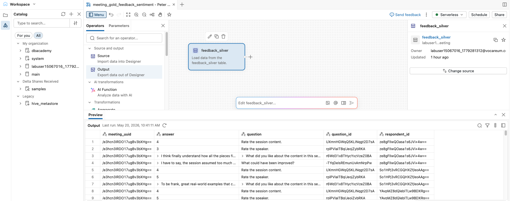
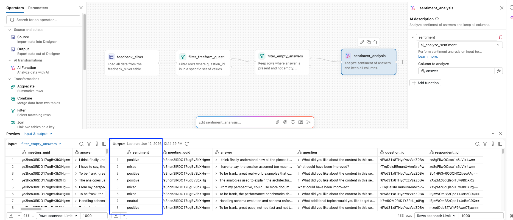
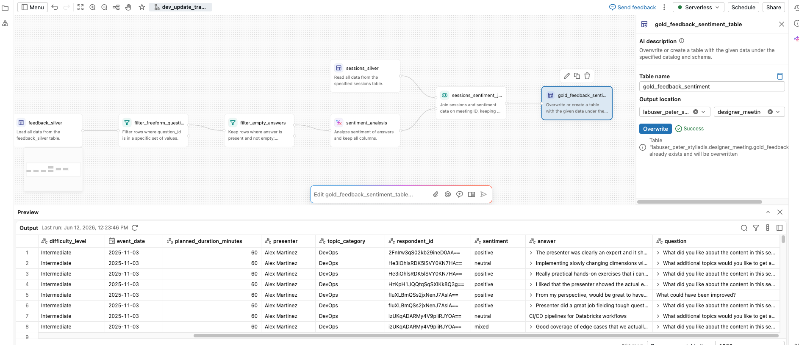

# Bonus-Lab: Verwendung von KI-Funktionen

### Dauer: ca. 20 Minuten

## Überblick

Dies ist ein **Lab im Selbststudium**, mit dem Sie Lakeflow Designer außerhalb des Live-Workshops üben können.

Es baut auf dem auf, was Sie bereits erstellt haben, und fügt eine weitere Gold-Tabelle hinzu. Dabei wird diesmal der **AI-Function**-Operator mit `ai_sentiment` vorgestellt.

Sie erstellen eine neue Gold-Tabelle, die folgende Frage beantwortet: *„Wie haben die Teilnehmenden die einzelnen frei formulierten Aspekte der Session empfunden?"*

Die finale Tabelle enthält eine Zeile pro frei formulierter Antwort mit:

- **meeting_uuid**
- **session_name** (aus `sessions_silver`)
- **answer** (der ursprüngliche Freitext)
- **question_id** und **question**
- **respondent_id**
- **sentiment** (positiv, negativ, neutral oder gemischt), erzeugt durch `ai_sentiment`

## Lernziele

Am Ende dieses Labs können Sie:

- **Genie Code** (KI) verwenden, um aus einem natürlichsprachlichen Prompt eine Kette aus Filter + AI Function + Output zu erzeugen.
- Den **AI-Function**-Operator mit `ai_sentiment` **anwenden**, um aus frei formuliertem Text-Feedback Sentiment-Labels abzuleiten.
- Das Ergebnis mit einer Silber-Dimensionstabelle **verbinden (joinen)**, um beschreibende Metadaten (`session_name`) zu ergänzen.
- KI-generierte Knoten **prüfen** und die Ausgabe verifizieren, bevor Sie ihr vertrauen.

## ERFORDERLICHE VORAUSSETZUNGEN

> **Voraussetzungen**
>
> Sie müssen **alle vorherigen Demonstrationen** abgeschlossen haben, bevor Sie mit diesem Lab beginnen.

## A. `ai_sentiment` mit Genie Code anwenden

In diesem Schritt verwenden Sie **Genie Code**, um eine Kette von Knoten zu erzeugen, die **feedback_silver** auf frei formulierte Antworten filtert und die KI-Funktion `ai_sentiment` anwendet.

Dies ist das KI-first-Autorenmuster: Sie beschreiben das gewünschte Ergebnis in natürlicher Sprache und lassen Designer die Operatoren zusammenstellen.

### Die frei formulierten Fragen

Drei `question_id`-Werte in **feedback_silver** sind Freitext (keine numerischen Bewertungen):

| question_id | Frage |
|---|---|
| `r6Wd31x8THycYxzVzeZ0BA` | What did you like about the content in this session? |
| `-TYqDeIsREmunUvAmNrpPw` | What could have been improved? |
| `is7w6QM0RtK1Y3RsL_o8Vg` | What additional topics would you like a deep dive on? |

### Was `ai_sentiment` zurückgibt

`ai_sentiment` ist eine integrierte Databricks-KI-Funktion. Sie nimmt eine Textzeichenkette entgegen und gibt eines von vier Labels zurück: `positive`, `negative`, `neutral` oder `mixed`. Es ist kein Modell-Deployment erforderlich.

**Verfügbare AI Functions**: [AWS](https://docs.databricks.com/aws/en/designer/built-in-operators#ai-function) | [Azure](https://learn.microsoft.com/en-us/azure/databricks/designer/built-in-operators#ai-function) | [GCP](https://docs.databricks.com/gcp/en/designer/built-in-operators#ai-function)

### A1. Eine neue Visual-Data-Prep-Datei in Lakeflow Designer erstellen

> Es erleichtert die weitere Bearbeitung, wenn Sie dieses Notebook in einem Tab und Lakeflow Designer in einem anderen Tab geöffnet halten.

1. Wählen Sie in der **Workspace-Seitenleiste** das Symbol **Folder** (Ordner) aus.

2. Wählen Sie in Ihrem Hauptordner **More Options** > **Create** > **Visual data prep**.
   - **HINWEIS:** Sie können auch über die Hauptnavigationsleiste **+ New** > **Visual data prep** wählen.

3. Es öffnet sich eine neue Datei mit einem automatisch generierten Namen wie `Visual data prep YYYY-MM-DD HH:MM:SS`.

4. Klicken Sie oben auf der Seite auf den Namen und benennen Sie die Datei in `meeting_gold_feedback_sentiment - IHRE INITIALEN` um.

5. **Lakeflow Designer** sollte nun geöffnet und einsatzbereit sein.

### A2. Die Quelltabelle `feedback_silver_table` hinzufügen

1. Fügen Sie aus Ihrem Schema **labuser_UNIQUE_ID.designer_meeting** die Tabelle **feedback_silver** zur Arbeitsfläche hinzu.

#### Kontrollpunkt – Quell-Silbertabelle hinzufügen



### A3. Die Tabelle filtern und transformieren

1. Wählen Sie den Knoten **feedback_silver** aus.

2. Geben Sie in der **Genie-Code**-Prompt-Leiste den folgenden Prompt ein:

> **Genie-Code-Prompt** (im Original auf Englisch einzugeben)
>
> ```text
> Using the feedback_silver table:
> - Filter to only the three free-form question_ids: 'r6Wd31x8THycYxzVzeZ0BA', '-TYqDeIsREmunUvAmNrpPw', and 'is7w6QM0RtK1Y3RsL_o8Vg'.
> - Filter out empty answer rows
> - Add a new column called sentiment by applying the ai_sentiment AI function to the answer column.
> - Keep all existing columns.
> ```

> **Warnung**
>
> Die Ausführung von AI Functions kann einige Minuten in Anspruch nehmen.

3. **Genie Code** erzeugt die Knoten auf der Arbeitsfläche. Prüfen Sie das Ergebnis und klicken Sie anschließend, falls gefragt, auf **Accept all**.
    - **Filter**-Knoten
    - **add_sentiment**-Knoten (AI Function)

4. Wählen Sie den generierten AI-Function-Knoten aus und betrachten Sie dessen **Preview**-Bereich. Bestätigen Sie:
    - Jede Zeile hat einen **sentiment**-Wert von `positive`, `negative`, `neutral` oder `mixed`.
    - Es sind nur Zeilen der drei frei formulierten Fragen vorhanden.
    - Die ursprünglichen Spalten (**meeting_uuid**, **answer**, **question**, **question_id**, **respondent_id**) sind weiterhin vorhanden.

5. Falls das Ergebnis nicht Ihren Erwartungen entspricht:
    - **Passen Sie den generierten Knoten manuell an** im Konfigurationsbereich.
    - **Prompten Sie Genie Code erneut** mit einer präziseren Beschreibung.

6. Benennen Sie den generierten AI-Function-Knoten in `feedback_sentiment_transform` um.

#### Kontrollpunkt – Filter und KI-Transformation



## B. AUFGABE: Verbindung mit Session-Metadaten

Die Ausgabe aus dem vorherigen Abschnitt enthält **meeting_uuid**, jedoch nicht den lesbaren **session_name** oder weitere Session-Details.

In diesem Schritt verbinden (joinen) Sie das Sentiment-Ergebnis selbstständig mit **sessions_silver**, damit die Gold-Tabelle vollständig und analysebereit ist.

Sie können dies auf folgende Arten umsetzen:

- manuell mit den Operatoren **Join** und **Output**, oder
- mit **Genie Code**, um die gesamte Join- + Output-Kette aus einem einzigen Prompt zu erzeugen.

### AUFGABE: Folgendes umsetzen

1. Fügen Sie die Tabelle **sessions_silver** zur Arbeitsfläche hinzu.

2. Fügen Sie einen **Join**-Operator zwischen **sessions_silver_table** (links) und **feedback_sentiment_transform** (rechts) hinzu.
    - Behalten Sie alle Spalten aus **sessions_silver_table** bei.
    - Behalten Sie aus **feedback_sentiment_transform** nur die Spalten **respondent_id**, **sentiment**, **answer** und **question** bei.

3. Konfigurieren Sie einen **Left Join** auf **meeting_uuid**, damit jede Sentiment-Zeile erhalten bleibt.

4. Geben Sie das Ergebnis als Tabelle mit dem Namen `gold_feedback_sentiment` aus (**Output**).

5. Wählen Sie **Run** für die finale Tabelle.

6. Ordnen Sie Ihre Arbeitsfläche automatisch an (**Auto Layout**).

> **Warnung**
>
> Die Ausführung von AI Functions kann einige Minuten in Anspruch nehmen.

#### Kontrollpunkt – Join (kann abweichen)



## C. Ihre Gold-Tabelle validieren

Die folgende Zelle verwendet einen kleinen Python-Hilfsbaustein (`check_table`), um Ihre Tabelle `gold_feedback_sentiment` zu validieren. Er prüft zwei Dinge:

- Die **Zeilenanzahl** entspricht den Erwartungen (3.984 frei formulierte Antworten, eine Zeile pro Antwort).
    - Beachten Sie, dass der Vorschaubereich (Preview) von Lakeflow Designer nur eine Stichprobe der Daten anzeigt.
- Die **erwarteten Spalten** sind vorhanden.

Schlägt eine Prüfung fehl, gibt die Ausgabe eine Zeile mit `[FAIL]` aus. Bei Fehlern bei der Zeilenanzahl wird zusätzlich ein Hinweis ausgegeben, die JOIN-Konfiguration zu überprüfen.

> **Warten Sie, bis die Tabelle erstellt ist**
>
> Sie müssen abwarten, bis Lakeflow Designer die finale Tabelle **gold_feedback_sentiment** erstellt hat, bevor Sie mit der Validierung fortfahren.

### C1. ERFORDERLICH – EINE COMPUTE-UMGEBUNG AUSWÄHLEN

> **Serverless Compute auswählen**
>
> Wählen Sie vor dem Start dieses Notebooks die unten aufgeführte erforderliche Compute-Umgebung aus.
>
> - **Serverless Compute, Version 5**
>
> 
>
> Anleitung zur Auswahl einer Umgebungsversion:
> [AWS](https://docs.databricks.com/aws/en/compute/serverless/dependencies#-select-an-environment-version) |
> [Azure](https://learn.microsoft.com/en-us/azure/databricks/compute/serverless/dependencies#-select-an-environment-version) |
> [GCP](https://docs.databricks.com/gcp/en/compute/serverless/dependencies#-select-an-environment-version)
>
> **HINWEIS:** Dieses Notebook erfordert **SQL und Python** und wurde mit **Serverless V5** getestet. All-Purpose Compute funktioniert unter Umständen ebenfalls, es wird jedoch nicht garantiert, dass es sich identisch verhält oder alle gezeigten Funktionen unterstützt.

1. Führen Sie die Zelle aus, um die benötigte Validierungsfunktion zu erstellen.

```text
%run ./Includes/Classroom-Setup-Validation-Checker
```

### C2. Die Tabelle `gold_feedback_sentiment` validieren

```python
check_table(
    table_name=f"{my_catalog}.{schema}.gold_feedback_sentiment",
    expected_rows=3984,
    expected_columns=[
        "event_date", "difficulty_level", "session_name", "meeting_uuid", "planned_duration_minutes",
        "presenter", "topic_category", "sentiment", "answer", "question"
    ]
)
```

---

&copy; Databricks, Inc. Alle Rechte vorbehalten.
