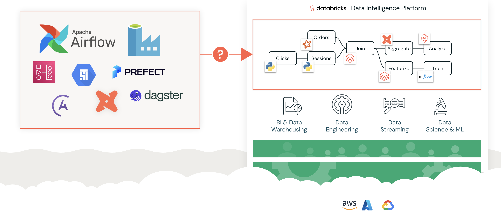
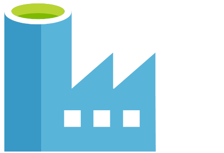
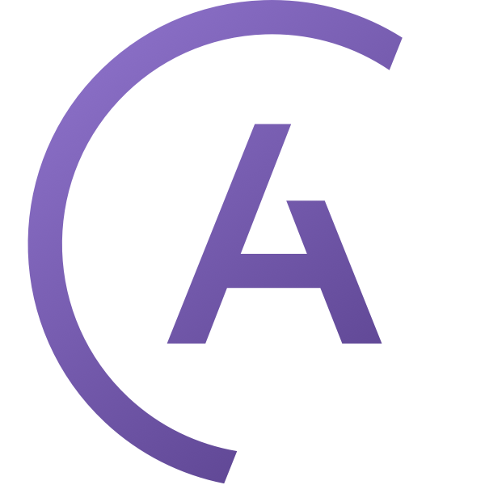
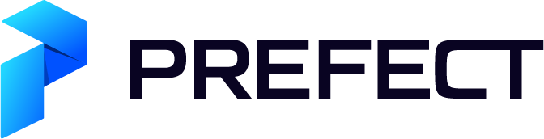
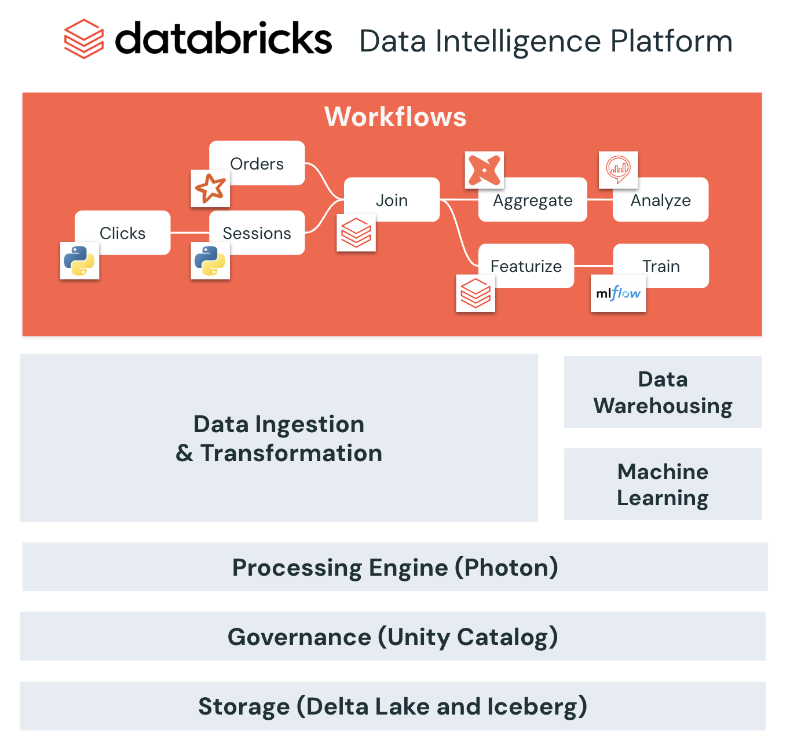
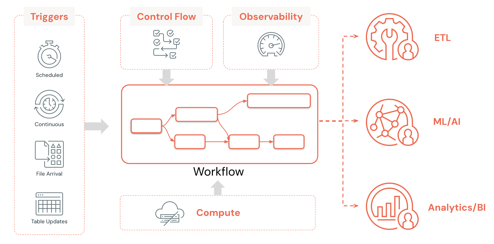

 Lakeflow bietet eine einheitliche Plattform für Daten-Ingestion, Transformation und Orchestrierung und umfasst die folgenden Komponenten:

- **Lakeflow Connect**: Eine Reihe effizienter Ingestion-Connectors, die das Ingestieren von Daten aus gängigen Unternehmensanwendungen, Datenbanken, Cloud-Speicher, Message Buses und lokalen Dateien vereinfachen.

- **Apache Spark Declarative Pipelines**: Ein Framework zum Erstellen von Batch- und Streaming-Daten-Pipelines mit SQL und Python, das die ETL-Entwicklung beschleunigen soll.

- **Lakeflow Jobs**: Ein Tool zur Workflow-Automatisierung für Databricks, das Datenverarbeitungs-Tasks und Workflows orchestriert. Es ermöglicht die Koordination mehrerer Tasks innerhalb komplexer Workflows und damit die Planung, Optimierung und Verwaltung wiederholbarer Prozesse.

### A2. Lakeflow Jobs

In diesem Kurs konzentrieren wir uns speziell auf Lakeflow Jobs – die Orchestrierungskomponente.

  

##### Zusätzliche Hinweise
Mit Lakeflow Jobs können Sie jede Art von Workload in Databricks orchestrieren, darunter Notebooks, SQL-Abfragen, Dashboards, Pipelines und vieles mehr. 

Genau dieser einheitliche Ansatz macht Lakeflow Jobs so leistungsfähig.

## B. Was ist Lakeflow Jobs?

### B1. Möglichkeiten zur Orchestrierung Ihrer Workloads

In modernen Datenarchitekturen gibt es eine grundlegende Herausforderung: **die Wahl des richtigen Orchestrierungsansatzes für Lakehouse-Workloads**.

  

##### Zusätzliche Hinweise
Der linke Bereich zeigt mehrere Optionen, darunter Open-Source-Lösungen (Apache Airflow, Prefect, Dagster, dbt), Cloud-native Dienste (AWS, Azure, Google Cloud) und eigene interne Frameworks.

Das Diagramm rechts zeigt einen typischen Daten-Workflow mit mehreren Schritten: Ingestion von Sessions- und Clicks-Daten, deren Verknüpfung (Join), Featurisierung und Aggregation, Analyse und Modelltraining. Anschließend gibt es verschiedene nachgelagerte Verwendungen, darunter BI und Data Warehousing, Data Streaming sowie Data Science und ML.

Das Fragezeichen im Diagramm steht für eine zentrale Herausforderung: Es gibt viele Möglichkeiten, diese Workloads zu orchestrieren – aber welcher Ansatz ist der beste? 

### B2. Externe Orchestratoren bringen Herausforderungen mit sich

Die Arbeit mit externen Orchestrierungstools ist schwierig, da sie Herausforderungen in Bezug auf Produktivität, Qualität und Zuverlässigkeit mit sich bringen.

Datenteams sind weniger produktivFür viele Anwender schwer zu bedienen
Schlechte Daten mindern den Wert nachgelagerter AnwendungenBei Problemen ist die Ursache schwer zu ermitteln
Höhere Betriebskosten und geringere ZuverlässigkeitKomplexe Architektur, die verwaltet und gewartet werden muss

Diese Tools sind **nicht in Ihr Lakehouse integriert**

##### Zusätzliche Hinweise
Viele Organisationen verwenden externe Orchestrierungstools, was jedoch erhebliche Herausforderungen mit sich bringt. Datenteams werden weniger produktiv, da diese Tools für viele Anwender schwer zu bedienen sind. Schlechte Datenqualität mindert den Wert nachgelagerter Anwendungen.

Außerdem haben Sie höhere Betriebskosten und eine geringere Zuverlässigkeit. Wenn Probleme auftreten, ist es schwierig, die Ursache zu verstehen. Die komplexe Architektur wird schwer zu verwalten und zu warten.

Vor allem sind diese externen Tools nicht in Ihr Lakehouse integriert, was zu Integrationsproblemen und Datensilos führt.

### B3. Was ist Lakeflow Jobs?

Einheitliche Orchestrierung für Daten, Analytics und KI auf der Data Intelligence Platform

Wichtige Vorteile

Einfache Erstellung
Umsetzbare Erkenntnisse
Bewährte Zuverlässigkeit

##### Zusätzliche Hinweise
Hier kommt Lakeflow Jobs ins Spiel. Es bietet eine einheitliche Orchestrierung für Daten-, Analytics- und KI-Workloads direkt auf der Data Intelligence Platform.

Die wichtigsten Vorteile sind einfache Erstellung, umsetzbare Erkenntnisse und bewährte Zuverlässigkeit. Da es nativ in die Plattform integriert ist, arbeitet es nahtlos mit Daten-Ingestion und -Transformation, der Verarbeitungs-Engine (Photon), Governance (Unity Catalog), Speicher (Delta Lake), Data Warehousing und Machine-Learning-Funktionen zusammen.

Der hier gezeigte Workflow – von Sessions und Clicks über Join, Featurize, Aggregate, Analyze bis Train – läuft vollständig nativ innerhalb derselben Plattform und beseitigt die Integrationsprobleme externer Tools.

### B4. Architektur von Lakeflow Jobs

  

##### Zusätzliche Hinweise
- Dieses Diagramm zeigt die vollständige Architektur von Lakeflow Jobs. Im Zentrum steht die Workflow-Engine, die alles koordiniert.
- Die Compute-Schicht unterstützt verschiedene Workload-Typen: ETL-, ML/KI- und Analytics/BI-Operationen.
- Es gibt mehrere Trigger-Typen: Scheduled (zeitbasiert), Continuous (dauerhaft laufend), File Arrival (ereignisgesteuert) und Table Updates.
- Zwei zentrale Komponenten unterstützen das gesamte System: Observability für Monitoring und Fehlerbehebung sowie Control Flow für die Verwaltung von Task-Abhängigkeiten und Ausführungsreihenfolge.
