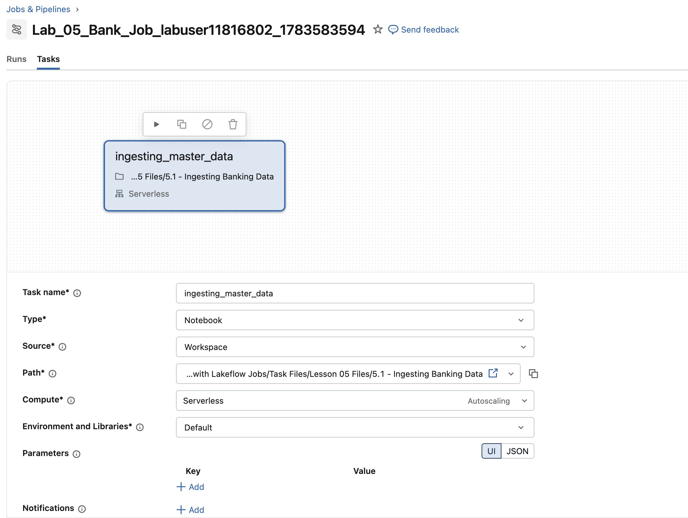
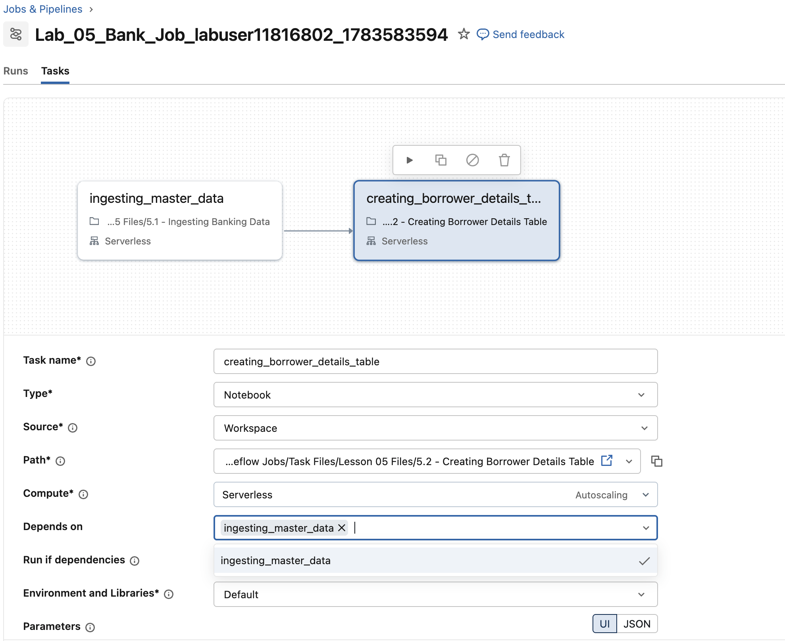
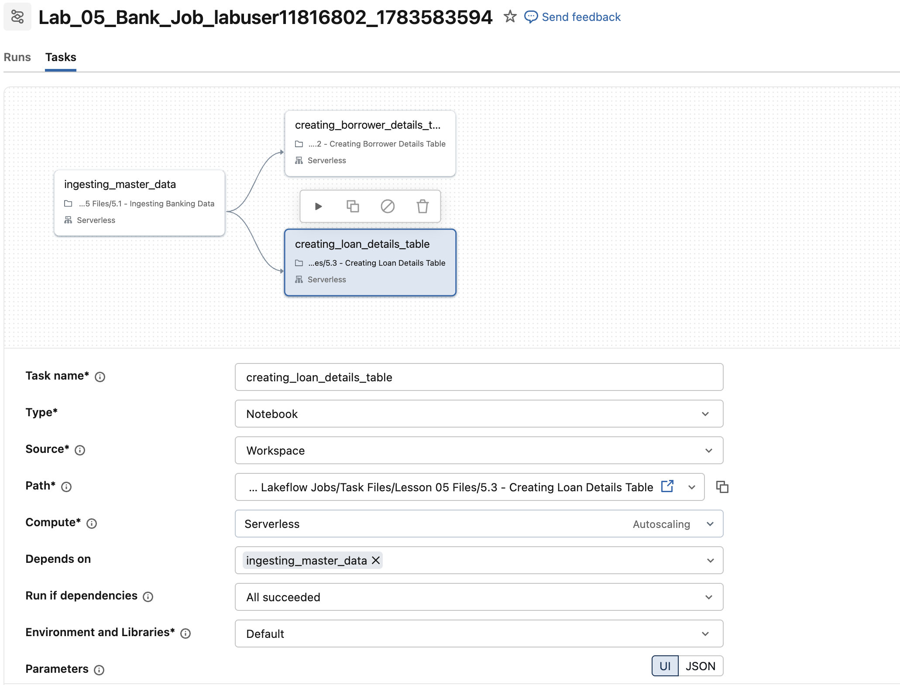

```python
DA.print_job_config(job_name_extension="Lab_05_Bank_Job", 
                    file_paths='/Task Files/Lesson 05 Files',
                    Files=[
                            '5.1 - Ingesting Banking Data',
                            '5.2 - Creating Borrower Details Table',
                            '5.3 - Creating Loan Details Table'
                        ])
```

## C. Einen Job mit mehreren Tasks konfigurieren

Dieser Job führt drei einfache Tasks aus:

1. **Datei #1** – Eine CSV-Datei ingestieren und die Tabelle **bank_master_data_bronze** in Ihrem Schema erstellen.

2. **Datei #2** – Eine Tabelle namens **borrower_details_silver** in Ihrem Schema erstellen.

3. **Datei #3** – Eine Tabelle namens **loan_details_silver** in Ihrem Schema erstellen.

### C1. Einen einzelnen Notebook-Task hinzufügen

Beginnen wir damit, das erste Notebook [Task Files/Lesson 05 Files/5.1 - Ingesting Banking Data]($./Task Files/Lesson 05 Files/5.1 - Ingesting Banking Data) einzuplanen. Klicken Sie auf den Link im vorherigen Satz, um den Code anzusehen.

Das Notebook erstellt in Ihrem Schema eine Tabelle namens **bank_master_data_bronze** aus der CSV-Datei im Volume `/Volumes/dbacademy_bank/v01/banking/loan-clean.csv`. 

1. Klicken Sie in der Seitenleiste mit der rechten Maustaste auf die Schaltfläche **Jobs and Pipelines** und wählen Sie *Open Link in New Tab*. 

2. Wählen Sie den Tab **Jobs & Pipeline**, klicken Sie dann auf die Schaltfläche **Create** und wählen Sie im Dropdown **Job**.

3. Geben Sie oben links auf dem Bildschirm den oben angegebenen **Job Name** ein, um den Job zu benennen (Sie müssen den oben angegebenen Job-Namen verwenden).

4. Wählen Sie **Notebook** aus den empfohlenen Tasks. Falls es nicht in der Empfehlungsliste steht, wählen Sie es über **+Add another task type** aus.

5. Konfigurieren Sie den Task wie unten angegeben. Für diesen Schritt benötigen Sie die Werte aus der obigen Zellenausgabe.

| Einstellung | Anweisungen |
|--|--|
| Task name | Geben Sie **ingesting_master_data** ein |
| Type | Wählen Sie **Notebook** |
| Source | Wählen Sie **Workspace** |
| Path | Geben Sie mit dem Navigator den oben angegebenen Pfad für **Datei #1** an (Notebook **Task Files/Lesson 05 Files/5.1 - Ingesting Banking Data**) |
| Compute | Wählen Sie im Dropdown-Menü einen **Serverless**-Cluster (Wir verwenden in diesem Kurs Serverless-Cluster für Jobs. Außerhalb dieses Kurses können Sie bei Bedarf auch einen anderen Cluster angeben) ; ; **HINWEIS**: Wenn Sie Ihren All-Purpose-Cluster auswählen, erhalten Sie möglicherweise eine Warnung, dass dies als All-Purpose-Compute abgerechnet wird. Produktions-Jobs sollten immer auf neuen Job-Clustern geplant werden, die für den Workload passend dimensioniert sind, da diese zu einem deutlich niedrigeren Tarif abgerechnet werden. |

6. Klicken Sie auf die Schaltfläche **Create task**.

7. #####Für eine bessere Performance aktivieren Sie bitte den Performance Optimized Mode in den Job Details. Andernfalls kann es 6 bis 8 Minuten dauern, bis die Ausführung startet.

8. Klicken Sie oben rechts auf die blaue Schaltfläche **Run now**, um den Job zu starten.

9. Wählen Sie in der Navigationsleiste den Tab **Runs** und prüfen Sie, ob der Job erfolgreich abgeschlossen wird.

10. Wählen Sie im linken Bereich **Catalog**, navigieren Sie im Katalog **dbacademy** zu Ihrem Schema und bestätigen Sie, dass die Tabelle **bank_master_data_bronze** erstellt wurde (möglicherweise müssen Sie Ihr Schema aktualisieren).



### C2. Den zweiten Task zum Job hinzufügen

Konfigurieren Sie nun einen zweiten Task, der vom erfolgreichen Abschluss des ersten Tasks **Ingesting_master_data** abhängt. Der zweite Task ist das Notebook [Task Files/Lesson 05 Files/5.2 - Creating Borrower Details Table]($./Task Files/Lesson 05 Files/5.2 - Creating Borrower Details Table). Öffnen Sie das Notebook und sehen Sie sich den Code an.

Dieses Notebook erstellt in Ihrem Schema eine Tabelle namens **borrower_details_silver** aus der Tabelle **bank_master_data_bronze**, die vom vorherigen Task erstellt wurde.

Schritte:
1. Kehren Sie zu Ihrem Job zurück. Klicken Sie auf der Seite Job details auf den Tab **Tasks**.

2. Klicken Sie unterhalb des Tasks **ingesting_master_data** auf die Schaltfläche **+ Add task** und wählen Sie im Dropdown-Menü **Notebook**.

3. Konfigurieren Sie den Task wie folgt:

| Einstellung  | Anweisungen |
|--------------|--------------|
| Task name    | Geben Sie **creating_borrower_details_table** ein |
| Type         | Wählen Sie **Notebook** |
| Source       | Wählen Sie **Workspace** |
| Path         | Geben Sie mit dem Navigator den oben angegebenen Pfad für **Datei #2** an (Notebook **Task Files/Lesson 05 Files/5.2 - Creating Borrower Details Table**) |
| Compute      | Wählen Sie im Dropdown-Menü einen **Serverless**-Cluster (Wir verwenden in diesem Kurs Serverless-Cluster für Jobs. Außerhalb dieses Kurses können Sie bei Bedarf auch einen anderen Cluster angeben) |
| Depends on   | Stellen Sie sicher, dass **Ingesting_master_data** (der vorherige Task) aufgeführt ist |

4. Klicken Sie auf die blaue Schaltfläche **Create task**.



### C3. Den dritten Task zum Job hinzufügen

Konfigurieren Sie nun einen dritten Task, der vom erfolgreichen Abschluss des ersten Tasks **Ingesting_master_data** abhängt. Der dritte Task ist das Notebook [Task Files/Lesson 05 Files/5.3 - Creating Loan Details Table]($./Task Files/Lesson 05 Files/5.3 - Creating Loan Details Table). Öffnen Sie das Notebook und sehen Sie sich den Code an.

Dieses Notebook erstellt in Ihrem Schema eine Tabelle namens **loan_details_silver** aus der Tabelle **bank_master_data_bronze**, die vom vorherigen Task erstellt wurde.
Achten Sie außerdem genau auf die letzten Befehle – sie setzen den Ausgabe-Task-Wert (Task Value).

Schritte:
1. Klicken Sie in Ihrem Job unterhalb Ihrer Tasks auf die Schaltfläche **+ Add task** und wählen Sie im Dropdown-Menü **Notebook**.

3. Konfigurieren Sie den Task wie folgt:

| Einstellung  | Anweisungen |
|--------------|--------------|
| Task name    | Geben Sie **creating_loan_details_table** ein |
| Type         | Wählen Sie **Notebook** |
| Source       | Wählen Sie **Workspace** |
| Path         | Geben Sie mit dem Navigator den oben angegebenen Pfad für **Datei #3** an (Notebook **Task Files/Lesson 05 Files/5.3 - Creating Loan Details Table**) |
| Compute      | Wählen Sie im Dropdown-Menü einen **Serverless**-Cluster (Wir verwenden in diesem Kurs Serverless-Cluster für Jobs. Außerhalb dieses Kurses können Sie bei Bedarf auch einen anderen Cluster angeben) |
| Depends on   | Stellen Sie sicher, dass nur **Ingesting_master_data** (der vorherige Task) ausgewählt ist und nicht **Creating_borrower_details_table**|
| Run If Dependencies | Wählen Sie im Dropdown **All Succeeded**|
| Create task | Klicken Sie auf **Create task** |

##### Für eine bessere Performance aktivieren Sie bitte den Performance Optimized Mode in den Job Details.

##### Performance Optimized Mode
Ermöglicht einen schnellen Compute-Start und eine höhere Ausführungsgeschwindigkeit.

##### Standard Mode
Das Deaktivieren der Performance-Optimierung führt zu Startzeiten ähnlich wie bei der Classic-Infrastruktur und kann Ihre Kosten senken.

**HINWEIS**: Wenn Sie Ihren All-Purpose-Cluster ausgewählt haben, erhalten Sie möglicherweise eine Warnung, dass dies als All-Purpose-Compute abgerechnet wird. Produktions-Jobs sollten immer auf neuen Job-Clustern geplant werden, die für den Workload passend dimensioniert sind, da diese zu einem deutlich niedrigeren Tarif abgerechnet werden.



## D. Den Job ausführen
1. Klicken Sie oben rechts auf die blaue Schaltfläche **Run now**, um diesen Job auszuführen. Der Abschluss sollte einige Minuten dauern.

2. Im Tab **Runs** können Sie im Abschnitt **Active runs** auf die Startzeit dieses Runs klicken und den Fortschritt der Tasks visuell verfolgen.

3. Bestätigen Sie im Tab **Runs**, dass der Job erfolgreich abgeschlossen wurde.

## E. Die Job-Tabellen erkunden und validieren
1. Wählen Sie im linken Bereich **Catalog**.

2. Klappen Sie den Katalog **dbacademy** auf.

3. Klappen Sie Ihren eindeutigen Schemanamen auf.

4. Bestätigen Sie, dass der Job die folgenden Tabellen erstellt hat:
  - **bank_master_data_bronze**
  - **borrower_details_silver**
  - **loan_details_silver**

Sie können auch die Anweisung `SHOW TABLES` verwenden, um die verfügbaren Tabellen in Ihrem Schema anzuzeigen.

```sql
%sql
SHOW TABLES;
```
