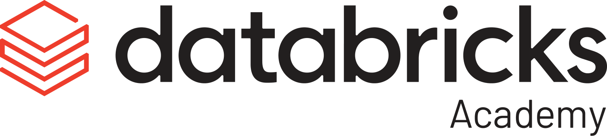

# Vorlesung – Jobs erstellen und planen

## Überblick

In dieser Lektion lernen Sie, wie Sie Tasks in Lakeflow Jobs mit Parametern, dynamischen Werten, Benachrichtigungen und Retry-Richtlinien konfigurieren und wie Sie die Job-Ausführung mit Zeitplänen und ereignisgesteuerten Triggern automatisieren.

## Lernziele

Am Ende dieser Lektion können Sie:
1. Task Parameters, Task Values, Dynamic Value References, Benachrichtigungen und Retry-Richtlinien für Lakeflow Jobs **konfigurieren**
2. Verschiedene Planungsoptionen für Jobs **einrichten** und **verwalten**, darunter Scheduled-, File-Arrival-, Table-Update- und Continuous-Trigger
3. Die Job-Ausführung mithilfe von Triggern **automatisieren**, um zeitbasierte und ereignisgesteuerte Workflows zu unterstützen
4. Planungsoptionen in der Databricks-Lakeflow-Jobs-UI in einer praktischen Demonstration **erkunden** und **anwenden**

## A. Gängige Konfigurationsoptionen für Tasks

### A1.  Überblick – Hauptkategorien

Es gibt drei Hauptkategorien von Konfigurationsoptionen für Tasks.

### Parameter & Dynamic Value References

### Benachrichtigungen (Notification Alerts)

### Wiederholungen (Retries)

##### Zusätzliche Hinweise
Ich stelle Ihnen die drei Hauptkategorien von Konfigurationsoptionen für Tasks vor:

- **Parameter & Dynamic Value References** sind die Grundlage flexibler Workflows. Sie können auf Task- und auf Job-Ebene gesetzt werden. Damit lassen sich wiederverwendbare, anpassbare Tasks erstellen, die sich je nach Eingabewerten oder Laufzeitkontext unterschiedlich verhalten.
- Retries sind Ihre erste Verteidigungslinie gegen vorübergehende Fehler. Sie können das Wiederholungsverhalten sowohl auf Job- als auch auf Task-Ebene konfigurieren und so je nach Kritikalität und erwarteten Fehlermustern der verschiedenen Teile Ihres Workflows unterschiedliche Retry-Strategien verwenden.
- Notification Alerts halten Ihr Team auf dem Laufenden und ermöglichen eine schnelle Reaktion auf Probleme. Wie Retries können sie sowohl auf Job- als auch auf Task-Ebene konfiguriert werden, sodass Sie genau steuern können, wer über welche Ereignisse benachrichtigt wird.

### A2. Parameter im Überblick – Typen

### Task Parameters


Ein auf Task-Ebene definiertes Schlüssel-Wert-Paar.

- Task Parameters sind Schlüssel-Wert-Paare, mit denen Sie Werte an Tasks übergeben können.
- Sie unterstützen fortgeschrittene Orchestrierung wie:  bedingte Ausführung
- Schleifen
- Weitergabe von Kontext zwischen Tasks


### Job Parameters


Ein auf Job-Ebene definiertes Schlüssel-Wert-Paar, das an alle Tasks weitergegeben wird.
Job Parameters sind auf Job-Ebene definierte Schlüssel-Wert-Paare, die Standardwerte für den gesamten Workflow bereitstellen.

- Werden automatisch auf alle Tasks im Job angewendet.
- Überschreiben Task Parameters mit demselben Schlüsselnamen.
- Können beim Auslösen von Job-Runs zur Laufzeit überschrieben werden.


##### Zusätzliche Hinweise
Das Verständnis der Parameter-Hierarchie ist für ein effektives Job-Design entscheidend:

- Task Parameters sind Schlüssel-Wert-Paare oder JSON-Arrays, die auf der Ebene des einzelnen Tasks definiert werden. Sie sind spezifisch für jeden Task und ermöglichen eine feingranulare Steuerung des Task-Verhaltens.
- Job Parameters werden auf Job-Ebene definiert und automatisch an alle Tasks innerhalb dieses Jobs weitergegeben. So entsteht ein leistungsfähiges Vererbungsmodell, bei dem Sie gemeinsame Standardwerte festlegen und dennoch taskspezifische Überschreibungen zulassen können.

Die Vorrangregel ist wichtig: Job Parameters überschreiben immer Task Parameters, wenn derselbe Schlüssel existiert. Dieses Designmuster ermöglicht es, sinnvolle Standardwerte auf Job-Ebene festzulegen und gleichzeitig die Flexibilität zu behalten, einzelne Tasks bei Bedarf anzupassen.

Task Parameters sind weit mehr als einfache Konfigurationswerte – sie sind die Bausteine intelligenter Workflows. Diese Schlüssel-Wert-Paare ermöglichen anspruchsvolle Orchestrierungsmuster:

- Bedingte Ausführung: Verwenden Sie Parameter, um zu steuern, welche Zweige Ihres Workflows basierend auf Datenbedingungen, Umgebungseinstellungen oder Geschäftsregeln ausgeführt werden.
- Schleifen: Parameter können Iterationszahlen steuern, Arrays für For-each-Schleifen definieren und komplexe Verarbeitungsszenarien verwalten.
- Weitergabe von Kontext: Teilen Sie Informationen zwischen Tasks, indem Sie Parameter setzen, die nachgelagerte Tasks lesen können – so entsteht ein Datenfluss neben Ihrem Kontrollfluss.

Die eigentliche Stärke entsteht durch die Kombination von Parametern mit Dynamic Value References, wodurch sich Ihre Workflows intelligent an sich ändernde Bedingungen und Dateneigenschaften anpassen.

Job Parameters bilden die Grundlage für konsistente, wartbare Workflows. Es sind Schlüssel-Wert-Paare, die Standardwerte für Ihren gesamten Workflow bereitstellen und so Konsistenz über alle Tasks hinweg sicherstellen.

Das macht sie so leistungsfähig:

- Automatische Anwendung: Jeder Task im Job erhält diese Parameter automatisch, sodass gemeinsame Einstellungen nicht manuell für mehrere Tasks konfiguriert werden müssen.
- Überschreibungsmöglichkeit: Tasks können weiterhin eigene Parameter mit denselben Schlüsselnamen definieren, aber Job Parameters haben Vorrang und ermöglichen Ihnen so eine zentrale Steuerung.
- Flexibilität zur Laufzeit: Sie können Job Parameters beim Auslösen von Job-Runs überschreiben, sodass sich dieselbe Job-Definition in unterschiedlichen Szenarien unterschiedlich verhalten kann – etwa für verschiedene Umgebungen, Datumsbereiche oder Verarbeitungsmodi.

### A3. Parameter setzen und abrufen (UI)

- Rufen Sie in Notebook-Tasks sowohl Task- als auch Job-Parameter mit **dbutils.widgets.get** ab.
- Die Abrufmethoden unterscheiden sich je nach Task-Typ, z. B. Notebook, SQL oder Python Wheel.


### Task Values dynamisch per Code setzen

```
dbutils.jobs.taskValues.set(
key = "catalog_name",
value = "dbacademy"
)
```

### Auf einen Parameter aus einem anderen Task zugreifen

```
dbutils.jobs.taskValues.get(
taskKey = "task-name",
key = "catalog_name"
)
```

### {{ }}-Notation

Diese Referenzen verwenden die `{{ }}`-Notation und ermöglichen es Workflows, sich an unterschiedliche Ausführungen anzupassen.

### Häufige Beispiele

| Referenz | Verwendung |
| --- | --- |
| `{{job.start_time.day}}` | Zugriff auf den Tag |
| `{{task.name}}` | Zugriff auf den Task-Namen |


##### Zusätzliche Hinweise
Dynamic Value References mit der `{{ }}`-Notation eröffnen leistungsfähige Laufzeitfunktionen, die Workflows wirklich anpassungsfähig machen:

Referenzen auf den Job-Kontext:

- `{{job.start_time.day}}` – Zugriff auf den Ausführungszeitpunkt für datumsbasierte Verarbeitung
- `{{job.run_id}}` – Eindeutige Kennung für Nachverfolgung und Logging
- `{{job.parameters.environment}}` – Dynamischer Zugriff auf Parameter auf Job-Ebene

Referenzen auf den Task-Kontext:

- `{{task.name}}` – Nützlich für Logging und dynamische Pfadgenerierung
- `{{task.retry_count}}` – Wiederholungsversuche für das Debugging nachverfolgen

Kommunikation zwischen Tasks:

- `{{tasks.data-validation.values.record_count}}` – Zugriff auf berechnete Ergebnisse vorgelagerter Tasks
- `{{tasks.file-processor.values.output_path}}` – Von anderen Tasks generierte dynamische Pfade verwenden

Fortgeschrittene Muster: 

- Diese Referenzen ermöglichen Workflows, die sich an unterschiedliche Ausführungsumgebungen anpassen, variierende Datenmengen verarbeiten und auf Basis vorgelagerter Ergebnisse intelligente Entscheidungen treffen.

### A6. Benachrichtigungen (Notification Alerts)

Benachrichtigungen auf Job-Ebene

- Eine Benachrichtigung wird nach **erfolgreichem Abschluss des Jobs** gesendet
- Diese Einstellung kann im Abschnitt Job Details (rechter Bereich) angepasst werden.

Benachrichtigungen auf Task-Ebene

- Eine Benachrichtigung wird gesendet, wenn **der Task erfolgreich abgeschlossen wurde**
- Diese Benachrichtigungseinstellung kann auf Task-Ebene angepasst werden.

##### Zusätzliche Hinweise
Benachrichtigungen sind ein zentraler Bestandteil operativer Exzellenz, und das Verständnis der Konfigurationsebenen hilft Ihnen, effektive Alerting-Strategien zu entwickeln:

- Benachrichtigungen auf Job-Ebene: Konfigurieren Sie diese im rechten Bereich des Abschnitts Job Details. Job-Benachrichtigungen werden gesendet, nachdem der gesamte Job erfolgreich abgeschlossen wurde. Das ist ideal für Stakeholder, die wissen müssen, wann vollständige Workflows fertig sind – etwa Fachanwender, die auf tägliche Reports warten, oder nachgelagerte Systeme, die von den Ausgaben Ihres Jobs abhängen.
- Benachrichtigungen auf Task-Ebene: Jeder Task kann eine eigene Benachrichtigungskonfiguration haben, was granulare Alerting-Strategien ermöglicht. Das ist wichtig, wenn verschiedene Tasks unterschiedliche Stakeholder haben oder bestimmte Tasks kritischer sind als andere. Beispielsweise möchten Sie bei fehlgeschlagener Datenvalidierung sofort benachrichtigt werden, bei routinemäßigen Aufräum-Tasks aber nur zusammenfassende Benachrichtigungen erhalten.
- Strategische Überlegungen: Gestalten Sie Ihre Benachrichtigungsstrategie nach operativen Anforderungen, nicht nach technischer Bequemlichkeit. Überlegen Sie, wer was wissen muss, wann er es wissen muss und welche Maßnahmen er aufgrund der Benachrichtigung ergreifen kann.

### A7. Benachrichtigungen – Effektive Benachrichtigungsstrategien entwerfen

- Mehrere Ziele: Die Unterstützung für E-Mail, Microsoft Teams, PagerDuty, Slack und Webhooks bedeutet, dass Sie Ihre vorhandenen operativen Tools und Kommunikationswege integrieren können. Verschiedene Teams bevorzugen möglicherweise unterschiedliche Kanäle – Entwickler möchten vielleicht Slack-Benachrichtigungen, während Operations-Teams die PagerDuty-Integration bevorzugen.
- Anpassung pro Task: Jeder Task in einem Job kann eine völlig andere Benachrichtigungskonfiguration haben. Ihre Ingestion-Tasks könnten Alerts an das Data-Engineering-Team senden, während Ihre Reporting-Tasks Fach-Stakeholder benachrichtigen.
- Erweiterte Auslösebedingungen: Über einfachen Erfolg/Fehlschlag hinaus können Sie Benachrichtigungen konfigurieren für:
- Verspätete Jobs: Warnungen bei Überschreiten eines Dauer-Schwellenwerts und Timeout-Alerts helfen, Performance-Einbußen frühzeitig zu erkennen
- Streaming-Backlog: Entscheidend für Streaming-Workloads, bei denen ein Rückstand zu größeren Problemen eskalieren kann
- Benutzerdefinierte Bedingungen: Webhook-Integrationen ermöglichen komplexe individuelle Logik für Benachrichtigungsentscheidungen
- Lebenszyklus-Benachrichtigungen: Jobs können Benachrichtigungen auslösen, wenn Tasks starten (nützlich bei lang laufenden Prozessen), erfolgreich abgeschlossen werden (Bestätigung des Abschlusses) oder fehlschlagen (sofortige Reaktion erforderlich).

### A8. Retry-Richtlinie

Eine gut durchdachte Retry-Richtlinie ist für robuste Workflows unerlässlich. Die Richtlinie bestimmt nicht nur, wie oft wiederholt wird, sondern auch unter welchen Bedingungen und mit welchem zeitlichen Muster.

Berücksichtigen Sie Faktoren wie:
- Fehlertyp: Vorübergehende Netzwerkprobleme rechtfertigen möglicherweise sofortige Wiederholungen, Datenqualitätsprobleme hingegen nicht
- Auswirkung auf Ressourcen: Zu aggressives Wiederholen ressourcenintensiver Tasks kann zu Ressourcenkonflikten im Cluster führen
- Nachgelagerte Abhängigkeiten: Fehlgeschlagene Tasks können andere Workflows beeinträchtigen, sodass das Timing der Wiederholungen entscheidend ist
- Geschäftliche SLAs: Manche Prozesse haben strenge Zeitvorgaben, die die Wiederholungsfenster begrenzen

## B. Job-Zeitpläne und Trigger – Überblick

### Trigger

Ein **Trigger** ist eine Regel, die einen Job-Run automatisch auf Basis einer **bestimmten Bedingung** oder eines **Zeitplans** startet.
**Gängige** Trigger-Typen sind:

- **Zeitbasierte Zeitpläne:** Klassische Planung im Cron-Stil für vorhersehbare, wiederkehrende Workloads
- **Kontinuierliche Ausführung:** Dauerhafte Verarbeitung für Streaming-Szenarien
- **Datei-Eingangsereignisse:** Ereignisgesteuerte Verarbeitung, die sofort auf neue Daten reagiert
- **Manuelle Trigger:** Ausführung bei Bedarf für Entwicklung, Tests und Ad-hoc-Analysen

**Vorteile der Automatisierung:** Trigger beseitigen manuelle Eingriffspunkte, die Verzögerungen, Fehler oder verpasste Ausführungen verursachen können. Sie ermöglichen einen 24/7-Betrieb und stellen eine konsistente Ausführung unabhängig von der Verfügbarkeit des Teams sicher.
**Überlegungen zur Zuverlässigkeit:** Jeder Trigger-Typ hat unterschiedliche Zuverlässigkeitsmerkmale und Fehlermodi. Wenn Sie diese verstehen, können Sie für jeden Anwendungsfall den richtigen Trigger wählen.
Wenn Sie beispielsweise einen Job täglich in festen Intervallen ausführen möchten, ist ein Scheduled Trigger die beste Wahl. Wenn Ihr Job beim Eintreffen einer Datei laufen soll, ist ein File Trigger am besten geeignet.

### B1. Trigger-Typen

1. Scheduled Trigger


- **Jobs automatisch** zu festgelegten Zeiten oder in Intervallen ausführen, z. B. stündlich oder täglich über die UI
- Sie können Jobs mit **Cron-Ausdrücken** für die automatisierte Ausführung planen
- Sie helfen, wiederkehrende Jobs zu **automatisieren**, sodass Jobs zuverlässig ohne manuelles Eingreifen laufen

2. File Arrival Trigger


- Löst Jobs **automatisch** aus, **wenn neue Dateien** an einem angegebenen Speicherort **erkannt werden**, mit Unterstützung für: 

 AWS S3 | Azure Storage | GCP GS und Databricks Volumes
- Ermöglicht **ereignisgesteuerte Verarbeitung**, um Daten-Workflows beim **Eintreffen von Dateien** zu starten
- Ideal zum **Automatisieren von Jobs** mit **unvorhersehbaren oder unregelmäßigen** Ingestion-Mustern

3. Continuous Trigger


- Führt Jobs **kontinuierlich** aus, indem ein neuer Run gestartet wird, sobald der vorherige beendet ist oder fehlschlägt
- **Eingebaute Retry-Logik** wird automatisch von Databricks verwaltet
- Ideal für **Streaming**-Workloads

4. Manuelle Trigger


- Der **manuelle Trigger (None)** lässt Jobs bei Bedarf ohne Zeitplan oder Ereignis laufen.
- Kann **über die UI gestartet werden** (Run now oder Run now with different settings), über API, CLI, SDK oder über DABS
- Am besten für **Ad-hoc-Runs, Debugging und einmalige Backfills**
- Kann später mit anderen Trigger-Typen kombiniert werden

5. Table Update Trigger


- Der Table Update Trigger startet automatisch einen Job, wenn **bestimmte Tabellen** aktualisiert werden.
- **Überwacht** eine oder mehrere Tabellen auf Änderungen (Insert, Update, Delete oder Merge).
- Hilft, zeitbasierte Planung (wie Cron-Jobs) durch Echtzeit-Orchestrierung zu **ersetzen**, sodass Jobs laufen, sobald **neue Daten eintreffen.**

##### Zusätzliche Hinweise
**Scheduled Trigger** sind das Rückgrat der meisten produktiven Daten-Workflows und bieten eine zuverlässige, zeitbasierte Ausführung:

- **UI-basierte Planung:** Die Databricks-Oberfläche bietet intuitive Planungsoptionen für gängige Muster – stündlich, täglich, wöchentlich, monatlich. Das ist ideal für Fachanwender und verringert den Lernaufwand für die Cron-Syntax.
- **Die Stärke von Cron-Ausdrücken:** Für komplexere zeitliche Anforderungen ermöglicht die vollständige Unterstützung von Cron-Ausdrücken anspruchsvolle Zeitpläne wie „alle 15 Minuten während der Geschäftszeiten“ oder „am ersten Montag jedes Monats“.
- **Typische Anwendungsmuster:**  Tägliches ETL: Die Daten des Vortags jeden Morgen um 6 Uhr verarbeiten. Wöchentliche Reports: Jeden Montagmorgen Management-Dashboards erstellen. Monatliche Aggregationen: Monatliche KPIs am ersten Tag jedes Monats berechnen. Stündliche Streaming-Checkpoints: Regelmäßige Wartung für Streaming-Jobs

**Zeitzonen:** Geben Sie immer die passende Zeitzone für Ihren geschäftlichen Kontext an, insbesondere bei Organisationen, die über mehrere Regionen hinweg tätig sind.

**File Arrival Trigger** stellen einen Paradigmenwechsel von zeitbasierter zu ereignisgesteuerter Verarbeitung dar und ermöglichen eine sofortige Reaktion auf die Verfügbarkeit von Daten:

- **Unterstützte Speicherplattformen:** AWS S3, Azure Storage, Google Cloud Storage und Databricks Volumes.
- **Ereignisgesteuerte Architektur:** Die Verarbeitung beginnt sofort, wenn Daten verfügbar werden, anstatt auf die nächste geplante Ausführung zu warten.

**Musterabgleich:** Konfigurieren Sie einen Dateimusterabgleich, um nur relevante Dateien zu verarbeiten und temporäre oder unvollständige Uploads zu ignorieren.

**Continuous Trigger** sind speziell für Workloads konzipiert, die eine ständige Verarbeitung aufrechterhalten müssen:

- **Automatische Neustartlogik:** Eine eingebaute, automatisch von Databricks verwaltete Retry-Logik stellt sicher, dass Streaming-Jobs auch bei vorübergehenden Fehlern kontinuierlich weiterlaufen.
- **Ressourcenverwaltung:** Continuous Jobs werden automatisch verwaltet, um Ressourcenlecks zu verhindern und eine optimale Cluster-Auslastung über längere Zeiträume sicherzustellen.

**Monitoring:** Continuous Jobs erfordern andere Monitoring-Ansätze, da sie darauf ausgelegt sind, unbegrenzt zu laufen, statt einzelne Aufgaben abzuschließen.

**Manuelle Trigger** bieten die nötige Flexibilität für Entwicklung, Tests und Ad-hoc-Verarbeitungsszenarien:

**Entwicklungs-Workflow:** Manuelle Trigger sind während der Entwicklung unverzichtbar, um Job-Logik zu testen, Probleme zu debuggen und Änderungen zu validieren, bevor automatisierte Trigger eingerichtet werden.
**Operative Anwendungsfälle:** 

**Table Update Trigger** – ein neuer Trigger-Typ in Databricks Lakeflow Jobs.

### B2. Konfiguration des Table Update Triggers

Klicken Sie unten auf die Schrittnummer, um zu sehen, wie der Table Update Trigger konfiguriert wird.

Schritt 1
### Trigger-Typ auswählen

- Wählen Sie **Table update** als Trigger-Typ.

Schritt 2
### Quelltabellen hinzufügen

- Sie können bis zu 10 Tabellen pro Trigger auswählen.
- Funktioniert mit von Unity Catalog verwalteten Delta- und Iceberg-Tabellen, externen Delta-Tabellen, Materialized Views und Streaming Tables.

Schritt 3
### Auslösebedingung definieren

- Any table updated – löst aus, sobald sich die erste überwachte Tabelle ändert.
- All tables updated – löst erst aus, nachdem alle ausgewählten Tabellen aktualisiert wurden.

Schritt 4
### Erweiterte Funktionen (optional)

- Min. time between triggers – Verhindert übermäßiges Auslösen, indem ein Mindestabstand zwischen aufeinanderfolgenden Job-Runs erzwungen wird
- Wait after last change – Verzögert die Job-Ausführung, bis alle Datenaktualisierungen in der Quelltabelle angekommen sind


##### Zusätzliche Hinweise
Sehen wir uns an, wie es funktioniert.

1. Zuerst wählen Sie **Table Update** als Trigger-Typ.
2. Dann fügen Sie Ihre Quelltabellen hinzu. Sie können bis zu zehn Tabellen in einen einzelnen Trigger aufnehmen; unterstützt werden von Unity Catalog verwaltete Delta- oder Iceberg-Tabellen, Materialized Views und Streaming Tables.
3. Anschließend legen Sie fest, wann der Trigger auslösen soll: 

  Er kann laufen, wenn sich **eine beliebige** der aufgeführten Tabellen ändert, oder warten, bis **alle** aktualisiert wurden
4. Schließlich gibt es erweiterte Optionen für mehr Kontrolle.
5. **Minimum time between triggers** fügt einen Puffer zwischen Runs ein, um übermäßiges Auslösen bei schnell aufeinanderfolgenden Tabellenaktualisierungen zu verhindern.

 Beispiel: Legen Sie für eine häufig aktualisierte Tabelle einen Abstand zwischen aufeinanderfolgenden Runs fest, um mehrere Job-Ausführungen kurz hintereinander zu vermeiden.
6. **Wait after last change** verzögert den Job, bis seit der letzten Aktualisierung ein festgelegter Zeitraum vergangen ist, sodass alle Daten angekommen sind.

 Beispiel: Wenn Daten in mehreren Batches eintreffen, definieren Sie eine Wartezeit, damit der Job erst startet, nachdem der gesamte Batch geliefert wurde.

Zusammen machen diese Einstellungen die Orchestrierung intelligenter, reaktionsfähiger und ressourceneffizienter.
