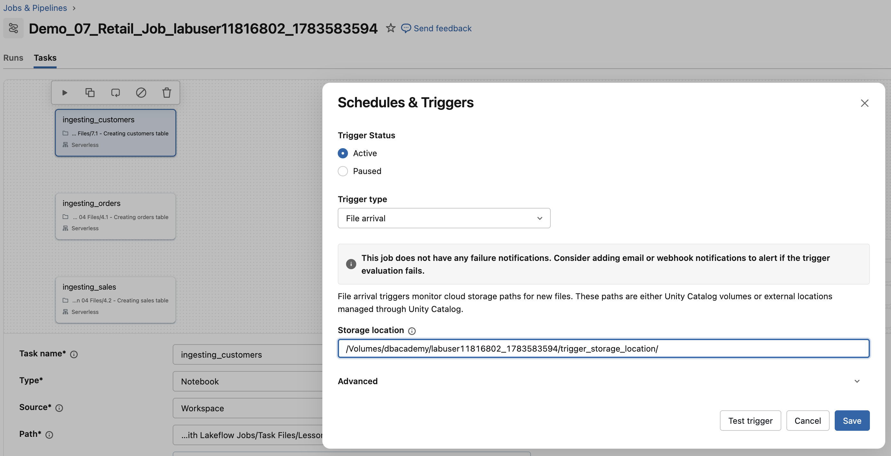

  Verschiedene Planungsoptionen, die für Ihre Jobs verfügbar sind. 

```python
## Erstellt den Starter-Job aus dem Ende von '04 Demo - Creating a Job Using Lakeflow Jobs UI'

job_tasks = [
    {
        'task_name': 'ingesting_orders',
        'file_path': '/Task Files/Lesson 04 Files/4.1 - Creating orders table',
        'depends_on': None
    },
    {
        'task_name': 'ingesting_sales',
        'file_path': '/Task Files/Lesson 04 Files/4.2 - Creating sales table',
        'depends_on': None
    }
]
 
myjob = DAJobConfig(job_name=f"Demo_07_Retail_Job_{DA.schema_name}",
                        job_tasks=job_tasks,
                        job_parameters=[])
```

### D2. Ihre Job-Details bestätigen
Führen Sie die folgenden Schritte aus, um zu bestätigen, dass der neue Starter-Job, der mit **Demo_07** beginnt, erfolgreich erstellt wurde und dem Job aus **04 Demo - Creating a Job Using Lakeflow Jobs UI** entspricht:

   a. Klicken Sie in der linken Navigationsleiste mit der rechten Maustaste auf **Jobs and Pipelines** und wählen Sie *Open Link in New Tab*.

   b. Bestätigen Sie, dass Sie den Job **Demo_07_Retail_Job_your-labuser-name** sehen. Klicken Sie auf den Job, um ihn zu öffnen.

   c. Wählen Sie in der oberen Navigationsleiste **Tasks**. Der Job sollte zwei Tasks namens **ingesting_orders** und **ingesting_sales** enthalten.

   d. Sehen Sie sich den Abschnitt **Job details** des Jobs an. Bestätigen Sie, dass der Modus **Performance optimized** aktiviert ist.

   e. Beachten Sie, dass dies derselbe Job ist, der in **04 Demo - Creating a Job Using Lakeflow Jobs UI** erstellt wurde.

   f. Lassen Sie die Job-Seite geöffnet und kehren Sie zu den folgenden Anweisungen zurück.

### D3. Dem Starter-Job einen neuen Task hinzufügen

Bisher haben wir in unserem Job zwei Tabellen ingestiert. 

Als Nächstes fügen wir über einen Notebook-Task eine neue Tabelle hinzu

1. Sehen Sie sich das Notebook an, das Sie Ihrem Job hinzufügen werden.

   Sie finden das Notebook unter **Task Files** > **Lesson 07 Files** > **7.1 - Creating customers table**. 

**HINWEIS:** Direkter Link zum Notebook: [Task Files/Lesson 07 Files/7.1 - Creating customers table]($./Task Files/Lesson 07 Files/7.1 - Creating customers table)

2. Führen Sie die folgenden Schritte aus, um das Notebook **7.1 - Creating customers table** als Task zu Ihrem Job hinzuzufügen.

   a. Wenn Sie sich nicht in Ihrem Job **Demo_07_Retail_Job_your-labuser-name** befinden, klicken Sie in der Seitenleiste mit der rechten Maustaste auf die Schaltfläche **Jobs and Pipelines** und wählen Sie *Open Link in New Tab*.

   b. Suchen Sie den Job **Demo_07_Retail_Job_your-labuser-name** und wechseln Sie zum Tab **Tasks**. 

   c. Klicken Sie auf **Add task** und wählen Sie dann **Notebook**.

   d. Konfigurieren Sie den Task wie unten angegeben und klicken Sie auf **Create task**, um den Task zu speichern:

| Einstellung | Anweisungen |
|-----------|--------------|
| **Task name** | Geben Sie **ingesting_customers** ein |
| **Type**      | Stellen Sie sicher, dass **Notebook** ausgewählt ist |
| **Source**    | Stellen Sie sicher, dass **Workspace** ausgewählt ist |
| **Path**      | Geben Sie mit dem Navigator den Pfad zu [Task Files/Lesson 07 Files/7.1 - Creating customers table]($./Task Files/Lesson 07 Files/7.1 - Creating customers table) an|
| **Compute**   | Wählen Sie im Dropdown-Menü einen **Serverless**-Cluster. (Wir verwenden in diesem Kurs Serverless-Cluster für Jobs. Außerhalb dieses Kurses können Sie bei Bedarf einen anderen Cluster angeben.) |
| **Depends On**| Keine |


## E. Planungsoptionen erkunden

Führen Sie die folgenden Schritte aus, um Planungsoptionen und Trigger in Lakeflow Jobs zu erkunden.

1. Kehren Sie zu Ihrem Job zurück.

2. Stellen Sie sicher, dass Sie sich im Tab **Tasks** Ihres Jobs befinden.

3. Suchen Sie auf der rechten Seite der Jobs-UI den Abschnitt **Job Details**.  
   - **HINWEIS:** Wenn der Seitenbereich eingeklappt ist, klicken Sie auf das nach links zeigende Pfeilsymbol, um ihn aufzuklappen.

4. Klicken Sie im Abschnitt **Schedules & Triggers** auf die Schaltfläche **Add trigger**, um die Optionen zu erkunden. Es gibt drei Optionen (zusätzlich zu manuell):

   - **Scheduled** — Sie sehen zwei Zeitplantypen: **Simple** und **Advanced** 
- Simple: Bietet Optionen zum Planen periodischer Job-Runs auf täglicher, stündlicher oder wöchentlicher Basis.
- Advanced: Mit dieser Option können Sie Jobs mit CRON-Syntax für ein präzises Timing planen.

   - **Table Update** – Auf Plattformen wie Azure Databricks kann ein Trigger eingerichtet werden, der automatisch ausgeführt wird, sobald eine oder mehrere angegebene Tabellen aktualisiert werden.

   - **Continuous** — läuft wiederholt mit einem kurzen Intervall zwischen den Runs.

   - **File arrival** — überwacht einen externen Speicherort oder ein Volume auf neue Dateien. Beachten Sie die **Advanced**-Einstellungen, in denen Sie die Zeit zwischen den Prüfungen und die Verzögerung nach dem Eintreffen einer neuen Datei bis zum Start eines Runs anpassen können.

5. Lassen Sie den Bereich **Schedules & Triggers** geöffnet und kehren Sie zu den folgenden Anweisungen zurück.

## F. Den File Arrival Trigger für den Job konfigurieren

In diesem Schritt richten wir einen File Arrival Trigger ein, der ein festgelegtes Volume auf neue Datendateien überwacht. Ziel ist es, den Job automatisch zu starten, sobald am angegebenen Speicherort eine neue Datei erkannt wird, und so eine nahtlose und zeitnahe Datenverarbeitung zu ermöglichen.

**HINWEIS:**  Databricks Volumes sind Unity-Catalog-Objekte, die ein logisches Speichervolume an einem Cloud-Object-Storage-Speicherort darstellen. Volumes bieten Funktionen zum Abrufen, Speichern, Verwalten (Governance) und Organisieren von Dateien. Sie können Volumes verwenden, um Dateien in jedem Format zu speichern und darauf zuzugreifen – strukturierte, semistrukturierte und unstrukturierte Daten.

1. Führen Sie die folgende Zelle aus, um ein Volume namens **trigger_storage_location** zu erstellen. Dieses Volume dient als Speicherort, der auf neue Dateien überwacht wird.  

   Es wird im Katalog **dbacademy** in Ihrem eindeutigen Schema **labuser** erstellt.

```sql
%sql
CREATE VOLUME IF NOT EXISTS trigger_storage_location
```

2. Führen Sie die folgenden Schritte aus, um Ihr neues Volume **trigger_storage_location** in Ihrem Schema **dbacademy.labuser** anzuzeigen:

   a. Klicken Sie in der linken Navigationsleiste auf das Symbol **Catalog** .

   b. Suchen Sie den Katalog **dbacademy** und klappen Sie ihn auf.

   c. Klappen Sie Ihr Schema **labuser** auf.

   d. Klappen Sie **Volumes** auf und bestätigen Sie, dass das Volume **trigger_storage_location** angezeigt wird.

   e. Klappen Sie das Volume **trigger_storage_location** auf und prüfen Sie, dass es **keine** Dateien enthält.

3. Sie können auch die Anweisung `SHOW VOLUMES` verwenden, um die verfügbaren Volumes in Ihrem Schema (Ihrer Datenbank) anzuzeigen.

```sql
%sql
SHOW VOLUMES;
```

4. Führen Sie die folgende Zelle aus, um den Pfad zu diesem Volume mithilfe des für diesen Kurs erstellten benutzerdefinierten Objekts `DA` zu erhalten.

**HINWEIS:** Sie können auch Ihr Volume im Katalog auswählen, auf die drei Punkte klicken und dann *Copy volume path* wählen, um den Volume-Pfad zu erhalten.

```python
your_volume_path = (f"/Volumes/{DA.catalog_name}/{DA.schema_name}/trigger_storage_location/")
print(your_volume_path)
```

5. Führen Sie die folgenden Schritte aus, um den **File Arrival**-Trigger für Ihren Job zu konfigurieren:

   a. Wechseln Sie zurück zum Browser-Tab mit Ihrem Job.

   b. **Klicken Sie** in Ihrem Job im Bereich Job details **auf Add Trigger** und wählen Sie unter Trigger type den Trigger-Typ File Arrival.

   c. Fügen Sie den obigen Pfad in das Feld **Storage location** ein

   d. Klicken Sie auf **Test Trigger**, um den korrekten Pfad zu überprüfen

- **HINWEIS:** Sie sollten **Success** sehen. Falls nicht, prüfen Sie, ob Sie die obige Zelle ausgeführt und die gesamte Zellenausgabe in **Storage location** kopiert haben

   e. Klappen Sie die **Advanced**-Optionen auf. Beachten Sie, dass Sie verschiedene Trigger-Optionen festlegen können.

   f. Klicken Sie auf **Save**

**HINWEIS:**  Es gibt ein Limit von 1000 Dateien, die mit einem File Arrival Trigger ausgelöst werden können. 

Referenz: https://docs.databricks.com/aws/en/jobs/file-arrival-triggers#limitations

## G. Task Parameters setzen
Das Task-Notebook für diese Demo muss den Namen des Katalogs und des Schemas kennen, mit denen wir arbeiten. Dies können wir mit **Task parameters** konfigurieren (Sie können auch **Job Parameters** verwenden; diese werden an alle Tasks weitergegeben). 

  Das bietet Flexibilität und ermöglicht die Wiederverwendung von Code.

1. Führen Sie die folgende Zelle aus, um Ihre **Katalog**- und **Schema**-Namen anzuzeigen. Diese benötigen wir beim Setzen der Parameter.

```python
print(f"catalog : {DA.catalog_name}")
print(f"schema : {DA.schema_name}")
```

2. Führen Sie die folgenden Schritte aus, um **die Task Parameters zu setzen**:

   a. Kehren Sie zu Ihrem Task **ingesting_customers** zurück. Klicken Sie im Bereich **Task details** unter **Parameters** auf **Add**.

   b. Setzen Sie die folgenden Schlüssel-Wert-Paare:
   - **catalog** (Schlüssel) =  **dbacademy** (Wert) 
   - **schema** (Schlüssel) = Ihr **labuser**-Schemaname aus der obigen Zellenausgabe (Wert) 

   c. Klicken Sie auf **Save task**.

3.  Klicken Sie, um das Notebook [Task Files/Lesson 07 Files/7.1 - Creating customers table]($./Task Files/Lesson 07 Files/7.1 - Creating customers table) zu öffnen. Dieses Notebook wird im Task **ingesting_customers** verwendet. Beachten Sie im Notebook Folgendes:

- Die Variable `my_catalog` erhält ihren Wert aus dem Parameter `catalog`, den wir im Task gesetzt haben, und zwar mit:
- `my_catalog = dbutils.widgets.get('catalog')`

- Die Variable `my_schema` erhält ihren Wert aus dem Parameter `schema`, den wir im Task gesetzt haben, und zwar mit: 
- `my_schema = dbutils.widgets.get('schema')`

- Die Variable `my_volume_path` verwendet die gesetzten Parameter, um auf Ihr Volume **trigger_storage_location** zu verweisen:
- `f"/Volumes/{my_catalog}/{my_schema}/trigger_storage_location/"`

4.  Schließen Sie das Notebook **Creating customer table**



   Ihr File Arrival Trigger und der Task ingesting_customers sollten wie im obigen Screenshot aussehen.

## H. Eine Datei in das Volume legen
Führen Sie die folgende Zelle aus, um eine neue Datei in Ihrem Volume **trigger_storage_location** abzulegen. 

Beim File Arrival Trigger werden nur neue Dateien ingestiert und verarbeitet. Geänderte Dateien lösen den Run nicht erneut aus. Um erneut auszulösen, müssen Sie den Dateinamen manuell ändern.

**HINWEIS:** Dies ist eine für den Kurs erstellte benutzerdefinierte Funktion, die Daten zu Ihrem Volume hinzufügt, um das Laden von Daten in Cloud-Speicher zu simulieren.

```python
DA.copy_data()
```

## I. Den Run überwachen

Sobald der Trigger konfiguriert ist, überwacht Databricks den Speicherort automatisch auf neue Dateien (standardmäßig jede Minute). Gehen Sie wie folgt vor, um Ihre Job-Runs zu überwachen:

1. **Den Tab Runs öffnen**
   - Klicken Sie in der oberen linken Ecke auf den Tab **Runs**.
   - Suchen Sie den **Trigger status**. Wenn Sie ihn nicht sehen, warten Sie eine Minute und überprüfen Sie bei Bedarf die Einrichtung Ihres **File arrival**-Triggers.

2. **Die Trigger-Auswertung prüfen**
   - Der Trigger wird als ausgewertet angezeigt. Werden keine neuen Dateien gefunden, wird der Job nicht ausgeführt.

3. **Details zum Job-Run ansehen**
   - Nachdem der Job gelaufen ist (in der Regel innerhalb von 1–2 Minuten), klicken Sie auf die **Start time**, um die Run-Details anzuzeigen.

> **Tipp:**  
> Um einen Run manuell mit anderen Parametern auszulösen, gehen Sie zur Job-Konfigurationsseite, klicken Sie auf der Seite **Run output** auf **Edit task**, klicken Sie dann auf den Pfeil nach unten neben **Run now** und wählen Sie **Run now with different settings**.
