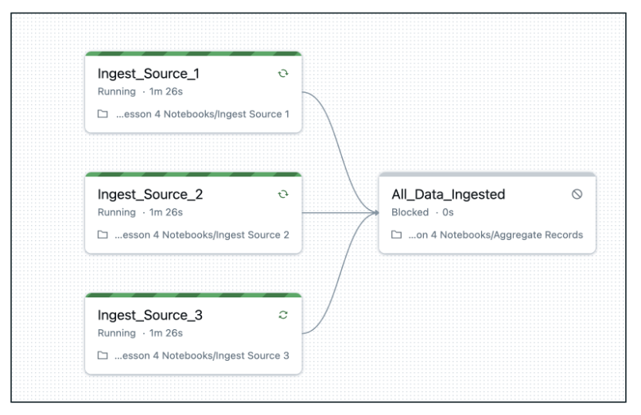
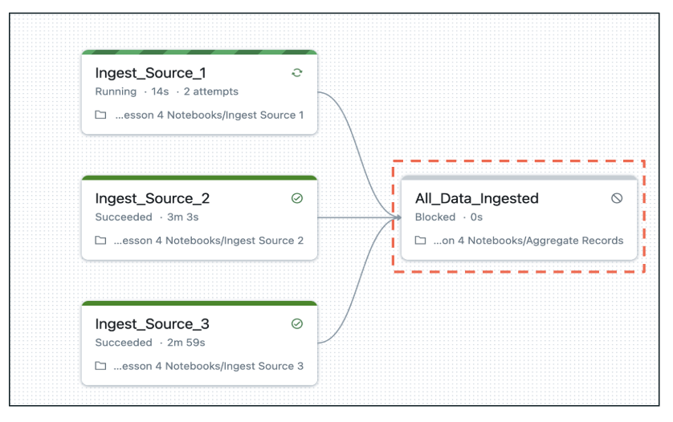
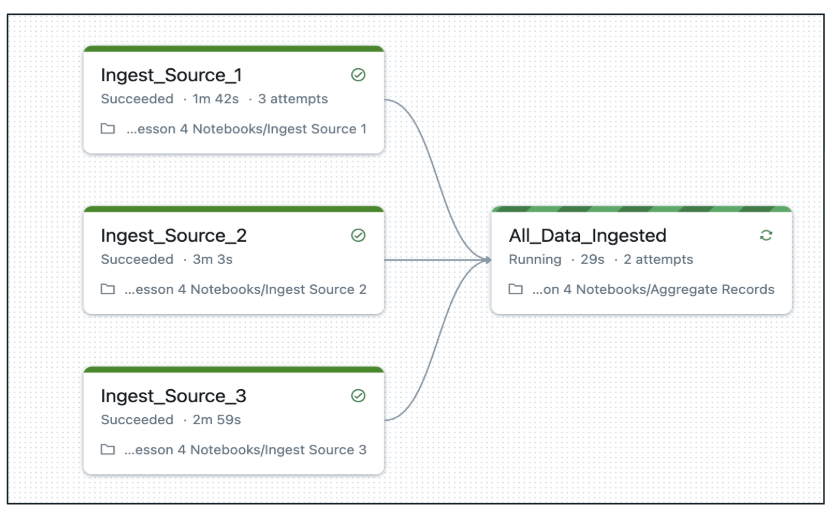
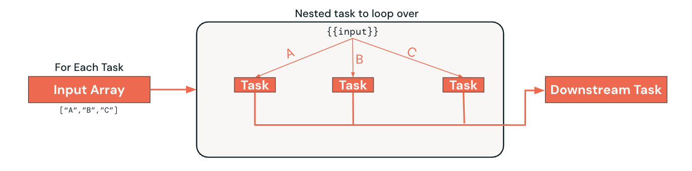
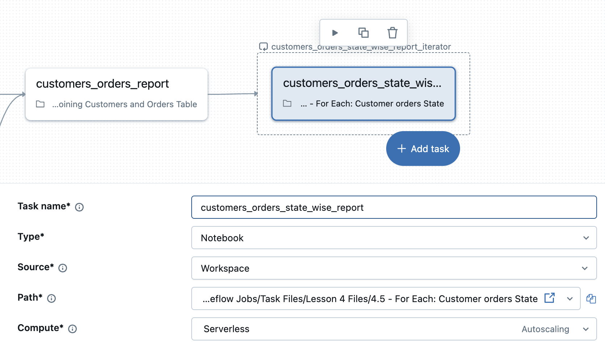

Lernen Sie intelligente Lakeflow-Jobs-Workflows kennen, die Entscheidungen treffen und ihr Verhalten an Laufzeitbedingungen anpassen können. Diese Workflows können sich verzweigen, Schleifen durchlaufen und auf Basis von Daten und Verarbeitungsergebnissen Entscheidungen treffen. 

## Lernziele

Am Ende dieser Lektion können Sie:
1. Run-if Conditional Task Dependencies **beschreiben** und erklären, wie sie die Task-Ausführung auf Basis der Ergebnisse vorgelagerter Tasks steuern
2. **Erklären**, wie If/Else Tasks Workflows boolesche Bedingungslogik hinzufügen
3. **Erklären**, wie For Each Tasks eine iterative Verarbeitung mithilfe von Eingabe-Arrays und verschachtelten Tasks ermöglichen
4. **Erkennen**, wie bedingte und iterative Task-Muster dynamische, robuste Workflows unterstützen

## A. Überblick – Fortgeschrittene Task-Typen

Wir betreten nun den Bereich intelligenter Workflows, die Entscheidungen treffen und ihr Verhalten an Laufzeitbedingungen anpassen können. Dies sind nicht einfach lineare Abfolgen von Tasks – es sind dynamische Workflows, die sich verzweigen, Schleifen durchlaufen und auf Basis von Daten und Verarbeitungsergebnissen intelligente Entscheidungen treffen können.
Diese Fähigkeit verwandelt Ihre Workflows von einfacher Automatisierung in intelligente Datenverarbeitungssysteme. Drei fortgeschrittene Task-Typen ermöglichen anspruchsvolle Workflow-Muster:

### Run-if Conditional Task Dependencies

### If/Else Tasks

### For Each Tasks

##### Zusätzliche Hinweise
Drei fortgeschrittene Task-Typen ermöglichen anspruchsvolle Workflow-Muster:
- Run-if Conditional Task Dependencies: Steuern die Task-Ausführung auf Basis der Ergebnisse vorgelagerter Tasks und ermöglichen Workflows, die mit Teilausfällen und komplexen Abhängigkeitsszenarien umgehen können.
- If/Else Tasks: Implementieren boolesche Bedingungslogik direkt in Ihrem Workflow und ermöglichen Verzweigungen auf Basis von Datenbedingungen, Verarbeitungsergebnissen oder Geschäftsregeln.
- For Each Tasks: Ermöglichen iterative Verarbeitungsmuster, bei denen dieselbe Logik auf mehrere Datenpartitionen oder Parameter angewendet wird, mit konfigurierbarer Parallelität zur Performance-Optimierung.

Diese Task-Typen lassen sich kombinieren, um anspruchsvolle Workflows zu erstellen, die komplexe Geschäftslogik abbilden und dabei übersichtlich und wartbar bleiben.

## B. Run if Conditional Task Dependencies

Run-if Conditional Dependencies ermöglichen eine feingranulare Steuerung der Task-Ausführung auf Basis der Ergebnisse vorgelagerter Tasks. Sie können bestimmte Bedingungen festlegen, die erfüllt sein müssen, damit ein Task ausgeführt wird.

### B1. Verfügbare Abhängigkeitsbedingungen

Task-Ausführung auf Basis der Ergebnisse vorgelagerter Tasks steuern

Unterstützt verschiedene Abhängigkeitsbedingungen wie:

- All succeeded
- At least one succeeded
- None failed
- Und mehr

**Beispiel – At Least One Succeeded**

In diesem Szenario läuft Task-4 auch dann, wenn Task-3 fehlschlägt.

Run if Conditional Task Dependencies
Task-1

Depends On: Task-1
Task-2
Task-3
Depends On: Task-1

Task-4
Depends On:

- Task-2
- Task-3

At least one succeeded

In diesem Szenario läuft Task-4 auch dann, wenn Task-3 fehlschlägt

##### Zusätzliche Hinweise
Run-if Conditional Dependencies ermöglichen eine feingranulare Steuerung der Task-Ausführung auf Basis der Ergebnisse vorgelagerter Tasks. Sie können bestimmte Bedingungen festlegen, die erfüllt sein müssen, damit ein Task ausgeführt wird.
**Verfügbare Abhängigkeitsbedingungen**

- **All succeeded:** Diese klassische Abhängigkeit erfordert, dass alle vorgelagerten Tasks erfolgreich abgeschlossen sind, bevor der nächste Task laufen kann.
- **At least one succeeded:** Diese Bedingung ist nützlich, wenn Sie redundante Datenquellen oder Verarbeitungspfade haben; der Workflow kann fortfahren, sobald auch nur einer der erforderlichen vorgelagerten Tasks erfolgreich ist.
- **None failed:** Damit kann ein Task auch dann ausgeführt werden, wenn einige vorgelagerte Tasks übersprungen wurden, solange keiner der vorgelagerten Tasks explizit fehlgeschlagen ist.
- **Benutzerdefinierte Kombinationen:** Diese Option ermöglicht die Umsetzung komplexer Geschäftslogik, die bestimmte Kombinationen von Task-Ergebnissen erfordert.

**Vorteile bedingter Abhängigkeiten**
Diese Abhängigkeiten erhöhen die Robustheit von Workflows und ermöglichen anspruchsvolle Geschäftslogik. Wenn beispielsweise Task-4 so eingestellt ist, dass er läuft, wenn „mindestens einer“ seiner Vorgänger (Task-2 oder Task-3) erfolgreich ist, kann er auch dann ausgeführt werden, wenn Task-3 fehlschlägt, während Task-2 erfolgreich abgeschlossen wird. Das verhindert Kaskadenfehler und ermöglicht es Workflows, die Verarbeitung fortzusetzen, auch wenn einige Komponenten ausfallen. Es hilft außerdem, reale Geschäftsprozesse abzubilden, bei denen es mehrere Wege zum Erfolg gibt und Teilausfälle nicht den gesamten Vorgang stoppen.
**So konfigurieren Sie es**
Sie können diese Abhängigkeitsbedingungen für einen Task in dessen Konfigurationseinstellungen im Abschnitt „run-if dependencies“ auswählen. Das sehen wir uns als Nächstes an.

### B2. Die visuelle Darstellung bedingter Abhängigkeiten verstehen

Die visuelle Darstellung bedingter Abhängigkeiten im Job-DAG vermittelt sofort ein Verständnis der Workflow-Logik.

### Visualisierung von Abhängigkeiten
Unterschiedliche Linienstile und Farben kennzeichnen unterschiedliche Abhängigkeitstypen, sodass komplexe Logik auf einen Blick verständlich wird.
### Vorteile bei der Fehlerbehebung
Wenn Fehler auftreten, zeigt die visuelle Darstellung sofort, welche Tasks betroffen waren und welche weiterlaufen konnten.
### Kommunikation im Team
Visuelle Workflows dienen als lebendige Dokumentation, die sowohl technische als auch fachliche Stakeholder verstehen können.

##### Zusätzliche Hinweise
Die visuelle Darstellung bedingter Abhängigkeiten im Job-DAG vermittelt sofort ein Verständnis der Workflow-Logik:

- **Visualisierung von Abhängigkeiten:** Unterschiedliche Linienstile und Farben kennzeichnen unterschiedliche Abhängigkeitstypen, sodass komplexe Logik auf einen Blick verständlich wird.
- **Vorteile bei der Fehlerbehebung:** Wenn Fehler auftreten, zeigt die visuelle Darstellung sofort, welche Tasks betroffen waren und welche weiterlaufen konnten, was die Ursachenanalyse beschleunigt.
- **Kommunikation im Team:** Visuelle Workflows dienen als lebendige Dokumentation, die sowohl technische als auch fachliche Stakeholder verstehen können, und verbessern so Zusammenarbeit und Change Management.

### B3. Diagramm des Ausführungsablaufs

Das Diagramm des Ausführungsablaufs veranschaulicht, wie bedingte Abhängigkeiten in der Praxis funktionieren.

1. Job-Initialisierung

Die ersten drei Tasks werden ausgeführt2. Warten, bis alle Tasks abgeschlossen sind

(All succeeded)3. Abhängiger Task gestartet

### Job-Initialisierung
Das System wertet alle Task-Abhängigkeiten aus und bestimmt die anfängliche Ausführungsmenge. 

Beachten Sie, dass alle Tasks gleichzeitig laufen.
### Auswertung der Bedingungen
Während Tasks abgeschlossen werden, prüft das System fortlaufend neu, welche nachgelagerten Tasks auf Basis ihrer Abhängigkeitsbedingungen ausgeführt werden können. 

Beachten Sie, dass 'Ingest_Source_2' und 'Ingest_Source_3' abgeschlossen sind und darauf warten, dass "Ingest_Source_1" fertig wird, bevor es mit dem Task 'All_Data_Ingested' weitergeht.
### Dynamische Ausführung
So entstehen wirklich dynamische Workflows, bei denen der Ausführungspfad nicht vorab festgelegt ist, sondern sich an die tatsächlichen Verarbeitungsergebnisse anpasst. 

Beachten Sie, dass der letzte Task gestartet ist, sobald alle drei Tasks abgeschlossen sind.

##### Zusätzliche Hinweise
Das Diagramm des Ausführungsablaufs veranschaulicht, wie bedingte Abhängigkeiten in der Praxis funktionieren:

- **Job-Initialisierung:** Das System wertet alle Task-Abhängigkeiten aus und bestimmt die anfängliche Ausführungsmenge. Beachten Sie, dass alle Tasks gleichzeitig laufen.
- **Auswertung der Bedingungen:** Während Tasks abgeschlossen werden (erfolgreich oder mit Fehlern), prüft das System fortlaufend neu, welche nachgelagerten Tasks auf Basis ihrer Abhängigkeitsbedingungen ausgeführt werden können. Beachten Sie, dass 'Ingest_Source_2' und 'Ingest_Source_3' abgeschlossen sind und darauf warten, dass "Ingest_Source_1" fertig wird, bevor es mit dem Task 'All_Data_Ingested' weitergeht.
- **Dynamische Ausführung:** So entstehen wirklich dynamische Workflows, bei denen der Ausführungspfad nicht vorab festgelegt ist, sondern sich an die tatsächlichen Verarbeitungsergebnisse anpasst. Beachten Sie, dass der letzte Task gestartet ist, sobald alle drei Tasks abgeschlossen sind.

## C. If-Else-Task

If/Else-Tasks ermöglichen die direkte Umsetzung von Geschäftslogik in Ihren Workflows und gehen über einfache Erfolgs-/Fehlerbedingungen hinaus hin zu datengetriebenen Entscheidungen.

##### Klicken Sie auf die hervorgehobenen Felder, um die Task-Logik anzuzeigen.

### Bedingte If/Else-Tasks

- Fügt Ihrem Workflow boolesche Bedingungslogik auf Basis von Task-Ergebnissen hinzu
- Ermöglicht Verzweigungen auf Basis bestimmter Bedingungen, etwa Datenqualitätsprüfungen und Datensatzanzahlen
- Verwendet boolesche Operatoren: **==**, **!=**, **>**, **>=**, **<**, **<=**

### Verhalten der Bedingung

Wenn keine Abhängigkeit fehlgeschlagen ist und mindestens ein Task ausgeführt wurde.
Die Bedingung stellt sicher, dass die bedingte Auswertung nur dann erfolgt, wenn aussagekräftige vorgelagerte Ergebnisse vorliegen.

##### Zusätzliche Hinweise
Bedingte If/Else-Tasks fügen Workflows anspruchsvolle boolesche Logik hinzu:

- **Auswertung der Bedingung:** Boolesche Operatoren (==, !=, >, >=, <, <=) werten Ausdrücke gegen Task-Ergebnisse, Parameterwerte oder berechnete Kennzahlen aus.
- **Beispiele für Geschäftslogik:** Datenqualitäts-Gates: Verzweigung basierend auf Datensatzanzahlen, Null-Anteilen oder Validierungsergebnissen
- Entscheidungen nach Verarbeitungsvolumen: Unterschiedliche Verarbeitungsstrategien für große vs. kleine Datensätze verwenden
- Umgebungsspezifische Logik: Je nach Umgebungsparametern unterschiedliche Tasks ausführen
- Umsetzung von Geschäftsregeln: Komplexe Geschäftsregeln direkt in der Workflow-Logik implementieren
**Ausführungsvoraussetzungen:** Die Bedingung „If none of dependency failed and at least one task executed“ stellt sicher, dass die bedingte Auswertung nur dann erfolgt, wenn aussagekräftige vorgelagerte Ergebnisse vorliegen.**True/False-Zweige:** Jeder Zweig kann mehrere Tasks enthalten und ermöglicht so komplexe Verarbeitungspfade auf Basis bedingter Ergebnisse.

## D. For-Each-Task

For-Each-Tasks ermöglichen leistungsfähige iterative Verarbeitungsmuster, die die Vorteile der visuellen Workflow-Verwaltung beibehalten und gleichzeitig wiederkehrende Operationen effizient abarbeiten.

For Each iteriert über ein Eingabe-Array und führt für jedes Element denselben verschachtelten Task aus, wobei das Element als **{{input}}** übergeben wird.
Iterationen können mit konfigurierbarer Parallelität gleichzeitig laufen, um die Ausführung zu beschleunigen.
Nachgelagerte Abhängigkeiten werden an den For-Each-Container geknüpft, nicht an den verschachtelten Task.

##### Zusätzliche Hinweise
For-Each-Tasks bieten ausgefeilte Iterationsmöglichkeiten:

- **Verarbeitung der Eingabe:** Der Task iteriert über ein Eingabe-Array und übergibt jedes Element als {{input}} an den verschachtelten Task. So entsteht eine saubere, parametrisierte Verarbeitung, bei der dieselbe Logik unterschiedliche Datenpartitionen verarbeitet.
- **Parallele Ausführung:** Konfigurierbare Parallelität ermöglicht es, mehrere Iterationen gleichzeitig auszuführen, was die Performance bei unabhängigen Verarbeitungsaufgaben erheblich verbessert.
- **Abhängigkeitsverwaltung:** Nachgelagerte Tasks hängen vom Abschluss des gesamten For-Each-Containers ab, nicht von einzelnen Iterationen. Das vereinfacht die Abhängigkeitsverwaltung und stellt sicher, dass alle Iterationen abgeschlossen sind, bevor die nachgelagerte Verarbeitung beginnt.

**Beispiele für Anwendungsfälle:**

- Geografische Verarbeitung: Daten für jedes Bundesland/jede Region parallel verarbeiten
- Verarbeitung nach Zeiträumen: Unterschiedliche Datumsbereiche mit derselben Logik verarbeiten
- Verarbeitung nach Kundensegmenten: Dieselbe Analyse auf unterschiedliche Kundensegmente anwenden
- Dateiverarbeitung: Mehrere Dateien mit identischer Logik verarbeiten

Das Container-Konzept ist entscheidend für das Verständnis des Verhaltens von For-Each-Tasks:

- **Container-Verwaltung:** Der For-Each-Task fungiert als eine einzelne logische Einheit in Ihrem Workflow, auch wenn er intern mehrere Iterationen ausführt.
- **Vereinfachte Abhängigkeiten:** Nachgelagerte Tasks müssen nur vom For-Each-Container abhängen, nicht von jeder einzelnen Iteration, wodurch Workflow-Diagramme übersichtlich und handhabbar bleiben.
- **Ressourcenverwaltung:** Der Container verwaltet die Ressourcenzuweisung über die Iterationen hinweg, optimiert die Cluster-Auslastung und verhindert Ressourcenkonflikte.

### D1. For-Each-Task

Die Implementierung von For-Each-Tasks erfordert das Verständnis zweier unterschiedlicher Komponenten:

1. For-Each-Task2. Verschachtelter Task

### Der For-Each-Task
Der übergeordnete Container-Task, der die Schleife verwaltet.
### Ein verschachtelter Task
Der eigentliche Task, der für jede Iteration ausgeführt wird.

##### Zusätzliche Hinweise
Die Implementierung von For-Each-Tasks erfordert das Verständnis zweier unterschiedlicher Komponenten:

- **Der For-Each-Container:** Dieser übergeordnete Task verwaltet die Iterationslogik, die Verarbeitung des Eingabe-Arrays, die Parallelitätseinstellungen und die Ressourcenzuweisung. Er legt fest, wie viele Iterationen parallel laufen und wie das Eingabe-Array verarbeitet wird.
- **Der verschachtelte Task:** Das ist die eigentliche Arbeit, die für jede Iteration ausgeführt wird. Es kann jeder Task-Typ sein – Notebook, SQL, Python-Skript usw. Der verschachtelte Task erhält jedes Array-Element als `{{input}}` und verarbeitet es gemäß Ihrer Geschäftslogik.
- **Flexible Konfiguration:** Diese Trennung ermöglicht es, das Iterationsverhalten unabhängig von der Verarbeitungslogik zu konfigurieren, wodurch For-Each-Tasks sowohl leistungsfähig als auch wartbar sind.

