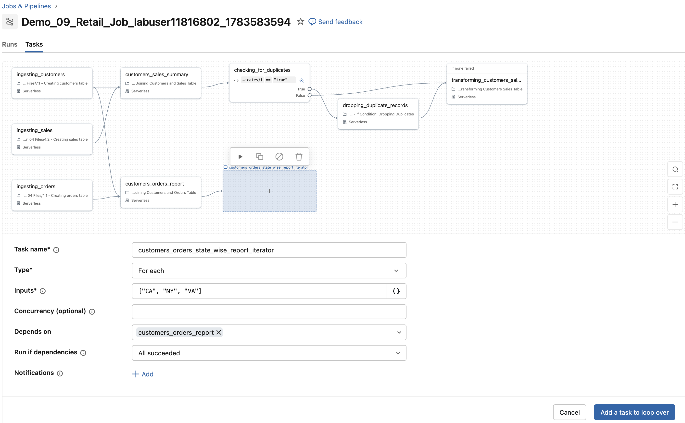
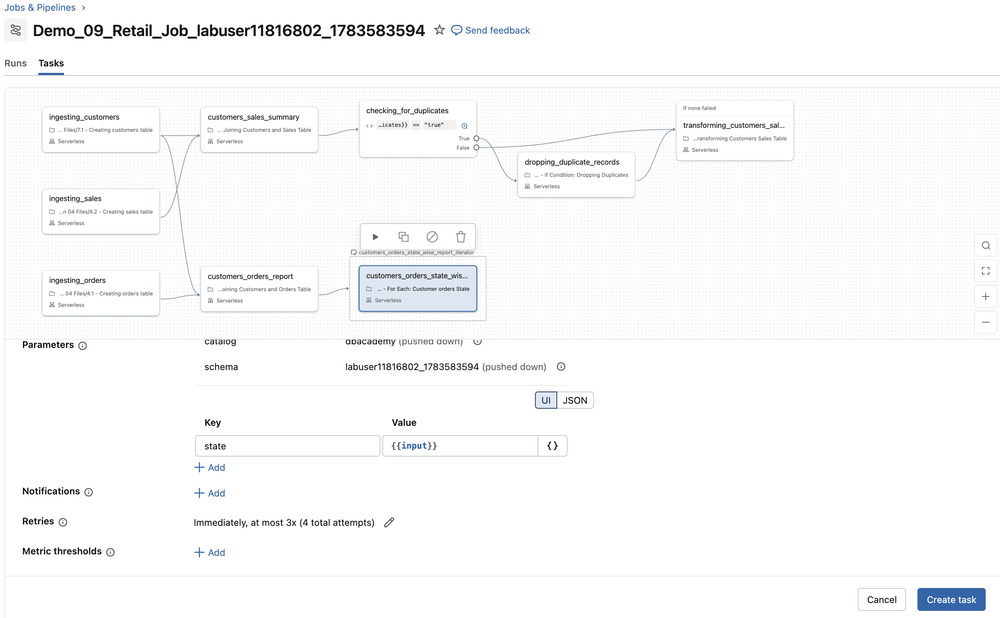

  Dynamische Lakeflow Jobs mit bedingter Logik (`if-else`) und iterativen Tasks (`for each`-Schleife).

```python
job_tasks = [
        {
            'task_name': 'ingesting_orders',
            'file_path': '/Task Files/Lesson 04 Files/4.1 - Creating orders table',
            'depends_on': None
        },
        {
            'task_name': 'ingesting_sales',
            'file_path': '/Task Files/Lesson 04 Files/4.2 - Creating sales table',
            'depends_on': None
        },
        {
            'task_name': 'ingesting_customers',
            'file_path': '/Task Files/Lesson 07 Files/7.1 - Creating customers table',
            'depends_on': None
        }
        ,{
            'task_name': 'customers_sales_summary',
            'file_path': '/Task Files/Lesson 09 Files/9.1 - Joining Customers and Sales Table',
            'depends_on': [
                        {'task_key':'ingesting_customers'},
                        {'task_key': 'ingesting_sales'}
                        ]
        }
        ,{
            'task_name' : 'customers_orders_report',
            'file_path': '/Task Files/Lesson 09 Files/9.2 - Joining Customers and Orders Table',
            'depends_on': None
        }
    ]

myjob = DAJobConfig(job_name=f"Demo_09_Retail_Job_{DA.schema_name}",
                    job_tasks=job_tasks,
                    job_parameters=[
                        {'name':'catalog', 'default':'dbacademy'},
                        {'name':'schema', 'default':f'{DA.schema_name}'}
                    ])
```

### D2. Abhängigkeiten für die Tasks festlegen

In diesem Schritt ändern wir den bestehenden Job, um Task-Abhängigkeiten zu definieren. Konkret konfigurieren wir den Haupt-Task so, dass er erst ausgeführt wird, nachdem alle vorhergehenden Tasks erfolgreich abgeschlossen wurden.

Führen Sie die folgenden Schritte aus, um den Job zu überprüfen und für den Task **customers_orders_report** die folgenden Abhängigkeiten festzulegen:
   - **ingesting_orders**
   - **ingesting_customers**

1. Navigieren Sie zu **Jobs and Pipelines** und öffnen Sie es in einem neuen Tab.

2. Wählen Sie Ihren neuen Job, der mit **Demo_09_Retail_Job_labuser** beginnt.

3. Klicken Sie in der oberen Navigationsleiste auf **Tasks**.

4. Überprüfen Sie Ihren Job. Sie sollten fünf Tasks sehen: 
   - **customers_orders_report**.
   - **ingesting_customers**, 
   - **ingesting_orders**, 
   - **ingesting_sales**, 
   - **customers_sales_summary**,

5. Wählen Sie den Task **customers_sales_summary**. 
   - Beachten Sie, dass er von zwei Tasks abhängt – **ingesting_customers** und **ingesting_sales** –, wobei die Abhängigkeit auf **All Succeeded** gesetzt ist.

6. Wählen Sie als Nächstes den Task **customers_orders_report** und legen Sie die folgenden Task-Optionen fest: 

   - Fügen Sie unter **Depends on** die Tasks **ingesting_orders** und **ingesting_customers** hinzu

   - Setzen Sie unter **Run if dependencies** die Abhängigkeit auf **All Succeeded**.

   - Wählen Sie **Save task**.

7. Klicken Sie auf **Run_now**, um den Job auszuführen.

#### Endgültige Abhängigkeiten


## E. Einen bedingten If/Else-Task hinzufügen

In diesem Abschnitt fügen Sie Ihrem Job einen bedingten Task hinzu, der die Tabelle **customers_sales_silver** (Task **customers_sales_summary**) auf doppelte Datensätze prüft. 

Je nach Ergebnis verzweigt der Workflow, um Duplikate angemessen zu behandeln.

### E1. Logik zur Duplikatprüfung

1. Rufen Sie sich die Logik in Erinnerung, mit der Duplikate in der Tabelle **customers_sales_silver** erkannt werden. (Der Task **customers_sales_summary** erstellt die Tabelle **customers_sales_silver**.)

2. In diesem Notebook prüfen wir, ob die Tabelle **customers_sales_silver** doppelte Datensätze enthält. Werden Duplikate gefunden, wird das Ergebnis dieser Prüfung (ein boolescher Wert) als `has_duplicates` in der Task-Ausgabe gespeichert.

**Code-Referenz:**

df = spark.sql("""
SELECT * FROM customers_sales_silver
""")

duplicate_exists = df.count() > df.dropDuplicates().count()

dbutils.jobs.taskValues.set(key="has_duplicates", value=duplicate_exists)

**Notebook zur Referenz:**  
[Task Files/Lesson 09 Files/9.1 - Joining Customers and Sales Table]($./Task Files/Lesson 09 Files/9.1 - Joining Customers and Sales Table)

### E2. Einen bedingten If/Else-Task erstellen

Erstellen Sie einen **If/else conditional**-Task, um festzulegen, was ausgeführt wird, je nachdem, ob doppelte Datensätze gefunden werden.

1. Wählen Sie in Ihrem Job **Demo_09_Retail_Job_labuser** die Option **Add task**.

2. Scrollen Sie im Dialogfeld nach unten zum Abschnitt **Advanced** und wählen Sie den Task-Typ **If/else condition**.

3. Benennen Sie den neuen Task **checking_for_duplicates**.

4. Setzen Sie den Wert **Depend on** auf den Task **customers_sales_summary**.

5. Verwenden Sie für das Feld **Condition** den Parameterwert, der im Task `customers_sales_summary` erstellt wurde:

**Dynamic Value References:**
   Diese Syntax nutzt Dynamic Value References, um auf Ausgabevariablen früherer Tasks in Ihrem Job zuzugreifen. Wenn ein Task läuft (wie `customers_sales_summary`), stehen seine Ergebnisse – einschließlich der vom Task registrierten oder ausgegebenen Variablen (wie `has_duplicates`) – für nachgelagerte Tasks zur Verfügung.

**Indem Sie** `tasks.customers_sales_summary.values.has_duplicates` referenzieren, übergeben Sie den Wert (ob Duplikate existieren) dynamisch an die If/Else-Bedingung. Das ermöglicht bedingte Verzweigungen auf Basis von Laufzeitdaten statt statischer Konfiguration und macht Ihren Workflow anpassungsfähig und reaktionsfähig gegenüber den tatsächlichen Ergebnissen.

**Das Feld Condition ausfüllen:** 
- Um den Parameterwert manuell hinzuzufügen, wählen Sie `{}` im Feld **Condition**. 
- Suchen Sie `tasks.customers_sales_summary.values` und klicken Sie darauf; es wird automatisch das Suffix `my_value` angehängt.
- Ersetzen Sie `my_value` durch den im Notebook erstellten Task-Parameter: `has_duplicates`.

6. Legen Sie dann die Bedingung fest, die prüft, ob dieser Wert `== true` ist

7. Wählen Sie **Save task**, um den bedingten Task zu erstellen.

##### IF/ELSE-CONDITION-TASK


### E3. Den Task für die True-Bedingung (Duplikate vorhanden) festlegen

Führen Sie die folgenden Schritte aus, um einen Task hinzuzufügen, der **nur ausgeführt wird, wenn Duplikate gefunden werden** (`tasks.customers_sales_summary.values.has_duplicates == true`).

1. Wählen Sie den Task **checking_for_duplicates**.

2. Klicken Sie auf **Add task** und wählen Sie **Notebook**.

3. Benennen Sie den neuen Task **dropping_duplicate_records**.

4. Verwenden Sie das Notebook [9.3 - If Condition: Dropping Duplicates]($./Task Files/Lesson 09 Files/9.3 - If Condition: Dropping Duplicates) als Task-Quelle.  
   - Dieses Notebook enthält Logik zum Entfernen doppelter Datensätze aus der Tabelle **customers_sales_silver**.

5. Legen Sie im Feld **Depends on** fest, dass dieser Task vom **True**-Zweig des Tasks **checking_for_duplicates** abhängt (`checking_for_duplicates (true)`).

6. Klicken Sie auf **Create Task** 

##### TASK MIT TRUE-ABHÄNGIGKEIT


### E4. Den Task für die False-Bedingung (keine Duplikate) festlegen

Führen Sie die folgenden Schritte aus, um einen Task hinzuzufügen, der nur ausgeführt wird, wenn keine Duplikate gefunden werden (`tasks.customers_sales_summary.values.has_duplicates == false`).

Dieses Setup stellt sicher, dass Ihr Job Duplikate automatisch behandelt, falls vorhanden, oder mit der Datentransformation fortfährt, wenn keine Duplikate gefunden werden.

1. Wählen Sie den Task **checking_for_duplicates**.

2. Klicken Sie auf **Add task** und wählen Sie **Notebook**.

3. Benennen Sie den neuen Task **transforming_customers_sales_table**.

4. Verwenden Sie das Notebook [Task Files/Lesson 09 Files/9.4 - Else Condition: Cleaning and Transforming Customers Sales Table]($./Task Files/Lesson 09 Files/9.4 - Else Condition: Cleaning and Transforming Customers Sales Table) als Task-Quelle.  
   - Dieses Notebook enthält Logik zum Bereinigen und Transformieren der Tabelle **customers_sales_silver**.

5. Legen Sie im Feld **Depends on** fest, dass dieser Task von Folgendem abhängt:
   - Dem **False**-Zweig des Tasks **checking_for_duplicates** (`checking_for_duplicates (false)`).
   - Dem Task **dropping_duplicate_records**.

6. Wählen Sie im Feld **Run if dependencies** die Option **None Failed**.  
   - Das stellt sicher:
- Wenn keine Duplikate vorhanden sind, läuft die Transformation sofort.
- Wenn Duplikate vorhanden sind, führt der Job den Task **dropping_duplicate_records** aus und fährt dann mit dem Transformations-Task **transforming_customers_sales_table** fort.

7. Klicken Sie auf **Create Task**.

8. Klicken Sie auf die Schaltfläche **Run now**, um den Job auszuführen

##### TASK MIT FALSE-ABHÄNGIGKEIT


### E5. Job-Bestätigung  
Bestätigen Sie, dass Ihr Job nach dem Hinzufügen der **If/else condition** und der zugehörigen Tasks wie folgt aussieht:


## F. Einen For-Each-Schleifen-Task hinzufügen

In diesem Abschnitt fügen Sie **customers_orders_report** einen nachgelagerten Task hinzu, der eine **For Each**-Schleife verwendet. Mit dieser Schleife kann der Job denselben Task mehrfach ausführen – einmal für jedes Element in einer angegebenen Liste oder Sammlung. Die Ausführung kann je nach Job-Konfiguration sequenziell oder parallel erfolgen. 

In unserem Fall möchten wir aus der Tabelle customers_orders_silver Bestell-Reports speziell für die Bundesstaaten **California, New York und Virginia** erstellen. Wir erstellen drei verschiedene Tabellen, um die staatenspezifischen Daten zu speichern. Wir verwenden dasselbe Code-Skript und übergeben den Namen des Bundesstaats mithilfe des **For Each**-Tasks dynamisch.

### F1. Die Notebooks erkunden

1. Sehen Sie sich das Notebook [Task Files/Lesson 09 Files/9.2 - Joining Customers and Orders Table]($./Task Files/Lesson 09 Files/9.2 - Joining Customers and Orders Table) an, das die Tabelle **customers_orders_silver** erstellt.

2. Das Notebook [Task Files/Lesson 09 Files/9.5 - For Each: Customer orders State]($./Task Files/Lesson 09 Files/9.5 - For Each: Customer orders State) wird in einer Schleife für jeden der oben genannten Bundesstaaten ausgeführt. Dieses Skript übernimmt den Wert des Bundesstaats dynamisch und führt sich für jeden Bundesstaat aus, wobei eine staatenspezifische Tabelle mit Daten aus customers_order_silver erstellt wird.

### F2. Einen For-Each-Iterator-Task erstellen (Teil 1 von 2)

Der „For Each“-Task umfasst zwei Schritte: Zuerst wird der Iterator definiert, dann das Skript angegeben, über das iteriert werden soll. Führen Sie nun die folgenden Schritte aus, um einen **For Each**-Iterator-Task hinzuzufügen, der über eine Reihe von **state**-Werten iteriert.

1. Wählen Sie im selben Job den Task **customers_orders_report**.

2. Wählen Sie **Add task** und den Task-Typ **For each**.

3. Benennen Sie den Task **customers_orders_state_wise_report_iterator**. 

4. Setzen Sie das Feld **Inputs** des Iterators auf `["CA", "NY", "VA"]`.  
  — Das sind die Bundesstaaten mit den meisten Kunden.

5. Lassen Sie die Einstellung **Concurrency** leer (empfohlen für Single-Node-Runs, um den Prozess nicht zu verlangsamen).

6. Setzen Sie das Feld **Depends on** für diesen Task auf **customers_orders_report**.

7. Stellen Sie sicher, dass **Run if dependencies** auf **All succeeded** gesetzt ist.

8. Klicken Sie auf **Add a task to loop over**.

#### For-Each-Iterator



### F3. Einen Task hinzufügen, über den iteriert wird (Teil 2 von 2)

Nachdem der **For Each**-Iterator eingerichtet ist, müssen wir einen Task angeben, über den iteriert wird. Führen Sie die folgenden Schritte aus, um diesen Task hinzuzufügen.

1. Der Iterator ist nun eingerichtet. Wählen Sie **Add a task to loop over**. 

2. Benennen Sie den Task, über den iteriert wird, **customers_orders_state_wise_report**.

3. Bestätigen Sie, dass der Task-**Type** **Notebook** und die **Source** **Workspace** ist.

4. Setzen Sie den Notebook-Pfad auf [Task Files/Lesson 09 Files/9.5 - For Each: Customer orders State]($./Task Files/Lesson 09 Files/9.5 - For Each: Customer orders State), das sich im Ordner **Task Files** befindet.

5. Setzen Sie **Compute** auf **serverless**.

6. Fügen Sie einen Schlüssel-Wert-Parameter hinzu:
   - Geben Sie als Schlüssel **state** ein. 
   - Klicken Sie für den Wert auf das Symbol **{}** und wählen Sie **input**.  
   - Dadurch wird jeder Bundesstaat-Code aus der Iterator-Schleife automatisch an das Notebook übergeben.

7. Klicken Sie auf **Create task**.

#### Iterator-Task


