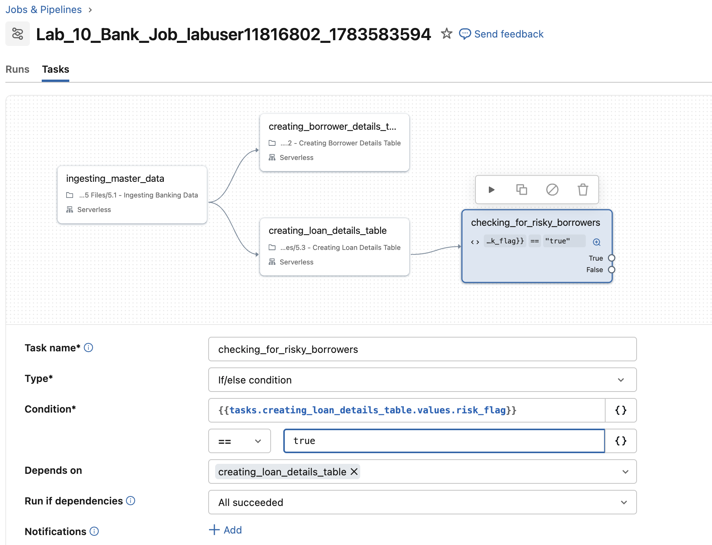
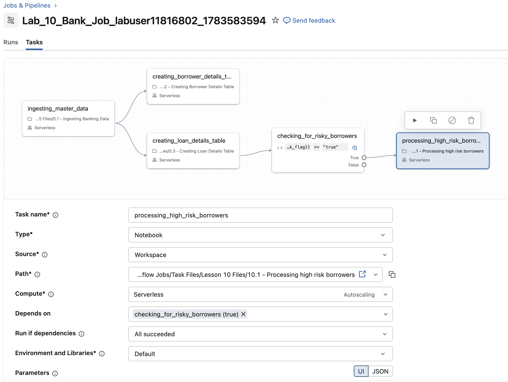
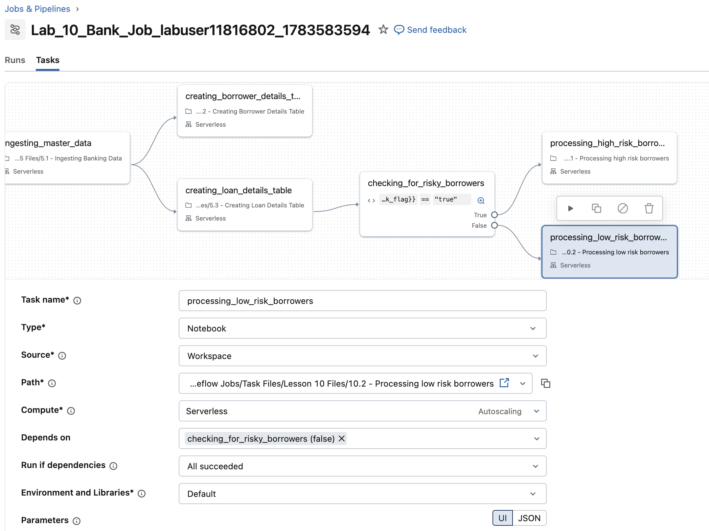

```python
job_tasks = [
        {
            'task_name': 'ingesting_master_data',
            'file_path': '/Task Files/Lesson 05 Files/5.1 - Ingesting Banking Data',
            'depends_on': None
        },
        {
            'task_name': 'creating_borrower_details_table',
            'file_path': '/Task Files/Lesson 05 Files/5.2 - Creating Borrower Details Table',
            'depends_on': [{'task_key':'ingesting_master_data'}]
        },
        {
            'task_name': 'creating_loan_details_table',
            'file_path': '/Task Files/Lesson 05 Files/5.3 - Creating Loan Details Table',
            'depends_on': [{'task_key':'ingesting_master_data'}]
        }
    ]

myjob = DAJobConfig(job_name=f"Lab_10_Bank_Job_{DA.schema_name}",
                        job_tasks=job_tasks,
                        job_parameters=[])
```

## C. Die neuen Task-Dateien erkunden

Bauen wir auf dem letzten Lab auf, indem wir die Notebooks erkunden, die wir dem Job hinzufügen möchten. Die Notebooks befinden sich unter **Task Files** > **Lesson 10 Files**.

Verwenden Sie die folgenden Links, um den Code für jeden Task anzusehen und zu erkunden:

- [Task Files/Lesson 10 Files/10.1 - Processing high risk borrowers]($./Task Files/Lesson 10 Files/10.1 - Processing high risk borrowers)
  - Dieses Notebook identifiziert Kreditnehmer mit hohem Risiko, verarbeitet sie und speichert ihre Daten in der Tabelle **high_risk_borrowers_silver**.

- [Task Files/Lesson 10 Files/10.2 - Processing low risk borrowers]($./Task Files/Lesson 10 Files/10.2 - Processing low risk borrowers)
  - Dieses Notebook identifiziert Kreditnehmer mit niedrigem Risiko, verarbeitet sie und speichert ihre Daten in der Tabelle **low_risk_borrowers_silver**.

## D. Einen bedingten If/Else-Task hinzufügen

In diesem Abschnitt fügen Sie Ihrem Job einen bedingten Task hinzu, der die Tabelle **loan_details_silver** auf Kreditnehmer mit hohem Risiko prüft. Der relevante Code befindet sich in [Task Files/Lesson 05 Files/5.3 - Creating Loan Details Table]($./Task Files/Lesson 05 Files/5.3 - Creating Loan Details Table).

Achten Sie genau auf die letzten Befehle, da sie den Ausgabe-Task-Wert setzen. Sobald die Anzahl der Kreditnehmer, die sowohl einen aktiven Kredit als auch eine Kreditkarte haben, 100 übersteigt, wird `risk_flag` auf **true** gesetzt.

### D1. Das Notebook prüfen: Auf Kreditnehmer mit hohem Risiko prüfen

1. Sehen Sie sich im Notebook [Task Files/Lesson 05 Files/5.3 - Creating Loan Details Table]($./Task Files/Lesson 05 Files/5.3 - Creating Loan Details Table) die `risk_flag`-Logik zur Identifizierung von Kreditnehmern mit hohem Risiko in der Tabelle **loan_details_silver** an.

  - Der Task **creating_loan_details_table** erstellt die Tabelle **loan_details_silver**.

  - Ihr Ziel ist es zu prüfen, ob diese Tabelle mehr als die zulässige Anzahl an Kreditnehmern mit hohem Risiko enthält.

  - Das Ergebnis dieser Prüfung (ein boolescher Wert) wird als `risk_flag` in der Task-Ausgabe gespeichert.

### D2. Einen bedingten If/Else-Task erstellen

1. Navigieren Sie zum erstellten Job, wechseln Sie zum Tab Tasks und fügen Sie einen neuen Task namens **checking_for_risky_borrowers** hinzu.

2. Setzen Sie den Task-Typ auf **If/Else condition**.

3. Legen Sie fest, dass dieser Task vom Task **creating_loan_details_table** abhängt.

4. Wählen Sie die Bedingung aus, indem Sie auf die Schaltfläche `{}` klicken, wählen Sie dann tasks.`creating_loan_details_table.values.my_value` und ersetzen Sie `my_value` durch `risk_flag`.

5. Legen Sie die Bedingung so fest, dass geprüft wird, ob dieser Wert `== true` ist: `tasks.creating_loan_details_table.values.risk_flag == true`

6. Klicken Sie auf **Save Task**.



### D3. Die True-Bedingung behandeln

1. Wenn Kreditnehmer mit hohem Risiko gefunden werden (`risk_flag == true`), fügen Sie einen Notebook-Task namens **processing_high_risk_borrowers** hinzu.

2. Dieser Task sollte vom **True**-Zweig des Tasks **checking_for_risky_borrowers** abhängen.

3. Verwenden Sie für diese Bedingung das Notebook [Task Files/Lesson 10 Files/10.1 - Processing high risk borrowers]($./Task Files/Lesson 10 Files/10.1 - Processing high risk borrowers).



### D4. Die False-Bedingung behandeln

1. Wenn die Anzahl der Kreditnehmer mit hohem Risiko unter dem Schwellenwert liegt (`risk_flag == false`), fügen Sie einen Notebook-Task namens **processing_low_risk_borrowers** hinzu.

2. Dieser Task sollte vom **False**-Zweig des Tasks **checking_for_risky_borrowers** abhängen.

3. Verwenden Sie für diese Bedingung das Notebook [Task Files/Lesson 10 Files/10.2 - Processing low risk borrowers]($./Task Files/Lesson 10 Files/10.2 - Processing low risk borrowers).

4. Dieses Setup stellt sicher, dass Ihr Job Kreditnehmer mit hohem und niedrigem Risiko getrennt verarbeitet.


## E. Ihren Job über die Jobs-UI planen

Gehen Sie wie folgt vor, um Ihren Databricks-Job zu planen:

1. **Ihren Job öffnen:** Wechseln Sie zu dem Job, den Sie gerade erstellt haben.

2. **Zum Tab Tasks wechseln:** Stellen Sie sicher, dass Sie den Tab **Tasks** in Ihrem Job sehen.

3. **Job Details aufklappen:**  Suchen Sie auf der rechten Seite der Jobs-UI den Bereich **Job Details**.  
   - **HINWEIS:** Wenn der Bereich eingeklappt ist, klicken Sie auf das Pfeilsymbol, um ihn aufzuklappen.

4. **Einen Zeitplan hinzufügen:**  Klicken Sie im Abschnitt **Schedules & Triggers** auf **Add trigger**. Sie sehen drei Planungsoptionen:  
   - **Scheduled** (zu bestimmten Zeiten ausführen)

   - **Continuous** (ausführen, sobald der vorherige Run beendet ist)

   - **Table Update** (automatisch ausführen, sobald eine oder mehrere angegebene Tabellen aktualisiert werden)

   - **File arrival** (ausführen, wenn Dateien an einem Speicherort eintreffen)

5. **Einen geplanten Run einrichten:**  
   - Wählen Sie **Scheduled**.

   - Klicken Sie auf den Abschnitt **Advanced**, um weitere Optionen zu sehen.

6. **Den Zeitplan konfigurieren:**  
   - Legen Sie fest, dass der Job **jeden Tag** zu einer Uhrzeit Ihrer Wahl läuft.

   - Achten Sie darauf, Ihre spezifische Zeitzone auszuwählen.

   - **Tipp:** Legen Sie den Zeitplan so fest, dass er zwei Minuten nach Ihrer aktuellen Uhrzeit startet, damit Sie nicht lange auf den Job-Run warten müssen.

**HINWEIS:** Durch das Planen Ihres Jobs wird sichergestellt, dass er automatisch zu den von Ihnen festgelegten Zeiten ausgeführt wird. Sie können Ihren Job-Run auch starten, indem Sie oben in Ihrem Job auf **Run Now** klicken.
