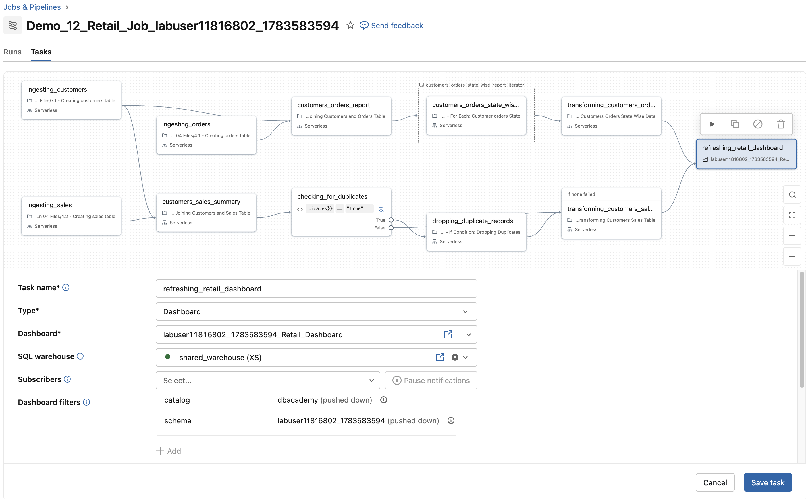

  Wie Sie in Databricks Jobs überwachen, absichtlich einen Fehler herbeiführen und fehlgeschlagene Runs reparieren.

**Diese Demo behandelt:**
- Wie Sie einen fehlgeschlagenen Run reparieren
- Nur fehlgeschlagene Tasks erneut ausführen
- Einen Dashboard-Task hinzufügen

## F. Ihren Job ausführen
* **Grau** – der Task wurde noch nicht gestartet
* **Grüne Streifen** – der Task läuft gerade
* **Durchgehend grün** – der Task wurde erfolgreich abgeschlossen
* **Dunkelrot** – der Task ist fehlgeschlagen
* **Hellrot** – ein vorgelagerter Task ist fehlgeschlagen, daher wurde der aktuelle Task nie ausgeführt

4. Wenn der Run beendet ist, beachten Sie, dass **transforming_customers_orders_data** fehlgeschlagen ist. Das war so zu erwarten.


## G. Job-Runs reparieren

Sie können die in einem Task verwendeten Notebooks einschließlich ihrer Ausgabe als Teil eines Job-Runs ansehen. Das hilft bei der Fehlerdiagnose. Außerdem können Sie bestimmte Tasks in einem fehlgeschlagenen Job-Run erneut ausführen.

Betrachten Sie dieses Beispiel:

Sie entwickeln einen Job mit mehreren Notebooks. Während eines Job-Runs schlägt einer der Tasks fehl. Sie können den Code in diesem Notebook aktualisieren und den fehlgeschlagenen Task sowie alle davon abhängigen Tasks erneut ausführen. Sie können auch Task-Parameter ändern und den Task erneut ausführen. Gehen wir diesen Prozess durch:

1. Klicken Sie oben rechts auf **Repair run**.

2. Öffnen Sie [Task Files/Lesson 12 Files/12.1 - Transforming Customers Orders State Wise Data]($./Task Files/Lesson 12 Files/12.1 - Transforming Customers Orders State Wise Data) und beachten Sie, dass die Funktion `def clean_common` einen falschen Spaltennamen verwendet.

3. Ändern Sie im Code-Skript den Spaltennamen von `customer` in `customer_name`.


4. Kehren Sie zu Ihrem Job-Run zurück. Klicken Sie oben rechts auf **Repair run**. Stellen Sie sicher, dass der Task **transforming_customers_orders_data** ausgewählt ist.

5. Die „1“ in der Schaltfläche **Repair run** zeigt an, dass Databricks sowohl den fehlgeschlagenen als auch den abhängigen Task ausgewählt hat. Sie können beliebige Tasks, die Sie erneut ausführen möchten, aus- oder abwählen.

6. Warten Sie, bis der Run abgeschlossen ist.

## H. Den Run überprüfen

Sobald Ihr Job-Run erfolgreich war, kehren Sie zu Ihrem Job zurück und klicken Sie auf den Tab **Runs**. Klicken Sie auf den neuesten Run und dann auf **transforming_customers_orders_data**. Oben links sehen Sie den Run-Status als Dropdown-Liste. Durch Klicken auf die einzelnen Optionen im Dropdown können Sie die Ausgabe Ihres Task-Runs sehen. Beachten Sie den Code-Unterschied zwischen dem erfolgreichen und dem fehlgeschlagenen Task. Im erfolgreichen Run sollten Sie den korrekten Spaltennamen (`customer_name`) sehen.


## I. Ein Dashboard zu Ihrem Job hinzufügen

In diesem Abschnitt integrieren wir ein vorab erstelltes Dashboard in Ihren Job. Das Dashboard wurde für Sie vorbereitet und ist als JSON-Eingabedatei gespeichert, sodass Sie es nicht von Grund auf neu erstellen müssen.

#### I1. Ihr Retail-Dashboard konfigurieren
Gehen Sie wie folgt vor, um Ihr Dashboard anzuzeigen und zu konfigurieren:

1. Navigieren Sie zu **Lesson 12 Files**: [Task Files/Lesson 12 Files]($./Task Files/Lesson 12 Files), um die Eingabedatei zu finden.
2. Suchen Sie die Datei **input_file**. Diese Datei hilft beim Generieren einer benutzerspezifischen Dashboard-JSON-Datei.
3. Führen Sie den folgenden Befehl aus, um das Dashboard automatisch aus der Eingabedatei zu erstellen.

```python
DA.dashboard_creation_from_input()
```

4. Klicken Sie links auf das Ordnersymbol ; Sie sehen Ihr Dashboard zusammen mit anderen Lab-/Demo-Notebooks.
5. Stellen Sie sicher, dass der Dashboard-Name mit dem in der obigen Zellenausgabe angezeigten übereinstimmt. Klicken Sie auf das Dashboard, um es zu öffnen.
6. Klicken Sie oben links auf **Edit draft**, um Ihr Dashboard anzuzeigen und zu ändern.
7. Stellen Sie oben rechts sicher, dass **shared_warehouse** als Compute ausgewählt ist. Verwenden Sie nicht "unknown warehouse". Warten Sie, bis das SQL Warehouse gestartet ist, damit Ihr Dashboard dargestellt werden kann.
8. Klicken Sie links auf den Tab **Data**. Prüfen Sie, dass die folgenden Tabellen ausgewählt sind:
   - `customers_orders_ny_gold`
   - `customers_orders_va_gold`
   - `customers_sales_summary_gold`
9. Führen Sie im Abfragefeld Abfragen auf jede Tabelle aus, um Erkenntnisse zu gewinnen. Stellen Sie sicher, dass Ihr Katalog auf **dbacademy** und Ihr Schema auf Ihr spezifisches **labuser**-Schema gesetzt ist.
10. Klicken Sie auf **Publish**. Hier finden Sie Optionen zum Freigeben von Dashboard-Berechtigungen. Ihr Dashboard wurde durch den obigen Befehl automatisch veröffentlicht. Wenn Sie jedoch Änderungen vornehmen, müssen Sie das Dashboard erneut veröffentlichen, um es zu aktualisieren.

**Hinweis:** Das Veröffentlichen des Dashboards ist erforderlich, um es in Ihren Job-Tasks zu verwenden.

So stellen Sie sicher, dass Ihr Dashboard mit den richtigen Daten- und Compute-Ressourcen verbunden ist.

#### I2. Einen Dashboard-Task zu Ihrem Job hinzufügen
Dieses Dashboard wurde im Classroom-Setup-Skript für Sie vorab erstellt. Das Erstellen von Dashboards liegt außerhalb des Umfangs dieses Kurses.

1. Klicken Sie in Ihrem Job auf **Add task** und wählen Sie **Dashboard**. Konfigurieren Sie den Task wie folgt:

| Einstellung    | Anweisungen                                                                  |
|----------------|------------------------------------------------------------------------------|
| Task name      | Geben Sie **refreshing_retail_dashboard** ein                                |
| Type           | Stellen Sie sicher, dass **Dashboard** ausgewählt ist                        |
| Dashboard      | Wählen Sie Ihr Dashboard aus der Liste der verfügbaren Dashboards. Der Name Ihres Dashboards wird in der Ausgabezelle des Befehls zur Dashboard-Erstellung angezeigt.                                                |
| SQL warehouse  | Wählen Sie im Dropdown Ihr **Warehouse**                                     |
| Subscribers    | Wählen Sie im Dropdown eine E-Mail-Adresse, um Dashboard-Snapshots zu erhalten. In unserer Lernumgebung können Sie keine weiteren E-Mail-Adressen hinzufügen.                    |
| Depends on     | Wählen Sie **transforming_customers_sales_table** und **transforming_customers_orders_data** |
| Dependencies   | Auf **All Succeeded** setzen                                                 |

2. Klicken Sie auf **Save task**.



3. Klicken Sie auf **Run Now** und warten Sie, bis der Run abgeschlossen ist.

**HINWEIS:** Stellen Sie sicher, dass der Datenbereich Ihres Dashboards alle Gold-Tabellen enthält (Tabellen mit dem Suffix `gold` aus Ihrem Schema) und dass Ihr Dashboard mit Ihrem SQL Warehouse verbunden ist.

#### I3. Das Retail-Dashboard analysieren
Prüfen Sie nach Abschluss des Runs Ihre E-Mails. Sie sollten eine E-Mail von Databricks mit dem Retail_Dashboard erhalten haben.

## J. Lakehouse-Systemtabellen abfragen
Databricks stellt Systemkataloge bereit, die Metadaten zu Abrechnung, Zugriff, Lakehouse-Operationen, Compute-Ressourcen und mehr enthalten. In diesem Kurs konzentrieren wir uns auf das Abfragen von Abrechnungs- und Lakehouse-Operationsdetails.

1. Sehen Sie sich zunächst an, welche Schemas im Katalog `system` vorhanden sind.

```sql
%sql
SHOW SCHEMAS IN system
```

2. Sehen Sie sich als Erstes die verschiedenen Tabellen an, die im Schema `lakeflow` verfügbar sind.

```sql
%sql
SHOW TABLES IN system.lakeflow
```

3. Verknüpfen wir die Tabellen `jobs` und `job_task_run_timeline`, um Erkenntnisse über kürzlich ausgeführte Jobs zu gewinnen.

```sql
%sql
SELECT jobs.workspace_id, 
        jobs.name as job_name,
        jobs.job_id,
        timeline.run_id,
        timeline.period_start_time,
        timeline.period_end_time,
        timeline.task_key,
        timeline.result_state 
FROM system.lakeflow.jobs as jobs
INNER JOIN
system.lakeflow.job_task_run_timeline as timeline
ON jobs.job_id = timeline.job_id
WHERE lower(jobs.name) LIKE 'demo_12_retail_job_%'
ORDER BY timeline.period_start_time
```

Hinweis: Sie können die verschiedenen verfügbaren Systemtabellen abfragen, verknüpfen und filtern, um wertvolle Erkenntnisse zu gewinnen. Dies ist ein umfangreiches Thema und liegt außerhalb des Umfangs dieses Kurses.
