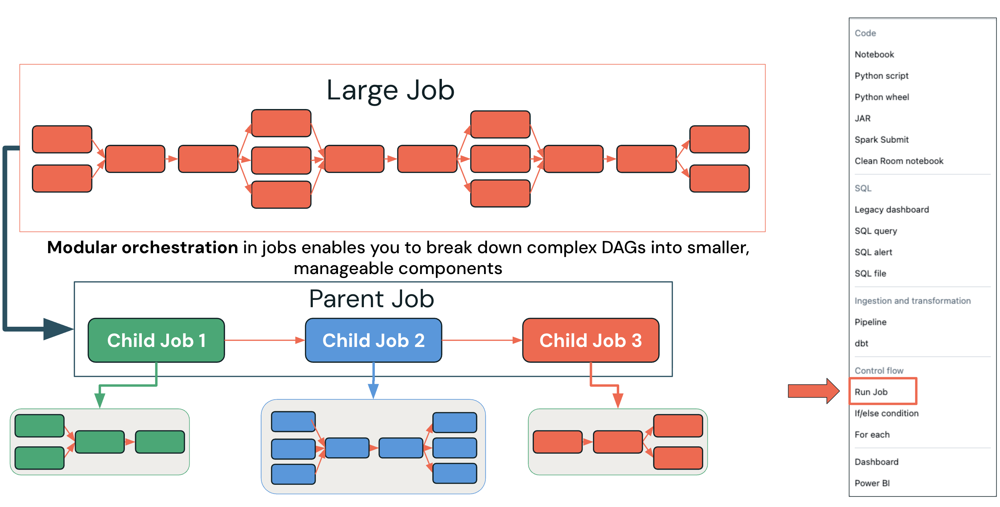
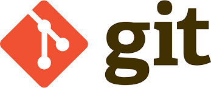
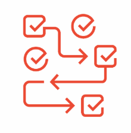

Wie Sie Lakeflow Jobs in der Produktion mit geeignetem Compute, passender Preisgestaltung, modularem Design, Git-Integration und operativen Best Practices betreiben.

## Lernziele

Am Ende dieser Lektion können Sie:
1. Geeignetes Compute auswählen (Serverless vs. Classic) und die Preisstruktur von Jobs verstehen
2. Designmuster für modulare Orchestrierung mit dem Run-Job-Task anwenden
3. Git-Integration für versionskontrollierte Job-Definitionen konfigurieren
4. Best Practices für die Produktion anwenden (Service Principals, parametrisierte Tasks, Alerting, wartbares Design)

## A. Gängige Best Practices

Der Übergang von der Entwicklung in die Produktion erfordert das Verständnis, wie Lakeflow Jobs im Unternehmensmaßstab mit angemessener Governance, Sicherheit und Betriebspraxis entworfen, bereitgestellt und betrieben werden.

### Compute
Die richtigen Compute-Optionen für Performance-, Kosten- und Betriebsanforderungen auswählen.
### Modulares Design
Architekturmuster umsetzen, die Wartbarkeit, Wiederverwendbarkeit und Zusammenarbeit im Team unterstützen.
### Git
Versionskontroll- und Deployment-Praktiken, die Konsistenz sicherstellen und CI/CD-Workflows ermöglichen.

##### Zusätzliche Hinweise
Produktions-Deployments erfordern Aufmerksamkeit in vier kritischen Bereichen:

- **Compute-Strategie:** Die richtigen Compute-Optionen für Performance-, Kosten- und Betriebsanforderungen auswählen.
- **Modulares Design:** Architekturmuster umsetzen, die Wartbarkeit, Wiederverwendbarkeit und Zusammenarbeit im Team unterstützen.
- **Git-Integration:** Versionskontroll- und Deployment-Praktiken, die Konsistenz sicherstellen und CI/CD-Workflows ermöglichen.
- **Performance-Monitoring:** Proaktive Monitoring- und Optimierungsstrategien, die die Einhaltung von SLAs und Kosteneffizienz sicherstellen.

### A1. Compute auswählen

### Interactive Clusters
- Am besten für Ad-hoc-Analysen, Datenexploration oder Entwicklung, aber nicht für die Produktion
- Teuer für Job-Runs
- Begrenzte Skalierbarkeit
- Die Verfügbarkeit kann aufgrund paralleler Nutzung ein Problem sein

### Job Clusters
- Günstiger, da sie beim Ende des Jobs beendet werden und so Ressourcenverbrauch und Kosten senken
- Startlatenz
- Abhängig von der Startzeit des Cloud-Anbieters
- Wartungsaufwand

Serverless Compute

**Einfachheit** Sie müssen den VM-Typ nicht mehr auswählen. Kunden benötigen keine speziell ausgebildeten DevOps-Mitarbeiter.**Hohe Effizienz** Photon ist standardmäßig aktiviert.!

**Schnellerer Start** VMs laufen im Databricks-Konto. Wir stellen auf Basis historischer Daten und ML sicher, dass genügend Knoten verfügbar sind.!

**Zuverlässigkeit** Abgeschirmt gegen Störungen in der Cloud.

##### Zusätzliche Hinweise
Das Verständnis der Compute-Optionen ist entscheidend für den Erfolg in der Produktion:

- **Interactive Clusters** sind ideal für Entwicklung und Ad-hoc-Analysen, bringen aber erhebliche Herausforderungen für den Produktionseinsatz mit sich: **Kostenprobleme:** Interaktive Cluster laufen weiter, auch wenn keine Jobs ausgeführt werden, was zu unnötigen Kosten führt
- **Begrenzte Skalierbarkeit:** Gemeinsam genutzte Ressourcen können zu Konkurrenz und unvorhersehbarer Performance führen
- **Verfügbarkeitsprobleme:** Wenn mehrere Benutzer Cluster teilen, kann es zu Ressourcenkonflikten und Job-Verzögerungen kommen
**Job Clusters** bieten bessere Eigenschaften für die Produktion:
- **Kosteneffizienz:** Cluster werden beendet, wenn Jobs abgeschlossen sind, wodurch Kosten für ungenutzte Ressourcen entfallen
- **Dedizierte Ressourcen:** Jeder Job erhält dedizierte Compute-Ressourcen, was eine vorhersehbare Performance sicherstellt
- **Startlatenz:** Startzeiten der Cloud-Anbieter können die Job-Ausführung verzögern und müssen bei der SLA-Planung berücksichtigt werden
- **Wartungsaufwand:** Erfordert mehr Konfiguration und Verwaltung als Serverless-Optionen
**Serverless Compute** ist für die meisten Produktions-Workloads die optimale Wahl, da es operative Einfachheit, Performance-Optimierung, Zuverlässigkeit und Geschwindigkeit sowie Unabhängigkeit von der Cloud bietet.

### A2. Preisstruktur

Das klassische Preismodell umfasst mehrere Kostenkomponenten, während Serverless das Kostenmodell grundlegend vereinfacht.

##### Wählen Sie unten die einzelnen Tabs aus, um die Preise von Classic und Serverless zu vergleichen.

Classic
Serverless

Classic

DBUs (an Databricks gezahlt)
Infrastrukturkosten (an den Cloud-Anbieter gezahlt)
Betriebskosten (auf Organisationsebene anfallend)

Kosten für VMs für Cluster
Kosten für das Netzwerk (FW / NAT)
Kosten für Sicherheit, Auslastungsmonitoring
Zeitaufwand für Deployment, Automatisierung und Wartung der Infrastruktur
Zeitaufwand für das Management von Kosten, Effizienz und Auslastung

Serverless

TCO-Einsparungen
DBUs (eine einzige Rechnung, die

Infrastruktur- und Betriebs-

kosten enthält)

Mehrwert
Vollständig verwalteter Dienst – operativ einfacher, zuver-

lässiger
Schnelle Cluster, Auto-Scaling – bessere Benutzererfahrung, geringere

Kosten
Sofort verfügbare Performance und Optimierungen – niedrigere

Gesamt-TCO

##### Zusätzliche Hinweise
Das klassische Preismodell umfasst mehrere Kostenkomponenten:

- **Direkte Kosten:** An Databricks gezahlte DBUs plus direkt an Cloud-Anbieter gezahlte Infrastrukturkosten (VMs, Netzwerk, Sicherheitsdienste).
- **Operativer Aufwand:** Oft übersehene, aber erhebliche Kosten, darunter der Zeitaufwand für Infrastruktur-Deployment, Automatisierungsentwicklung, Wartungsarbeiten, Kostenmonitoring und Effizienzoptimierung.
- **Versteckte Komplexität:** Verwaltung mehrerer Abrechnungsbeziehungen, Optimierung über verschiedene Kostenkategorien hinweg und Aufrechterhaltung von Know-how im Management von Cloud-Infrastruktur.

Serverless vereinfacht das Kostenmodell grundlegend:

- **Einheitliche Abrechnung:** Ein einziger DBU-Preis, der Infrastruktur- und Betriebskosten enthält, sodass keine mehreren Anbieterbeziehungen und Kostenoptimierungsstrategien verwaltet werden müssen.
- **Nutzenversprechen:** Der vollständig verwaltete Dienst bietet operative Einfachheit und Verbesserungen der Zuverlässigkeit, die höhere Kosten pro Einheit durch geringeren operativen Aufwand oft rechtfertigen.
- **Performance-Vorteile:** Auto-Scaling und sofort verfügbare Optimierungen liefern oft eine bessere Performance zu geringeren Gesamtkosten als selbst verwaltete Alternativen.
- **TCO-Vorteile:** Wenn man den operativen Aufwand einrechnet, sind die Gesamtbetriebskosten (TCO) mit Serverless in der Regel niedriger, insbesondere für Organisationen ohne eigene Platform-Engineering-Teams.

## B. Modulares Design

Architekturmuster umsetzen, die Wartbarkeit, Wiederverwendbarkeit und Zusammenarbeit im Team unterstützen.

### B1. Modulares Design in Databricks LakeFlow Jobs

Architekturmuster umsetzen, die Wartbarkeit, Wiederverwendbarkeit und Zusammenarbeit im Team unterstützen.

  

##### Zusätzliche Hinweise
Modulare Orchestrierung verwandelt große, monolithische Workflows in wartbare, wiederverwendbare Komponenten:

- **Zerlegungsstrategie:** Zerlegen Sie komplexe DAGs in logische Geschäftseinheiten statt in technische Komponenten. Jedes Modul sollte eine zusammenhängende Geschäftsfunktion abbilden, die unabhängig entwickelt, getestet und bereitgestellt werden kann.
- **Parent-Child-Beziehungen:** Parent-Jobs orchestrieren Child-Jobs und schaffen so eine klare Trennung der Zuständigkeiten, während die übergreifende Workflow-Koordination erhalten bleibt.
- **Nutzen:** **Wartbarkeit:** Kleinere Jobs sind leichter zu verstehen, zu ändern und zu debuggen
- **Wiederverwendbarkeit:** Child-Jobs können in mehreren Parent-Workflows wiederverwendet werden
- **Zusammenarbeit im Team:** Verschiedene Teams können unterschiedliche Module verantworten und gemeinsam am Gesamt-Workflow arbeiten
- **Testen:** Einzelne Module können unabhängig getestet werden, was die Qualität verbessert und das Deployment-Risiko senkt

## C. Jobs und Git

↓**Job**
**Jobs unterstützen die Ausführung von Notebooks aus Git.**
### Unbeabsichtigte Änderungen verhindern
Dies verhindert unbeabsichtigte Änderungen an Ihrem Produktions-Job, zum Beispiel wenn ein anderer Benutzer lokale Änderungen in einem „Prod“-Repo vornimmt oder den Branch wechselt.
### Single Source of Truth
Vereinfacht die Job-Definition durch eine einzige verbindliche Quelle.
### CI/CD-Deployment
Erleichtert das Deployment von Notebooks über CI/CD.
### Unterstützung von Git-Plattformen
Benutzer können sich mit verschiedenen Git-Plattformen verbinden, da Databricks GitHub, GitLab, AWS CodeCommit und andere Git-Anbieter unterstützt.

##### Zusätzliche Hinweise
Die Git-Integration bietet wesentliche Funktionen für die Verwaltung produktiver Workflows:

- **Change Management:** Verhindert unbeabsichtigte Änderungen an Produktions-Jobs, indem sichergestellt wird, dass alle Änderungen ordnungsgemäße Versionskontrollprozesse durchlaufen.
- **Single Source of Truth:** Beseitigt Unklarheiten darüber, welche Codeversion in der Produktion läuft, da immer committeter Code aus bestimmten Branches oder Tags ausgeführt wird.
- **CI/CD-Integration:** Ermöglicht automatisierte Test- und Deployment-Pipelines, die Änderungen validieren können, bevor sie Produktionsumgebungen erreichen.
- **Plattformunterstützung:** Die breite Kompatibilität mit GitHub, GitLab, AWS CodeCommit und anderen Git-Anbietern stellt sicher, dass Sie sich unabhängig von Ihrer gewählten Plattform in bestehende Entwicklungs-Workflows integrieren können.
- **Vorteile für die Zusammenarbeit:** Mehrere Entwickler können mithilfe standardmäßiger Git-Workflows (Branches, Pull Requests, Code Reviews) gemeinsam an der Workflow-Entwicklung arbeiten, während die Stabilität der Produktion erhalten bleibt.

### C1. Konfigurationsschritte für Jobs und Git

1
### Task mit Git-Anbieter als Quelle erstellen
Erstellen Sie Tasks mit einem Git-Anbieter als Quelle und geben Sie Repository, Branch/Tag und Anmeldeinformationen an.
2
### Pfad zum Haupt-Notebook unter dem Repository-Root konfigurieren
Konfigurieren Sie den Pfad zu Ihrem Haupt-Notebook unter dem Repository-Root, damit der Job den richtigen Einstiegspunkt Ihres Workflows finden und ausführen kann.

##### Zusätzliche Hinweise
Die Umsetzung der Git-Integration umfasst zwei einfache Schritte:

- **Schritt 1 – Konfiguration der Quelle:** Erstellen Sie Tasks mit einem Git-Anbieter als Quelle und geben Sie Repository, Branch/Tag und Anmeldeinformationen an. So stellen Sie sicher, dass Ihr Job immer die committete Version Ihres Codes ausführt.
- **Schritt 2 – Konfiguration des Pfads:** Konfigurieren Sie den Pfad zu Ihrem Haupt-Notebook unter dem Repository-Root, damit der Job den richtigen Einstiegspunkt Ihres Workflows finden und ausführen kann.
- **Best Practices:** Verwenden Sie für die Produktion bestimmte Branches oder Tags statt sich ständig ändernder Main-Branches, führen Sie vor dem Mergen in Produktions-Branches ordentliche Code-Review-Prozesse durch und dokumentieren Sie klar, welche Repositories und Pfade Code für Produktions-Jobs enthalten.

## D. Best Practices

Compute- & Kostenoptimierung

Verwenden Sie in der Produktion Job- oder **Serverless-Cluster**
Vermeiden Sie interaktive Cluster für Produktions-Workloads
**Aktivieren Sie Photon** für eine schnellere und günstigere Ausführung
**Verwenden Sie Cluster wieder**, um Startzeit und Kosten zu reduzieren

Fokus: effizientes Produktions-Compute mit geringerem Start-Overhead und niedrigeren Kosten.

Orchestrierung & Modularität

**Zerlegen Sie komplexe Pipelines** in modulare Jobs/Run Jobs
Verwenden Sie **Multi-Task-Jobs** für eine parallele und skalierbare Ausführung
Wenden Sie bedingte Logik mit Run-If-, If/Else- und For-Each-Tasks an
Begrenzen Sie Jobs auf eine **handhabbare Anzahl von Tasks** für die Wartbarkeit; das Limit liegt bei 1000 Tasks

Fokus: modulares Design, das auch bei wachsenden Workflows wartbar bleibt.

Monitoring & Governance

Verwenden Sie **Service Principals** als Job-Eigentümer und für den Datenzugriff
Konfigurieren Sie Alerts für **Fehler, Verzögerungen und Abschlüsse**
Nutzen Sie **Repair & Run**, um Kosten für die erneute Verarbeitung zu senken
Parametrisieren Sie Tasks für **Wiederverwendbarkeit und Flexibilität**

Fokus: zuverlässige Verantwortlichkeiten, Alerting, Wiederherstellung und wiederverwendbare Ausführungsmuster.

##### Zusätzliche Hinweise
**Praktiken zur Compute- & Kostenoptimierung:**

- **Produktions-Compute:** Verwenden Sie in Produktionsumgebungen immer Job-Cluster oder Serverless Compute, um Kosteneffizienz und Ressourcenisolation sicherzustellen
- **Interaktive Cluster vermeiden:** Reservieren Sie interaktive Cluster ausschließlich für Entwicklung und Ad-hoc-Analysen, um Kostenüberschreitungen und Ressourcenkonflikte in der Produktion zu vermeiden
- **Photon aktivieren:** Aktivieren Sie die Photon-Beschleunigung für alle geeigneten Workloads, um deutliche Performance-Verbesserungen und Kostensenkungen zu erzielen
- **Cluster wiederverwenden:** Gestalten Sie Workflows so, dass Cluster nach Möglichkeit über Tasks hinweg wiederverwendet werden, um den Start-Overhead zu verringern und die Kosteneffizienz zu verbessern

**Praktiken zu Orchestrierung & Modularität:**

- **Modulare Architektur:** Zerlegen Sie komplexe Pipelines mithilfe des Run-Job-Task-Musters in logische, wartbare Module, um Wartbarkeit und Zusammenarbeit im Team zu verbessern
- **Multi-Task-Design:** Nutzen Sie Multi-Task-Jobs für parallele Ausführung und eine bessere Ressourcennutzung, während der Workflow übersichtlich bleibt
- **Fortgeschrittene Logik:** Setzen Sie anspruchsvolle Geschäftslogik mit Run-If-, If/Else- und For-Each-Tasks um, um komplexe reale Szenarien zu bewältigen
- **Task-Limits:** Halten Sie einzelne Jobs unter 1000 Tasks, um Handhabbarkeit und Performance zu wahren, und nutzen Sie modulares Design für größere Workflows

**Praktiken zu Monitoring & Governance:**

- **Nutzung von Service Principals:** Verwenden Sie Service Principals statt persönlicher Konten als Job-Eigentümer und für den Datenzugriff, um Kontinuität und eine ordnungsgemäße Zugriffskontrolle sicherzustellen
- **Umfassendes Alerting:** Konfigurieren Sie Alerts für Fehler, Verzögerungen und Abschlüsse mit geeigneten Eskalations- und Benachrichtigungsstrategien
- **Optimierte Wiederherstellung:** Nutzen Sie die Repair-&-Run-Funktionen, um Kosten und Wiederherstellungszeit bei Fehlern zu minimieren
- **Parametrisierung:** Gestalten Sie Tasks mit sinnvoller Parametrisierung für maximale Wiederverwendbarkeit und Flexibilität über Umgebungen und Anwendungsfälle hinweg

## E. Fazit

- **Produktions-Compute**

Wählen Sie Compute-Optionen, die zu Ihren Performance-, Kosten- und Betriebsanforderungen passen.
- **Preisstruktur**

Serverless vereinfacht die Abrechnung, indem Infrastruktur- und Betriebskosten in einem einzigen DBU-Preis enthalten sind.
- **Modulares Design**

Zerlegen Sie große Workflows in wartbare Parent-Jobs und wiederverwendbare Child-Jobs.
- **Jobs und Git**

Verwenden Sie Git-basierte Produktions-Notebooks, um CI/CD, Konsistenz und Change Management zu unterstützen.
- **Best Practices**

Wenden Sie Praktiken zu Compute-Optimierung, modularer Orchestrierung, Monitoring, Alerting, Wiederherstellung, Governance und Parametrisierung an, um zuverlässige Produktions-Workflows zu erhalten.

©  Databricks, Inc. Alle Rechte vorbehalten.

Apache, Apache Spark, Spark, das Spark-Logo, Apache Iceberg, Iceberg und das Apache-Iceberg-Logo sind Marken der [Apache Software Foundation](https://www.apache.org/).

[Datenschutzrichtlinie](https://databricks.com/privacy-policy) |
[Nutzungsbedingungen](https://databricks.com/terms-of-use) |
[Support](https://help.databricks.com/)

