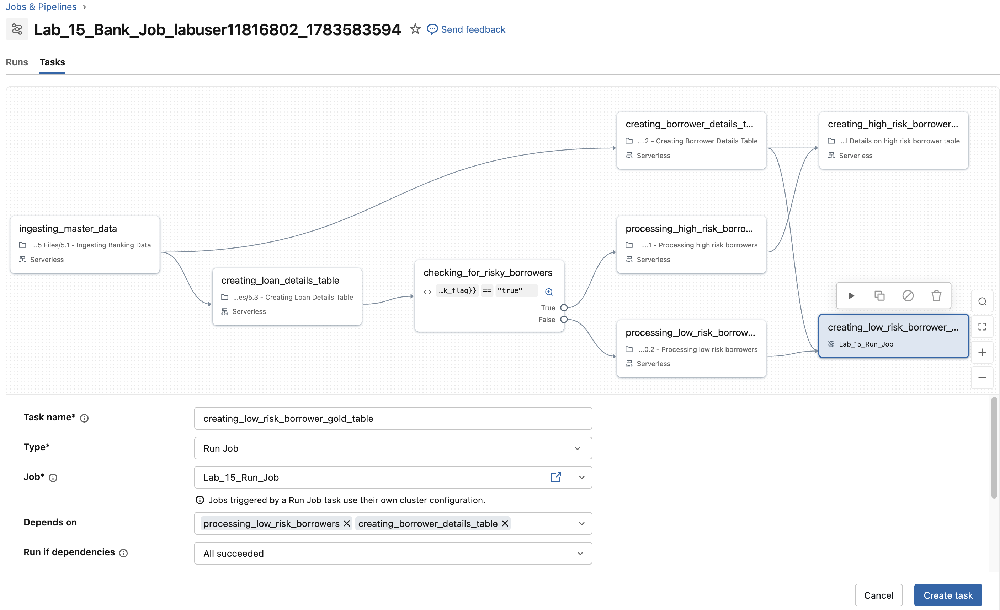
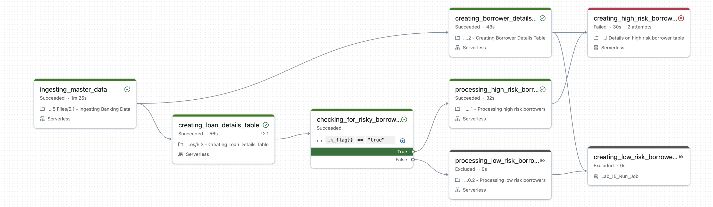
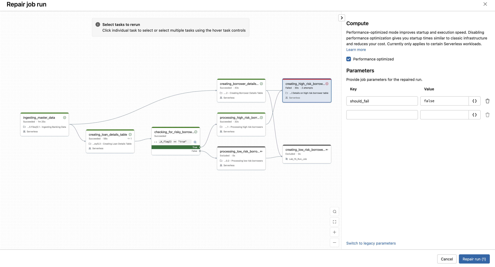
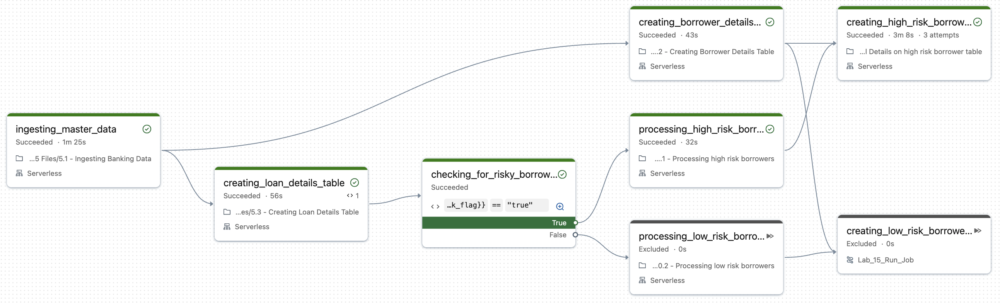

  Am Ende dieses Labs sollten Sie in der Lage sein:

* einen Run-Job-Task zu Ihrem Job hinzuzufügen
* einen fehlgeschlagenen Task zu reparieren

## Lab-Überblick
Nachdem wir Kreditnehmer mit hohem und niedrigem Risiko getrennt verarbeitet haben, ist es nun an der Zeit, persönliche Angaben hinzuzufügen und Gold-Tabellen zu erstellen

## ERFORDERLICH – CLASSIC COMPUTE AUSWÄHLEN

Bevor Sie Zellen in diesem Notebook ausführen, wählen Sie bitte Ihren Classic-Compute-Cluster im Lab aus. Beachten Sie, dass standardmäßig **Serverless** aktiviert ist.

Gehen Sie wie folgt vor, um den Classic-Compute-Cluster auszuwählen:

1. Klicken Sie oben rechts in diesem Notebook auf das Dropdown-Menü, um Ihren Cluster auszuwählen. Standardmäßig verwendet das Notebook **Serverless**.

2. Wenn Ihr Cluster verfügbar ist, wählen Sie ihn aus und fahren Sie mit der nächsten Zelle fort. Wenn der Cluster nicht angezeigt wird:

   - Klicken Sie im Dropdown auf **More**.

   - Wählen Sie im Fenster **Attach to an existing compute resource** im ersten Dropdown Ihren eindeutigen Cluster aus.

**HINWEIS:** Wenn Ihr Cluster beendet wurde, müssen Sie ihn möglicherweise neu starten, um ihn auswählen zu können. Gehen Sie dazu wie folgt vor:

1. Klicken Sie im linken Navigationsbereich mit der rechten Maustaste auf **Compute** und wählen Sie *Open in new tab*.

2. Suchen Sie das Dreieckssymbol rechts neben dem Namen Ihres Compute-Clusters und klicken Sie darauf.

3. Warten Sie einige Minuten, bis der Cluster gestartet ist.

4. Sobald der Cluster läuft, führen Sie die obigen Schritte aus, um Ihren Cluster auszuwählen.

## A. Classroom-Setup

Führen Sie die folgende Zelle aus, um Ihre Arbeitsumgebung für diesen Kurs zu konfigurieren. Dabei werden außerdem mithilfe der `USE`-Anweisungen Ihr Standardkatalog auf **dbacademy** und das Schema auf Ihren unten angezeigten spezifischen Schemanamen gesetzt.

```
USE CATALOG dbacademy;
USE SCHEMA dbacademy.<your unique schema name>;
```

**HINWEIS:** Das Objekt **DA** wird nur in Databricks-Academy-Kursen verwendet und ist außerhalb dieser Kurse nicht verfügbar. 

```text
%run ./Includes/Classroom-Setup-15L
```

## B. Den Starter-Job erstellen

In diesem Abschnitt erstellen Sie programmatisch einen Databricks-Job mit dem Databricks SDK.

> **Hinweis:** Die Methode zum Erstellen des Jobs ist im Notebook [Classroom-Setup-Common]($./Includes/Classroom-Setup-Common) definiert. Obwohl hier das [Databricks SDK](https://databricks-sdk-py.readthedocs.io/en/latest/) verwendet wird, liegt eine vertiefte Behandlung des SDK außerhalb des Umfangs dieses Kurses.

**Anweisungen:**
- Führen Sie den folgenden Befehl aus, um automatisch einen Job zu erstellen, der alle bis zum vorherigen Lab erledigten Tasks enthält.

```python
DA.lesson_15_starter_job()
```

## C. Die Task-Dateien erkunden

Bisher haben Sie Bankkreditdaten ingestiert, transformiert und bedingte Tasks hinzugefügt. Nun fügen wir weitere Transformationen hinzu und ergänzen die Tabellen **high_risk_borrowers_silver** und **low_risk_borrowers_silver** mithilfe der Tabelle **borrower_details_bronze** um persönliche Angaben.

Die Notebooks für dieses Lab finden Sie unter **Task Files** > **Lesson 15 Files**. Verwenden Sie die folgenden Links, um den Code für jeden Task anzusehen und zu erkunden:

- [Task Files/Lesson 15 Files/15.1 - Adding Personal Details on high risk borrower table]($./Task Files/Lesson 15 Files/15.1 - Adding Personal Details on high risk borrower table)

- [Task Files/Lesson 15 Files/15.2 - Adding Personal Details on low risk borrower table]($./Task Files/Lesson 15 Files/15.2 - Adding Personal Details on low risk borrower table)

## D. Einen Run Job erstellen

Sie erstellen einen separaten Run Job, indem Sie die folgenden Schritte ausführen:

1. Klicken Sie in der linken Navigationsleiste mit der rechten Maustaste auf **Jobs and Pipelines** und öffnen Sie den Link in einem neuen Tab.
2. Klicken Sie auf **Create** und wählen Sie im Dropdown-Menü **Job**.
3. Benennen Sie Ihren Job **Lab_15_Run_Job**
3. Klicken Sie bei den empfohlenen Tasks auf den Task **Notebook** und konfigurieren Sie den Notebook-Task wie unten gezeigt:

| Einstellung  | Anweisungen |
|--------------|--------------|
| Task name    | Geben Sie **run_job_notebook_task** ein |
| Type         | Wählen Sie **Notebook** |
| Source       | Wählen Sie **Workspace** |
| Path         | Geben Sie mit dem Navigator den Pfad [Task Files/Lesson 15 Files/15.2 - Adding Personal Details on low risk borrower table]($./Task Files/Lesson 15 Files/15.2 - Adding Personal Details on low risk borrower table) an |
| Compute      | Wählen Sie **Serverless** |


## E. Neue Tasks zum Master-Job hinzufügen

Als Nächstes fügen Sie Ihrem Master-Job sowohl einen Notebook-Task als auch einen Run-Job-Task hinzu.

#### E1. Einen Notebook-Task hinzufügen

1. Rufen Sie unter **Jobs & Pipelines** alle Jobs auf und wählen Sie Ihren Master-Job namens **Lab_15<-your schema name->**.

2. Klicken Sie auf **Add Task**, wählen Sie **Notebook** und konfigurieren Sie den Task wie folgt:

| Einstellung  | Anweisungen |
|--------------|--------------|
| Task name    | Geben Sie **creating_high_risk_borrower_gold_table** ein |
| Type         | Wählen Sie **Notebook** |
| Source       | Wählen Sie **Workspace** |
| Path         | Geben Sie mit dem Navigator den Pfad [Task Files/Lesson 15 Files/15.1 - Adding Personal Details on high risk borrower table]($./Task Files/Lesson 15 Files/15.1 - Adding Personal Details on high risk borrower table) unter **Lesson 15 Files** an |
| Compute      | Wählen Sie **Serverless** |
| Depends on   | Wählen Sie **processing_high_risk_borrowers** und **creating_borrower_details_table** |
| Run if dependencies | Wählen Sie **All Succeeded** |
| Parameters   | Klicken Sie auf **Add**. Geben Sie als Schlüssel **should_fail** und als Wert **"true"** ein |

3. Klicken Sie auf **Create task**.


#### E2. Einen Run-Job-Task hinzufügen

1. Klicken Sie in der linken Navigationsleiste mit der rechten Maustaste auf **Jobs and Pipelines** und öffnen Sie den Link in einem neuen Tab.

2. Wechseln Sie zum Master-Job namens **Lab_15<-your schema name->**.

3. Klicken Sie auf **Add Task**, wählen Sie **Run Job** und konfigurieren Sie den Task wie folgt:

| Einstellung  | Anweisungen |
|--------------|--------------|
| Task name    | Geben Sie **creating_low_risk_borrower_gold_table** ein |
| Type         | Stellen Sie sicher, dass **Run Job** ausgewählt ist |
| Job       | Wählen Sie **Lab_15_Run_Job** |
| Depends      | Wählen Sie **processing_low_risk_borrowers** und **creating_borrower_details_table** |
| Run if dependencies | Wählen Sie **All Succeeded** |

4. Klicken Sie auf **Create task**.



5. Klicken Sie auf **Run Now**, um den gesamten Job auszuführen.

## F. Einen Run reparieren

Wenn Ihr Master-Job beim letzten Task fehlschlägt, gehen Sie wie folgt vor, um den Run zu reparieren:

1. Wechseln Sie zu Ihrem Job **Lab_15_<-your schema name->**.
2. Suchen Sie im Abschnitt **Runs** den fehlgeschlagenen Run.
3. Klicken Sie im Graph-Bereich auf den fehlgeschlagenen Task.


4. Dadurch wird die Seite mit dem Skript-Snapshot geöffnet. Klicken Sie auf **Repair run**.
5. Suchen Sie rechts den Abschnitt **Job parameters** und aktualisieren Sie den Parameter:
   * Schlüssel: **should_fail**
   * Wert: **false**
6. Klicken Sie auf **Repair Run**, um den Run erneut zu versuchen.



## G. Ihren Job ansehen

Sobald Ihr Run erfolgreich war, sollte Ihr endgültiger Master-Run wie unten aussehen


© 2026 Databricks, Inc. Alle Rechte vorbehalten. Apache, Apache Spark, Spark, das Spark-Logo, Apache Iceberg, Iceberg und das Apache-Iceberg-Logo sind Marken der [Apache Software Foundation](https://www.apache.org/).

[Datenschutzrichtlinie](https://databricks.com/privacy-policy) | [Nutzungsbedingungen](https://databricks.com/terms-of-use) | [Support](https://help.databricks.com/)
