## A. Bausteine von Lakeflow Jobs

### A1. Job und Tasks

Klicken Sie auf die aufklappbaren Felder, um mehr über Jobs und Tasks zu erfahren.

Jobs
+

Ein Job ist die zentrale Ressource für:

- Planung (Scheduling)
- Koordination
- Ausführung von Operationen wie Datenverarbeitung, ETL, Analytics und Machine-Learning-Workloads in der Databricks-Umgebung.

Tasks
+

Ein Task ist eine einzelne Arbeitseinheit innerhalb eines Jobs, die einen bestimmten Workload ausführt, zum Beispiel:

- Notebook
- Skript
- Abfrage und mehr.

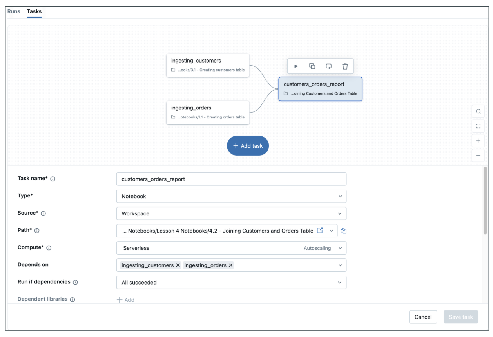

Task
Task
Task

Jeder Job besteht aus einem oder mehreren Tasks, den einzelnen Arbeitseinheiten, aus denen sich der Job zusammensetzt.

##### Zusätzliche Hinweise
Hier sind die beiden grundlegendsten Konzepte, die Sie verstehen müssen:

Ein Job ist die zentrale Ressource für die Planung, Koordination und Ausführung von Operationen wie Datenverarbeitung, ETL, Analytics und Machine-Learning-Workloads in der Databricks-Umgebung. Stellen Sie sich einen Job als Container vor, der Ihren gesamten Workflow enthält.

Ein Task ist eine einzelne Arbeitseinheit innerhalb eines Jobs, die einen bestimmten Workload wie ein Notebook, ein Skript, eine Abfrage und mehr ausführt. Tasks sind die einzelnen Bausteine, die die eigentliche Arbeit erledigen.

Die Beziehung ist hierarchisch: Jeder Job besteht aus einem oder mehreren Tasks, den einzelnen Arbeitseinheiten, aus denen sich der Job zusammensetzt. Die Abbildung zeigt dies deutlich – ein Job, der mehrere Tasks enthält.

### A2. Jobs und Tasks: Eine hierarchische Beziehung

**Jobs** bestehen aus einem oder mehreren **Tasks**

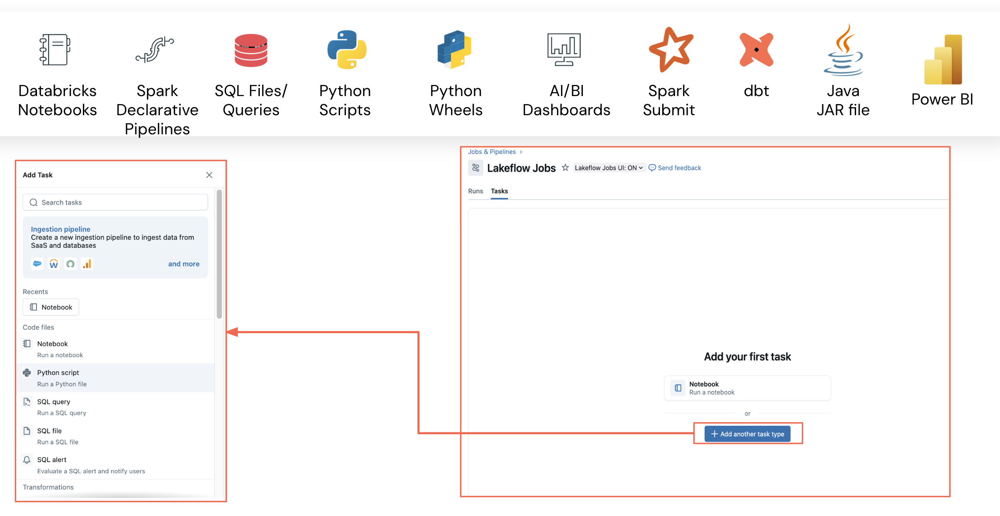

##### Zusätzliche Hinweise
Jobs bestehen aus einem oder mehreren Tasks, und es stehen viele verschiedene Task-Typen zur Verfügung. Sie können Databricks-Notebooks in jeder unterstützten Sprache verwenden, Python-Skripte, Python Wheels für paketierten Code, SQL-Dateien und -Abfragen für Datentransformationen, Spark Declarative Pipelines, dbt für Datentransformationen, Java-JAR-Dateien, Spark-Submit-Jobs für ältere Spark-Anwendungen, AI/BI-Dashboards zur Visualisierung und sogar eine Power-BI-Integration.

Diese Vielfalt stellt sicher, dass Sie praktisch jede Art von Workload innerhalb Ihres Jobs orchestrieren können.

### A3. Konfigurationsoptionen für Tasks

Mit **Jobs** können wir einen **bestimmten Task** konfigurieren

- Je nach Task stehen **unterschiedliche Optionen** zur Verfügung:  Pfad definieren
- Bibliotheken hinzufügen
- Parameter hinzufügen
- Benachrichtigungen aktivieren
- Alle Optionen sind spezifisch für den ausgewählten Task-Typ

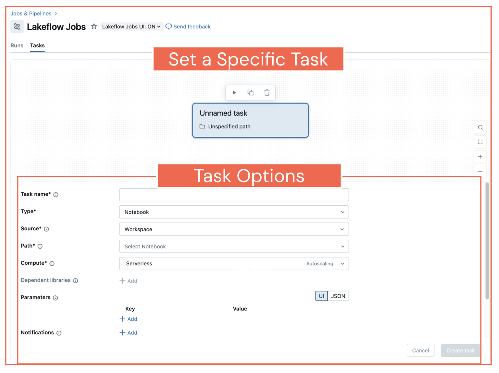

##### Zusätzliche Hinweise
Wenn Sie einen Job erstellen, können Sie für jeden einzelnen Task spezifische Konfigurationen festlegen. Welche Optionen verfügbar sind, hängt vom gewählten Task-Typ ab. Häufige Konfigurationsoptionen sind das Festlegen des Pfads zu Ihrem Code, das Hinzufügen von Bibliotheken, das Setzen von Parametern, das Aktivieren von Benachrichtigungen und das Konfigurieren von Retry-Richtlinien.

Mit diesen Konfigurationen können Sie jeden einzelnen Task entsprechend Ihren spezifischen Anforderungen besser orchestrieren.

### A4. Task-Typen: Notebook und SQL

Klicken Sie auf die Tabs, um zwischen den Task-Typen zu wechseln.

Notebook-Task
SQL-Task

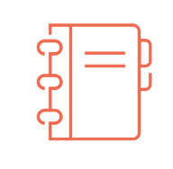
Optionen für Notebook-Tasks

Je nach ausgewähltem Task-Typ erhalten Sie spezifische Optionen.

**Beispiel**

- Quelle (Source)
- Pfad (Path)
- Compute-Optionen
- Und mehr

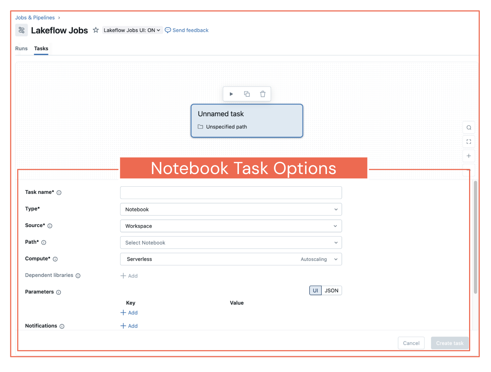

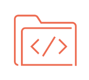
Optionen für SQL-Tasks

Je nach ausgewähltem Task-Typ erhalten Sie spezifische Optionen.

**Beispiel**

- Task-Name
- SQL-Abfrage
- SQL Warehouse

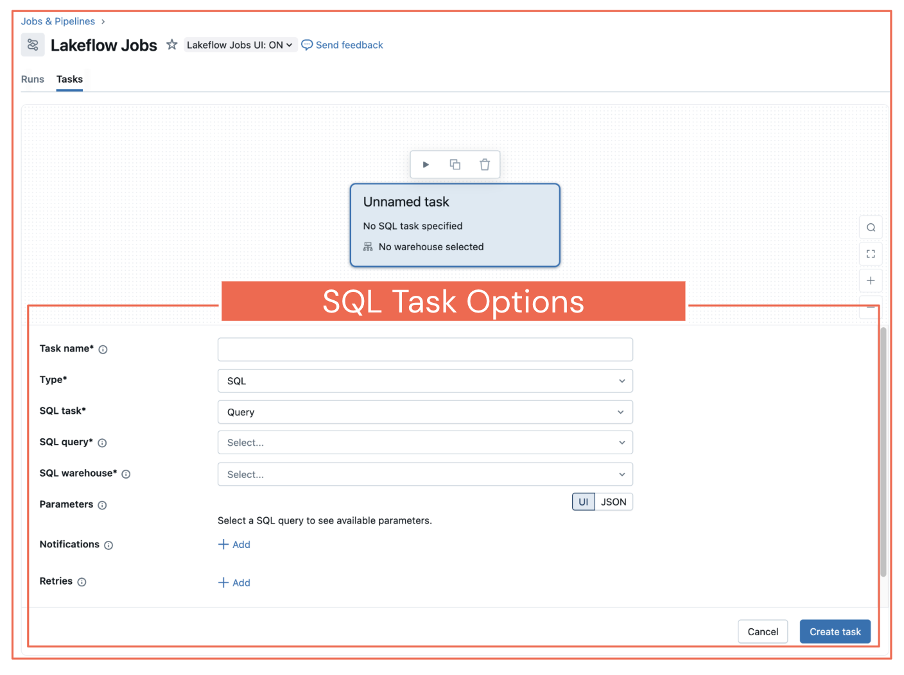

##### Zusätzliche Hinweise
**Optionen für Notebook-Tasks**:

Hier ein konkretes Beispiel für Notebook-Tasks. Wenn Sie den Task-Typ Notebook auswählen, erhalten Sie Optionen wie die Angabe des Quellpfads zu Ihrem Notebook, die Auswahl von Compute-Optionen (Cluster-Konfiguration) und viele weitere Einstellungen, die speziell für das Ausführen von Notebooks gelten.

Die Oberfläche passt sich an den gewählten Task-Typ an und bietet die jeweils relevanten Konfigurationsoptionen.

**Optionen für SQL-Tasks**:

Ähnlich erhalten Sie für SQL-Tasks andere Optionen. Sie können die Details des SQL-Tasks angeben, Ihre SQL-Abfrage schreiben oder referenzieren und das SQL Warehouse auswählen, das Ihre Abfrage ausführen soll.

Jeder Task-Typ bietet die spezifischen Konfigurationsoptionen, die für diese Art von Workload erforderlich sind.

### A5. Unterstützte Sprachen

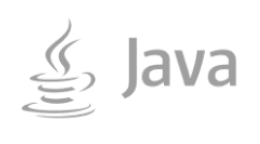

##### Zusätzliche Hinweise
Lakeflow Jobs unterstützt mehrere Programmiersprachen: Python, SQL, Scala, R und Java über JAR-Dateien. Diese breite Sprachunterstützung stellt sicher, dass Teams ihre bevorzugten Sprachen und vorhandenen Code-Assets nutzen können.

### A6. Job-Orchestrierung: Control Flow, Trigger und Compute

Klicken Sie auf jeden aufklappbaren Block, um mehr darüber zu erfahren.

**Jobs** bestehen aus einem oder mehreren **Tasks**

   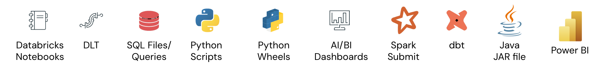

Zwischen **Tasks** können **Control Flows** eingerichtet werden

   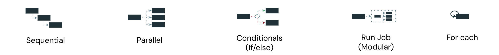

**Jobs** unterstützen verschiedene **Trigger**

   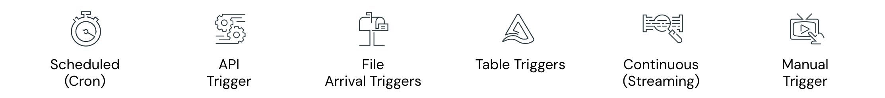

 Compute
 Die Compute-Schicht unterstützt all diese unterschiedlichen Orchestrierungsmuster.

##### Zusätzliche Hinweise
Jobs und Tasks haben wir bereits kennengelernt.

Diese Gesamtansicht zeigt, wie Tasks mit unterschiedlichen Control-Flow-Mustern verbunden werden können. Sie können sequenzielle Ausführung (einer nach dem anderen), parallele Ausführung (mehrere Tasks gleichzeitig), bedingte Ausführung mit If/else-Logik, Run-Job-Tasks für ein modulares Design und For-each-Schleifen für die iterative Verarbeitung umsetzen.

Zusätzlich unterstützen Jobs verschiedene Trigger-Typen: manuelle Trigger für die Ausführung bei Bedarf, zeitgesteuerte Trigger mit Cron-Ausdrücken, API-Trigger für die programmatische Ausführung, File-Arrival-Trigger für ereignisgesteuerte Verarbeitung, Table-Trigger für Datenänderungsereignisse und Continuous-Trigger für Streaming-Workloads.

Die Compute-Schicht unterstützt all diese unterschiedlichen Orchestrierungsmuster.

### A7. Compute-Optionen

Jobs können auf unterschiedlichem Compute ausgeführt werden.

Entwicklung, Ad-hoc-Analyse &

Exploration
Interactive Clusters
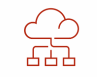

Interaktive bzw. All-Purpose-Cluster können von mehreren Benutzern gemeinsam genutzt werden.
Sie eignen sich am besten für Ad-hoc-Analysen, Datenexploration oder Entwicklung.
Interaktive Cluster sollten nicht in der Produktion eingesetzt werden, da sie nicht kosteneffizient sind.

Produktionsreif & operative

Anwendungsfälle
Job Clusters

Job-Cluster sind etwa 50 % günstiger, da sie beim Ende des Jobs beendet werden und so Ressourcenverbrauch und Kosten senken.
Allerdings unterliegen Job-Cluster den Startzeiten der Cloud-Anbieter.
Mit Databricks Jobs können Sie denselben Cluster für mehrere Tasks wiederverwenden und so ein besseres Preis-Leistungs-Verhältnis erzielen!

Einfach, schnell, zuverlässig, kosten-

effizient!
Serverless

Serverless Workflows sind ein vollständig verwalteter Dienst, der operativ einfacher und zuverlässiger ist.
Sie bieten schnellere Cluster und Auto-Scaling-Funktionen und damit eine bessere Benutzererfahrung zu geringeren Kosten.
Dank sofort verfügbarer Performance-Optimierungen bietet Serverless insgesamt niedrigere TCO.

Compute für SQL-Abfragen und BI,

standardmäßig Serverless
SQL Warehouse

Speziell für SQL-Abfragen, Dashboards und BI entwickelt; kann auch an ein Notebook angehängt werden.
Hohe Parallelität + Autoscaling über Intelligent Workload Management für gleichbleibend niedrige Latenz.
Auto-Start/Auto-Stop sowie anpassbare Clustergröße und maximale Clusteranzahl für Lastspitzen helfen, die Kosten zu kontrollieren.

##### Zusätzliche Hinweise
Jobs können auf verschiedenen Compute-Typen ausgeführt werden, und die Wahl des richtigen Computes ist sowohl für die Performance als auch für die Kosten entscheidend:

- Interactive Clusters können von mehreren Benutzern gemeinsam genutzt werden und eignen sich am besten für Ad-hoc-Analysen, Datenexploration oder Entwicklung. Sie sollten jedoch nicht in der Produktion eingesetzt werden, da sie nicht kosteneffizient sind.

- Job Clusters sind etwa 50 % günstiger, da sie beim Ende des Jobs beendet werden und so Ressourcenverbrauch und Kosten senken. Sie sind ideal für Produktions-Workloads, unterliegen aber den Startzeiten der Cloud-Anbieter. Mit Databricks Jobs können Sie denselben Cluster für mehrere Tasks wiederverwenden und so ein besseres Preis-Leistungs-Verhältnis erzielen.

- Serverless bietet einen vollständig verwalteten Dienst, der operativ einfacher und zuverlässiger ist. Er bietet schnellere Cluster und Auto-Scaling-Funktionen und damit eine bessere Benutzererfahrung zu geringeren Kosten. Dank sofort verfügbarer Performance-Optimierungen bietet Serverless insgesamt niedrigere TCO.

- SQL Warehouse ist speziell für SQL-Abfragen, Dashboards und BI entwickelt und standardmäßig serverless. Es bietet hohe Parallelität und Autoscaling über Intelligent Workload Management sowie Auto-Start/Auto-Stop und anpassbare Clustergrößen, um die Kosten zu kontrollieren.

### A8. Serverless Performance Mode

Klicken Sie auf die grün hervorgehobenen Felder, um mehr über den Serverless Performance Mode zu erfahren. 

   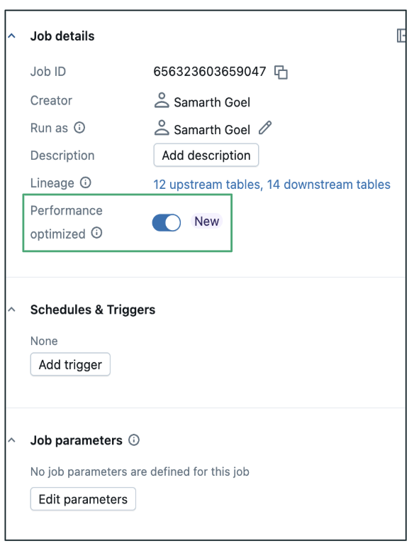

Verwenden Sie die Einstellung **Performance optimized** auf der Seite mit den Job-Details, um für Serverless-Tasks zwischen **geringeren Kosten** und **schnellerer Ausführung** zu wählen.

 Performance Optimized

(Aus)

- Der **Standardmodus** konzentriert sich auf **Kosteneffizienz**
- **Längere Startzeit** (typischerweise 4–6 Minuten)
- Am besten für **nicht dringende Workloads** mit flexiblem Zeitrahmen

 Performance Optimized

(An)

- **Ermöglicht** einen schnelleren Job-Start und eine schnellere Ausführung
- Ideal für **zeitkritische** Workloads
- **Gilt** nur für Tasks mit **Serverless**-Compute im Job

##### Zusätzliche Hinweise
Der Standardmodus konzentriert sich auf Kosteneffizienz mit längerer Startzeit (typischerweise 4–6 Minuten) und eignet sich daher am besten für nicht dringende Workloads mit flexiblem Zeitrahmen.

Der optimierte Modus ermöglicht einen schnelleren Job-Start und eine schnellere Ausführung und ist daher ideal für zeitkritische Workloads. Diese Einstellung gilt nur für Tasks mit Serverless-Compute in Ihrem Job.

### A9. Compute auswählen

Das Diagramm veranschaulicht ein wichtiges Prinzip: Ein Job kann einen oder mehrere Tasks enthalten, und jedem Task kann eine eigene Compute-Ressource zugewiesen werden. Tasks im selben Job können je nach Bedarf entweder dasselbe Compute teilen oder unterschiedliches Compute verwenden.

  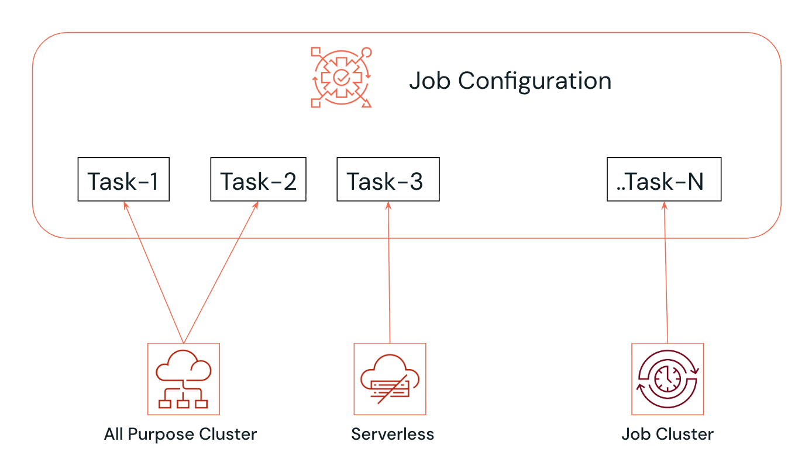

##### Zusätzliche Hinweise
Dieses Diagramm veranschaulicht ein wichtiges Prinzip: Ein Job kann einen oder mehrere Tasks enthalten, und jedem Task kann eine eigene Compute-Ressource zugewiesen werden. Tasks im selben Job können je nach Bedarf entweder dasselbe Compute teilen oder unterschiedliches Compute verwenden.

So könnte Task-1 auf einem All-Purpose-Cluster laufen, Task-2 auf Serverless, Task-3 auf einem Job-Cluster und so weiter. Diese Flexibilität ermöglicht es Ihnen, sowohl Performance als auch Kosten für jeden einzelnen Task zu optimieren.

