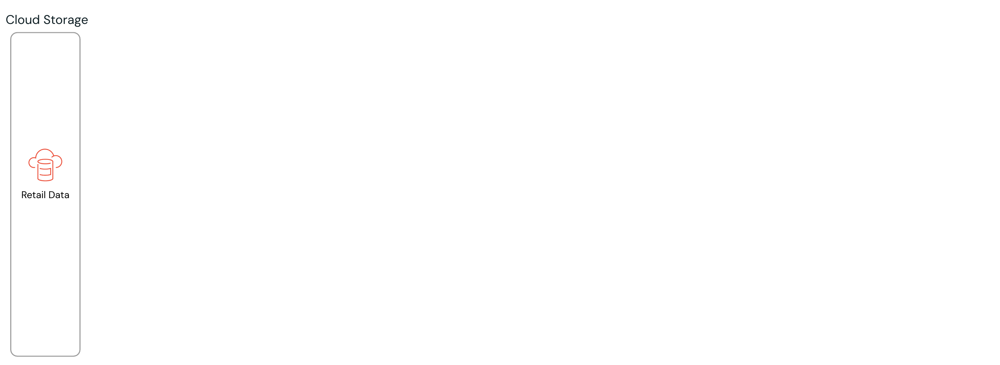
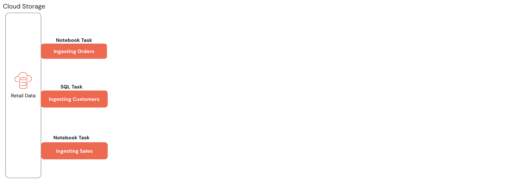
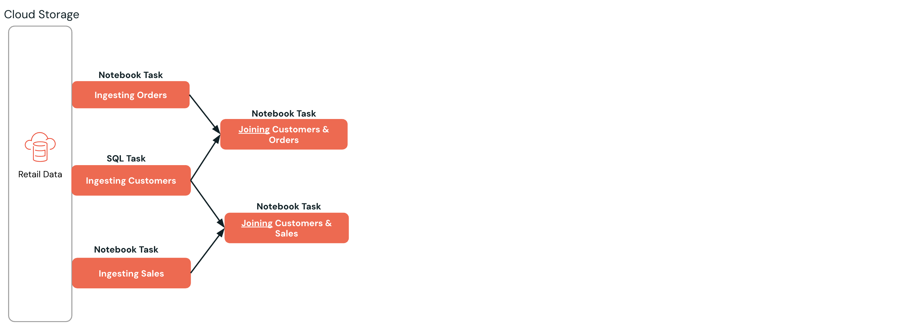
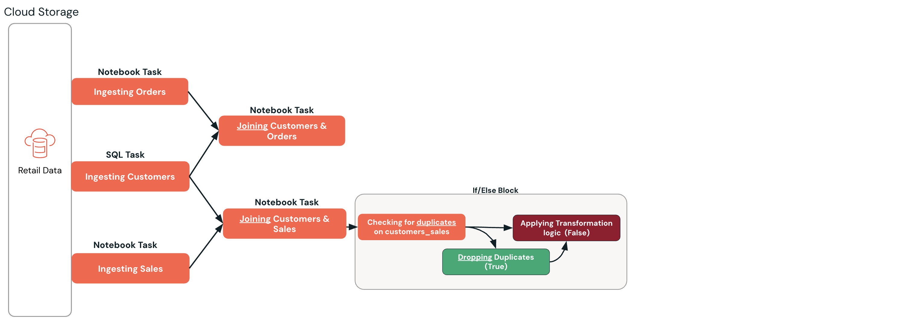
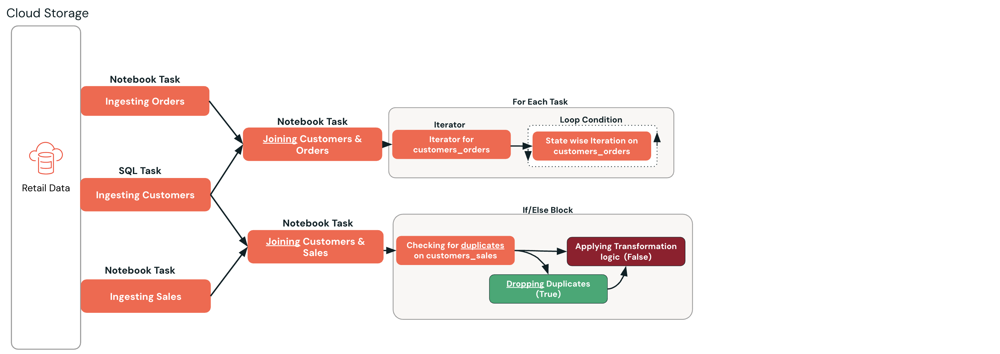
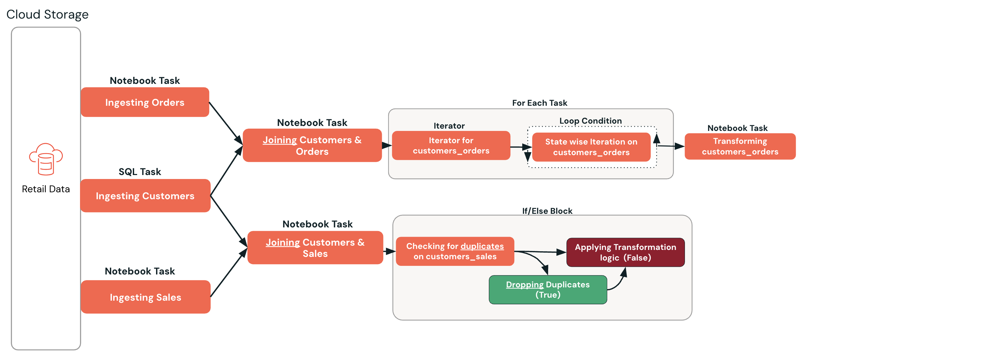
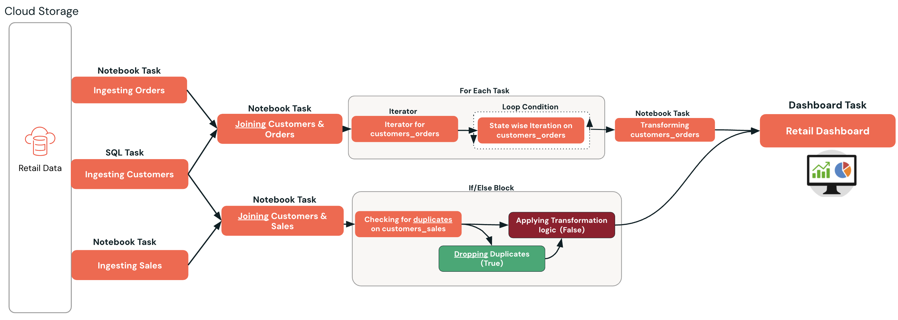

## A. Aufbau einer Pipeline zur Verarbeitung von Einzelhandelsdaten

Wir bauen eine Pipeline zur Verarbeitung von Einzelhandelsdaten, die alle Konzepte veranschaulicht, die wir lernen.

Klicken Sie auf jeden Schritt, um die Pipeline zur Verarbeitung von Einzelhandelsdaten aufzubauen.

Schritt 1:

Cloud-Speicher
Schritt 2:

Daten ingestieren
Schritt 3:

Daten verknüpfen (Join)
Schritt 4:

If/Else-Block
Schritt 5:

For-Each-Task
Schritt 6:

Daten transformieren
Schritt 7:

Dashboard erstellen

© 2026 Databricks, Inc. Alle Rechte vorbehalten. Apache, Apache Spark, Spark, das Spark-Logo, Apache Iceberg, Iceberg und das Apache-Iceberg-Logo sind Marken der [Apache Software Foundation](https://www.apache.org/).

[Datenschutzrichtlinie](https://databricks.com/privacy-policy) | [Nutzungsbedingungen](https://databricks.com/terms-of-use) | [Support](https://help.databricks.com/)
