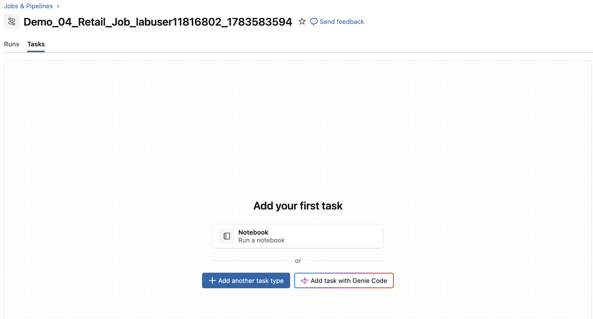
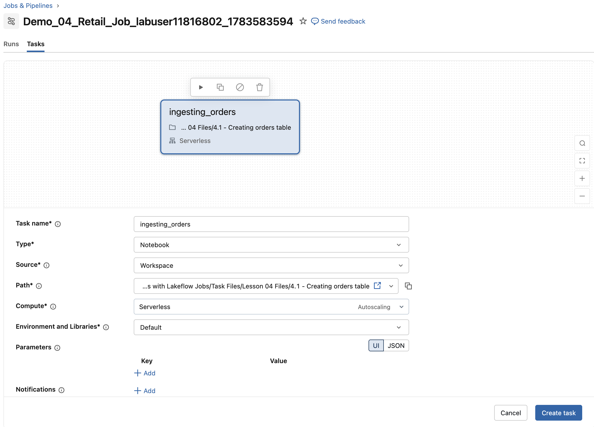
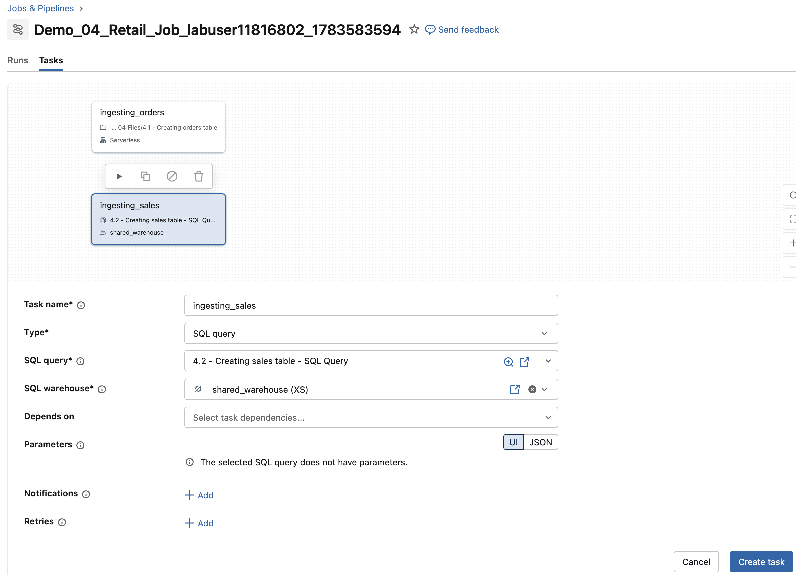

## D. Den Job erstellen

Führen Sie die folgenden Schritte aus, um einen Lakeflow Job mit zwei Tasks zu erstellen:

- Einem Notebook-Task  
- Einem SQL-Datei-Task

### D1. Ihre Job-Konfiguration generieren

1. Führen Sie die folgende Zelle aus, um die Werte auszugeben, die Sie in den nachfolgenden Schritten zur Konfiguration Ihres Jobs verwenden. Achten Sie darauf, den richtigen Job-Namen und die richtigen Dateien anzugeben.

**HINWEIS:** Das Objekt `DA.print_job_config` ist spezifisch für den Databricks-Academy-Kurs. Es gibt die Informationen aus, die Sie zum Erstellen des Jobs benötigen.

```python
DA.print_job_config(job_name_extension='Demo_04_Retail_Job', 
                    file_paths='/Task Files/Lesson 04 Files',
                    Files=[
                        '4.1 - Creating orders table'
                    ])
```

### D2. Den Job erstellen und benennen

Führen Sie die folgenden Schritte aus, um Ihren Job zu erstellen und zu benennen.

1. Klicken Sie in der Seitenleiste mit der rechten Maustaste auf die Schaltfläche **Jobs and Pipelines** und wählen Sie *Open Link in New Tab*.

2. Vergewissern Sie sich im neuen Tab, dass Sie sich im Tab **Jobs & Pipelines** befinden.

3. Klicken Sie auf die Schaltfläche **Create** und wählen Sie im Dropdown-Menü **Job**.

4. In der oberen linken Ecke des Bildschirms sehen Sie einen Standard-Job-Namen, der auf dem aktuellen Datum und der Uhrzeit basiert (zum Beispiel *New Job Jul 29, 2025, 11:46 AM*).

5. Ändern Sie den **Job Name** in den Namen, der in der vorherigen Zelle angegeben wurde (zum Beispiel: **Demo_01_Retail_Job_labuser123**).

6. Lassen Sie den Job geöffnet und fahren Sie mit den nächsten Schritten fort.

**HINWEIS:** Wenn Sie auf einen empfohlenen Task (wie **Notebook**) klicken, werden Sie auf eine andere Seite weitergeleitet als im folgenden Screenshot gezeigt.



### D3. Den Notebook-Task erstellen

Führen Sie die folgenden Schritte aus, um einen Notebook-Task hinzuzufügen.

1. In der Lakeflow-Jobs-UI sehen Sie möglicherweise einige Task-Vorschläge, z. B. **Notebook** oder **SQL File**.

2. Wählen Sie den Task-Typ **Notebook**.

3. Konfigurieren Sie den Task mit den folgenden Einstellungen:

| Einstellung     | Anweisungen |
|-----------------|--------------|
| **Task name**   | Geben Sie **ingesting_orders** ein |
| **Type**        | Wählen Sie **Notebook** |
| **Source**      | Wählen Sie **Workspace** |
| **Path**        | Verwenden Sie den Datei-Navigator, um **Notebook #1** zu suchen und auszuwählen:; **./Task Files/Lesson 04 Files/4.1 - Creating orders table** |
| **Compute**     | Wählen Sie im Dropdown-Menü einen **Serverless**-Cluster.; (Wir verwenden in diesem Kurs für alle Jobs Serverless-Cluster. Außerhalb dieses Kurses können Sie bei Bedarf einen anderen Cluster angeben.) ; ; **HINWEIS**: Wenn Sie Ihren All-Purpose-Cluster ausgewählt haben, erhalten Sie möglicherweise eine Warnung, dass dies als All-Purpose-Compute abgerechnet wird. Produktions-Jobs sollten immer auf neuen Job-Clustern geplant werden, die für den Workload passend dimensioniert sind, da diese zu einem deutlich niedrigeren Tarif abgerechnet werden.
 |
| **Create task** | Klicken Sie auf **Create task** |

4. Lassen Sie die Lakeflow-Jobs-UI geöffnet; im nächsten Schritt fügen Sie einen weiteren Task hinzu.
##### Für eine bessere Performance aktivieren Sie bitte den Performance Optimized Mode in den Job Details. Andernfalls kann es 6 bis 8 Minuten dauern, bis die Ausführung startet.

#### Einrichtung des Notebook-Tasks



### D4. Den SQL-Query-Task erstellen

Führen Sie diese Schritte aus, um eine SQL-Datei als Task hinzuzufügen:

1. Klicken Sie in der Lakeflow-Jobs-UI auf **Add task**.

2. Wählen Sie den Task-Typ **SQL query**.

3. Konfigurieren Sie den Task mit den folgenden Einstellungen:

| Einstellung       | Anweisungen |
|-------------------|--------------|
| **Task name**     | Geben Sie **ingesting_sales** ein |
| **Type**          | Wählen Sie **SQL** |
| **SQL task**      | Wählen Sie **Query** |
| **SQL query**     | Wählen Sie im Dropdown die SQL-Datei:; **4.2 - Creating sales table - SQL Query** |
| **SQL warehouse** | Wählen Sie im Dropdown-Menü Ihr SQL Warehouse |
| **Depends on**    | Hier sollte kein Task ausgewählt sein.; (Heben Sie die Auswahl von **ingesting_orders** auf, falls es ausgewählt ist.) |
| **Create task**   | Klicken Sie auf **Create task** |

#### Einrichtung des SQL-Tasks



### D5. Die Job-Details erkunden und ändern

1. Navigieren Sie zur Seite Job Details. Im rechten Bereich finden Sie die folgenden Details auf Job-Ebene:

- **Job Details:** Informationen wie Job-ID, Ersteller und mehr.
- **Schedulers and Triggers:** Verschiedene Planungsoptionen und Trigger für den Job anzeigen und konfigurieren.
- **Job Parameters:** Optionen zum Deklarieren von Parametern, die für den gesamten Job gelten.

#### Für eine bessere Performance aktivieren Sie bitte den Performance Optimized Mode in den Job Details.

##### Performance Optimized Mode
- Ermöglicht einen schnellen Compute-Start und eine höhere Ausführungsgeschwindigkeit.

##### Standard Mode
- Das Deaktivieren der Performance-Optimierung führt zu Startzeiten ähnlich wie bei der Classic-Infrastruktur und kann Ihre Kosten senken.
