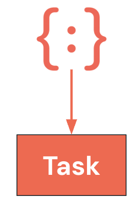
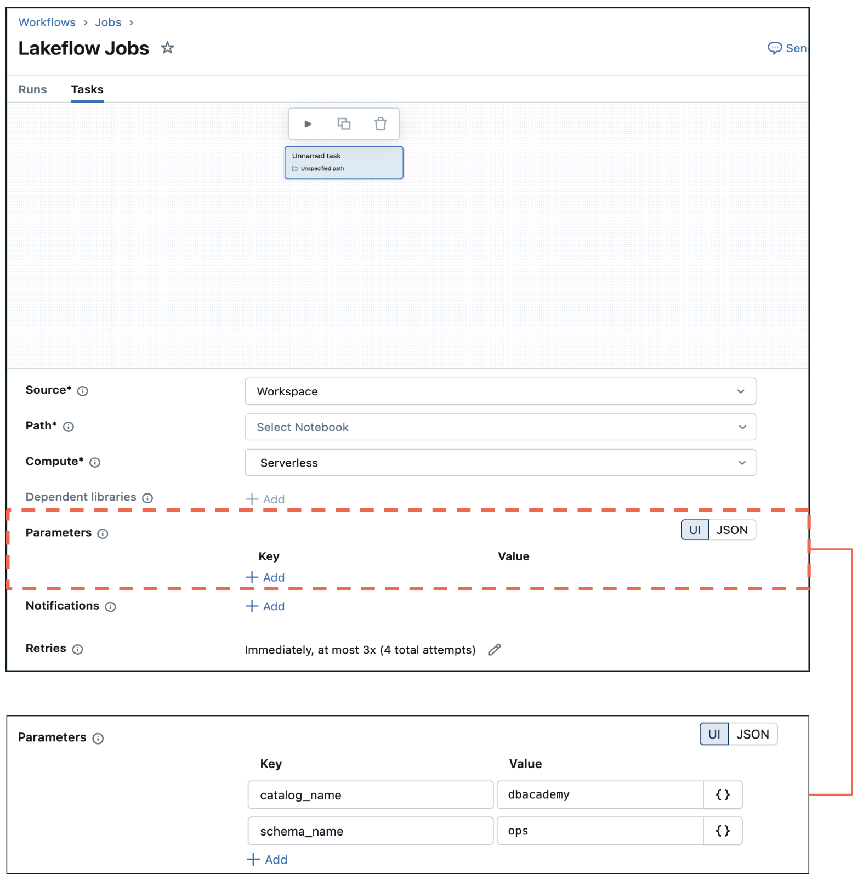
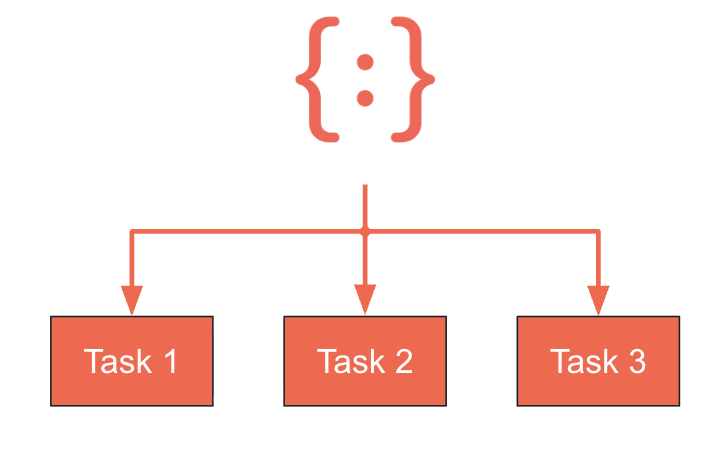
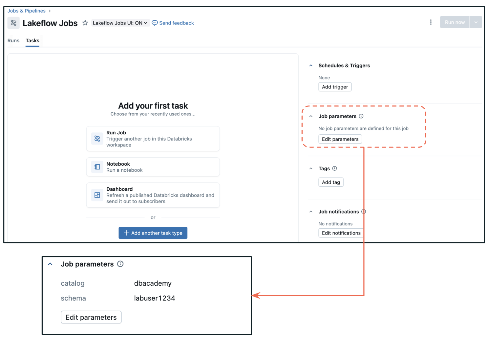
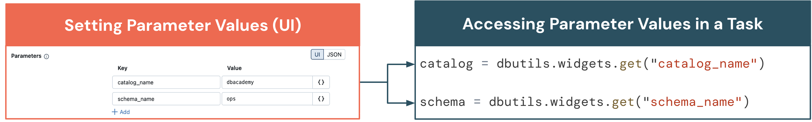
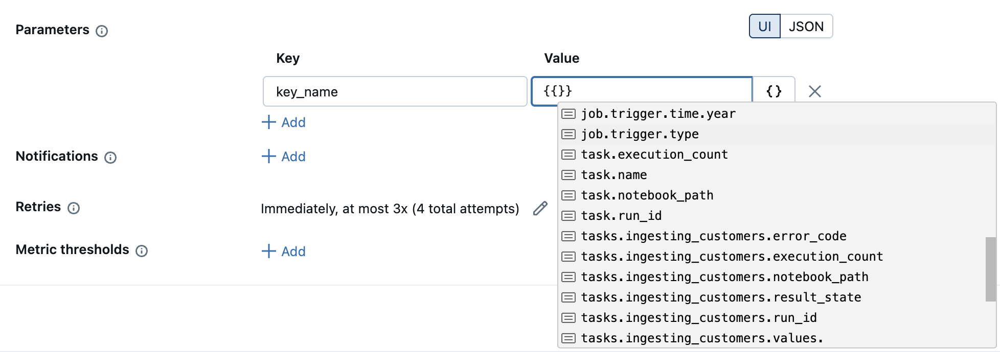
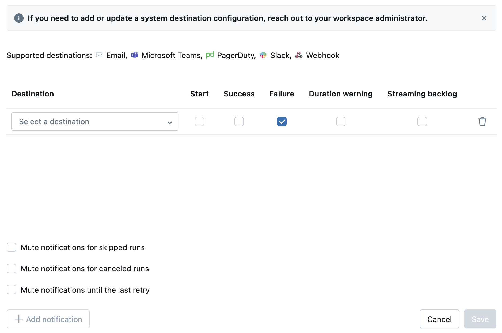
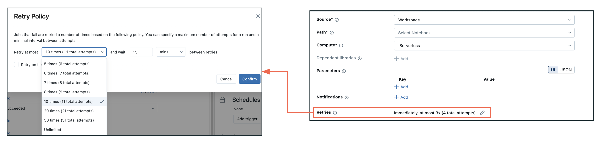

## A. Gängige Konfigurationsoptionen für Tasks

### A1.  Überblick – Hauptkategorien

Es gibt drei Hauptkategorien von Konfigurationsoptionen für Tasks.


### Parameter & Dynamic Value References


### Benachrichtigungen (Notification Alerts)


### Wiederholungen (Retries)

##### Zusätzliche Hinweise
Ich stelle Ihnen die drei Hauptkategorien von Konfigurationsoptionen für Tasks vor:

- Parameter & Dynamic Value References sind die Grundlage flexibler Workflows. Sie können auf Task- und auf Job-Ebene gesetzt werden. Damit lassen sich wiederverwendbare, anpassbare Tasks erstellen, die sich je nach Eingabewerten oder Laufzeitkontext unterschiedlich verhalten.
- Retries sind Ihre erste Verteidigungslinie gegen vorübergehende Fehler. Sie können das Wiederholungsverhalten sowohl auf Job- als auch auf Task-Ebene konfigurieren und so je nach Kritikalität und erwarteten Fehlermustern der verschiedenen Teile Ihres Workflows unterschiedliche Retry-Strategien verwenden.
- Notification Alerts halten Ihr Team auf dem Laufenden und ermöglichen eine schnelle Reaktion auf Probleme. Wie Retries können sie sowohl auf Job- als auch auf Task-Ebene konfiguriert werden, sodass Sie genau steuern können, wer über welche Ereignisse benachrichtigt wird.

### A2. Parameter im Überblick – Typen

Klicken Sie auf jeden Tab, um mehr über die Parameter zu erfahren.

  Task Parameters
  Job Parameters

### Task Parameters


Ein auf Task-Ebene definiertes Schlüssel-Wert-Paar.

- Task Parameters sind Schlüssel-Wert-Paare, mit denen Sie Werte an Tasks übergeben können.
- Sie unterstützen fortgeschrittene Orchestrierung wie:  bedingte Ausführung
- Schleifen
- Weitergabe von Kontext zwischen Tasks



### Job Parameters


Ein auf Job-Ebene definiertes Schlüssel-Wert-Paar, das an alle Tasks weitergegeben wird.
Job Parameters sind auf Job-Ebene definierte Schlüssel-Wert-Paare, die Standardwerte für den gesamten Workflow bereitstellen.

- Werden automatisch auf alle Tasks im Job angewendet.
- Überschreiben Task Parameters mit demselben Schlüsselnamen.
- Können beim Auslösen von Job-Runs zur Laufzeit überschrieben werden.



##### Zusätzliche Hinweise
Das Verständnis der Parameter-Hierarchie ist für ein effektives Job-Design entscheidend:

- Task Parameters sind Schlüssel-Wert-Paare oder JSON-Arrays, die auf der Ebene des einzelnen Tasks definiert werden. Sie sind spezifisch für jeden Task und ermöglichen eine feingranulare Steuerung des Task-Verhaltens.
- Job Parameters werden auf Job-Ebene definiert und automatisch an alle Tasks innerhalb dieses Jobs weitergegeben. So entsteht ein leistungsfähiges Vererbungsmodell, bei dem Sie gemeinsame Standardwerte festlegen und dennoch taskspezifische Überschreibungen zulassen können.

Die Vorrangregel ist wichtig: Job Parameters überschreiben immer Task Parameters, wenn derselbe Schlüssel existiert. Dieses Designmuster ermöglicht es, sinnvolle Standardwerte auf Job-Ebene festzulegen und gleichzeitig die Flexibilität zu behalten, einzelne Tasks bei Bedarf anzupassen.

Task Parameters sind weit mehr als einfache Konfigurationswerte – sie sind die Bausteine intelligenter Workflows. Diese Schlüssel-Wert-Paare ermöglichen anspruchsvolle Orchestrierungsmuster:

- Bedingte Ausführung: Verwenden Sie Parameter, um zu steuern, welche Zweige Ihres Workflows basierend auf Datenbedingungen, Umgebungseinstellungen oder Geschäftsregeln ausgeführt werden.
- Schleifen: Parameter können Iterationszahlen steuern, Arrays für For-each-Schleifen definieren und komplexe Verarbeitungsszenarien verwalten.
- Weitergabe von Kontext: Teilen Sie Informationen zwischen Tasks, indem Sie Parameter setzen, die nachgelagerte Tasks lesen können – so entsteht ein Datenfluss neben Ihrem Kontrollfluss.

Die eigentliche Stärke entsteht durch die Kombination von Parametern mit Dynamic Value References, wodurch sich Ihre Workflows intelligent an sich ändernde Bedingungen und Dateneigenschaften anpassen.

Job Parameters bilden die Grundlage für konsistente, wartbare Workflows. Es sind Schlüssel-Wert-Paare, die Standardwerte für Ihren gesamten Workflow bereitstellen und so Konsistenz über alle Tasks hinweg sicherstellen.

Das macht sie so leistungsfähig:

- Automatische Anwendung: Jeder Task im Job erhält diese Parameter automatisch, sodass gemeinsame Einstellungen nicht manuell für mehrere Tasks konfiguriert werden müssen.
- Überschreibungsmöglichkeit: Tasks können weiterhin eigene Parameter mit denselben Schlüsselnamen definieren, aber Job Parameters haben Vorrang und ermöglichen Ihnen so eine zentrale Steuerung.
- Flexibilität zur Laufzeit: Sie können Job Parameters beim Auslösen von Job-Runs überschreiben, sodass sich dieselbe Job-Definition in unterschiedlichen Szenarien unterschiedlich verhalten kann – etwa für verschiedene Umgebungen, Datumsbereiche oder Verarbeitungsmodi.

### A3. Parameter setzen und abrufen (UI)

### Parameterwerte setzen (UI)

**Job Parameters setzen:**

- Gehen Sie in Ihrem Job zum Abschnitt Parameters und fügen Sie Schlüssel-Wert-Paare auf Job-Ebene hinzu.

**Task Parameters setzen:**

- Gehen Sie zum jeweiligen Task im Job.
- Öffnen Sie die Parameter in der Task-Konfiguration (neben Task-Name, Typ und Pfad).
- Fügen Sie die Schlüssel-Wert-Paare hinzu.

### Parameterwerte in einem Task abrufen

- Rufen Sie in Notebook-Tasks sowohl Task- als auch Job-Parameter mit **dbutils.widgets.get** ab.
- Die Abrufmethoden unterscheiden sich je nach Task-Typ, z. B. Notebook, SQL oder Python Wheel.



##### Zusätzliche Hinweise
Sehen wir uns die praktische Umsetzung von Parametern an:

- Job Parameters setzen: Navigieren Sie zum Abschnitt Parameters Ihres Jobs und fügen Sie Schlüssel-Wert-Paare auf Job-Ebene hinzu. Diese stehen automatisch allen Tasks zur Verfügung. Typische Beispiele sind Katalognamen, Schemanamen, Umgebungseinstellungen und Verarbeitungsdaten.
- Task Parameters setzen: Fügen Sie in der Konfiguration jedes Tasks (neben den Einstellungen für Task-Name, Typ und Pfad) taskspezifische Schlüssel-Wert-Paare hinzu. Diese eignen sich perfekt für taskspezifische Pfade, Verarbeitungsoptionen oder Überschreibungswerte.
- Abruf in Notebook-Tasks: Verwenden Sie `dbutils.widgets.get("parameter_name")`, um sowohl auf Job- als auch auf Task-Parameter zuzugreifen. Das System behandelt den Vorrang automatisch – wenn sowohl ein Job- als auch ein Task-Parameter mit demselben Schlüssel existieren, erhalten Sie den Wert des Job-Parameters
- Sprachspezifischer Abruf: Denken Sie daran, dass die Methoden zum Abrufen von Parametern je nach Task-Typ variieren. SQL-Tasks greifen anders auf Parameter zu als Python-Wheel- oder JAR-Tasks. Prüfen Sie immer die Dokumentation für Ihren jeweiligen Task-Typ.

### A4. Task Parameters dynamisch setzen und abrufen

### Task Values dynamisch per Code setzen

```
dbutils.jobs.taskValues.set(
key = "catalog_name",
value = "dbacademy"
)
```

### Auf einen Parameter aus einem anderen Task zugreifen

```
dbutils.jobs.taskValues.get(
taskKey = "task-name",
key = "catalog_name"
)
```

### Task Values sind dynamische Schlüssel-Wert-Paare, die Tasks während der Workflow-Ausführung erstellen und teilen.

### Sie referenzieren bestimmte Parameterwerte vorgelagerter Tasks in nachgelagerten Tasks.</> ##### FÜR ZUSÄTZLICHE HINWEISE AUFKLAPPEN Task Values sind ein fortgeschritteneres Muster als Parameter – sie werden zur Laufzeit berechnet und ermöglichen eine dynamische Kommunikation zwischen Tasks: - Task Values setzen: Verwenden Sie dbutils.jobs.taskValues.set(key="computed_result", value="some_calculated_value"), um Ergebnisse zu speichern, die andere Tasks benötigen. Dazu können Datensatzanzahlen, Verarbeitungsstatus, Dateipfade oder beliebige berechnete Informationen gehören. - Task Values abrufen: Verwenden Sie dbutils.jobs.taskValues.get(taskKey="upstream-task-name", key="computed_result"), um auf Werte bestimmter vorgelagerter Tasks zuzugreifen. So entstehen explizite Abhängigkeiten zwischen Tasks auf Basis von Daten und nicht nur der Ausführungsreihenfolge. - Anwendungsfälle: Task Values eignen sich perfekt zum Teilen berechneter Ergebnisse wie Datensatzanzahlen für Datenqualitätsprüfungen, Dateipfaden für dynamisch generierte Ausgaben, Verarbeitungsstatistiken für das Monitoring oder Entscheidungskriterien für bedingte Logik. - Ausführungskontext: Im Gegensatz zu Parametern, die vor der Ausführung gesetzt werden, entstehen Task Values während der Ausführung und sind daher ideal für Entscheidungen, die von Verarbeitungsergebnissen abhängen. ### A5. Dynamic Value References Dynamic Value References

Dynamic Value References ermöglichen es, zur Laufzeit auf Werte aus dem Job- und Task-Kontext zu verweisen
(z. B. Task-Ausgaben, Parameter, Retask Values, registrierte Task Values, Run-Metadaten).

### {{ }}-Notation

Diese Referenzen verwenden die `{{ }}`-Notation und ermöglichen es Workflows, sich an unterschiedliche Ausführungen anzupassen.

### Häufige Beispiele

| Referenz | Verwendung |
| --- | --- |
| `{{job.start_time.day}}` | Zugriff auf den Tag |
| `{{task.name}}` | Zugriff auf den Task-Namen |



##### Zusätzliche Hinweise
Dynamic Value References mit der `{{ }}`-Notation eröffnen leistungsfähige Laufzeitfunktionen, die Workflows wirklich anpassungsfähig machen:

Referenzen auf den Job-Kontext:

- `{{job.start_time.day}}` – Zugriff auf den Ausführungszeitpunkt für datumsbasierte Verarbeitung
- `{{job.run_id}}` – Eindeutige Kennung für Nachverfolgung und Logging
- `{{job.parameters.environment}}` – Dynamischer Zugriff auf Parameter auf Job-Ebene

Referenzen auf den Task-Kontext:

- `{{task.name}}` – Nützlich für Logging und dynamische Pfadgenerierung
- `{{task.retry_count}}` – Wiederholungsversuche für das Debugging nachverfolgen

Kommunikation zwischen Tasks:

- `{{tasks.data-validation.values.record_count}}` – Zugriff auf berechnete Ergebnisse vorgelagerter Tasks
- `{{tasks.file-processor.values.output_path}}` – Von anderen Tasks generierte dynamische Pfade verwenden

Fortgeschrittene Muster: 

- Diese Referenzen ermöglichen Workflows, die sich an unterschiedliche Ausführungsumgebungen anpassen, variierende Datenmengen verarbeiten und auf Basis vorgelagerter Ergebnisse intelligente Entscheidungen treffen.

### A6. Benachrichtigungen (Notification Alerts)

  
  Benachrichtigungskonfigurationen

Benachrichtigungen auf Job-Ebene

- Eine Benachrichtigung wird nach **erfolgreichem Abschluss des Jobs** gesendet
- Diese Einstellung kann im Abschnitt Job Details (rechter Bereich) angepasst werden.

Benachrichtigungen auf Task-Ebene

- Eine Benachrichtigung wird gesendet, wenn **der Task erfolgreich abgeschlossen wurde**
- Diese Benachrichtigungseinstellung kann auf Task-Ebene angepasst werden.

##### Zusätzliche Hinweise
Benachrichtigungen sind ein zentraler Bestandteil operativer Exzellenz, und das Verständnis der Konfigurationsebenen hilft Ihnen, effektive Alerting-Strategien zu entwickeln:

- Benachrichtigungen auf Job-Ebene: Konfigurieren Sie diese im rechten Bereich des Abschnitts Job Details. Job-Benachrichtigungen werden gesendet, nachdem der gesamte Job erfolgreich abgeschlossen wurde. Das ist ideal für Stakeholder, die wissen müssen, wann vollständige Workflows fertig sind – etwa Fachanwender, die auf tägliche Reports warten, oder nachgelagerte Systeme, die von den Ausgaben Ihres Jobs abhängen.
- Benachrichtigungen auf Task-Ebene: Jeder Task kann eine eigene Benachrichtigungskonfiguration haben, was granulare Alerting-Strategien ermöglicht. Das ist wichtig, wenn verschiedene Tasks unterschiedliche Stakeholder haben oder bestimmte Tasks kritischer sind als andere. Beispielsweise möchten Sie bei fehlgeschlagener Datenvalidierung sofort benachrichtigt werden, bei routinemäßigen Aufräum-Tasks aber nur zusammenfassende Benachrichtigungen erhalten.
- Strategische Überlegungen: Gestalten Sie Ihre Benachrichtigungsstrategie nach operativen Anforderungen, nicht nach technischer Bequemlichkeit. Überlegen Sie, wer was wissen muss, wann er es wissen muss und welche Maßnahmen er aufgrund der Benachrichtigung ergreifen kann.

### A7. Benachrichtigungen – Effektive Benachrichtigungsstrategien entwerfen

**Mehrere unterstützte Ziele**
E-Mail, Teams, PagerDuty, Slack und Webhook

**Jeder Task in einem Job**
kann unterschiedlich für das Senden von Benachrichtigungen konfiguriert werden

**Jobs lösen Benachrichtigungen aus,**
wenn der Task startet, abgeschlossen wird oder fehlschlägt



**Verspätete Jobs**
Diese Benachrichtigungen können auch bei verspäteten Jobs ausgelöst werden:

- Für Warnungen bei Überschreiten eines Dauer-Schwellenwerts/Timeout-Alerts
- Streaming-Backlog (Problem beim Abrufen von Streaming-Daten)

**Webhook**
ermöglicht eine individuelle Integration mit API-Diensten von Drittanbietern

##### Zusätzliche Hinweise
Moderne Produktionsumgebungen erfordern ausgefeilte Benachrichtigungsstrategien:

- Mehrere Ziele: Die Unterstützung für E-Mail, Microsoft Teams, PagerDuty, Slack und Webhooks bedeutet, dass Sie Ihre vorhandenen operativen Tools und Kommunikationswege integrieren können. Verschiedene Teams bevorzugen möglicherweise unterschiedliche Kanäle – Entwickler möchten vielleicht Slack-Benachrichtigungen, während Operations-Teams die PagerDuty-Integration bevorzugen.
- Anpassung pro Task: Jeder Task in einem Job kann eine völlig andere Benachrichtigungskonfiguration haben. Ihre Ingestion-Tasks könnten Alerts an das Data-Engineering-Team senden, während Ihre Reporting-Tasks Fach-Stakeholder benachrichtigen.
- Erweiterte Auslösebedingungen: Über einfachen Erfolg/Fehlschlag hinaus können Sie Benachrichtigungen konfigurieren für:
- Verspätete Jobs: Warnungen bei Überschreiten eines Dauer-Schwellenwerts und Timeout-Alerts helfen, Performance-Einbußen frühzeitig zu erkennen
- Streaming-Backlog: Entscheidend für Streaming-Workloads, bei denen ein Rückstand zu größeren Problemen eskalieren kann
- Benutzerdefinierte Bedingungen: Webhook-Integrationen ermöglichen komplexe individuelle Logik für Benachrichtigungsentscheidungen
- Lebenszyklus-Benachrichtigungen: Jobs können Benachrichtigungen auslösen, wenn Tasks starten (nützlich bei lang laufenden Prozessen), erfolgreich abgeschlossen werden (Bestätigung des Abschlusses) oder fehlschlagen (sofortige Reaktion erforderlich).

### A8. Retry-Richtlinie

Eine Richtlinie, die festlegt, wann und wie oft fehlgeschlagene Runs **wiederholt** werden



##### Zusätzliche Hinweise
Eine gut durchdachte Retry-Richtlinie ist für robuste Workflows unerlässlich. Die Richtlinie bestimmt nicht nur, wie oft wiederholt wird, sondern auch unter welchen Bedingungen und mit welchem zeitlichen Muster.

Berücksichtigen Sie Faktoren wie:
- Fehlertyp: Vorübergehende Netzwerkprobleme rechtfertigen möglicherweise sofortige Wiederholungen, Datenqualitätsprobleme hingegen nicht
- Auswirkung auf Ressourcen: Zu aggressives Wiederholen ressourcenintensiver Tasks kann zu Ressourcenkonflikten im Cluster führen
- Nachgelagerte Abhängigkeiten: Fehlgeschlagene Tasks können andere Workflows beeinträchtigen, sodass das Timing der Wiederholungen entscheidend ist
- Geschäftliche SLAs: Manche Prozesse haben strenge Zeitvorgaben, die die Wiederholungsfenster begrenzen

