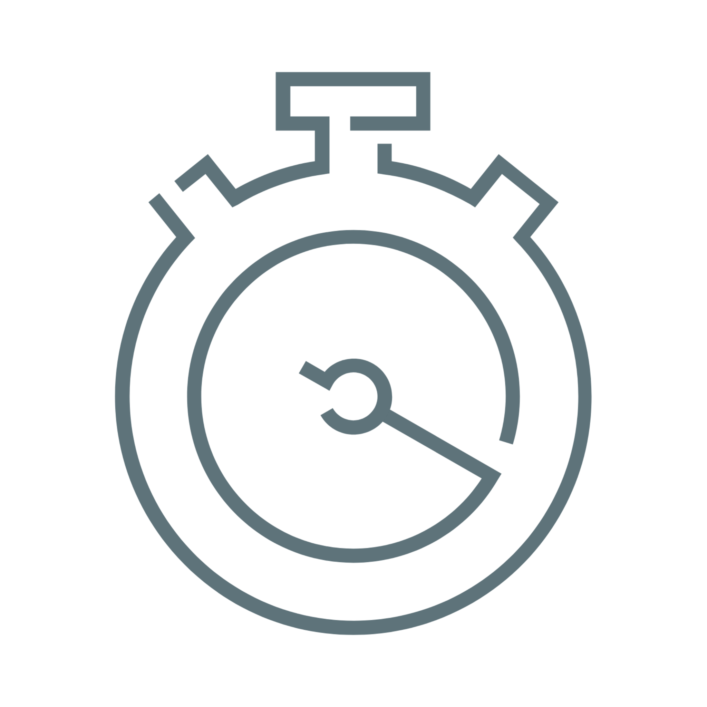
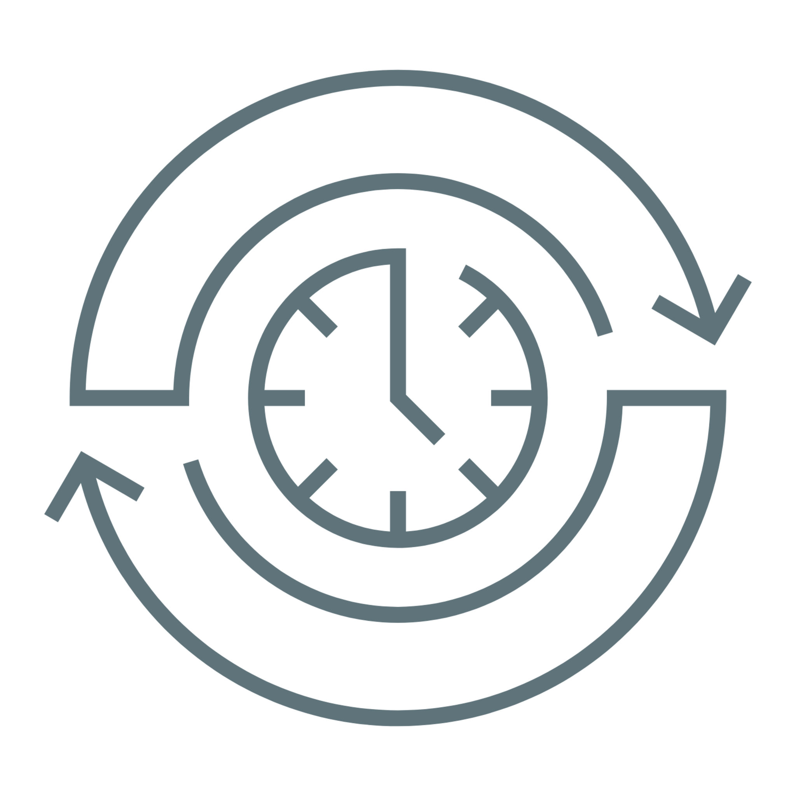
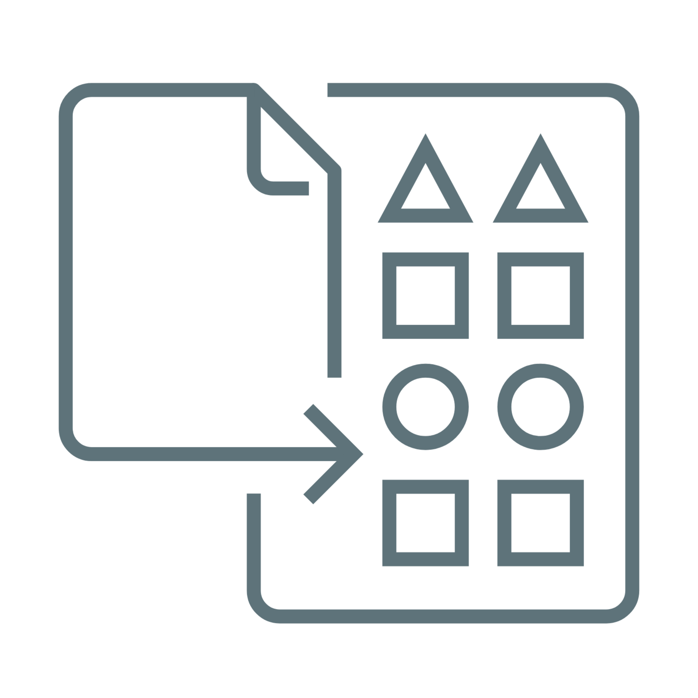
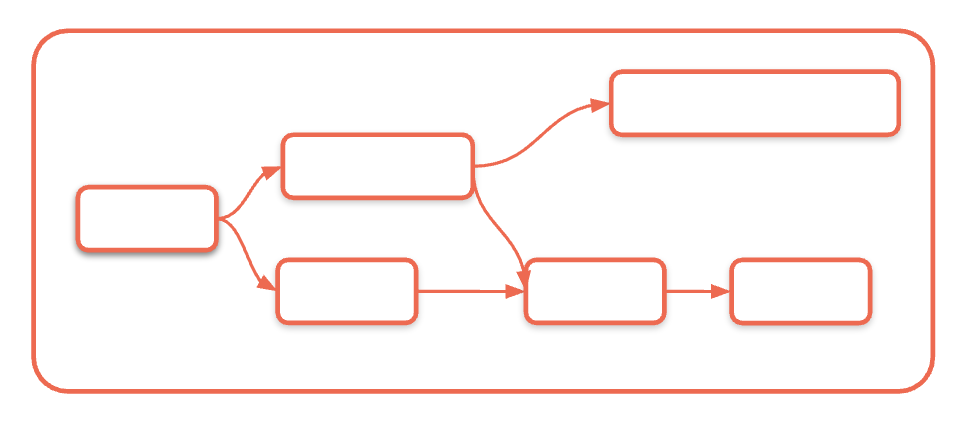
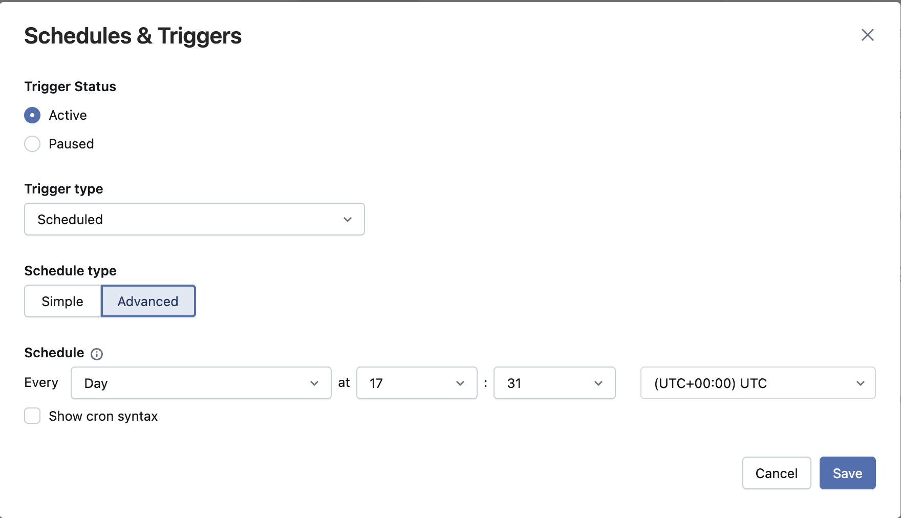
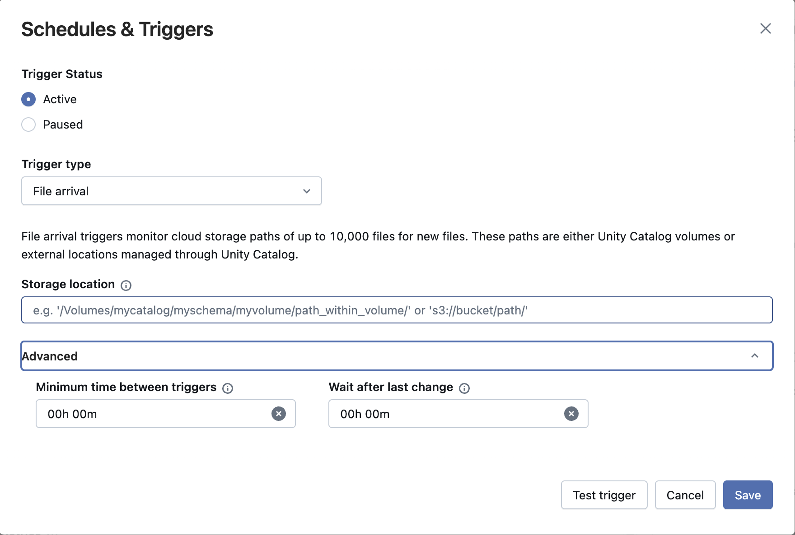
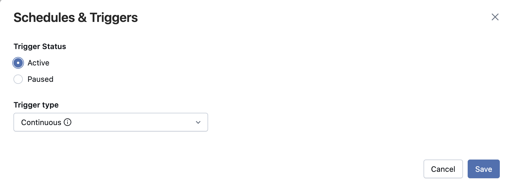
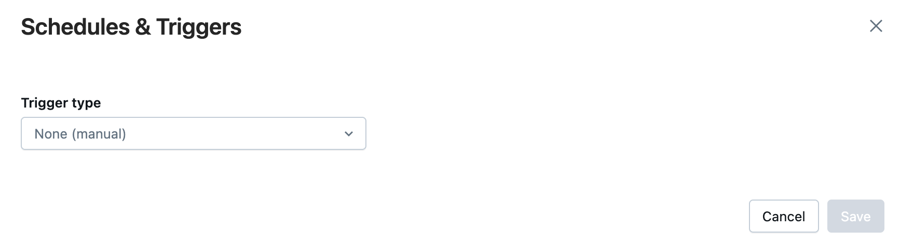
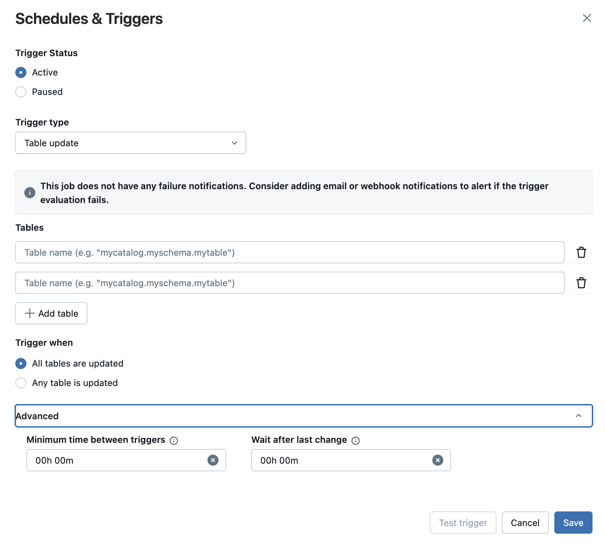

## B. Job-Zeitpläne und Trigger – Überblick

Gängige Trigger-Typen

Scheduled

Continuous

File Arrival

Manual

Table Update

### Trigger

Ein **Trigger** ist eine Regel, die einen Job-Run automatisch auf Basis einer **bestimmten Bedingung** oder eines **Zeitplans** startet.
**Gängige** Trigger-Typen sind:

- Zeitbasierte Zeitpläne
- Kontinuierliche (dauerhaft laufende) Ausführung
- Datei-Eingangsereignisse (File Arrival)
- Manueller Trigger
- Table Update

Trigger **ermöglichen Automatisierung**, sodass Jobs ohne manuelles Eingreifen laufen können.

##### Zusätzliche Hinweise
Ein Trigger ist im Grunde eine Regel-Engine, die die Job-Ausführung automatisch auf Basis bestimmter Bedingungen oder Zeitpläne startet. Dabei geht es nicht nur um Bequemlichkeit – es geht darum, zuverlässige, reaktionsfähige Datensysteme zu bauen, die autonom arbeiten können.
**Trigger-Kategorien:**

- **Zeitbasierte Zeitpläne:** Klassische Planung im Cron-Stil für vorhersehbare, wiederkehrende Workloads
- **Kontinuierliche Ausführung:** Dauerhafte Verarbeitung für Streaming-Szenarien
- **Datei-Eingangsereignisse:** Ereignisgesteuerte Verarbeitung, die sofort auf neue Daten reagiert
- **Manuelle Trigger:** Ausführung bei Bedarf für Entwicklung, Tests und Ad-hoc-Analysen

**Vorteile der Automatisierung:** Trigger beseitigen manuelle Eingriffspunkte, die Verzögerungen, Fehler oder verpasste Ausführungen verursachen können. Sie ermöglichen einen 24/7-Betrieb und stellen eine konsistente Ausführung unabhängig von der Verfügbarkeit des Teams sicher.
**Überlegungen zur Zuverlässigkeit:** Jeder Trigger-Typ hat unterschiedliche Zuverlässigkeitsmerkmale und Fehlermodi. Wenn Sie diese verstehen, können Sie für jeden Anwendungsfall den richtigen Trigger wählen.
Wenn Sie beispielsweise einen Job täglich in festen Intervallen ausführen möchten, ist ein Scheduled Trigger die beste Wahl. Wenn Ihr Job beim Eintreffen einer Datei laufen soll, ist ein File Trigger am besten geeignet.

### B1. Trigger-Typen

##### Klicken Sie auf die einzelnen Trigger-Typen, um mehr darüber zu erfahren.

Trigger
Scheduled
File Arrival
Continuous
Manual
Table Update

1. Scheduled Trigger

- **Jobs automatisch** zu festgelegten Zeiten oder in Intervallen ausführen, z. B. stündlich oder täglich über die UI
- Sie können Jobs mit **Cron-Ausdrücken** für die automatisierte Ausführung planen
- Sie helfen, wiederkehrende Jobs zu **automatisieren**, sodass Jobs zuverlässig ohne manuelles Eingreifen laufen

2. File Arrival Trigger

- Löst Jobs **automatisch** aus, **wenn neue Dateien** an einem angegebenen Speicherort **erkannt werden**, mit Unterstützung für: 

 AWS S3 | Azure Storage | GCP GS und Databricks Volumes
- Ermöglicht **ereignisgesteuerte Verarbeitung**, um Daten-Workflows beim **Eintreffen von Dateien** zu starten
- Ideal zum **Automatisieren von Jobs** mit **unvorhersehbaren oder unregelmäßigen** Ingestion-Mustern

3. Continuous Trigger

- Führt Jobs **kontinuierlich** aus, indem ein neuer Run gestartet wird, sobald der vorherige beendet ist oder fehlschlägt
- **Eingebaute Retry-Logik** wird automatisch von Databricks verwaltet
- Ideal für **Streaming**-Workloads

4. Manuelle Trigger

- Der **manuelle Trigger (None)** lässt Jobs bei Bedarf ohne Zeitplan oder Ereignis laufen.
- Kann **über die UI gestartet werden** (Run now oder Run now with different settings), über API, CLI, SDK oder über DABS
- Am besten für **Ad-hoc-Runs, Debugging und einmalige Backfills**
- Kann später mit anderen Trigger-Typen kombiniert werden

5. Table Update Trigger

- Der Table Update Trigger startet automatisch einen Job, wenn **bestimmte Tabellen** aktualisiert werden.
- **Überwacht** eine oder mehrere Tabellen auf Änderungen (Insert, Update, Delete oder Merge).
- Hilft, zeitbasierte Planung (wie Cron-Jobs) durch Echtzeit-Orchestrierung zu **ersetzen**, sodass Jobs laufen, sobald **neue Daten eintreffen.**

##### Zusätzliche Hinweise
**Scheduled Trigger** sind das Rückgrat der meisten produktiven Daten-Workflows und bieten eine zuverlässige, zeitbasierte Ausführung:

- **UI-basierte Planung:** Die Databricks-Oberfläche bietet intuitive Planungsoptionen für gängige Muster – stündlich, täglich, wöchentlich, monatlich. Das ist ideal für Fachanwender und verringert den Lernaufwand für die Cron-Syntax.
- **Die Stärke von Cron-Ausdrücken:** Für komplexere zeitliche Anforderungen ermöglicht die vollständige Unterstützung von Cron-Ausdrücken anspruchsvolle Zeitpläne wie „alle 15 Minuten während der Geschäftszeiten“ oder „am ersten Montag jedes Monats“.
- **Typische Anwendungsmuster:**  Tägliches ETL: Die Daten des Vortags jeden Morgen um 6 Uhr verarbeiten. Wöchentliche Reports: Jeden Montagmorgen Management-Dashboards erstellen. Monatliche Aggregationen: Monatliche KPIs am ersten Tag jedes Monats berechnen. Stündliche Streaming-Checkpoints: Regelmäßige Wartung für Streaming-Jobs

**Zeitzonen:** Geben Sie immer die passende Zeitzone für Ihren geschäftlichen Kontext an, insbesondere bei Organisationen, die über mehrere Regionen hinweg tätig sind.

**File Arrival Trigger** stellen einen Paradigmenwechsel von zeitbasierter zu ereignisgesteuerter Verarbeitung dar und ermöglichen eine sofortige Reaktion auf die Verfügbarkeit von Daten:

- **Unterstützte Speicherplattformen:** AWS S3, Azure Storage, Google Cloud Storage und Databricks Volumes.
- **Ereignisgesteuerte Architektur:** Die Verarbeitung beginnt sofort, wenn Daten verfügbar werden, anstatt auf die nächste geplante Ausführung zu warten.

**Musterabgleich:** Konfigurieren Sie einen Dateimusterabgleich, um nur relevante Dateien zu verarbeiten und temporäre oder unvollständige Uploads zu ignorieren.

**Continuous Trigger** sind speziell für Workloads konzipiert, die eine ständige Verarbeitung aufrechterhalten müssen:

- **Automatische Neustartlogik:** Eine eingebaute, automatisch von Databricks verwaltete Retry-Logik stellt sicher, dass Streaming-Jobs auch bei vorübergehenden Fehlern kontinuierlich weiterlaufen.
- **Ressourcenverwaltung:** Continuous Jobs werden automatisch verwaltet, um Ressourcenlecks zu verhindern und eine optimale Cluster-Auslastung über längere Zeiträume sicherzustellen.

**Monitoring:** Continuous Jobs erfordern andere Monitoring-Ansätze, da sie darauf ausgelegt sind, unbegrenzt zu laufen, statt einzelne Aufgaben abzuschließen.

**Manuelle Trigger** bieten die nötige Flexibilität für Entwicklung, Tests und Ad-hoc-Verarbeitungsszenarien:

**Entwicklungs-Workflow:** Manuelle Trigger sind während der Entwicklung unverzichtbar, um Job-Logik zu testen, Probleme zu debuggen und Änderungen zu validieren, bevor automatisierte Trigger eingerichtet werden.
**Operative Anwendungsfälle:** 

**Table Update Trigger** – ein neuer Trigger-Typ in Databricks Lakeflow Jobs.

### B2. Konfiguration des Table Update Triggers

Klicken Sie unten auf die Schrittnummer, um zu sehen, wie der Table Update Trigger konfiguriert wird.

Schritt 1
### Trigger-Typ auswählen

- Wählen Sie **Table update** als Trigger-Typ.

Schritt 2
### Quelltabellen hinzufügen

- Sie können bis zu 10 Tabellen pro Trigger auswählen.
- Funktioniert mit von Unity Catalog verwalteten Delta- und Iceberg-Tabellen, externen Delta-Tabellen, Materialized Views und Streaming Tables.

Schritt 3
### Auslösebedingung definieren

- Any table updated – löst aus, sobald sich die erste überwachte Tabelle ändert.
- All tables updated – löst erst aus, nachdem alle ausgewählten Tabellen aktualisiert wurden.

Schritt 4
### Erweiterte Funktionen (optional)

- Min. time between triggers – Verhindert übermäßiges Auslösen, indem ein Mindestabstand zwischen aufeinanderfolgenden Job-Runs erzwungen wird
- Wait after last change – Verzögert die Job-Ausführung, bis alle Datenaktualisierungen in der Quelltabelle angekommen sind

##### Zusätzliche Hinweise
Sehen wir uns an, wie es funktioniert.

1. Zuerst wählen Sie **Table Update** als Trigger-Typ.
2. Dann fügen Sie Ihre Quelltabellen hinzu. Sie können bis zu zehn Tabellen in einen einzelnen Trigger aufnehmen; unterstützt werden von Unity Catalog verwaltete Delta- oder Iceberg-Tabellen, Materialized Views und Streaming Tables.
3. Anschließend legen Sie fest, wann der Trigger auslösen soll: 

  Er kann laufen, wenn sich **eine beliebige** der aufgeführten Tabellen ändert, oder warten, bis **alle** aktualisiert wurden
4. Schließlich gibt es erweiterte Optionen für mehr Kontrolle.
5. **Minimum time between triggers** fügt einen Puffer zwischen Runs ein, um übermäßiges Auslösen bei schnell aufeinanderfolgenden Tabellenaktualisierungen zu verhindern.

 Beispiel: Legen Sie für eine häufig aktualisierte Tabelle einen Abstand zwischen aufeinanderfolgenden Runs fest, um mehrere Job-Ausführungen kurz hintereinander zu vermeiden.
6. **Wait after last change** verzögert den Job, bis seit der letzten Aktualisierung ein festgelegter Zeitraum vergangen ist, sodass alle Daten angekommen sind.

 Beispiel: Wenn Daten in mehreren Batches eintreffen, definieren Sie eine Wartezeit, damit der Job erst startet, nachdem der gesamte Batch geliefert wurde.

Zusammen machen diese Einstellungen die Orchestrierung intelligenter, reaktionsfähiger und ressourceneffizienter.

