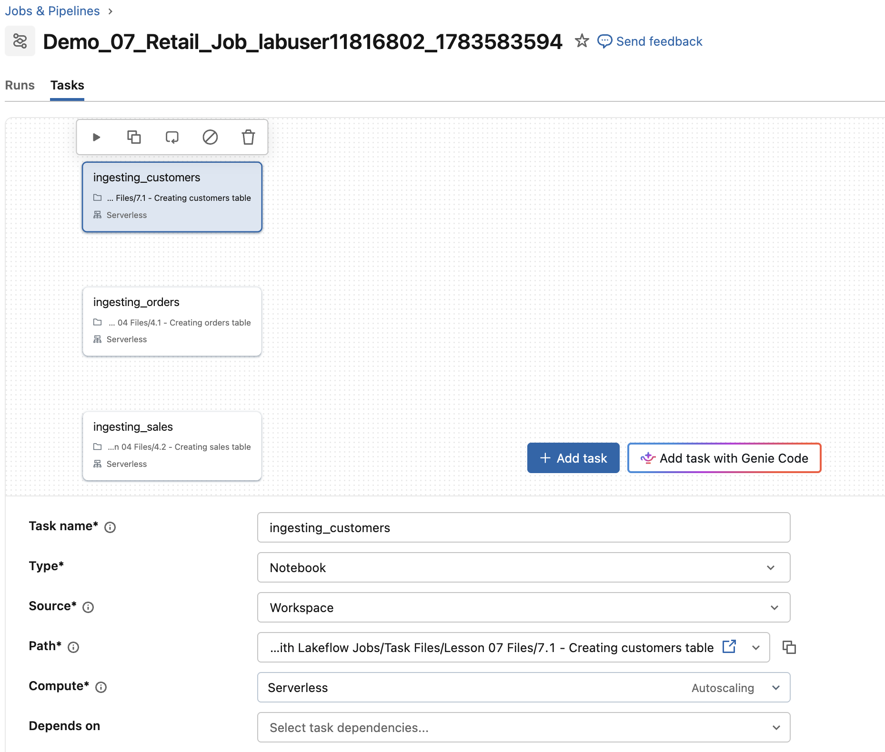

## D. Den Job erstellen

Führen Sie die folgenden Schritte aus, um Ihrem Retail Job einen neuen Task hinzuzufügen

### D1. Den Starter-Job erstellen

```python
## Erstellt den Starter-Job aus dem Ende von '04 Demo - Creating a Job Using Lakeflow Jobs UI'

job_tasks = [
    {
        'task_name': 'ingesting_orders',
        'file_path': '/Task Files/Lesson 04 Files/4.1 - Creating orders table',
        'depends_on': None
    },
    {
        'task_name': 'ingesting_sales',
        'file_path': '/Task Files/Lesson 04 Files/4.2 - Creating sales table',
        'depends_on': None
    }
]
 
myjob = DAJobConfig(job_name=f"Demo_07_Retail_Job_{DA.schema_name}",
                        job_tasks=job_tasks,
                        job_parameters=[])
```

### D2. Ihre Job-Details bestätigen
Führen Sie die folgenden Schritte aus, um zu bestätigen, dass der neue Starter-Job, der mit **Demo_07** beginnt, erfolgreich erstellt wurde und dem Job aus **04 Demo - Creating a Job Using Lakeflow Jobs UI** entspricht:

   a. Klicken Sie in der linken Navigationsleiste mit der rechten Maustaste auf **Jobs and Pipelines** und wählen Sie *Open Link in New Tab*.

   b. Bestätigen Sie, dass Sie den Job **Demo_07_Retail_Job_your-labuser-name** sehen. Klicken Sie auf den Job, um ihn zu öffnen.

   c. Wählen Sie in der oberen Navigationsleiste **Tasks**. Der Job sollte zwei Tasks namens **ingesting_orders** und **ingesting_sales** enthalten.

   d. Sehen Sie sich den Abschnitt **Job details** des Jobs an. Bestätigen Sie, dass der Modus **Performance optimized** aktiviert ist.

   e. Beachten Sie, dass dies derselbe Job ist, der in **04 Demo - Creating a Job Using Lakeflow Jobs UI** erstellt wurde.

   f. Lassen Sie die Job-Seite geöffnet und kehren Sie zu den folgenden Anweisungen zurück.

### D3. Dem Starter-Job einen neuen Task hinzufügen

Bisher haben wir in unserem Job zwei Tabellen ingestiert. 

Als Nächstes fügen wir über einen Notebook-Task eine neue Tabelle hinzu

1. Sehen Sie sich das Notebook an, das Sie Ihrem Job hinzufügen werden.

   Sie finden das Notebook unter **Task Files** > **Lesson 07 Files** > **7.1 - Creating customers table**. 

**HINWEIS:** Direkter Link zum Notebook: [Task Files/Lesson 07 Files/7.1 - Creating customers table]($./Task Files/Lesson 07 Files/7.1 - Creating customers table)

2. Führen Sie die folgenden Schritte aus, um das Notebook **7.1 - Creating customers table** als Task zu Ihrem Job hinzuzufügen.

   a. Wenn Sie sich nicht in Ihrem Job **Demo_07_Retail_Job_your-labuser-name** befinden, klicken Sie in der Seitenleiste mit der rechten Maustaste auf die Schaltfläche **Jobs and Pipelines** und wählen Sie *Open Link in New Tab*.

   b. Suchen Sie den Job **Demo_07_Retail_Job_your-labuser-name** und wechseln Sie zum Tab **Tasks**. 

   c. Klicken Sie auf **Add task** und wählen Sie dann **Notebook**.

   d. Konfigurieren Sie den Task wie unten angegeben und klicken Sie auf **Create task**, um den Task zu speichern:

| Einstellung | Anweisungen |
|-----------|--------------|
| **Task name** | Geben Sie **ingesting_customers** ein |
| **Type**      | Stellen Sie sicher, dass **Notebook** ausgewählt ist |
| **Source**    | Stellen Sie sicher, dass **Workspace** ausgewählt ist |
| **Path**      | Geben Sie mit dem Navigator den Pfad zu [Task Files/Lesson 07 Files/7.1 - Creating customers table]($./Task Files/Lesson 07 Files/7.1 - Creating customers table) an|
| **Compute**   | Wählen Sie im Dropdown-Menü einen **Serverless**-Cluster. (Wir verwenden in diesem Kurs Serverless-Cluster für Jobs. Außerhalb dieses Kurses können Sie bei Bedarf einen anderen Cluster angeben.) |
| **Depends On**| Keine |


