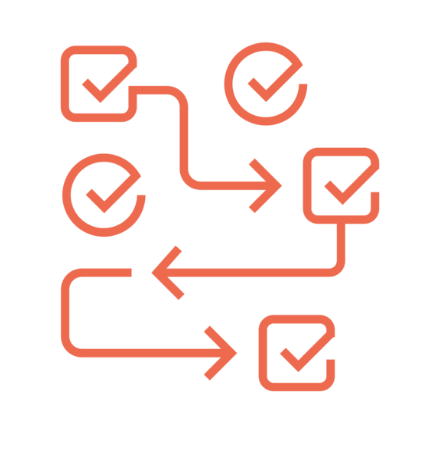
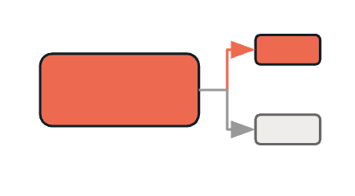
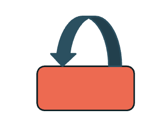

## A. Überblick – Fortgeschrittene Task-Typen

Wir betreten nun den Bereich intelligenter Workflows, die Entscheidungen treffen und ihr Verhalten an Laufzeitbedingungen anpassen können. Dies sind nicht einfach lineare Abfolgen von Tasks – es sind dynamische Workflows, die sich verzweigen, Schleifen durchlaufen und auf Basis von Daten und Verarbeitungsergebnissen intelligente Entscheidungen treffen können.
Diese Fähigkeit verwandelt Ihre Workflows von einfacher Automatisierung in intelligente Datenverarbeitungssysteme. Drei fortgeschrittene Task-Typen ermöglichen anspruchsvolle Workflow-Muster:

### Run-if Conditional Task Dependencies

### If/Else Tasks

### For Each Tasks

##### Zusätzliche Hinweise
Drei fortgeschrittene Task-Typen ermöglichen anspruchsvolle Workflow-Muster:
- Run-if Conditional Task Dependencies: Steuern die Task-Ausführung auf Basis der Ergebnisse vorgelagerter Tasks und ermöglichen Workflows, die mit Teilausfällen und komplexen Abhängigkeitsszenarien umgehen können.
- If/Else Tasks: Implementieren boolesche Bedingungslogik direkt in Ihrem Workflow und ermöglichen Verzweigungen auf Basis von Datenbedingungen, Verarbeitungsergebnissen oder Geschäftsregeln.
- For Each Tasks: Ermöglichen iterative Verarbeitungsmuster, bei denen dieselbe Logik auf mehrere Datenpartitionen oder Parameter angewendet wird, mit konfigurierbarer Parallelität zur Performance-Optimierung.

Diese Task-Typen lassen sich kombinieren, um anspruchsvolle Workflows zu erstellen, die komplexe Geschäftslogik abbilden und dabei übersichtlich und wartbar bleiben.

