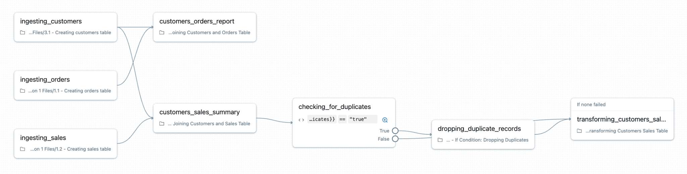

## C. If-Else-Task

If/Else-Tasks ermöglichen die direkte Umsetzung von Geschäftslogik in Ihren Workflows und gehen über einfache Erfolgs-/Fehlerbedingungen hinaus hin zu datengetriebenen Entscheidungen.

##### Klicken Sie auf die hervorgehobenen Felder, um die Task-Logik anzuzeigen.

### Bedingte If/Else-Tasks

- Fügt Ihrem Workflow boolesche Bedingungslogik auf Basis von Task-Ergebnissen hinzu
- Ermöglicht Verzweigungen auf Basis bestimmter Bedingungen, etwa Datenqualitätsprüfungen und Datensatzanzahlen
- Verwendet boolesche Operatoren: **==**, **!=**, **>**, **>=**, **<**, **<=**

### Verhalten der Bedingung

Wenn keine Abhängigkeit fehlgeschlagen ist und mindestens ein Task ausgeführt wurde.
Die Bedingung stellt sicher, dass die bedingte Auswertung nur dann erfolgt, wenn aussagekräftige vorgelagerte Ergebnisse vorliegen.

##### Zusätzliche Hinweise
Bedingte If/Else-Tasks fügen Workflows anspruchsvolle boolesche Logik hinzu:

- **Auswertung der Bedingung:** Boolesche Operatoren (==, !=, >, >=, <, <=) werten Ausdrücke gegen Task-Ergebnisse, Parameterwerte oder berechnete Kennzahlen aus.
- **Beispiele für Geschäftslogik:** Datenqualitäts-Gates: Verzweigung basierend auf Datensatzanzahlen, Null-Anteilen oder Validierungsergebnissen
- Entscheidungen nach Verarbeitungsvolumen: Unterschiedliche Verarbeitungsstrategien für große vs. kleine Datensätze verwenden
- Umgebungsspezifische Logik: Je nach Umgebungsparametern unterschiedliche Tasks ausführen
- Umsetzung von Geschäftsregeln: Komplexe Geschäftsregeln direkt in der Workflow-Logik implementieren
**Ausführungsvoraussetzungen:** Die Bedingung „If none of dependency failed and at least one task executed“ stellt sicher, dass die bedingte Auswertung nur dann erfolgt, wenn aussagekräftige vorgelagerte Ergebnisse vorliegen.**True/False-Zweige:** Jeder Zweig kann mehrere Tasks enthalten und ermöglicht so komplexe Verarbeitungspfade auf Basis bedingter Ergebnisse.

