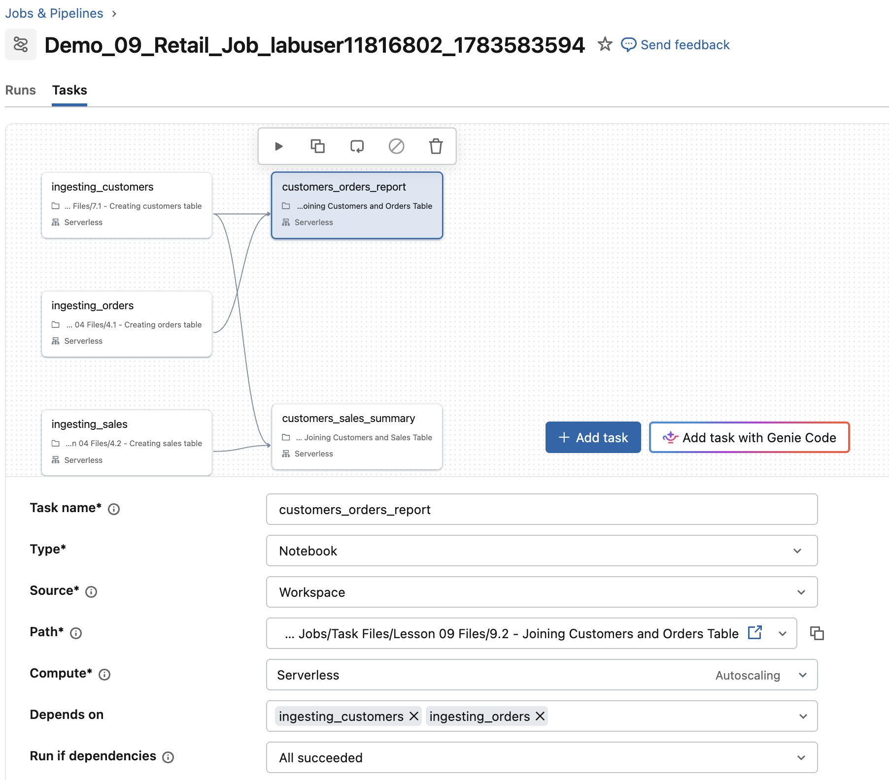

## D. Einen Task zum Job hinzufügen
Führen Sie die folgenden Schritte aus, um Ihrem Retail Job einen neuen Task hinzuzufügen

### D1. Den Starter-Job erstellen
1. Als Nächstes fügen wir die unten aufgeführten Notebooks mithilfe des Databricks SDK als Tasks zu unserem Job hinzu. Dieser Ansatz erspart das manuelle Hinzufügen von Notebook-Tasks, da wir das bereits in früheren Demonstrationen und Labs gemacht haben:

   - **9.1 - Joining Customers and Sales Table**  

   - **9.2 - Joining Customers and Orders Table**  

   Führen Sie die folgende Zelle aus, um den Starter-Job zu erstellen, den wir in diesem Kurs kontinuierlich weiterentwickeln. Diese Befehle richten Ihren Job mit allen bisher erledigten Arbeiten ein und fügen die für diese Demonstration benötigten Tasks hinzu.

```python
job_tasks = [
        {
            'task_name': 'ingesting_orders',
            'file_path': '/Task Files/Lesson 04 Files/4.1 - Creating orders table',
            'depends_on': None
        },
        {
            'task_name': 'ingesting_sales',
            'file_path': '/Task Files/Lesson 04 Files/4.2 - Creating sales table',
            'depends_on': None
        },
        {
            'task_name': 'ingesting_customers',
            'file_path': '/Task Files/Lesson 07 Files/7.1 - Creating customers table',
            'depends_on': None
        }
        ,{
            'task_name': 'customers_sales_summary',
            'file_path': '/Task Files/Lesson 09 Files/9.1 - Joining Customers and Sales Table',
            'depends_on': [
                        {'task_key':'ingesting_customers'},
                        {'task_key': 'ingesting_sales'}
                        ]
        }
        ,{
            'task_name' : 'customers_orders_report',
            'file_path': '/Task Files/Lesson 09 Files/9.2 - Joining Customers and Orders Table',
            'depends_on': None
        }
    ]

myjob = DAJobConfig(job_name=f"Demo_09_Retail_Job_{DA.schema_name}",
                    job_tasks=job_tasks,
                    job_parameters=[
                        {'name':'catalog', 'default':'dbacademy'},
                        {'name':'schema', 'default':f'{DA.schema_name}'}
                    ])
```

### D2. Abhängigkeiten für die Tasks festlegen

In diesem Schritt ändern wir den bestehenden Job, um Task-Abhängigkeiten zu definieren. Konkret konfigurieren wir den Haupt-Task so, dass er erst ausgeführt wird, nachdem alle vorhergehenden Tasks erfolgreich abgeschlossen wurden.

Führen Sie die folgenden Schritte aus, um den Job zu überprüfen und für den Task **customers_orders_report** die folgenden Abhängigkeiten festzulegen:
   - **ingesting_orders**
   - **ingesting_customers**

1. Navigieren Sie zu **Jobs and Pipelines** und öffnen Sie es in einem neuen Tab.

2. Wählen Sie Ihren neuen Job, der mit **Demo_09_Retail_Job_labuser** beginnt.

3. Klicken Sie in der oberen Navigationsleiste auf **Tasks**.

4. Überprüfen Sie Ihren Job. Sie sollten fünf Tasks sehen: 
   - **customers_orders_report**.
   - **ingesting_customers**, 
   - **ingesting_orders**, 
   - **ingesting_sales**, 
   - **customers_sales_summary**,

5. Wählen Sie den Task **customers_sales_summary**. 
   - Beachten Sie, dass er von zwei Tasks abhängt – **ingesting_customers** und **ingesting_sales** –, wobei die Abhängigkeit auf **All Succeeded** gesetzt ist.

6. Wählen Sie als Nächstes den Task **customers_orders_report** und legen Sie die folgenden Task-Optionen fest: 

   - Fügen Sie unter **Depends on** die Tasks **ingesting_orders** und **ingesting_customers** hinzu

   - Setzen Sie unter **Run if dependencies** die Abhängigkeit auf **All Succeeded**.

   - Wählen Sie **Save task**.

7. Klicken Sie auf **Run_now**, um den Job auszuführen.

#### Endgültige Abhängigkeiten

