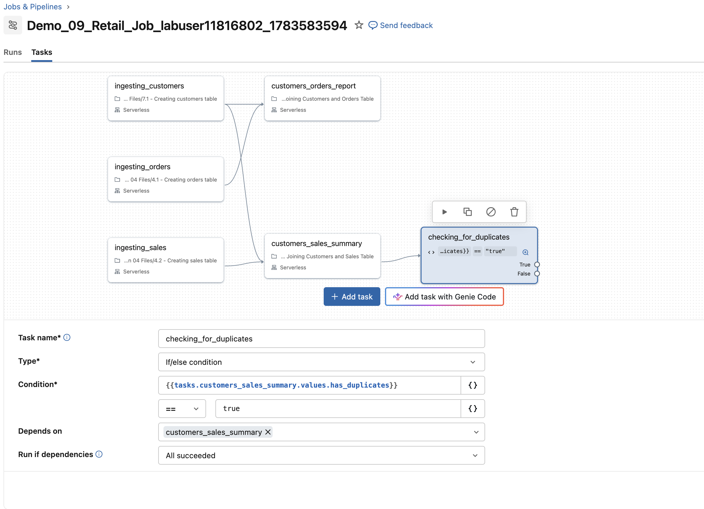
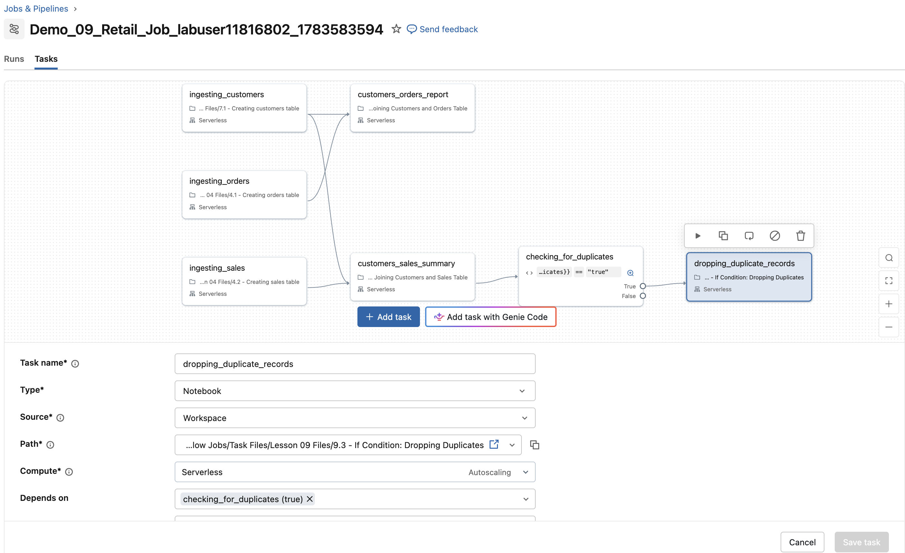
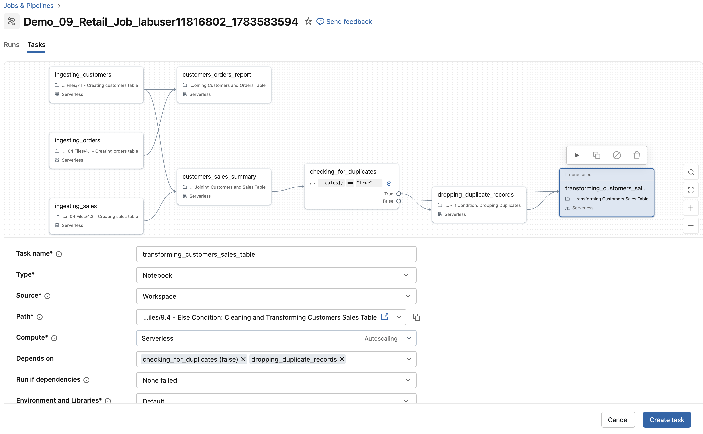
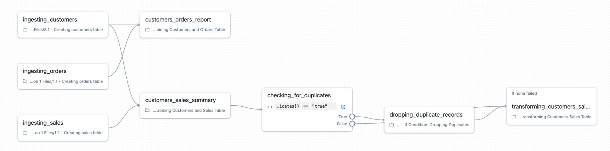

## E. Einen bedingten If/Else-Task hinzufügen

In diesem Abschnitt fügen Sie Ihrem Job einen bedingten Task hinzu, der die Tabelle **customers_sales_silver** (Task **customers_sales_summary**) auf doppelte Datensätze prüft. 

Je nach Ergebnis verzweigt der Workflow, um Duplikate angemessen zu behandeln.

### E1. Logik zur Duplikatprüfung

1. Rufen Sie sich die Logik in Erinnerung, mit der Duplikate in der Tabelle **customers_sales_silver** erkannt werden. (Der Task **customers_sales_summary** erstellt die Tabelle **customers_sales_silver**.)

2. In diesem Notebook prüfen wir, ob die Tabelle **customers_sales_silver** doppelte Datensätze enthält. Werden Duplikate gefunden, wird das Ergebnis dieser Prüfung (ein boolescher Wert) als `has_duplicates` in der Task-Ausgabe gespeichert.

**Code-Referenz:**

df = spark.sql("""
SELECT * FROM customers_sales_silver
""")

duplicate_exists = df.count() > df.dropDuplicates().count()

dbutils.jobs.taskValues.set(key="has_duplicates", value=duplicate_exists)

**Notebook zur Referenz:**  
[Task Files/Lesson 09 Files/9.1 - Joining Customers and Sales Table]($./Task Files/Lesson 09 Files/9.1 - Joining Customers and Sales Table)

### E2. Einen bedingten If/Else-Task erstellen

Erstellen Sie einen **If/else conditional**-Task, um festzulegen, was ausgeführt wird, je nachdem, ob doppelte Datensätze gefunden werden.

1. Wählen Sie in Ihrem Job **Demo_09_Retail_Job_labuser** die Option **Add task**.

2. Scrollen Sie im Dialogfeld nach unten zum Abschnitt **Advanced** und wählen Sie den Task-Typ **If/else condition**.

3. Benennen Sie den neuen Task **checking_for_duplicates**.

4. Setzen Sie den Wert **Depend on** auf den Task **customers_sales_summary**.

5. Verwenden Sie für das Feld **Condition** den Parameterwert, der im Task `customers_sales_summary` erstellt wurde:

**Dynamic Value References:**
   Diese Syntax nutzt Dynamic Value References, um auf Ausgabevariablen früherer Tasks in Ihrem Job zuzugreifen. Wenn ein Task läuft (wie `customers_sales_summary`), stehen seine Ergebnisse – einschließlich der vom Task registrierten oder ausgegebenen Variablen (wie `has_duplicates`) – für nachgelagerte Tasks zur Verfügung.

**Indem Sie** `tasks.customers_sales_summary.values.has_duplicates` referenzieren, übergeben Sie den Wert (ob Duplikate existieren) dynamisch an die If/Else-Bedingung. Das ermöglicht bedingte Verzweigungen auf Basis von Laufzeitdaten statt statischer Konfiguration und macht Ihren Workflow anpassungsfähig und reaktionsfähig gegenüber den tatsächlichen Ergebnissen.

**Das Feld Condition ausfüllen:** 
- Um den Parameterwert manuell hinzuzufügen, wählen Sie `{}` im Feld **Condition**. 
- Suchen Sie `tasks.customers_sales_summary.values` und klicken Sie darauf; es wird automatisch das Suffix `my_value` angehängt.
- Ersetzen Sie `my_value` durch den im Notebook erstellten Task-Parameter: `has_duplicates`.

6. Legen Sie dann die Bedingung fest, die prüft, ob dieser Wert `== true` ist

7. Wählen Sie **Save task**, um den bedingten Task zu erstellen.

##### IF/ELSE-CONDITION-TASK

### E3. Den Task für die True-Bedingung (Duplikate vorhanden) festlegen

Führen Sie die folgenden Schritte aus, um einen Task hinzuzufügen, der **nur ausgeführt wird, wenn Duplikate gefunden werden** (`tasks.customers_sales_summary.values.has_duplicates == true`).

1. Wählen Sie den Task **checking_for_duplicates**.

2. Klicken Sie auf **Add task** und wählen Sie **Notebook**.

3. Benennen Sie den neuen Task **dropping_duplicate_records**.

4. Verwenden Sie das Notebook [9.3 - If Condition: Dropping Duplicates]($./Task Files/Lesson 09 Files/9.3 - If Condition: Dropping Duplicates) als Task-Quelle.  
   - Dieses Notebook enthält Logik zum Entfernen doppelter Datensätze aus der Tabelle **customers_sales_silver**.

5. Legen Sie im Feld **Depends on** fest, dass dieser Task vom **True**-Zweig des Tasks **checking_for_duplicates** abhängt (`checking_for_duplicates (true)`).

6. Klicken Sie auf **Create Task** 

##### TASK MIT TRUE-ABHÄNGIGKEIT

### E4. Den Task für die False-Bedingung (keine Duplikate) festlegen

Führen Sie die folgenden Schritte aus, um einen Task hinzuzufügen, der nur ausgeführt wird, wenn keine Duplikate gefunden werden (`tasks.customers_sales_summary.values.has_duplicates == false`).

Dieses Setup stellt sicher, dass Ihr Job Duplikate automatisch behandelt, falls vorhanden, oder mit der Datentransformation fortfährt, wenn keine Duplikate gefunden werden.

1. Wählen Sie den Task **checking_for_duplicates**.

2. Klicken Sie auf **Add task** und wählen Sie **Notebook**.

3. Benennen Sie den neuen Task **transforming_customers_sales_table**.

4. Verwenden Sie das Notebook [Task Files/Lesson 09 Files/9.4 - Else Condition: Cleaning and Transforming Customers Sales Table]($./Task Files/Lesson 09 Files/9.4 - Else Condition: Cleaning and Transforming Customers Sales Table) als Task-Quelle.  
   - Dieses Notebook enthält Logik zum Bereinigen und Transformieren der Tabelle **customers_sales_silver**.

5. Legen Sie im Feld **Depends on** fest, dass dieser Task von Folgendem abhängt:
   - Dem **False**-Zweig des Tasks **checking_for_duplicates** (`checking_for_duplicates (false)`).
   - Dem Task **dropping_duplicate_records**.

6. Wählen Sie im Feld **Run if dependencies** die Option **None Failed**.  
   - Das stellt sicher:
- Wenn keine Duplikate vorhanden sind, läuft die Transformation sofort.
- Wenn Duplikate vorhanden sind, führt der Job den Task **dropping_duplicate_records** aus und fährt dann mit dem Transformations-Task **transforming_customers_sales_table** fort.

7. Klicken Sie auf **Create Task**.

8. Klicken Sie auf die Schaltfläche **Run now**, um den Job auszuführen

##### TASK MIT FALSE-ABHÄNGIGKEIT

### E5. Job-Bestätigung  
Bestätigen Sie, dass Ihr Job nach dem Hinzufügen der **If/else condition** und der zugehörigen Tasks wie folgt aussieht:

