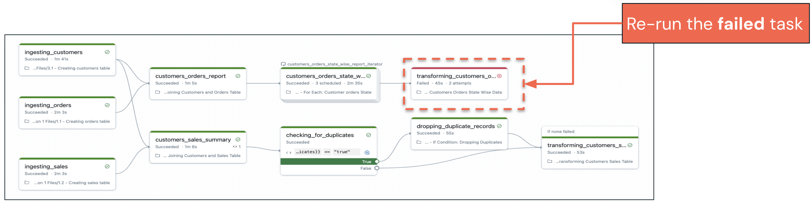
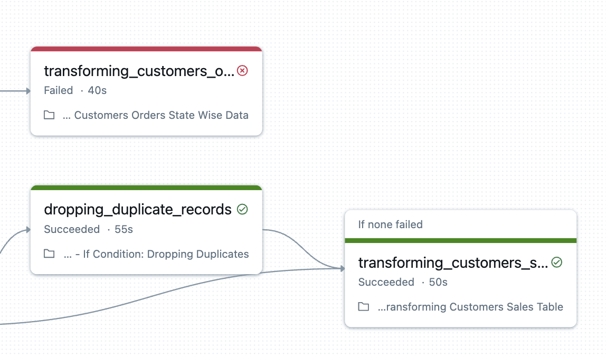
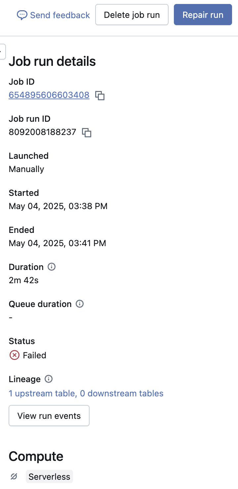
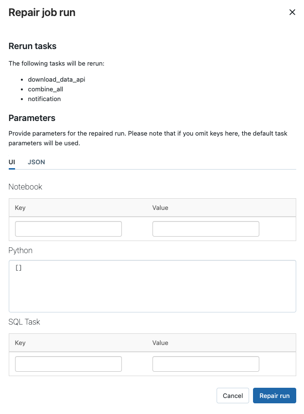
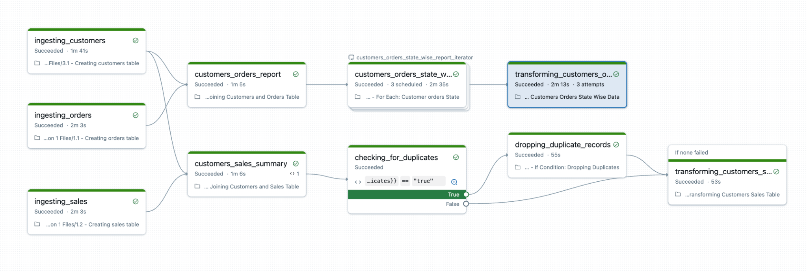

## A. Umgang mit Task-Fehlern

### A1. Reparieren und erneut ausführen

Fehlerbehandlung bedeutet nicht nur, Tasks neu zu starten – es geht darum, robuste Systeme zu bauen, die sich effizient erholen und die Datenkonsistenz auch dann wahren, wenn Komponenten ausfallen.

Die **Repair**-Funktion ermöglicht es, Tasks **erneut auszuführen** und Task-Parameter zu überschreiben

**Verringert den Zeit-** und Ressourcenaufwand für die Wiederherstellung nach fehlgeschlagenen Job-Runs

Bei einem **Task-Fehler** können Sie:

- den **Task** ändern und erneut ausführen
- die **Parameter** ändern und erneut ausführen

##### Zusätzliche Hinweise
**Die Repair-Funktion steht für einen ausgefeilten Ansatz zur Fehlerbehebung:**

- **Gezielte Wiederherstellung:** Anstatt ganze Workflows neu zu starten, können Sie bestimmte fehlgeschlagene Tasks ändern und nur das Nötige erneut ausführen. Das spart erheblich Zeit und Rechenressourcen.
- **Überschreiben von Parametern:** Die Möglichkeit, Parameter während Repair-Runs zu ändern, erlaubt es Ihnen, Konfigurationsprobleme zu beheben, die Ressourcenzuweisung anzupassen oder die Verarbeitungslogik zu ändern, ohne den gesamten Job neu aufzubauen.
- **Wiederherstellungsszenarien:**
- **Konfigurationskorrekturen:** Parameterwerte korrigieren, die Task-Fehler verursacht haben
- **Ressourcenanpassungen:** Arbeitsspeicher oder Compute-Ressourcen für Tasks erhöhen, die aufgrund von Ressourcenengpässen fehlgeschlagen sind
- **Code-Updates:** Korrekturen für Logikfehler bereitstellen und nur betroffene Tasks erneut ausführen
- **Datenqualitätsprobleme:** Die Verarbeitungslogik anpassen, um während der Ausführung entdeckte Datenqualitätsprobleme zu behandeln

**Kosteneffizienz:** Indem Sie nur fehlgeschlagene Tasks erneut ausführen, minimieren Sie unnötige Berechnungen und senken die Kosten – besonders wichtig bei großen, komplexen Workflows.

### A2. Repair Run (Reparatur-Lauf)

Klicken Sie auf die hervorgehobenen Felder, um zu erfahren, wie Sie einen Task reparieren.

Ermöglicht es Ihnen, **nur fehlgeschlagene Tasks auszuführen**, und spart Zeit und Geld, da nur die notwendigen Tasks statt des gesamten Jobs erneut ausgeführt werden

Klicken Sie auf den hervorgehobenen fehlgeschlagenen Task, um die Details des Job-Runs zu öffnen.
Klicken Sie auf die hervorgehobene Schaltfläche **Repair run**, um den Bereich für den Repair-Job-Run anzuzeigen.

##### Zusätzliche Hinweise
**Die selektive erneute Ausführung bietet enorme operative Vorteile:**

- **Ressourcenoptimierung:** Wenn nur fehlgeschlagene Tasks statt ganzer Workflows ausgeführt werden, kann die Wiederherstellungszeit in komplexen Pipelines um 80–90 % sinken – das spart Zeit und Geld.
- **Geringeres Risiko:** Kleinere Wiederherstellungsvorgänge belasten die Systemressourcen weniger und verringern das Risiko von Kaskadenfehlern während der Wiederherstellungsversuche.
- **Schnellere Behebung:** Teams können schneller auf Fehler reagieren, wenn sie nicht auf den Abschluss ganzer Workflows warten müssen, was die Einhaltung von SLAs und die geschäftliche Reaktionsfähigkeit verbessert.

**Beachten Sie, dass das Reparieren eines Tasks nicht das Reparieren des Jobs bedeutet.**
Beispiel: Wenn Sie einen falschen Parameter übergeben und ihn mit der Repair-Run-Funktion korrigieren, müssen Sie ihn trotzdem noch in Ihrem Job anpassen.

### A3. Nach dem Repair Run

Nach der erneuten Ausführung des Tasks sieht Ihr endgültiger Job so aus.

##### Zusätzliche Hinweise
- **Audit Trail**: Vollständige Transparenz darüber, was wann und von wem repariert wurde – wichtige Informationen für Fehlerbehebung und Prozessverbesserung.
- **Erfolgsvalidierung**: Klare Anzeige, welche Tasks erfolgreich wiederhergestellt wurden, was Vertrauen in den Repair-Prozess schafft.
- **Lernchancen**: Historische Repair-Daten helfen Teams, Fehlermuster zu erkennen und das ursprüngliche Job-Design zu verbessern, um künftige Probleme zu vermeiden.

