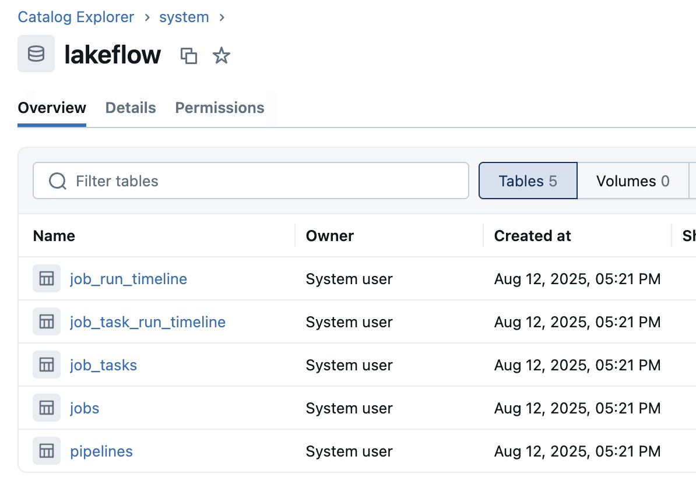
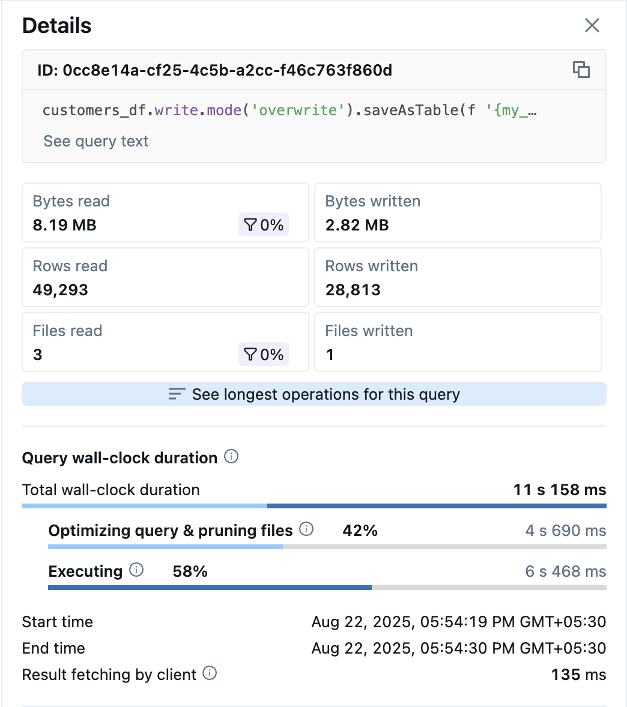
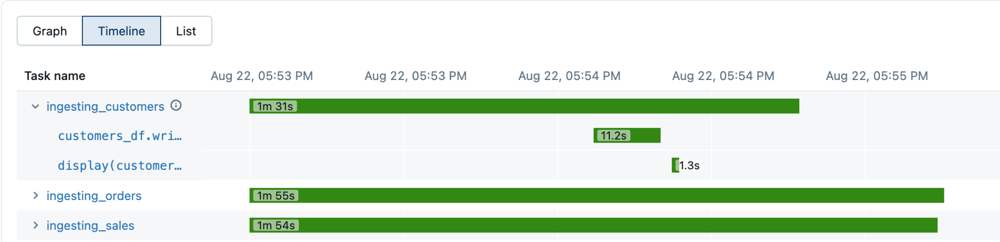

## B. Job-Performance überwachen

Fehlerbehandlung bedeutet nicht nur, Tasks neu zu starten – es geht darum, robuste Systeme zu bauen, die sich effizient erholen und die Datenkonsistenz auch dann wahren, wenn Komponenten ausfallen.

Wählen Sie unten die einzelnen Tabs aus, um mehr über die Überwachung der Job-Performance zu erfahren.

System Tables
Spark UI

### system.lakeflow
**system.lakeflow** ist ein eingebauter, schreibgeschützter Katalog, der sämtliche Job-Aktivitäten über alle Workspaces in der Region protokolliert.

### Timeline-Tabellen
Timeline-Tabellen unterteilen lange Runs mithilfe von **period_start_time** und **period_end_time** in Stundenabschnitte und ermöglichen so zuverlässige Analysen von Dauer, Parallelität und SLAs.

### Wichtige Tabellen

| Tabelle | Beschreibung |
| --- | --- |
| `jobs` | Grundlegende Job-Informationen |
| `job_tasks` | Grundlegende Task-Definitionen |
| `job_run_timeline` | Jeder Job-Run im Zeitverlauf |
| `job_task_run_timeline` | Jeder Task-Run im Zeitverlauf |
| `Pipelines` | Grundlegende Pipeline-Informationen |

### Abfrage-/Code-Details

### Timeline

- Die **Timeline** im Job-Run hebt Start/Ende, Dauer und Überschneidungen von Tasks hervor, um Engpässe schnell zu erkennen.
- Klicken Sie auf einen Task, um Status, Zeitstempel, Dauer, Cluster/Runtime, Logs und eine kurze I/O-Übersicht zu sehen.
- Klicken Sie auf die **Query/Code**-Details, um den vollständigen Text, die Run-ID, die Aufteilung der Laufzeit (Optimieren/Pruning vs. Ausführen), Details zu gelesenen/geschriebenen Dateien, Dateien & Partitionen sowie Spill-Details zu sehen.
**Hohe Planungszeit**

Pruning/Partitionierung verbessern**Hohe Ausführungszeit**

Joins/Aggregationen optimieren (Broadcast, Skew-Korrekturen)

##### Zusätzliche Hinweise
Der Katalog **system.lakeflow** bietet Monitoring-Funktionen auf Enterprise-Niveau:
- **Umfassendes Logging:** Sämtliche Job-Aktivitäten über alle Workspaces in der Region werden automatisch protokolliert und bieten vollständige Transparenz über Ausführungsmuster und Performance-Trends von Workflows.
- **Timeline-Analyse:** Timeline-Tabellen verwenden **period_start_time** und **period_end_time**, um lang laufende Jobs in Stundenabschnitte zu unterteilen, und ermöglichen so eine genaue Analyse der Dauer, die Verfolgung der Parallelität und SLA-Messungen – auch für komplexe, lang laufende Workflows.
- **Funktionen der wichtigsten Tabellen:** **jobs:** Grundlegende Job-Metadaten und Konfigurationsinformationen
- **job_tasks:** Task-Definitionen und Konfigurationsdetails
- **job_run_timeline:** Vollständige Ausführungshistorie für jeden Job-Run
- **job_task_run_timeline:** Detaillierte Ausführungshistorie für einzelne Tasks
- **pipelines:** Informationen über Delta-Live-Tables-Pipelines
**Analysemöglichkeiten:** Diese Daten ermöglichen anspruchsvolle Analysen, darunter Kostenanalysen, Performance-Trends, die Verfolgung der SLA-Einhaltung und die Optimierung der Ressourcennutzung.

Die Spark UI bietet detaillierte Performance-Einblicke zur Optimierung:
- **Timeline-Analyse:** Die Ausführungs-Timeline hebt sofort Task-Dauer, Überschneidungen und Engpässe hervor und ermöglicht so eine schnelle Identifizierung von Performance-Problemen.
- **Details auf Task-Ebene:** Ein Klick auf einzelne Tasks zeigt umfassende Informationen wie Ausführungszeitstempel, Ressourcennutzung, Cluster-Konfiguration, Logs und I/O-Statistiken.
- **Details zur Abfrage-Performance:** Eine detaillierte Abfrageanalyse zeigt Ausführungspläne, Optimierungsentscheidungen, Dateizugriffsmuster, Partitionsinformationen und Details zu Daten-Spills – unverzichtbar für das Performance-Tuning.
- **Umsetzbare Erkenntnisse:** **Hohe Planungszeit:** Weist auf den Bedarf an besseren Partitionierungsstrategien oder Metadaten-Optimierung hin
- **Hohe Ausführungszeit:** Deutet auf Optimierungsmöglichkeiten bei Joins, Broadcast-Strategien oder der Behandlung von Skew hin
- **Ressourcenengpässe:** Identifiziert Speicher-, CPU- oder I/O-Engpässe, die Anpassungen der Cluster-Konfiguration erfordern

