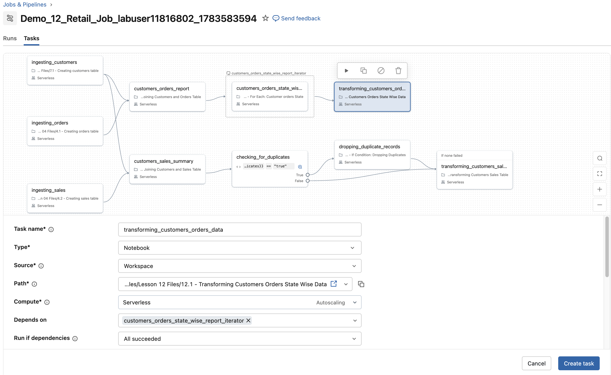
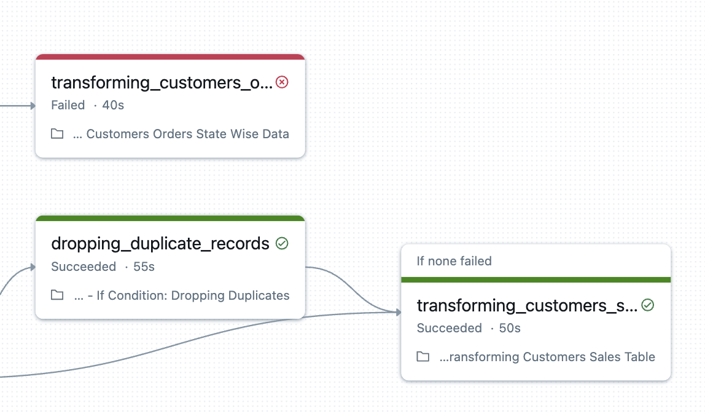

## E. Einen Notebook-Task zu unserem Retail Job hinzufügen 
1. Klicken Sie in der Seitenleiste mit der rechten Maustaste auf die Schaltfläche **Jobs and Pipelines** und wählen Sie *Open Link in New Tab*.

2. Suchen Sie Ihren Job namens **Demo_12_Retail_Job_<-your schema name->**.

3. Wechseln Sie zum Tab **Tasks**, klicken Sie auf **Add task** und wählen Sie dann **Notebook**. Konfigurieren Sie den Task mit den folgenden Einstellungen:

| Einstellung  | Anweisungen |
|--------------|-------------|
| **Task name**    | Geben Sie **transforming_customers_orders_data** ein |
| **Type**         | Stellen Sie sicher, dass **Notebook** ausgewählt ist |
| **Source**       | Stellen Sie sicher, dass **Workspace** ausgewählt ist |
| **Path**         | Wählen Sie mit dem Navigator [./task files/Lesson 12 Files/12.1 - Transforming Customers Orders State Wise Data]($./Task Files/Lesson 12 Files/12.1 - Transforming Customers Orders State Wise Data) unter **Lesson 12 Files** |
| **Compute**      | Wählen Sie **Serverless** |
| **Depends on**   | Wählen Sie **customers_orders_state_wise_report_iterator** |
| **Dependencies** | Auf **All Succeeded** setzen |
| **Retries** | Klicken Sie auf Retries und **deaktivieren** Sie "Enable serverless auto-optimization (may include at most 3 retries)", **um Wiederholungen auszuschalten**.

4. Klicken Sie auf **Create Task**.

## F. Ihren Job ausführen
1. Führen Sie den Job aus, indem Sie oben rechts auf **Run now** klicken. 

2. Ein Pop-up-Fenster mit einem Link zum Job-Run erscheint. Klicken Sie auf **View run**.
- **HINWEIS:** Sie können auch den Tab **Runs** wählen und dann den Link unter **Start time** auswählen, um den **DAG** des Job-Runs anzuzeigen.

3. Beobachten Sie die Tasks im DAG. Die Farben ändern sich, um den Fortschritt des Tasks anzuzeigen (der Abschluss dauert etwa 2–3 Minuten):

* **Grau** – der Task wurde noch nicht gestartet
* **Grüne Streifen** – der Task läuft gerade
* **Durchgehend grün** – der Task wurde erfolgreich abgeschlossen
* **Dunkelrot** – der Task ist fehlgeschlagen
* **Hellrot** – ein vorgelagerter Task ist fehlgeschlagen, daher wurde der aktuelle Task nie ausgeführt

4. Wenn der Run beendet ist, beachten Sie, dass **transforming_customers_orders_data** fehlgeschlagen ist. Das war so zu erwarten.

