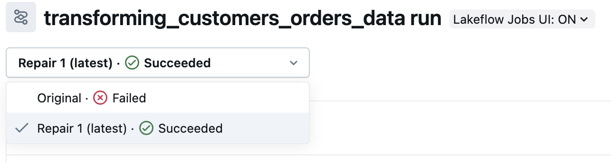

## H. Den Run überprüfen

Sobald Ihr Job-Run erfolgreich war, kehren Sie zu Ihrem Job zurück und klicken Sie auf den Tab **Runs**. Klicken Sie auf den neuesten Run und dann auf **transforming_customers_orders_data**. Oben links sehen Sie den Run-Status als Dropdown-Liste. Durch Klicken auf die einzelnen Optionen im Dropdown können Sie die Ausgabe Ihres Task-Runs sehen. Beachten Sie den Code-Unterschied zwischen dem erfolgreichen und dem fehlgeschlagenen Task. Im erfolgreichen Run sollten Sie den korrekten Spaltennamen (`customer_name`) sehen.

