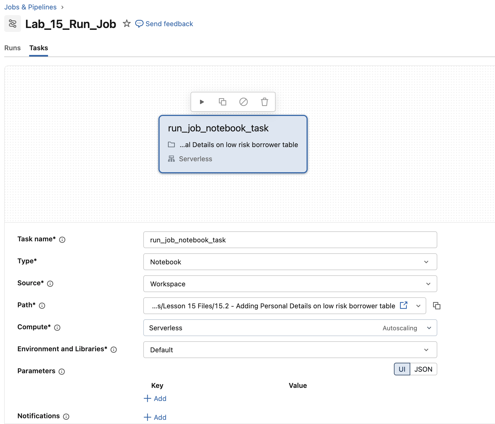

## D. Einen Run Job erstellen

Sie erstellen einen separaten Run Job, indem Sie die folgenden Schritte ausführen:

1. Klicken Sie in der linken Navigationsleiste mit der rechten Maustaste auf **Jobs and Pipelines** und öffnen Sie den Link in einem neuen Tab.
2. Klicken Sie auf **Create** und wählen Sie im Dropdown-Menü **Job**.
3. Benennen Sie Ihren Job **Lab_15_Run_Job**
3. Klicken Sie bei den empfohlenen Tasks auf den Task **Notebook** und konfigurieren Sie den Notebook-Task wie unten gezeigt:

| Einstellung  | Anweisungen |
|--------------|--------------|
| Task name    | Geben Sie **run_job_notebook_task** ein |
| Type         | Wählen Sie **Notebook** |
| Source       | Wählen Sie **Workspace** |
| Path         | Geben Sie mit dem Navigator den Pfad [Task Files/Lesson 15 Files/15.2 - Adding Personal Details on low risk borrower table]($./Task Files/Lesson 15 Files/15.2 - Adding Personal Details on low risk borrower table) an |
| Compute      | Wählen Sie **Serverless** |

